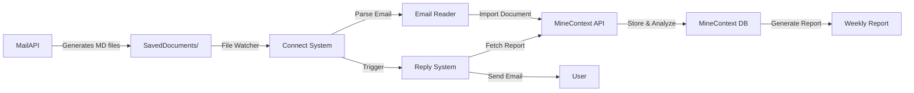

# Connect System

**Bridge between MailAPI, MineContext, and Reply**

Connect is an intelligent data synchronization system that automatically imports email documents from MailAPI into MineContext for analysis and triggers weekly report generation through the Reply system.

---

## 📋 Overview

Connect System acts as a bridge connecting three major components:

```
MailAPI (Email Processing) → Connect (Data Bridge) → MineContext (Analysis) → Reply (Report Sending)
```

### Key Features

- 📧 **Email Import**: Automatically read and parse email documents from MailAPI/SavedDocuments
- 🔄 **Real-time Sync**: Monitor directory for new emails and sync immediately  
- 🌐 **API Integration**: Use MineContext Web API for data import
- 📊 **Report Trigger**: Automatically trigger weekly report generation
- 🔍 **Duplicate Prevention**: Track processed files to avoid re-importing
- 📝 **Comprehensive Logging**: Detailed logs for troubleshooting

---

## 🚀 Quick Start

### 1. Install Dependencies

```bash
cd /Users/shenli/Projects/holly/ai-assistant/Connect
pip3 install -r requirements.txt
```

### 2. Configure Settings

Edit `config/config.yaml`:

```yaml
sync:
  mail_documents_dir: "../MailAPI/SavedDocuments"
  enable_watcher: true

minecontext:
  api_url: "http://localhost:8765"
  auth_token: "default_token"

reply:
  reply_dir: "../Reply"
```

### 3. Start MineContext Server

Ensure MineContext web server is running:

```bash
cd ../MineContext-main
python3 -m opencontext.server.opencontext
```

### 4. Run Connect System

```bash
# One-time sync
python3 main.py --mode once

# Watch mode (daemon)
python3 main.py --mode daemon

# Test connection
python3 main.py --test-connection

# Show statistics
python3 main.py --stats

# Trigger weekly report
python3 main.py --trigger-report
```

---

## 📁 Project Structure

```
Connect/
├── config/
│   ├── config.yaml          # System configuration
│   ├── .env.example         # Environment variables template
│   └── .env                 # Environment variables (create this)
├── src/
│   ├── __init__.py
│   ├── email_reader.py      # Read and parse email documents
│   ├── minecontext_client.py # MineContext API client
│   ├── reply_trigger.py     # Reply system trigger
│   ├── file_watcher.py      # File monitoring system
│   ├── sync_manager.py      # Synchronization orchestrator
│   └── utils.py             # Utility functions
├── logs/                    # Log files
├── data/
│   └── processed_files.json # Processed files tracking
├── main.py                  # Main entry point
├── requirements.txt         # Python dependencies
├── README.md               # This file
└── instruction.md          # Detailed specifications
```

---

## 💻 Usage

### Command Line Interface

```bash
# Show help
python3 main.py --help

# Sync all documents once
python3 main.py --mode once

# Run in daemon mode with file watcher
python3 main.py --mode daemon

# Test MineContext API connection
python3 main.py --test-connection

# Show synchronization statistics
python3 main.py --stats

# Trigger weekly report generation
python3 main.py --trigger-report

# Custom configuration file
python3 main.py --config custom_config.yaml

# Set log level
python3 main.py --log-level DEBUG
```

### Run Modes

#### 1. **Once Mode** (One-time sync)
Sync all unprocessed documents once and exit:
```bash
python3 main.py --mode once
```

#### 2. **Daemon Mode** (Watch directory)
Run continuously and watch for new files:
```bash
python3 main.py --mode daemon
```

---

## 🔧 Configuration

### config.yaml

```yaml
sync:
  mail_documents_dir: "../MailAPI/SavedDocuments"  # Email documents location
  enable_watcher: true                             # Enable file watcher
  sync_interval: 300                               # Sync interval (seconds)

minecontext:
  api_url: "http://localhost:8765"                 # MineContext API URL
  auth_token: "default_token"                      # API authentication token
  document_type: "email"                           # Document type tag
  auto_tag: true                                   # Auto-add tags
  tags: "email,mail_api,imported"                  # Default tags

reply:
  reply_dir: "../Reply"                            # Reply system directory
  auto_trigger: true                               # Auto-trigger reports
  trigger_schedule:
    day_of_week: "sun"                             # Sunday
    hour: 21                                       # 9 PM
    minute: 0

data:
  processed_files: "data/processed_files.json"     # Tracking file

logging:
  level: "INFO"                                    # Log level
  file: "logs/connect.log"                         # Log file location
```

### Environment Variables (.env)

```env
MINECONTEXT_API_URL=http://localhost:8765
MINECONTEXT_AUTH_TOKEN=default_token
MAIL_DOCUMENTS_DIR=../MailAPI/SavedDocuments
REPLY_DIR=../Reply
```

---

## 🔄 Integration Flow



---

## 📊 Components

### 1. Email Reader (`email_reader.py`)
- Parse Markdown email documents
- Extract metadata (subject, from, to, date)
- Extract body content
- Extract attachments and schedules
- Skip summary files

### 2. MineContext Client (`minecontext_client.py`)
- Connect to MineContext Web API
- Import email documents as Vault documents
- Format content for MineContext
- Trigger report generation

### 3. Reply Trigger (`reply_trigger.py`)
- Call Reply system via subprocess
- Pass command-line arguments
- Monitor execution status
- Handle timeouts and errors

### 4. File Watcher (`file_watcher.py`)
- Monitor SavedDocuments directory
- Detect new `.md` files
- Trigger automatic sync
- Filter summary files

### 5. Sync Manager (`sync_manager.py`)
- Orchestrate all components
- Track processed files
- Prevent duplicate imports
- Generate statistics
- Trigger weekly reports

---

## 🐛 Troubleshooting

### Issue 1: Cannot Connect to MineContext

**Error**: `Failed to connect to MineContext API`

**Solution**:
- Ensure MineContext server is running:
  ```bash
  cd ../MineContext-main
  python3 -m opencontext.server.opencontext
  ```
- Check API URL in `config/config.yaml`
- Test connection: `python3 main.py --test-connection`

### Issue 2: No Documents Found

**Error**: `No new documents to sync`

**Solution**:
- Check if MailAPI has generated documents
- Verify `mail_documents_dir` path in config
- Check permissions on SavedDocuments directory

### Issue 3: Reply Trigger Failed

**Error**: `Failed to trigger Reply system`

**Solution**:
- Ensure Reply directory exists
- Verify Reply/main.py is present
- Test Reply independently:
  ```bash
  cd ../Reply
  python3 main.py --help
  ```

### Issue 4: File Watcher Not Working

**Solution**:
- Check directory exists and is readable
- Ensure watchdog is installed: `pip3 install watchdog`
- Check logs for error messages

---

## 📈 Statistics

View synchronization statistics:

```bash
python3 main.py --stats
```

Output:
```
📊 Synchronization Statistics
========================================
Total files:      7
Email files:      6
Summary files:    1
Processed:        0
Pending:          6
========================================
```

---

## 🔐 Security

- **API Authentication**: Uses Bearer token for MineContext API
- **File Permissions**: Read-only access to email documents
- **Error Isolation**: Single file failure doesn't affect others
- **Log Sanitization**: Sensitive content not logged

---

## 📝 Logging

Logs are written to `logs/connect.log`:

```
2026-01-10 23:15:30,293 - src.email_reader - INFO - Initialized email reader
2026-01-10 23:15:30,296 - src.sync_manager - INFO - Processing new email document
2026-01-10 23:15:30,500 - src.minecontext_client - INFO - Successfully imported email
```

Log levels: DEBUG, INFO, WARNING, ERROR

---

## 🚦 Exit Codes

- `0`: Success
- `1`: Fatal error or failure

---

## 🔮 Future Enhancements

- [ ] Batch import optimization
- [ ] Web management interface
- [ ] Multi-user support
- [ ] Email content analysis
- [ ] Custom sync rules
- [ ] Retry mechanism for failed imports
- [ ] Email notification on errors

---

## 📄 License

This project is part of the ai-assistant system for the AI Innovation Competition.

---

## 🤝 Integration with Other Systems

### With MailAPI
- Reads from `MailAPI/SavedDocuments/`
- Supports all email Markdown formats
- Skips summary files automatically

### With MineContext
- Uses HTTP API (port 8765)
- Creates Vault documents with "email" type
- Automatic tagging and categorization

### With Reply
- Calls via subprocess
- Passes `--mode once --week current`
- Monitors execution status

---

## 📞 Support

For issues or questions:
1. Check logs in `logs/connect.log`
2. Run with `--log-level DEBUG` for detailed output
3. Test individual components:
   - `--test-connection` for MineContext
   - `--stats` for sync status

---

**System Status**: ✅ Operational

Last Updated: 2026-01-10
