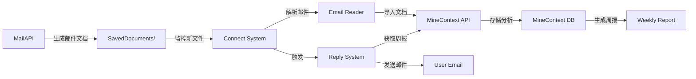

# Background（背景）
当前项目 ai-assistant 是一个帮助学生从邮件中整理并规划日程安排及信息的智能执行系统。
我们目前位于 `ai-assistant/Connect` 目录下。

**核心任务**：
1. 从 MailAPI/SavedDocuments 读取邮件处理结果（Markdown 文档）
2. 将邮件信息导入到 MineContext Web 应用中
3. 触发 MineContext 生成周报
4. 调用 Reply 系统发送周报给用户

**系统集成架构**：
```
MailAPI (邮件处理) → Connect (数据桥接) → MineContext (智能分析) → Reply (周报发送)
```

---

# Role（角色）
你是一位精通 Python 开发和系统集成的 AI 创新大赛参赛大学生，擅长：
- Python 异步编程和文件监控
- RESTful API 设计和调用
- Markdown 文档解析
- 系统间数据流集成
- 定时任务和事件驱动架构

---

# Goals（目标）

## 主要功能

### 1. 邮件数据同步模块 (Email Data Sync)
从 MailAPI/SavedDocuments 读取已处理的邮件文档：
- **监控目录**: `MailAPI/SavedDocuments/`
- **文档格式**: Markdown 文件，包含邮件元数据和内容
- **文档结构**:
  ```markdown
  # 邮件信息
  - **主题**: xxx
  - **发件人**: xxx
  - **收件人**: xxx
  - **日期**: ISO 8601 格式
  - **邮件ID**: xxx
  
  ## 正文内容
  [邮件正文]
  
  ## 附件列表
  [附件信息]
  
  ## 日程安排 (可选)
  [提取的日程信息]
  ```

### 2. MineContext API 集成模块 (MineContext Integration)
将邮件数据导入到 MineContext：
- **使用 API**: MineContext Web API (`http://localhost:8765`)
- **导入端点**: `/api/vaults` 或 `/api/add_document`
- **数据转换**: Markdown → MineContext Vault Document
- **分类标记**: 自动标记为 "email" 类型

### 3. 周报生成触发模块 (Report Generation Trigger)
触发 MineContext 生成周报：
- **调用 API**: `/api/debug/generate_report` 或 `/api/content_generation/trigger`
- **报告类型**: Weekly Report
- **时间范围**: 可配置（默认上周）

### 4. Reply 集成模块 (Reply Integration)
调用 Reply 系统发送周报：
- **执行方式**: 通过 subprocess 调用 Reply 的 main.py
- **参数传递**: `--mode once --week current`
- **结果监控**: 检查周报生成和发送状态

### 5. 文件监控模块 (File Watcher)
实时监控 SavedDocuments 目录：
- **监控库**: `watchdog`
- **触发事件**: 新文件创建、文件修改
- **过滤规则**: 只处理 `.md` 文件，忽略 summary 文件
- **防重复**: 记录已处理文件，避免重复导入

---

# Technical Requirements（技术要求）

## 1. 技术栈
- **语言**: Python 3.8+
- **HTTP 客户端**: `requests` 或 `httpx`
- **文件监控**: `watchdog`
- **Markdown 解析**: 正则表达式或 `mistune`
- **定时任务**: `APScheduler`
- **日志**: `logging`
- **配置**: `python-dotenv` + YAML

## 2. Python 库依赖
```txt
watchdog>=3.0.0
requests>=2.31.0
APScheduler>=3.10.0
python-dotenv>=1.0.0
PyYAML>=6.0
pytz>=2024.1
```

## 3. 项目结构
```
Connect/
├── config/
│   ├── config.yaml          # 系统配置
│   └── .env.example         # 环境变量示例
├── src/
│   ├── __init__.py
│   ├── email_reader.py      # 读取和解析邮件文档
│   ├── minecontext_client.py # MineContext API 客户端
│   ├── reply_trigger.py     # Reply 系统触发器
│   ├── file_watcher.py      # 文件监控器
│   ├── sync_manager.py      # 同步管理器
│   └── utils.py             # 工具函数
├── logs/                    # 日志文件
├── data/
│   └── processed_files.json # 已处理文件记录
├── main.py                  # 主程序入口
├── requirements.txt         # Python 依赖
├── README.md               # 项目文档
└── instruction.md          # 本文档
```

## 4. 核心功能实现要点

### 4.1 邮件文档读取器 (email_reader.py)
```python
import re
from pathlib import Path
from datetime import datetime
from typing import Dict, Any, Optional

class EmailDocumentReader:
    """Read and parse email documents from SavedDocuments"""
    
    def __init__(self, documents_dir: str):
        self.documents_dir = Path(documents_dir)
    
    def parse_email_document(self, filepath: Path) -> Dict[str, Any]:
        """
        Parse email Markdown document
        
        Returns:
            dict: {
                'subject': str,
                'from': str,
                'to': str,
                'date': str (ISO format),
                'message_id': str,
                'content': str,
                'attachments': List[str],
                'schedules': List[Dict],  # If available
                'filepath': str,
                'filename': str
            }
        """
        pass
    
    def extract_metadata(self, content: str) -> Dict[str, str]:
        """Extract email metadata from Markdown"""
        # Parse: - **主题**: xxx
        # Parse: - **发件人**: xxx
        # etc.
        pass
    
    def extract_body_content(self, content: str) -> str:
        """Extract email body from ## 正文内容 section"""
        pass
    
    def extract_schedules(self, content: str) -> List[Dict]:
        """Extract schedules from ## 日程安排 section if exists"""
        pass
    
    def is_summary_file(self, filepath: Path) -> bool:
        """Check if file is a summary file (skip these)"""
        return 'summary_' in filepath.name
```

### 4.2 MineContext API 客户端 (minecontext_client.py)
```python
import requests
import logging
from typing import Dict, Any, Optional

class MineContextClient:
    """Client for MineContext Web API"""
    
    def __init__(self, api_url: str = "http://localhost:8765", auth_token: str = "default_token"):
        self.api_url = api_url.rstrip('/')
        self.auth_token = auth_token
        self.headers = {
            "Authorization": f"Bearer {auth_token}",
            "Content-Type": "application/json"
        }
    
    def import_email_document(self, email_data: Dict[str, Any]) -> Optional[int]:
        """
        Import email document into MineContext as a Vault document
        
        Args:
            email_data: Parsed email data
            
        Returns:
            int: Document ID if successful, None otherwise
        """
        # Convert email to Vault document format
        vault_doc = {
            "title": f"Email: {email_data['subject']}",
            "content": self._format_email_content(email_data),
            "summary": f"From {email_data['from']} - {email_data['date']}",
            "document_type": "email",
            "tags": "email,mail_api,imported"
        }
        
        # POST to /api/vaults
        response = requests.post(
            f"{self.api_url}/api/vaults",
            json=vault_doc,
            headers=self.headers,
            timeout=30
        )
        
        if response.ok:
            result = response.json()
            return result.get('data', {}).get('id')
        return None
    
    def _format_email_content(self, email_data: Dict[str, Any]) -> str:
        """Format email data as Markdown for MineContext"""
        pass
    
    def trigger_report_generation(self, report_type: str = "weekly") -> bool:
        """Trigger report generation in MineContext"""
        pass
    
    def check_connection(self) -> bool:
        """Check if MineContext API is accessible"""
        try:
            response = requests.get(
                f"{self.api_url}/api/debug/tips?limit=1",
                headers=self.headers,
                timeout=5
            )
            return response.ok
        except:
            return False
```

### 4.3 Reply 触发器 (reply_trigger.py)
```python
import subprocess
import logging
from pathlib import Path
from typing import Optional

class ReplyTrigger:
    """Trigger Reply system to generate and send weekly reports"""
    
    def __init__(self, reply_dir: str):
        self.reply_dir = Path(reply_dir)
        self.main_py = self.reply_dir / "main.py"
    
    def trigger_weekly_report(self, week: str = "current") -> bool:
        """
        Trigger Reply to generate and send weekly report
        
        Args:
            week: 'current' or 'next'
            
        Returns:
            bool: True if successful
        """
        if not self.main_py.exists():
            logging.error(f"Reply main.py not found: {self.main_py}")
            return False
        
        try:
            cmd = [
                "python3",
                str(self.main_py),
                "--mode", "once",
                "--week", week
            ]
            
            result = subprocess.run(
                cmd,
                cwd=str(self.reply_dir),
                capture_output=True,
                text=True,
                timeout=300  # 5 minutes
            )
            
            logging.info(f"Reply output: {result.stdout}")
            if result.returncode != 0:
                logging.error(f"Reply error: {result.stderr}")
                return False
            
            return True
            
        except Exception as e:
            logging.error(f"Failed to trigger Reply: {e}")
            return False
```

### 4.4 文件监控器 (file_watcher.py)
```python
import time
import logging
from pathlib import Path
from watchdog.observers import Observer
from watchdog.events import FileSystemEventHandler, FileCreatedEvent, FileModifiedEvent

class EmailDocumentHandler(FileSystemEventHandler):
    """Handle new email document events"""
    
    def __init__(self, sync_manager):
        self.sync_manager = sync_manager
    
    def on_created(self, event):
        if event.is_directory:
            return
        
        filepath = Path(event.src_path)
        
        # Only process .md files
        if filepath.suffix != '.md':
            return
        
        # Skip summary files
        if 'summary_' in filepath.name:
            return
        
        logging.info(f"New email document detected: {filepath.name}")
        
        # Wait a bit for file to be fully written
        time.sleep(1)
        
        # Trigger sync
        self.sync_manager.sync_single_document(filepath)
    
    def on_modified(self, event):
        # Handle file modifications if needed
        pass

class FileWatcher:
    """Watch SavedDocuments directory for new files"""
    
    def __init__(self, watch_dir: str, sync_manager):
        self.watch_dir = Path(watch_dir)
        self.sync_manager = sync_manager
        self.observer = Observer()
    
    def start(self):
        """Start watching directory"""
        event_handler = EmailDocumentHandler(self.sync_manager)
        self.observer.schedule(event_handler, str(self.watch_dir), recursive=False)
        self.observer.start()
        logging.info(f"Started watching: {self.watch_dir}")
    
    def stop(self):
        """Stop watching"""
        self.observer.stop()
        self.observer.join()
```

### 4.5 同步管理器 (sync_manager.py)
```python
import json
import logging
from pathlib import Path
from datetime import datetime
from typing import Set

class SyncManager:
    """Manage email document synchronization"""
    
    def __init__(self, email_reader, minecontext_client, reply_trigger, processed_file: str):
        self.email_reader = email_reader
        self.minecontext_client = minecontext_client
        self.reply_trigger = reply_trigger
        self.processed_file = Path(processed_file)
        self.processed_files = self._load_processed_files()
    
    def _load_processed_files(self) -> Set[str]:
        """Load list of already processed files"""
        if self.processed_file.exists():
            with open(self.processed_file, 'r') as f:
                data = json.load(f)
                return set(data.get('files', []))
        return set()
    
    def _save_processed_files(self):
        """Save processed files list"""
        self.processed_file.parent.mkdir(exist_ok=True)
        with open(self.processed_file, 'w') as f:
            json.dump({
                'files': list(self.processed_files),
                'last_updated': datetime.now().isoformat()
            }, f, indent=2)
    
    def sync_single_document(self, filepath: Path) -> bool:
        """
        Sync a single email document to MineContext
        
        Returns:
            bool: True if successful
        """
        # Check if already processed
        if str(filepath) in self.processed_files:
            logging.info(f"File already processed: {filepath.name}")
            return True
        
        try:
            # Parse email document
            email_data = self.email_reader.parse_email_document(filepath)
            
            # Import to MineContext
            doc_id = self.minecontext_client.import_email_document(email_data)
            
            if doc_id:
                logging.info(f"Successfully imported: {filepath.name} (ID: {doc_id})")
                self.processed_files.add(str(filepath))
                self._save_processed_files()
                return True
            else:
                logging.error(f"Failed to import: {filepath.name}")
                return False
                
        except Exception as e:
            logging.error(f"Error syncing {filepath.name}: {e}")
            return False
    
    def sync_all_documents(self) -> int:
        """Sync all unprocessed documents"""
        count = 0
        documents_dir = self.email_reader.documents_dir
        
        for filepath in documents_dir.glob('*.md'):
            # Skip summary files
            if 'summary_' in filepath.name:
                continue
            
            if self.sync_single_document(filepath):
                count += 1
        
        return count
    
    def trigger_weekly_report_generation(self) -> bool:
        """Trigger weekly report generation and sending"""
        logging.info("Triggering weekly report generation...")
        
        # Step 1: Trigger MineContext to generate report (optional)
        # The report generation is usually automatic in MineContext
        
        # Step 2: Trigger Reply to send the report
        success = self.reply_trigger.trigger_weekly_report(week="current")
        
        if success:
            logging.info("Weekly report generated and sent successfully")
        else:
            logging.error("Failed to generate/send weekly report")
        
        return success
```

## 5. 配置文件

### config/config.yaml
```yaml
# Connect System Configuration

sync:
  # MailAPI SavedDocuments directory
  mail_documents_dir: "../MailAPI/SavedDocuments"
  
  # Enable file watcher for real-time sync
  enable_watcher: true
  
  # Sync interval for periodic sync (seconds)
  sync_interval: 300  # 5 minutes

minecontext:
  # MineContext Web API
  api_url: "http://localhost:8765"
  auth_token: "default_token"
  
  # Document import settings
  document_type: "email"
  auto_tag: true
  tags: "email,mail_api,imported"

reply:
  # Reply system directory
  reply_dir: "../Reply"
  
  # Auto-trigger weekly report
  auto_trigger: true
  
  # Trigger schedule (cron format)
  trigger_schedule:
    day_of_week: "sun"  # Sunday
    hour: 21
    minute: 0

data:
  # Processed files tracking
  processed_files: "data/processed_files.json"

logging:
  level: "INFO"
  format: "%(asctime)s - %(name)s - %(levelname)s - %(message)s"
  file: "logs/connect.log"
```

### config/.env.example
```env
# MineContext API Configuration
MINECONTEXT_API_URL=http://localhost:8765
MINECONTEXT_AUTH_TOKEN=default_token

# Paths (relative to Connect directory)
MAIL_DOCUMENTS_DIR=../MailAPI/SavedDocuments
REPLY_DIR=../Reply
```

## 6. 主程序 (main.py)
```python
#!/usr/bin/env python3
# -*- coding: utf-8 -*-

"""
Connect System - Bridge between MailAPI, MineContext, and Reply
"""

import logging
import sys
import time
import argparse
from pathlib import Path

sys.path.insert(0, str(Path(__file__).parent))

from src.email_reader import EmailDocumentReader
from src.minecontext_client import MineContextClient
from src.reply_trigger import ReplyTrigger
from src.file_watcher import FileWatcher
from src.sync_manager import SyncManager
from src.utils import setup_logging, load_config

def parse_arguments():
    """Parse command line arguments"""
    parser = argparse.ArgumentParser(
        description="Connect System - Bridge MailAPI, MineContext, and Reply",
        formatter_class=argparse.RawDescriptionHelpFormatter,
        epilog="""
Examples:
  # Sync all documents once
  python3 main.py --mode once
  
  # Run with file watcher (daemon mode)
  python3 main.py --mode daemon
  
  # Trigger weekly report generation
  python3 main.py --trigger-report
  
  # Test MineContext connection
  python3 main.py --test-connection
        """
    )
    
    parser.add_argument(
        '--mode',
        choices=['once', 'daemon'],
        default='daemon',
        help='Run mode: once (sync once) or daemon (watch directory)'
    )
    
    parser.add_argument(
        '--trigger-report',
        action='store_true',
        help='Trigger weekly report generation and sending'
    )
    
    parser.add_argument(
        '--test-connection',
        action='store_true',
        help='Test MineContext API connection'
    )
    
    parser.add_argument(
        '--config',
        default='config/config.yaml',
        help='Path to configuration file'
    )
    
    parser.add_argument(
        '--log-level',
        choices=['DEBUG', 'INFO', 'WARNING', 'ERROR'],
        default='INFO',
        help='Logging level'
    )
    
    return parser.parse_args()

def main():
    """Main entry point"""
    args = parse_arguments()
    
    # Load configuration
    config = load_config(args.config)
    
    # Setup logging
    log_config = config.get('logging', {})
    log_file = log_config.get('file', 'logs/connect.log')
    log_level = args.log_level or log_config.get('level', 'INFO')
    setup_logging(log_file, log_level)
    
    logger = logging.getLogger(__name__)
    
    logger.info("="*60)
    logger.info("        Connect System")
    logger.info("        MailAPI ↔ MineContext ↔ Reply Bridge")
    logger.info("="*60)
    logger.info(f"Mode: {args.mode}")
    logger.info(f"Config: {args.config}")
    logger.info("="*60)
    
    try:
        # Initialize components
        sync_config = config.get('sync', {})
        minecontext_config = config.get('minecontext', {})
        reply_config = config.get('reply', {})
        
        mail_docs_dir = sync_config.get('mail_documents_dir', '../MailAPI/SavedDocuments')
        reply_dir = reply_config.get('reply_dir', '../Reply')
        
        email_reader = EmailDocumentReader(mail_docs_dir)
        minecontext_client = MineContextClient(
            api_url=minecontext_config.get('api_url', 'http://localhost:8765'),
            auth_token=minecontext_config.get('auth_token', 'default_token')
        )
        reply_trigger = ReplyTrigger(reply_dir)
        
        processed_file = config.get('data', {}).get('processed_files', 'data/processed_files.json')
        sync_manager = SyncManager(
            email_reader,
            minecontext_client,
            reply_trigger,
            processed_file
        )
        
        # Test connection mode
        if args.test_connection:
            logger.info("Testing MineContext API connection...")
            if minecontext_client.check_connection():
                print("✅ MineContext API connection successful!")
                logger.info("MineContext API connection successful")
            else:
                print("❌ Failed to connect to MineContext API")
                logger.error("Failed to connect to MineContext API")
            return
        
        # Trigger report mode
        if args.trigger_report:
            logger.info("Triggering weekly report generation...")
            success = sync_manager.trigger_weekly_report_generation()
            if success:
                print("✅ Weekly report generated and sent!")
            else:
                print("❌ Failed to generate/send weekly report")
            return
        
        # Sync mode
        if args.mode == 'once':
            logger.info("Starting one-time sync...")
            count = sync_manager.sync_all_documents()
            logger.info(f"Synced {count} documents")
            print(f"\n✅ Synced {count} email documents to MineContext")
        
        else:
            # Daemon mode with file watcher
            logger.info("Starting file watcher...")
            
            # Initial sync
            count = sync_manager.sync_all_documents()
            logger.info(f"Initial sync: {count} documents")
            
            # Start file watcher
            watcher = FileWatcher(mail_docs_dir, sync_manager)
            watcher.start()
            
            print("\n📁 Watching for new email documents...")
            print("Press Ctrl+C to stop\n")
            
            try:
                while True:
                    time.sleep(1)
            except KeyboardInterrupt:
                logger.info("Stopping file watcher...")
                watcher.stop()
                print("\n⚠️  File watcher stopped")
    
    except KeyboardInterrupt:
        logger.info("\n⚠️  Program interrupted by user")
        print("\n⚠️  Program stopped")
        sys.exit(0)
    
    except Exception as e:
        logger.error(f"\n❌ Fatal error: {e}", exc_info=True)
        print(f"\n❌ Error: {e}")
        sys.exit(1)

if __name__ == "__main__":
    main()
```

---

# Implementation Steps（实施步骤）

## Phase 1: 项目初始化
1. 创建项目结构
2. 生成 `requirements.txt`
3. 创建配置文件
4. 设置日志系统

## Phase 2: 邮件文档读取器
1. 实现 `EmailDocumentReader`
2. 测试 Markdown 解析
3. 处理各种邮件格式

## Phase 3: MineContext 集成
1. 实现 `MineContextClient`
2. 测试 API 连接
3. 实现文档导入功能

## Phase 4: Reply 触发器
1. 实现 `ReplyTrigger`
2. 测试 subprocess 调用
3. 处理错误和超时

## Phase 5: 文件监控
1. 实现 `FileWatcher`
2. 测试实时监控
3. 防重复处理

## Phase 6: 同步管理器
1. 实现 `SyncManager`
2. 集成所有组件
3. 端到端测试

## Phase 7: 定时任务
1. 添加 APScheduler
2. 配置周报生成定时任务
3. 测试自动化流程

---

# Error Handling（错误处理）

1. **MineContext API 连接失败**
   - 检查服务是否运行
   - 验证 API URL 和 token
   - 实现重试机制

2. **邮件文档解析失败**
   - 记录错误日志
   - 跳过无法解析的文件
   - 通知管理员

3. **Reply 触发失败**
   - 检查 Reply 目录和 main.py
   - 验证 Python 环境
   - 记录详细错误信息

4. **文件监控异常**
   - 自动重启监控
   - 记录异常文件
   - 继续处理其他文件

---

# Testing（测试）

## 单元测试
1. 测试邮件文档解析
2. 测试 API 客户端
3. 测试文件监控

## 集成测试
1. 端到端同步流程
2. 周报生成流程
3. 错误恢复机制

## 手动测试命令
```bash
# 测试 API 连接
python3 main.py --test-connection

# 一次性同步所有文档
python3 main.py --mode once

# 启动守护进程
python3 main.py --mode daemon

# 触发周报生成
python3 main.py --trigger-report
```

---

# Success Criteria（成功标准）

1. ✅ 能够自动读取 MailAPI/SavedDocuments 中的邮件文档
2. ✅ 成功将邮件导入到 MineContext
3. ✅ 实时监控新邮件文档并自动同步
4. ✅ 可以触发 MineContext 生成周报
5. ✅ 可以调用 Reply 系统发送周报
6. ✅ 错误处理和日志记录完善
7. ✅ 代码模块化、可维护、有注释

---

# Deliverables（交付物）

1. 完整的 Python 项目代码
2. `requirements.txt` 文件
3. 配置文件（`config.yaml`, `.env.example`）
4. README.md（包含安装、配置、使用说明）
5. 测试脚本
6. 日志系统

---

# Integration Flow（集成流程）



---

# Additional Notes（附加说明）

## 与其他模块的集成

### MailAPI 集成
- 只读访问 `SavedDocuments/` 目录
- 不修改原始文件
- 支持实时监控新文件

### MineContext 集成
- 使用 HTTP API 通信
- 文档以 Vault 形式存储
- 支持自动分类和标签

### Reply 集成
- 通过 subprocess 调用
- 传递命令行参数
- 监控执行状态

## 安全性考虑

1. API 认证：使用 Bearer token
2. 文件权限：只读访问邮件文档
3. 错误隔离：单个文件失败不影响整体
4. 日志脱敏：不记录敏感邮件内容

## 性能优化

1. 批量处理：避免频繁 API 调用
2. 异步处理：文件监控不阻塞主线程
3. 缓存机制：记录已处理文件，避免重复
4. 限流控制：防止 API 过载

## 未来扩展

1. 支持多用户
2. Web 管理界面
3. 数据统计和报表
4. 邮件内容智能分析
5. 自定义同步规则