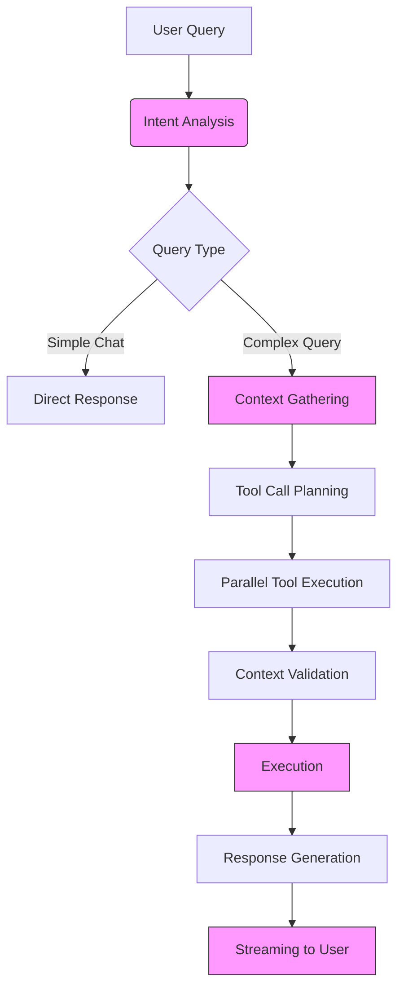

# AI Integration

<cite>
**Referenced Files in This Document**   
- [llm_client.py](file://opencontext/llm/llm_client.py)
- [agent.py](file://opencontext/context_consumption/context_agent/agent.py)
- [prompt_manager.py](file://opencontext/config/prompt_manager.py)
- [streaming.py](file://opencontext/context_consumption/context_agent/core/streaming.py)
- [workflow.py](file://opencontext/context_consumption/context_agent/core/workflow.py)
- [state.py](file://opencontext/context_consumption/context_agent/core/state.py)
- [enums.py](file://opencontext/models/enums.py)
- [context.py](file://opencontext/context_consumption/context_agent/nodes/context.py)
- [intent.py](file://opencontext/context_consumption/context_agent/nodes/intent.py)
- [executor.py](file://opencontext/context_consumption/context_agent/nodes/executor.py)
- [llm_context_strategy.py](file://opencontext/context_consumption/context_agent/core/llm_context_strategy.py)
- [global_vlm_client.py](file://opencontext/llm/global_vlm_client.py)
- [prompts_en.yaml](file://config/prompts_en.yaml)
- [prompts_zh.yaml](file://config/prompts_zh.yaml)
- [base_context_retrieval_tool.py](file://opencontext/tools/retrieval_tools/base_context_retrieval_tool.py)
</cite>

## Table of Contents
1. [Introduction](#introduction)
2. [LLM Client Implementation](#llm-client-implementation)
3. [ContextAgent Architecture](#contextagent-architecture)
4. [Prompt Management System](#prompt-management-system)
5. [Streaming Response Capabilities](#streaming-response-capabilities)
6. [Context Agent Workflow](#context-agent-workflow)
7. [Context Types and AI Understanding](#context-types-and-ai-understanding)
8. [Query Processing and Response Generation](#query-processing-and-response-generation)
9. [Conclusion](#conclusion)

## Introduction
MineContext leverages large language models (LLMs) to generate intelligent insights by analyzing user context, including activities, documents, and interactions. The system's AI integration is built around a ContextAgent architecture that orchestrates the processing of user queries through a series of well-defined stages. This document details the implementation of the LLM client, the ContextAgent's workflow, the prompt management system, and the streaming capabilities that enable real-time interaction. The agent processes queries by recognizing user intent, retrieving relevant context from various sources, and generating responses that are both contextually accurate and insightful.

## LLM Client Implementation
The LLM client in MineContext is implemented in the `llm_client.py` file and serves as the primary interface for interacting with external AI services. It supports multiple LLM providers, including OpenAI and Doubao, and can handle both chat and embedding operations. The client is initialized with configuration parameters such as the model, API key, base URL, and timeout, which are validated to ensure proper setup. It provides methods for generating responses, both synchronously and asynchronously, with support for streaming to enable real-time output.

The client uses the OpenAI Python library to make API calls and includes robust error handling and monitoring. It records processing stages and token usage, which are critical for performance analysis and cost management. The client also includes a validation method to test the LLM configuration by making a simple API call, ensuring that the service is accessible and properly configured before use.

**Section sources**
- [llm_client.py](file://opencontext/llm/llm_client.py#L32-L466)

## ContextAgent Architecture
The ContextAgent is the core component of MineContext's AI integration, responsible for processing user queries and generating insights. Implemented in the `agent.py` file, the ContextAgent follows a modular architecture that separates concerns into distinct components: the `StreamingManager`, `StateManager`, and `WorkflowEngine`. This design allows for flexible and scalable processing of user interactions.

The `ContextAgent` class initializes these components and provides a simple API for processing queries. It supports both synchronous and streaming modes, enabling real-time interaction with users. The agent's workflow is managed by the `WorkflowEngine`, which executes a series of steps to analyze intent, gather context, execute tasks, and reflect on the results. Each step is handled by a specialized node, such as the `IntentNode`, `ContextNode`, and `ExecutorNode`, which are responsible for specific aspects of the processing pipeline.

The agent's state is managed by the `StateManager`, which tracks the progress of each workflow and stores intermediate results. This state includes the user's query, intent, context, execution plan, and final output. The `StreamingManager` handles the emission of events during the workflow, allowing the frontend to display progress and intermediate results to the user.

**Section sources**
- [agent.py](file://opencontext/context_consumption/context_agent/agent.py#L21-L165)
- [workflow.py](file://opencontext/context_consumption/context_agent/core/workflow.py#L22-L208)
- [state.py](file://opencontext/context_consumption/context_agent/core/state.py#L27-L278)

## Prompt Management System
The prompt management system in MineContext is designed to load and manage prompts from YAML files, supporting multiple languages and customizations. The `PromptManager` class, defined in `prompt_manager.py`, is responsible for loading prompts from configuration files such as `prompts_en.yaml` and `prompts_zh.yaml`. These files contain a hierarchical structure of prompts for different stages of the AI workflow, including intent analysis, context collection, and response generation.

The system supports dynamic loading of user-defined prompts, allowing users to customize the behavior of the AI. The `PromptManager` can merge user prompts with default prompts, ensuring that customizations are preserved while maintaining access to the full set of available prompts. Prompts are organized into groups, such as `chat_workflow` and `processing`, which correspond to different aspects of the AI's functionality.

The prompt management system also includes methods for exporting and importing prompts, enabling users to share and backup their customizations. The system ensures that prompts are loaded correctly and provides fallbacks when a requested prompt is not found, maintaining the robustness of the AI integration.

**Section sources**
- [prompt_manager.py](file://opencontext/config/prompt_manager.py#L17-L220)
- [prompts_en.yaml](file://config/prompts_en.yaml#L6-L800)
- [prompts_zh.yaml](file://config/prompts_zh.yaml#L6-L800)

## Streaming Response Capabilities
MineContext supports streaming responses to enable real-time interaction with users. The `StreamingManager` class, defined in `streaming.py`, manages the flow of events during the processing of a user query. It uses an asyncio queue to buffer events and emits them as they are generated, allowing the frontend to update the user interface incrementally.

The streaming capabilities are integrated into the `WorkflowEngine` and the various nodes of the ContextAgent. For example, the `IntentNode` emits events when it is analyzing the user's intent, and the `ExecutorNode` emits events when it is generating a response. These events include information about the current stage of processing, the progress, and any intermediate results.

The `global_vlm_client.py` file provides the `generate_stream_for_agent` function, which is used to stream responses from the LLM. This function yields chunks of the response as they are received from the API, allowing the system to display the response to the user in real-time. The streaming response is particularly useful for long-form content, as it reduces the perceived latency and provides immediate feedback to the user.

**Section sources**
- [streaming.py](file://opencontext/context_consumption/context_agent/core/streaming.py#L16-L46)
- [global_vlm_client.py](file://opencontext/llm/global_vlm_client.py#L251-L259)

## Context Agent Workflow
The ContextAgent processes user queries through a well-defined workflow that consists of several stages: intent analysis, context gathering, execution, and reflection. This workflow is managed by the `WorkflowEngine` and executed by a series of specialized nodes.

The workflow begins with the `IntentNode`, which analyzes the user's query to determine the intent and classify the type of query. This node uses a prompt to guide the LLM in understanding the user's needs and may enhance the query by adding context or clarifying ambiguous terms. The result of this stage is an `Intent` object that contains the original query, the enhanced query, and the query type.

Next, the `ContextNode` gathers relevant context for the query. This node uses the `LLMContextStrategy` to decide which retrieval tools to call based on the user's intent and the existing context. The strategy involves analyzing the information gap and planning tool calls to fill that gap. The node executes these tool calls in parallel and validates the results to ensure relevance.

The `ExecutorNode` then executes the task based on the gathered context. This node generates an execution plan and uses the LLM to produce a response. The response is generated using a prompt that includes the user's query, the enhanced query, the collected context, and the chat history. The node supports streaming, allowing the response to be displayed to the user in real-time.

Finally, the `ReflectionNode` evaluates the quality of the response and provides feedback for improvement. This node is not currently implemented in the provided code, but it is part of the overall architecture.

**Diagram sources**
- [workflow.py](file://opencontext/context_consumption/context_agent/core/workflow.py#L22-L208)
- [intent.py](file://opencontext/context_consumption/context_agent/nodes/intent.py#L26-L264)
- [context.py](file://opencontext/context_consumption/context_agent/nodes/context.py#L19-L171)
- [executor.py](file://opencontext/context_consumption/context_agent/nodes/executor.py#L22-L276)

**Section sources**
- [workflow.py](file://opencontext/context_consumption/context_agent/core/workflow.py#L22-L208)
- [intent.py](file://opencontext/context_consumption/context_agent/nodes/intent.py#L26-L264)
- [context.py](file://opencontext/context_consumption/context_agent/nodes/context.py#L19-L171)
- [executor.py](file://opencontext/context_consumption/context_agent/nodes/executor.py#L22-L276)

## Context Types and AI Understanding
MineContext uses a rich set of context types to enhance the AI's understanding of user activities and information. These context types are defined in the `enums.py` file and include entity, activity, intent, semantic, procedural, and state contexts. Each context type serves a specific purpose and contributes to the overall intelligence of the system.

- **Entity Context**: Manages profile information for various entities such as people, projects, and organizations. This context type supports entity autonomous learning and knowledge accumulation.
- **Activity Context**: Records behavioral activities and historical records, such as completed tasks and participated activities. This context answers the question of "what have I done."
- **Intent Context**: Captures future plans, goal settings, and action intentions. This context is used for action planning and goal management.
- **Semantic Context**: Stores knowledge concepts and technical principles, focusing on what the knowledge is rather than how it was obtained.
- **Procedural Context**: Records user operation flows and task procedures, capturing reusable operation patterns and workflows.
- **State Context**: Monitors status and progress information, such as current status, progress tracking, and performance indicators.

These context types are used by the retrieval tools to filter and retrieve relevant information. For example, the `BaseContextRetrievalTool` uses the context type to determine which data to search and how to filter the results. The context types are also used in the prompts to guide the LLM in understanding the user's query and generating appropriate responses.

**Section sources**
- [enums.py](file://opencontext/models/enums.py#L84-L247)
- [base_context_retrieval_tool.py](file://opencontext/tools/retrieval_tools/base_context_retrieval_tool.py#L49-L259)

## Query Processing and Response Generation
The ContextAgent processes user queries by following a structured workflow that ensures accurate and insightful responses. When a user submits a query, the `ContextAgent` initializes the workflow and passes the query to the `IntentNode`. This node uses a prompt to classify the query and determine the user's intent. For simple social interactions, the node generates a direct response using the `social_interaction` prompt.

For more complex queries, the workflow proceeds to the `ContextNode`, which uses the `LLMContextStrategy` to plan and execute tool calls. The strategy involves analyzing the information gap and selecting the appropriate retrieval tools. The node executes these tools in parallel and validates the results to ensure relevance. The gathered context is then passed to the `ExecutorNode`, which generates a response using a prompt that includes the user's query, the enhanced query, the collected context, and the chat history.

The response is generated using the `generate_stream_for_agent` function, which streams the output to the user in real-time. This allows the user to see the response as it is being generated, reducing the perceived latency and providing immediate feedback. The final response is formatted and returned to the user, completing the workflow.

**Section sources**
- [agent.py](file://opencontext/context_consumption/context_agent/agent.py#L38-L44)
- [intent.py](file://opencontext/context_consumption/context_agent/nodes/intent.py#L26-L264)
- [context.py](file://opencontext/context_consumption/context_agent/nodes/context.py#L19-L171)
- [executor.py](file://opencontext/context_consumption/context_agent/nodes/executor.py#L22-L276)
- [global_vlm_client.py](file://opencontext/llm/global_vlm_client.py#L251-L259)

## Conclusion
MineContext's AI integration is a sophisticated system that leverages large language models to generate insights from user context. The ContextAgent architecture provides a modular and scalable framework for processing user queries, with specialized nodes for intent analysis, context gathering, and response generation. The prompt management system allows for flexible and customizable behavior, while the streaming capabilities enable real-time interaction. The use of multiple context types enhances the AI's understanding of user activities and information, leading to more accurate and insightful responses. This comprehensive approach to AI integration makes MineContext a powerful tool for knowledge and memory management.