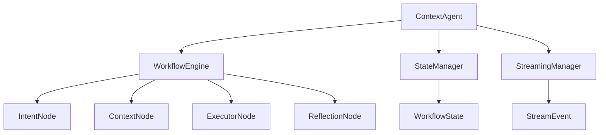
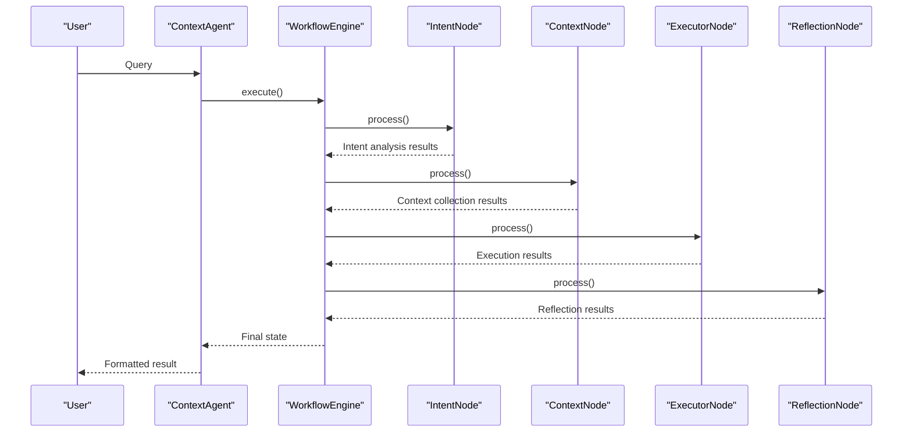

# Context Agent

<cite>
**Referenced Files in This Document**   
- [agent.py](file://opencontext/context_consumption/context_agent/agent.py)
- [workflow.py](file://opencontext/context_consumption/context_agent/core/workflow.py)
- [state.py](file://opencontext/context_consumption/context_agent/core/state.py)
- [streaming.py](file://opencontext/context_consumption/context_agent/core/streaming.py)
- [intent.py](file://opencontext/context_consumption/context_agent/nodes/intent.py)
- [context.py](file://opencontext/context_consumption/context_agent/nodes/context.py)
- [executor.py](file://opencontext/context_consumption/context_agent/nodes/executor.py)
- [reflection.py](file://opencontext/context_consumption/context_agent/nodes/reflection.py)
- [schemas.py](file://opencontext/context_consumption/context_agent/models/schemas.py)
- [enums.py](file://opencontext/context_consumption/context_agent/models/enums.py)
- [events.py](file://opencontext/context_consumption/context_agent/models/events.py)
</cite>

## Table of Contents
1. [Introduction](#introduction)
2. [Architecture Overview](#architecture-overview)
3. [Core Components](#core-components)
4. [Workflow Execution](#workflow-execution)
5. [Result Formatting](#result-formatting)
6. [Workflow Management](#workflow-management)
7. [Streaming Capabilities](#streaming-capabilities)
8. [State Management](#state-management)
9. [Conclusion](#conclusion)

## Introduction

The Context Agent is the central component of MineContext's intelligent conversation and insight generation system. It orchestrates a multi-stage workflow to process user queries, gather relevant context, execute tasks, and generate AI-powered insights. The agent follows a structured approach that includes intent recognition, context retrieval, execution, and reflection stages, ensuring comprehensive and accurate responses to user queries.

**Section sources**
- [agent.py](file://opencontext/context_consumption/context_agent/agent.py#L21-L165)

## Architecture Overview

The Context Agent architecture is built around a modular workflow engine that coordinates various specialized components. The system is designed with clear separation of concerns, where each component handles a specific aspect of the processing pipeline. The architecture consists of the ContextAgent class as the orchestrator, which manages the workflow engine, state manager, and streaming manager.



**Diagram sources **
- [agent.py](file://opencontext/context_consumption/context_agent/agent.py#L21-L37)
- [workflow.py](file://opencontext/context_consumption/context_agent/core/workflow.py#L22-L32)

## Core Components

The Context Agent system comprises several core components that work together to process user queries and generate insights. The main ContextAgent class serves as the entry point and orchestrator, initializing and coordinating the various subsystems. The workflow engine manages the execution flow through different processing stages, while the state manager maintains the current state of each workflow. The streaming manager handles real-time event emission for interactive responses.

The agent processes queries through a well-defined workflow that begins with intent analysis, followed by context gathering, execution, and reflection. Each stage is implemented as a specialized node that performs specific processing tasks. The system is designed to be extensible, allowing for the addition of new processing stages or modifications to existing ones without disrupting the overall architecture.

**Section sources**
- [agent.py](file://opencontext/context_consumption/context_agent/agent.py#L21-L165)
- [workflow.py](file://opencontext/context_consumption/context_agent/core/workflow.py#L22-L32)

## Workflow Execution

The workflow execution process in the Context Agent follows a structured sequence of stages that transform user queries into comprehensive insights. The process begins with intent analysis, where the system determines the type of query and enhances it with additional context. This is followed by context gathering, where relevant information is collected from various sources to support the execution phase.

The execution phase carries out the actual task based on the query type and available context, generating outputs that address the user's request. Finally, the reflection stage evaluates the execution results, identifies any issues, and suggests improvements for future iterations. The workflow engine coordinates these stages, ensuring proper sequencing and handling of dependencies between them.



**Diagram sources **
- [workflow.py](file://opencontext/context_consumption/context_agent/core/workflow.py#L58-L162)
- [agent.py](file://opencontext/context_consumption/context_agent/agent.py#L38-L44)

## Result Formatting

The result formatting system in the Context Agent structures the output to provide comprehensive information about the processing outcome. The _format_result() method transforms the internal workflow state into a standardized dictionary format that includes success status, workflow ID, query text, and detailed information from each processing stage.

The formatted result includes intent analysis details such as query type and enhanced query, context information with sufficiency assessment and summary, execution results with success status and outputs, and reflection data with success rate, summary, and improvement suggestions. This comprehensive structure enables clients to understand not just the final answer but also the reasoning process and quality assessment behind it.

**Section sources**
- [agent.py](file://opencontext/context_consumption/context_agent/agent.py#L50-L92)

## Workflow Management

The Context Agent provides several methods for managing and controlling workflow execution. The get_state() method allows clients to retrieve the current state of a workflow by its ID, enabling inspection of processing progress and intermediate results. The resume() method supports continuation of interrupted workflows, accepting additional user input when needed to complete the processing.

The cancel() method provides the ability to terminate a running workflow, setting its state to cancelled and failed. These management capabilities support complex, multi-step conversations and allow for user intervention when necessary. The state manager maintains active workflows and provides cleanup functionality for completed or failed workflows to manage system resources effectively.

**Section sources**
- [agent.py](file://opencontext/context_consumption/context_agent/agent.py#L94-L124)
- [workflow.py](file://opencontext/context_consumption/context_agent/core/workflow.py#L175-L208)

## Streaming Capabilities

The Context Agent supports real-time streaming responses through its streaming manager component. The process_stream() method enables clients to receive incremental updates as the workflow progresses, providing immediate feedback and improving user experience. The streaming system emits events for different stages of processing, including thinking, running, and completion states.

Streaming events include content chunks, progress indicators, and metadata that allow clients to display processing status and intermediate results. The streaming manager uses an asynchronous queue to handle events efficiently, ensuring smooth delivery of updates without blocking the main processing thread. This capability is particularly valuable for long-running operations where users benefit from seeing progress in real-time.

```mermaid
flowchart TD
A[Client Request] --> B{Streaming?}
B --> |Yes| C[process_stream()]
B --> |No| D[process()]
C --> E[StreamingManager]
E --> F[Event Queue]
F --> G[Async Iterator]
G --> H[Client Stream]
D --> I[Workflow Execution]
I --> J[Formatted Result]
J --> K[Client Response]
```

**Diagram sources **
- [agent.py](file://opencontext/context_consumption/context_agent/agent.py#L46-L48)
- [streaming.py](file://opencontext/context_consumption/context_agent/core/streaming.py#L16-L46)

## State Management

The state management system in the Context Agent tracks the progress and data of each workflow through its lifecycle. The WorkflowState class encapsulates all relevant information, including the original query, processing stage, intent analysis results, collected contexts, execution plan and results, and reflection data. The StateManager maintains a collection of active workflow states, providing methods to create, retrieve, update, and delete states.

Each workflow is assigned a unique ID and maintains metadata such as creation and update timestamps, session and user identifiers, and retry counters. The state includes error tracking and tool call history, enabling comprehensive debugging and analysis. The system automatically cleans up old or completed workflows to prevent memory leaks and ensure efficient resource utilization.

**Section sources**
- [state.py](file://opencontext/context_consumption/context_agent/core/state.py#L27-L278)

## Conclusion

The Context Agent architecture in MineContext provides a robust framework for intelligent conversation and insight generation. By orchestrating a multi-stage workflow that includes intent recognition, context gathering, execution, and reflection, the system delivers comprehensive and contextually relevant responses to user queries. The modular design with clear separation of concerns enables extensibility and maintainability, while the streaming capabilities support real-time interaction.

The comprehensive state management and workflow control features allow for complex, multi-step conversations and user intervention when needed. The structured result formatting provides clients with detailed information about the processing outcome, including quality assessments and improvement suggestions. Together, these components create a powerful system for transforming user queries into valuable insights through intelligent context processing.