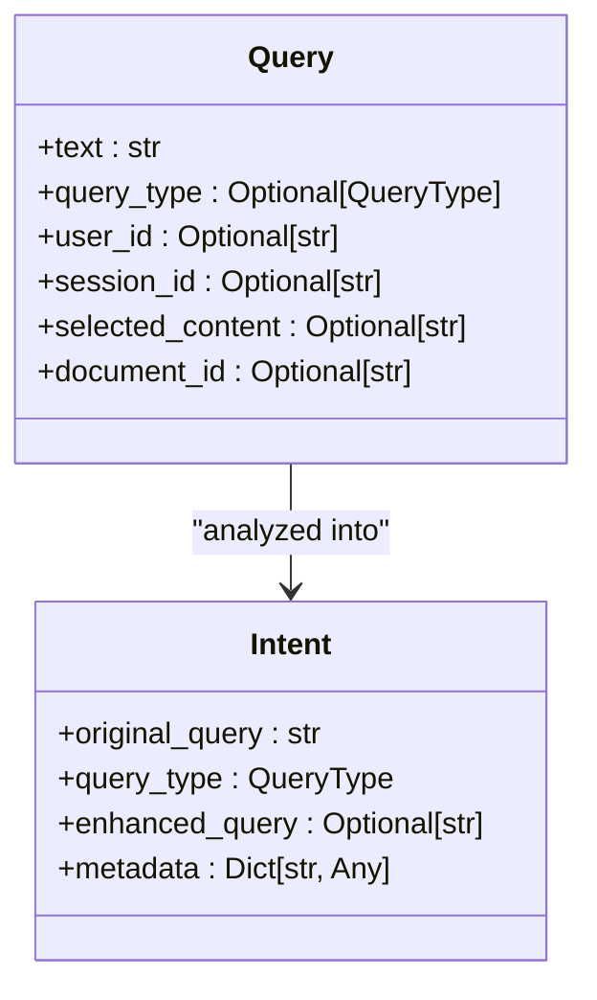
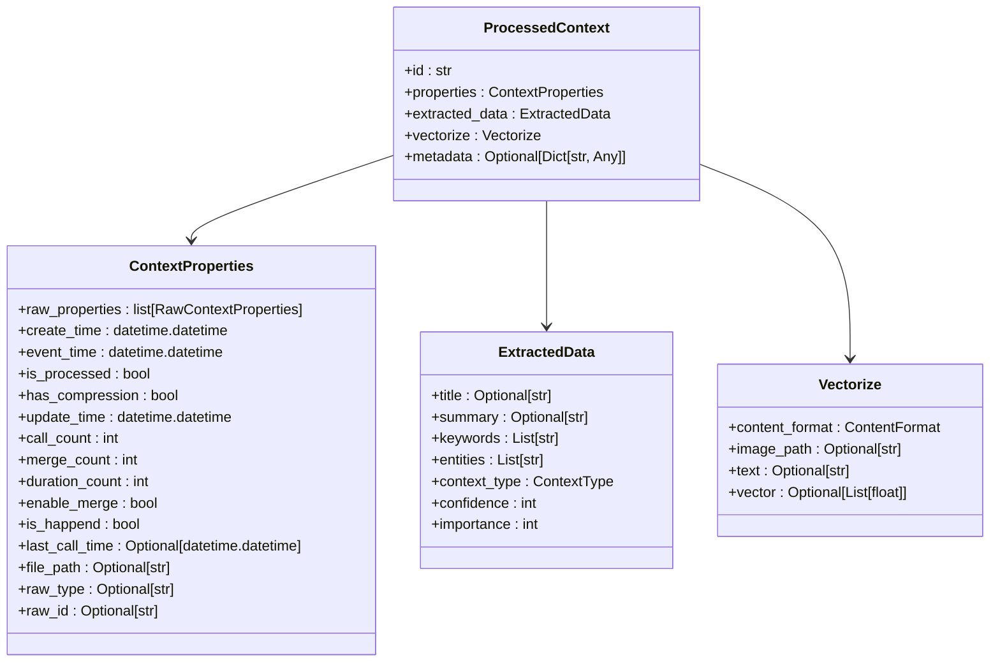
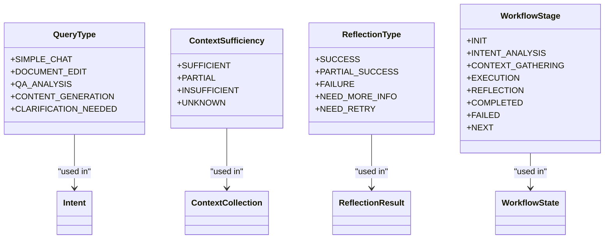
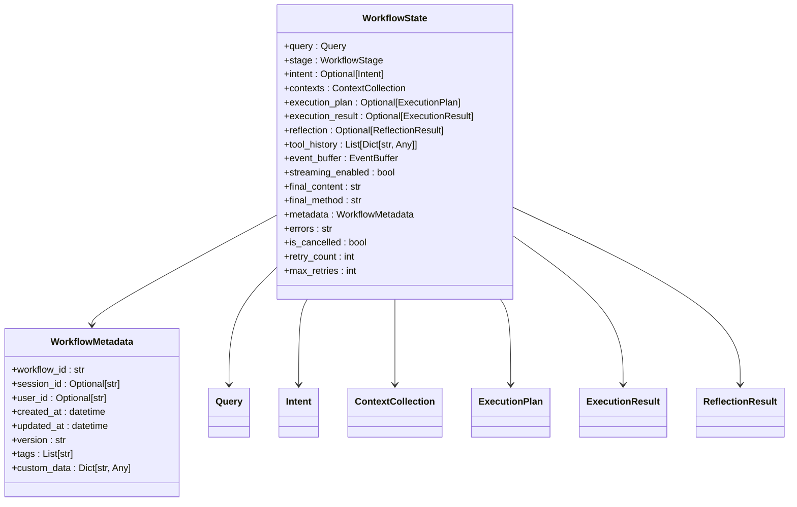
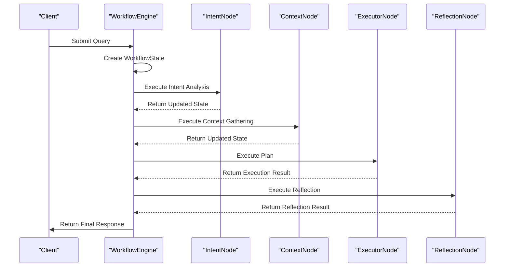
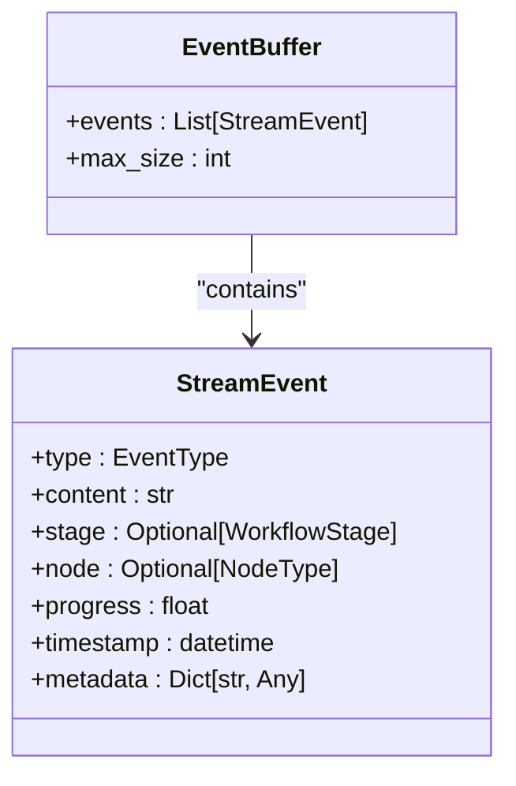

# Data Models

<cite>
**Referenced Files in This Document**   
- [schemas.py](file://opencontext/context_consumption/context_agent/models/schemas.py)
- [enums.py](file://opencontext/context_consumption/context_agent/models/enums.py)
- [state.py](file://opencontext/context_consumption/context_agent/core/state.py)
- [workflow.py](file://opencontext/context_consumption/context_agent/core/workflow.py)
- [context.py](file://opencontext/context_consumption/context_agent/nodes/context.py)
- [executor.py](file://opencontext/context_consumption/context_agent/nodes/executor.py)
- [reflection.py](file://opencontext/context_consumption/context_agent/nodes/reflection.py)
- [intent.py](file://opencontext/context_consumption/context_agent/nodes/intent.py)
- [events.py](file://opencontext/context_consumption/context_agent/models/events.py)
- [context.py](file://opencontext/models/context.py)
- [enums.py](file://opencontext/models/enums.py)
</cite>

## Table of Contents
1. [Introduction](#introduction)
2. [Core Data Structures](#core-data-structures)
3. [Pydantic Models and Data Validation](#pydantic-models-and-data-validation)
4. [Enumerated Types](#enumerated-types)
5. [Workflow State Management](#workflow-state-management)
6. [Data Flow Through the System](#data-flow-through-the-system)
7. [API Response Structure](#api-response-structure)
8. [Model Evolution and Versioning](#model-evolution-and-versioning)
9. [Conclusion](#conclusion)

## Introduction

The MineContext system relies on a robust and well-defined data model to manage the flow of information through its context agent. This document details the core data structures that define how user queries are processed, context is gathered, and responses are generated. The data model is built around several key components: `WorkflowState`, `Query`, `Intent`, `ContextItems`, `ExecutionResult`, and `Reflection`. These components work together to ensure data consistency, enable type-safe processing, and provide a clear structure for API responses.

The data model is implemented using Python's dataclasses and Pydantic models, providing strong typing and data validation. Enumerated types are used throughout the system to standardize values and avoid magic strings. The workflow engine orchestrates the processing of these data structures, moving from intent analysis through context gathering, execution, and reflection.

This documentation will explore each of these components in detail, showing how they are defined, how they relate to each other, and how they are used in practice to structure the data flow through the system.

## Core Data Structures

The core data structures in MineContext's context agent are designed to represent the various stages of processing a user query. These structures are defined in the `schemas.py` file and include `Query`, `Intent`, `ContextItem`, `ExecutionResult`, and `ReflectionResult`. Each of these structures plays a specific role in the workflow, from capturing the initial user input to representing the final output and evaluation of the process.

The `Query` class encapsulates the user's input, including the text of the query, the query type, user and session identifiers, and any selected content or document context. This structure serves as the starting point for the entire workflow, providing the necessary information to begin processing.

The `Intent` class represents the analysis of the user's query, including the original query text, the classified query type, and an enhanced version of the query that may be generated during processing. This structure captures the system's understanding of what the user is asking for and how it should be handled.

**Diagram sources**
- [schemas.py](file://opencontext/context_consumption/context_agent/models/schemas.py#L40-L49)
- [schemas.py](file://opencontext/context_consumption/context_agent/models/schemas.py#L63-L69)

**Section sources**
- [schemas.py](file://opencontext/context_consumption/context_agent/models/schemas.py#L40-L69)

## Pydantic Models and Data Validation

In addition to the dataclass-based models in the context agent, MineContext uses Pydantic models for data validation and serialization, particularly for API responses and database interactions. These models are defined in the `opencontext/models/` directory and provide a more robust validation framework than the dataclass-based models.

The `ProcessedContext` model is a key Pydantic model that represents processed context data. It includes properties for context attributes, extracted data, and vectorization information. This model ensures that context data is properly structured and validated before being stored or used in processing.

**Diagram sources**
- [context.py](file://opencontext/models/context.py#L131-L142)
- [context.py](file://opencontext/models/context.py#L80-L107)
- [context.py](file://opencontext/models/context.py#L57-L69)
- [context.py](file://opencontext/models/context.py#L109-L128)

**Section sources**
- [context.py](file://opencontext/models/context.py#L131-L200)

## Enumerated Types

The MineContext system uses enumerated types extensively to standardize values and avoid magic strings. These enums are defined in both the context agent models and the core models, providing a consistent way to represent various types of data throughout the system.

The `QueryType` enum defines the different categories of user queries, including `SIMPLE_CHAT`, `DOCUMENT_EDIT`, `QA_ANALYSIS`, `CONTENT_GENERATION`, and `CLARIFICATION_NEEDED`. These types are used to determine how a query should be processed and what kind of response is expected.

The `ContextSufficiency` enum represents the sufficiency level of the gathered context, with values `SUFFICIENT`, `PARTIAL`, `INSUFFICIENT`, and `UNKNOWN`. This enum is used to determine whether enough context has been collected to proceed with execution or whether additional context gathering is needed.

**Diagram sources**
- [enums.py](file://opencontext/context_consumption/context_agent/models/enums.py#L80-L91)
- [enums.py](file://opencontext/context_consumption/context_agent/models/enums.py#L94-L100)
- [enums.py](file://opencontext/context_consumption/context_agent/models/enums.py#L103-L110)
- [enums.py](file://opencontext/context_consumption/context_agent/models/enums.py#L21-L31)

**Section sources**
- [enums.py](file://opencontext/context_consumption/context_agent/models/enums.py#L80-L110)

## Workflow State Management

The `WorkflowState` class is the central data structure that manages the state of the entire workflow. It contains references to all the other core data structures and tracks the progress of the workflow through its various stages. The state is managed by the `StateManager` class, which provides methods for creating, retrieving, updating, and deleting workflow states.

The `WorkflowState` class includes fields for the current query, intent, context collection, execution plan, execution result, and reflection result. It also includes metadata such as the workflow ID, session ID, user ID, and timestamps. This comprehensive state object allows the system to maintain context across multiple processing steps and to resume workflows that have been interrupted.

**Diagram sources**
- [state.py](file://opencontext/context_consumption/context_agent/core/state.py#L42-L73)
- [state.py](file://opencontext/context_consumption/context_agent/core/state.py#L28-L38)

**Section sources**
- [state.py](file://opencontext/context_consumption/context_agent/core/state.py#L27-L278)

## Data Flow Through the System

The data flow through the MineContext system follows a well-defined workflow that moves from intent analysis through context gathering, execution, and reflection. This workflow is orchestrated by the `WorkflowEngine` class, which coordinates the processing of the various data structures.

The process begins with the creation of a `WorkflowState` object that contains the initial query. The workflow engine then executes a series of nodes, each of which processes a specific aspect of the query. The `IntentNode` analyzes the query to determine its type and enhances it if necessary. The `ContextNode` gathers relevant context from various sources, evaluating the sufficiency of the collected context. The `ExecutorNode` generates and executes a plan to fulfill the query, and the `ReflectionNode` evaluates the results and determines whether a retry is needed.

**Diagram sources**
- [workflow.py](file://opencontext/context_consumption/context_agent/core/workflow.py#L22-L208)
- [intent.py](file://opencontext/context_consumption/context_agent/nodes/intent.py#L26-L264)
- [context.py](file://opencontext/context_consumption/context_agent/nodes/context.py#L19-L171)
- [executor.py](file://opencontext/context_consumption/context_agent/nodes/executor.py#L22-L276)
- [reflection.py](file://opencontext/context_consumption/context_agent/nodes/reflection.py#L20-L334)

**Section sources**
- [workflow.py](file://opencontext/context_consumption/context_agent/core/workflow.py#L22-L208)

## API Response Structure

The data models in MineContext are designed to structure API responses in a consistent and predictable way. The `StreamEvent` class is used to represent streaming events that are sent to the client during processing, providing real-time feedback on the progress of the workflow.

The `StreamEvent` class includes fields for the event type, content, workflow stage, node type, progress, timestamp, and metadata. This structure allows the client to understand what is happening at each stage of the workflow and to display appropriate feedback to the user.

**Diagram sources**
- [events.py](file://opencontext/context_consumption/context_agent/models/events.py#L17-L55)
- [events.py](file://opencontext/context_consumption/context_agent/models/events.py#L106-L118)

**Section sources**
- [events.py](file://opencontext/context_consumption/context_agent/models/events.py#L17-L134)

## Model Evolution and Versioning

The data models in MineContext are designed with backward compatibility in mind, allowing for evolution and versioning as the system grows and changes. The `WorkflowMetadata` class includes a version field that can be used to track the version of the data model, allowing the system to handle older versions of the data appropriately.

When new fields are added to the data models, they are typically made optional to ensure that older clients can still work with the updated models. This approach allows for gradual evolution of the data model without breaking existing functionality.

The use of dataclasses and Pydantic models also facilitates versioning, as these frameworks provide built-in support for handling missing fields and default values. This makes it easier to add new features and capabilities to the system while maintaining compatibility with existing code.

**Section sources**
- [state.py](file://opencontext/context_consumption/context_agent/core/state.py#L28-L38)

## Conclusion

The data models in MineContext's context agent provide a robust and well-structured foundation for processing user queries and generating responses. By using dataclasses and Pydantic models for data validation and serialization, and enumerated types for standardizing values, the system ensures data consistency and enables type-safe processing.

The core data structures, including `WorkflowState`, `Query`, `Intent`, `ContextItems`, `ExecutionResult`, and `Reflection`, work together to represent the various stages of processing a user query. These structures are used throughout the system to manage the flow of information and to structure API responses.

The workflow engine orchestrates the processing of these data structures, moving from intent analysis through context gathering, execution, and reflection. This well-defined workflow ensures that queries are handled consistently and that the system can provide meaningful feedback to the user at each stage of processing.

Overall, the data model in MineContext is designed to be flexible, extensible, and maintainable, allowing the system to evolve and grow over time while maintaining backward compatibility and data integrity.