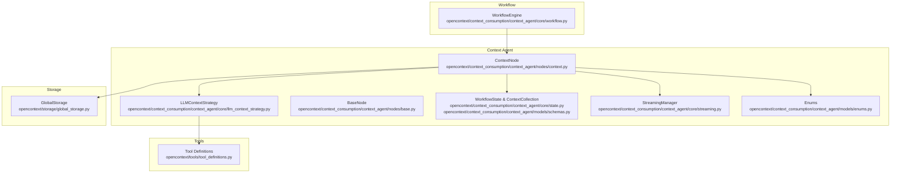
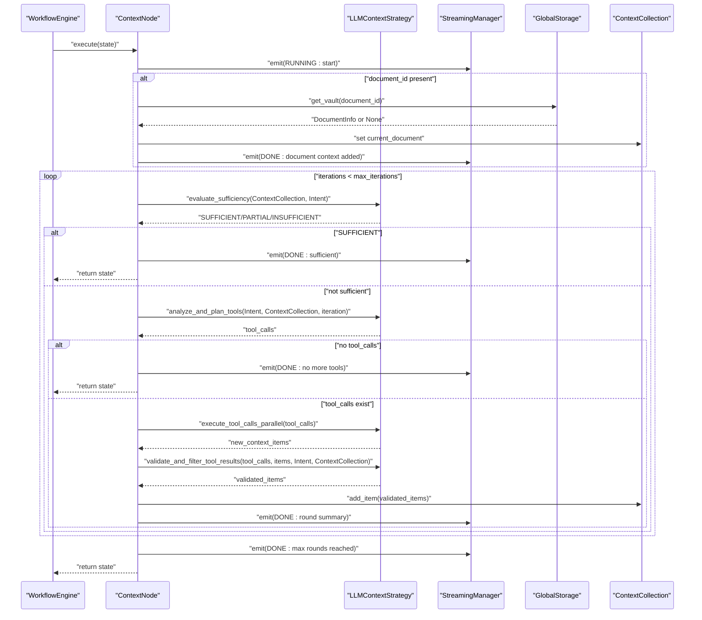
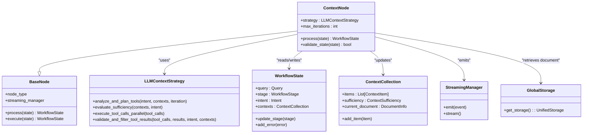

# Context Node

<cite>
**Referenced Files in This Document**
- [context.py](file://opencontext/context_consumption/context_agent/nodes/context.py)
- [llm_context_strategy.py](file://opencontext/context_consumption/context_agent/core/llm_context_strategy.py)
- [base.py](file://opencontext/context_consumption/context_agent/nodes/base.py)
- [schemas.py](file://opencontext/context_consumption/context_agent/models/schemas.py)
- [state.py](file://opencontext/context_consumption/context_agent/core/state.py)
- [streaming.py](file://opencontext/context_consumption/context_agent/core/streaming.py)
- [workflow.py](file://opencontext/context_consumption/context_agent/core/workflow.py)
- [enums.py](file://opencontext/context_consumption/context_agent/models/enums.py)
- [global_storage.py](file://opencontext/storage/global_storage.py)
- [tool_definitions.py](file://opencontext/tools/tool_definitions.py)
</cite>

## Table of Contents
1. [Introduction](#introduction)
2. [Project Structure](#project-structure)
3. [Core Components](#core-components)
4. [Architecture Overview](#architecture-overview)
5. [Detailed Component Analysis](#detailed-component-analysis)
6. [Dependency Analysis](#dependency-analysis)
7. [Performance Considerations](#performance-considerations)
8. [Troubleshooting Guide](#troubleshooting-guide)
9. [Conclusion](#conclusion)

## Introduction
This document explains the ContextNode architecture that powers MineContext’s intelligent context collection system. The ContextNode orchestrates an LLM-driven iterative process to gather, judge, and refine relevant context for downstream tasks. It integrates with the LLMContextStrategy to evaluate sufficiency, analyze information gaps, plan tool calls, execute them in parallel, validate and filter results, and update the workflow state through the Contexts collection. It also emits streaming events to provide user feedback during each collection round and handles edge cases such as missing documents and insufficient context.

## Project Structure
The ContextNode lives in the context agent subsystem under opencontext/context_consumption/context_agent. It collaborates with:
- Core orchestration: workflow engine and state management
- LLM strategy: sufficiency evaluation, tool planning, execution, and validation
- Data models: schemas for queries, intents, context items, and collections
- Streaming: event emission and streaming delivery
- Storage: retrieval of document context when a document_id is provided

**Diagram sources**
- [context.py](file://opencontext/context_consumption/context_agent/nodes/context.py#L1-L171)
- [llm_context_strategy.py](file://opencontext/context_consumption/context_agent/core/llm_context_strategy.py#L1-L439)
- [base.py](file://opencontext/context_consumption/context_agent/nodes/base.py#L1-L55)
- [state.py](file://opencontext/context_consumption/context_agent/core/state.py#L1-L278)
- [schemas.py](file://opencontext/context_consumption/context_agent/models/schemas.py#L1-L263)
- [streaming.py](file://opencontext/context_consumption/context_agent/core/streaming.py#L1-L46)
- [workflow.py](file://opencontext/context_consumption/context_agent/core/workflow.py#L1-L208)
- [enums.py](file://opencontext/context_consumption/context_agent/models/enums.py#L1-L111)
- [global_storage.py](file://opencontext/storage/global_storage.py#L1-L196)
- [tool_definitions.py](file://opencontext/tools/tool_definitions.py#L1-L40)

**Section sources**
- [context.py](file://opencontext/context_consumption/context_agent/nodes/context.py#L1-L171)
- [workflow.py](file://opencontext/context_consumption/context_agent/core/workflow.py#L1-L208)

## Core Components
- ContextNode: Orchestrates the iterative LLM-driven context collection process, manages streaming events, and updates the ContextCollection in WorkflowState.
- LLMContextStrategy: Implements sufficiency evaluation, tool planning, parallel execution, and result validation/filtering.
- WorkflowState and ContextCollection: Persist the evolving context, stage, intent, and tool history.
- StreamingManager: Emits structured events for real-time user feedback.
- BaseNode: Provides shared node execution semantics and error handling.
- Enums: Define stages, event types, data sources, and sufficiency levels.
- GlobalStorage: Retrieves document context when a document_id is provided.
- Tool Definitions: Supplies the toolset used by the strategy.

**Section sources**
- [context.py](file://opencontext/context_consumption/context_agent/nodes/context.py#L1-L171)
- [llm_context_strategy.py](file://opencontext/context_consumption/context_agent/core/llm_context_strategy.py#L1-L439)
- [state.py](file://opencontext/context_consumption/context_agent/core/state.py#L1-L278)
- [schemas.py](file://opencontext/context_consumption/context_agent/models/schemas.py#L1-L263)
- [streaming.py](file://opencontext/context_consumption/context_agent/core/streaming.py#L1-L46)
- [base.py](file://opencontext/context_consumption/context_agent/nodes/base.py#L1-L55)
- [enums.py](file://opencontext/context_consumption/context_agent/models/enums.py#L1-L111)
- [global_storage.py](file://opencontext/storage/global_storage.py#L1-L196)
- [tool_definitions.py](file://opencontext/tools/tool_definitions.py#L1-L40)

## Architecture Overview
The ContextNode participates in the workflow engine’s stage machine. After intent analysis, the engine invokes ContextNode to iteratively enrich the ContextCollection until sufficiency is met or the maximum iteration limit is reached. During each round, the node:
1. Evaluates sufficiency
2. Plans tool calls based on intent and existing context
3. Executes tool calls in parallel
4. Validates and filters results
5. Adds relevant items to the ContextCollection
6. Emits streaming events for progress and completion

**Diagram sources**
- [workflow.py](file://opencontext/context_consumption/context_agent/core/workflow.py#L125-L162)
- [context.py](file://opencontext/context_consumption/context_agent/nodes/context.py#L27-L165)
- [llm_context_strategy.py](file://opencontext/context_consumption/context_agent/core/llm_context_strategy.py#L136-L439)
- [global_storage.py](file://opencontext/storage/global_storage.py#L180-L196)
- [streaming.py](file://opencontext/context_consumption/context_agent/core/streaming.py#L1-L46)

## Detailed Component Analysis

### ContextNode
Responsibilities:
- Initialize LLMContextStrategy and enforce a configurable maximum iteration limit.
- Retrieve document context when a document_id is present via GlobalStorage and populate the current_document in ContextCollection.
- Drive the iterative collection loop:
  - Evaluate sufficiency
  - Plan tool calls
  - Execute in parallel
  - Validate and filter results
  - Add validated items to ContextCollection
- Emit streaming events for progress and completion.
- Validate state requirements (requires intent).

Key behaviors:
- Iterative loop with max_iterations configured to three rounds (0-based indexing up to 2).
- Emits RUNNING/DONE/FAIL events with stage and progress.
- Updates ContextCollection.sufficiency and integrates with workflow decisions.

Edge cases handled:
- Missing document: emits FAIL and transitions to FAILED stage.
- No more tools to call: emits DONE and stops early.
- Maximum iterations reached: sets sufficiency to PARTIAL and emits DONE.

Integration with workflow state:
- Uses WorkflowState to update stage and persist results.
- Reads Intent and ContextCollection to inform planning and validation.

**Section sources**
- [context.py](file://opencontext/context_consumption/context_agent/nodes/context.py#L19-L171)
- [base.py](file://opencontext/context_consumption/context_agent/nodes/base.py#L1-L55)
- [state.py](file://opencontext/context_consumption/context_agent/core/state.py#L1-L278)
- [schemas.py](file://opencontext/context_consumption/context_agent/models/schemas.py#L120-L177)
- [enums.py](file://opencontext/context_consumption/context_agent/models/enums.py#L21-L45)

### LLMContextStrategy
Responsibilities:
- Sufficiency evaluation: builds a prompt and asks the LLM to classify context as SUFFICIENT/PARTIAL/INSUFFICIENT.
- Tool planning: constructs a prompt summarizing existing context and intent, then requests tool calls from the LLM with function calling enabled.
- Parallel execution: runs tool calls concurrently and converts results to ContextItem objects.
- Validation and filtering: asks the LLM to select relevant results from the tool outputs, falling back to returning all results if parsing fails.

Data conversion:
- Converts tool results to ContextItem with inferred DataSource based on tool name.
- Infers source from tool name patterns (document, web, entity, processed, unknown).

Parallelism:
- Uses asyncio.gather to execute multiple tool calls concurrently.

Validation robustness:
- On parsing failures, logs error and returns all results with an explanatory message.

**Section sources**
- [llm_context_strategy.py](file://opencontext/context_consumption/context_agent/core/llm_context_strategy.py#L1-L439)
- [schemas.py](file://opencontext/context_consumption/context_agent/models/schemas.py#L72-L118)
- [enums.py](file://opencontext/context_consumption/context_agent/models/enums.py#L34-L45)
- [tool_definitions.py](file://opencontext/tools/tool_definitions.py#L1-L40)

### Streaming and Events
- StreamingManager maintains an asyncio.Queue and exposes emit() and stream() to push and pull StreamEvent objects.
- ContextNode emits RUNNING/DONE/FAIL events with stage and progress markers.
- WorkflowEngine wraps execution and emits lifecycle events (START, STREAM_COMPLETE, COMPLETED, FAIL).

**Section sources**
- [streaming.py](file://opencontext/context_consumption/context_agent/core/streaming.py#L1-L46)
- [workflow.py](file://opencontext/context_consumption/context_agent/core/workflow.py#L58-L111)
- [context.py](file://opencontext/context_consumption/context_agent/nodes/context.py#L27-L165)
- [enums.py](file://opencontext/context_consumption/context_agent/models/enums.py#L67-L79)

### Data Models and State
- Query carries the user query, optional selected_content, and document_id.
- Intent captures the original query, enhanced query, and query type.
- ContextCollection holds items, sufficiency, missing sources, current_document, chat_history, and selected_content; provides helpers to add items and summarize.
- WorkflowState ties together Query, Intent, ContextCollection, stage, tool history, and streaming buffers.

**Section sources**
- [schemas.py](file://opencontext/context_consumption/context_agent/models/schemas.py#L40-L177)
- [state.py](file://opencontext/context_consumption/context_agent/core/state.py#L41-L209)
- [enums.py](file://opencontext/context_consumption/context_agent/models/enums.py#L21-L45)

### Tool Integration
- Tool definitions aggregate retrieval and profile tools, plus a web search tool.
- LLMContextStrategy composes a toolset from these definitions and passes them to the LLM for planning.

**Section sources**
- [tool_definitions.py](file://opencontext/tools/tool_definitions.py#L1-L40)
- [llm_context_strategy.py](file://opencontext/context_consumption/context_agent/core/llm_context_strategy.py#L15-L42)

### Document Context Retrieval
When a document_id is present:
- ContextNode retrieves the document via GlobalStorage.get_storage().get_vault(document_id).
- If not found, emits a FAIL event and transitions to FAILED.
- If found, populates ContextCollection.current_document with DocumentInfo and emits a DONE event.

**Section sources**
- [context.py](file://opencontext/context_consumption/context_agent/nodes/context.py#L42-L73)
- [global_storage.py](file://opencontext/storage/global_storage.py#L180-L196)
- [schemas.py](file://opencontext/context_consumption/context_agent/models/schemas.py#L100-L118)

### Iterative Collection and Maximum Iterations
- The loop runs for a fixed number of iterations controlled by max_iterations.
- Each round:
  - Evaluate sufficiency
  - Plan tool calls
  - Execute in parallel
  - Validate and filter
  - Add to ContextCollection
- If sufficiency becomes SUFFICIENT, the loop exits early.
- If no tool calls are produced, the loop exits early.
- After max_iterations, sufficiency is set to PARTIAL and the loop exits.

**Section sources**
- [context.py](file://opencontext/context_consumption/context_agent/nodes/context.py#L74-L165)
- [llm_context_strategy.py](file://opencontext/context_consumption/context_agent/core/llm_context_strategy.py#L136-L174)

### Streaming Event Emission Pattern
- ContextNode emits RUNNING events at the start of processing and at the beginning of each round.
- It emits DONE events upon completion of rounds, when context is sufficient, when no more tools are available, and when maximum rounds are reached.
- It emits FAIL events when a document is not found.
- WorkflowEngine emits lifecycle events around the entire workflow execution.

**Section sources**
- [context.py](file://opencontext/context_consumption/context_agent/nodes/context.py#L27-L165)
- [workflow.py](file://opencontext/context_consumption/context_agent/core/workflow.py#L58-L111)
- [streaming.py](file://opencontext/context_consumption/context_agent/core/streaming.py#L1-L46)

### Edge Cases and Robustness
- Missing document: FAIL event and FAILED stage.
- Insufficient context: workflow checks ContextSufficiency.INSUFFICIENT and may terminate early.
- Tool execution exceptions: logged and skipped; results are still converted when possible.
- Validation failures: fallback to returning all results with an explanatory message.

**Section sources**
- [context.py](file://opencontext/context_consumption/context_agent/nodes/context.py#L42-L73)
- [workflow.py](file://opencontext/context_consumption/context_agent/core/workflow.py#L132-L149)
- [llm_context_strategy.py](file://opencontext/context_consumption/context_agent/core/llm_context_strategy.py#L224-L259)
- [llm_context_strategy.py](file://opencontext/context_consumption/context_agent/core/llm_context_strategy.py#L339-L439)

## Dependency Analysis
The ContextNode depends on:
- LLMContextStrategy for planning, execution, and validation
- StreamingManager for emitting events
- GlobalStorage for document retrieval
- WorkflowState and ContextCollection for state persistence
- Enums for stage and sufficiency classification

**Diagram sources**
- [base.py](file://opencontext/context_consumption/context_agent/nodes/base.py#L1-L55)
- [context.py](file://opencontext/context_consumption/context_agent/nodes/context.py#L19-L171)
- [llm_context_strategy.py](file://opencontext/context_consumption/context_agent/core/llm_context_strategy.py#L1-L439)
- [state.py](file://opencontext/context_consumption/context_agent/core/state.py#L41-L209)
- [schemas.py](file://opencontext/context_consumption/context_agent/models/schemas.py#L120-L177)
- [streaming.py](file://opencontext/context_consumption/context_agent/core/streaming.py#L1-L46)
- [global_storage.py](file://opencontext/storage/global_storage.py#L180-L196)

**Section sources**
- [context.py](file://opencontext/context_consumption/context_agent/nodes/context.py#L19-L171)
- [llm_context_strategy.py](file://opencontext/context_consumption/context_agent/core/llm_context_strategy.py#L1-L439)
- [state.py](file://opencontext/context_consumption/context_agent/core/state.py#L1-L278)
- [schemas.py](file://opencontext/context_consumption/context_agent/models/schemas.py#L1-L263)
- [streaming.py](file://opencontext/context_consumption/context_agent/core/streaming.py#L1-L46)
- [global_storage.py](file://opencontext/storage/global_storage.py#L1-L196)

## Performance Considerations
- Concurrency: Tool calls are executed concurrently using asyncio.gather, reducing total latency when multiple retrievals are needed.
- Early termination: The loop exits early when sufficiency is SUFFICIENT or when no tool calls are produced, saving compute.
- Iteration limit: A bounded number of rounds prevents unbounded resource usage.
- Validation fallback: Returning all results on validation failure avoids data loss at the cost of potential noise.

[No sources needed since this section provides general guidance]

## Troubleshooting Guide
Common issues and resolutions:
- Document not found: Verify document_id correctness; ContextNode emits FAIL and transitions to FAILED.
- No tool calls planned: Confirm intent quality and existing context; the strategy may return empty tool_calls.
- Tool execution failures: Inspect logs; exceptions are caught and skipped, but results are still converted when possible.
- Validation failures: The strategy falls back to returning all results with an explanatory message; review the validation prompt group and tool result format.
- Streaming stalls: Ensure StreamingManager is initialized and events are consumed via stream(); lifecycle events signal completion.

**Section sources**
- [context.py](file://opencontext/context_consumption/context_agent/nodes/context.py#L42-L73)
- [llm_context_strategy.py](file://opencontext/context_consumption/context_agent/core/llm_context_strategy.py#L224-L259)
- [llm_context_strategy.py](file://opencontext/context_consumption/context_agent/core/llm_context_strategy.py#L339-L439)
- [streaming.py](file://opencontext/context_consumption/context_agent/core/streaming.py#L1-L46)

## Conclusion
The ContextNode implements a robust, LLM-driven iterative context collection pipeline. It evaluates sufficiency, plans and executes tool calls in parallel, validates and filters results, and integrates tightly with the workflow state and streaming infrastructure. Its design balances responsiveness (streaming updates), reliability (fallback validation), and extensibility (toolset composition), enabling MineContext to adaptively gather the right context for downstream tasks.