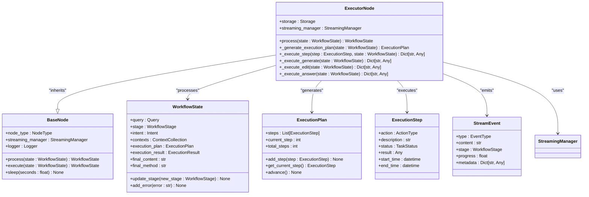
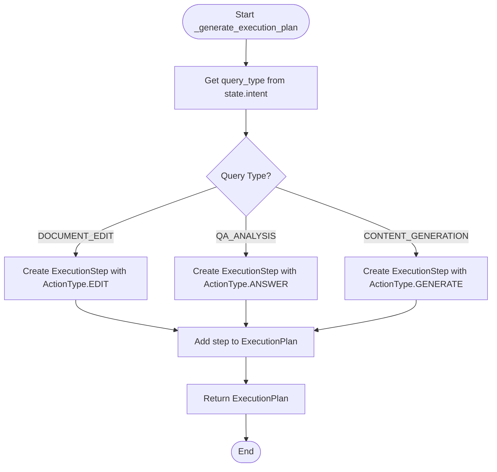
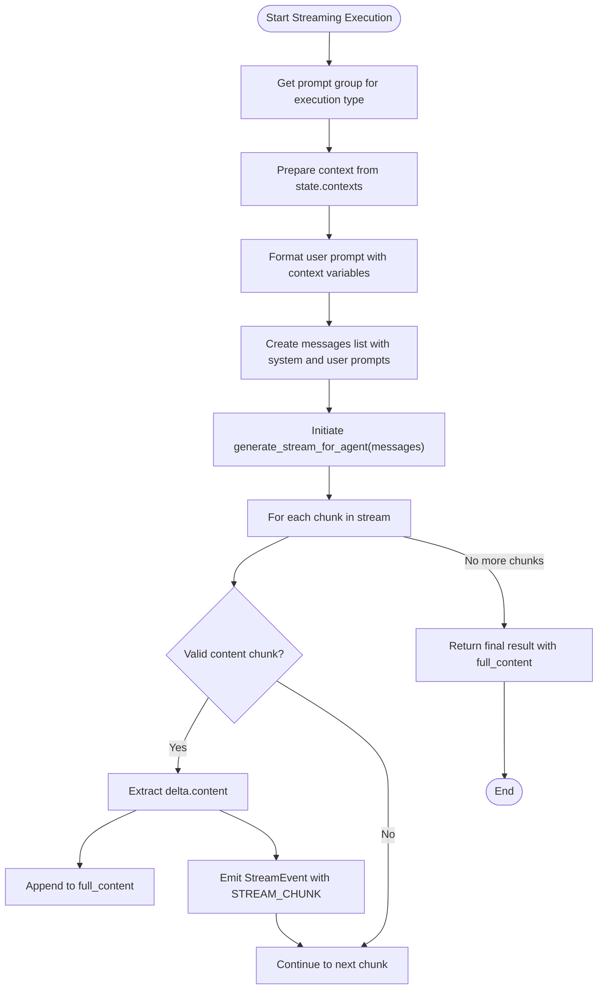
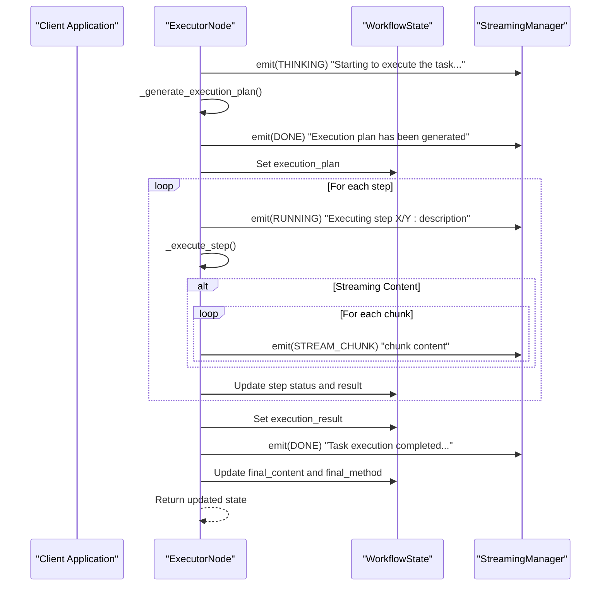

# Executor Node

<cite>
**Referenced Files in This Document**   
- [executor.py](file://opencontext/context_consumption/context_agent/nodes/executor.py)
- [enums.py](file://opencontext/context_consumption/context_agent/models/enums.py)
- [schemas.py](file://opencontext/context_consumption/context_agent/models/schemas.py)
- [state.py](file://opencontext/context_consumption/context_agent/core/state.py)
- [streaming.py](file://opencontext/context_consumption/context_agent/core/streaming.py)
- [prompts_en.yaml](file://config/prompts_en.yaml)
</cite>

## Table of Contents
1. [Introduction](#introduction)
2. [ExecutorNode Architecture Overview](#executornode-architecture-overview)
3. [Execution Plan Generation](#execution-plan-generation)
4. [Step Execution Mechanism](#step-execution-mechanism)
5. [Streaming Implementation](#streaming-implementation)
6. [Context Preparation and Prompt Formatting](#context-preparation-and-prompt-formatting)
7. [Progress Tracking and State Management](#progress-tracking-and-state-management)
8. [Conclusion](#conclusion)

## Introduction
The ExecutorNode is a core component of MineContext's task execution system, responsible for generating and executing execution plans based on different query types. This document provides a comprehensive analysis of the ExecutorNode architecture, focusing on its execution planning, step execution, streaming implementation, and state management capabilities. The node handles three primary query types: DOCUMENT_EDIT, QA_ANALYSIS, and CONTENT_GENERATION, each requiring different execution strategies and prompt configurations.

## ExecutorNode Architecture Overview



**Diagram sources**
- [executor.py](file://opencontext/context_consumption/context_agent/nodes/executor.py#L22-L276)
- [base.py](file://opencontext/context_consumption/context_agent/nodes/base.py#L22-L55)
- [schemas.py](file://opencontext/context_consumption/context_agent/models/schemas.py#L180-L237)
- [state.py](file://opencontext/context_consumption/context_agent/core/state.py#L41-L278)
- [streaming.py](file://opencontext/context_consumption/context_agent/core/streaming.py#L16-L46)

**Section sources**
- [executor.py](file://opencontext/context_consumption/context_agent/nodes/executor.py#L22-L276)

## Execution Plan Generation

The ExecutorNode generates execution plans through the `_generate_execution_plan` method, which creates an ExecutionPlan object containing appropriate actions based on the query type. The method analyzes the query_type from the WorkflowState's intent and creates a corresponding execution step.

For DOCUMENT_EDIT queries, the method creates an ExecutionStep with ActionType.EDIT, indicating a document editing task. For QA_ANALYSIS queries, it creates a step with ActionType.ANSWER, designed for question answering and analysis tasks. For CONTENT_GENERATION queries, it creates a step with ActionType.GENERATE, intended for content creation and expansion.

The execution plan is a sequential workflow where each step represents a discrete action to be performed. The plan is stored in the WorkflowState and used to guide the execution process. After generating the plan, the ExecutorNode emits a StreamEvent with EventType.DONE to indicate that the planning phase is complete, providing the execution plan in the metadata for client-side visualization and tracking.



**Diagram sources**
- [executor.py](file://opencontext/context_consumption/context_agent/nodes/executor.py#L89-L102)
- [enums.py](file://opencontext/context_consumption/context_agent/models/enums.py#L80-L91)
- [schemas.py](file://opencontext/context_consumption/context_agent/models/schemas.py#L206-L237)

**Section sources**
- [executor.py](file://opencontext/context_consumption/context_agent/nodes/executor.py#L89-L102)

## Step Execution Mechanism

The ExecutorNode executes steps through the `_execute_step` method, which dispatches to specific execution handlers based on the action type. The method first sets the step's start time and status to RUNNING, then routes the execution to the appropriate handler method.

The dispatching mechanism uses a conditional structure to determine which execution method to call: `_execute_generate` for GENERATE actions, `_execute_edit` for EDIT actions, and `_execute_answer` for ANSWER actions. After executing the step, the method updates the WorkflowState with the final content and method, making this information available for subsequent processing and client display.

Each execution step is tracked with detailed metadata, including start and end times, status, and results. The ExecutorNode updates the step's status to SUCCESS upon completion and stores the result. This detailed tracking enables comprehensive progress monitoring and post-execution analysis.

```mermaid
sequenceDiagram
participant Executor as ExecutorNode
participant State as WorkflowState
participant Step as ExecutionStep
participant Handler as Specific Handler
Executor->>Executor : _execute_step(step, state)
Executor->>Step : Set start_time = now()
Executor->>Step : Set status = RUNNING
Executor->>Executor : Check step.action
alt ActionType.GENERATE
Executor->>Handler : Call _execute_generate(state)
elif ActionType.EDIT
Executor->>Handler : Call _execute_edit(state)
elif ActionType.ANSWER
Executor->>Handler : Call _execute_answer(state)
end
Handler-->>Executor : Return result
Executor->>State : Update final_content
Executor->>State : Update final_method
Executor->>Step : Set result = output
Executor->>Step : Set end_time = now()
Executor->>Step : Set status = SUCCESS
Executor-->>Executor : Return result
```

**Diagram sources**
- [executor.py](file://opencontext/context_consumption/context_agent/nodes/executor.py#L104-L118)
- [schemas.py](file://opencontext/context_consumption/context_agent/models/schemas.py#L180-L204)

**Section sources**
- [executor.py](file://opencontext/context_consumption/context_agent/nodes/executor.py#L104-L118)

## Streaming Implementation

The ExecutorNode implements streaming through the `_execute_generate`, `_execute_edit`, and `_execute_answer` methods, all of which use the `generate_stream_for_agent` function to provide real-time feedback. Each method follows a similar pattern: prepare the prompt, initiate streaming generation, process chunks as they arrive, and emit streaming events.

The streaming implementation begins by retrieving the appropriate prompt group from the configuration based on the execution type. It then prepares the context by calling the ContextCollection's `prepare_context` method, which formats all relevant information into a structured dictionary. The user prompt is formatted with various context elements including the original query, enhanced query, collected contexts, chat history, current document, and selected content.

During streaming, the methods iterate through the asynchronous generator returned by `generate_stream_for_agent`, processing each chunk as it arrives. For each valid content chunk, they emit a StreamEvent with EventType.STREAM_CHUNK, containing the incremental content. This enables the client to display results progressively, providing immediate feedback to users.



**Diagram sources**
- [executor.py](file://opencontext/context_consumption/context_agent/nodes/executor.py#L120-L275)
- [state.py](file://opencontext/context_consumption/context_agent/core/state.py#L120-L163)
- [prompts_en.yaml](file://config/prompts_en.yaml#L101-L199)

**Section sources**
- [executor.py](file://opencontext/context_consumption/context_agent/nodes/executor.py#L120-L275)

## Context Preparation and Prompt Formatting

The ExecutorNode prepares context and formats prompts differently for each execution type, leveraging the ContextCollection's `prepare_context` method to gather and structure relevant information. This method extracts key elements from the workflow state and formats them into a dictionary that can be used to populate prompt templates.

For all execution types, the context preparation includes:
- **Chat history**: Serialized list of previous interactions
- **Current document**: Information about the active document being processed
- **Selected content**: Text currently selected by the user
- **Collected contexts**: Aggregated context items from various sources

The prompt formatting varies by execution type, with each using a specific prompt group from the configuration. The CONTENT_GENERATION execution uses a system prompt that positions the assistant as a content generation expert, with a user prompt that includes all available context. The DOCUMENT_EDIT execution uses a system prompt emphasizing content editing expertise and requirements to preserve original facts, with a similar user prompt structure. The QA_ANALYSIS execution uses a more complex system prompt that details information usage principles, source transparency requirements, and task execution strategies.

```mermaid
erDiagram
PROMPT_GROUP {
string name PK
string system_prompt
string user_prompt_template
}
CONTEXT_COLLECTION {
string collected_contexts
string chat_history
string current_document
string selected_content
}
EXECUTION_TYPE {
string type PK
string prompt_group FK
}
PROMPT_VARIABLE {
string name PK
string description
string execution_types
}
PROMPT_GROUP ||--o{ EXECUTION_TYPE : "used by"
PROMPT_GROUP ||--o{ PROMPT_VARIABLE : "contains"
CONTEXT_COLLECTION ||--o{ PROMPT_VARIABLE : "provides"
PROMPT_VARIABLE {
"query"
"enhanced_query"
"collected_contexts"
"chat_history"
"current_document"
"selected_content"
}
```

**Diagram sources**
- [executor.py](file://opencontext/context_consumption/context_agent/nodes/executor.py#L126-L135)
- [schemas.py](file://opencontext/context_consumption/context_agent/models/schemas.py#L120-L163)
- [prompts_en.yaml](file://config/prompts_en.yaml#L101-L199)

**Section sources**
- [executor.py](file://opencontext/context_consumption/context_agent/nodes/executor.py#L120-L275)

## Progress Tracking and State Management

The ExecutorNode implements comprehensive progress tracking through its integration with the StreamingManager and WorkflowState. The node emits various StreamEvents throughout the execution process to provide real-time feedback on progress, with different event types for different stages of execution.

At the beginning of processing, the node emits a THINKING event to indicate that execution is starting. After generating the execution plan, it emits a DONE event to signal that planning is complete. During step execution, it emits RUNNING events with progress percentages to show which step is currently being processed. For streaming content, it emits STREAM_CHUNK events with incremental content. Finally, it emits a DONE event to indicate that task execution is complete.

The node updates the WorkflowState with execution results, including the execution plan, outputs, errors, and execution time. It also updates the final_content and final_method fields, which are used by subsequent components and for client display. The state management ensures that all execution data is preserved and available for reflection, debugging, and user interface purposes.



**Diagram sources**
- [executor.py](file://opencontext/context_consumption/context_agent/nodes/executor.py#L29-L87)
- [state.py](file://opencontext/context_consumption/context_agent/core/state.py#L41-L278)
- [streaming.py](file://opencontext/context_consumption/context_agent/core/streaming.py#L16-L46)

**Section sources**
- [executor.py](file://opencontext/context_consumption/context_agent/nodes/executor.py#L29-L87)

## Conclusion
The ExecutorNode architecture in MineContext provides a robust and flexible framework for executing tasks based on different query types. By implementing a clear separation between execution plan generation and step execution, the node can handle DOCUMENT_EDIT, QA_ANALYSIS, and CONTENT_GENERATION queries with appropriate strategies for each type. The streaming implementation using generate_stream_for_agent enables real-time feedback, enhancing the user experience by providing immediate responses. The comprehensive progress tracking through StreamEvents and detailed state management ensure that execution progress is transparent and that results are properly captured for subsequent processing. This architecture effectively balances flexibility, performance, and user experience in MineContext's task execution system.