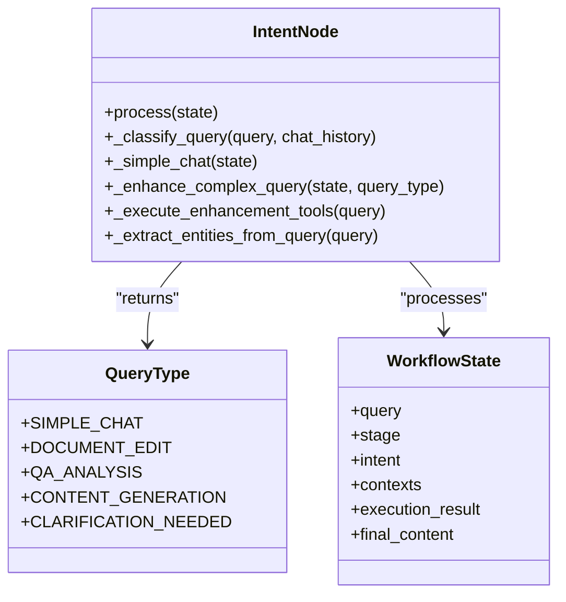
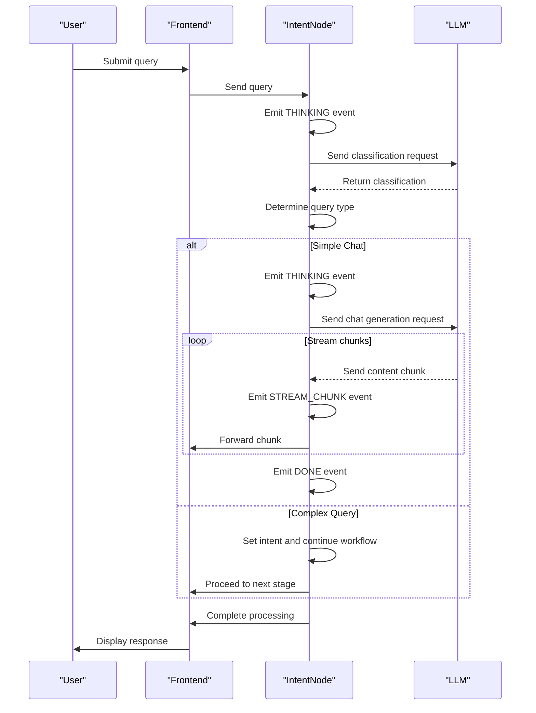
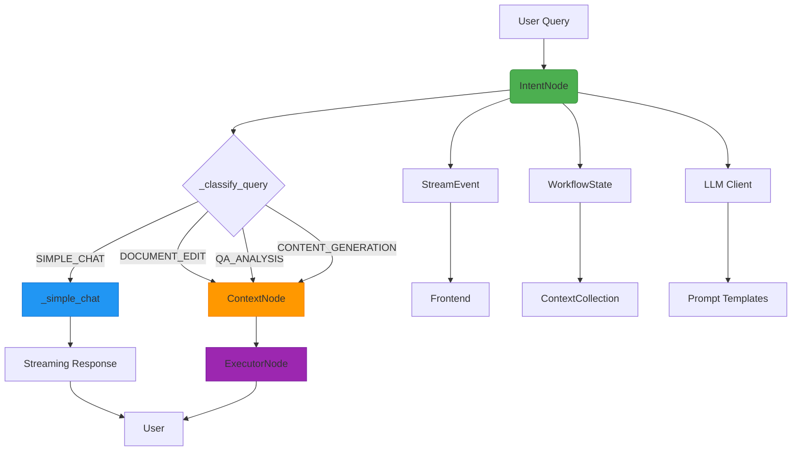

# Intent Node

<cite>
**Referenced Files in This Document**   
- [intent.py](file://opencontext/context_consumption/context_agent/nodes/intent.py)
- [enums.py](file://opencontext/context_consumption/context_agent/models/enums.py)
- [events.py](file://opencontext/context_consumption/context_agent/models/events.py)
- [schemas.py](file://opencontext/context_consumption/context_agent/models/schemas.py)
- [prompts_en.yaml](file://config/prompts_en.yaml)
- [global_vlm_client.py](file://opencontext/llm/global_vlm_client.py)
- [state.py](file://opencontext/context_consumption/context_agent/core/state.py)
</cite>

## Table of Contents
1. [Introduction](#introduction)
2. [Query Classification System](#query-classification-system)
3. [Intent Classification Implementation](#intent-classification-implementation)
4. [Simple Chat Processing](#simple-chat-processing)
5. [Entity Extraction and Enhancement](#entity-extraction-and-enhancement)
6. [Streaming Event Pattern](#streaming-event-pattern)
7. [Fallback Strategies and Workflow Integration](#fallback-strategies-and-workflow-integration)
8. [Architecture Overview](#architecture-overview)

## Introduction
The IntentNode is a critical component in MineContext's query analysis and classification system, responsible for determining user intent and routing queries to appropriate processing pathways. This node analyzes incoming user queries and classifies them into distinct types based on the user's intent and the system's capabilities. The classification process leverages LLM-based prompt engineering to accurately determine whether a query requires simple conversational response, document editing, QA analysis, or content generation. The IntentNode serves as the first decision point in the workflow, establishing the processing path for subsequent nodes and ensuring that user queries are handled appropriately based on their intent.

**Section sources**
- [intent.py](file://opencontext/context_consumption/context_agent/nodes/intent.py#L26-L53)

## Query Classification System
The IntentNode classifies user queries into different types using a comprehensive system that evaluates both the query content and conversation context. The classification system is designed to distinguish between queries that require access to system knowledge and those that are simple social interactions. The primary query types include SIMPLE_CHAT for conversational queries, DOCUMENT_EDIT for document modification requests, QA_ANALYSIS for information retrieval and analysis, and CONTENT_GENERATION for content creation tasks. The system uses a hierarchical decision process that first determines if a query involves historically stored data or memory, which would classify it as QA_ANALYSIS, and otherwise categorizes it as a simple social interaction (SIMPLE_CHAT). This binary classification approach simplifies the decision-making process while maintaining accuracy for the system's core use cases.

**Diagram sources**
- [enums.py](file://opencontext/context_consumption/context_agent/models/enums.py#L80-L91)
- [intent.py](file://opencontext/context_consumption/context_agent/nodes/intent.py#L26-L154)

## Intent Classification Implementation
The _classify_query method implements the core intent classification functionality using LLM-based prompt engineering. This method utilizes the 'chat_workflow.query_classification' prompt group to determine query intent by analyzing both the query text and chat history. The implementation constructs a message sequence with a system prompt that defines the classification rules and a user prompt that includes the query and conversation context. The system prompt establishes the classification framework, defining simple_chat as daily communication that doesn't require access to system knowledge or historical data, characterized by greetings, thanks, small talk, and emotional expressions. Conversely, qa_analysis is defined as requiring information retrieval from system-stored knowledge bases, historical records, or documents, with features including inquiries about historical activities, requests for information summary or analysis, and questions based on existing data. The method processes the LLM response by checking for specific keywords in the response text and returns the corresponding QueryType enumeration value, with a fallback to QA_ANALYSIS if no specific type is identified.

**Section sources**
- [intent.py](file://opencontext/context_consumption/context_agent/nodes/intent.py#L72-L97)
- [prompts_en.yaml](file://config/prompts_en.yaml#L50-L85)

## Simple Chat Processing
The _simple_chat method handles conversational queries with streaming responses using the generate_stream_for_agent function. When a query is classified as SIMPLE_CHAT, this method takes over processing and generates a direct response without requiring additional context gathering. The implementation first emits a THINKING event to provide user feedback, then retrieves the social_interaction prompt template to generate an appropriate response. The method incorporates recent chat history into the message sequence by inserting the last 10 messages from the conversation context, ensuring that the response maintains conversational coherence. The streaming generation process iterates through response chunks, emitting STREAM_CHUNK events for each content portion received from the LLM. These events include the content chunk, progress information, and metadata with the chunk index. Once the complete response is generated, the method emits a DONE event, updates the workflow state with the execution result and final content, and advances the state to COMPLETED.

**Section sources**
- [intent.py](file://opencontext/context_consumption/context_agent/nodes/intent.py#L99-L154)
- [global_vlm_client.py](file://opencontext/llm/global_vlm_client.py#L312-L316)

## Entity Extraction and Enhancement
The IntentNode performs entity extraction from user queries through the _extract_entities_from_query method, which uses LLM-based analysis to identify key entities mentioned in the query. This method employs the 'entity_processing.entity_extraction' prompt group to extract entities by sending the query text to the LLM with specific instructions to return structured entity information. The response is parsed from JSON format, and entity names are extracted from the result whether they are returned as a dictionary with name fields or as a list of strings. The extracted entities are then used in the _execute_enhancement_tools method to find matching entity information through the ProfileEntityTool, which can provide additional context about the entities mentioned in the query. This enhancement process allows the system to enrich the query understanding with relevant entity information, improving the accuracy of subsequent processing stages. The entity extraction serves as a crucial step in understanding the specific subjects and objects referenced in user queries, enabling more targeted and contextually appropriate responses.

**Section sources**
- [intent.py](file://opencontext/context_consumption/context_agent/nodes/intent.py#L225-L263)
- [prompts_en.yaml](file://config/prompts_en.yaml#L408-L409)

## Streaming Event Pattern
The IntentNode implements a consistent streaming event emission pattern using the StreamEvent class to provide real-time feedback during processing. This pattern begins with a THINKING event when intent analysis starts, informing the user that their query is being processed. Throughout the classification and response generation processes, the node emits various event types to communicate progress and intermediate results. For streaming responses, the node emits STREAM_CHUNK events for each portion of content received from the LLM, allowing the frontend to display the response incrementally as it is generated. The events include metadata such as chunk index and progress information, enabling the client to manage the streaming display effectively. When processing completes successfully, a DONE event is emitted, while FAIL events are used to communicate errors or classification failures. This event-driven architecture ensures a responsive user experience by providing immediate feedback and progressive content delivery, rather than requiring the user to wait for complete processing before seeing any results.

**Diagram sources**
- [intent.py](file://opencontext/context_consumption/context_agent/nodes/intent.py#L34-L50)
- [events.py](file://opencontext/context_consumption/context_agent/models/events.py#L16-L55)
- [global_vlm_client.py](file://opencontext/llm/global_vlm_client.py#L251-L258)

## Fallback Strategies and Workflow Integration
The IntentNode implements robust fallback strategies and integrates seamlessly with the overall workflow state management system. When intent classification fails or returns no valid query type, the node emits a FAIL event with diagnostic information and updates the workflow state to FAILED, preventing further processing of ambiguous queries. The method includes a default fallback to QA_ANALYSIS when the LLM response doesn't clearly indicate a specific query type, ensuring that queries are not discarded due to classification uncertainty. The node integrates with the workflow state by updating the state's intent property with the classification result and, for simple chats, setting the execution_result and final_content directly. This integration allows subsequent nodes in the workflow to access the classification results and proceed with appropriate processing. The node also handles chat history by accessing it through the state.contexts.get_chat_history() method, ensuring that conversation context is considered in intent analysis. This comprehensive integration with the workflow state enables the IntentNode to serve as an effective gateway that properly routes queries based on their intent while maintaining the integrity of the overall processing pipeline.

**Section sources**
- [intent.py](file://opencontext/context_consumption/context_agent/nodes/intent.py#L42-L53)
- [state.py](file://opencontext/context_consumption/context_agent/core/state.py#L174-L176)
- [schemas.py](file://opencontext/context_consumption/context_agent/models/schemas.py#L174-L177)

## Architecture Overview
The IntentNode is a fundamental component in MineContext's agent architecture, serving as the entry point for query processing and intent analysis. It operates within a multi-node workflow system where each node has a specific responsibility, with the IntentNode focused on understanding user intent and classifying queries. The node interacts with various system components including the LLM client for classification and response generation, the streaming manager for real-time event emission, and the workflow state for maintaining processing context. The architecture follows a clean separation of concerns, with distinct methods for query classification, simple chat handling, entity extraction, and query enhancement. This modular design allows for independent development and testing of each functionality while maintaining a cohesive interface through the process method. The node's integration with the streaming system ensures responsive user interaction, while its use of prompt engineering enables flexible and updatable classification logic without requiring code changes.

**Diagram sources**
- [intent.py](file://opencontext/context_consumption/context_agent/nodes/intent.py#L32-L154)
- [state.py](file://opencontext/context_consumption/context_agent/core/state.py#L42-L64)
- [global_vlm_client.py](file://opencontext/llm/global_vlm_client.py#L176-L232)