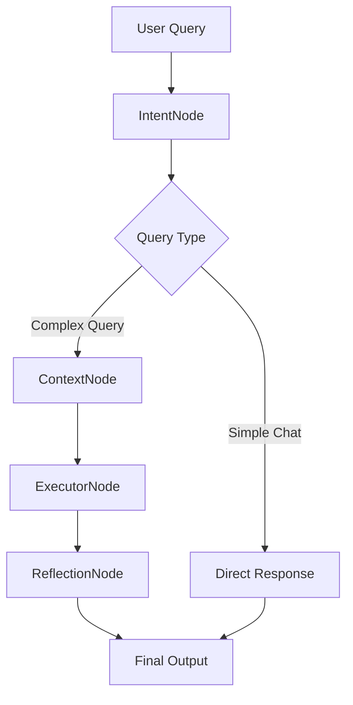
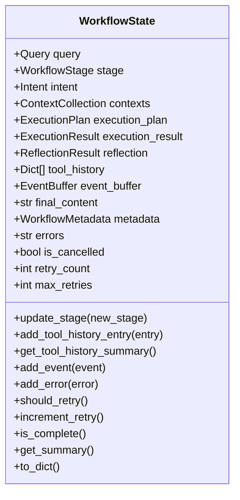

# Processing Nodes

<cite>
**Referenced Files in This Document**   
- [base.py](file://opencontext/context_consumption/context_agent/nodes/base.py)
- [intent.py](file://opencontext/context_consumption/context_agent/nodes/intent.py)
- [context.py](file://opencontext/context_consumption/context_agent/nodes/context.py)
- [executor.py](file://opencontext/context_consumption/context_agent/nodes/executor.py)
- [reflection.py](file://opencontext/context_consumption/context_agent/nodes/reflection.py)
- [workflow.py](file://opencontext/context_consumption/context_agent/core/workflow.py)
- [state.py](file://opencontext/context_consumption/context_agent/core/state.py)
- [schemas.py](file://opencontext/context_consumption/context_agent/models/schemas.py)
- [enums.py](file://opencontext/context_consumption/context_agent/models/enums.py)
- [llm_context_strategy.py](file://opencontext/context_consumption/context_agent/core/llm_context_strategy.py)
</cite>

## Table of Contents
1. [Introduction](#introduction)
2. [Base Node Architecture](#base-node-architecture)
3. [IntentNode: Query Analysis and Classification](#intentnode-query-analysis-and-classification)
4. [ContextNode: Context Retrieval and Collection](#contextnode-context-retrieval-and-collection)
5. [ExecutorNode: Action Execution and Output Generation](#executornode-action-execution-and-output-generation)
6. [ReflectionNode: Result Evaluation and Improvement](#reflectionnode-result-evaluation-and-improvement)
7. [Workflow Execution and Data Flow](#workflow-execution-and-data-flow)
8. [State Management and Shared Context](#state-management-and-shared-context)
9. [Extensibility and Custom Node Development](#extensibility-and-custom-node-development)
10. [Conclusion](#conclusion)

## Introduction

The Processing Nodes architecture in MineContext represents a modular workflow system designed to handle complex AI-driven tasks through specialized components. This architecture implements a pipeline of four primary node types that work together to process user queries: IntentNode for query analysis and classification, ContextNode for retrieving relevant contextual information, ExecutorNode for performing actions and generating outputs, and ReflectionNode for evaluating results and suggesting improvements.

Each node operates as a specialized component within a larger workflow engine, processing information in sequence while sharing state through a common WorkflowState object. This modular design enables flexible, extensible processing of user requests by breaking down complex tasks into manageable stages with clear responsibilities. The nodes follow a consistent interface pattern, inheriting from a base Node class that defines the core behavior and execution lifecycle.

This documentation provides a comprehensive analysis of the Processing Nodes architecture, detailing the implementation and interaction of each node type, the data flow between components, and the mechanisms for state sharing and workflow coordination. The system is designed to support intelligent context-aware processing, enabling MineContext to deliver sophisticated AI capabilities through a well-structured and maintainable architecture.

## Base Node Architecture

The foundation of the Processing Nodes architecture is the BaseNode class, which defines the common interface and behavior for all specialized nodes in the system. This base class implements the Abstract Base Class (ABC) pattern to enforce a consistent interface across all node types while providing shared functionality for execution management, error handling, and event streaming.

The BaseNode class defines the core process() method as an abstract method that must be implemented by all subclasses. This method takes a WorkflowState object as input and returns an updated WorkflowState object, establishing the fundamental data flow pattern for the entire system. The base class also provides an execute() method that wraps the process() method with standardized execution logic, including timing measurement, error handling, and event emission.

Key features of the BaseNode architecture include:
- **Asynchronous processing**: All node operations are implemented asynchronously to support non-blocking execution and efficient resource utilization
- **Event-driven communication**: Nodes communicate progress and status through a streaming manager that emits events throughout the processing lifecycle
- **Standardized error handling**: Comprehensive exception handling with logging and error propagation to ensure robust operation
- **Execution lifecycle management**: Built-in support for timing, logging, and state updates during node execution

The base class also provides utility methods such as sleep() for introducing delays (useful for simulating processing time or implementing rate limiting) and integrates with the system's logging infrastructure for consistent monitoring and debugging capabilities. This foundational architecture ensures that all specialized nodes maintain a consistent interface and behavior while allowing for specific implementations tailored to their unique responsibilities.

**Section sources**
- [base.py](file://opencontext/context_consumption/context_agent/nodes/base.py#L22-L55)

## IntentNode: Query Analysis and Classification

The IntentNode is responsible for analyzing user queries and classifying them into appropriate categories to guide subsequent processing. This node serves as the entry point for the workflow, determining the nature of the user's request and setting the stage for context collection and execution.

The IntentNode implements query classification through a combination of rule-based patterns and LLM-driven analysis. It first attempts to classify queries into predefined types such as informational, action-oriented, or creative requests. The classification process leverages prompt templates configured in the system's prompt management system, using the LLM to analyze the query text and determine its type based on contextual patterns.

Key capabilities of the IntentNode include:
- **Query type classification**: Identifying whether a query is a simple chat, document edit request, Q&A analysis, or content generation task
- **Entity extraction**: Using LLM-powered analysis to identify and extract entities mentioned in the query for enhanced context retrieval
- **Simple chat handling**: Directly generating responses for conversational queries without requiring additional context collection
- **Query enhancement**: Enriching complex queries with additional context from entity profiles and chat history

The node processes queries by first emitting a "thinking" event to indicate analysis is underway, then classifying the query type using LLM inference. For simple chat queries, it bypasses the normal workflow and directly generates a response using streaming output. For more complex queries, it sets the appropriate query type in the workflow state and passes control to subsequent nodes.

The IntentNode also implements entity enhancement by extracting named entities from the query and matching them against the user's profile data, enriching the context with relevant personal information that can improve response quality.

**Section sources**
- [intent.py](file://opencontext/context_consumption/context_agent/nodes/intent.py#L26-L264)
- [enums.py](file://opencontext/context_consumption/context_agent/models/enums.py#L80-L91)

## ContextNode: Context Retrieval and Collection

The ContextNode is responsible for intelligently gathering and evaluating relevant contextual information to support query processing. This node implements an LLM-driven iterative collection strategy that dynamically determines what context is needed and retrieves it from various sources.

The ContextNode operates through a multi-phase process:
1. **Initial context processing**: Handling document-specific context when a document ID is provided in the query
2. **Iterative collection**: Using an LLM-powered strategy to analyze information gaps and plan tool calls
3. **Parallel execution**: Concurrently executing multiple retrieval tools to gather context efficiently
4. **Validation and filtering**: Evaluating the relevance of retrieved context and filtering out irrelevant information

The node uses the LLMContextStrategy class to guide its collection process, which employs large language models to analyze the current context state and determine what additional information is needed. This strategy evaluates context sufficiency, plans tool calls based on information gaps, executes retrieval tools in parallel, and validates the results for relevance.

Key features of the ContextNode include:
- **Document context integration**: Automatically retrieving and incorporating context from specified documents
- **Multi-source retrieval**: Accessing information from various sources including document storage, web search, and entity profiles
- **Iterative refinement**: Conducting multiple rounds of context collection to progressively improve context quality
- **Relevance filtering**: Using LLM evaluation to filter retrieved context and retain only the most relevant information

The node limits collection to a maximum number of iterations to prevent infinite loops and ensures efficient resource usage. It also maintains detailed tracking of tool calls and validation results in the workflow state for transparency and debugging.

**Section sources**
- [context.py](file://opencontext/context_consumption/context_agent/nodes/context.py#L19-L171)
- [llm_context_strategy.py](file://opencontext/context_consumption/context_agent/core/llm_context_strategy.py#L30-L439)

## ExecutorNode: Action Execution and Output Generation

The ExecutorNode is responsible for performing the core actions required to fulfill user requests and generate appropriate outputs. This node takes the classified intent and gathered context to execute specific tasks such as content generation, document editing, or answering questions.

The ExecutorNode follows a structured execution process:
1. **Plan generation**: Creating an execution plan based on the query type determined by the IntentNode
2. **Step execution**: Carrying out each step of the plan with progress tracking
3. **Streaming output**: Generating responses incrementally for improved user experience
4. **Result compilation**: Aggregating outputs and tracking execution metrics

The node supports multiple action types defined in the ActionType enumeration, including answering questions, editing documents, and generating new content. For each action type, it uses specialized prompt templates and execution methods tailored to the specific task requirements.

Key capabilities of the ExecutorNode include:
- **Execution planning**: Generating a step-by-step plan for task completion based on the query type
- **Streaming generation**: Implementing real-time output streaming for long-running operations
- **Progress tracking**: Providing detailed progress updates during execution
- **Error handling**: Capturing and reporting execution errors while continuing processing when possible

The node uses different execution methods (_execute_answer, _execute_edit, _execute_generate) depending on the action type, each optimized for its specific use case. All execution methods follow a consistent pattern of prompt construction, LLM invocation, and result processing, ensuring uniform behavior across different action types.

**Section sources**
- [executor.py](file://opencontext/context_consumption/context_agent/nodes/executor.py#L22-L276)
- [enums.py](file://opencontext/context_consumption/context_agent/models/enums.py#L58-L65)

## ReflectionNode: Result Evaluation and Improvement

The ReflectionNode is responsible for evaluating the results of task execution and providing suggestions for improvement. This node implements a comprehensive assessment process that analyzes execution outcomes, identifies issues, and recommends enhancements to improve future performance.

The ReflectionNode performs several key evaluation tasks:
1. **Execution assessment**: Measuring the success rate of executed steps and determining overall outcome quality
2. **Issue identification**: Detecting problems such as insufficient context, execution errors, or quality issues
3. **Improvement generation**: Creating specific suggestions for enhancing future processing
4. **Retry decision**: Determining whether a task should be retried based on evaluation results
5. **Summary generation**: Creating a concise overview of the execution results and evaluation

The node uses a multi-faceted approach to evaluation, combining quantitative metrics (success rates, execution time) with qualitative LLM-driven analysis of output quality. It examines various aspects of the execution process, including context sufficiency, error patterns, and output relevance, to form a comprehensive assessment.

Key features of the ReflectionNode include:
- **Success rate calculation**: Quantifying the proportion of successfully completed execution steps
- **Issue analysis**: Identifying specific problems that affected execution quality
- **Quality assessment**: Using LLM evaluation to detect issues in generated outputs
- **Improvement suggestions**: Generating actionable recommendations for process enhancement
- **Retry logic**: Determining whether and how to retry failed or partially successful tasks

The node produces a detailed ReflectionResult object that captures the evaluation outcome, including success metrics, identified issues, improvement suggestions, and retry recommendations, which is stored in the workflow state for potential use in subsequent processing cycles.

**Section sources**
- [reflection.py](file://opencontext/context_consumption/context_agent/nodes/reflection.py#L20-L334)

## Workflow Execution and Data Flow

The Processing Nodes architecture operates within a coordinated workflow engine that manages the execution sequence and data flow between nodes. The WorkflowEngine class orchestrates the entire processing pipeline, ensuring that nodes execute in the correct order and that state is properly shared between stages.

The workflow follows a sequential execution pattern:
1. **Intent analysis**: The IntentNode analyzes the user query and classifies its type
2. **Context gathering**: The ContextNode collects relevant contextual information
3. **Execution**: The ExecutorNode performs the required actions and generates outputs
4. **Reflection**: The ReflectionNode evaluates the results and suggests improvements

**Diagram sources**
- [workflow.py](file://opencontext/context_consumption/context_agent/core/workflow.py#L22-L208)
- [base.py](file://opencontext/context_consumption/context_agent/nodes/base.py#L22-L55)

The workflow engine manages node instances and coordinates their execution through the execute() method, which progresses through each stage while checking for completion or failure conditions. After each node completes, the engine evaluates the workflow state to determine whether to continue to the next stage or terminate early.

Data flows through the system via the WorkflowState object, which is passed from node to node and updated at each stage. Each node reads the current state, performs its processing, and returns an updated state object. This shared state mechanism ensures that all nodes have access to the information produced by previous stages while maintaining a clear separation of responsibilities.

The engine also supports streaming mode through the execute_stream() method, which yields events as they occur, enabling real-time updates to user interfaces. This streaming capability is particularly valuable for long-running operations, providing immediate feedback on processing progress.

**Section sources**
- [workflow.py](file://opencontext/context_consumption/context_agent/core/workflow.py#L22-L208)

## State Management and Shared Context

The Processing Nodes architecture relies on the WorkflowState object as the central mechanism for sharing data between nodes and maintaining continuity throughout the processing pipeline. This state object serves as a comprehensive container for all information generated during workflow execution, ensuring that each node has access to the context it needs to perform its function.

The WorkflowState class is implemented as a dataclass with several key components:
- **Core data**: The original query and current workflow stage
- **Stage results**: Output from each processing stage (intent, context, execution, reflection)
- **Tool history**: Record of all tool calls and validations
- **Streaming data**: Event buffer and final content
- **Metadata**: Workflow identifiers, timestamps, and configuration
- **Error and status**: Error messages, cancellation flags, and retry counters

**Diagram sources**
- [state.py](file://opencontext/context_consumption/context_agent/core/state.py#L41-L278)
- [schemas.py](file://opencontext/context_consumption/context_agent/models/schemas.py#L41-L263)

The state object provides several utility methods for managing its contents, including update_stage() for advancing the workflow, add_error() for recording errors, and should_retry() for determining retry eligibility. These methods ensure consistent state management across the system.

Context sharing occurs through specialized data structures like ContextCollection, which organizes retrieved context items by source and maintains sufficiency assessments. The ContextCollection class provides methods for adding items, retrieving context by source, and preparing context for execution, ensuring that context information is organized and accessible.

The state management system also includes the StateManager class, which handles the lifecycle of workflow states, including creation, retrieval, updating, and cleanup of old states. This centralized management ensures that workflow states are properly maintained and can be accessed when needed for operations like resuming interrupted workflows.

**Section sources**
- [state.py](file://opencontext/context_consumption/context_agent/core/state.py#L41-L278)
- [schemas.py](file://opencontext/context_consumption/context_agent/models/schemas.py#L120-L177)

## Extensibility and Custom Node Development

The Processing Nodes architecture is designed with extensibility in mind, allowing for the addition of new node types to expand system functionality. The modular design and well-defined interfaces make it straightforward to create custom nodes that integrate seamlessly with the existing workflow.

To create a new node type, developers should:
1. **Inherit from BaseNode**: Create a new class that extends the BaseNode abstract base class
2. **Implement process()**: Override the abstract process() method with custom logic
3. **Define node type**: Register the new node type in the NodeType enumeration
4. **Integrate with workflow**: Add the node to the appropriate stage in the workflow engine

The architecture supports several extension points:
- **New node types**: Adding specialized processing nodes for specific use cases
- **Custom execution strategies**: Extending the LLMContextStrategy for domain-specific context collection
- **Additional data sources**: Integrating new storage backends or retrieval tools
- **Enhanced evaluation metrics**: Expanding the reflection capabilities with domain-specific assessment criteria

When developing custom nodes, developers should follow the established patterns for:
- **Asynchronous processing**: Implementing all operations asynchronously
- **Event emission**: Using the streaming manager to communicate progress and status
- **Error handling**: Properly catching and reporting exceptions
- **State management**: Reading from and updating the WorkflowState object appropriately

The system's use of enumerations for node types, workflow stages, and other key concepts ensures type safety and makes it easy to extend the system while maintaining consistency. The dependency injection pattern used in node initialization (passing the streaming manager) also facilitates testing and flexibility.

**Section sources**
- [base.py](file://opencontext/context_consumption/context_agent/nodes/base.py#L22-L55)
- [workflow.py](file://opencontext/context_consumption/context_agent/core/workflow.py#L22-L208)
- [enums.py](file://opencontext/context_consumption/context_agent/models/enums.py#L12-L18)

## Conclusion

The Processing Nodes architecture in MineContext provides a robust, modular framework for handling complex AI-driven tasks through specialized components that work together in a coordinated workflow. This architecture effectively breaks down the processing of user queries into distinct stages—intent analysis, context retrieval, action execution, and result evaluation—each handled by a dedicated node type with specific responsibilities.

The system's strength lies in its combination of structured workflow management and flexible, LLM-powered intelligence. The base Node class establishes a consistent interface and execution pattern, while specialized nodes implement sophisticated capabilities tailored to their specific roles. The shared WorkflowState object enables seamless data flow between stages, maintaining context and continuity throughout the processing pipeline.

Key architectural advantages include:
- **Modularity**: Clear separation of concerns between node types
- **Extensibility**: Well-defined interfaces for adding new node types
- **Resilience**: Comprehensive error handling and retry mechanisms
- **Transparency**: Detailed state tracking and event streaming
- **Efficiency**: Parallel execution and iterative refinement

The architecture successfully balances structure and flexibility, providing a solid foundation for intelligent context-aware processing while allowing for adaptation to diverse use cases. By leveraging LLM capabilities at multiple stages—from intent classification to context collection and result evaluation—the system delivers sophisticated AI functionality through a maintainable and scalable design.