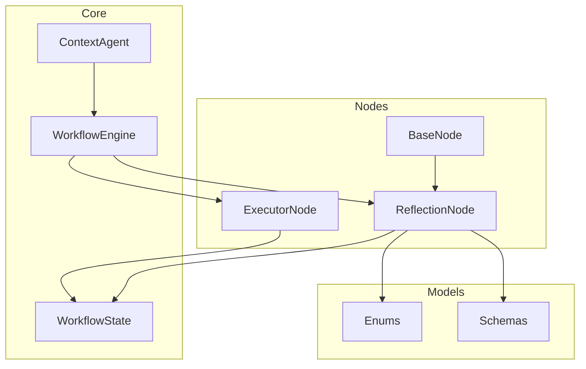
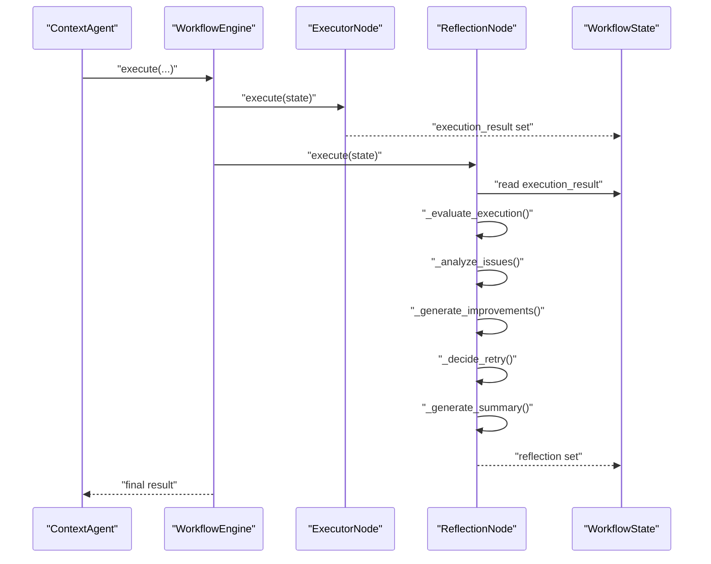
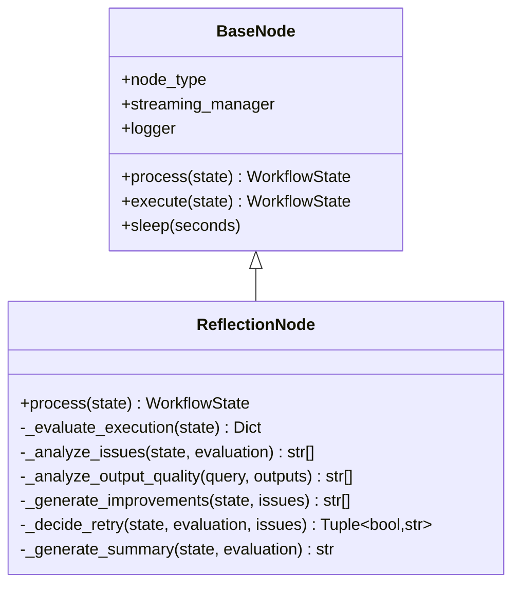
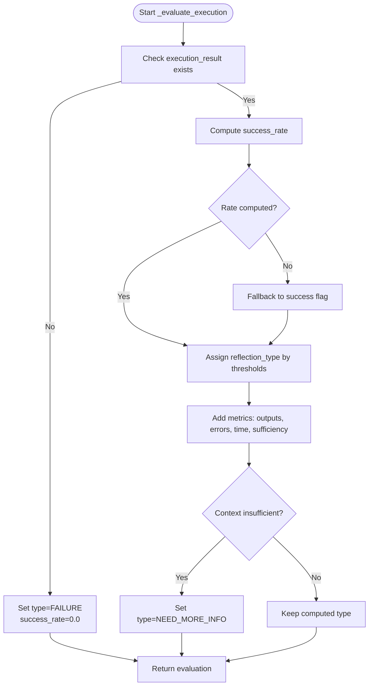
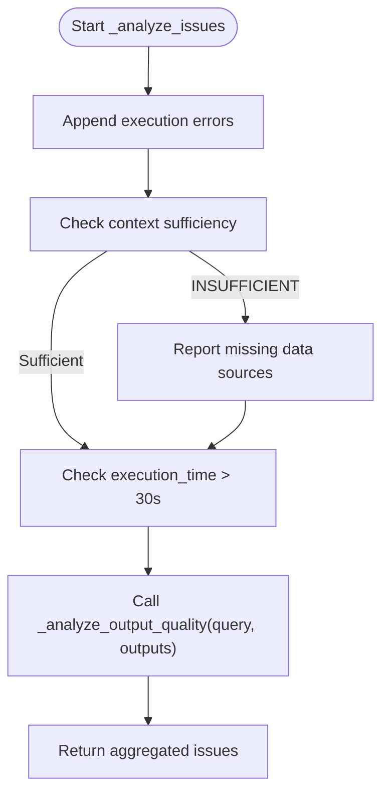
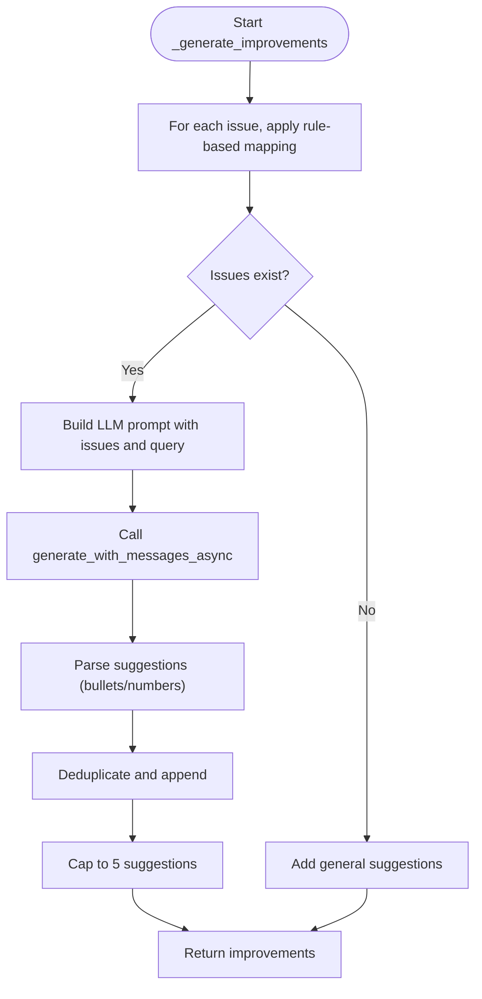
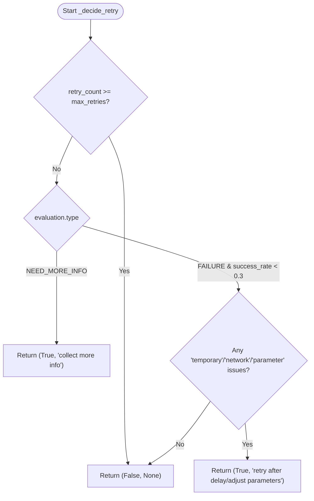
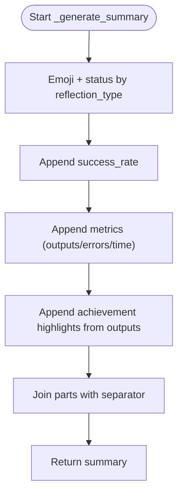
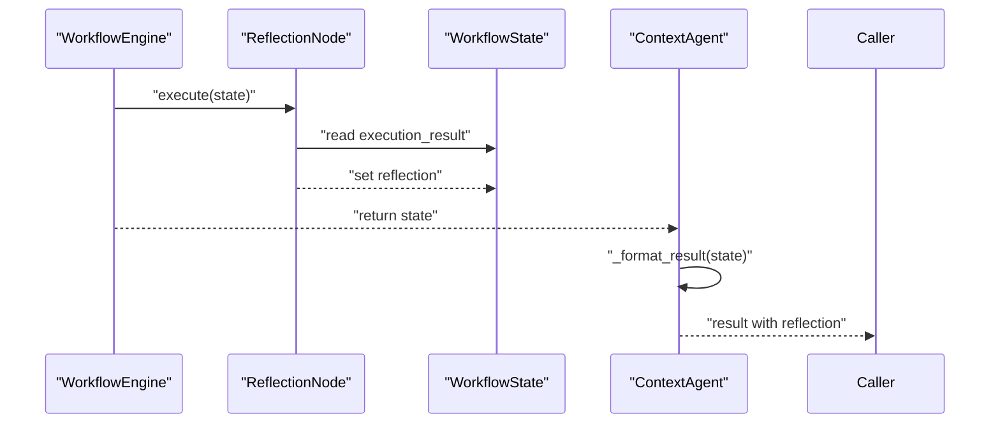
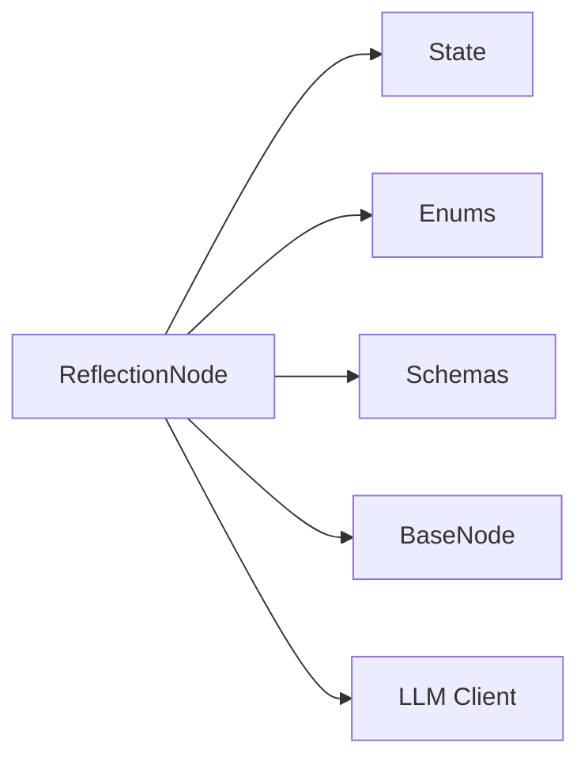

# Reflection Node

<cite>
**Referenced Files in This Document**
- [reflection.py](file://opencontext/context_consumption/context_agent/nodes/reflection.py)
- [base.py](file://opencontext/context_consumption/context_agent/nodes/base.py)
- [enums.py](file://opencontext/context_consumption/context_agent/models/enums.py)
- [schemas.py](file://opencontext/context_consumption/context_agent/models/schemas.py)
- [state.py](file://opencontext/context_consumption/context_agent/core/state.py)
- [workflow.py](file://opencontext/context_consumption/context_agent/core/workflow.py)
- [agent.py](file://opencontext/context_consumption/context_agent/agent.py)
- [executor.py](file://opencontext/context_consumption/context_agent/nodes/executor.py)
</cite>

## Table of Contents
1. [Introduction](#introduction)
2. [Project Structure](#project-structure)
3. [Core Components](#core-components)
4. [Architecture Overview](#architecture-overview)
5. [Detailed Component Analysis](#detailed-component-analysis)
6. [Dependency Analysis](#dependency-analysis)
7. [Performance Considerations](#performance-considerations)
8. [Troubleshooting Guide](#troubleshooting-guide)
9. [Conclusion](#conclusion)

## Introduction
This document explains the ReflectionNode architecture that powers MineContext’s post-execution evaluation system. ReflectionNode performs a comprehensive analysis of task execution results across five phases:
- Evaluation: computes a success rate and assigns a reflection type.
- Issue Analysis: identifies problems from execution errors, insufficient context, performance issues, and output quality.
- Improvement Generation: produces actionable suggestions via rule-based mapping and LLM-powered analysis.
- Retry Decision: decides whether to retry based on evaluation and issue types.
- Summary Creation: builds a concise, emoji-enhanced summary for human-readable reporting.

The document focuses on the implementation of the _evaluate_execution method and the _analyze_issues method, and it explains how improvement suggestions are generated both through rule-based mapping and LLM-powered analysis, and how retry decisions are made. It also covers the error handling strategy that ensures reflection failures do not terminate the workflow and how the node creates a comprehensive summary with emoji indicators.

## Project Structure
ReflectionNode is part of the context consumption agent’s node subsystem. It integrates with the workflow engine and state management to produce a structured reflection result.

**Diagram sources**
- [reflection.py](file://opencontext/context_consumption/context_agent/nodes/reflection.py#L1-L334)
- [base.py](file://opencontext/context_consumption/context_agent/nodes/base.py#L1-L55)
- [enums.py](file://opencontext/context_consumption/context_agent/models/enums.py#L1-L111)
- [schemas.py](file://opencontext/context_consumption/context_agent/models/schemas.py#L1-L263)
- [state.py](file://opencontext/context_consumption/context_agent/core/state.py#L1-L278)
- [workflow.py](file://opencontext/context_consumption/context_agent/core/workflow.py#L1-L208)
- [agent.py](file://opencontext/context_consumption/context_agent/agent.py#L1-L165)
- [executor.py](file://opencontext/context_consumption/context_agent/nodes/executor.py#L1-L276)

**Section sources**
- [reflection.py](file://opencontext/context_consumption/context_agent/nodes/reflection.py#L1-L334)
- [workflow.py](file://opencontext/context_consumption/context_agent/core/workflow.py#L1-L208)
- [state.py](file://opencontext/context_consumption/context_agent/core/state.py#L1-L278)

## Core Components
- ReflectionNode: Implements the five-phase evaluation pipeline and emits streaming events.
- BaseNode: Provides shared node behavior, including timing and error propagation.
- Enums: Defines reflection types, workflow stages, and other enumerations used by ReflectionNode.
- Schemas: Defines ExecutionResult and ReflectionResult structures consumed by ReflectionNode.
- WorkflowState: Holds execution_result and other artifacts used by ReflectionNode.
- WorkflowEngine: Orchestrates nodes and stages; ReflectionNode participates in the workflow.
- ContextAgent: Public API that surfaces reflection results.

Key responsibilities:
- Compute success rate from execution steps or top-level success flag.
- Assign reflection type based on thresholds and context sufficiency.
- Detect issues from errors, context insufficiency, execution time, and output quality.
- Generate improvement suggestions via rule-based mapping and LLM-powered analysis.
- Decide whether to retry based on evaluation and issue characteristics.
- Produce a summary enriched with emoji indicators.

**Section sources**
- [reflection.py](file://opencontext/context_consumption/context_agent/nodes/reflection.py#L20-L137)
- [enums.py](file://opencontext/context_consumption/context_agent/models/enums.py#L1-L111)
- [schemas.py](file://opencontext/context_consumption/context_agent/models/schemas.py#L240-L263)
- [state.py](file://opencontext/context_consumption/context_agent/core/state.py#L41-L73)
- [workflow.py](file://opencontext/context_consumption/context_agent/core/workflow.py#L34-L57)
- [agent.py](file://opencontext/context_consumption/context_agent/agent.py#L50-L92)

## Architecture Overview
The ReflectionNode lifecycle is invoked after execution completes. It reads the execution_result from WorkflowState, evaluates outcomes, analyzes issues, generates improvements, decides retry, and writes a ReflectionResult into state.

**Diagram sources**
- [workflow.py](file://opencontext/context_consumption/context_agent/core/workflow.py#L125-L163)
- [executor.py](file://opencontext/context_consumption/context_agent/nodes/executor.py#L22-L87)
- [reflection.py](file://opencontext/context_consumption/context_agent/nodes/reflection.py#L26-L87)
- [state.py](file://opencontext/context_consumption/context_agent/core/state.py#L41-L73)

## Detailed Component Analysis

### ReflectionNode Class
ReflectionNode inherits from BaseNode and implements a five-phase pipeline in process. It updates the workflow stage to REFLECTION, then orchestrates:
- _evaluate_execution: computes success rate and reflection type.
- _analyze_issues: aggregates issues from errors, context sufficiency, execution time, and output quality.
- _generate_improvements: produces suggestions via rule-based mapping and LLM-powered analysis.
- _decide_retry: determines retry feasibility and strategy.
- _generate_summary: constructs a concise, emoji-enhanced summary.

Error handling:
- On exceptions, ReflectionNode logs and sets a default ReflectionResult with partial success to keep the workflow moving.

**Diagram sources**
- [base.py](file://opencontext/context_consumption/context_agent/nodes/base.py#L22-L55)
- [reflection.py](file://opencontext/context_consumption/context_agent/nodes/reflection.py#L20-L334)

**Section sources**
- [reflection.py](file://opencontext/context_consumption/context_agent/nodes/reflection.py#L20-L87)
- [base.py](file://opencontext/context_consumption/context_agent/nodes/base.py#L22-L55)

### Evaluation Phase: _evaluate_execution
Responsibilities:
- Validates presence of execution_result.
- Computes success_rate:
  - If execution_plan.steps exist, counts successes among steps.
  - Otherwise, uses execution_result.success.
- Assigns reflection_type:
  - >= 0.9: SUCCESS
  - >= 0.5: PARTIAL_SUCCESS
  - < 0.5: FAILURE
- Adds metrics:
  - total_outputs, total_errors, execution_time, context_sufficiency.
- Special case:
  - If context sufficiency is INSUFFICIENT, sets reflection_type to NEED_MORE_INFO.

Thresholds and logic:
- Success rate thresholds drive reflection_type selection.
- Context sufficiency overrides other types.

**Diagram sources**
- [reflection.py](file://opencontext/context_consumption/context_agent/nodes/reflection.py#L88-L136)
- [schemas.py](file://opencontext/context_consumption/context_agent/models/schemas.py#L240-L263)
- [enums.py](file://opencontext/context_consumption/context_agent/models/enums.py#L94-L111)

**Section sources**
- [reflection.py](file://opencontext/context_consumption/context_agent/nodes/reflection.py#L88-L136)
- [schemas.py](file://opencontext/context_consumption/context_agent/models/schemas.py#L240-L263)
- [enums.py](file://opencontext/context_consumption/context_agent/models/enums.py#L94-L111)

### Issue Analysis Phase: _analyze_issues
Responsibilities:
- Collects execution errors from execution_result.errors.
- Checks context sufficiency; if INSUFFICIENT, reports missing data sources.
- Flags long execution time (> 30 seconds).
- Evaluates output quality using LLM:
  - Builds a prompt with query and a truncated output summary.
  - Calls generate_with_messages_async to assess adequacy.
  - Parses non-"None" responses into issue entries.

Output quality assessment:
- Uses a system prompt role and a user prompt containing query and output summary.
- Parses LLM response lines, skipping headers and empty lines, to collect issues.

**Diagram sources**
- [reflection.py](file://opencontext/context_consumption/context_agent/nodes/reflection.py#L138-L204)
- [reflection.py](file://opencontext/context_consumption/context_agent/nodes/reflection.py#L169-L204)

**Section sources**
- [reflection.py](file://opencontext/context_consumption/context_agent/nodes/reflection.py#L138-L204)

### Improvement Generation: _generate_improvements
Responsibilities:
- Rule-based mapping:
  - For "Insufficient context information": suggests collecting more context and using web search.
  - For "Execution error": suggests validating input parameters and optimizing error handling.
  - For "Execution time too long": suggests algorithm optimization, caching, and parallel processing.
  - For "Output quality issue": suggests enhancing prompts and adding output validation.
- LLM-powered suggestions:
  - If issues exist, constructs a prompt listing issues and the original query.
  - Calls generate_with_messages_async to generate 3–5 specific suggestions.
  - Parses bullet points and numbered lists, cleans formatting, and deduplicates.
- Fallback:
  - If no suggestions are produced, adds general suggestions to continue monitoring and collect feedback.
- Caps suggestions to 5.

**Diagram sources**
- [reflection.py](file://opencontext/context_consumption/context_agent/nodes/reflection.py#L205-L263)

**Section sources**
- [reflection.py](file://opencontext/context_consumption/context_agent/nodes/reflection.py#L205-L263)

### Retry Decision: _decide_retry
Responsibilities:
- Respects retry limits: if retry_count >= max_retries, do not retry.
- NEED_MORE_INFO: retry with a strategy to collect more information.
- FAILURE with low success_rate (< 0.3):
  - If issues indicate temporary or network-related causes, retry with a delay and strategy.
  - If issues indicate parameter-related causes, retry with adjusted parameters.
- Returns should_retry and retry_strategy.

**Diagram sources**
- [reflection.py](file://opencontext/context_consumption/context_agent/nodes/reflection.py#L264-L289)
- [state.py](file://opencontext/context_consumption/context_agent/core/state.py#L68-L73)

**Section sources**
- [reflection.py](file://opencontext/context_consumption/context_agent/nodes/reflection.py#L264-L289)
- [state.py](file://opencontext/context_consumption/context_agent/core/state.py#L68-L73)

### Summary Creation: _generate_summary
Responsibilities:
- Emoji-based status indicator based on reflection_type.
- Success rate percentage.
- Metrics: total outputs, total errors, execution time.
- Achievement highlights from outputs (e.g., document created, summary generated, analysis completed).
- Joins parts with separators for readability.

**Diagram sources**
- [reflection.py](file://opencontext/context_consumption/context_agent/nodes/reflection.py#L291-L334)

**Section sources**
- [reflection.py](file://opencontext/context_consumption/context_agent/nodes/reflection.py#L291-L334)

### Integration with Workflow and State
- WorkflowEngine initializes ReflectionNode and invokes it after execution.
- ReflectionNode writes a ReflectionResult into WorkflowState.
- ContextAgent surfaces reflection results in the public API.

**Diagram sources**
- [workflow.py](file://opencontext/context_consumption/context_agent/core/workflow.py#L34-L57)
- [reflection.py](file://opencontext/context_consumption/context_agent/nodes/reflection.py#L26-L87)
- [state.py](file://opencontext/context_consumption/context_agent/core/state.py#L41-L73)
- [agent.py](file://opencontext/context_consumption/context_agent/agent.py#L50-L92)

**Section sources**
- [workflow.py](file://opencontext/context_consumption/context_agent/core/workflow.py#L34-L57)
- [agent.py](file://opencontext/context_consumption/context_agent/agent.py#L50-L92)
- [state.py](file://opencontext/context_consumption/context_agent/core/state.py#L41-L73)

## Dependency Analysis
- ReflectionNode depends on:
  - WorkflowState for execution_result and context sufficiency.
  - Enums for reflection_type and context sufficiency.
  - Schemas for ExecutionResult and ReflectionResult.
  - BaseNode for node lifecycle and logging.
  - LLM client for output quality assessment and improvement suggestions.
- Coupling:
  - Low to ExecutionNode via execution_result.
  - Moderate to state and enums/schemas.
- Cohesion:
  - High within ReflectionNode for evaluation and reporting.
- External dependencies:
  - LLM client for streaming and non-streaming calls.
  - Logging utilities for error handling.

**Diagram sources**
- [reflection.py](file://opencontext/context_consumption/context_agent/nodes/reflection.py#L1-L334)
- [state.py](file://opencontext/context_consumption/context_agent/core/state.py#L1-L278)
- [enums.py](file://opencontext/context_consumption/context_agent/models/enums.py#L1-L111)
- [schemas.py](file://opencontext/context_consumption/context_agent/models/schemas.py#L1-L263)
- [base.py](file://opencontext/context_consumption/context_agent/nodes/base.py#L1-L55)

**Section sources**
- [reflection.py](file://opencontext/context_consumption/context_agent/nodes/reflection.py#L1-L334)
- [state.py](file://opencontext/context_consumption/context_agent/core/state.py#L1-L278)
- [enums.py](file://opencontext/context_consumption/context_agent/models/enums.py#L1-L111)
- [schemas.py](file://opencontext/context_consumption/context_agent/models/schemas.py#L1-L263)
- [base.py](file://opencontext/context_consumption/context_agent/nodes/base.py#L1-L55)

## Performance Considerations
- Success rate computation:
  - Prefer step-level success counting when execution_plan.steps are present to avoid O(n) iteration over outputs.
- Output quality assessment:
  - Truncates output summary to limit prompt size and reduce latency.
  - Uses asynchronous LLM calls to avoid blocking the main thread.
- Retry decision:
  - Early exits when max retries are reached to prevent unnecessary work.
- Streaming:
  - Emits progress and completion events to keep clients informed without heavy polling.

[No sources needed since this section provides general guidance]

## Troubleshooting Guide
Common issues and mitigations:
- ReflectionNode fails:
  - Symptom: Exception raised during reflection.
  - Behavior: Logs exception and sets a default ReflectionResult with partial success and should_retry=False to keep the workflow moving.
  - Action: Inspect state.errors and review LLM client availability.
- Output quality analysis fails:
  - Symptom: LLM call raises an exception.
  - Behavior: Logs error and continues without quality issues.
  - Action: Verify LLM client configuration and network connectivity.
- Retry not triggered:
  - Symptom: should_retry remains False.
  - Causes:
    - retry_count >= max_retries.
    - evaluation.type is not NEED_MORE_INFO and success_rate is not low enough.
    - Issues do not match retry criteria (temporary/network/parameter).
  - Action: Adjust thresholds or improve context sufficiency.
- Summary lacks achievements:
  - Symptom: Summary does not include achievement highlights.
  - Cause: Outputs do not match recognized types.
  - Action: Ensure outputs include supported types for highlighting.

**Section sources**
- [reflection.py](file://opencontext/context_consumption/context_agent/nodes/reflection.py#L75-L87)
- [reflection.py](file://opencontext/context_consumption/context_agent/nodes/reflection.py#L169-L204)
- [reflection.py](file://opencontext/context_consumption/context_agent/nodes/reflection.py#L264-L289)
- [state.py](file://opencontext/context_consumption/context_agent/core/state.py#L68-L73)

## Conclusion
ReflectionNode provides a robust, extensible post-execution evaluation system. It computes meaningful success rates, detects actionable issues, generates practical improvements, and makes informed retry decisions while keeping the workflow resilient. Its emoji-enhanced summaries improve readability for human operators. The design cleanly separates concerns across evaluation, analysis, generation, retry, and summarization phases, leveraging state and enums for clarity and reliability.