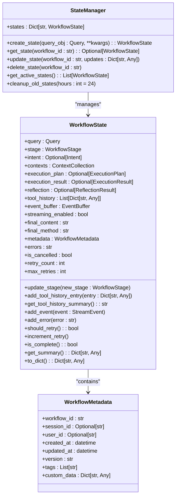
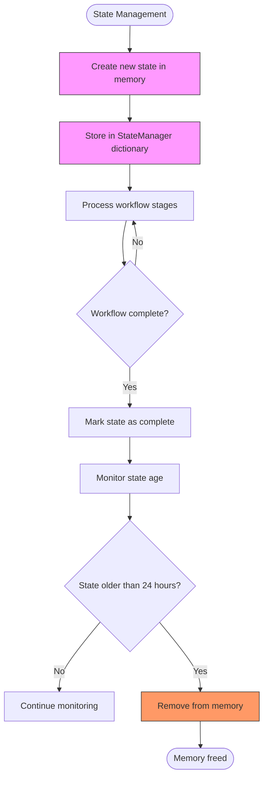
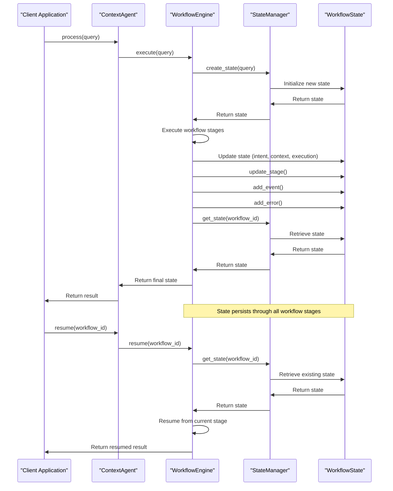
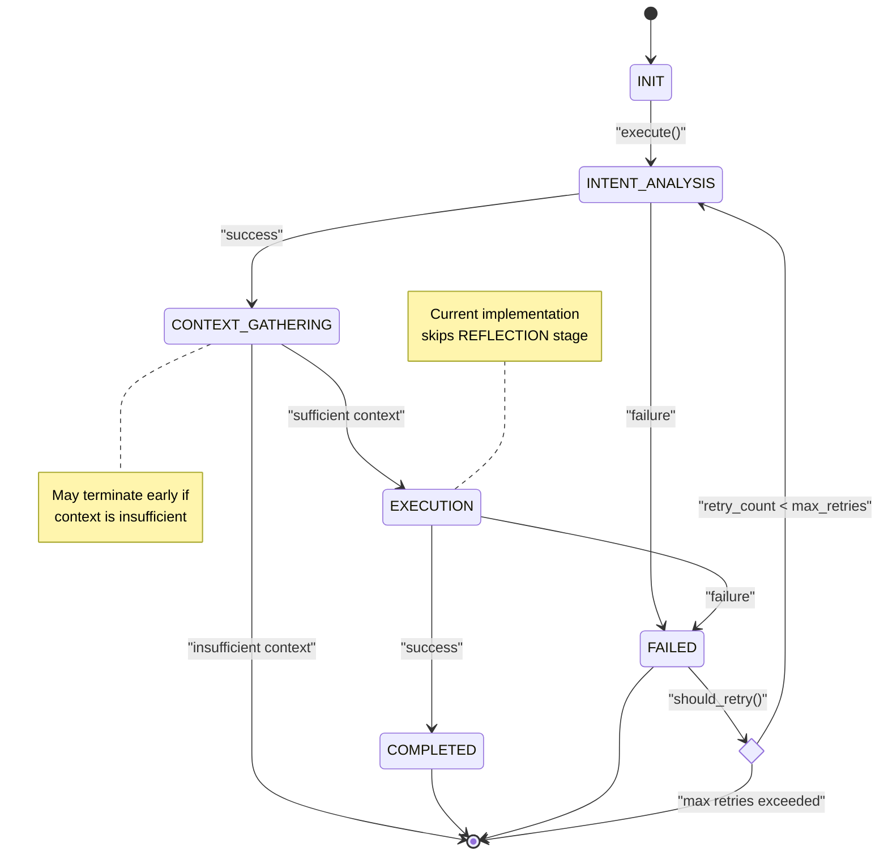

# State Management

<cite>
**Referenced Files in This Document**   
- [state.py](file://opencontext/context_consumption/context_agent/core/state.py)
- [workflow.py](file://opencontext/context_consumption/context_agent/core/workflow.py)
- [schemas.py](file://opencontext/context_consumption/context_agent/models/schemas.py)
- [enums.py](file://opencontext/context_consumption/context_agent/models/enums.py)
- [agent.py](file://opencontext/context_consumption/context_agent/agent.py)
- [streaming.py](file://opencontext/context_consumption/context_agent/core/streaming.py)
- [events.py](file://opencontext/context_consumption/context_agent/models/events.py)
</cite>

## Table of Contents
1. [Introduction](#introduction)
2. [WorkflowState Data Model](#workflowstate-data-model)
3. [StateManager Class](#statemanager-class)
4. [State Persistence and Memory Management](#state-persistence-and-memory-management)
5. [Integration with WorkflowEngine](#integration-with-workflowengine)
6. [State Transitions and Lifecycle](#state-transitions-and-lifecycle)
7. [State Data Formatting for API Responses](#state-data-formatting-for-api-responses)
8. [Thread Safety and Concurrency Considerations](#thread-safety-and-concurrency-considerations)
9. [Conclusion](#conclusion)

## Introduction

The State Management system in MineContext is responsible for maintaining the lifecycle of context agent workflows, providing persistence and tracking capabilities for complex AI-driven processes. This system enables resumable operations, state recovery, and comprehensive workflow monitoring through a well-defined state model and management infrastructure. The core components include the `WorkflowState` data model that captures all aspects of a workflow's execution, and the `StateManager` class that handles state creation, retrieval, updating, and cleanup. This documentation provides a detailed analysis of how state is managed throughout the workflow lifecycle, from initialization to completion or failure, and how this state information is used to support the system's advanced capabilities.

**Section sources**
- [state.py](file://opencontext/context_consumption/context_agent/core/state.py#L1-L278)
- [workflow.py](file://opencontext/context_consumption/context_agent/core/workflow.py#L1-L208)

## WorkflowState Data Model

The `WorkflowState` class serves as the central data structure for capturing the complete state of a context agent workflow. This comprehensive model includes query information, intent analysis results, context data, execution outcomes, and reflection results, providing a complete snapshot of the workflow at any point in time.

The state model begins with core data elements including the user query encapsulated in a `Query` object and the current workflow stage represented by the `WorkflowStage` enumeration. The query contains the user's input text, query type, user ID, session ID, selected content, and document ID, providing essential context for processing.

Throughout the workflow execution, various stages populate their respective results within the state object. The intent analysis phase stores results in the `intent` field, which includes the original query, enhanced query, and query type classification. Context gathering populates the `contexts` field with a `ContextCollection` containing collected context items from various sources such as documents, web searches, and chat history. The execution phase records results in the `execution_result` field, capturing success status, outputs, errors, and execution time. Finally, the reflection phase stores evaluation results in the `reflection` field, including success rate, summary, issues, and potential improvements.

Additional metadata and tracking information are maintained through several fields. The `tool_history` list records all tool calls and validations, providing an audit trail of external interactions. The `event_buffer` stores streaming events for real-time updates, while `final_content` and `final_method` capture the ultimate output of successful workflows. Error tracking is handled through the `errors` string field, which accumulates error messages throughout execution.

The state model also includes lifecycle management properties such as `is_cancelled` flag, `retry_count` and `max_retries` for handling failures, and metadata encapsulated in the `WorkflowMetadata` class. This metadata includes the unique `workflow_id`, `session_id`, `user_id`, creation and update timestamps, version information, tags, and custom data, enabling comprehensive tracking and organization of workflow instances.

**Section sources**
- [state.py](file://opencontext/context_consumption/context_agent/core/state.py#L42-L208)
- [schemas.py](file://opencontext/context_consumption/context_agent/models/schemas.py#L40-L263)
- [enums.py](file://opencontext/context_consumption/context_agent/models/enums.py#L21-L32)

## StateManager Class

The `StateManager` class provides the primary interface for managing workflow states in the MineContext system. This class implements a simple yet effective in-memory storage mechanism using a dictionary to map workflow IDs to their corresponding `WorkflowState` objects, enabling efficient state operations.

The state manager exposes several key methods for state manipulation. The `create_state` method initializes a new workflow state with a provided query object and optional parameters such as session ID, user ID, and streaming configuration. This method generates a unique workflow ID using UUID, creates the necessary metadata, and optionally incorporates additional context like chat history or selected content before storing the state in the internal dictionary.

State retrieval is handled by the `get_state` method, which takes a workflow ID as a parameter and returns the corresponding `WorkflowState` object if it exists, or None otherwise. This simple lookup operation enables other components to access workflow state for monitoring, continuation, or analysis purposes.

State updates are performed through the `update_state` method, which accepts a workflow ID and a dictionary of updates. This method applies the updates to the specified state by setting the corresponding attributes, ensuring that only existing attributes are modified. After applying updates, the method automatically updates the state's `updated_at` timestamp to reflect the modification time.

The state manager also provides methods for state lifecycle management. The `delete_state` method removes a state from the internal storage using its workflow ID, effectively cleaning up resources. The `get_active_states` method returns a list of all currently active workflows by filtering out completed or cancelled states, which is useful for monitoring and management interfaces.

For long-term system health, the state manager includes the `cleanup_old_states` method, which periodically removes completed workflows that have not been accessed within a specified time period (defaulting to 24 hours). This automatic cleanup prevents unbounded memory growth while preserving active and recently completed workflows for potential resumption or analysis.



**Diagram sources **
- [state.py](file://opencontext/context_consumption/context_agent/core/state.py#L211-L277)

**Section sources**
- [state.py](file://opencontext/context_consumption/context_agent/core/state.py#L211-L277)

## State Persistence and Memory Management

The State Management system in MineContext employs an in-memory persistence mechanism that balances performance with resource efficiency. The primary storage is implemented as a dictionary within the `StateManager` class, where workflow IDs serve as keys and `WorkflowState` objects as values. This approach provides O(1) time complexity for state retrieval, creation, and deletion operations, ensuring minimal overhead during workflow execution.

Memory management is addressed through a combination of automatic cleanup mechanisms and state lifecycle tracking. The `cleanup_old_states` method implements a time-based cleanup policy that removes completed workflows after a configurable period (defaulting to 24 hours). This method iterates through all stored states, identifying those that are both complete and have not been updated beyond the specified threshold. By removing these stale states, the system prevents unbounded memory growth while maintaining access to recently completed workflows that might be needed for auditing or analysis.

The state model itself incorporates several memory optimization features. The `EventBuffer` class, used within `WorkflowState`, implements a bounded buffer with a maximum size of 1,000 events. When this limit is exceeded, older events are automatically discarded through a sliding window mechanism (`self.events = self.events[-self.max_size :]`), ensuring that memory usage remains predictable regardless of workflow duration.

For long-running workflows, the system manages memory through selective data retention. While core state information is preserved throughout the workflow lifecycle, transient data is handled appropriately. For example, streaming events are processed and then can be discarded once consumed by clients, while intermediate processing results are stored only as needed for subsequent workflow stages.

The state manager's design also supports potential future extensions for persistent storage. Although currently implemented as in-memory storage, the clean separation between the state management interface and its implementation would allow for relatively straightforward integration with external storage systems such as databases or file-based persistence without requiring changes to the core workflow logic.



**Diagram sources **
- [state.py](file://opencontext/context_consumption/context_agent/core/state.py#L265-L277)

**Section sources**
- [state.py](file://opencontext/context_consumption/context_agent/core/state.py#L265-L277)

## Integration with WorkflowEngine

The State Management system is tightly integrated with the `WorkflowEngine` class, which orchestrates the execution of context agent workflows. This integration enables state persistence across workflow stages and supports resumable operations through the engine's `resume` method.

The `WorkflowEngine` maintains a reference to a `StateManager` instance, either provided during initialization or created automatically. When a new workflow is initiated through the `execute` method, the engine creates a new state by calling the state manager's `create_state` method with the user's query and context parameters. This state becomes the central data structure that is passed through each stage of the workflow.

Throughout the workflow execution, each processing node updates the state as it completes its tasks. For example, the `IntentNode` updates the state with intent analysis results, while the `ContextNode` populates the context collection. These modifications are made directly to the state object, which is then passed to the next stage, ensuring that all accumulated information is preserved and available for subsequent processing.

The most significant integration point is the `resume` method, which enables the continuation of interrupted workflows. When called with a workflow ID, this method retrieves the existing state from the state manager and resumes execution from the current stage. This capability is particularly valuable for workflows that require user input or encounter temporary failures, as it allows the process to pick up exactly where it left off without losing any previously gathered context or analysis.

The engine also uses the state manager for workflow monitoring and control. The `get_state` method provides external access to workflow status, while the `cancel` method allows for graceful termination by marking the state as cancelled and failed. These operations are performed through the state manager, ensuring consistent state management across all workflow interactions.



**Diagram sources **
- [workflow.py](file://opencontext/context_consumption/context_agent/core/workflow.py#L175-L197)
- [agent.py](file://opencontext/context_consumption/context_agent/agent.py#L103-L115)

**Section sources**
- [workflow.py](file://opencontext/context_consumption/context_agent/core/workflow.py#L175-L197)
- [agent.py](file://opencontext/context_consumption/context_agent/agent.py#L103-L115)

## State Transitions and Lifecycle

The workflow state lifecycle in MineContext follows a well-defined progression through various stages, each representing a distinct phase of processing. The `WorkflowStage` enumeration defines the possible states: INIT, INTENT_ANALYSIS, CONTEXT_GATHERING, EXECUTION, REFLECTION, COMPLETED, and FAILED. These stages form a directed progression that guides the workflow from initialization to completion or failure.

State transitions are managed through the `update_stage` method of the `WorkflowState` class, which updates the current stage and automatically refreshes the `updated_at` timestamp in the metadata. This method is called by the `WorkflowEngine` as it progresses through the workflow stages, ensuring that the state accurately reflects the current processing phase.

The lifecycle begins with the INIT stage when a new state is created. The first processing stage is INTENT_ANALYSIS, where the system analyzes the user's query to determine its type and intent. If this stage fails, the workflow transitions directly to the FAILED stage. Upon successful completion, the workflow moves to CONTEXT_GATHERING, where relevant context information is collected from various sources.

After context gathering, the workflow proceeds to the EXECUTION stage, where the actual processing or action takes place based on the gathered context and analyzed intent. The current implementation shows that the REFLECTION stage is commented out, indicating it may be a future enhancement or conditionally enabled feature. Upon successful execution, the workflow transitions to the COMPLETED stage, marking the end of successful processing.

The state model also supports conditional transitions based on context sufficiency. If during context gathering the system determines that sufficient context cannot be obtained, the workflow may terminate early without proceeding to execution. Similarly, the `should_retry` method enables conditional retry logic based on the retry count, cancellation status, and current stage, allowing for recovery from transient failures.

Throughout the lifecycle, various state methods support transition management. The `is_complete` method checks whether the workflow has reached a terminal state (COMPLETED or FAILED), while the `increment_retry` method tracks retry attempts for failed workflows. These methods work together to ensure proper state progression and prevent invalid transitions.



**Diagram sources **
- [enums.py](file://opencontext/context_consumption/context_agent/models/enums.py#L21-L32)
- [state.py](file://opencontext/context_consumption/context_agent/core/state.py#L121-L135)
- [workflow.py](file://opencontext/context_consumption/context_agent/core/workflow.py#L125-L162)

**Section sources**
- [state.py](file://opencontext/context_consumption/context_agent/core/state.py#L74-L77)
- [workflow.py](file://opencontext/context_consumption/context_agent/core/workflow.py#L125-L162)

## State Data Formatting for API Responses

The State Management system provides mechanisms for formatting state data for API responses, enabling external systems to access workflow information in a structured format. This is primarily accomplished through the `to_dict` method of the `WorkflowState` class and the `_format_result` method in the `ContextAgent` class.

The `to_dict` method converts the complete workflow state into a dictionary representation suitable for JSON serialization. This method includes all essential state information while converting complex objects into primitive types. For example, datetime objects are converted to ISO format strings, and nested data structures are recursively converted to dictionaries. The method includes query information, current stage, intent analysis results, context collection details, execution results, reflection outcomes, metadata, and error information.

The `_format_result` method in the `ContextAgent` class provides a higher-level formatting function that creates a response structure tailored for API consumers. This method extracts relevant information from the state and organizes it into a consistent response format that includes success status, workflow ID, current stage, and the original query. It conditionally includes stage-specific results such as intent analysis, context information, execution outcomes, and reflection results only when they are available.

For streaming responses, the system uses the `StreamingManager` and `StreamEvent` classes to provide real-time updates. The `StreamEvent` class defines a standardized event structure with type, content, stage, progress, timestamp, and metadata fields. These events are emitted throughout the workflow execution and can be serialized to JSON for transmission to clients, providing granular updates on the workflow's progress.

The formatting approach balances completeness with efficiency by including summary information for complex data structures. For example, the context collection is represented by a count of items and sufficiency status rather than the complete context data, while detailed information is available through separate endpoints or on request. This design minimizes response size while still providing meaningful status information.

```mermaid
flowchart TD
A[WorkflowState Object] --> B[to_dict() method]
B --> C[Complete state dictionary]
C --> D{Response Type?}
D --> |API Result| E[_format_result() method]
D --> |Streaming| F[StreamEvent objects]
E --> G[Formatted API response]
F --> H[Serialized JSON events]
G --> I[Client Application]
H --> I
subgraph "API Response Structure"
G
G --> G1["success: boolean"]
G --> G2["workflow_id: string"]
G --> G3["stage: string"]
G --> G4["query: string"]
G --> G5["intent: object"]
G --> G6["context: object"]
G --> G7["execution: object"]
G --> G8["reflection: object"]
G --> G9["errors: string"]
end
style G1 fill:#e6f3ff,stroke:#333
style G2 fill:#e6f3ff,stroke:#333
style G3 fill:#e6f3ff,stroke:#333
style G4 fill:#e6f3ff,stroke:#333
```

**Diagram sources **
- [state.py](file://opencontext/context_consumption/context_agent/core/state.py#L155-L208)
- [agent.py](file://opencontext/context_consumption/context_agent/agent.py#L50-L92)
- [events.py](file://opencontext/context_consumption/context_agent/models/events.py#L16-L63)

**Section sources**
- [state.py](file://opencontext/context_consumption/context_agent/core/state.py#L155-L208)
- [agent.py](file://opencontext/context_consumption/context_agent/agent.py#L50-L92)

## Thread Safety and Concurrency Considerations

The State Management system in MineContext is designed with concurrency in mind, operating within an asynchronous programming model that leverages Python's asyncio framework. While the current implementation does not explicitly incorporate thread synchronization primitives, it follows patterns that support safe operation in concurrent environments.

The state management operations are designed to be atomic at the method level, with each state manipulation method performing a complete operation before returning. For example, the `update_state` method applies all requested updates and updates the timestamp within a single method call, reducing the window for race conditions. The use of Python's dictionary data structure for state storage benefits from the Global Interpreter Lock (GIL), which provides implicit thread safety for individual operations on built-in types.

The system's asynchronous nature is evident in the use of async/await syntax throughout the state management and workflow execution code. The `StreamingManager` class uses an asyncio.Queue to handle event emission and consumption, which is designed for safe operation in asynchronous contexts. This queue-based approach allows multiple coroutines to emit events concurrently while ensuring ordered delivery to consumers.

For long-running workflows, the system manages concurrency through the separation of state storage from processing logic. Each workflow operates on its own state instance, minimizing shared mutable state between concurrent workflows. The `WorkflowEngine` processes one workflow at a time per instance, but multiple engine instances can operate concurrently with their own state managers, enabling horizontal scaling.

The design also considers memory safety in concurrent environments. The `cleanup_old_states` method operates on a snapshot of state items to avoid modification during iteration, and state deletion is performed after identifying all candidates for removal. This approach prevents issues that could arise from modifying a collection while iterating over it.

While the current implementation appears to be designed primarily for single-threaded asynchronous execution, the clean separation of concerns and atomic state operations provide a solid foundation for potential future enhancements to support multi-threaded or distributed scenarios.

**Section sources**
- [state.py](file://opencontext/context_consumption/context_agent/core/state.py)
- [streaming.py](file://opencontext/context_consumption/context_agent/core/streaming.py#L9-L45)
- [workflow.py](file://opencontext/context_consumption/context_agent/core/workflow.py)

## Conclusion

The State Management system in MineContext provides a robust foundation for tracking and persisting workflow states throughout the lifecycle of context agent operations. By combining the comprehensive `WorkflowState` data model with the efficient `StateManager` class, the system enables reliable state persistence, resumable operations, and detailed workflow monitoring. The integration with the `WorkflowEngine` allows for seamless state transitions across processing stages, while the automatic cleanup mechanisms ensure responsible memory management for long-running workflows. The system's design supports both immediate execution and continuation of interrupted processes through the resume capability, enhancing user experience and system reliability. With well-defined data formatting for API responses and consideration for concurrency in its asynchronous architecture, the State Management system effectively addresses the complex requirements of AI-driven workflow processing in the MineContext application.