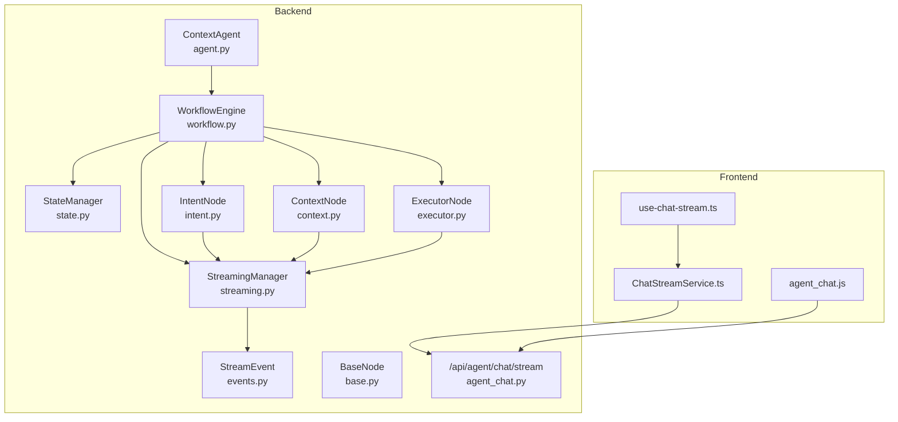
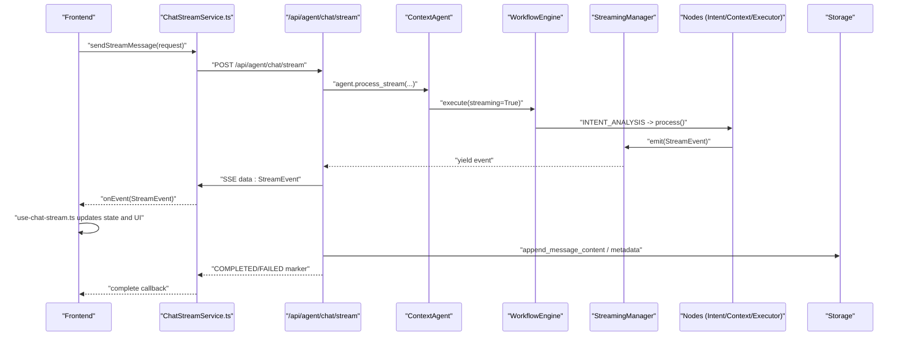
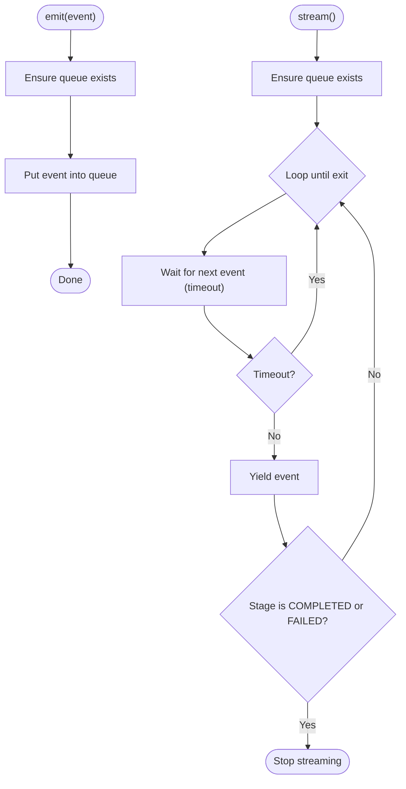
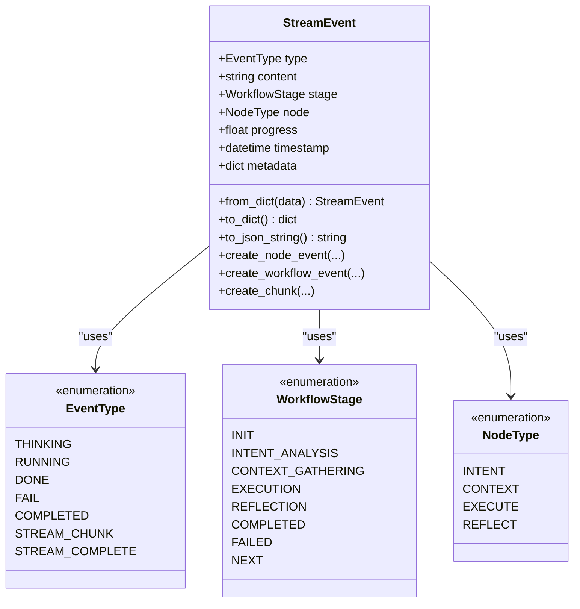
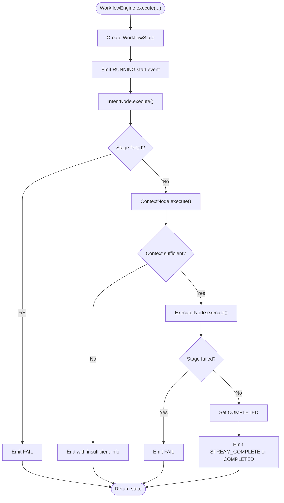
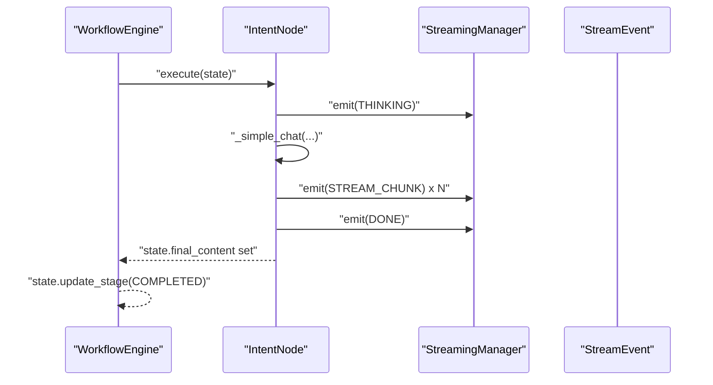
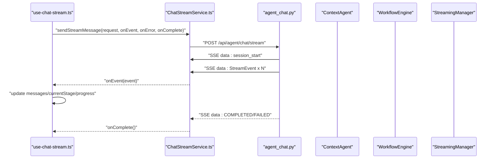
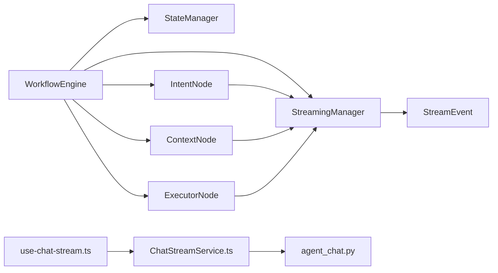

# Streaming Mechanism

<cite>
**Referenced Files in This Document**
- [streaming.py](file://opencontext/context_consumption/context_agent/core/streaming.py)
- [events.py](file://opencontext/context_consumption/context_agent/models/events.py)
- [enums.py](file://opencontext/context_consumption/context_agent/models/enums.py)
- [workflow.py](file://opencontext/context_consumption/context_agent/core/workflow.py)
- [state.py](file://opencontext/context_consumption/context_agent/core/state.py)
- [base.py](file://opencontext/context_consumption/context_agent/nodes/base.py)
- [intent.py](file://opencontext/context_consumption/context_agent/nodes/intent.py)
- [context.py](file://opencontext/context_consumption/context_agent/nodes/context.py)
- [executor.py](file://opencontext/context_consumption/context_agent/nodes/executor.py)
- [agent.py](file://opencontext/context_consumption/context_agent/agent.py)
- [agent_chat.py](file://opencontext/server/routes/agent_chat.py)
- [ChatStreamService.ts](file://frontend/src/renderer/src/services/ChatStreamService.ts)
- [use-chat-stream.ts](file://frontend/src/renderer/src/hooks/use-chat-stream.ts)
- [agent_chat.js](file://opencontext/web/static/js/agent_chat.js)
</cite>

## Table of Contents
1. [Introduction](#introduction)
2. [Project Structure](#project-structure)
3. [Core Components](#core-components)
4. [Architecture Overview](#architecture-overview)
5. [Detailed Component Analysis](#detailed-component-analysis)
6. [Dependency Analysis](#dependency-analysis)
7. [Performance Considerations](#performance-considerations)
8. [Troubleshooting Guide](#troubleshooting-guide)
9. [Conclusion](#conclusion)

## Introduction
This document explains MineContext’s Streaming Mechanism that powers real-time, incremental responses during query processing. It focuses on the StreamingManager class, the event-driven architecture built around StreamEvent, and how the WorkflowEngine coordinates streaming across processing stages (intent recognition, context retrieval, execution). It also documents the event types and payload structures defined in models/events.py, shows how streaming integrates with the frontend, and describes error handling and state management coordination.

## Project Structure
The streaming pipeline spans Python backend components and a React frontend:
- Backend core: StreamingManager, StreamEvent, WorkflowEngine, nodes, and state management
- Frontend hooks and services: ChatStreamService and use-chat-stream hook orchestrate SSE consumption and UI updates

**Diagram sources**
- [streaming.py](file://opencontext/context_consumption/context_agent/core/streaming.py#L1-L46)
- [events.py](file://opencontext/context_consumption/context_agent/models/events.py#L1-L134)
- [workflow.py](file://opencontext/context_consumption/context_agent/core/workflow.py#L1-L208)
- [state.py](file://opencontext/context_consumption/context_agent/core/state.py#L1-L278)
- [base.py](file://opencontext/context_consumption/context_agent/nodes/base.py#L1-L55)
- [intent.py](file://opencontext/context_consumption/context_agent/nodes/intent.py#L1-L264)
- [context.py](file://opencontext/context_consumption/context_agent/nodes/context.py#L1-L171)
- [executor.py](file://opencontext/context_consumption/context_agent/nodes/executor.py#L1-L276)
- [agent.py](file://opencontext/context_consumption/context_agent/agent.py#L1-L164)
- [agent_chat.py](file://opencontext/server/routes/agent_chat.py#L118-L290)
- [ChatStreamService.ts](file://frontend/src/renderer/src/services/ChatStreamService.ts#L95-L174)
- [use-chat-stream.ts](file://frontend/src/renderer/src/hooks/use-chat-stream.ts#L1-L311)
- [agent_chat.js](file://opencontext/web/static/js/agent_chat.js#L88-L131)

**Section sources**
- [streaming.py](file://opencontext/context_consumption/context_agent/core/streaming.py#L1-L46)
- [events.py](file://opencontext/context_consumption/context_agent/models/events.py#L1-L134)
- [workflow.py](file://opencontext/context_consumption/context_agent/core/workflow.py#L1-L208)
- [state.py](file://opencontext/context_consumption/context_agent/core/state.py#L1-L278)
- [base.py](file://opencontext/context_consumption/context_agent/nodes/base.py#L1-L55)
- [intent.py](file://opencontext/context_consumption/context_agent/nodes/intent.py#L1-L264)
- [context.py](file://opencontext/context_consumption/context_agent/nodes/context.py#L1-L171)
- [executor.py](file://opencontext/context_consumption/context_agent/nodes/executor.py#L1-L276)
- [agent.py](file://opencontext/context_consumption/context_agent/agent.py#L1-L164)
- [agent_chat.py](file://opencontext/server/routes/agent_chat.py#L118-L290)
- [ChatStreamService.ts](file://frontend/src/renderer/src/services/ChatStreamService.ts#L95-L174)
- [use-chat-stream.ts](file://frontend/src/renderer/src/hooks/use-chat-stream.ts#L1-L311)
- [agent_chat.js](file://opencontext/web/static/js/agent_chat.js#L88-L131)

## Core Components
- StreamingManager: An async queue-backed event sink and iterator that emits and streams StreamEvent objects. It ensures the queue is bound to the current event loop and exits cleanly upon completion or failure markers.
- StreamEvent: A unified event model carrying type, content, stage, node, progress, timestamp, and metadata. It provides helpers to create node/workflow events and streaming chunks.
- WorkflowEngine: Orchestrates stages and delegates to nodes. It initializes nodes lazily, emits lifecycle events, and streams final outcomes.
- Nodes: IntentNode, ContextNode, ExecutorNode implement process() and use streaming_manager.emit() to publish incremental progress and content.
- StateManager and WorkflowState: Manage workflow state, metadata, and event buffering; integrate with streaming via event_buffer and streaming_enabled.
- Frontend: ChatStreamService consumes SSE, parses events, and forwards them to use-chat-stream, which updates UI state and renders incremental content.

**Section sources**
- [streaming.py](file://opencontext/context_consumption/context_agent/core/streaming.py#L16-L46)
- [events.py](file://opencontext/context_consumption/context_agent/models/events.py#L16-L134)
- [workflow.py](file://opencontext/context_consumption/context_agent/core/workflow.py#L22-L124)
- [base.py](file://opencontext/context_consumption/context_agent/nodes/base.py#L22-L55)
- [intent.py](file://opencontext/context_consumption/context_agent/nodes/intent.py#L32-L154)
- [context.py](file://opencontext/context_consumption/context_agent/nodes/context.py#L27-L166)
- [executor.py](file://opencontext/context_consumption/context_agent/nodes/executor.py#L29-L87)
- [state.py](file://opencontext/context_consumption/context_agent/core/state.py#L27-L154)
- [ChatStreamService.ts](file://frontend/src/renderer/src/services/ChatStreamService.ts#L95-L174)
- [use-chat-stream.ts](file://frontend/src/renderer/src/hooks/use-chat-stream.ts#L94-L247)

## Architecture Overview
The streaming architecture is event-driven and asynchronous:
- The WorkflowEngine drives stages and nodes, emitting StreamEvent instances.
- StreamingManager queues and yields events to consumers.
- The backend SSE route streams events to clients.
- The frontend receives events and updates UI progressively.

**Diagram sources**
- [agent_chat.py](file://opencontext/server/routes/agent_chat.py#L118-L245)
- [agent.py](file://opencontext/context_consumption/context_agent/agent.py#L120-L164)
- [workflow.py](file://opencontext/context_consumption/context_agent/core/workflow.py#L58-L124)
- [streaming.py](file://opencontext/context_consumption/context_agent/core/streaming.py#L27-L46)
- [intent.py](file://opencontext/context_consumption/context_agent/nodes/intent.py#L32-L154)
- [context.py](file://opencontext/context_consumption/context_agent/nodes/context.py#L27-L166)
- [executor.py](file://opencontext/context_consumption/context_agent/nodes/executor.py#L29-L87)
- [ChatStreamService.ts](file://frontend/src/renderer/src/services/ChatStreamService.ts#L95-L174)
- [use-chat-stream.ts](file://frontend/src/renderer/src/hooks/use-chat-stream.ts#L94-L247)

## Detailed Component Analysis

### StreamingManager
Responsibilities:
- Ensures an asyncio.Queue is initialized per event loop.
- Provides emit(event) to enqueue StreamEvent.
- Provides stream() to iterate events until completion/failure markers.

Key behaviors:
- Uses a bounded queue to prevent unbounded memory growth.
- Streams with short timeouts to remain responsive.
- Exits when encountering COMPLETED or FAILED stage events.

**Diagram sources**
- [streaming.py](file://opencontext/context_consumption/context_agent/core/streaming.py#L22-L46)

**Section sources**
- [streaming.py](file://opencontext/context_consumption/context_agent/core/streaming.py#L16-L46)

### StreamEvent and Event Types
StreamEvent fields:
- type: EventType discriminator
- content: Human-readable message or incremental content
- stage: WorkflowStage (optional)
- node: NodeType (optional)
- progress: Float 0.0–1.0 (optional)
- timestamp: ISO datetime
- metadata: Arbitrary structured data

Helper constructors:
- create_node_event(node_type, event_type, stage, message, duration?, error?, ...)
- create_workflow_event(event_type, stage, message, workflow_id, ...)
- create_chunk(content, index, total?, is_final?, ...)

EventType values:
- THINKING, RUNNING, DONE, FAIL
- COMPLETED (final, non-streaming mode)
- STREAM_CHUNK, STREAM_COMPLETE (streaming chunks and completion)

**Diagram sources**
- [events.py](file://opencontext/context_consumption/context_agent/models/events.py#L16-L134)
- [enums.py](file://opencontext/context_consumption/context_agent/models/enums.py#L67-L88)

**Section sources**
- [events.py](file://opencontext/context_consumption/context_agent/models/events.py#L16-L134)
- [enums.py](file://opencontext/context_consumption/context_agent/models/enums.py#L1-L111)

### WorkflowEngine and Stage Coordination
Responsibilities:
- Initializes nodes lazily and wires them to the StreamingManager.
- Executes stages sequentially: INTENT_ANALYSIS → CONTEXT_GATHERING → EXECUTION.
- Emits lifecycle events (RUNNING, DONE, THINKING, FAIL) and final outcomes.
- Supports streaming mode via execute_stream() that yields events from StreamingManager.

**Diagram sources**
- [workflow.py](file://opencontext/context_consumption/context_agent/core/workflow.py#L58-L163)

**Section sources**
- [workflow.py](file://opencontext/context_consumption/context_agent/core/workflow.py#L22-L163)

### Nodes and Streaming Events
- BaseNode.execute() wraps process() and emits FAIL on exceptions.
- IntentNode:
  - Emits THINKING/RUNNING/DONE for classification and simple chat.
  - Emits STREAM_CHUNK for incremental LLM generation.
  - Marks simple chats as COMPLETED.
- ContextNode:
  - Emits RUNNING with progress per iteration.
  - Emits DONE when sufficient or max iterations reached.
- ExecutorNode:
  - Emits THINKING and RUNNING with step progress.
  - Emits STREAM_CHUNK for generation/edit/answer tasks.
  - Emits DONE on completion.

**Diagram sources**
- [base.py](file://opencontext/context_consumption/context_agent/nodes/base.py#L34-L51)
- [intent.py](file://opencontext/context_consumption/context_agent/nodes/intent.py#L32-L154)
- [executor.py](file://opencontext/context_consumption/context_agent/nodes/executor.py#L29-L87)

**Section sources**
- [base.py](file://opencontext/context_consumption/context_agent/nodes/base.py#L22-L55)
- [intent.py](file://opencontext/context_consumption/context_agent/nodes/intent.py#L32-L154)
- [context.py](file://opencontext/context_consumption/context_agent/nodes/context.py#L27-L166)
- [executor.py](file://opencontext/context_consumption/context_agent/nodes/executor.py#L29-L87)

### Streaming API and Frontend Integration
- Backend SSE route:
  - Creates assistant streaming message if conversation_id provided.
  - Yields session_start event with session_id and assistant_message_id.
  - Iterates agent.process_stream(), converts StreamEvent to dict, and streams JSON chunks.
  - Saves thinking content and stream_chunk content to storage; stores other events in metadata.
  - On completion/failure, updates message metadata and marks message finished.
- Frontend:
  - ChatStreamService sends POST to /api/agent/chat/stream, reads SSE, decodes chunks, and invokes callbacks.
  - use-chat-stream.ts updates state (messages, currentStage, progress, error), renders incremental content, and handles cancellation.

**Diagram sources**
- [agent_chat.py](file://opencontext/server/routes/agent_chat.py#L118-L245)
- [ChatStreamService.ts](file://frontend/src/renderer/src/services/ChatStreamService.ts#L95-L174)
- [use-chat-stream.ts](file://frontend/src/renderer/src/hooks/use-chat-stream.ts#L94-L247)
- [agent_chat.js](file://opencontext/web/static/js/agent_chat.js#L88-L131)

**Section sources**
- [agent_chat.py](file://opencontext/server/routes/agent_chat.py#L118-L245)
- [ChatStreamService.ts](file://frontend/src/renderer/src/services/ChatStreamService.ts#L95-L174)
- [use-chat-stream.ts](file://frontend/src/renderer/src/hooks/use-chat-stream.ts#L94-L247)
- [agent_chat.js](file://opencontext/web/static/js/agent_chat.js#L88-L131)

## Dependency Analysis
- Coupling:
  - WorkflowEngine depends on StreamingManager, StateManager, and nodes.
  - Nodes depend on StreamingManager and emit events.
  - StreamEvent is a shared contract across engine, nodes, and frontend.
- Cohesion:
  - StreamingManager encapsulates queue mechanics; StreamEvent encapsulates payload semantics.
  - Frontend services and hooks are cohesive around SSE handling and UI updates.
- External integrations:
  - SSE streaming via FastAPI StreamingResponse.
  - Storage writes for message content and metadata.

**Diagram sources**
- [workflow.py](file://opencontext/context_consumption/context_agent/core/workflow.py#L22-L124)
- [streaming.py](file://opencontext/context_consumption/context_agent/core/streaming.py#L16-L46)
- [events.py](file://opencontext/context_consumption/context_agent/models/events.py#L16-L134)
- [agent_chat.py](file://opencontext/server/routes/agent_chat.py#L118-L245)
- [ChatStreamService.ts](file://frontend/src/renderer/src/services/ChatStreamService.ts#L95-L174)
- [use-chat-stream.ts](file://frontend/src/renderer/src/hooks/use-chat-stream.ts#L94-L247)

**Section sources**
- [workflow.py](file://opencontext/context_consumption/context_agent/core/workflow.py#L22-L124)
- [streaming.py](file://opencontext/context_consumption/context_agent/core/streaming.py#L16-L46)
- [events.py](file://opencontext/context_consumption/context_agent/models/events.py#L16-L134)
- [agent_chat.py](file://opencontext/server/routes/agent_chat.py#L118-L245)
- [ChatStreamService.ts](file://frontend/src/renderer/src/services/ChatStreamService.ts#L95-L174)
- [use-chat-stream.ts](file://frontend/src/renderer/src/hooks/use-chat-stream.ts#L94-L247)

## Performance Considerations
- Queue sizing: StreamingManager uses a bounded queue to cap memory usage; tune maxsize if needed.
- Event frequency: Emitting STREAM_CHUNK frequently can increase overhead; batch or throttle as appropriate.
- Progress reporting: Use progress judiciously; frontend can render progress bars or loaders.
- Concurrency: Nodes may call external LLMs; ensure streaming remains responsive by yielding events promptly.
- SSE buffering: Backend appends content for stream_chunk and stores metadata; ensure storage writes are efficient.

[No sources needed since this section provides general guidance]

## Troubleshooting Guide
Common issues and resolutions:
- No events received:
  - Verify SSE endpoint is reachable and streaming is enabled.
  - Confirm agent.process_stream is invoked and nodes emit events.
- UI not updating:
  - Ensure use-chat-stream.ts handles event.type and updates state accordingly.
  - Check ChatStreamService decoding and onEvent callback wiring.
- Interrupted streams:
  - Frontend can abort; backend detects interruption and marks message accordingly.
- Errors:
  - Nodes wrap process() and emit FAIL; WorkflowEngine catches and emits FAIL.
  - Frontend maps AbortError and network errors to user-friendly messages.

**Section sources**
- [base.py](file://opencontext/context_consumption/context_agent/nodes/base.py#L34-L51)
- [workflow.py](file://opencontext/context_consumption/context_agent/core/workflow.py#L90-L111)
- [use-chat-stream.ts](file://frontend/src/renderer/src/hooks/use-chat-stream.ts#L250-L267)
- [agent_chat.py](file://opencontext/server/routes/agent_chat.py#L180-L245)

## Conclusion
MineContext’s streaming architecture provides a robust, event-driven pipeline for real-time query processing. The StreamingManager and StreamEvent unify event semantics across stages, while the WorkflowEngine coordinates intent analysis, context gathering, and execution. The frontend consumes SSE to render incremental content and progress, enabling responsive UI experiences. Error handling is centralized in nodes and the engine, with explicit fail events propagated to the UI. Together, these components deliver a scalable, observable, and user-friendly streaming experience.