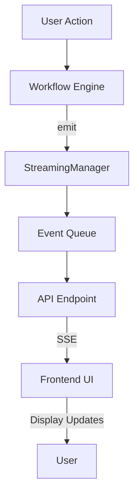
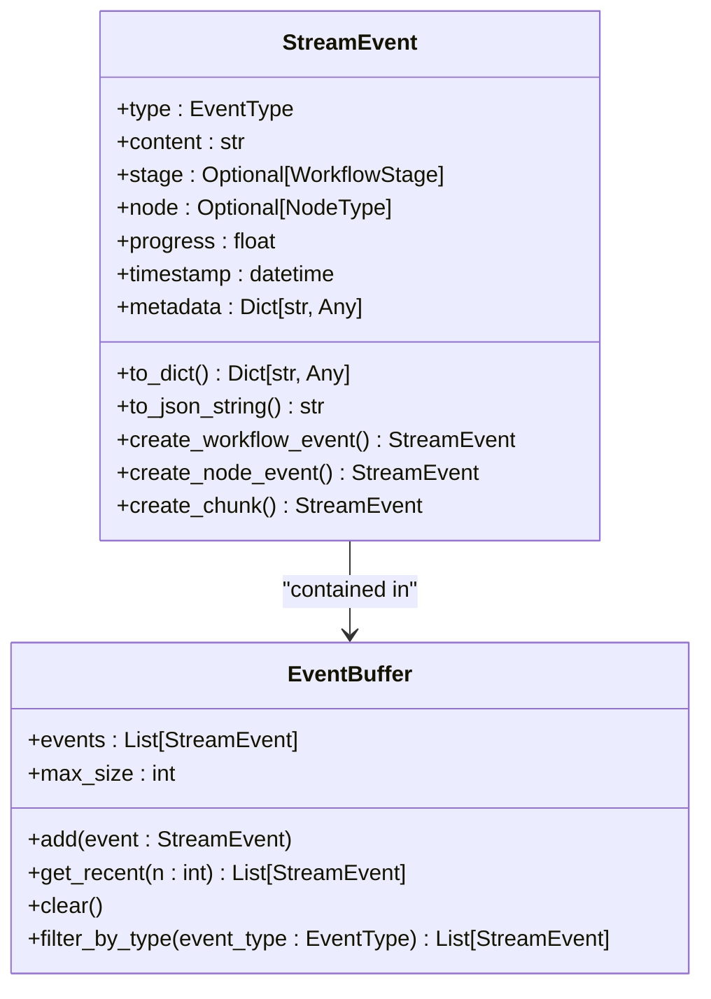
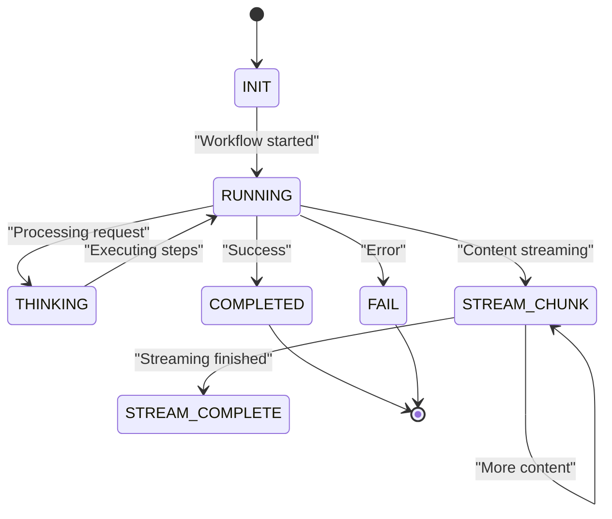
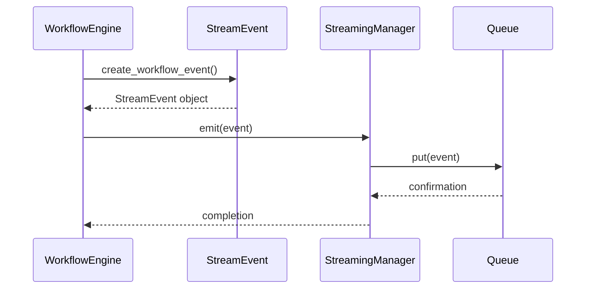
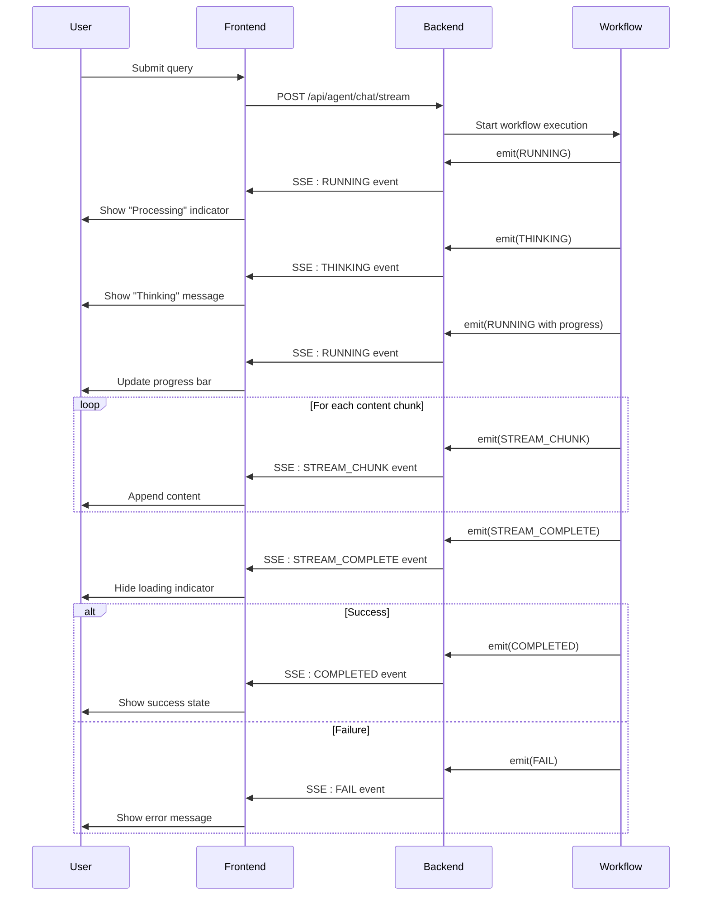
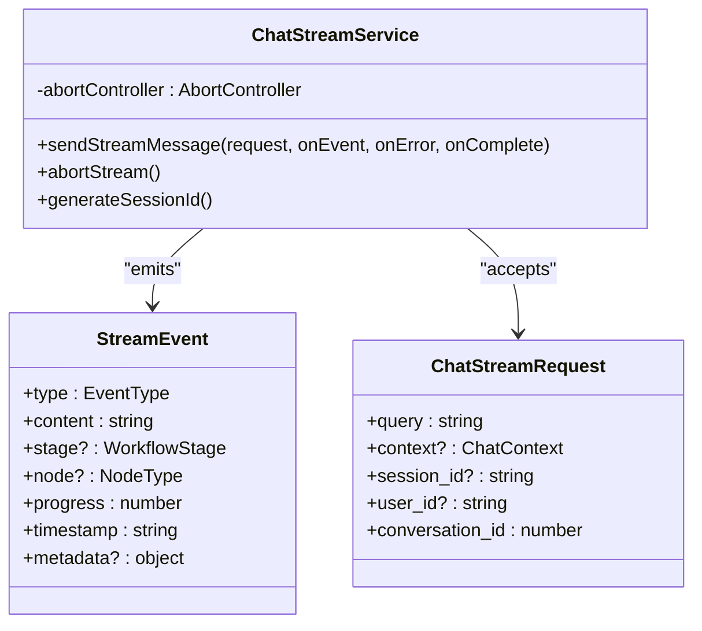
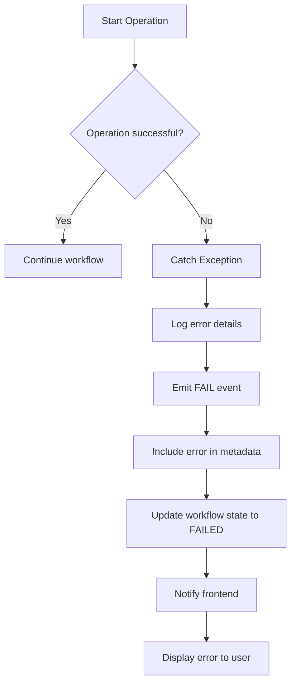
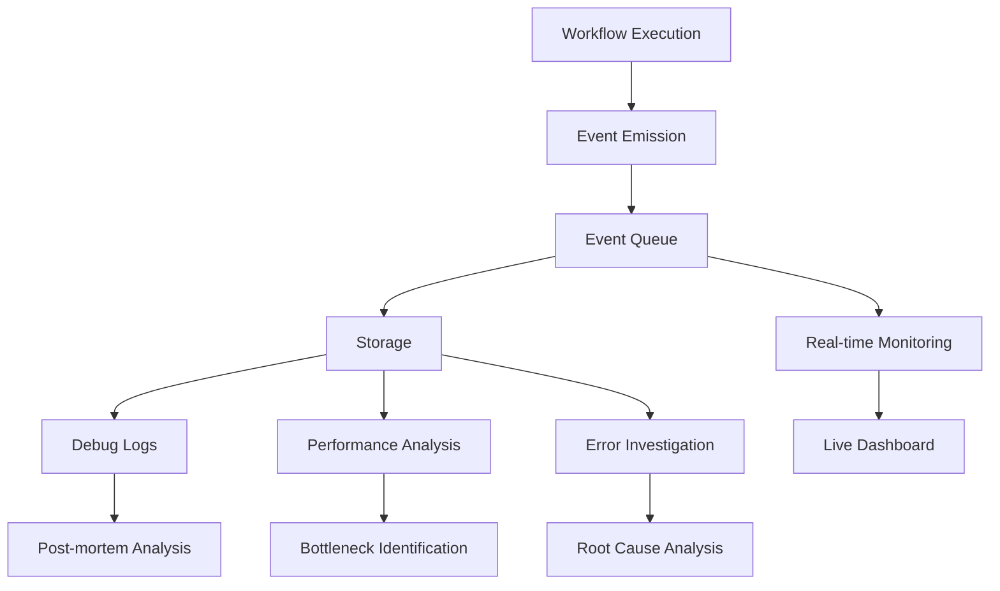

# Event Emission and Streaming

<cite>
**Referenced Files in This Document**   
- [events.py](file://opencontext/context_consumption/context_agent/models/events.py)
- [workflow.py](file://opencontext/context_consumption/context_agent/core/workflow.py)
- [streaming.py](file://opencontext/context_consumption/context_agent/core/streaming.py)
- [executor.py](file://opencontext/context_consumption/context_agent/nodes/executor.py)
- [agent_chat.py](file://opencontext/server/routes/agent_chat.py)
- [ChatStreamService.ts](file://frontend/src/renderer/src/services/ChatStreamService.ts)
- [state.py](file://opencontext/context_consumption/context_agent/core/state.py)
</cite>

## Table of Contents
1. [Introduction](#introduction)
2. [Event System Architecture](#event-system-architecture)
3. [StreamEvent Structure and Payload](#streamevent-structure-and-payload)
4. [Event Types and User Feedback](#event-types-and-user-feedback)
5. [_emit_workflow_event() Method Implementation](#_emit_workflow_event-method-implementation)
6. [Streaming Integration and Real-time Broadcasting](#streaming-integration-and-real-time-broadcasting)
7. [Workflow Milestones and Event Emission](#workflow-milestones-and-event-emission)
8. [Frontend Event Handling and UI Updates](#frontend-event-handling-and-ui-updates)
9. [Error Handling in Event Emission](#error-handling-in-event-emission)
10. [Event-Based Debugging and Monitoring](#event-based-debugging-and-monitoring)

## Introduction

The Workflow Engine event system provides a robust mechanism for communicating state changes and progress updates from the backend to the frontend UI through real-time event streaming. This system enables responsive user interfaces by emitting structured events at key workflow milestones, allowing the frontend to provide immediate feedback to users. The core of this system revolves around the `_emit_workflow_event()` method and its integration with the StreamingManager for real-time broadcasting. Events are structured as StreamEvent objects that contain essential information such as stage, message, progress, and workflow_id, enabling comprehensive tracking of workflow execution. This documentation details how the event system works, the different event types used for user feedback, and how events enable both responsive UIs and effective debugging.

## Event System Architecture

The event system architecture follows a producer-consumer pattern where the Workflow Engine acts as the event producer and the frontend UI acts as the consumer. The architecture consists of three main components: the StreamEvent model that defines the event structure, the StreamingManager that manages the event queue and streaming, and the event emission methods within the Workflow Engine that generate events at key execution points. Events flow from the workflow execution context through the streaming manager to the API layer, where they are delivered to the frontend via Server-Sent Events (SSE). This architecture enables real-time communication between the backend workflow engine and the frontend UI, allowing for immediate updates and feedback during workflow execution.



**Diagram sources**
- [workflow.py](file://opencontext/context_consumption/context_agent/core/workflow.py)
- [streaming.py](file://opencontext/context_consumption/context_agent/core/streaming.py)
- [agent_chat.py](file://opencontext/server/routes/agent_chat.py)

**Section sources**
- [workflow.py](file://opencontext/context_consumption/context_agent/core/workflow.py#L21-L208)
- [streaming.py](file://opencontext/context_consumption/context_agent/core/streaming.py#L1-L46)

## StreamEvent Structure and Payload

The StreamEvent class defines the structure of all events emitted by the workflow system. Each event contains essential fields that provide context and information about the workflow state. The core payload includes the event type, content (message), stage, progress (0.0-1.0), timestamp, and metadata. The metadata field is particularly important as it can contain additional context-specific information such as workflow_id, node type, and other relevant data. Events are serialized to JSON format for transmission, with the to_dict() method handling the conversion of enum values to strings and datetime objects to ISO format. The event structure is designed to be flexible enough to accommodate various use cases while maintaining a consistent format across the system.



**Diagram sources**
- [events.py](file://opencontext/context_consumption/context_agent/models/events.py#L16-L134)

**Section sources**
- [events.py](file://opencontext/context_consumption/context_agent/models/events.py#L16-L134)

## Event Types and User Feedback

The workflow system utilizes several event types to communicate different states and progress updates to the user interface. The RUNNING event indicates that a workflow stage is actively processing, providing immediate feedback that the system is working on the request. The STREAM_COMPLETE event signals the end of a streaming content sequence, informing the frontend that all content has been delivered. The COMPLETED event indicates successful workflow completion, while the FAIL event signals that an error occurred during execution. These event types enable the frontend to provide appropriate visual feedback, such as loading indicators for RUNNING events, success messages for COMPLETED events, and error notifications for FAIL events. The system also includes THINKING, DONE, and STREAM_CHUNK events to provide more granular feedback during processing.



**Diagram sources**
- [events.py](file://opencontext/context_consumption/context_agent/models/events.py#L67-L78)
- [workflow.py](file://opencontext/context_consumption/context_agent/core/workflow.py)

**Section sources**
- [events.py](file://opencontext/context_consumption/context_agent/models/events.py#L67-L78)

## _emit_workflow_event() Method Implementation

The `_emit_workflow_event()` method is a core component of the workflow engine responsible for creating and emitting workflow-specific events. This method takes an event type, the current workflow state, and a message as parameters, then creates a StreamEvent using the create_workflow_event() factory method. The created event includes the workflow_id from the state metadata, ensuring that frontend components can correlate events with specific workflow instances. The method checks for the presence of a streaming manager before attempting to emit the event, providing graceful handling when streaming is not available. Once created, the event is passed to the streaming manager's emit() method for queuing and eventual delivery to subscribers. This method is called at key points throughout the workflow execution to provide status updates and progress information.



**Diagram sources**
- [workflow.py](file://opencontext/context_consumption/context_agent/core/workflow.py#L164-L173)

**Section sources**
- [workflow.py](file://opencontext/context_consumption/context_agent/core/workflow.py#L164-L173)

## Streaming Integration and Real-time Broadcasting

The StreamingManager class provides the infrastructure for real-time event broadcasting from the workflow engine to connected clients. It maintains an asyncio.Queue that acts as a buffer for events, allowing asynchronous emission and consumption. The emit() method adds events to the queue, while the stream() method provides an async iterator that yields events as they become available. This design enables multiple consumers to receive events in real-time without blocking the workflow execution. The stream() method includes logic to terminate when completion or failure events are encountered, ensuring clients are properly notified when workflows end. The integration with FastAPI's StreamingResponse allows these events to be delivered to the frontend via Server-Sent Events, enabling real-time updates without requiring client polling.

```mermaid
flowchart TD
A[emit(event)] --> B{event_queue initialized?}
B --> |No| C[Initialize Queue]
B --> |Yes| D[Add event to queue]
C --> D
D --> E[Event queued]
F[stream()] --> G{Get event from queue}
G --> H[Wait for event or timeout]
H --> I{Event available?}
I --> |Yes| J[Yield event]
J --> K{Completion or failure?}
K --> |Yes| L[Break loop]
K --> |No| G
I --> |Timeout| G
J --> G
```

**Diagram sources**
- [streaming.py](file://opencontext/context_consumption/context_agent/core/streaming.py#L1-L46)

**Section sources**
- [streaming.py](file://opencontext/context_consumption/context_agent/core/streaming.py#L1-L46)

## Workflow Milestones and Event Emission

Events are emitted at key milestones throughout the workflow execution process, providing comprehensive visibility into the workflow's progress. When a workflow begins, a RUNNING event is emitted to indicate that processing has started. During the execution phase, events are emitted to signal the start of task execution, the generation of execution plans, and the completion of individual steps. For example, in the ExecutorNode, events are emitted when starting execution, when the execution plan is generated, when each step is executed (with progress updates), and when execution is completed. At the conclusion of workflow processing, either a COMPLETED event (for success) or a FAIL event (for errors) is emitted to signal the final state. This systematic emission of events at milestones enables both user feedback and system monitoring.



**Diagram sources**
- [workflow.py](file://opencontext/context_consumption/context_agent/core/workflow.py)
- [executor.py](file://opencontext/context_consumption/context_agent/nodes/executor.py)
- [agent_chat.py](file://opencontext/server/routes/agent_chat.py)

**Section sources**
- [workflow.py](file://opencontext/context_consumption/context_agent/core/workflow.py#L72-L110)
- [executor.py](file://opencontext/context_consumption/context_agent/nodes/executor.py#L29-L87)

## Frontend Event Handling and UI Updates

The frontend implements a comprehensive system for handling incoming events and updating the user interface accordingly. The ChatStreamService class manages the connection to the backend event stream and processes incoming Server-Sent Events. When events are received, they are parsed and dispatched to appropriate handlers that update the UI state. For example, RUNNING events trigger loading indicators, THINKING events display status messages, and STREAM_CHUNK events append content to the conversation display. The frontend also maintains event buffers and state management to ensure a smooth user experience, even when events arrive out of order or with delays. This real-time event handling enables the creation of responsive, interactive interfaces that provide immediate feedback during workflow execution.



**Diagram sources**
- [ChatStreamService.ts](file://frontend/src/renderer/src/services/ChatStreamService.ts#L91-L192)

**Section sources**
- [ChatStreamService.ts](file://frontend/src/renderer/src/services/ChatStreamService.ts#L91-L192)

## Error Handling in Event Emission

The event system includes robust error handling mechanisms to ensure reliable communication even when issues occur during workflow execution. When an exception is caught in the workflow engine, a FAIL event is emitted with details about the error, allowing the frontend to display appropriate error messages to the user. The base node implementation includes error handling in the execute() method, which emits a FAIL event when an exception occurs during node processing. The streaming infrastructure also includes error handling, with the stream() method catching asyncio.TimeoutError and asyncio.CancelledError exceptions to ensure graceful degradation. Additionally, the API endpoint includes comprehensive error handling that emits error events when exceptions occur during request processing, ensuring that clients are always informed of the system state.



**Diagram sources**
- [base.py](file://opencontext/context_consumption/context_agent/nodes/base.py#L34-L51)
- [workflow.py](file://opencontext/context_consumption/context_agent/core/workflow.py#L99-L110)

**Section sources**
- [base.py](file://opencontext/context_consumption/context_agent/nodes/base.py#L34-L51)
- [workflow.py](file://opencontext/context_consumption/context_agent/core/workflow.py#L99-L110)

## Event-Based Debugging and Monitoring

The comprehensive event system serves as a powerful tool for debugging and monitoring workflow execution. By capturing events at all key milestones, developers can reconstruct the complete execution flow of any workflow, making it easier to identify bottlenecks, errors, and unexpected behavior. The event metadata includes timestamps, allowing for performance analysis and identification of slow operations. The storage system persists event metadata with messages, enabling post-execution analysis and debugging. Additionally, the event buffer in the WorkflowState allows for inspection of recent events during execution, providing context for current operations. This event-based approach to debugging enables both real-time monitoring and retrospective analysis, significantly improving the maintainability and reliability of the workflow system.



**Diagram sources**
- [state.py](file://opencontext/context_consumption/context_agent/core/state.py#L59-L61)
- [agent_chat.py](file://opencontext/server/routes/agent_chat.py#L227-L245)

**Section sources**
- [state.py](file://opencontext/context_consumption/context_agent/core/state.py#L59-L61)
- [agent_chat.py](file://opencontext/server/routes/agent_chat.py#L227-L245)