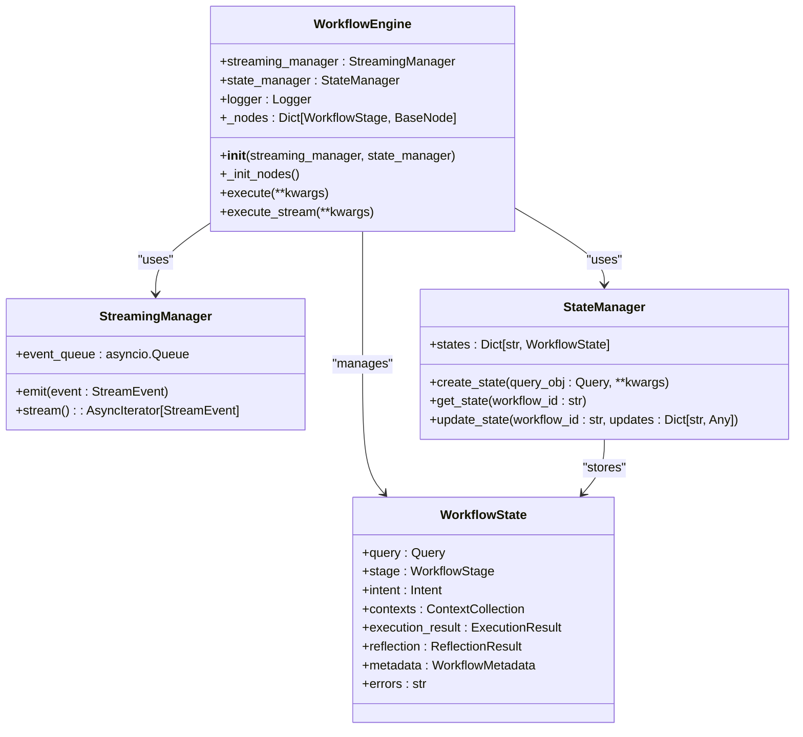
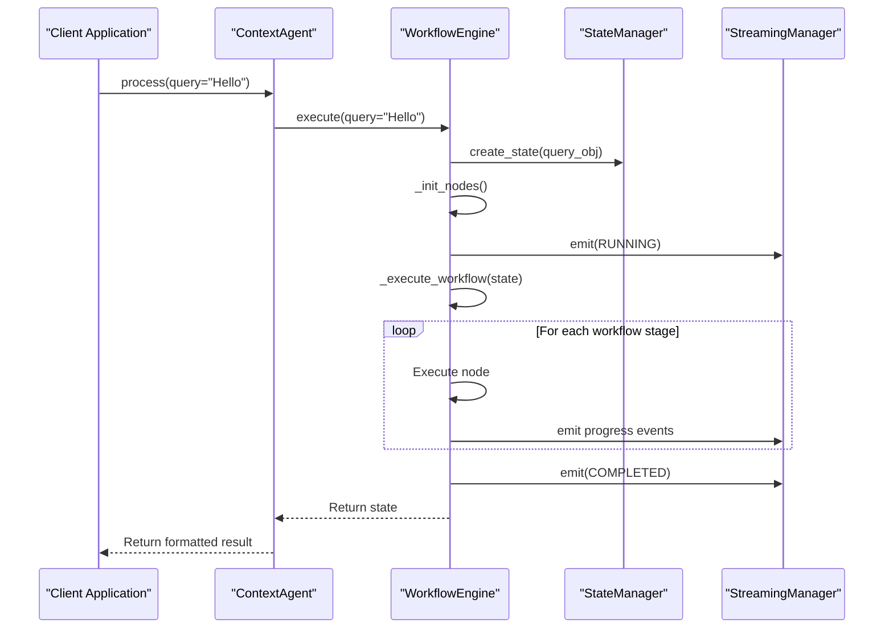
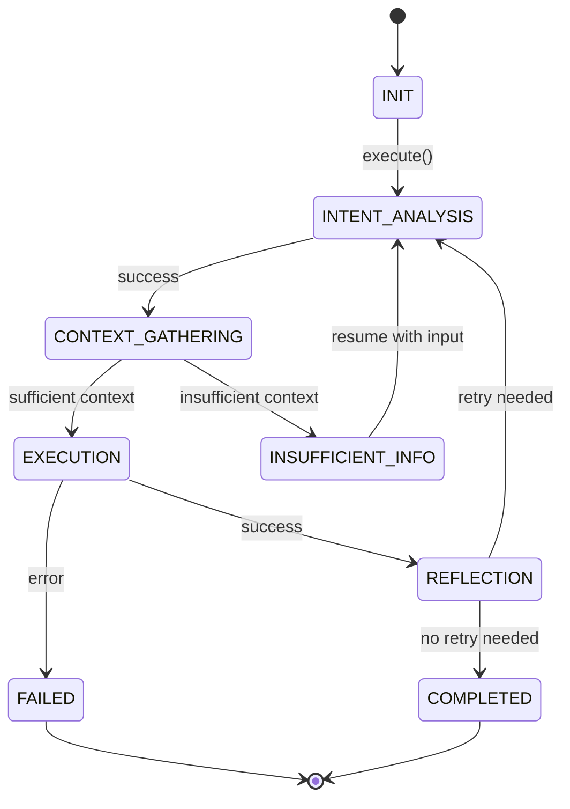
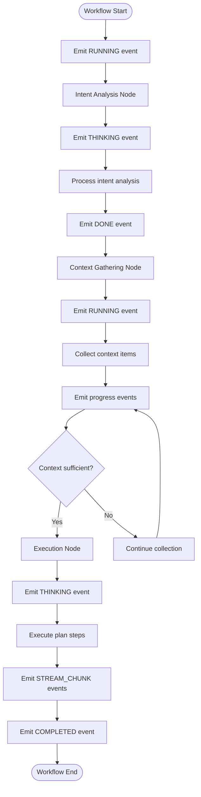

# Initialization and Core Components

<cite>
**Referenced Files in This Document**   
- [workflow.py](file://opencontext/context_consumption/context_agent/core/workflow.py)
- [agent.py](file://opencontext/context_consumption/context_agent/agent.py)
- [state.py](file://opencontext/context_consumption/context_agent/core/state.py)
- [streaming.py](file://opencontext/context_consumption/context_agent/core/streaming.py)
- [base.py](file://opencontext/context_consumption/context_agent/nodes/base.py)
- [intent.py](file://opencontext/context_consumption/context_agent/nodes/intent.py)
- [context.py](file://opencontext/context_consumption/context_agent/nodes/context.py)
- [executor.py](file://opencontext/context_consumption/context_agent/nodes/executor.py)
- [reflection.py](file://opencontext/context_consumption/context_agent/nodes/reflection.py)
</cite>

## Table of Contents
1. [Workflow Engine Initialization](#workflow-engine-initialization)
2. [Core Component Architecture](#core-component-architecture)
3. [Dependency Injection Pattern](#dependency-injection-pattern)
4. [Component Integration with ContextAgent](#component-integration-with-contextagent)
5. [Workflow Lifecycle and State Management](#workflow-lifecycle-and-state-management)
6. [Event Streaming and Real-time Communication](#event-streaming-and-real-time-communication)

## Workflow Engine Initialization

The `WorkflowEngine` class serves as the central orchestrator of the context processing pipeline, initialized through its `__init__` method with optional dependency injection for `StreamingManager` and `StateManager`. This initialization pattern follows a flexible dependency injection approach where the engine accepts external instances of these core components but defaults to creating new instances when none are provided. This design enables both flexibility in configuration and ease of use with sensible defaults.

The initialization process begins by establishing the two primary dependencies: `streaming_manager` for real-time event emission and `state_manager` for workflow state persistence. When no external instances are provided, the engine creates its own instances using the `or` operator in the assignment: `self.streaming_manager = streaming_manager or StreamingManager()`. This ensures that the engine always has functional components to work with while allowing for external control when needed.

During initialization, the engine also sets up diagnostic logging through the `get_logger` utility, creating a logger instance specific to the `WorkflowEngine` class. Additionally, it initializes a dictionary `_nodes` to store processing nodes, which are created lazily during the first execution cycle rather than at initialization time. This lazy loading approach optimizes startup performance by deferring the creation of node instances until they are actually needed.

**Section sources**
- [workflow.py](file://opencontext/context_consumption/context_agent/core/workflow.py#L25-L35)

## Core Component Architecture

The Workflow Engine's architecture revolves around four core components that work together to process user queries and generate responses. Each component plays a distinct role in the workflow lifecycle, contributing to the system's overall functionality and reliability.

The `streaming_manager` component is responsible for real-time event emission throughout the workflow execution. It implements a publish-subscribe pattern using an asynchronous queue to handle events, allowing various parts of the system to communicate progress, status updates, and results in real-time. This component enables streaming responses to clients, providing immediate feedback during potentially long-running operations.

The `state_manager` component handles workflow state persistence, maintaining the current state of all active workflows. It stores `WorkflowState` objects in a dictionary keyed by workflow ID, allowing for efficient retrieval and updates. This component ensures that workflow state is preserved across different stages of execution and can be resumed if interrupted.

The `logger` component provides diagnostic logging capabilities, capturing important events and errors during workflow execution. Each component in the system has its own logger instance, enabling detailed tracing of operations and facilitating debugging and monitoring.

The `_nodes` dictionary serves as a container for the processing nodes that perform the actual work in the workflow. These nodes are initialized lazily during the first execution cycle, with the engine creating instances of `IntentNode`, `ContextNode`, `ExecutorNode`, and `ReflectionNode` as needed. This modular design allows each node to specialize in a specific aspect of query processing while maintaining loose coupling between components.

**Diagram sources**
- [workflow.py](file://opencontext/context_consumption/context_agent/core/workflow.py#L22-L208)
- [streaming.py](file://opencontext/context_consumption/context_agent/core/streaming.py#L16-L46)
- [state.py](file://opencontext/context_consumption/context_agent/core/state.py#L211-L278)

**Section sources**
- [workflow.py](file://opencontext/context_consumption/context_agent/core/workflow.py#L25-L35)
- [streaming.py](file://opencontext/context_consumption/context_agent/core/streaming.py#L16-L46)
- [state.py](file://opencontext/context_consumption/context_agent/core/state.py#L211-L278)

## Dependency Injection Pattern

The Workflow Engine employs a dependency injection pattern that enhances both testability and flexibility in the system design. This pattern allows external components to be injected into the engine during initialization, enabling greater control over the behavior of the workflow execution process.

The dependency injection is implemented through optional parameters in the `__init__` method, where both `streaming_manager` and `state_manager` are accepted as optional arguments. When these parameters are not provided, the engine creates default instances of the respective classes. This approach follows the principle of "dependency inversion," where high-level modules (the Workflow Engine) are not dependent on low-level module implementations but rather on abstractions.

This design provides several benefits for testing and development. During unit testing, mock or stub implementations of `StreamingManager` and `StateManager` can be injected into the engine, allowing for isolated testing of the workflow logic without relying on the actual implementations. This makes it easier to simulate various scenarios, such as network failures, state corruption, or specific event sequences.

The flexibility of this pattern also enables different deployment configurations. For example, in a distributed system, a shared `StateManager` instance could be injected that stores workflow states in a centralized database rather than in-memory. Similarly, a custom `StreamingManager` could be implemented to route events through a message broker like Kafka or RabbitMQ for better scalability.

The dependency injection pattern also facilitates component reuse and composition. Multiple `WorkflowEngine` instances can share the same `StateManager`, allowing them to coordinate on workflow states. Alternatively, different engines could use different streaming backends depending on their specific requirements, such as WebSocket streaming for web clients or gRPC streaming for internal services.

**Section sources**
- [workflow.py](file://opencontext/context_consumption/context_agent/core/workflow.py#L25-L35)
- [agent.py](file://opencontext/context_consumption/context_agent/agent.py#L24-L35)

## Component Integration with ContextAgent

The Workflow Engine is integrated into the larger system through the `ContextAgent` class, which serves as the main entry point for processing user queries. This integration demonstrates how the core components work together in a real-world scenario, providing a simple API interface for external consumers.

The `ContextAgent` initializes its own instances of `StreamingManager` and `StateManager`, which are then passed to the `WorkflowEngine` during its creation. This creates a shared context between the agent and the engine, ensuring that events and state are properly coordinated. The agent also maintains a reference to the engine's components, allowing it to access their functionality directly when needed.

When processing a query, the `ContextAgent` delegates the actual workflow execution to the `WorkflowEngine` through its `execute` method. The agent passes relevant parameters such as the query text, session ID, and additional context, which are then used by the engine to create a new `WorkflowState`. The agent handles the formatting of results, converting the internal `WorkflowState` object into a more consumer-friendly dictionary structure.

The integration also supports both synchronous and streaming modes of operation. For streaming responses, the agent exposes the `process_stream` method, which returns an asynchronous iterator of `StreamEvent` objects. This allows clients to receive real-time updates as the workflow progresses, providing immediate feedback to users.

The `ContextAgent` also provides convenience methods for common operations such as resuming workflows, retrieving workflow states, and canceling ongoing processes. These methods delegate to the corresponding functionality in the `WorkflowEngine`, maintaining a clean separation of concerns while providing a comprehensive API.

**Diagram sources**
- [agent.py](file://opencontext/context_consumption/context_agent/agent.py#L21-L165)
- [workflow.py](file://opencontext/context_consumption/context_agent/core/workflow.py#L58-L111)

**Section sources**
- [agent.py](file://opencontext/context_consumption/context_agent/agent.py#L21-L165)
- [workflow.py](file://opencontext/context_consumption/context_agent/core/workflow.py#L58-L111)

## Workflow Lifecycle and State Management

The Workflow Engine manages the complete lifecycle of a workflow execution, from initialization to completion or failure. This lifecycle is governed by the `WorkflowState` object, which tracks the current stage of execution and stores all relevant data throughout the process.

The workflow begins with the creation of a new `WorkflowState` object, which is initialized with the user's query and metadata such as session ID and user ID. The state object maintains references to the results of each processing stage, including intent analysis, context gathering, execution, and reflection. It also tracks errors, retry counts, and other status information.

The engine executes the workflow through a series of stages defined in the `WorkflowStage` enumeration: `INTENT_ANALYSIS`, `CONTEXT_GATHERING`, `EXECUTION`, and `REFLECTION`. Each stage is processed by a corresponding node, which modifies the state object as it performs its work. The engine checks for completion or failure after each stage, allowing for early termination if necessary.

State transitions are managed through the `update_stage` method, which updates the current stage and records the timestamp of the change. This provides a clear audit trail of the workflow's progress and enables accurate monitoring of execution time. The state manager maintains a registry of all active workflows, allowing them to be retrieved, updated, or deleted as needed.

The engine also supports workflow resumption, allowing interrupted processes to continue from where they left off. This is particularly useful for workflows that require user input or involve long-running operations. The `resume` method retrieves the existing state and continues execution, either by incorporating new user input or by proceeding with the existing context.

**Diagram sources**
- [workflow.py](file://opencontext/context_consumption/context_agent/core/workflow.py#L125-L162)
- [state.py](file://opencontext/context_consumption/context_agent/core/state.py#L42-L135)

**Section sources**
- [workflow.py](file://opencontext/context_consumption/context_agent/core/workflow.py#L125-L162)
- [state.py](file://opencontext/context_consumption/context_agent/core/state.py#L42-L135)

## Event Streaming and Real-time Communication

The event streaming system enables real-time communication between the Workflow Engine and external clients, providing immediate feedback during workflow execution. This system is built around the `StreamingManager` class, which manages an asynchronous queue of `StreamEvent` objects that represent various stages of progress and status updates.

The `StreamEvent` class serves as a unified representation for all event types, containing fields for event type, content, stage, progress, and metadata. This standardized format allows clients to handle different types of events consistently while still providing access to detailed information when needed. Events are emitted throughout the workflow execution, from the initial "running" status to intermediate progress updates and final completion or failure notifications.

The streaming system supports both chunked and complete responses, allowing for different modes of content delivery. For streaming responses, the engine emits `STREAM_CHUNK` events containing partial content as it becomes available. This enables clients to display results incrementally, improving perceived performance and user experience. When the complete response is ready, a `STREAM_COMPLETE` event is emitted to signal the end of the stream.

The system also supports different event types for various purposes, including `THINKING`, `RUNNING`, `DONE`, and `FAIL`. These events provide semantic meaning to the progress updates, allowing clients to display appropriate UI elements such as loading indicators, success messages, or error notifications. The progress field (ranging from 0.0 to 1.0) enables accurate progress bar updates, giving users a clear indication of how much of the workflow has been completed.

**Diagram sources**
- [streaming.py](file://opencontext/context_consumption/context_agent/core/streaming.py#L16-L46)
- [events.py](file://opencontext/context_consumption/context_agent/models/events.py#L16-L134)
- [workflow.py](file://opencontext/context_consumption/context_agent/core/workflow.py#L73-L98)

**Section sources**
- [streaming.py](file://opencontext/context_consumption/context_agent/core/streaming.py#L16-L46)
- [events.py](file://opencontext/context_consumption/context_agent/models/events.py#L16-L134)
- [workflow.py](file://opencontext/context_consumption/context_agent/core/workflow.py#L73-L98)