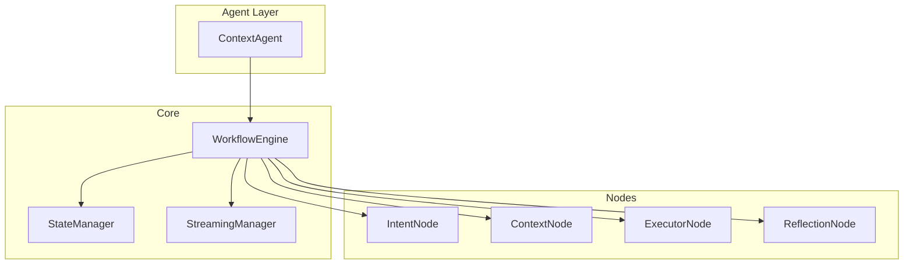
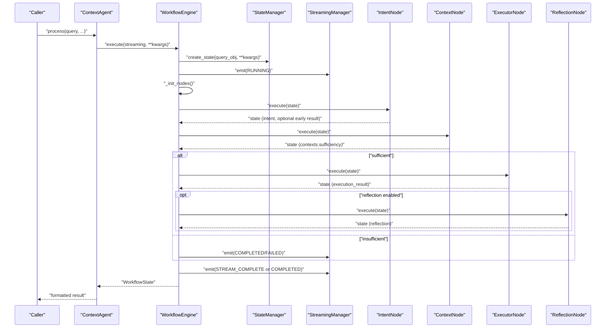
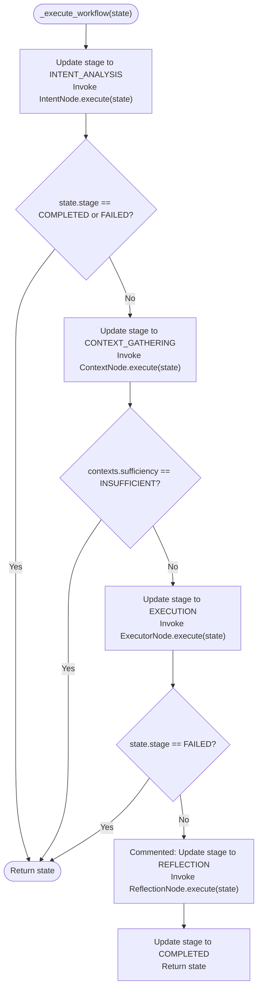
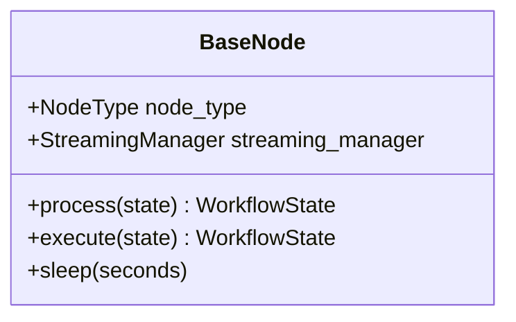
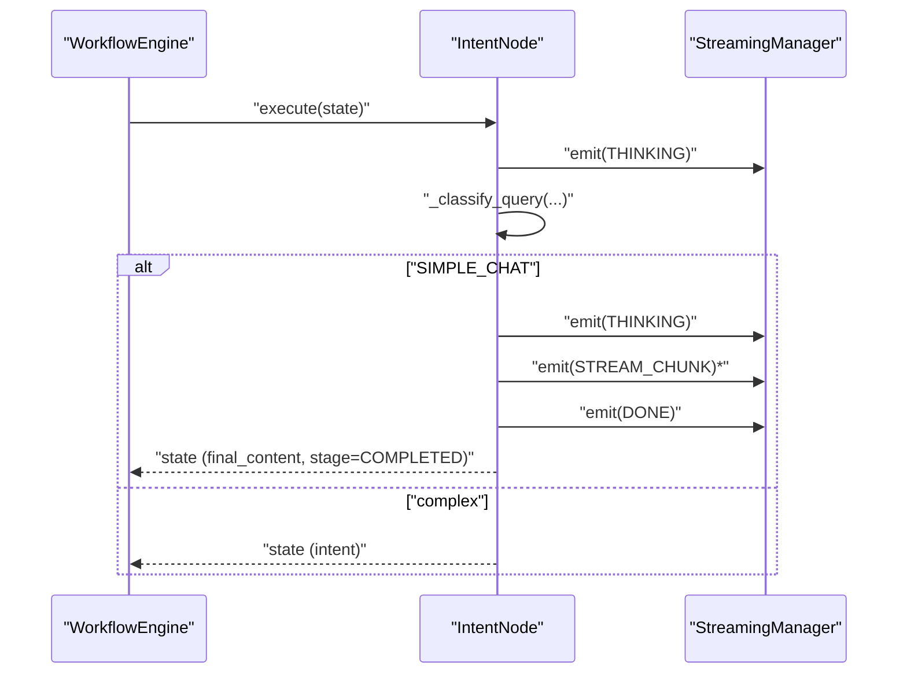
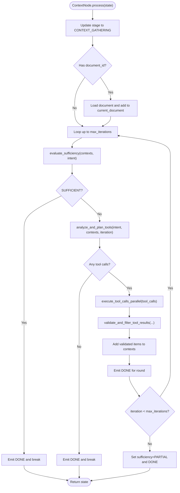
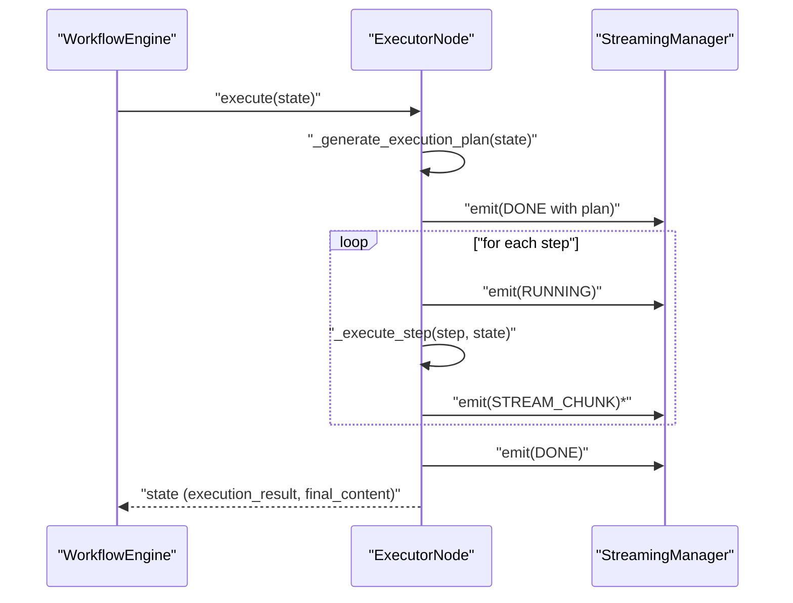
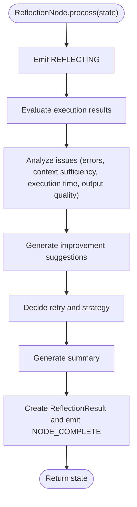
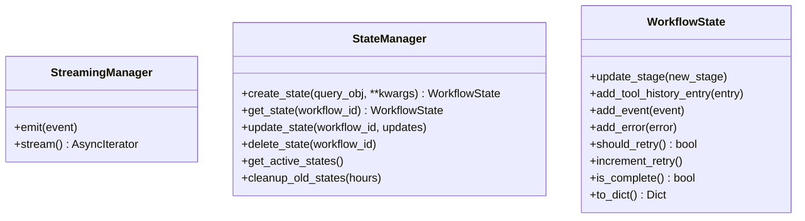
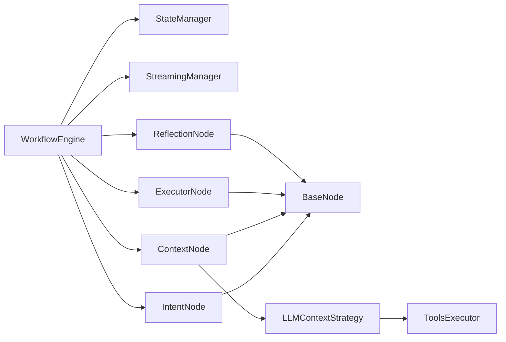

# Node Orchestration and Integration

<cite>
**Referenced Files in This Document**
- [workflow.py](file://opencontext/context_consumption/context_agent/core/workflow.py)
- [agent.py](file://opencontext/context_consumption/context_agent/agent.py)
- [base.py](file://opencontext/context_consumption/context_agent/nodes/base.py)
- [intent.py](file://opencontext/context_consumption/context_agent/nodes/intent.py)
- [context.py](file://opencontext/context_consumption/context_agent/nodes/context.py)
- [executor.py](file://opencontext/context_consumption/context_agent/nodes/executor.py)
- [reflection.py](file://opencontext/context_consumption/context_agent/nodes/reflection.py)
- [streaming.py](file://opencontext/context_consumption/context_agent/core/streaming.py)
- [state.py](file://opencontext/context_consumption/context_agent/core/state.py)
- [enums.py](file://opencontext/context_consumption/context_agent/models/enums.py)
- [schemas.py](file://opencontext/context_consumption/context_agent/models/schemas.py)
- [llm_context_strategy.py](file://opencontext/context_consumption/context_agent/core/llm_context_strategy.py)
</cite>

## Table of Contents
1. [Introduction](#introduction)
2. [Project Structure](#project-structure)
3. [Core Components](#core-components)
4. [Architecture Overview](#architecture-overview)
5. [Detailed Component Analysis](#detailed-component-analysis)
6. [Dependency Analysis](#dependency-analysis)
7. [Performance Considerations](#performance-considerations)
8. [Troubleshooting Guide](#troubleshooting-guide)
9. [Conclusion](#conclusion)

## Introduction
This document explains the Workflow Engine node orchestration with a focus on the _init_nodes() method and the node integration pattern. It details how the workflow engine lazily initializes processing nodes (IntentNode, ContextNode, ExecutorNode, ReflectionNode), maps them to specific workflow stages, and injects a shared streaming_manager into each node. It also describes the modular architecture enabling independent node development, the execution sequence and data flow between nodes, state passing, and stage progression. Finally, it addresses the current commented-out reflection stage and outlines potential future extensibility.

## Project Structure
The workflow engine resides under the context_agent module and orchestrates four primary nodes:
- IntentNode: intent classification and optional early reply generation
- ContextNode: iterative context gathering guided by an LLM strategy
- ExecutorNode: task execution with streaming generation
- ReflectionNode: post-execution evaluation and retry decisions

**Diagram sources**
- [agent.py](file://opencontext/context_consumption/context_agent/agent.py#L21-L50)
- [workflow.py](file://opencontext/context_consumption/context_agent/core/workflow.py#L22-L60)
- [state.py](file://opencontext/context_consumption/context_agent/core/state.py#L211-L278)
- [streaming.py](file://opencontext/context_consumption/context_agent/core/streaming.py#L16-L46)
- [intent.py](file://opencontext/context_consumption/context_agent/nodes/intent.py#L26-L31)
- [context.py](file://opencontext/context_consumption/context_agent/nodes/context.py#L19-L26)
- [executor.py](file://opencontext/context_consumption/context_agent/nodes/executor.py#L22-L29)
- [reflection.py](file://opencontext/context_consumption/context_agent/nodes/reflection.py#L20-L25)

**Section sources**
- [agent.py](file://opencontext/context_consumption/context_agent/agent.py#L21-L50)
- [workflow.py](file://opencontext/context_consumption/context_agent/core/workflow.py#L22-L60)

## Core Components
- WorkflowEngine: central orchestrator that lazily initializes nodes, manages state transitions, and coordinates streaming events.
- BaseNode: abstract base class providing a common execute() wrapper and error handling, plus node-type tagging and streaming integration.
- StreamingManager: event queue abstraction for emitting and streaming StreamEvent objects.
- StateManager and WorkflowState: persistent state container and lifecycle management for a single workflow run.
- LLMContextStrategy: orchestrates tool discovery, parallel tool execution, and validation to populate ContextCollection.

Key integration points:
- Dependency injection: each node receives a streaming_manager instance in its constructor.
- Lazy initialization: nodes are created on demand inside _init_nodes() to avoid circular imports and reduce startup overhead.
- Stage mapping: each node corresponds to a WorkflowStage and is invoked in sequence by the engine’s internal execution loop.

**Section sources**
- [workflow.py](file://opencontext/context_consumption/context_agent/core/workflow.py#L37-L57)
- [base.py](file://opencontext/context_consumption/context_agent/nodes/base.py#L22-L51)
- [streaming.py](file://opencontext/context_consumption/context_agent/core/streaming.py#L16-L46)
- [state.py](file://opencontext/context_consumption/context_agent/core/state.py#L41-L136)
- [llm_context_strategy.py](file://opencontext/context_consumption/context_agent/core/llm_context_strategy.py#L30-L439)

## Architecture Overview
The orchestration flow proceeds through four stages, with each node receiving and returning a WorkflowState carrying intent, context, execution plan/result, and reflection data.

**Diagram sources**
- [agent.py](file://opencontext/context_consumption/context_agent/agent.py#L38-L50)
- [workflow.py](file://opencontext/context_consumption/context_agent/core/workflow.py#L58-L111)
- [workflow.py](file://opencontext/context_consumption/context_agent/core/workflow.py#L125-L162)
- [intent.py](file://opencontext/context_consumption/context_agent/nodes/intent.py#L32-L71)
- [context.py](file://opencontext/context_consumption/context_agent/nodes/context.py#L27-L166)
- [executor.py](file://opencontext/context_consumption/context_agent/nodes/executor.py#L29-L88)
- [reflection.py](file://opencontext/context_consumption/context_agent/nodes/reflection.py#L26-L87)

## Detailed Component Analysis

### WorkflowEngine: Lazy Initialization and Execution Control
- Lazy node creation: _init_nodes() imports node classes locally and constructs a map from WorkflowStage to node instance, injecting the shared streaming_manager.
- Execution pipeline: _execute_workflow() advances stage-by-stage, invoking each node’s execute() and checking for early termination (COMPLETED or FAILED).
- Streaming and events: emits RUNNING, STREAM_COMPLETE, COMPLETED, and FAIL events; supports resume() and cancel().
- Reflection stage: the reflection stage is currently commented out in the main execution loop, indicating a future extension point.

**Diagram sources**
- [workflow.py](file://opencontext/context_consumption/context_agent/core/workflow.py#L125-L162)
- [workflow.py](file://opencontext/context_consumption/context_agent/core/workflow.py#L150-L160)

**Section sources**
- [workflow.py](file://opencontext/context_consumption/context_agent/core/workflow.py#L37-L57)
- [workflow.py](file://opencontext/context_consumption/context_agent/core/workflow.py#L125-L162)

### BaseNode: Common Behavior and Error Handling
- execute() wrapper measures duration and emits EventType.FAIL on exceptions, appending errors to state.
- process() is the abstract hook nodes implement; BaseNode.execute() calls it and handles failures uniformly.

**Diagram sources**
- [base.py](file://opencontext/context_consumption/context_agent/nodes/base.py#L22-L51)

**Section sources**
- [base.py](file://opencontext/context_consumption/context_agent/nodes/base.py#L22-L51)

### IntentNode: Intent Classification and Early Reply
- Classifies query type and may short-circuit to a simple chat reply with streaming chunks.
- Emits THINKING, STREAM_CHUNK, and DONE events during processing.
- Builds ExecutionResult for simple chat and marks stage COMPLETED.

**Diagram sources**
- [intent.py](file://opencontext/context_consumption/context_agent/nodes/intent.py#L32-L71)
- [intent.py](file://opencontext/context_consumption/context_agent/nodes/intent.py#L99-L154)

**Section sources**
- [intent.py](file://opencontext/context_consumption/context_agent/nodes/intent.py#L26-L31)
- [intent.py](file://opencontext/context_consumption/context_agent/nodes/intent.py#L32-L71)
- [intent.py](file://opencontext/context_consumption/context_agent/nodes/intent.py#L99-L154)

### ContextNode: Iterative Context Gathering
- Uses LLMContextStrategy to evaluate sufficiency, plan tool calls, execute them concurrently, and validate/filter results.
- Emits RUNNING, DONE, and progress events; sets ContextCollection.sufficiency and adds items.
- Validates state by ensuring intent exists before execution.

**Diagram sources**
- [context.py](file://opencontext/context_consumption/context_agent/nodes/context.py#L27-L166)
- [llm_context_strategy.py](file://opencontext/context_consumption/context_agent/core/llm_context_strategy.py#L30-L439)

**Section sources**
- [context.py](file://opencontext/context_consumption/context_agent/nodes/context.py#L19-L26)
- [context.py](file://opencontext/context_consumption/context_agent/nodes/context.py#L27-L166)
- [llm_context_strategy.py](file://opencontext/context_consumption/context_agent/core/llm_context_strategy.py#L30-L439)

### ExecutorNode: Execution Plan and Streaming Generation
- Generates an ExecutionPlan based on QueryType and executes each step with streaming.
- Emits STREAM_CHUNK events during generation and records ExecutionResult.
- Sets final_content and final_method for downstream reporting.

**Diagram sources**
- [executor.py](file://opencontext/context_consumption/context_agent/nodes/executor.py#L29-L88)
- [executor.py](file://opencontext/context_consumption/context_agent/nodes/executor.py#L120-L204)
- [executor.py](file://opencontext/context_consumption/context_agent/nodes/executor.py#L236-L276)

**Section sources**
- [executor.py](file://opencontext/context_consumption/context_agent/nodes/executor.py#L22-L29)
- [executor.py](file://opencontext/context_consumption/context_agent/nodes/executor.py#L29-L88)
- [executor.py](file://opencontext/context_consumption/context_agent/nodes/executor.py#L120-L204)
- [executor.py](file://opencontext/context_consumption/context_agent/nodes/executor.py#L236-L276)

### ReflectionNode: Evaluation and Retry Decisions
- Evaluates execution success rate, detects issues, generates improvements, decides retry, and summarizes outcomes.
- Emits REFLECTING and NODE_COMPLETE events; on failure, creates a partial ReflectionResult to keep the workflow moving.

**Diagram sources**
- [reflection.py](file://opencontext/context_consumption/context_agent/nodes/reflection.py#L26-L87)
- [reflection.py](file://opencontext/context_consumption/context_agent/nodes/reflection.py#L88-L168)
- [reflection.py](file://opencontext/context_consumption/context_agent/nodes/reflection.py#L169-L263)
- [reflection.py](file://opencontext/context_consumption/context_agent/nodes/reflection.py#L264-L334)

**Section sources**
- [reflection.py](file://opencontext/context_consumption/context_agent/nodes/reflection.py#L20-L25)
- [reflection.py](file://opencontext/context_consumption/context_agent/nodes/reflection.py#L26-L87)
- [reflection.py](file://opencontext/context_consumption/context_agent/nodes/reflection.py#L88-L168)
- [reflection.py](file://opencontext/context_consumption/context_agent/nodes/reflection.py#L169-L263)
- [reflection.py](file://opencontext/context_consumption/context_agent/nodes/reflection.py#L264-L334)

### Streaming and State Management
- StreamingManager: async queue-based emitter and iterator; exits when COMPLETED or FAILED stage is emitted.
- StateManager: creates and persists WorkflowState keyed by workflow_id; supports resume/cancel and cleanup.
- WorkflowState: carries query, stage, intent, contexts, execution_plan/result, reflection, tool_history, and streaming buffers.

**Diagram sources**
- [streaming.py](file://opencontext/context_consumption/context_agent/core/streaming.py#L16-L46)
- [state.py](file://opencontext/context_consumption/context_agent/core/state.py#L211-L278)
- [state.py](file://opencontext/context_consumption/context_agent/core/state.py#L41-L136)

**Section sources**
- [streaming.py](file://opencontext/context_consumption/context_agent/core/streaming.py#L16-L46)
- [state.py](file://opencontext/context_consumption/context_agent/core/state.py#L41-L136)
- [state.py](file://opencontext/context_consumption/context_agent/core/state.py#L211-L278)

## Dependency Analysis
- Coupling: WorkflowEngine depends on StreamingManager and StateManager; nodes depend on StreamingManager and share a common BaseNode interface.
- Cohesion: Each node encapsulates a single responsibility (intent, context, execution, reflection).
- External integrations: LLM clients, tool definitions, and storage are accessed via injected managers and global helpers.

**Diagram sources**
- [workflow.py](file://opencontext/context_consumption/context_agent/core/workflow.py#L37-L57)
- [base.py](file://opencontext/context_consumption/context_agent/nodes/base.py#L22-L51)
- [llm_context_strategy.py](file://opencontext/context_consumption/context_agent/core/llm_context_strategy.py#L30-L439)

**Section sources**
- [workflow.py](file://opencontext/context_consumption/context_agent/core/workflow.py#L37-L57)
- [llm_context_strategy.py](file://opencontext/context_consumption/context_agent/core/llm_context_strategy.py#L30-L439)

## Performance Considerations
- Concurrency: ContextNode executes tool calls concurrently via gather; tune max_iterations and tool concurrency to balance latency and cost.
- Streaming: Emitting STREAM_CHUNK events provides responsive UX; ensure downstream consumers drain the stream efficiently.
- Retry strategy: ReflectionNode can suggest retries; consider backoff and circuit-breaking to prevent cascading failures.
- Memory footprint: ContextCollection grows with tool results; validate and filter aggressively to avoid oversized context payloads.

[No sources needed since this section provides general guidance]

## Troubleshooting Guide
Common issues and diagnostics:
- Node failures: BaseNode.execute() catches exceptions and emits EventType.FAIL; inspect state.errors and stage transitions.
- Insufficient context: ContextNode sets sufficiency to INSUFFICIENT; review missing sources and tool call plans.
- Reflection errors: ReflectionNode falls back to a partial ReflectionResult; check logs for quality analysis failures.
- Streaming stalls: StreamingManager exits on COMPLETED/FAILED; ensure nodes emit completion events.

**Section sources**
- [base.py](file://opencontext/context_consumption/context_agent/nodes/base.py#L34-L51)
- [context.py](file://opencontext/context_consumption/context_agent/nodes/context.py#L137-L166)
- [reflection.py](file://opencontext/context_consumption/context_agent/nodes/reflection.py#L75-L87)
- [streaming.py](file://opencontext/context_consumption/context_agent/core/streaming.py#L32-L46)

## Conclusion
The WorkflowEngine implements a clean, modular node orchestration system. _init_nodes() lazily initializes nodes and injects a shared streaming_manager, enabling independent development of IntentNode, ContextNode, ExecutorNode, and ReflectionNode. The execution sequence passes state between stages, with streaming events providing real-time feedback. The reflection stage is currently commented out, signaling a future extension point for adaptive retries and continuous improvement. The architecture supports extensibility by adding new nodes mapped to WorkflowStage and integrating them into the engine’s execution loop.