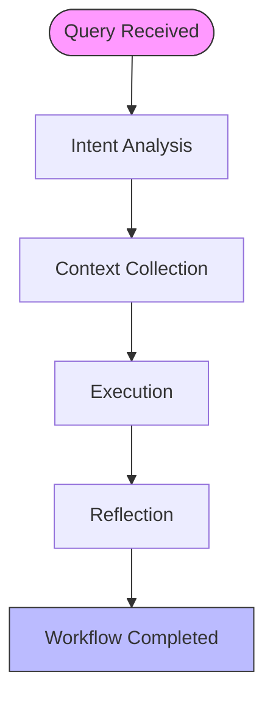
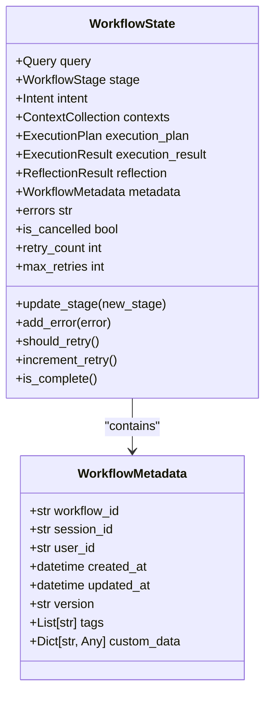
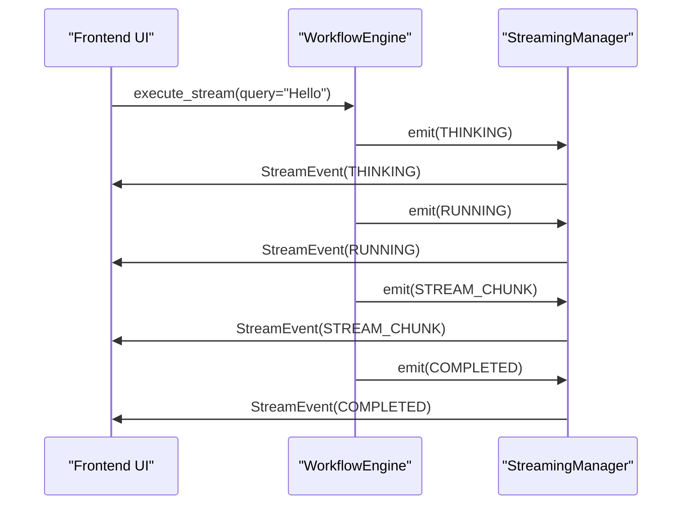
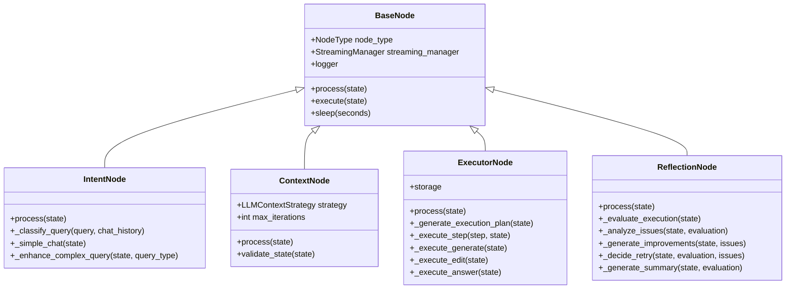
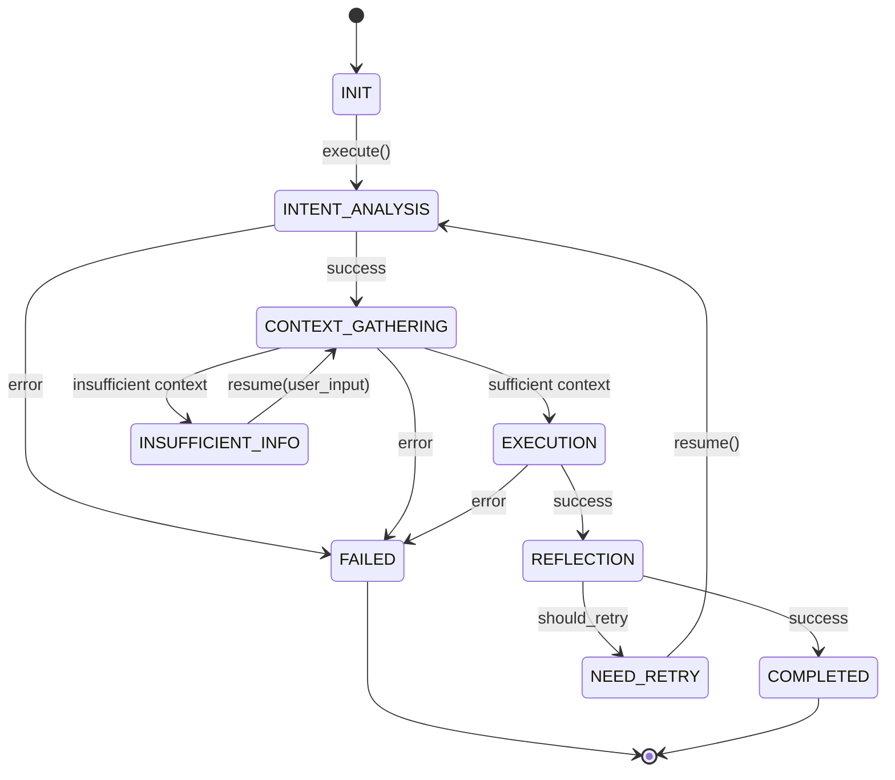
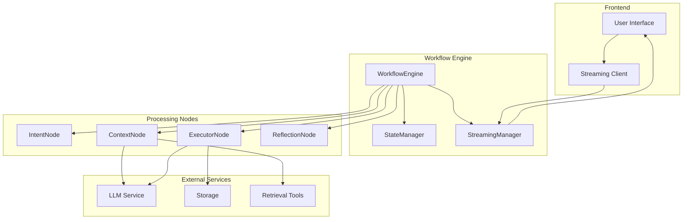

# Workflow Engine

<cite>
**Referenced Files in This Document**   
- [workflow.py](file://opencontext/context_consumption/context_agent/core/workflow.py)
- [agent.py](file://opencontext/context_consumption/context_agent/agent.py)
- [intent.py](file://opencontext/context_consumption/context_agent/nodes/intent.py)
- [context.py](file://opencontext/context_consumption/context_agent/nodes/context.py)
- [executor.py](file://opencontext/context_consumption/context_agent/nodes/executor.py)
- [reflection.py](file://opencontext/context_consumption/context_agent/nodes/reflection.py)
- [base.py](file://opencontext/context_consumption/context_agent/nodes/base.py)
- [state.py](file://opencontext/context_consumption/context_agent/core/state.py)
- [streaming.py](file://opencontext/context_consumption/context_agent/core/streaming.py)
- [llm_context_strategy.py](file://opencontext/context_consumption/context_agent/core/llm_context_strategy.py)
- [enums.py](file://opencontext/context_consumption/context_agent/models/enums.py)
- [schemas.py](file://opencontext/context_consumption/context_agent/models/schemas.py)
</cite>

## Table of Contents
1. [Introduction](#introduction)
2. [Core Components](#core-components)
3. [Workflow Execution](#workflow-execution)
4. [State Management](#state-management)
5. [Streaming Capabilities](#streaming-capabilities)
6. [Processing Nodes](#processing-nodes)
7. [Error Handling and Resumable Operations](#error-handling-and-resumable-operations)
8. [Architecture Overview](#architecture-overview)
9. [Conclusion](#conclusion)

## Introduction
The Workflow Engine in MineContext is a sophisticated orchestration system that manages the multi-stage processing of user queries through a context-aware pipeline. This engine coordinates the analysis, execution, and reflection phases to deliver intelligent responses by leveraging various processing nodes and maintaining state across interactions. The core functionality revolves around the WorkflowEngine class, which manages the lifecycle of user queries from initial intent recognition to final response generation, with support for both synchronous and streaming interactions.

**Section sources**
- [workflow.py](file://opencontext/context_consumption/context_agent/core/workflow.py#L22-L208)

## Core Components

The Workflow Engine consists of several key components that work together to process user queries. The central component is the WorkflowEngine class, which orchestrates the execution of various processing nodes through different stages of the workflow. These stages include intent analysis, context gathering, execution, and reflection. The engine integrates with the StreamingManager to provide real-time updates and the StateManager to maintain workflow state across interactions.

The processing pipeline is designed to handle complex workflows with multiple stages, where each stage builds upon the results of the previous one. The engine supports both synchronous processing through the execute() method and real-time streaming interactions through the execute_stream() method. This dual capability allows the system to provide immediate feedback to users while maintaining the ability to handle complex, multi-step operations.

**Section sources**
- [workflow.py](file://opencontext/context_consumption/context_agent/core/workflow.py#L22-L208)
- [agent.py](file://opencontext/context_consumption/context_agent/agent.py#L21-L165)

## Workflow Execution

The Workflow Engine executes user queries through a well-defined sequence of stages, each handled by specialized processing nodes. The execution begins with intent recognition, where the IntentNode analyzes the user's query to determine its type and purpose. This is followed by context collection, where the ContextNode gathers relevant information from various sources to support the execution phase.

The execution phase is managed by the ExecutorNode, which performs the actual task based on the identified intent and collected context. Finally, the ReflectionNode evaluates the execution results and provides suggestions for improvement. The workflow execution is coordinated through the _execute_workflow() method, which manages the state transitions between these stages and handles the flow of data between processing nodes.

**Diagram sources **
- [workflow.py](file://opencontext/context_consumption/context_agent/core/workflow.py#L125-L162)

**Section sources**
- [workflow.py](file://opencontext/context_consumption/context_agent/core/workflow.py#L58-L162)

## State Management

The Workflow Engine maintains comprehensive state information throughout the processing pipeline using the StateManager class. The WorkflowState dataclass encapsulates all relevant information about the current workflow, including the original query, processing stage, intent analysis results, collected context, execution plan, execution results, and reflection outcomes.

The state management system supports persistence across interactions, allowing workflows to be resumed from their current state. Each workflow is identified by a unique workflow_id, and the StateManager maintains a dictionary of active states. The system also tracks metadata such as creation time, update time, session information, and retry counts, enabling sophisticated workflow management and monitoring.

**Diagram sources **
- [state.py](file://opencontext/context_consumption/context_agent/core/state.py#L41-L278)

**Section sources**
- [state.py](file://opencontext/context_consumption/context_agent/core/state.py#L41-L278)

## Streaming Capabilities

The Workflow Engine supports real-time streaming interactions through the StreamingManager class, which enables continuous communication between the backend processing system and the frontend user interface. The execute_stream() method returns an asynchronous iterator of StreamEvent objects, allowing the UI to update in real-time as the workflow progresses.

Streaming events include various types such as THINKING, RUNNING, DONE, FAIL, and STREAM_CHUNK, which provide detailed information about the current processing status. The STREAM_CHUNK events are particularly important for real-time UI updates, as they deliver partial results as they become available, creating a more responsive and engaging user experience.

**Diagram sources **
- [workflow.py](file://opencontext/context_consumption/context_agent/core/workflow.py#L113-L123)
- [streaming.py](file://opencontext/context_consumption/context_agent/core/streaming.py#L16-L46)

**Section sources**
- [workflow.py](file://opencontext/context_consumption/context_agent/core/workflow.py#L113-L123)
- [streaming.py](file://opencontext/context_consumption/context_agent/core/streaming.py#L16-L46)

## Processing Nodes

The Workflow Engine utilizes a modular architecture with specialized processing nodes for different stages of the workflow. Each node inherits from the BaseNode class and implements the process() method to perform its specific function. The four main processing nodes are:

- **IntentNode**: Analyzes user queries to determine their type and purpose
- **ContextNode**: Collects and evaluates relevant context information
- **ExecutorNode**: Executes the actual tasks based on the intent and context
- **ReflectionNode**: Evaluates execution results and suggests improvements

These nodes are initialized lazily by the _init_nodes() method and stored in the _nodes dictionary, allowing for efficient resource management and on-demand instantiation.

**Diagram sources **
- [base.py](file://opencontext/context_consumption/context_agent/nodes/base.py#L22-L55)
- [intent.py](file://opencontext/context_consumption/context_agent/nodes/intent.py#L26-L264)
- [context.py](file://opencontext/context_consumption/context_agent/nodes/context.py#L19-L171)
- [executor.py](file://opencontext/context_consumption/context_agent/nodes/executor.py#L22-L276)
- [reflection.py](file://opencontext/context_consumption/context_agent/nodes/reflection.py#L20-L334)

**Section sources**
- [base.py](file://opencontext/context_consumption/context_agent/nodes/base.py#L22-L55)
- [intent.py](file://opencontext/context_consumption/context_agent/nodes/intent.py#L26-L264)
- [context.py](file://opencontext/context_consumption/context_agent/nodes/context.py#L19-L171)
- [executor.py](file://opencontext/context_consumption/context_agent/nodes/executor.py#L22-L276)
- [reflection.py](file://opencontext/context_consumption/context_agent/nodes/reflection.py#L20-L334)

## Error Handling and Resumable Operations

The Workflow Engine implements robust error handling and supports resumable operations, allowing workflows to be continued from their current state. When an error occurs during processing, the engine captures the error information and transitions to the FAILED stage, while preserving the current state for potential recovery.

The resume() method enables workflows to be continued from their current state, which is particularly useful when additional information is needed from the user. For example, if the context collection phase determines that insufficient information is available, the workflow can be paused and later resumed with additional user input. This capability supports long-running, interactive AI conversations that can adapt to user feedback and changing requirements.

**Diagram sources **
- [workflow.py](file://opencontext/context_consumption/context_agent/core/workflow.py#L175-L196)
- [enums.py](file://opencontext/context_consumption/context_agent/models/enums.py#L21-L32)

**Section sources**
- [workflow.py](file://opencontext/context_consumption/context_agent/core/workflow.py#L175-L196)

## Architecture Overview

The Workflow Engine architecture follows a modular, layered design that separates concerns and promotes reusability. At the core is the WorkflowEngine class, which coordinates the execution of processing nodes through the various stages of the workflow. The engine integrates with the StateManager to maintain workflow state and the StreamingManager to provide real-time updates.

The processing nodes follow a consistent pattern, inheriting from BaseNode and implementing the process() method to perform their specific function. Each node can emit events through the StreamingManager to provide feedback on its progress. The ContextNode uses an LLMContextStrategy to intelligently determine which retrieval tools to call based on the current intent and existing context.

**Diagram sources **
- [workflow.py](file://opencontext/context_consumption/context_agent/core/workflow.py#L22-L208)
- [agent.py](file://opencontext/context_consumption/context_agent/agent.py#L21-L165)
- [state.py](file://opencontext/context_consumption/context_agent/core/state.py#L211-L278)
- [streaming.py](file://opencontext/context_consumption/context_agent/core/streaming.py#L16-L46)

**Section sources**
- [workflow.py](file://opencontext/context_consumption/context_agent/core/workflow.py#L22-L208)
- [agent.py](file://opencontext/context_consumption/context_agent/agent.py#L21-L165)

## Conclusion

The Workflow Engine in MineContext provides a comprehensive framework for processing user queries through a context-aware pipeline. By orchestrating multiple processing stages and maintaining state across interactions, the engine enables sophisticated AI conversations that can adapt to user needs and requirements. The integration of streaming capabilities allows for real-time UI updates, creating a responsive and engaging user experience.

The modular architecture with specialized processing nodes promotes code reuse and makes the system extensible, allowing new capabilities to be added without disrupting existing functionality. The robust error handling and resumable operations support long-running, interactive workflows that can recover from interruptions and adapt to changing circumstances. This comprehensive approach to workflow management makes the Workflow Engine a powerful component of the MineContext system.