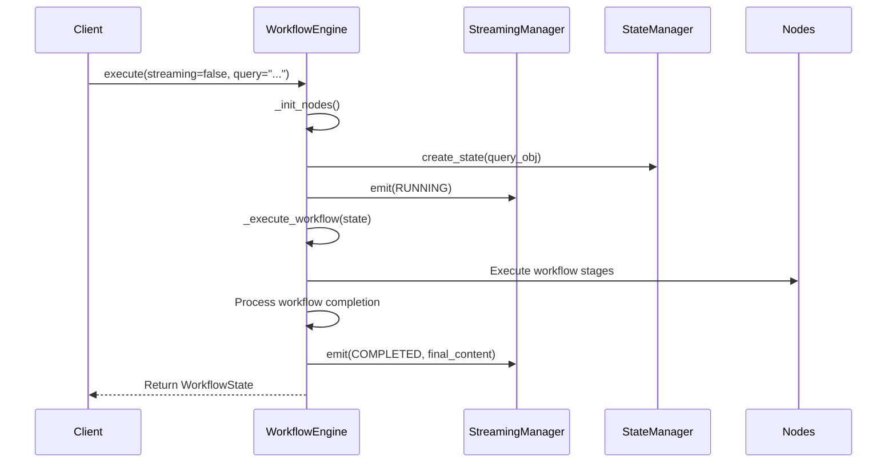
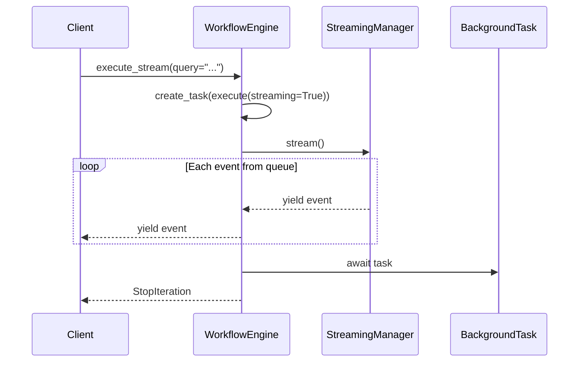
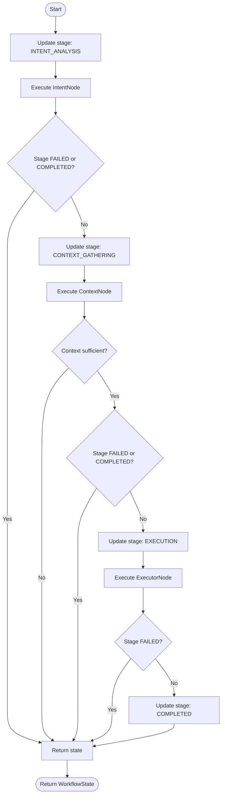
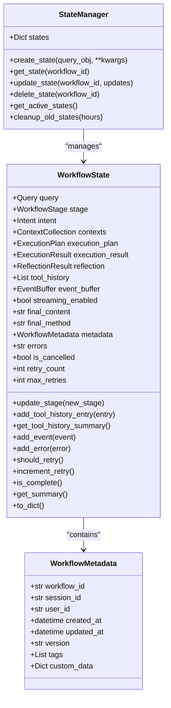
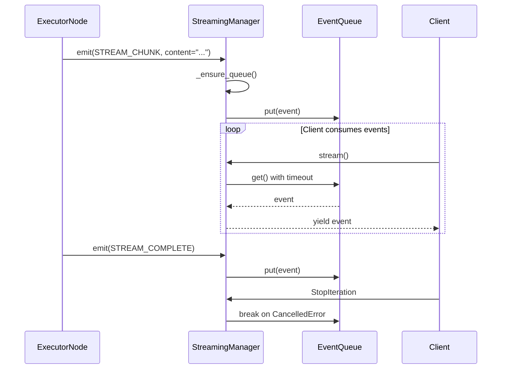
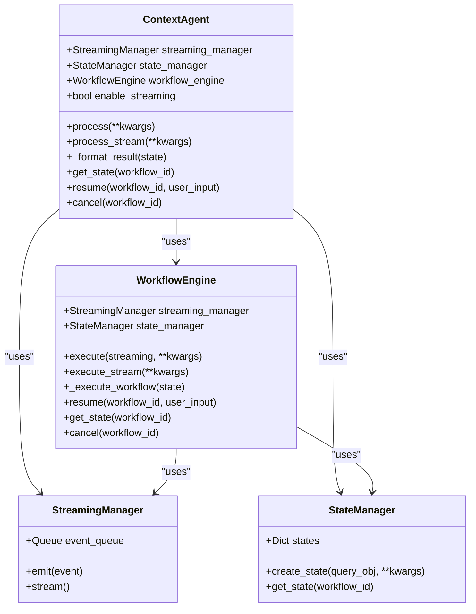

# Workflow Execution Modes

<cite>
**Referenced Files in This Document**   
- [workflow.py](file://opencontext/context_consumption/context_agent/core/workflow.py)
- [streaming.py](file://opencontext/context_consumption/context_agent/core/streaming.py)
- [state.py](file://opencontext/context_consumption/context_agent/core/state.py)
- [events.py](file://opencontext/context_consumption/context_agent/models/events.py)
- [schemas.py](file://opencontext/context_consumption/context_agent/models/schemas.py)
- [executor.py](file://opencontext/context_consumption/context_agent/nodes/executor.py)
- [agent.py](file://opencontext/context_consumption/context_agent/agent.py)
</cite>

## Table of Contents
1. [Introduction](#introduction)
2. [Core Execution Methods](#core-execution-methods)
3. [Synchronous Execution with execute()](#synchronous-execution-with-execute)
4. [Streaming Execution with execute_stream()](#streaming-execution-with-execute_stream)
5. [Core Workflow Logic with _execute_workflow()](#core-workflow-logic-with-_execute_workflow)
6. [State Management and WorkflowState](#state-management-and-workflowstate)
7. [Streaming Architecture and Event Flow](#streaming-architecture-and-event-flow)
8. [Error Handling and Propagation](#error-handling-and-propagation)
9. [Performance Considerations](#performance-considerations)
10. [Integration and Usage Patterns](#integration-and-usage-patterns)

## Introduction
The Workflow Engine in the OpenContext system provides two primary execution modes: synchronous execution through the `execute()` method and real-time streaming through the `execute_stream()` method. These execution modes enable flexible interaction patterns with the AI agent, supporting both traditional request-response workflows and progressive UI updates for long-running operations. The engine orchestrates a multi-stage processing pipeline that includes intent analysis, context gathering, execution, and reflection, with robust state management and error handling capabilities. This document details the implementation and interaction between these execution modes, focusing on their relationship with the underlying `_execute_workflow()` core logic and their application in real-world scenarios.

## Core Execution Methods
The Workflow Engine exposes two primary methods for executing workflows: `execute()` for non-streaming synchronous processing and `execute_stream()` for real-time streaming interactions. These methods provide different interaction patterns while sharing the same underlying workflow logic through the `_execute_workflow()` method. The execution modes are designed to support various client requirements, from simple API responses to rich, progressive user interfaces that update in real-time as the workflow progresses. The choice between execution modes depends on the specific use case, with streaming mode enabling more interactive and responsive user experiences, particularly for long-running operations that benefit from incremental updates.

**Section sources**
- [workflow.py](file://opencontext/context_consumption/context_agent/core/workflow.py#L58-L124)

## Synchronous Execution with execute()
The `execute()` method handles non-streaming workflow processing by orchestrating the complete workflow execution and returning the final result. This method initializes the workflow nodes, creates a new `WorkflowState` object with the provided query parameters, and executes the workflow through the `_execute_workflow()` method. During execution, it emits appropriate events through the `StreamingManager` to indicate progress, with different final event types based on the streaming parameter. When streaming is disabled, it emits a `COMPLETED` event containing the final content, while in streaming mode, it emits a `STREAM_COMPLETE` event. The method includes comprehensive error handling, capturing any exceptions during workflow execution, updating the state to `FAILED`, adding error information, and emitting a `FAIL` event with the error details. This synchronous execution mode is suitable for scenarios where the client expects a single, complete response after the entire workflow has finished processing.



**Diagram sources **
- [workflow.py](file://opencontext/context_consumption/context_agent/core/workflow.py#L58-L111)

**Section sources**
- [workflow.py](file://opencontext/context_consumption/context_agent/core/workflow.py#L58-L111)

## Streaming Execution with execute_stream()
The `execute_stream()` method enables real-time streaming interactions by returning an asynchronous generator that yields `StreamEvent` objects as they become available. This method creates a background task using `asyncio.create_task()` to run the `execute()` method with streaming enabled, then subscribes to the event stream through the `StreamingManager`. It uses an async generator pattern to yield events as they are received from the event queue, allowing clients to process events incrementally as the workflow progresses. The method ensures proper resource cleanup by awaiting the completion of the background task in the `finally` block, preventing orphaned tasks and ensuring that all workflow processing completes even if the consumer stops iterating early. This streaming mode supports progressive UI updates, allowing applications to display intermediate results, progress indicators, and partial content as they become available, creating a more responsive and engaging user experience.



**Diagram sources **
- [workflow.py](file://opencontext/context_consumption/context_agent/core/workflow.py#L113-L123)

**Section sources**
- [workflow.py](file://opencontext/context_consumption/context_agent/core/workflow.py#L113-L123)

## Core Workflow Logic with _execute_workflow()
The `_execute_workflow()` method contains the core logic for executing the multi-stage workflow, serving as the shared foundation for both execution modes. This method orchestrates the workflow through a series of stages: intent analysis, context gathering, execution, and optional reflection. It begins by updating the workflow stage to `INTENT_ANALYSIS` and executing the intent node, which analyzes the user query to determine its type and extract relevant entities. If the workflow hasn't failed or completed, it proceeds to context gathering, where relevant information is collected from various sources to support the execution phase. After context gathering, the method checks if sufficient context is available before proceeding to the execution stage. The execution phase processes the query using the gathered context, with different execution strategies based on the query type (e.g., answer, edit, generate). The method maintains proper state transitions throughout the workflow and returns early if the workflow fails or completes at any stage, ensuring efficient processing and proper error handling.



**Diagram sources **
- [workflow.py](file://opencontext/context_consumption/context_agent/core/workflow.py#L125-L162)

**Section sources**
- [workflow.py](file://opencontext/context_consumption/context_agent/core/workflow.py#L125-L162)

## State Management and WorkflowState
The Workflow Engine relies on the `WorkflowState` class to maintain the state of each workflow execution, providing a comprehensive data structure that tracks progress, results, and metadata throughout the workflow lifecycle. The state object contains core data including the original query, current workflow stage, and results from each processing stage (intent, context, execution plan, execution result, and reflection). It also maintains tool call history, event buffering for streaming, and error tracking. The `StateManager` class manages a collection of workflow states, providing methods to create, retrieve, update, and delete states, as well as clean up old states to prevent memory leaks. The state management system supports workflow resumption, allowing workflows to be paused and resumed with additional user input when needed. This robust state management enables the engine to handle multiple concurrent workflows, maintain context across processing stages, and support long-running operations that may require user interaction or extended processing time.



**Diagram sources **
- [state.py](file://opencontext/context_consumption/context_agent/core/state.py#L27-L278)

**Section sources**
- [state.py](file://opencontext/context_consumption/context_agent/core/state.py#L27-L278)

## Streaming Architecture and Event Flow
The streaming architecture is built around the `StreamingManager` class, which manages event distribution through an asynchronous queue, enabling real-time communication between the workflow engine and clients. The `StreamingManager` uses an `asyncio.Queue` to buffer events, allowing non-blocking event emission and consumption. When an event is emitted through the `emit()` method, it is placed in the queue, and consumers can asynchronously iterate over events using the `stream()` method. This architecture supports various event types, including `THINKING`, `RUNNING`, `DONE`, `FAIL`, `COMPLETED`, `STREAM_CHUNK`, and `STREAM_COMPLETE`, which provide granular feedback about the workflow's progress. The event system enables progressive UI updates, allowing applications to display intermediate results, progress indicators, and partial content as they become available. In the executor node, streaming is particularly evident during content generation, where individual text chunks are emitted as `STREAM_CHUNK` events, enabling real-time display of generated content before the entire response is complete.



**Diagram sources **
- [streaming.py](file://opencontext/context_consumption/context_agent/core/streaming.py#L16-L46)
- [executor.py](file://opencontext/context_consumption/context_agent/nodes/executor.py#L141-L161)

**Section sources**
- [streaming.py](file://opencontext/context_consumption/context_agent/core/streaming.py#L16-L46)
- [executor.py](file://opencontext/context_consumption/context_agent/nodes/executor.py#L141-L161)

## Error Handling and Propagation
The Workflow Engine implements comprehensive error handling and propagation mechanisms across both execution modes, ensuring consistent error reporting and graceful degradation. In the `execute()` method, exceptions are caught in a try-catch block, where the workflow state is updated to `FAILED`, error information is added to the state, and a `FAIL` event is emitted through the streaming manager. This error information is then propagated to the client as part of the returned `WorkflowState` object. In streaming mode, errors are propagated through the event stream, allowing clients to receive immediate notification of failures without waiting for the entire workflow to complete. The error handling system preserves the original exception information while providing user-friendly error messages, and it ensures that error events contain sufficient context (including the workflow ID) to enable proper error tracking and debugging. This consistent error handling approach allows clients to implement robust error recovery strategies regardless of the execution mode being used.

```mermaid
flowchart TD
Start([Exception Occurs]) --> CatchException["Catch Exception in execute()"]
CatchException --> UpdateState["Update state to FAILED"]
UpdateState --> AddError["Add error to state.errors"]
AddError --> EmitFail["Emit FAIL event with error details"]
EmitFail --> ReturnState["Return failed WorkflowState"]
ReturnState --> End([Client handles error])
subgraph Streaming Error Flow
Client->>WorkflowEngine: execute_stream()
WorkflowEngine->>StreamingManager: Create event stream
loop Normal Processing
StreamingManager --> >Client: yield progress events
end
ExceptionOccur([Exception Occurs]) --> EmitFailEvent["Emit FAIL event"]
EmitFailEvent --> StreamingManager --> >Client: yield FAIL event
Client --> HandleError["Handle error immediately"]
end
```

**Diagram sources **
- [workflow.py](file://opencontext/context_consumption/context_agent/core/workflow.py#L100-L110)

**Section sources**
- [workflow.py](file://opencontext/context_consumption/context_agent/core/workflow.py#L100-L110)

## Performance Considerations
The Workflow Engine's execution modes present different performance characteristics and memory management considerations, particularly for long-running workflows. The streaming mode, while providing a more responsive user experience, requires careful memory management due to the asynchronous nature of event processing and the potential for large numbers of events to accumulate in the event queue. The `StreamingManager` limits the event queue size to 1000 events to prevent unbounded memory growth, but applications processing long-running workflows should still implement appropriate backpressure mechanisms. For synchronous execution, the primary performance consideration is the blocking nature of the call, which may not be suitable for UI applications that require responsiveness. The state management system includes a `cleanup_old_states()` method that removes completed states after 24 hours by default, helping to prevent memory leaks in long-running applications. When processing large amounts of content, particularly in the executor node's streaming generation methods, the incremental processing of text chunks helps manage memory usage by avoiding the need to hold the complete response in memory before transmission.

**Section sources**
- [streaming.py](file://opencontext/context_consumption/context_agent/core/streaming.py#L20)
- [state.py](file://opencontext/context_consumption/context_agent/core/state.py#L265-L277)
- [executor.py](file://opencontext/context_consumption/context_agent/nodes/executor.py#L142-L160)

## Integration and Usage Patterns
The Workflow Engine is integrated into the system through the `ContextAgent` class, which provides a simplified API interface for both synchronous and streaming execution modes. The `ContextAgent` class exposes `process()` for synchronous execution and `process_stream()` for streaming execution, making it easy for clients to interact with the workflow engine without needing to manage the underlying components directly. Convenience functions like `process_query()` and `process_query_stream()` further simplify integration by providing standalone functions that create and use a `ContextAgent` instance. This layered architecture allows different parts of the application to use the appropriate execution mode based on their requirements, with UI components typically using streaming mode for real-time updates and background services potentially using synchronous mode for simpler integration. The consistent event model across both execution modes enables unified client-side handling of workflow progress and results, regardless of the specific execution pattern being used.



**Diagram sources **
- [agent.py](file://opencontext/context_consumption/context_agent/agent.py#L21-L165)

**Section sources**
- [agent.py](file://opencontext/context_consumption/context_agent/agent.py#L21-L165)