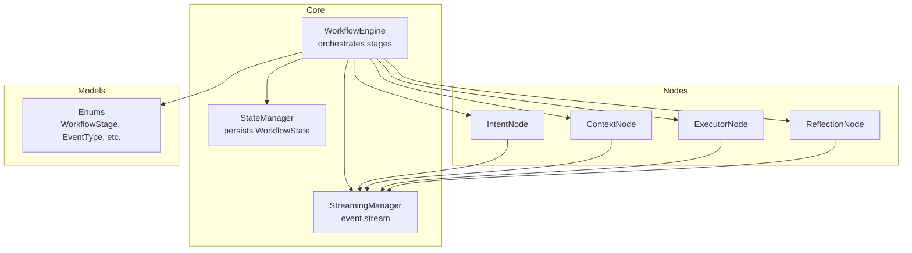
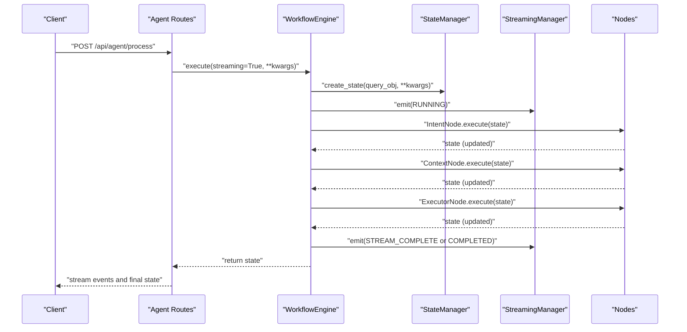
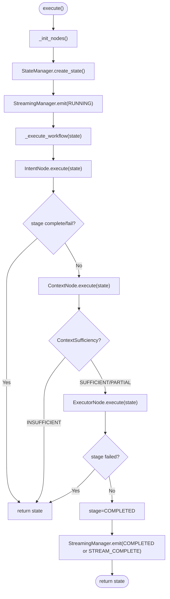
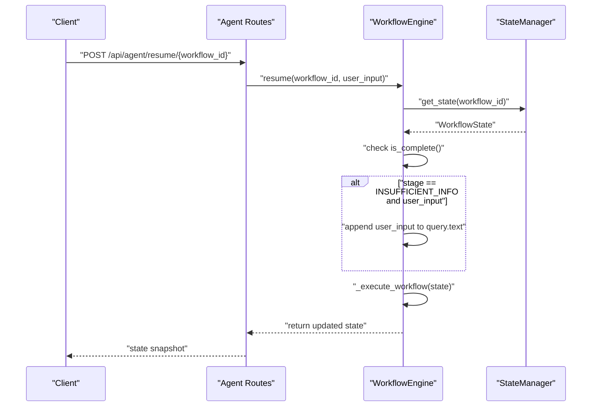
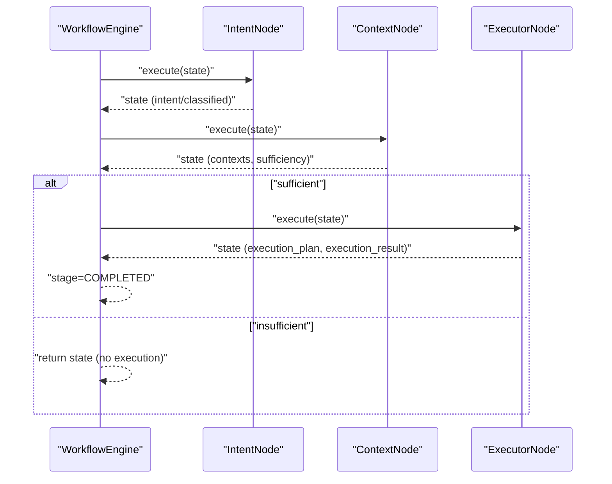
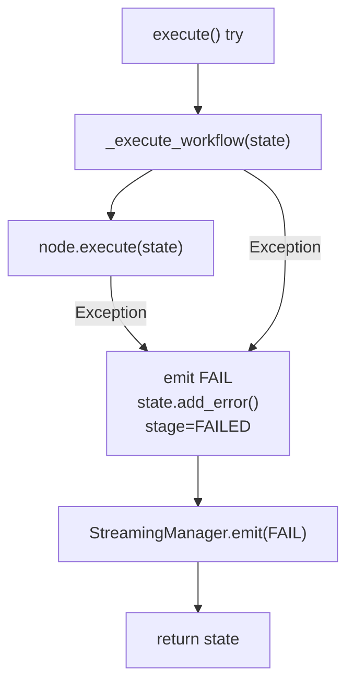
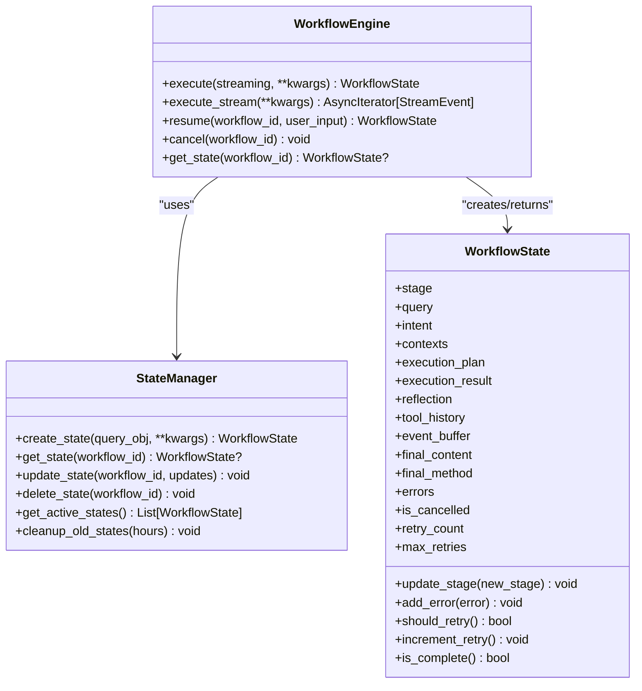
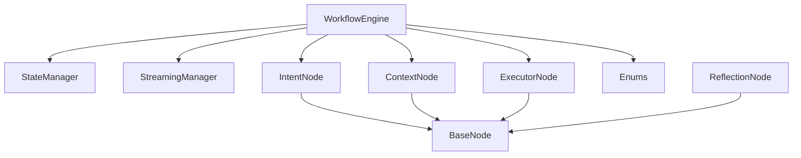

# Workflow Lifecycle Management

<cite>
**Referenced Files in This Document**
- [workflow.py](file://opencontext/context_consumption/context_agent/core/workflow.py)
- [state.py](file://opencontext/context_consumption/context_agent/core/state.py)
- [intent.py](file://opencontext/context_consumption/context_agent/nodes/intent.py)
- [context.py](file://opencontext/context_consumption/context_agent/nodes/context.py)
- [executor.py](file://opencontext/context_consumption/context_agent/nodes/executor.py)
- [reflection.py](file://opencontext/context_consumption/context_agent/nodes/reflection.py)
- [base.py](file://opencontext/context_consumption/context_agent/nodes/base.py)
- [streaming.py](file://opencontext/context_consumption/context_agent/core/streaming.py)
- [enums.py](file://opencontext/context_consumption/context_agent/models/enums.py)
- [agent_chat.js](file://opencontext/web/static/js/agent_chat.js)
- [agent_chat.py](file://opencontext/server/routes/agent_chat.py)
</cite>

## Table of Contents
1. [Introduction](#introduction)
2. [Project Structure](#project-structure)
3. [Core Components](#core-components)
4. [Architecture Overview](#architecture-overview)
5. [Detailed Component Analysis](#detailed-component-analysis)
6. [Dependency Analysis](#dependency-analysis)
7. [Performance Considerations](#performance-considerations)
8. [Troubleshooting Guide](#troubleshooting-guide)
9. [Conclusion](#conclusion)
10. [Appendices](#appendices)

## Introduction
This document explains the Workflow Engine lifecycle management with a focus on state transitions and workflow control operations. It details the orchestration method that drives sequential progression through intent analysis, context gathering, execution, and completion stages, and describes how resumable operations are supported via state persistence. It also covers the resume(), cancel(), and get_state() methods, along with examples of stage transitions under normal and exceptional conditions, and discusses edge cases such as workflow resurrection and state consistency.

## Project Structure
The workflow engine resides in the context agent core and integrates with specialized nodes for each stage, a streaming manager for event propagation, and state management for persistence and inspection.

**Diagram sources**
- [workflow.py](file://opencontext/context_consumption/context_agent/core/workflow.py#L1-L208)
- [state.py](file://opencontext/context_consumption/context_agent/core/state.py#L1-L278)
- [intent.py](file://opencontext/context_consumption/context_agent/nodes/intent.py#L1-L264)
- [context.py](file://opencontext/context_consumption/context_agent/nodes/context.py#L1-L171)
- [executor.py](file://opencontext/context_consumption/context_agent/nodes/executor.py#L1-L276)
- [reflection.py](file://opencontext/context_consumption/context_agent/nodes/reflection.py#L1-L334)
- [streaming.py](file://opencontext/context_consumption/context_agent/core/streaming.py#L1-L46)
- [enums.py](file://opencontext/context_consumption/context_agent/models/enums.py#L1-L111)

**Section sources**
- [workflow.py](file://opencontext/context_consumption/context_agent/core/workflow.py#L1-L208)
- [state.py](file://opencontext/context_consumption/context_agent/core/state.py#L1-L278)
- [enums.py](file://opencontext/context_consumption/context_agent/models/enums.py#L1-L111)

## Core Components
- WorkflowEngine: Orchestrates the workflow stages, manages streaming events, and coordinates node execution. Provides execute(), execute_stream(), resume(), cancel(), and get_state().
- StateManager: Creates, persists, retrieves, updates, and cleans up WorkflowState instances keyed by workflow_id.
- WorkflowState: Holds the current stage, query, intermediate results, tool history, streaming buffers, metadata, errors, cancellation flag, and retry controls.
- Nodes: IntentNode, ContextNode, ExecutorNode, ReflectionNode implement stage-specific logic and emit streaming events.
- StreamingManager: Asynchronous event queue for emitting and streaming events to clients.
- Enums: Define stage, event, action, and sufficiency types used across the workflow.

Key responsibilities:
- Stage transitions are explicit and guarded by checks for completion or failure.
- Resumable operations rely on persisted state and the ability to continue from the last known stage.
- Cancellation marks the state as failed and sets a cancellation flag.
- Inspection is provided via get_state() returning the current state snapshot.

**Section sources**
- [workflow.py](file://opencontext/context_consumption/context_agent/core/workflow.py#L1-L208)
- [state.py](file://opencontext/context_consumption/context_agent/core/state.py#L1-L278)
- [base.py](file://opencontext/context_consumption/context_agent/nodes/base.py#L1-L55)
- [streaming.py](file://opencontext/context_consumption/context_agent/core/streaming.py#L1-L46)
- [enums.py](file://opencontext/context_consumption/context_agent/models/enums.py#L1-L111)

## Architecture Overview
The WorkflowEngine initializes nodes lazily and executes them in order. Each node inherits from BaseNode and encapsulates stage-specific logic. Streaming events are emitted through StreamingManager and consumed by clients. State is stored in StateManager and can be inspected or resumed later.

**Diagram sources**
- [workflow.py](file://opencontext/context_consumption/context_agent/core/workflow.py#L58-L112)
- [state.py](file://opencontext/context_consumption/context_agent/core/state.py#L211-L238)
- [streaming.py](file://opencontext/context_consumption/context_agent/core/streaming.py#L16-L46)
- [intent.py](file://opencontext/context_consumption/context_agent/nodes/intent.py#L32-L71)
- [context.py](file://opencontext/context_consumption/context_agent/nodes/context.py#L27-L166)
- [executor.py](file://opencontext/context_consumption/context_agent/nodes/executor.py#L29-L88)
- [agent_chat.py](file://opencontext/server/routes/agent_chat.py#L315-L366)

## Detailed Component Analysis

### WorkflowEngine: Orchestration and Control
- execute(): Initializes nodes, creates a WorkflowState, emits a RUNNING event, runs _execute_workflow(), and emits completion or failure events. On exceptions, marks stage as FAILED and records error.
- execute_stream(): Runs execute() as a background task and yields events from StreamingManager until completion or failure.
- _execute_workflow(): Drives sequential stages:
  - Intent analysis: Updates stage, executes IntentNode, checks for completion or failure.
  - Context gathering: Updates stage, executes ContextNode; if ContextSufficiency is INSUFFICIENT, returns early; otherwise continues.
  - Execution: Updates stage, executes ExecutorNode; if failed, returns early.
  - Completion: Marks stage as COMPLETED.
- resume(): Retrieves persisted state by workflow_id, guards against completed workflows, and resumes from the last stage. If the stage requires user input and user_input is provided, appends it to the query and continues.
- get_state(): Returns the current state snapshot for inspection.
- cancel(): Marks the state as cancelled and sets stage to FAILED.

**Diagram sources**
- [workflow.py](file://opencontext/context_consumption/context_agent/core/workflow.py#L58-L163)

**Section sources**
- [workflow.py](file://opencontext/context_consumption/context_agent/core/workflow.py#L58-L208)
- [base.py](file://opencontext/context_consumption/context_agent/nodes/base.py#L34-L51)

### State Persistence and Resumable Operations
- StateManager stores WorkflowState instances keyed by workflow_id and exposes create_state(), get_state(), update_state(), delete_state(), and cleanup_old_states().
- WorkflowState holds the current stage, query, intermediate results, tool history, event buffer, final content/method, metadata, errors, cancellation flag, and retry counters.
- Resumption:
  - resume() loads state by workflow_id and proceeds from the last stage. If the stage is INSUFFICIENT_INFO and user_input is provided, it appends user_input to the query and continues.
  - This design ensures resumable operations by persisting state across interruptions.

**Diagram sources**
- [workflow.py](file://opencontext/context_consumption/context_agent/core/workflow.py#L175-L197)
- [state.py](file://opencontext/context_consumption/context_agent/core/state.py#L239-L241)
- [agent_chat.js](file://opencontext/web/static/js/agent_chat.js#L720-L755)
- [agent_chat.py](file://opencontext/server/routes/agent_chat.py#L315-L366)

**Section sources**
- [state.py](file://opencontext/context_consumption/context_agent/core/state.py#L211-L278)
- [workflow.py](file://opencontext/context_consumption/context_agent/core/workflow.py#L175-L197)

### Stage Transitions and Normal Flow
- Intent analysis: IntentNode classifies query type and either performs a simple chat reply or prepares intent for downstream stages. If classification fails, stage becomes FAILED.
- Context gathering: ContextNode iteratively evaluates sufficiency and calls tools to gather context. If sufficient, continues; if insufficient, returns early.
- Execution: ExecutorNode generates an execution plan based on intent and executes steps, streaming progress and results. Final content and method are recorded.
- Completion: Stage advances to COMPLETED.

**Diagram sources**
- [workflow.py](file://opencontext/context_consumption/context_agent/core/workflow.py#L125-L163)
- [intent.py](file://opencontext/context_consumption/context_agent/nodes/intent.py#L32-L71)
- [context.py](file://opencontext/context_consumption/context_agent/nodes/context.py#L27-L166)
- [executor.py](file://opencontext/context_consumption/context_agent/nodes/executor.py#L29-L88)

**Section sources**
- [intent.py](file://opencontext/context_consumption/context_agent/nodes/intent.py#L32-L154)
- [context.py](file://opencontext/context_consumption/context_agent/nodes/context.py#L27-L166)
- [executor.py](file://opencontext/context_consumption/context_agent/nodes/executor.py#L29-L118)

### Exception Handling and Failure Paths
- execute(): Catches exceptions, marks stage as FAILED, adds error to state, and emits a FAIL event.
- BaseNode.execute(): Wraps node.process() and emits FAIL events on exceptions, appending error messages to state.
- cancel(): Sets is_cancelled and stage to FAILED without raising.

**Diagram sources**
- [workflow.py](file://opencontext/context_consumption/context_agent/core/workflow.py#L100-L111)
- [base.py](file://opencontext/context_consumption/context_agent/nodes/base.py#L34-L51)

**Section sources**
- [workflow.py](file://opencontext/context_consumption/context_agent/core/workflow.py#L100-L111)
- [base.py](file://opencontext/context_consumption/context_agent/nodes/base.py#L34-L51)

### Methods: resume(), cancel(), get_state()
- resume(workflow_id, user_input): Loads persisted state, guards completion, resumes from last stage, and optionally appends user_input to query.text before continuing.
- cancel(workflow_id): Marks state as cancelled and sets stage to FAILED.
- get_state(workflow_id): Returns the current state snapshot.

**Diagram sources**
- [workflow.py](file://opencontext/context_consumption/context_agent/core/workflow.py#L58-L208)
- [state.py](file://opencontext/context_consumption/context_agent/core/state.py#L211-L278)

**Section sources**
- [workflow.py](file://opencontext/context_consumption/context_agent/core/workflow.py#L175-L208)
- [state.py](file://opencontext/context_consumption/context_agent/core/state.py#L211-L278)

### Edge Cases: Workflow Resurrection and State Consistency
- Workflow resurrection:
  - The engine can resume a previously interrupted workflow by loading its persisted state and proceeding from the last stage. If the stage requires user input and user_input is provided, the engine appends it to the query and continues.
  - The design relies on StateManager’s in-memory dictionary keyed by workflow_id; therefore, resurrection is supported only while the process maintains the state registry.
- State consistency:
  - update_stage() and add_error() update timestamps to metadata.updated_at, ensuring freshness.
  - should_retry() enforces retry limits and prevents retries when cancelled or already completed.
  - cleanup_old_states() removes completed states older than a threshold to prevent unbounded growth.

**Section sources**
- [workflow.py](file://opencontext/context_consumption/context_agent/core/workflow.py#L175-L197)
- [state.py](file://opencontext/context_consumption/context_agent/core/state.py#L74-L84)
- [state.py](file://opencontext/context_consumption/context_agent/core/state.py#L121-L132)
- [state.py](file://opencontext/context_consumption/context_agent/core/state.py#L265-L278)

## Dependency Analysis
The WorkflowEngine depends on StateManager for persistence and StreamingManager for event propagation. Nodes depend on BaseNode for shared execution and error handling. Enums define stage and event types used across the system.

**Diagram sources**
- [workflow.py](file://opencontext/context_consumption/context_agent/core/workflow.py#L1-L208)
- [state.py](file://opencontext/context_consumption/context_agent/core/state.py#L1-L278)
- [base.py](file://opencontext/context_consumption/context_agent/nodes/base.py#L1-L55)
- [enums.py](file://opencontext/context_consumption/context_agent/models/enums.py#L1-L111)

**Section sources**
- [workflow.py](file://opencontext/context_consumption/context_agent/core/workflow.py#L1-L208)
- [state.py](file://opencontext/context_consumption/context_agent/core/state.py#L1-L278)
- [base.py](file://opencontext/context_consumption/context_agent/nodes/base.py#L1-L55)
- [enums.py](file://opencontext/context_consumption/context_agent/models/enums.py#L1-L111)

## Performance Considerations
- Streaming events: The StreamingManager uses an asyncio.Queue with a bounded size and periodic polling to yield events. This avoids blocking and supports real-time client updates.
- Node execution: BaseNode.execute() wraps node.process() and measures duration; exceptions are captured and surfaced via FAIL events.
- Retry control: should_retry() and increment_retry() guard against excessive retries and ensure cancellation takes precedence.
- Cleanup: cleanup_old_states() prunes completed states older than a threshold to manage memory footprint.

[No sources needed since this section provides general guidance]

## Troubleshooting Guide
- Workflow stuck in a stage:
  - Use get_state(workflow_id) to inspect current stage and intermediate results.
  - Verify that StreamingManager is receiving events and that the client is consuming the stream.
- Resume not working:
  - Ensure the workflow_id exists and the state is not already completed.
  - If the stage requires user input, confirm that user_input is provided and appended to the query.
- Cancellation not taking effect:
  - cancel() sets is_cancelled and stage to FAILED; verify that the client observes the FAIL event and that subsequent operations check is_complete() or should_retry().

**Section sources**
- [workflow.py](file://opencontext/context_consumption/context_agent/core/workflow.py#L198-L208)
- [state.py](file://opencontext/context_consumption/context_agent/core/state.py#L121-L136)
- [streaming.py](file://opencontext/context_consumption/context_agent/core/streaming.py#L16-L46)
- [agent_chat.py](file://opencontext/server/routes/agent_chat.py#L315-L366)

## Conclusion
The Workflow Engine provides a robust lifecycle management system with explicit stage transitions, resumable operations via state persistence, and clear control methods (resume(), cancel(), get_state()). The design separates orchestration, state management, and streaming, enabling modular development and reliable client integration. Edge cases such as resurrection and state consistency are addressed through persisted state, retry controls, and cleanup policies.

## Appendices
- Example client-side resume flow:
  - The frontend sends a POST request to /api/agent/resume/{workflow_id} with user_input when the workflow requires additional information. The backend route delegates to the agent’s resume() method and returns the updated state.

**Section sources**
- [agent_chat.js](file://opencontext/web/static/js/agent_chat.js#L720-L755)
- [agent_chat.py](file://opencontext/server/routes/agent_chat.py#L315-L366)