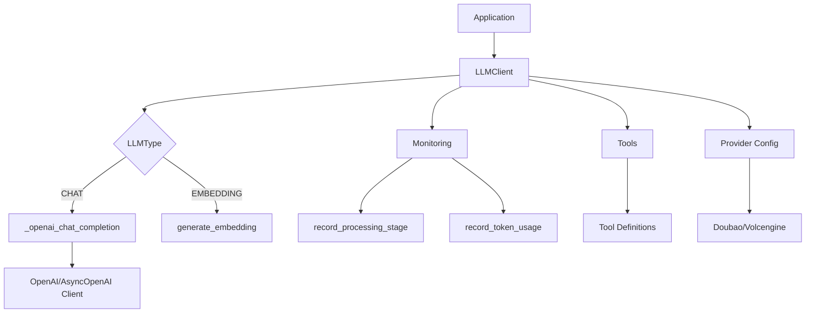
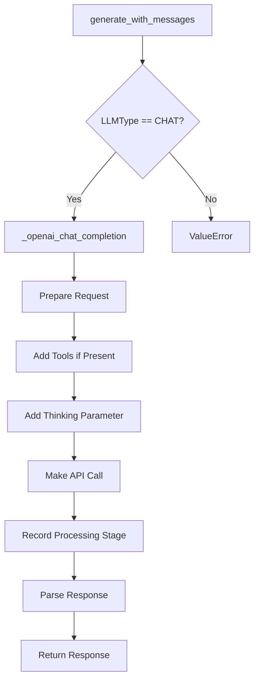
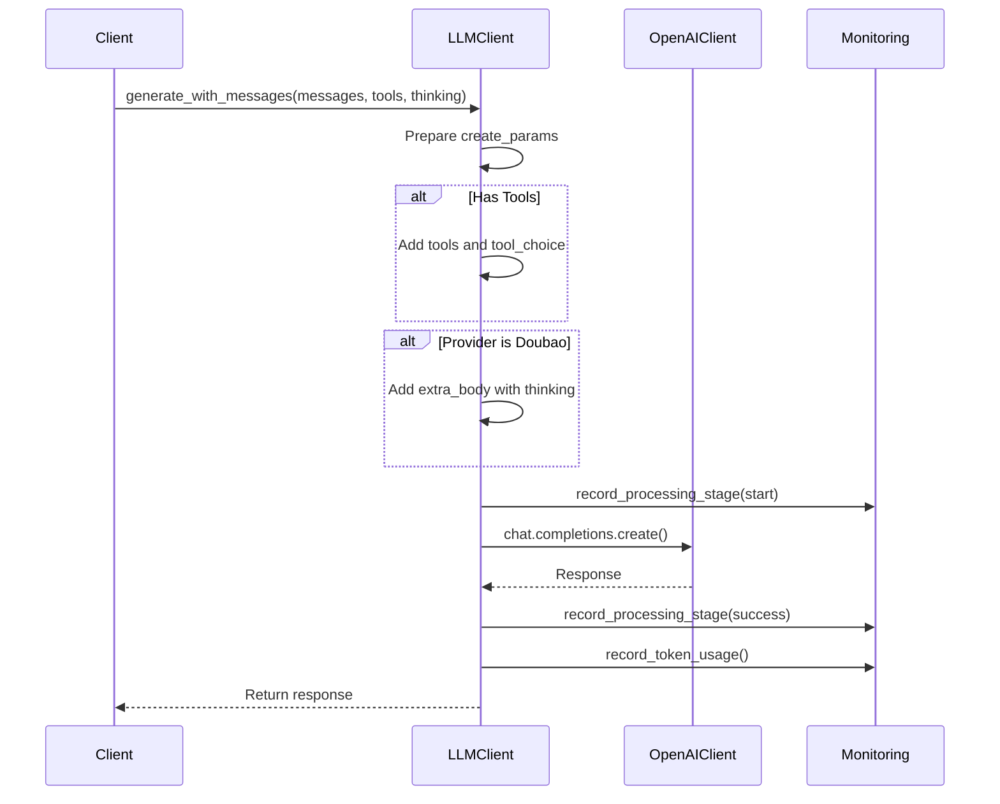
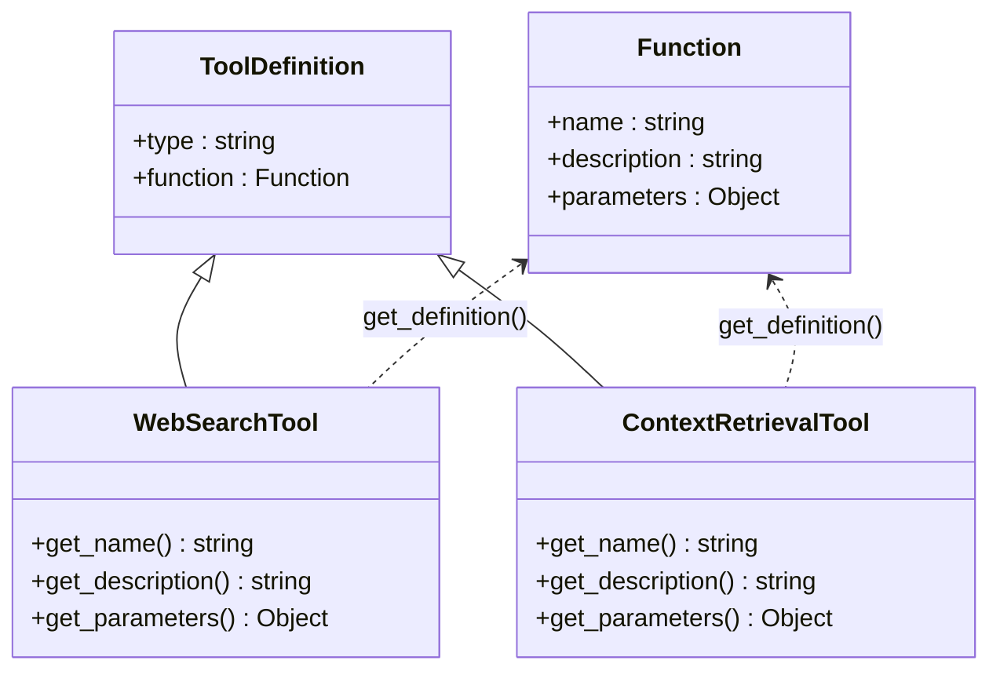
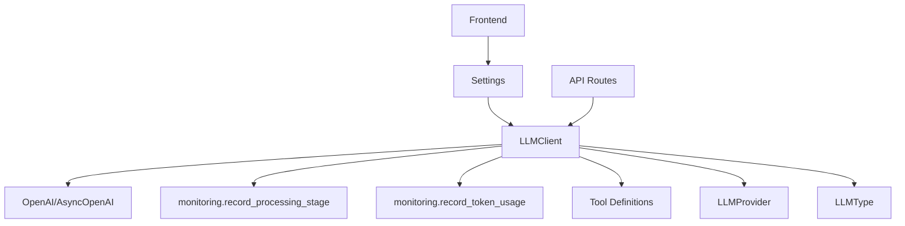

# Chat Completion

<cite>
**Referenced Files in This Document**   
- [llm_client.py](file://opencontext/llm/llm_client.py#L52-L271)
- [tool_definitions.py](file://opencontext/tools/tool_definitions.py#L1-L39)
- [web_search_tool.py](file://opencontext/tools/operation_tools/web_search_tool.py#L1-L101)
- [monitor.py](file://opencontext/monitoring/monitor.py#L133-L163)
- [metrics_collector.py](file://opencontext/monitoring/metrics_collector.py#L1-L208)
- [settings.py](file://opencontext/server/routes/settings.py#L61-L145)
- [settings.tsx](file://frontend/src/renderer/src/pages/settings/settings.tsx#L294-L323)
- [constants.tsx](file://frontend/src/renderer/src/pages/settings/constants.tsx#L1-L78)
</cite>

## Table of Contents
1. [Introduction](#introduction)
2. [Core Components](#core-components)
3. [Architecture Overview](#architecture-overview)
4. [Detailed Component Analysis](#detailed-component-analysis)
5. [Dependency Analysis](#dependency-analysis)
6. [Performance Considerations](#performance-considerations)
7. [Troubleshooting Guide](#troubleshooting-guide)
8. [Conclusion](#conclusion)

## Introduction
The chat completion functionality in the LLM client provides a robust interface for interacting with large language models through chat-based conversations. This system supports both synchronous and asynchronous operations, integrates with multiple LLM providers including OpenAI and Doubao/Volcengine, and includes comprehensive monitoring and error handling capabilities. The implementation is designed to handle complex chat interactions with support for tools, streaming responses, and provider-specific features.

## Core Components

The core components of the chat completion system include the LLMClient class which serves as the primary interface, the generate_with_messages method that routes requests based on LLM type, and the underlying _openai_chat_completion methods that handle actual API interactions. The system also integrates with monitoring components to track token usage and processing stages, and supports provider-specific configurations through the extra_body parameter for Doubao/Volcengine integration.

**Section sources**
- [llm_client.py](file://opencontext/llm/llm_client.py#L52-L271)

## Architecture Overview

The chat completion architecture follows a client-based pattern where the LLMClient class encapsulates all interactions with language models. The system is designed with clear separation between the interface layer, implementation layer, and monitoring layer.



**Diagram sources**
- [llm_client.py](file://opencontext/llm/llm_client.py#L32-L466)
- [monitor.py](file://opencontext/monitoring/monitor.py#L337-L349)
- [tool_definitions.py](file://opencontext/tools/tool_definitions.py#L1-L39)

## Detailed Component Analysis

### generate_with_messages Method Analysis
The generate_with_messages method serves as the primary entry point for chat-based LLM interactions. It acts as a routing mechanism that directs requests to either synchronous or asynchronous implementations based on the configured LLMType.



**Diagram sources**
- [llm_client.py](file://opencontext/llm/llm_client.py#L52-L57)

**Section sources**
- [llm_client.py](file://opencontext/llm/llm_client.py#L52-L57)

### _openai_chat_completion Methods Analysis
The _openai_chat_completion and _openai_chat_completion_async methods handle the actual API calls to the LLM providers. These methods are responsible for request preparation, API invocation with timing measurement, and response parsing.



**Diagram sources**
- [llm_client.py](file://opencontext/llm/llm_client.py#L90-L202)
- [monitor.py](file://opencontext/monitoring/monitor.py#L337-L349)

**Section sources**
- [llm_client.py](file://opencontext/llm/llm_client.py#L90-L202)

### Tool Integration Analysis
The system supports integration with various tools through the tools parameter. Tool definitions are structured according to the OpenAI function calling format and include retrieval tools, profile tools, and operation tools like web search.



**Diagram sources**
- [tool_definitions.py](file://opencontext/tools/tool_definitions.py#L1-L39)
- [web_search_tool.py](file://opencontext/tools/operation_tools/web_search_tool.py#L1-L101)

**Section sources**
- [tool_definitions.py](file://opencontext/tools/tool_definitions.py#L1-L39)
- [web_search_tool.py](file://opencontext/tools/operation_tools/web_search_tool.py#L1-L101)

### Monitoring Integration Analysis
The chat completion system integrates with monitoring components to record token usage and processing stages. This provides valuable insights into API performance and resource consumption.

```mermaid
flowchart TD
A[API Call Start] --> B[Record Start Time]
B --> C[Make API Request]
C --> D{Success?}
D --> |Yes| E[Extract Token Usage]
D --> |No| F[Record Failure]
E --> G[record_token_usage()]
G --> H[record_processing_stage(success)]
F --> I[record_processing_stage(failure)]
H --> J[Return Response]
I --> K[Throw Error]
```

**Diagram sources**
- [llm_client.py](file://opencontext/llm/llm_client.py#L124-L135)
- [monitor.py](file://opencontext/monitoring/monitor.py#L133-L163)

**Section sources**
- [llm_client.py](file://opencontext/llm/llm_client.py#L124-L135)
- [monitor.py](file://opencontext/monitoring/monitor.py#L133-L163)

## Dependency Analysis

The chat completion functionality has several key dependencies that enable its full feature set. The system depends on the OpenAI Python library for API interactions, the monitoring module for performance tracking, and the tool system for extended capabilities.



**Diagram sources**
- [llm_client.py](file://opencontext/llm/llm_client.py#L13-L18)
- [settings.py](file://opencontext/server/routes/settings.py#L61-L145)
- [constants.tsx](file://frontend/src/renderer/src/pages/settings/constants.tsx#L1-L78)

**Section sources**
- [llm_client.py](file://opencontext/llm/llm_client.py#L13-L18)
- [settings.py](file://opencontext/server/routes/settings.py#L61-L145)

## Performance Considerations

The system provides both synchronous and asynchronous methods for chat completion, allowing developers to choose the appropriate approach based on their use case. Synchronous calls are suitable for simple interactions where the application can wait for the response, while asynchronous calls are recommended for applications requiring non-blocking operations or handling multiple concurrent requests.

The implementation includes performance monitoring that records the duration of API calls and processing stages. This allows for identification of bottlenecks and optimization opportunities. The timing measurements are captured at multiple stages: request preparation, API invocation, and response parsing.

Provider selection also impacts performance, with Doubao/Volcengine and OpenAI potentially having different latency characteristics based on network conditions and service availability. The system allows for configuration of timeout values to handle slow responses appropriately.

**Section sources**
- [llm_client.py](file://opencontext/llm/llm_client.py#L39-L46)
- [metrics_collector.py](file://opencontext/monitoring/metrics_collector.py#L1-L208)

## Troubleshooting Guide

The chat completion system includes comprehensive error handling for API errors. When an APIError occurs, the system logs the error details and records the failure in the monitoring system before re-raising the exception. This allows for proper error tracking and debugging.

Common issues include invalid API keys, rate limiting, and model availability. The validation method in LLMClient can be used to test the configuration before making actual requests. For Doubao/Volcengine integration, specific error codes are handled and translated into user-friendly messages.

When troubleshooting, check the following:
1. API key and base URL configuration
2. Model availability in the provider console
3. Account quota and rate limits
4. Network connectivity to the provider API
5. Correct provider configuration in settings

**Section sources**
- [llm_client.py](file://opencontext/llm/llm_client.py#L138-L147)
- [settings.py](file://opencontext/server/routes/settings.py#L137-L145)

## Conclusion

The chat completion functionality in the LLM client provides a comprehensive and flexible interface for interacting with large language models. The system's architecture supports both synchronous and asynchronous operations, integrates with multiple providers, and includes robust monitoring and error handling. The design allows for easy extension through tool integration and provider-specific configurations, making it adaptable to various use cases and requirements.