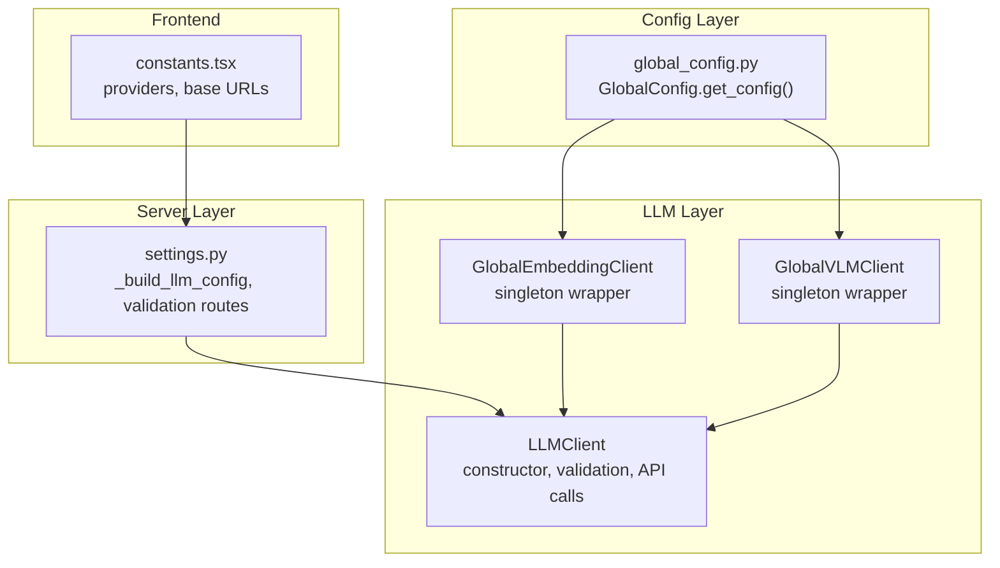
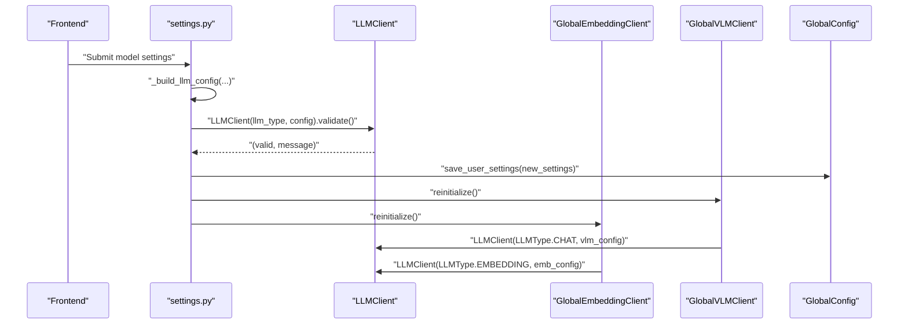
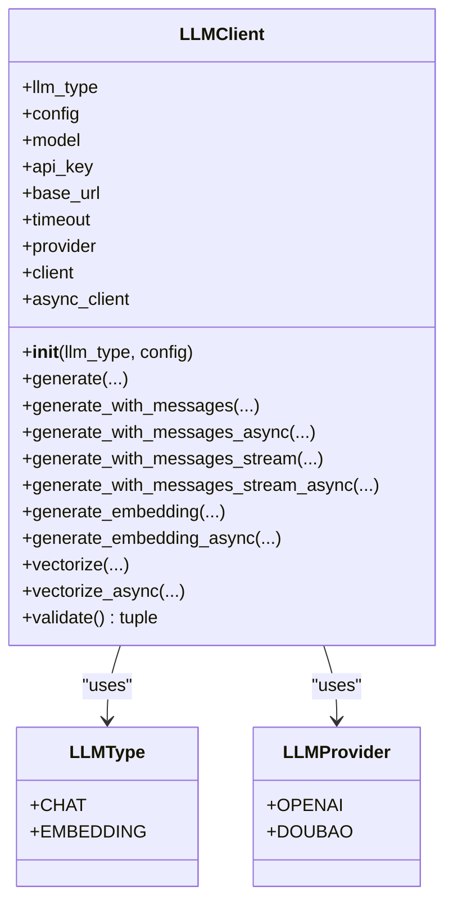
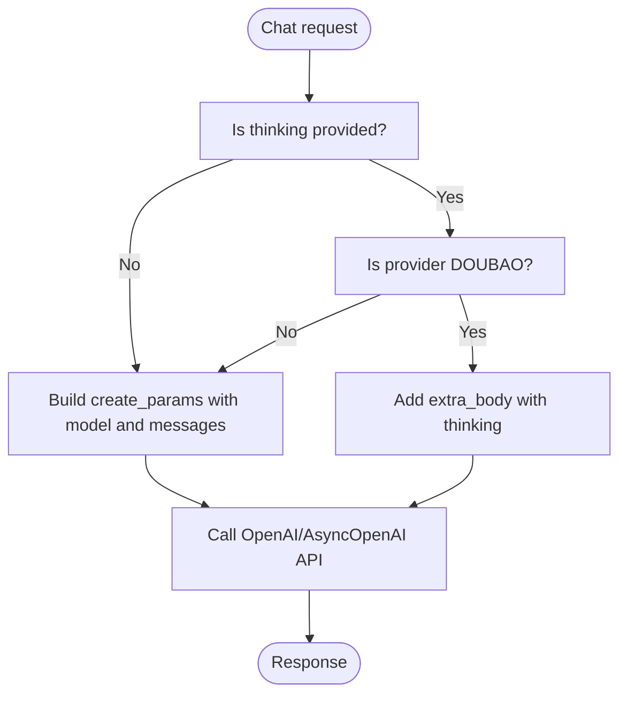
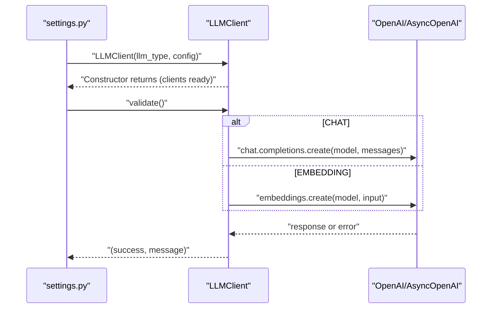
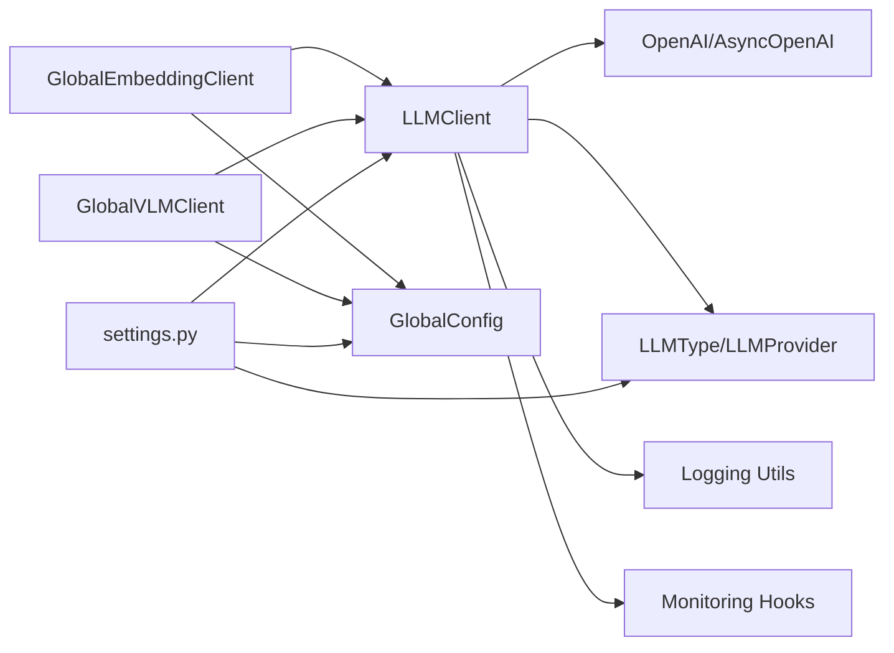

# Client Initialization

<cite>
**Referenced Files in This Document**
- [llm_client.py](file://opencontext/llm/llm_client.py)
- [settings.py](file://opencontext/server/routes/settings.py)
- [global_embedding_client.py](file://opencontext/llm/global_embedding_client.py)
- [global_vlm_client.py](file://opencontext/llm/global_vlm_client.py)
- [global_config.py](file://opencontext/config/global_config.py)
- [constants.tsx](file://frontend/src/renderer/src/pages/settings/constants.tsx)
</cite>

## Table of Contents
1. [Introduction](#introduction)
2. [Project Structure](#project-structure)
3. [Core Components](#core-components)
4. [Architecture Overview](#architecture-overview)
5. [Detailed Component Analysis](#detailed-component-analysis)
6. [Dependency Analysis](#dependency-analysis)
7. [Performance Considerations](#performance-considerations)
8. [Troubleshooting Guide](#troubleshooting-guide)
9. [Conclusion](#conclusion)

## Introduction
This document explains the LLM client initialization process centered on the LLMClient class constructor. It covers how the client is instantiated with LLMType (CHAT or EMBEDDING) and a configuration dictionary containing model, API key, base URL, timeout, and provider. It details the validation that ensures essential parameters are present and raises ValueError if missing, and describes how both synchronous (OpenAI) and asynchronous (AsyncOpenAI) client instances are created. It also documents provider-specific handling for OpenAI and Volcengine/Doubao, and demonstrates how different LLM types affect client behavior. Finally, it addresses error handling during initialization and the implications of configuration errors on system functionality.

## Project Structure
The LLM client initialization spans several modules:
- LLM client implementation and usage
- Server-side configuration building and validation
- Global client wrappers for embedding and VLM
- Frontend constants for providers and base URLs
- Global configuration loading

**Diagram sources**
- [llm_client.py](file://opencontext/llm/llm_client.py#L32-L46)
- [settings.py](file://opencontext/server/routes/settings.py#L61-L73)
- [global_embedding_client.py](file://opencontext/llm/global_embedding_client.py#L60-L105)
- [global_vlm_client.py](file://opencontext/llm/global_vlm_client.py#L70-L113)
- [global_config.py](file://opencontext/config/global_config.py#L236-L261)
- [constants.tsx](file://frontend/src/renderer/src/pages/settings/constants.tsx#L1-L32)

**Section sources**
- [llm_client.py](file://opencontext/llm/llm_client.py#L32-L46)
- [settings.py](file://opencontext/server/routes/settings.py#L61-L73)
- [global_embedding_client.py](file://opencontext/llm/global_embedding_client.py#L60-L105)
- [global_vlm_client.py](file://opencontext/llm/global_vlm_client.py#L70-L113)
- [global_config.py](file://opencontext/config/global_config.py#L236-L261)
- [constants.tsx](file://frontend/src/renderer/src/pages/settings/constants.tsx#L1-L32)

## Core Components
- LLMClient: Encapsulates OpenAI and AsyncOpenAI clients, validates configuration, and exposes generation and embedding methods conditioned on LLMType.
- LLMType: Enumerates supported LLM modes (CHAT, EMBEDDING).
- LLMProvider: Enumerates supported providers (OPENAI, DOUBAO).
- GlobalEmbeddingClient and GlobalVLMClient: Singleton wrappers that construct LLMClient instances from persisted configuration.
- settings.py: Builds configuration dictionaries for LLMClient and validates them via LLMClient.validate().
- GlobalConfig: Loads configuration files and exposes values used to initialize clients.

**Section sources**
- [llm_client.py](file://opencontext/llm/llm_client.py#L22-L31)
- [llm_client.py](file://opencontext/llm/llm_client.py#L32-L46)
- [global_embedding_client.py](file://opencontext/llm/global_embedding_client.py#L60-L105)
- [global_vlm_client.py](file://opencontext/llm/global_vlm_client.py#L70-L113)
- [settings.py](file://opencontext/server/routes/settings.py#L61-L73)
- [global_config.py](file://opencontext/config/global_config.py#L236-L261)

## Architecture Overview
The initialization flow begins with configuration construction and validation, followed by client instantiation and optional reinitialization of global clients.

**Diagram sources**
- [settings.py](file://opencontext/server/routes/settings.py#L138-L163)
- [settings.py](file://opencontext/server/routes/settings.py#L165-L184)
- [llm_client.py](file://opencontext/llm/llm_client.py#L32-L46)
- [global_vlm_client.py](file://opencontext/llm/global_vlm_client.py#L94-L112)
- [global_embedding_client.py](file://opencontext/llm/global_embedding_client.py#L81-L99)
- [global_config.py](file://opencontext/config/global_config.py#L236-L261)

## Detailed Component Analysis

### LLMClient Constructor and Initialization
- Constructor signature: LLMClient(llm_type: LLMType, config: Dict[str, Any])
- Reads configuration keys: model, api_key, base_url, timeout, provider
- Validates presence of api_key, base_url, and model; raises ValueError if any are missing
- Creates synchronous OpenAI client and asynchronous AsyncOpenAI client using the same parameters

**Diagram sources**
- [llm_client.py](file://opencontext/llm/llm_client.py#L22-L31)
- [llm_client.py](file://opencontext/llm/llm_client.py#L32-L46)

**Section sources**
- [llm_client.py](file://opencontext/llm/llm_client.py#L32-L46)

### Configuration Dictionary and Parameter Roles
- Keys: base_url, api_key, model, provider, timeout (optional)
- Defaults:
  - timeout defaults to 300 seconds in constructor
  - provider defaults to OPENAI if not provided
- Behavior:
  - api_key, base_url, model are mandatory; missing any triggers ValueError
  - timeout is passed to both OpenAI and AsyncOpenAI constructors
  - provider influences request parameter construction (see provider-specific handling)

**Section sources**
- [llm_client.py](file://opencontext/llm/llm_client.py#L32-L46)

### Provider-Specific Handling for OpenAI and Doubao
- Provider selection:
  - OPENAI: Standard OpenAI API behavior
  - DOUBAO: Adds extra_body with thinking configuration for chat requests
- Doubao-specific logic:
  - When provider is DOUBAO and thinking is provided, extra_body is included in create_params
  - Embedding requests do not use thinking; only chat requests are affected

**Diagram sources**
- [llm_client.py](file://opencontext/llm/llm_client.py#L90-L111)
- [llm_client.py](file://opencontext/llm/llm_client.py#L149-L169)
- [llm_client.py](file://opencontext/llm/llm_client.py#L203-L223)
- [llm_client.py](file://opencontext/llm/llm_client.py#L228-L259)

**Section sources**
- [llm_client.py](file://opencontext/llm/llm_client.py#L90-L111)
- [llm_client.py](file://opencontext/llm/llm_client.py#L149-L169)
- [llm_client.py](file://opencontext/llm/llm_client.py#L203-L223)
- [llm_client.py](file://opencontext/llm/llm_client.py#L228-L259)

### Synchronous and Asynchronous Client Creation
- Synchronous client: OpenAI(api_key, base_url, timeout)
- Asynchronous client: AsyncOpenAI(api_key, base_url, timeout)
- Both are created in the constructor and reused across methods

**Section sources**
- [llm_client.py](file://opencontext/llm/llm_client.py#L32-L46)

### Impact of LLM Type on Client Behavior
- CHAT mode:
  - generate_with_messages, generate_with_messages_async, generate_with_messages_stream, generate_with_messages_stream_async are supported
  - Provider-specific thinking parameter is honored for Doubao
- EMBEDDING mode:
  - generate_embedding and generate_embedding_async are supported
  - Output dimensionality can be trimmed and normalized based on configuration

**Section sources**
- [llm_client.py](file://opencontext/llm/llm_client.py#L48-L88)
- [llm_client.py](file://opencontext/llm/llm_client.py#L263-L327)

### Validation and Error Handling During Initialization
- Constructor validation:
  - Raises ValueError immediately if api_key, base_url, or model is missing
- Runtime validation:
  - LLMClient.validate() performs a lightweight API call to confirm connectivity and model availability
  - For CHAT: sends a minimal message; for EMBEDDING: requests a simple embedding
  - APIError is caught and summarized; other exceptions are also summarized
- Frontend/backend validation:
  - settings.py builds configs and calls LLMClient.validate() before saving settings
  - Errors are returned to the frontend with concise messages

**Diagram sources**
- [settings.py](file://opencontext/server/routes/settings.py#L138-L163)
- [llm_client.py](file://opencontext/llm/llm_client.py#L422-L466)

**Section sources**
- [llm_client.py](file://opencontext/llm/llm_client.py#L41-L46)
- [llm_client.py](file://opencontext/llm/llm_client.py#L422-L466)
- [settings.py](file://opencontext/server/routes/settings.py#L138-L163)

### Global Client Wrappers and Configuration Retrieval
- GlobalEmbeddingClient and GlobalVLMClient:
  - Retrieve configuration via GlobalConfig.get_config("embedding_model") and GlobalConfig.get_config("vlm_model")
  - Construct LLMClient with appropriate LLMType and config
  - Provide thread-safe reinitialization and convenience methods for embedding and VLM generation
- Frontend constants:
  - Define provider options and base URLs for OpenAI and Doubao

**Section sources**
- [global_embedding_client.py](file://opencontext/llm/global_embedding_client.py#L60-L105)
- [global_vlm_client.py](file://opencontext/llm/global_vlm_client.py#L70-L113)
- [global_config.py](file://opencontext/config/global_config.py#L236-L261)
- [constants.tsx](file://frontend/src/renderer/src/pages/settings/constants.tsx#L1-L32)

## Dependency Analysis
- LLMClient depends on:
  - OpenAI and AsyncOpenAI from the openai library
  - LLMType and LLMProvider enums
  - Vectorize model for vectorization
  - Logging utilities and monitoring hooks
- Global clients depend on:
  - GlobalConfig for retrieving persisted configuration
  - LLMClient for performing operations
- Server routes depend on:
  - LLMClient.validate() for pre-save validation
  - _build_llm_config() for constructing configs

**Diagram sources**
- [llm_client.py](file://opencontext/llm/llm_client.py#L10-L18)
- [global_embedding_client.py](file://opencontext/llm/global_embedding_client.py#L60-L105)
- [global_vlm_client.py](file://opencontext/llm/global_vlm_client.py#L70-L113)
- [settings.py](file://opencontext/server/routes/settings.py#L61-L73)
- [global_config.py](file://opencontext/config/global_config.py#L236-L261)

**Section sources**
- [llm_client.py](file://opencontext/llm/llm_client.py#L10-L18)
- [global_embedding_client.py](file://opencontext/llm/global_embedding_client.py#L60-L105)
- [global_vlm_client.py](file://opencontext/llm/global_vlm_client.py#L70-L113)
- [settings.py](file://opencontext/server/routes/settings.py#L61-L73)
- [global_config.py](file://opencontext/config/global_config.py#L236-L261)

## Performance Considerations
- Timeout configuration:
  - The constructor sets a default timeout; server routes override this to a shorter value during validation to prevent long waits
- Token usage recording:
  - When available, responses include usage metadata that is recorded for monitoring
- Output dimensionality:
  - Embedding responses can be trimmed and normalized based on configuration, affecting downstream processing costs

**Section sources**
- [llm_client.py](file://opencontext/llm/llm_client.py#L32-L46)
- [settings.py](file://opencontext/server/routes/settings.py#L138-L163)
- [llm_client.py](file://opencontext/llm/llm_client.py#L263-L327)

## Troubleshooting Guide
Common initialization and configuration errors:
- Missing required parameters:
  - api_key, base_url, or model missing in config trigger ValueError during constructor
- Provider mismatch:
  - Using Doubao provider without enabling the thinking feature still works; however, specifying thinking requires Doubao provider
- API errors:
  - validate() catches APIError and returns a concise error summary; inspect logs for details
- Configuration not found:
  - Global clients may log warnings if configuration is absent; reinitialize after saving settings

Mitigation steps:
- Verify configuration keys and values before constructing LLMClient
- Use settings.py endpoints to validate configurations prior to saving
- Confirm provider and base URL combinations align with the selected platform
- Check logs for detailed error summaries returned by validate()

**Section sources**
- [llm_client.py](file://opencontext/llm/llm_client.py#L41-L46)
- [llm_client.py](file://opencontext/llm/llm_client.py#L422-L466)
- [global_embedding_client.py](file://opencontext/llm/global_embedding_client.py#L60-L105)
- [global_vlm_client.py](file://opencontext/llm/global_vlm_client.py#L70-L113)
- [settings.py](file://opencontext/server/routes/settings.py#L138-L163)

## Conclusion
The LLM client initialization process centers on a robust constructor that validates essential parameters and creates both synchronous and asynchronous OpenAI clients. Provider-specific logic enables advanced features like Doubao’s thinking parameter for chat requests. Global client wrappers and server-side validation ensure reliable configuration management and runtime checks. Proper configuration of model, API key, base URL, timeout, and provider is critical for system stability and performance.