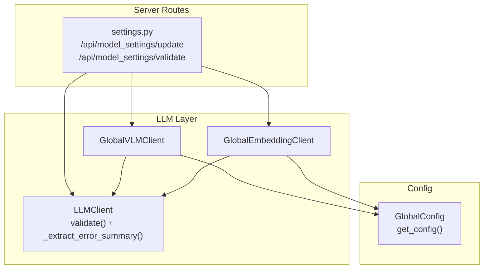
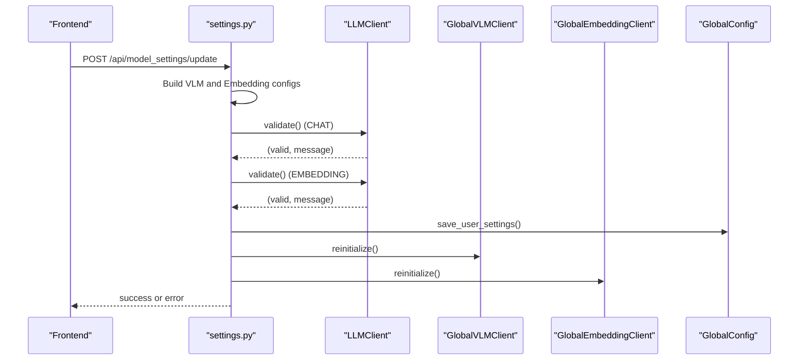
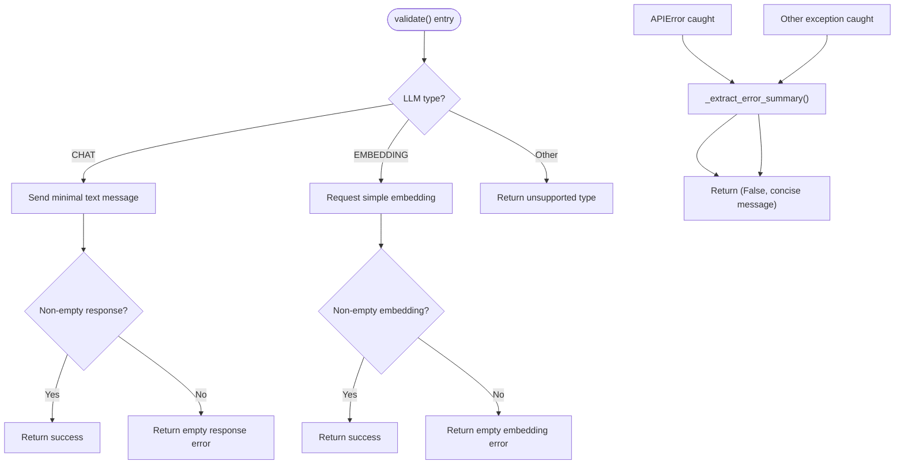
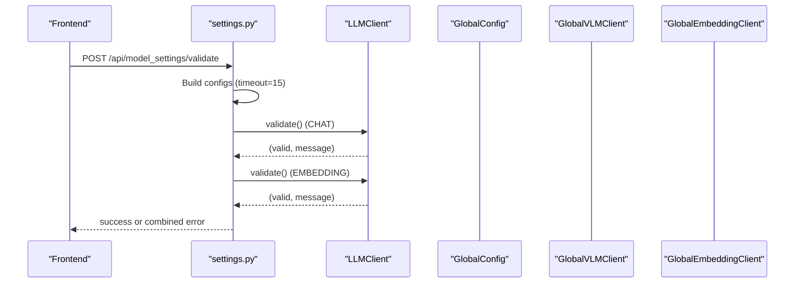
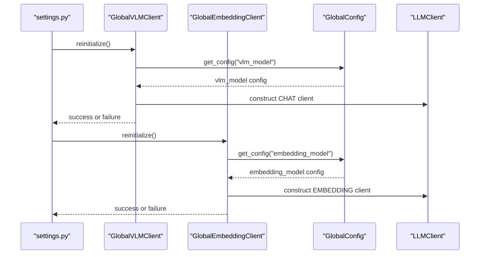
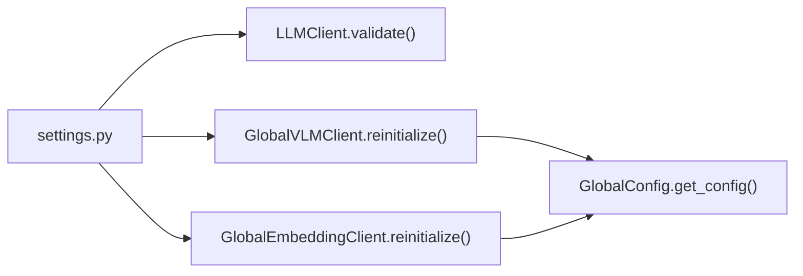

# Configuration Validation

<cite>
**Referenced Files in This Document**
- [llm_client.py](file://opencontext/llm/llm_client.py)
- [settings.py](file://opencontext/server/routes/settings.py)
- [global_vlm_client.py](file://opencontext/llm/global_vlm_client.py)
- [global_embedding_client.py](file://opencontext/llm/global_embedding_client.py)
- [global_config.py](file://opencontext/config/global_config.py)
</cite>

## Table of Contents
1. [Introduction](#introduction)
2. [Project Structure](#project-structure)
3. [Core Components](#core-components)
4. [Architecture Overview](#architecture-overview)
5. [Detailed Component Analysis](#detailed-component-analysis)
6. [Dependency Analysis](#dependency-analysis)
7. [Performance Considerations](#performance-considerations)
8. [Troubleshooting Guide](#troubleshooting-guide)
9. [Conclusion](#conclusion)

## Introduction
This document explains the LLM client configuration validation system. It focuses on how the validate method tests LLM configuration by making simple API calls to verify connectivity and credentials, how the _extract_error_summary helper function provides concise, user-friendly error messages by parsing verbose API error responses and mapping them to specific error types for OpenAI and Volcengine/Doubao providers, and how the validation system integrates into the settings update workflow in the API routes. It also provides concrete examples from the codebase showing how validation is used during model settings updates and reinitialization, and addresses common validation failure scenarios and their solutions.

## Project Structure
The validation system spans several modules:
- LLM client implementation and validation logic
- API routes for settings and validation
- Global client wrappers for VLM and embedding
- Global configuration access

**Diagram sources**
- [llm_client.py](file://opencontext/llm/llm_client.py#L344-L466)
- [settings.py](file://opencontext/server/routes/settings.py#L108-L247)
- [global_vlm_client.py](file://opencontext/llm/global_vlm_client.py#L94-L113)
- [global_embedding_client.py](file://opencontext/llm/global_embedding_client.py#L81-L99)
- [global_config.py](file://opencontext/config/global_config.py#L303-L311)

**Section sources**
- [llm_client.py](file://opencontext/llm/llm_client.py#L344-L466)
- [settings.py](file://opencontext/server/routes/settings.py#L108-L247)
- [global_vlm_client.py](file://opencontext/llm/global_vlm_client.py#L94-L113)
- [global_embedding_client.py](file://opencontext/llm/global_embedding_client.py#L81-L99)
- [global_config.py](file://opencontext/config/global_config.py#L303-L311)

## Core Components
- LLMClient.validate(): Validates LLM configuration by making a simple API call. For CHAT, it sends a minimal text message; for EMBEDDING, it requests a simple embedding. It returns a success flag and a user-friendly message. It catches APIError and other exceptions, extracting concise error summaries via _extract_error_summary.
- _extract_error_summary(): Parses verbose API error messages and maps known error codes to user-friendly messages for OpenAI and Volcengine/Doubao providers. It also truncates long messages to keep them concise.
- Settings routes: The update endpoint validates both VLM and embedding configurations before saving and reinitializing clients. The validate endpoint performs the same checks without persisting changes.
- Global clients: After successful validation, the settings update route reinitializes GlobalVLMClient and GlobalEmbeddingClient to apply new settings.

**Section sources**
- [llm_client.py](file://opencontext/llm/llm_client.py#L344-L466)
- [settings.py](file://opencontext/server/routes/settings.py#L108-L247)
- [global_vlm_client.py](file://opencontext/llm/global_vlm_client.py#L94-L113)
- [global_embedding_client.py](file://opencontext/llm/global_embedding_client.py#L81-L99)

## Architecture Overview
The validation flow integrates API routes, the LLM client, and global client wrappers:

**Diagram sources**
- [settings.py](file://opencontext/server/routes/settings.py#L108-L191)
- [llm_client.py](file://opencontext/llm/llm_client.py#L344-L466)
- [global_vlm_client.py](file://opencontext/llm/global_vlm_client.py#L94-L113)
- [global_embedding_client.py](file://opencontext/llm/global_embedding_client.py#L81-L99)
- [global_config.py](file://opencontext/config/global_config.py#L303-L311)

## Detailed Component Analysis

### LLMClient.validate() and _extract_error_summary()
- Purpose: Verify that the configured LLM endpoint is reachable and credentials are valid by performing a lightweight API call.
- CHAT validation: Sends a minimal text message to the configured model and checks for a non-empty response.
- EMBEDDING validation: Requests a simple embedding for a short input and checks for a non-empty embedding vector.
- Error handling: Catches APIError and other exceptions, then delegates to _extract_error_summary to produce a concise, user-friendly message.
- _extract_error_summary behavior:
  - Maps known Volcengine/Doubao error codes to actionable messages.
  - Maps known OpenAI error codes to actionable messages.
  - Parses structured API error messages containing an error code and message, extracting the essential part and removing request IDs.
  - Truncates overly long messages to keep them readable.

**Diagram sources**
- [llm_client.py](file://opencontext/llm/llm_client.py#L344-L466)

**Section sources**
- [llm_client.py](file://opencontext/llm/llm_client.py#L344-L466)

### Settings Update Workflow Integration
- Validation occurs before saving and reinitializing clients:
  - Build VLM and embedding configs with timeouts suitable for validation.
  - Validate both CHAT and EMBEDDING configurations.
  - On success, save the new settings and reload configuration.
  - Reinitialize GlobalVLMClient and GlobalEmbeddingClient to apply the new configuration.
- The validate endpoint performs the same validation steps without saving.

**Diagram sources**
- [settings.py](file://opencontext/server/routes/settings.py#L198-L247)
- [llm_client.py](file://opencontext/llm/llm_client.py#L344-L466)

**Section sources**
- [settings.py](file://opencontext/server/routes/settings.py#L108-L191)
- [settings.py](file://opencontext/server/routes/settings.py#L198-L247)

### Global Client Reinitialization
After successful validation and saving, the settings update route reinitializes the global clients:
- GlobalVLMClient.reinitialize() creates a new LLMClient from the saved vlm_model configuration and replaces the old instance.
- GlobalEmbeddingClient.reinitialize() creates a new LLMClient from the saved embedding_model configuration and replaces the old instance.

**Diagram sources**
- [settings.py](file://opencontext/server/routes/settings.py#L176-L185)
- [global_vlm_client.py](file://opencontext/llm/global_vlm_client.py#L94-L113)
- [global_embedding_client.py](file://opencontext/llm/global_embedding_client.py#L81-L99)
- [global_config.py](file://opencontext/config/global_config.py#L303-L311)

**Section sources**
- [settings.py](file://opencontext/server/routes/settings.py#L176-L185)
- [global_vlm_client.py](file://opencontext/llm/global_vlm_client.py#L94-L113)
- [global_embedding_client.py](file://opencontext/llm/global_embedding_client.py#L81-L99)
- [global_config.py](file://opencontext/config/global_config.py#L303-L311)

## Dependency Analysis
- LLMClient.validate() depends on the OpenAI client library and the LLM type to decide the validation call.
- Settings routes depend on LLMClient.validate(), GlobalVLMClient.reinitialize(), GlobalEmbeddingClient.reinitialize(), and GlobalConfig.save_user_settings().
- Global clients depend on GlobalConfig.get_config() to retrieve the persisted configuration.

**Diagram sources**
- [settings.py](file://opencontext/server/routes/settings.py#L108-L191)
- [llm_client.py](file://opencontext/llm/llm_client.py#L344-L466)
- [global_vlm_client.py](file://opencontext/llm/global_vlm_client.py#L94-L113)
- [global_embedding_client.py](file://opencontext/llm/global_embedding_client.py#L81-L99)
- [global_config.py](file://opencontext/config/global_config.py#L303-L311)

**Section sources**
- [settings.py](file://opencontext/server/routes/settings.py#L108-L191)
- [llm_client.py](file://opencontext/llm/llm_client.py#L344-L466)
- [global_vlm_client.py](file://opencontext/llm/global_vlm_client.py#L94-L113)
- [global_embedding_client.py](file://opencontext/llm/global_embedding_client.py#L81-L99)
- [global_config.py](file://opencontext/config/global_config.py#L303-L311)

## Performance Considerations
- Validation uses short timeouts to quickly surface connection and credential issues.
- The CHAT validation sends a minimal text message; the EMBEDDING validation requests a simple embedding for a short input.
- Error extraction avoids heavy parsing and truncates long messages to reduce payload sizes.

[No sources needed since this section provides general guidance]

## Troubleshooting Guide
Common validation failure scenarios and their likely causes/solutions:
- Invalid API key
  - Symptom: Provider-specific invalid API key messages mapped by _extract_error_summary.
  - Solution: Verify the API key in the settings form and ensure it matches the provider’s console.
- Model not found or access denied
  - Symptom: Provider-specific model not found or access denied messages mapped by _extract_error_summary.
  - Solution: Confirm the model ID exists and is enabled for your account; check provider console access.
- Rate limit exceeded
  - Symptom: Provider-specific rate limit messages mapped by _extract_error_summary.
  - Solution: Reduce request frequency or upgrade your plan; wait until limits reset.
- Insufficient quota
  - Symptom: Provider-specific insufficient quota messages mapped by _extract_error_summary.
  - Solution: Top up your account or adjust usage; confirm billing status.
- Empty response or embedding
  - Symptom: Validation reports empty response or embedding.
  - Solution: Retry after a short delay; verify model availability and network stability.
- Network or base URL issues
  - Symptom: Unexpected error messages from _extract_error_summary.
  - Solution: Verify base URL correctness and network connectivity; ensure firewall/proxy allows outbound requests.

**Section sources**
- [llm_client.py](file://opencontext/llm/llm_client.py#L352-L421)
- [settings.py](file://opencontext/server/routes/settings.py#L123-L155)

## Conclusion
The configuration validation system provides robust, user-friendly verification of LLM settings for both CHAT and EMBEDDING models. It leverages concise error summarization to guide users toward actionable fixes, integrates seamlessly into the settings update workflow, and ensures that validated configurations are safely persisted and applied by reinitializing global clients. This design improves reliability and reduces downtime caused by misconfigured LLM endpoints.