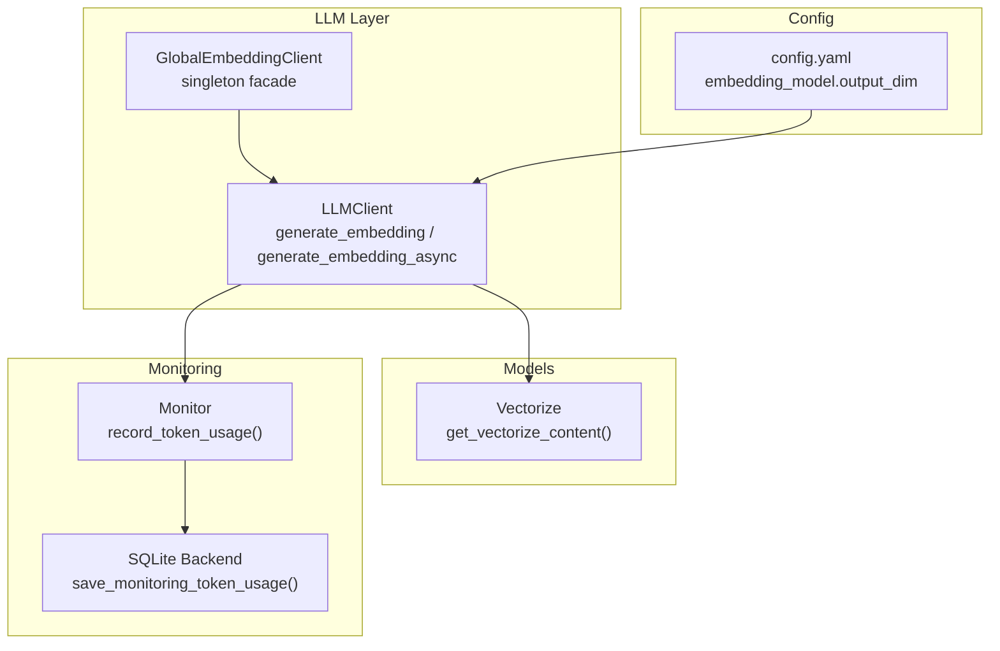
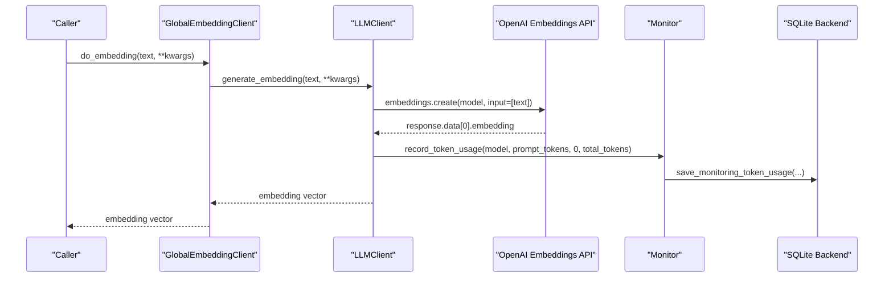
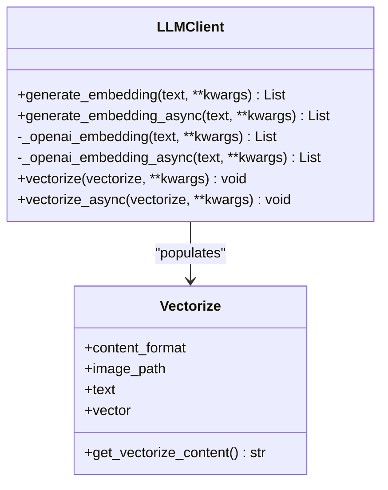
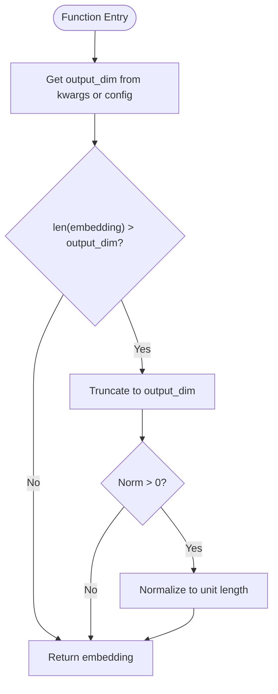
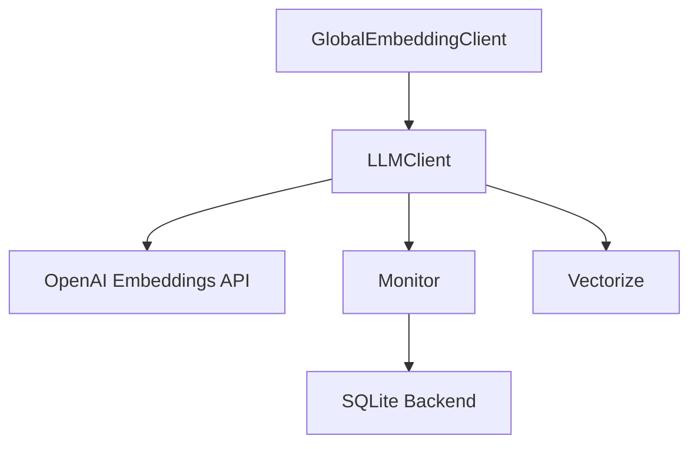

# Embedding Generation

<cite>
**Referenced Files in This Document**
- [llm_client.py](file://opencontext/llm/llm_client.py)
- [global_embedding_client.py](file://opencontext/llm/global_embedding_client.py)
- [context.py](file://opencontext/models/context.py)
- [monitor.py](file://opencontext/monitoring/monitor.py)
- [sqlite_backend.py](file://opencontext/storage/backends/sqlite_backend.py)
- [config.yaml](file://config/config.yaml)
</cite>

## Table of Contents
1. [Introduction](#introduction)
2. [Project Structure](#project-structure)
3. [Core Components](#core-components)
4. [Architecture Overview](#architecture-overview)
5. [Detailed Component Analysis](#detailed-component-analysis)
6. [Dependency Analysis](#dependency-analysis)
7. [Performance Considerations](#performance-considerations)
8. [Troubleshooting Guide](#troubleshooting-guide)
9. [Conclusion](#conclusion)

## Introduction
This document explains the embedding generation functionality in the LLM client. It focuses on how text-to-vector conversion is performed, how the system routes to the correct implementation based on LLM type, and how the OpenAI embeddings API is invoked and processed. It also covers post-processing steps such as dimension truncation and normalization when an output dimension is specified, integration with monitoring for token usage, and how vectorize and vectorize_async methods populate Vectorize objects with embeddings. Finally, it addresses error handling and performance considerations for batch operations.

## Project Structure
The embedding generation feature spans several modules:
- LLM client: Implements the embedding generation methods and integrates with monitoring.
- Global embedding client: Provides a singleton facade for embedding operations and vectorization.
- Models: Defines the Vectorize data model used to carry text content and resulting vectors.
- Monitoring: Records token usage and processing stages for embedding operations.
- Storage: Persists token usage metrics to the database.
- Configuration: Supplies embedding model configuration including output dimension.

**Diagram sources**
- [llm_client.py](file://opencontext/llm/llm_client.py#L78-L118)
- [global_embedding_client.py](file://opencontext/llm/global_embedding_client.py#L101-L138)
- [context.py](file://opencontext/models/context.py#L109-L129)
- [monitor.py](file://opencontext/monitoring/monitor.py#L133-L164)
- [sqlite_backend.py](file://opencontext/storage/backends/sqlite_backend.py#L920-L949)
- [config.yaml](file://config/config.yaml#L32-L38)

**Section sources**
- [llm_client.py](file://opencontext/llm/llm_client.py#L78-L118)
- [global_embedding_client.py](file://opencontext/llm/global_embedding_client.py#L101-L138)
- [context.py](file://opencontext/models/context.py#L109-L129)
- [monitor.py](file://opencontext/monitoring/monitor.py#L133-L164)
- [sqlite_backend.py](file://opencontext/storage/backends/sqlite_backend.py#L920-L949)
- [config.yaml](file://config/config.yaml#L32-L38)

## Core Components
- LLMClient.generate_embedding and generate_embedding_async: Entrypoints that route to the OpenAI embeddings API when LLM type is EMBEDDING. They extract the embedding vector from the API response and apply post-processing.
- LLMClient._openai_embedding and _openai_embedding_async: Internal methods that call the OpenAI embeddings API and process the response.
- Post-processing: If output_dim is specified (via kwargs or config), the embedding is truncated to the target dimension and normalized to unit length when applicable.
- Monitoring integration: Token usage is recorded for embedding requests.
- Vectorize population: vectorize and vectorize_async methods populate Vectorize objects with computed embeddings.

**Section sources**
- [llm_client.py](file://opencontext/llm/llm_client.py#L78-L118)
- [llm_client.py](file://opencontext/llm/llm_client.py#L263-L342)
- [monitor.py](file://opencontext/monitoring/monitor.py#L133-L164)
- [context.py](file://opencontext/models/context.py#L109-L129)

## Architecture Overview
The embedding pipeline follows a clear flow:
- GlobalEmbeddingClient provides a singleton access point and delegates to LLMClient when needed.
- LLMClient validates LLM type and calls the OpenAI embeddings API.
- The response is parsed to extract the embedding vector.
- Optional post-processing adjusts dimensionality and normalization.
- Token usage is recorded via the monitoring subsystem.
- Vectorize objects are populated with the computed embeddings.

**Diagram sources**
- [global_embedding_client.py](file://opencontext/llm/global_embedding_client.py#L101-L131)
- [llm_client.py](file://opencontext/llm/llm_client.py#L263-L324)
- [monitor.py](file://opencontext/monitoring/monitor.py#L133-L164)
- [sqlite_backend.py](file://opencontext/storage/backends/sqlite_backend.py#L920-L949)

## Detailed Component Analysis

### LLMClient Embedding Methods
- generate_embedding(text, **kwargs): Validates LLM type and routes to _openai_embedding when type is EMBEDDING.
- generate_embedding_async(text, **kwargs): Validates LLM type and routes to _openai_embedding_async for async execution.
- _openai_embedding(text, **kwargs): Calls OpenAI embeddings API, extracts embedding vector, records token usage, applies output_dim truncation and normalization when configured.
- _openai_embedding_async(text, **kwargs): Asynchronous variant of the above.

Post-processing logic:
- If output_dim is provided (either via kwargs or config), and the embedding length exceeds output_dim, the vector is truncated to output_dim.
- If the resulting vector has a non-zero norm, it is normalized to unit length.

Token usage recording:
- When response.usage is present, prompt_tokens and total_tokens are recorded; completion_tokens is set to zero for embeddings.

**Section sources**
- [llm_client.py](file://opencontext/llm/llm_client.py#L78-L118)
- [llm_client.py](file://opencontext/llm/llm_client.py#L263-L324)
- [llm_client.py](file://opencontext/llm/llm_client.py#L315-L324)

### Vectorize Population
- vectorize(vectorize_obj, **kwargs): If vectorize_obj.vector is empty, compute embedding using the object’s content and assign it to vectorize_obj.vector.
- vectorize_async(vectorize_obj, **kwargs): Asynchronous counterpart that assigns the computed embedding to vectorize_obj.vector.

Vectorize content selection:
- get_vectorize_content(): Returns text for TEXT content format, image path for IMAGE, and empty string otherwise.

**Section sources**
- [llm_client.py](file://opencontext/llm/llm_client.py#L331-L342)
- [context.py](file://opencontext/models/context.py#L119-L129)

### GlobalEmbeddingClient Facade
- Singleton access: Ensures a single embedding client instance is reused.
- do_embedding(text, **kwargs): Delegates to LLMClient.generate_embedding.
- do_vectorize and do_vectorize_async: Delegate to LLMClient.vectorize and LLMClient.vectorize_async respectively.

Auto-initialization:
- Retrieves embedding_model configuration and constructs LLMClient(LLMType.EMBEDDING, config).

**Section sources**
- [global_embedding_client.py](file://opencontext/llm/global_embedding_client.py#L101-L138)
- [global_embedding_client.py](file://opencontext/llm/global_embedding_client.py#L60-L77)

### Monitoring Integration
- record_token_usage(model, prompt_tokens, completion_tokens, total_tokens): Adds a TokenUsage entry and persists to storage.
- SQLite persistence: Aggregates hourly token usage and updates totals on conflict.

Embedding-specific usage:
- Embedding calls record prompt_tokens and total_tokens; completion_tokens is zero.

**Section sources**
- [monitor.py](file://opencontext/monitoring/monitor.py#L133-L164)
- [sqlite_backend.py](file://opencontext/storage/backends/sqlite_backend.py#L920-L949)

### Configuration and Output Dimension
- config.yaml defines embedding_model with base_url, api_key, model, provider, and output_dim.
- LLMClient reads output_dim from kwargs or falls back to config to decide truncation and normalization.

**Section sources**
- [config.yaml](file://config/config.yaml#L32-L38)
- [llm_client.py](file://opencontext/llm/llm_client.py#L315-L324)

### Class Diagram: LLMClient and Vectorize

**Diagram sources**
- [llm_client.py](file://opencontext/llm/llm_client.py#L78-L118)
- [llm_client.py](file://opencontext/llm/llm_client.py#L263-L342)
- [context.py](file://opencontext/models/context.py#L109-L129)

### Sequence Diagram: Embedding Call Flow

**Diagram sources**
- [global_embedding_client.py](file://opencontext/llm/global_embedding_client.py#L101-L131)
- [llm_client.py](file://opencontext/llm/llm_client.py#L263-L324)
- [monitor.py](file://opencontext/monitoring/monitor.py#L133-L164)
- [sqlite_backend.py](file://opencontext/storage/backends/sqlite_backend.py#L920-L949)

### Flowchart: Post-processing and Truncation

**Diagram sources**
- [llm_client.py](file://opencontext/llm/llm_client.py#L315-L324)

## Dependency Analysis
- LLMClient depends on:
  - OpenAI SDK for embeddings API calls.
  - Monitoring subsystem for token usage recording.
  - Vectorize model for content extraction and vector assignment.
- GlobalEmbeddingClient depends on:
  - LLMClient and Vectorize.
  - Configuration retrieval for embedding_model.
- Monitoring subsystem depends on:
  - Storage backend for persistence of token usage.

**Diagram sources**
- [llm_client.py](file://opencontext/llm/llm_client.py#L263-L324)
- [global_embedding_client.py](file://opencontext/llm/global_embedding_client.py#L101-L138)
- [monitor.py](file://opencontext/monitoring/monitor.py#L133-L164)
- [sqlite_backend.py](file://opencontext/storage/backends/sqlite_backend.py#L920-L949)

**Section sources**
- [llm_client.py](file://opencontext/llm/llm_client.py#L263-L324)
- [global_embedding_client.py](file://opencontext/llm/global_embedding_client.py#L101-L138)
- [monitor.py](file://opencontext/monitoring/monitor.py#L133-L164)
- [sqlite_backend.py](file://opencontext/storage/backends/sqlite_backend.py#L920-L949)

## Performance Considerations
- Batch operations: While the embedding API call itself takes a single text input, the system supports asynchronous vectorization via vectorize_async. For higher throughput, consider batching multiple vectorization tasks concurrently using async orchestration.
- Output dimension tuning: Setting output_dim reduces vector size and can improve downstream performance. The implementation truncates and normalizes the vector when needed.
- Monitoring overhead: Token usage recording is lightweight and occurs after API responses. Ensure monitoring is enabled only when needed for production cost visibility.
- Provider-specific considerations: The LLM client supports multiple providers; ensure the chosen provider’s embeddings endpoint aligns with the configured model and base URL.

[No sources needed since this section provides general guidance]

## Troubleshooting Guide
Common issues and resolutions:
- Unsupported LLM type: Calling generate_embedding when LLM type is not EMBEDDING raises an error. Ensure the client is constructed with LLMType.EMBEDDING.
- API errors: OpenAI APIError exceptions are logged and re-raised. Inspect logs for error details and verify credentials, base URL, and model availability.
- Missing usage data: If response.usage is absent, token usage is not recorded. This is expected for certain providers or environments.
- Vector already populated: vectorize and vectorize_async skip computation if vectorize.vector is already set.

**Section sources**
- [llm_client.py](file://opencontext/llm/llm_client.py#L78-L118)
- [llm_client.py](file://opencontext/llm/llm_client.py#L292-L327)
- [llm_client.py](file://opencontext/llm/llm_client.py#L331-L342)

## Conclusion
The embedding generation feature provides a robust, monitored, and configurable pathway from text to vectors. It routes to the OpenAI embeddings API, applies optional post-processing, records token usage, and integrates seamlessly with Vectorize objects for downstream operations. The GlobalEmbeddingClient offers a convenient singleton interface for embedding and vectorization tasks, while configuration supports dimension tuning for optimal performance.