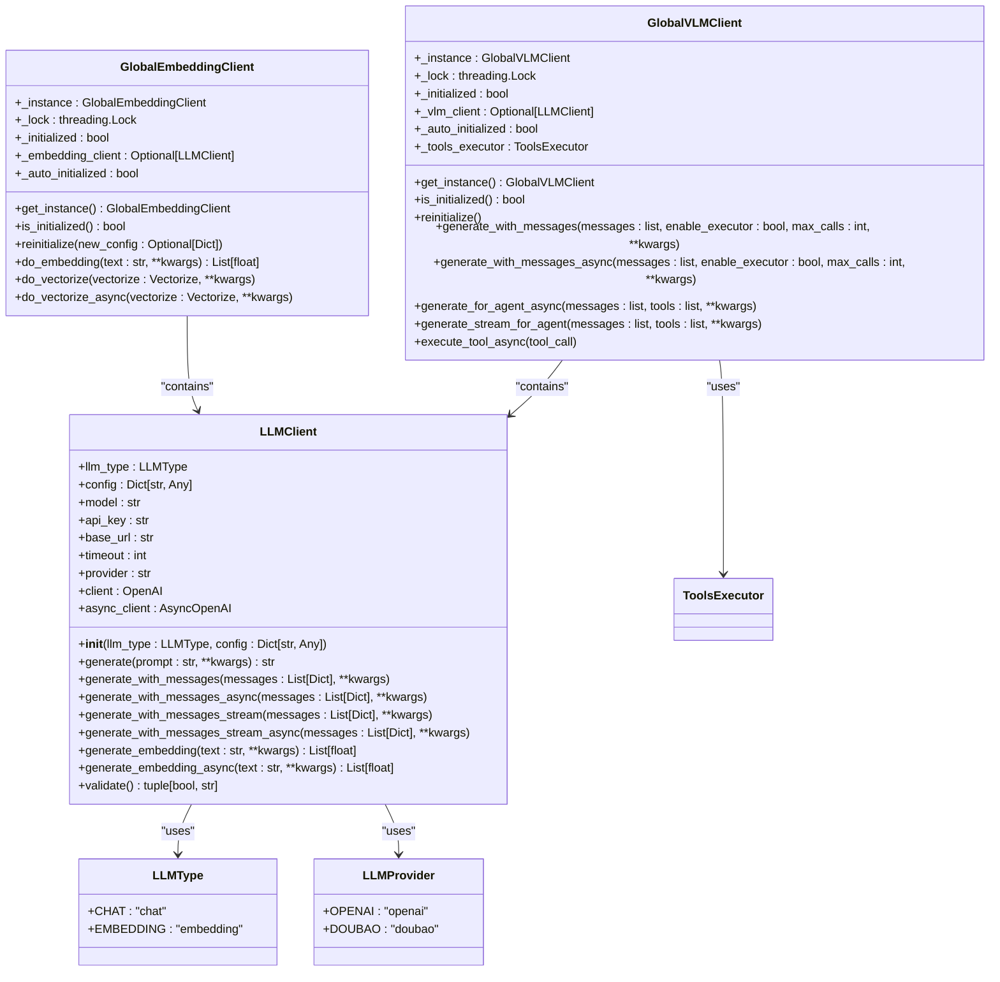
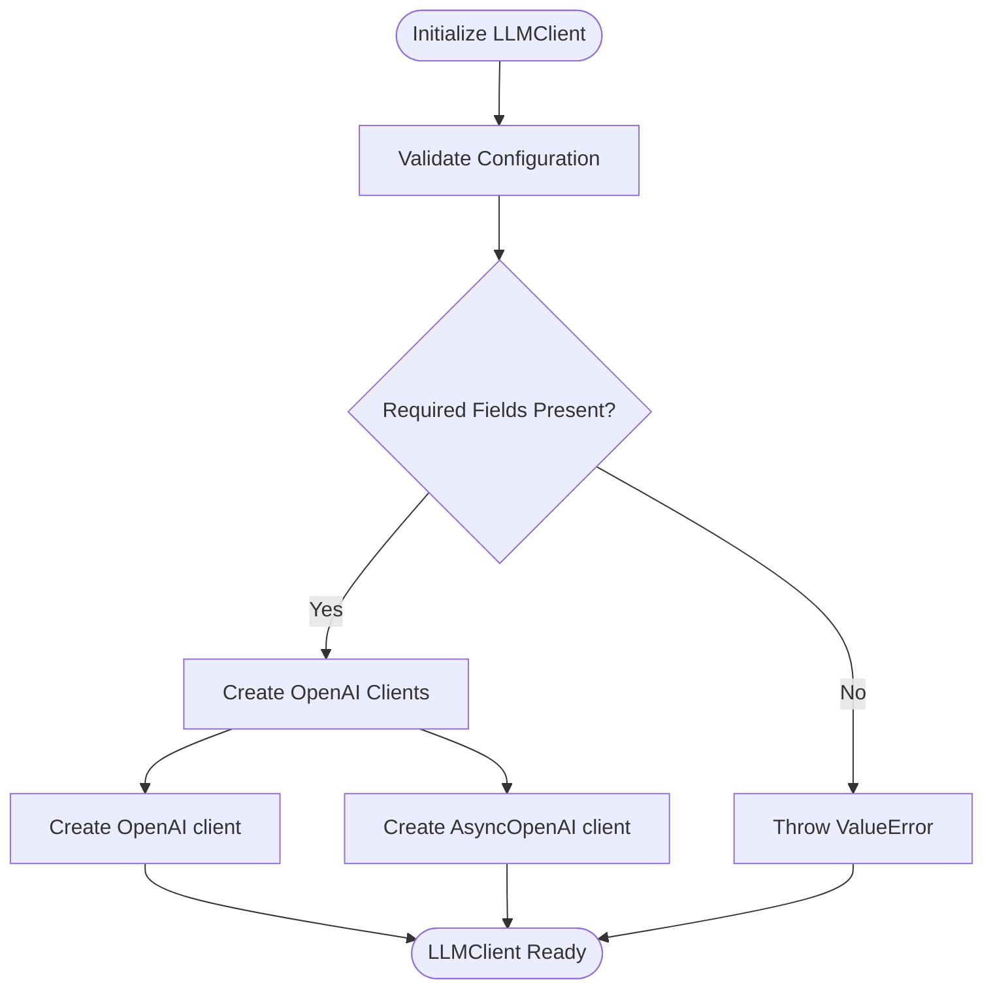
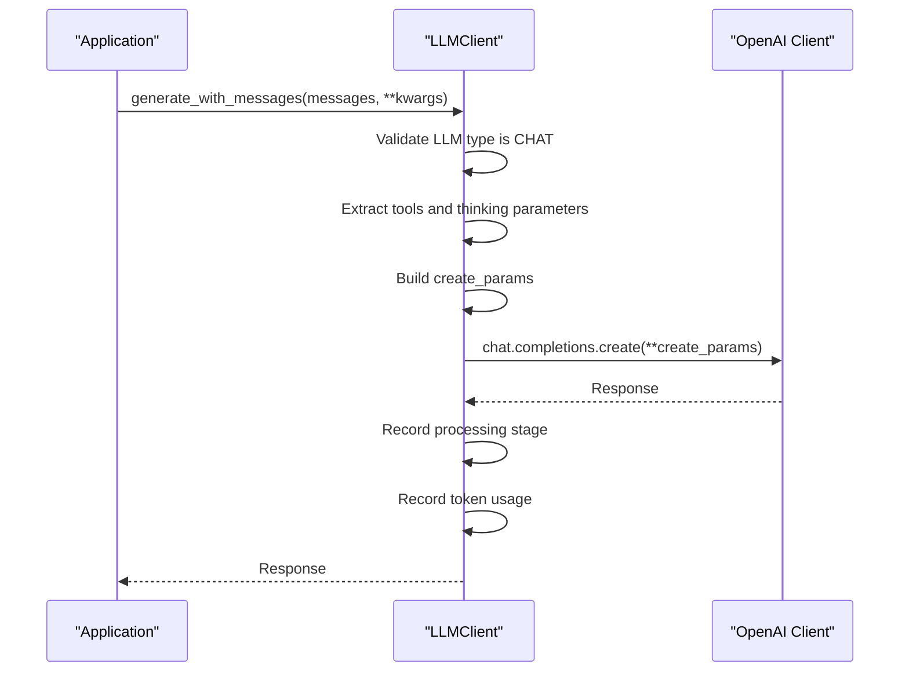
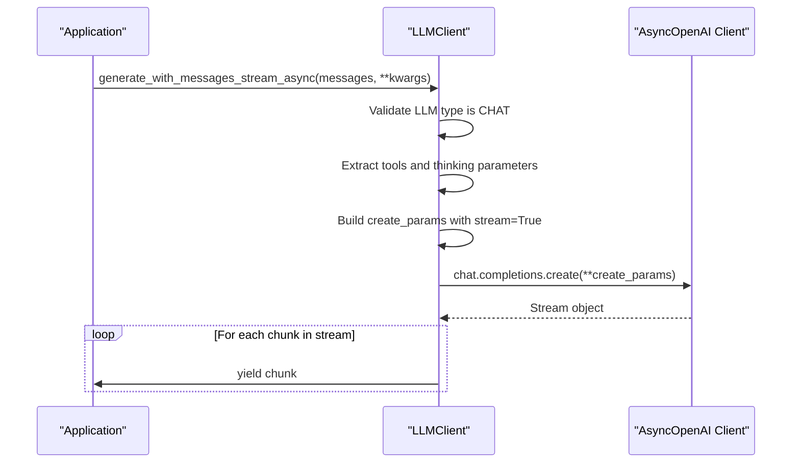
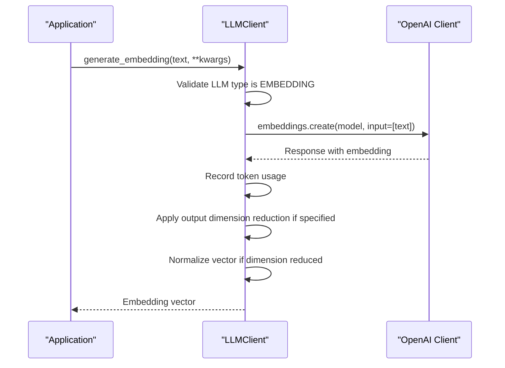
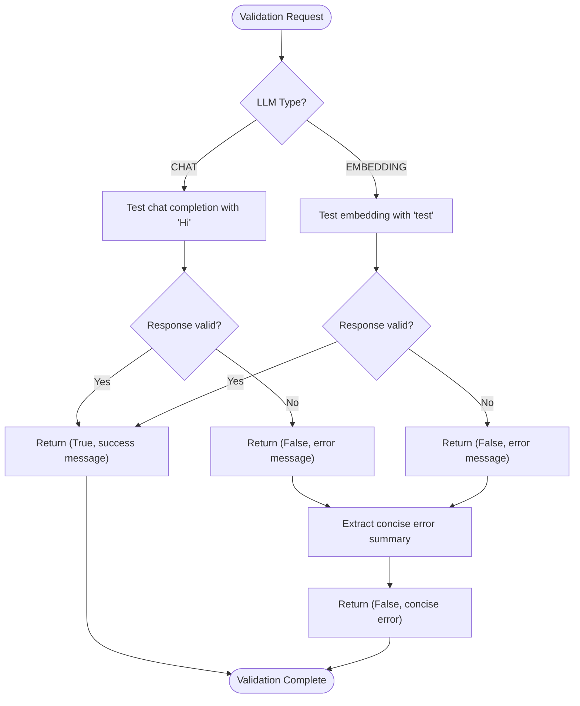
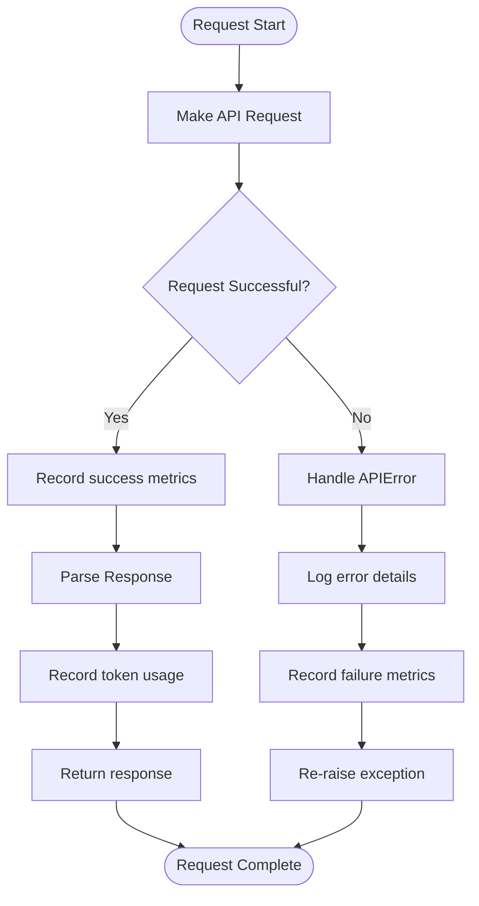
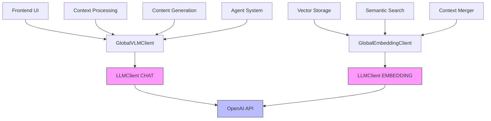

# LLM Client

<cite>
**Referenced Files in This Document**   
- [llm_client.py](file://opencontext/llm/llm_client.py)
- [global_embedding_client.py](file://opencontext/llm/global_embedding_client.py)
- [global_vlm_client.py](file://opencontext/llm/global_vlm_client.py)
- [context.py](file://opencontext/models/context.py)
- [config.yaml](file://config/config.yaml)
- [global_config.py](file://opencontext/config/global_config.py)
</cite>

## Table of Contents
1. [Introduction](#introduction)
2. [LLM Client Architecture](#llm-client-architecture)
3. [Initialization and Configuration](#initialization-and-configuration)
4. [Chat Completion Methods](#chat-completion-methods)
5. [Streaming Capabilities](#streaming-capabilities)
6. [Embedding Generation](#embedding-generation)
7. [Validation System](#validation-system)
8. [Error Handling and Performance Monitoring](#error-handling-and-performance-monitoring)
9. [Integration with Other Components](#integration-with-other-components)
10. [Configuration Examples](#configuration-examples)

## Introduction

The LLMClient class serves as the primary interface for all Large Language Model (LLM) interactions within the MineContext application. This client provides a unified interface for both chat completions and embedding generation, supporting multiple LLM providers including OpenAI and Volcengine/Doubao. The implementation follows a modular design that separates concerns between different LLM types (CHAT and EMBEDDING) while maintaining a consistent API for consumers.

The client is designed to handle both synchronous and asynchronous operations, enabling real-time streaming responses for interactive applications while also supporting batch processing workflows. It integrates with the application's monitoring system to track token usage and performance metrics, and includes comprehensive error handling and validation capabilities to ensure reliable operation.

This documentation provides a detailed analysis of the LLM client implementation, covering its architecture, configuration, core functionality, and integration patterns within the MineContext ecosystem.

**Section sources**
- [llm_client.py](file://opencontext/llm/llm_client.py#L1-L466)

## LLM Client Architecture

The LLM client architecture is built around a modular design that separates different LLM functionalities while providing a consistent interface. The core component is the LLMClient class, which serves as the primary interface for all LLM interactions. This class is complemented by specialized singleton wrappers that provide global access to specific LLM capabilities.



**Diagram sources **
- [llm_client.py](file://opencontext/llm/llm_client.py#L22-L346)
- [global_embedding_client.py](file://opencontext/llm/global_embedding_client.py#L23-L139)
- [global_vlm_client.py](file://opencontext/llm/global_vlm_client.py#L27-L317)

**Section sources**
- [llm_client.py](file://opencontext/llm/llm_client.py#L1-L466)
- [global_embedding_client.py](file://opencontext/llm/global_embedding_client.py#L1-L139)
- [global_vlm_client.py](file://opencontext/llm/global_vlm_client.py#L1-L317)

## Initialization and Configuration

The LLMClient class is initialized with an LLM type (CHAT or EMBEDDING) and a configuration dictionary containing essential parameters for connecting to the LLM provider. The initialization process validates that required configuration values are present before creating the underlying OpenAI client instances.



The configuration dictionary must include the following key parameters:
- **api_key**: Authentication key for the LLM provider
- **base_url**: Base URL for the LLM API endpoint
- **model**: Specific model identifier to use
- **provider**: LLM provider (OpenAI or Doubao)
- **timeout**: Request timeout in seconds (defaults to 300)

The client supports both OpenAI and Volcengine/Doubao providers through the LLMProvider enum, allowing the application to switch between different LLM services. The provider configuration is used to customize API requests, particularly for Doubao-specific features like thinking parameters.

Configuration values are typically loaded from the application's config.yaml file through the GlobalConfig system, which manages application-wide settings and provides convenience methods for accessing configuration values.

**Section sources**
- [llm_client.py](file://opencontext/llm/llm_client.py#L32-L46)
- [config.yaml](file://config/config.yaml#L26-L38)
- [global_config.py](file://opencontext/config/global_config.py#L23-L331)

## Chat Completion Methods

The LLMClient provides multiple methods for generating chat completions, supporting both simple prompts and complex message sequences. The primary methods for chat completion are generate_with_messages and its asynchronous counterpart generate_with_messages_async.



The chat completion methods support several advanced features:
- **Tools integration**: The client can pass tool definitions to the LLM, enabling function calling capabilities
- **Thinking parameters**: For Doubao models, thinking parameters can be included in the request to control reasoning behavior
- **Token usage monitoring**: The client automatically records token usage metrics for cost tracking and optimization
- **Performance measurement**: Request timing is recorded to monitor API performance

The generate method provides a simplified interface for single-prompt interactions by wrapping the generate_with_messages method with a basic user message structure. This allows applications to use a simple string prompt while still benefiting from the full chat completion functionality.

**Section sources**
- [llm_client.py](file://opencontext/llm/llm_client.py#L48-L192)

## Streaming Capabilities

The LLM client supports real-time streaming of responses through dedicated streaming methods that enable interactive applications to display content as it is generated. This is particularly valuable for chat interfaces where users expect to see responses appear progressively rather than waiting for complete responses.



The streaming implementation provides both synchronous and asynchronous methods:
- **generate_with_messages_stream**: Returns a stream object for synchronous iteration
- **generate_with_messages_stream_async**: Returns an async generator for asynchronous iteration

These methods handle the complexity of streaming responses while providing a simple interface for consumers. The streaming functionality is used by the frontend's AI assistant components to provide real-time response display, enhancing the user experience by reducing perceived latency.

The streaming methods maintain the same parameter interface as their non-streaming counterparts, ensuring consistency across the API and making it easy to switch between streaming and non-streaming modes based on application requirements.

**Section sources**
- [llm_client.py](file://opencontext/llm/llm_client.py#L64-L261)

## Embedding Generation

The LLM client provides comprehensive support for embedding generation through the generate_embedding and generate_embedding_async methods. These methods convert text content into vector representations that can be used for semantic search, clustering, and other machine learning applications.



The embedding generation process includes several important features:
- **Output dimension control**: The client can reduce the dimensionality of embeddings based on configuration or parameter settings
- **Vector normalization**: When dimensionality is reduced, the resulting vector is normalized to maintain consistent magnitude
- **Token usage tracking**: Embedding requests are monitored for cost and performance analysis
- **Error handling**: Comprehensive error handling ensures reliable operation even when API requests fail

The client also provides higher-level methods through the GlobalEmbeddingClient singleton:
- **do_embedding**: Convenience method for generating embeddings
- **do_vectorize**: Method for vectorizing Vectorize objects
- **do_vectorize_async**: Asynchronous version of do_vectorize

These methods abstract away the need to manage LLM client instances directly, providing a simpler interface for common embedding operations.

**Section sources**
- [llm_client.py](file://opencontext/llm/llm_client.py#L78-L342)
- [global_embedding_client.py](file://opencontext/llm/global_embedding_client.py#L107-L138)

## Validation System

The LLM client includes a comprehensive validation system that tests LLM configuration by making simple API calls to verify connectivity and functionality. The validate method performs provider-specific checks and returns a tuple indicating success status and a descriptive message.



The validation process includes sophisticated error handling that extracts concise error summaries from potentially verbose API error messages. For Volcengine/Doubao errors, specific error codes are mapped to user-friendly messages:

- **AccessDenied**: "Access denied. Please ensure the model is enabled in the Volcengine console."
- **QuotaExceeded**: "Quota exceeded. Please check your Volcengine account balance."
- **RateLimitExceeded**: "Rate limit exceeded."
- **InternalServiceError**: "Volcengine internal service error."

For OpenAI errors, common issues are similarly translated:
- **insufficient_quota**: "Insufficient quota. Check your plan and billing details."
- **invalid_api_key**: "Invalid API key provided."
- **model_not_found**: "The model does not exist or you do not have access to it."

This validation system is used in the application's settings interface to test LLM connections before saving configuration, providing immediate feedback to users about configuration issues.

**Section sources**
- [llm_client.py](file://opencontext/llm/llm_client.py#L344-L465)
- [settings.py](file://opencontext/server/routes/settings.py#L123-L272)

## Error Handling and Performance Monitoring

The LLM client implements comprehensive error handling and performance monitoring to ensure reliable operation and provide insights into API usage patterns. The error handling strategy focuses on graceful degradation and informative error reporting, while performance monitoring tracks key metrics for optimization and cost management.



Key aspects of the error handling system include:
- **Specific exception handling**: APIError exceptions are caught and logged with detailed context
- **Graceful degradation**: Failed requests are recorded but do not crash the application
- **Informative logging**: Errors are logged with sufficient detail for debugging
- **Failure recording**: Performance metrics are recorded for failed requests to identify patterns

Performance monitoring is integrated throughout the client:
- **Request timing**: The time for each API request is measured and recorded
- **Token usage**: Prompt, completion, and total tokens are tracked for cost analysis
- **Processing stages**: Different stages of request processing are timed separately

These metrics are stored in the application's monitoring database and can be viewed in the web interface's monitoring section, allowing users to track their LLM usage patterns and optimize their workflows.

**Section sources**
- [llm_client.py](file://opencontext/llm/llm_client.py#L90-L201)
- [monitor.py](file://opencontext/monitoring/monitor.py#L133-L775)

## Integration with Other Components

The LLM client is integrated with various components throughout the MineContext application, serving as the primary interface for all LLM interactions. The most significant integrations are through the GlobalVLMClient and GlobalEmbeddingClient singletons, which provide specialized access to vision-language and embedding capabilities.



The GlobalVLMClient is used extensively in context processing components, particularly the ScreenshotProcessor, which uses vision-language models to extract information from screenshots. The agent system also relies on the GlobalVLMClient for decision-making and tool execution, with the generate_with_messages method supporting tool calling and iterative reasoning.

The GlobalEmbeddingClient is integrated with the storage system, where embeddings are generated for context items before being stored in the vector database. This enables semantic search capabilities and context similarity analysis. The context merger also uses embeddings to identify related context items for intelligent merging.

These integrations demonstrate how the LLM client serves as a foundational component that enables advanced AI capabilities across the application, from content extraction to intelligent organization and retrieval.

**Section sources**
- [global_vlm_client.py](file://opencontext/llm/global_vlm_client.py#L1-L317)
- [global_embedding_client.py](file://opencontext/llm/global_embedding_client.py#L1-L139)
- [screenshot_processor.py](file://opencontext/context_processing/processor/screenshot_processor.py#L292-L374)

## Configuration Examples

The LLM client is configured through the application's config.yaml file, which defines settings for both the vision-language model (VLM) and embedding model. The configuration supports environment variable substitution, allowing sensitive information like API keys to be managed securely.

Example configuration from config.yaml:
```yaml
vlm_model:
  base_url: "${LLM_BASE_URL}"
  api_key: "${LLM_API_KEY}"
  model: "${LLM_MODEL}"
  provider: ""

embedding_model:
  base_url: "${EMBEDDING_BASE_URL}"
  api_key: "${EMBEDDING_API_KEY}"
  model: "${EMBEDDING_MODEL}"
  provider: ""
  output_dim: 2048
```

The application also supports direct configuration through the frontend settings interface, where users can input their API keys and select models. When saving settings, the application validates both the VLM and embedding configurations using the LLMClient's validate method before storing the configuration.

For Doubao models, the recommended configuration includes:
- **VLM model**: doubao-seed-1-6-flash-250828
- **Embedding model**: doubao-embedding-large-text-240915
- **Base URL**: https://ark.cn-beijing.volces.com/api/v3

For OpenAI models, the configuration would use:
- **VLM model**: gpt-4-vision-preview or similar
- **Embedding model**: text-embedding-3-large
- **Base URL**: https://api.openai.com/v1

This flexible configuration system allows users to choose between different LLM providers and models based on their needs, budget, and performance requirements.

**Section sources**
- [config.yaml](file://config/config.yaml#L26-L38)
- [global_config.py](file://opencontext/config/global_config.py#L23-L331)
- [README.md](file://README.md#L118-L146)