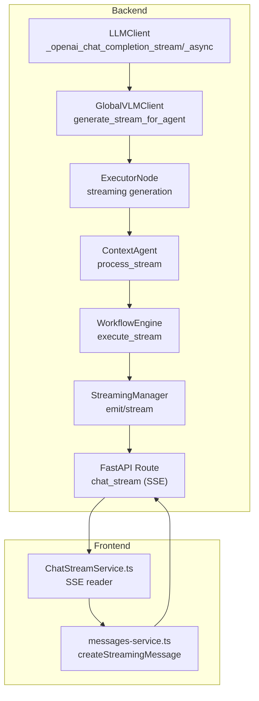
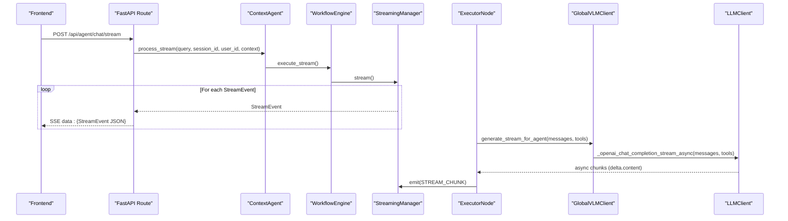
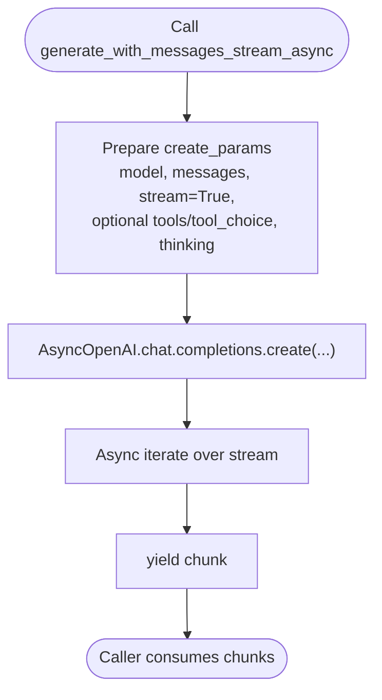
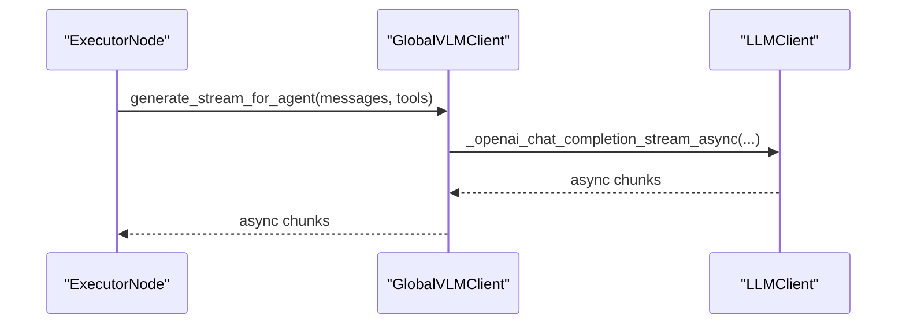
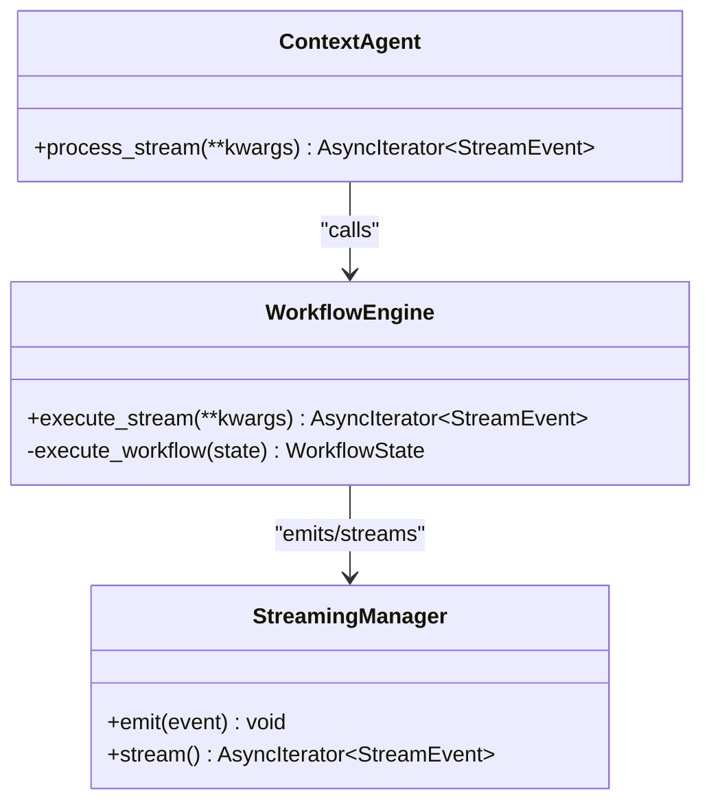
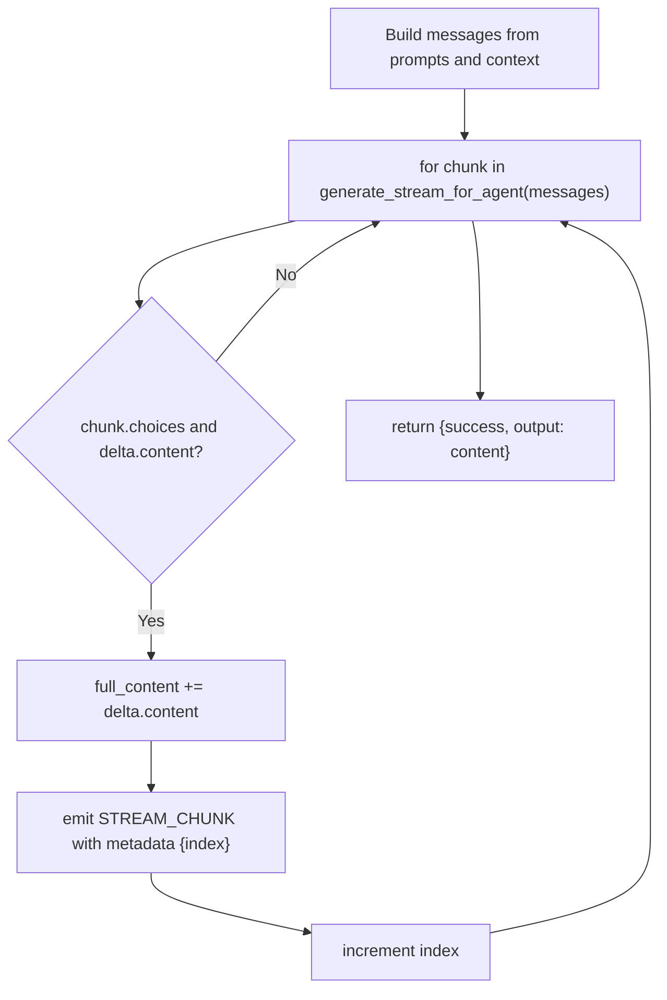
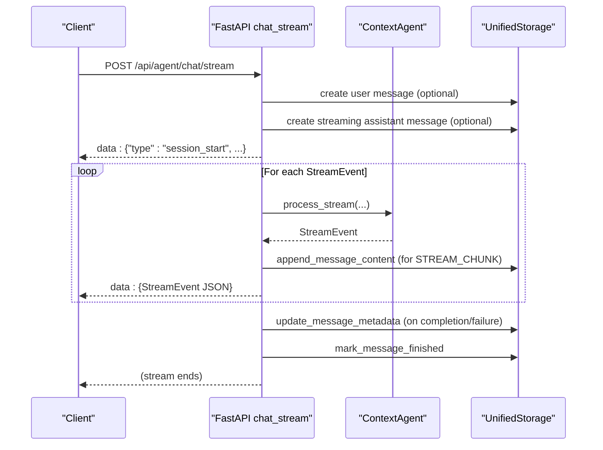
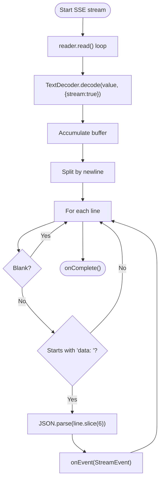
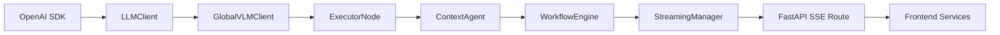

# Streaming Interface

<cite>
**Referenced Files in This Document**
- [llm_client.py](file://opencontext/llm/llm_client.py)
- [global_vlm_client.py](file://opencontext/llm/global_vlm_client.py)
- [agent.py](file://opencontext/context_consumption/context_agent/agent.py)
- [workflow.py](file://opencontext/context_consumption/context_agent/core/workflow.py)
- [streaming.py](file://opencontext/context_consumption/context_agent/core/streaming.py)
- [executor.py](file://opencontext/context_consumption/context_agent/nodes/executor.py)
- [events.py](file://opencontext/context_consumption/context_agent/models/events.py)
- [agent_chat.py](file://opencontext/server/routes/agent_chat.py)
- [messages-service.ts](file://frontend/src/renderer/src/services/messages-service.ts)
- [ChatStreamService.ts](file://frontend/src/renderer/src/services/ChatStreamService.ts)
</cite>

## Table of Contents
1. [Introduction](#introduction)
2. [Project Structure](#project-structure)
3. [Core Components](#core-components)
4. [Architecture Overview](#architecture-overview)
5. [Detailed Component Analysis](#detailed-component-analysis)
6. [Dependency Analysis](#dependency-analysis)
7. [Performance Considerations](#performance-considerations)
8. [Troubleshooting Guide](#troubleshooting-guide)
9. [Conclusion](#conclusion)

## Introduction
This document explains the streaming capabilities of the LLM client and agent system. It focuses on:
- Real-time streaming responses via generate_with_messages_stream and generate_with_messages_stream_async
- Internal streaming implementations: _openai_chat_completion_stream and _openai_chat_completion_stream_async
- Agent-specific streaming via generate_stream_for_agent
- End-to-end streaming from server-side SSE to frontend rendering
- Error handling and performance considerations for partial responses in user interfaces

## Project Structure
The streaming pipeline spans Python backend modules and a React frontend service:
- Backend LLM client and agent orchestration
- Server route that emits Server-Sent Events (SSE)
- Frontend services that consume SSE and render partial content

**Diagram sources**
- [llm_client.py](file://opencontext/llm/llm_client.py#L64-L76)
- [llm_client.py](file://opencontext/llm/llm_client.py#L203-L262)
- [global_vlm_client.py](file://opencontext/llm/global_vlm_client.py#L251-L259)
- [agent.py](file://opencontext/context_consumption/context_agent/agent.py#L46-L49)
- [workflow.py](file://opencontext/context_consumption/context_agent/core/workflow.py#L113-L124)
- [streaming.py](file://opencontext/context_consumption/context_agent/core/streaming.py#L16-L46)
- [executor.py](file://opencontext/context_consumption/context_agent/nodes/executor.py#L120-L161)
- [agent_chat.py](file://opencontext/server/routes/agent_chat.py#L118-L290)
- [messages-service.ts](file://frontend/src/renderer/src/services/messages-service.ts#L92-L100)
- [ChatStreamService.ts](file://frontend/src/renderer/src/services/ChatStreamService.ts#L127-L174)

**Section sources**
- [llm_client.py](file://opencontext/llm/llm_client.py#L64-L76)
- [global_vlm_client.py](file://opencontext/llm/global_vlm_client.py#L251-L259)
- [agent_chat.py](file://opencontext/server/routes/agent_chat.py#L118-L290)

## Core Components
- LLMClient.generate_with_messages_stream and generate_with_messages_stream_async
  - Provide synchronous and asynchronous streaming wrappers around OpenAI chat completion with stream=True.
- LLMClient._openai_chat_completion_stream and _openai_chat_completion_stream_async
  - Configure OpenAI client with stream=True and return a stream object or yield chunks from an async iterator.
- GlobalVLMClient.generate_stream_for_agent
  - Exposes agent-specific streaming by delegating to the underlying LLM client’s async streaming implementation.
- ContextAgent and WorkflowEngine
  - Orchestrates streaming events and yields StreamEvent items consumed by the SSE route.
- StreamingManager
  - Manages an async queue of StreamEvent items and streams them to consumers.
- ExecutorNode
  - Uses generate_stream_for_agent to stream LLM chunks and emits STREAM_CHUNK events.
- Server-side SSE route
  - Emits JSON-encoded StreamEvent items over text/event-stream, with optional assistant message persistence.
- Frontend services
  - messages-service.ts creates streaming assistant placeholders
  - ChatStreamService.ts reads SSE, decodes chunks, parses JSON lines, and invokes callbacks

**Section sources**
- [llm_client.py](file://opencontext/llm/llm_client.py#L64-L76)
- [llm_client.py](file://opencontext/llm/llm_client.py#L203-L262)
- [global_vlm_client.py](file://opencontext/llm/global_vlm_client.py#L251-L259)
- [agent.py](file://opencontext/context_consumption/context_agent/agent.py#L46-L49)
- [workflow.py](file://opencontext/context_consumption/context_agent/core/workflow.py#L113-L124)
- [streaming.py](file://opencontext/context_consumption/context_agent/core/streaming.py#L16-L46)
- [executor.py](file://opencontext/context_consumption/context_agent/nodes/executor.py#L120-L161)
- [agent_chat.py](file://opencontext/server/routes/agent_chat.py#L118-L290)
- [messages-service.ts](file://frontend/src/renderer/src/services/messages-service.ts#L92-L100)
- [ChatStreamService.ts](file://frontend/src/renderer/src/services/ChatStreamService.ts#L127-L174)

## Architecture Overview
The streaming architecture follows a layered flow:
- LLM layer: LLMClient wraps OpenAI chat completions with streaming support.
- Agent layer: GlobalVLMClient exposes agent-friendly streaming for tool-aware responses.
- Workflow layer: ContextAgent and WorkflowEngine orchestrate stages and emit structured StreamEvent items.
- Transport layer: FastAPI SSE route streams JSON-encoded events to clients.
- Presentation layer: Frontend services decode SSE, update UI with partial content, and manage interruptions.

**Diagram sources**
- [agent_chat.py](file://opencontext/server/routes/agent_chat.py#L118-L290)
- [agent.py](file://opencontext/context_consumption/context_agent/agent.py#L46-L49)
- [workflow.py](file://opencontext/context_consumption/context_agent/core/workflow.py#L113-L124)
- [streaming.py](file://opencontext/context_consumption/context_agent/core/streaming.py#L16-L46)
- [executor.py](file://opencontext/context_consumption/context_agent/nodes/executor.py#L120-L161)
- [global_vlm_client.py](file://opencontext/llm/global_vlm_client.py#L251-L259)
- [llm_client.py](file://opencontext/llm/llm_client.py#L228-L262)

## Detailed Component Analysis

### LLMClient Streaming Methods
- generate_with_messages_stream
  - Calls _openai_chat_completion_stream with stream=True and returns the stream object directly.
- generate_with_messages_stream_async
  - Calls _openai_chat_completion_stream_async with stream=True and yields chunks from the async iterator.
- _openai_chat_completion_stream
  - Prepares create_params with model, messages, stream=True, optional tools/tool_choice, and provider-specific extra_body for thinking.
  - Invokes client.chat.completions.create and returns the stream.
- _openai_chat_completion_stream_async
  - Creates an AsyncOpenAI client, prepares the same create_params, calls chat.completions.create, and yields each chunk from the async stream.

**Diagram sources**
- [llm_client.py](file://opencontext/llm/llm_client.py#L64-L76)
- [llm_client.py](file://opencontext/llm/llm_client.py#L203-L262)

**Section sources**
- [llm_client.py](file://opencontext/llm/llm_client.py#L64-L76)
- [llm_client.py](file://opencontext/llm/llm_client.py#L203-L262)

### GlobalVLMClient Agent Streaming
- generate_stream_for_agent
  - Delegates to the underlying LLM client’s async streaming implementation and yields chunks unchanged.

**Diagram sources**
- [global_vlm_client.py](file://opencontext/llm/global_vlm_client.py#L251-L259)
- [llm_client.py](file://opencontext/llm/llm_client.py#L228-L262)

**Section sources**
- [global_vlm_client.py](file://opencontext/llm/global_vlm_client.py#L251-L259)

### Agent Streaming Orchestration
- ContextAgent.process_stream
  - Delegates to WorkflowEngine.execute_stream, which runs the workflow and streams StreamEvent items.
- WorkflowEngine.execute_stream
  - Runs execute with streaming=True and streams events from StreamingManager.stream().
- StreamingManager
  - Provides emit and stream methods backed by an asyncio.Queue to enqueue and yield events.

**Diagram sources**
- [agent.py](file://opencontext/context_consumption/context_agent/agent.py#L46-L49)
- [workflow.py](file://opencontext/context_consumption/context_agent/core/workflow.py#L113-L124)
- [streaming.py](file://opencontext/context_consumption/context_agent/core/streaming.py#L16-L46)

**Section sources**
- [agent.py](file://opencontext/context_consumption/context_agent/agent.py#L46-L49)
- [workflow.py](file://opencontext/context_consumption/context_agent/core/workflow.py#L113-L124)
- [streaming.py](file://opencontext/context_consumption/context_agent/core/streaming.py#L16-L46)

### ExecutorNode Streaming Generation
- ExecutorNode._execute_generate/_execute_edit/_execute_answer
  - Build messages from prompts and context.
  - Iterate over generate_stream_for_agent(messages) and, for each chunk with delta.content, append to full_content and emit STREAM_CHUNK events with metadata including index.

**Diagram sources**
- [executor.py](file://opencontext/context_consumption/context_agent/nodes/executor.py#L120-L161)
- [executor.py](file://opencontext/context_consumption/context_agent/nodes/executor.py#L183-L203)
- [executor.py](file://opencontext/context_consumption/context_agent/nodes/executor.py#L236-L276)
- [global_vlm_client.py](file://opencontext/llm/global_vlm_client.py#L251-L259)

**Section sources**
- [executor.py](file://opencontext/context_consumption/context_agent/nodes/executor.py#L120-L161)
- [executor.py](file://opencontext/context_consumption/context_agent/nodes/executor.py#L183-L203)
- [executor.py](file://opencontext/context_consumption/context_agent/nodes/executor.py#L236-L276)

### Server-Side SSE Streaming
- Route chat_stream
  - Optionally persists user and assistant messages.
  - Emits a session_start event with session_id and assistant_message_id.
  - Iterates agent.process_stream and yields each StreamEvent as JSON lines prefixed with data:.
  - On completion or failure, updates assistant message metadata and marks it finished.
  - Supports interruption via an in-memory flag keyed by assistant_message_id.

**Diagram sources**
- [agent_chat.py](file://opencontext/server/routes/agent_chat.py#L118-L290)

**Section sources**
- [agent_chat.py](file://opencontext/server/routes/agent_chat.py#L118-L290)

### Frontend Streaming Consumption
- messages-service.ts
  - createStreamingMessage posts to /message/stream/{mid}/create to reserve a streaming assistant message placeholder.
- ChatStreamService.ts
  - Reads SSE via a Reader, decodes chunks with TextDecoder, splits lines by newline, ignores blank lines, strips "data: " prefix, parses JSON, and calls onEvent with the parsed StreamEvent.
  - Handles AbortError for cancellation and onError for other failures.
  - Provides abortStream to cancel the underlying fetch controller.

**Diagram sources**
- [ChatStreamService.ts](file://frontend/src/renderer/src/services/ChatStreamService.ts#L127-L174)

**Section sources**
- [messages-service.ts](file://frontend/src/renderer/src/services/messages-service.ts#L92-L100)
- [ChatStreamService.ts](file://frontend/src/renderer/src/services/ChatStreamService.ts#L127-L174)

## Dependency Analysis
- LLMClient depends on OpenAI SDK for sync and async streaming.
- GlobalVLMClient composes LLMClient and exposes agent-friendly streaming.
- ExecutorNode depends on GlobalVLMClient for streaming generation.
- ContextAgent and WorkflowEngine depend on StreamingManager for event emission and streaming.
- Server route depends on ContextAgent and UnifiedStorage to persist messages and metadata.
- Frontend services depend on SSE decoding and DOM updates.

**Diagram sources**
- [llm_client.py](file://opencontext/llm/llm_client.py#L203-L262)
- [global_vlm_client.py](file://opencontext/llm/global_vlm_client.py#L251-L259)
- [executor.py](file://opencontext/context_consumption/context_agent/nodes/executor.py#L120-L161)
- [agent.py](file://opencontext/context_consumption/context_agent/agent.py#L46-L49)
- [workflow.py](file://opencontext/context_consumption/context_agent/core/workflow.py#L113-L124)
- [streaming.py](file://opencontext/context_consumption/context_agent/core/streaming.py#L16-L46)
- [agent_chat.py](file://opencontext/server/routes/agent_chat.py#L118-L290)

**Section sources**
- [llm_client.py](file://opencontext/llm/llm_client.py#L203-L262)
- [global_vlm_client.py](file://opencontext/llm/global_vlm_client.py#L251-L259)
- [executor.py](file://opencontext/context_consumption/context_agent/nodes/executor.py#L120-L161)
- [agent_chat.py](file://opencontext/server/routes/agent_chat.py#L118-L290)

## Performance Considerations
- Chunk delivery latency
  - The LLM client streams deltas directly from the OpenAI API. The agent emits STREAM_CHUNK events immediately upon receiving delta.content, enabling near-real-time UI updates.
- Backpressure and buffering
  - StreamingManager uses an asyncio.Queue with a fixed maxsize. If the consumer falls behind, events may be dropped or delayed. Consider tuning maxsize or batching events in the UI.
- Token accounting
  - The LLM client records token usage on non-streaming calls. For streaming, token accounting is not performed in the client; however, the server route can approximate token counts when appending message content.
- Network reliability
  - SSE decoding in the frontend handles AbortError for cancellations and logs other errors. Ensure UI surfaces interruption and allows resuming or retrying.
- UI rendering
  - Accumulate partial content incrementally and avoid excessive re-renders by debouncing or batching DOM updates.

[No sources needed since this section provides general guidance]

## Troubleshooting Guide
- API errors during streaming
  - LLMClient catches APIError and logs the error. The server route converts exceptions to SSE error events and marks the assistant message as failed.
- Interruption handling
  - The server maintains an in-memory active_streams map keyed by assistant_message_id. If interrupted, the route emits an interrupted event and stops streaming.
- Frontend decoding issues
  - ChatStreamService.ts logs and warns on malformed SSE lines and handles AbortError specifically. Verify that the server sends valid JSON lines prefixed with data: and separated by newlines.
- Partial content persistence
  - For STREAM_CHUNK events, the server appends content to the assistant message and updates metadata on completion/failure. If interrupted, it persists accumulated content and marks the message as cancelled.

**Section sources**
- [llm_client.py](file://opencontext/llm/llm_client.py#L224-L227)
- [llm_client.py](file://opencontext/llm/llm_client.py#L259-L261)
- [agent_chat.py](file://opencontext/server/routes/agent_chat.py#L180-L187)
- [agent_chat.py](file://opencontext/server/routes/agent_chat.py#L247-L259)
- [ChatStreamService.ts](file://frontend/src/renderer/src/services/ChatStreamService.ts#L127-L174)

## Conclusion
The streaming interface integrates LLM streaming at the client level, agent orchestration, and server-side SSE transport to deliver real-time, incremental responses to users. The design cleanly separates concerns:
- LLMClient handles OpenAI streaming configuration
- GlobalVLMClient exposes agent-friendly streaming
- ContextAgent and WorkflowEngine emit structured events
- Server route streams events and persists partial content
- Frontend services decode SSE and render partial responses with interruption support

This architecture enables responsive UIs, robust error handling, and extensible event-driven workflows.