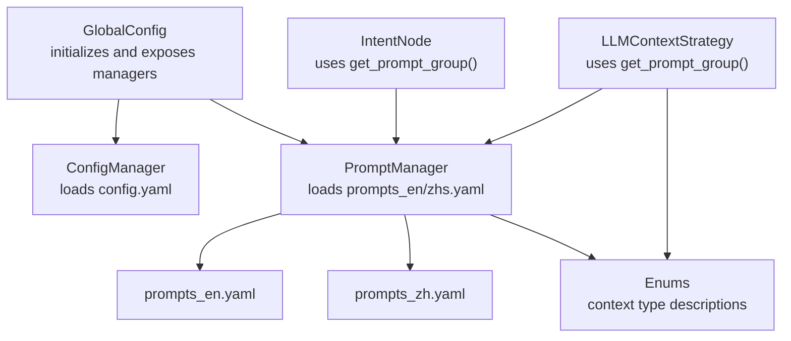
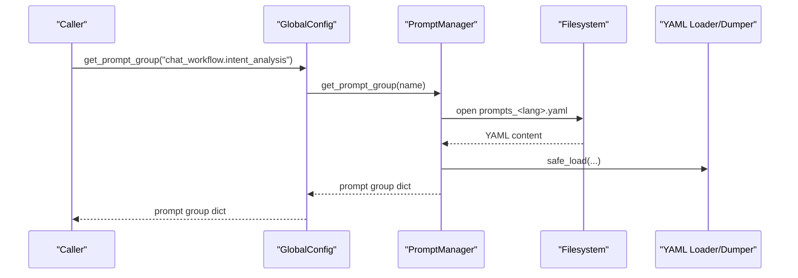
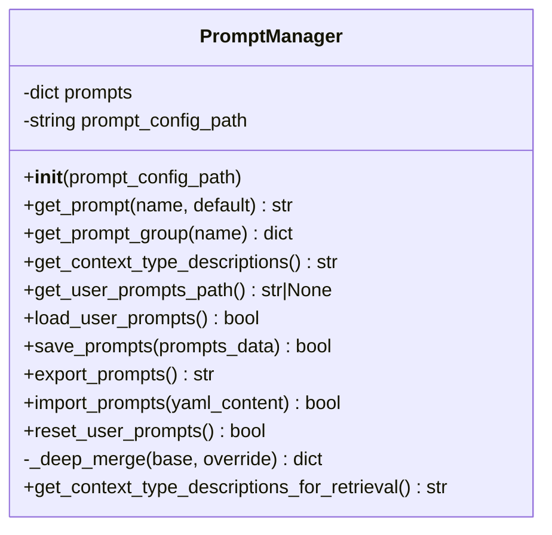
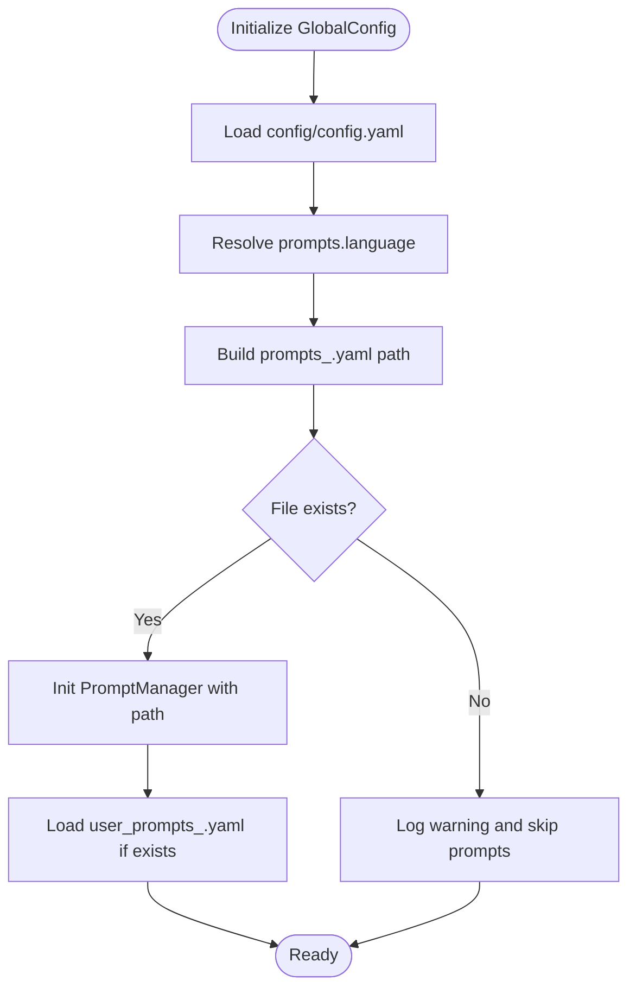
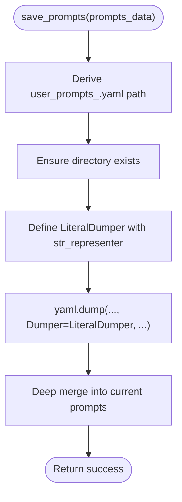
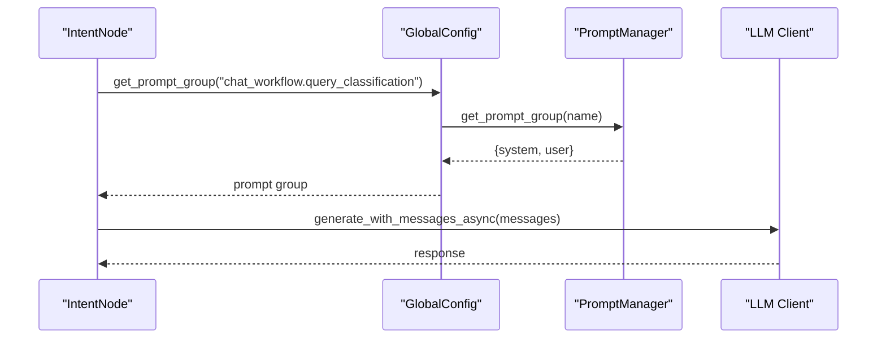
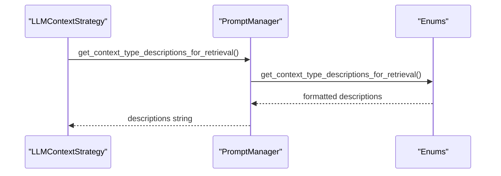
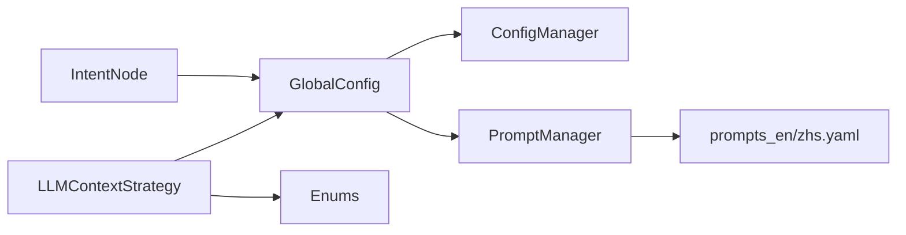

# Prompt Management

<cite>
**Referenced Files in This Document**
- [prompt_manager.py](file://opencontext/config/prompt_manager.py)
- [global_config.py](file://opencontext/config/global_config.py)
- [config_manager.py](file://opencontext/config/config_manager.py)
- [enums.py](file://opencontext/models/enums.py)
- [prompts_en.yaml](file://config/prompts_en.yaml)
- [prompts_zh.yaml](file://config/prompts_zh.yaml)
- [intent.py](file://opencontext/context_consumption/context_agent/nodes/intent.py)
- [llm_context_strategy.py](file://opencontext/context_consumption/context_agent/core/llm_context_strategy.py)
</cite>

## Table of Contents
1. [Introduction](#introduction)
2. [Project Structure](#project-structure)
3. [Core Components](#core-components)
4. [Architecture Overview](#architecture-overview)
5. [Detailed Component Analysis](#detailed-component-analysis)
6. [Dependency Analysis](#dependency-analysis)
7. [Performance Considerations](#performance-considerations)
8. [Troubleshooting Guide](#troubleshooting-guide)
9. [Conclusion](#conclusion)

## Introduction
This document explains MineContext’s prompt management system, focusing on how the PromptManager class loads and manages prompts from YAML configuration files, supports multiple languages, and integrates with the global configuration system. It covers initialization, retrieval of individual prompts and prompt groups, user customization workflows, deep merging strategy, YAML formatting with a custom literal style, hierarchical prompt organization, and integration with context type descriptions used across AI operations.

## Project Structure
The prompt management system spans three layers:
- Configuration layer: GlobalConfig initializes and exposes PromptManager and ConfigManager.
- Prompt layer: PromptManager loads YAML prompts, retrieves prompts by dot-notation, and manages user overrides.
- Domain layer: Nodes and strategies consume prompts for intent analysis, context collection, and execution.

**Diagram sources**
- [global_config.py](file://opencontext/config/global_config.py#L107-L146)
- [prompt_manager.py](file://opencontext/config/prompt_manager.py#L17-L37)
- [prompts_en.yaml](file://config/prompts_en.yaml#L1-L60)
- [prompts_zh.yaml](file://config/prompts_zh.yaml#L1-L60)
- [enums.py](file://opencontext/models/enums.py#L293-L304)
- [intent.py](file://opencontext/context_consumption/context_agent/nodes/intent.py#L72-L98)
- [llm_context_strategy.py](file://opencontext/context_consumption/context_agent/core/llm_context_strategy.py#L136-L174)

**Section sources**
- [global_config.py](file://opencontext/config/global_config.py#L107-L146)
- [prompt_manager.py](file://opencontext/config/prompt_manager.py#L17-L37)
- [prompts_en.yaml](file://config/prompts_en.yaml#L1-L60)
- [prompts_zh.yaml](file://config/prompts_zh.yaml#L1-L60)
- [enums.py](file://opencontext/models/enums.py#L293-L304)

## Core Components
- PromptManager: Loads YAML prompts, retrieves prompts by hierarchical dot notation, retrieves prompt groups, and manages user customizations with deep merge and YAML export/import.
- GlobalConfig: Singleton that initializes PromptManager and ConfigManager, resolves language-specific prompt files, and exposes convenience getters for prompts and configuration.
- Enums: Provide context type descriptions used in prompts and workflows.

Key responsibilities:
- Initialization: Load base prompts from prompts_en.yaml or prompts_zh.yaml depending on configuration.
- Retrieval: get_prompt(name) for single prompts and get_prompt_group(name) for prompt sets.
- User customization: load_user_prompts(), save_prompts(), import_prompts(), export_prompts(), reset_user_prompts().
- Deep merge: _deep_merge(base, override) preserves structure and overrides leaf values.
- YAML formatting: LiteralDumper uses '|' literal style for multi-line strings and plain style for short strings.

**Section sources**
- [prompt_manager.py](file://opencontext/config/prompt_manager.py#L17-L37)
- [prompt_manager.py](file://opencontext/config/prompt_manager.py#L99-L149)
- [prompt_manager.py](file://opencontext/config/prompt_manager.py#L201-L211)
- [global_config.py](file://opencontext/config/global_config.py#L107-L146)
- [enums.py](file://opencontext/models/enums.py#L293-L304)

## Architecture Overview
The PromptManager sits behind GlobalConfig, which selects the language-specific prompt file and loads user overrides. Nodes and strategies call GlobalConfig convenience functions to retrieve prompt groups and format messages.

**Diagram sources**
- [global_config.py](file://opencontext/config/global_config.py#L263-L282)
- [prompt_manager.py](file://opencontext/config/prompt_manager.py#L39-L48)
- [prompts_en.yaml](file://config/prompts_en.yaml#L1-L60)
- [prompts_zh.yaml](file://config/prompts_zh.yaml#L1-L60)

## Detailed Component Analysis

### PromptManager
- Initialization
  - Accepts a prompt_config_path; loads YAML into memory if present; otherwise raises an error.
  - Typical usage: GlobalConfig constructs PromptManager with the absolute path to prompts_en.yaml or prompts_zh.yaml.
- Retrieval
  - get_prompt(name, default): splits dot-notation keys and traverses the nested dict; returns default if not found or if value is not a string.
  - get_prompt_group(name): similar traversal, returns empty dict if not found or if value is not a dict.
- User customization
  - get_user_prompts_path(): derives user_prompts_<lang>.yaml from the base prompts file path.
  - load_user_prompts(): safely loads user_prompts_<lang>.yaml and deep merges into base prompts.
  - save_prompts(prompts_data): writes user_prompts_<lang>.yaml using a custom LiteralDumper to preserve multi-line strings with '|' literal style.
  - import_prompts(yaml_content): parses and saves to user_prompts_<lang>.yaml.
  - export_prompts(): dumps current prompts to YAML string.
  - reset_user_prompts(): deletes user_prompts_<lang>.yaml and reloads base prompts.
- Deep merge
  - _deep_merge(base, override): recursively merges dicts; non-dict overrides replace leaf values.

**Diagram sources**
- [prompt_manager.py](file://opencontext/config/prompt_manager.py#L17-L37)
- [prompt_manager.py](file://opencontext/config/prompt_manager.py#L39-L48)
- [prompt_manager.py](file://opencontext/config/prompt_manager.py#L59-L74)
- [prompt_manager.py](file://opencontext/config/prompt_manager.py#L75-L98)
- [prompt_manager.py](file://opencontext/config/prompt_manager.py#L99-L149)
- [prompt_manager.py](file://opencontext/config/prompt_manager.py#L150-L176)
- [prompt_manager.py](file://opencontext/config/prompt_manager.py#L177-L200)
- [prompt_manager.py](file://opencontext/config/prompt_manager.py#L201-L211)

**Section sources**
- [prompt_manager.py](file://opencontext/config/prompt_manager.py#L17-L37)
- [prompt_manager.py](file://opencontext/config/prompt_manager.py#L39-L48)
- [prompt_manager.py](file://opencontext/config/prompt_manager.py#L59-L74)
- [prompt_manager.py](file://opencontext/config/prompt_manager.py#L75-L98)
- [prompt_manager.py](file://opencontext/config/prompt_manager.py#L99-L149)
- [prompt_manager.py](file://opencontext/config/prompt_manager.py#L150-L176)
- [prompt_manager.py](file://opencontext/config/prompt_manager.py#L177-L200)
- [prompt_manager.py](file://opencontext/config/prompt_manager.py#L201-L211)

### GlobalConfig and Language Resolution
- Initializes ConfigManager and PromptManager.
- Resolves prompts_<lang>.yaml from the main config’s prompts.language setting.
- Automatically loads user prompts if present.
- Exposes convenience functions get_prompt(name, default) and get_prompt_group(name).

**Diagram sources**
- [global_config.py](file://opencontext/config/global_config.py#L107-L146)
- [global_config.py](file://opencontext/config/global_config.py#L236-L282)

**Section sources**
- [global_config.py](file://opencontext/config/global_config.py#L107-L146)
- [global_config.py](file://opencontext/config/global_config.py#L236-L282)

### YAML Formatting and Literal Strings
- save_prompts() defines a custom LiteralDumper that:
  - Uses '|' literal style for multi-line strings (detected by newline or length > 80).
  - Uses plain style for short single-line strings.
- This ensures readability and preserves multi-line prompt bodies in user_prompts_<lang>.yaml.

**Diagram sources**
- [prompt_manager.py](file://opencontext/config/prompt_manager.py#L99-L149)

**Section sources**
- [prompt_manager.py](file://opencontext/config/prompt_manager.py#L99-L149)

### Hierarchical Prompt Organization and Dot Notation Access
- Prompts are organized hierarchically in YAML (e.g., chat_workflow.intent_analysis.system).
- Access via dot notation:
  - get_prompt("chat_workflow.intent_analysis.system")
  - get_prompt_group("chat_workflow.context_collection.sufficiency_evaluation")

Examples from the codebase:
- Intent classification uses dot notation to retrieve a prompt group and format messages.
- Context sufficiency evaluation similarly retrieves a prompt group and formats user content.

**Diagram sources**
- [intent.py](file://opencontext/context_consumption/context_agent/nodes/intent.py#L72-L98)
- [global_config.py](file://opencontext/config/global_config.py#L263-L282)
- [prompt_manager.py](file://opencontext/config/prompt_manager.py#L39-L48)

**Section sources**
- [intent.py](file://opencontext/context_consumption/context_agent/nodes/intent.py#L72-L98)
- [llm_context_strategy.py](file://opencontext/context_consumption/context_agent/core/llm_context_strategy.py#L136-L174)

### Integration with Context Type Descriptions
- PromptManager exposes get_context_type_descriptions() and get_context_type_descriptions_for_retrieval() by delegating to enums.
- Enums provide structured context type descriptions used in prompts and workflows:
  - get_context_type_descriptions_for_prompts(): formats descriptions for inclusion in system prompts.
  - get_context_type_descriptions_for_retrieval(): formats descriptions for retrieval scenarios.

**Diagram sources**
- [prompt_manager.py](file://opencontext/config/prompt_manager.py#L213-L220)
- [enums.py](file://opencontext/models/enums.py#L335-L358)

**Section sources**
- [prompt_manager.py](file://opencontext/config/prompt_manager.py#L50-L58)
- [prompt_manager.py](file://opencontext/config/prompt_manager.py#L213-L220)
- [enums.py](file://opencontext/models/enums.py#L293-L304)
- [enums.py](file://opencontext/models/enums.py#L335-L358)

## Dependency Analysis
- GlobalConfig depends on ConfigManager and PromptManager.
- PromptManager depends on YAML loader and filesystem.
- Nodes and strategies depend on GlobalConfig convenience functions to retrieve prompt groups.

**Diagram sources**
- [global_config.py](file://opencontext/config/global_config.py#L107-L146)
- [prompt_manager.py](file://opencontext/config/prompt_manager.py#L17-L37)
- [prompts_en.yaml](file://config/prompts_en.yaml#L1-L60)
- [prompts_zh.yaml](file://config/prompts_zh.yaml#L1-L60)
- [intent.py](file://opencontext/context_consumption/context_agent/nodes/intent.py#L72-L98)
- [llm_context_strategy.py](file://opencontext/context_consumption/context_agent/core/llm_context_strategy.py#L136-L174)
- [enums.py](file://opencontext/models/enums.py#L293-L304)

**Section sources**
- [global_config.py](file://opencontext/config/global_config.py#L107-L146)
- [prompt_manager.py](file://opencontext/config/prompt_manager.py#L17-L37)
- [prompts_en.yaml](file://config/prompts_en.yaml#L1-L60)
- [prompts_zh.yaml](file://config/prompts_zh.yaml#L1-L60)
- [intent.py](file://opencontext/context_consumption/context_agent/nodes/intent.py#L72-L98)
- [llm_context_strategy.py](file://opencontext/context_consumption/context_agent/core/llm_context_strategy.py#L136-L174)
- [enums.py](file://opencontext/models/enums.py#L293-L304)

## Performance Considerations
- YAML loading occurs once during initialization; user overrides are merged in-memory.
- Dot-notation traversal is O(k) where k is the number of path segments; negligible overhead.
- Deep merge is recursive; complexity proportional to combined dict sizes.
- LiteralDumper adds a small runtime cost for string representation; acceptable given infrequent writes.

## Troubleshooting Guide
- Prompt file not found
  - Symptom: Initialization raises an error or logs a warning.
  - Cause: prompt_config_path does not exist or is incorrect.
  - Fix: Verify the path and ensure prompts_en.yaml or prompts_zh.yaml exists in the expected directory.
- Missing prompt or group
  - Symptom: get_prompt returns default; get_prompt_group returns {}.
  - Cause: Dot notation path does not match structure.
  - Fix: Confirm the YAML hierarchy and spelling; use get_prompt_group to inspect available keys.
- User prompts not applied
  - Symptom: Changes not reflected.
  - Cause: User file not present or not deep merged.
  - Fix: Use load_user_prompts() after saving; ensure save_prompts() is called; verify user_prompts_<lang>.yaml path derived from base prompts file.
- YAML formatting issues
  - Symptom: Multi-line strings lose formatting.
  - Cause: Not using LiteralDumper when writing user prompts.
  - Fix: Use save_prompts() which applies LiteralDumper; avoid manual writes without the custom representer.

**Section sources**
- [prompt_manager.py](file://opencontext/config/prompt_manager.py#L17-L37)
- [prompt_manager.py](file://opencontext/config/prompt_manager.py#L75-L98)
- [prompt_manager.py](file://opencontext/config/prompt_manager.py#L99-L149)

## Conclusion
MineContext’s prompt management system centers on a robust PromptManager that loads language-specific YAML files, supports dot-notation retrieval, and enables user customization via deep merge and YAML export/import. GlobalConfig orchestrates initialization and exposes convenient getters, while Enums provide structured context type descriptions integrated into prompts and workflows. The system balances flexibility, readability, and reliability for AI-driven operations across intent analysis, context collection, and execution.