# Application Control IPC Channels

<cite>
**Referenced Files in This Document**   
- [ipc.ts](file://frontend/src/main/ipc.ts#L62-L279)
- [IpcChannel.ts](file://frontend/packages/shared/IpcChannel.ts#L5-L45)
- [AppService.ts](file://frontend/src/main/services/AppService.ts#L27-L81)
- [AppUpdater.ts](file://frontend/src/main/services/AppUpdater.ts#L29-L87)
- [index.ts](file://frontend/src/preload/index.ts#L18-L43)
- [AppUpdater.ts](file://frontend/src/main/services/AppUpdater.ts#L29-L87)
- [AppUpdater.ts](file://frontend/src/main/services/AppUpdater.ts#L29-L87)
- [AppUpdater.ts](file://frontend/src/main/services/AppUpdater.ts#L29-L87)
- [UpdateAvailableButton.tsx](file://frontend/src/renderer/src/components/UpdateAvailableButton/index.tsx#L1-L72)
</cite>

## Table of Contents
1. [Introduction](#introduction)
2. [Core Application Control Channels](#core-application-control-channels)
3. [Application Update Management](#application-update-management)
4. [Cache Management](#cache-management)
5. [Application Information and Relaunch](#application-information-and-relaunch)
6. [Event Flow for Update Notifications](#event-flow-for-update-notifications)
7. [Best Practices for Application Restarts and Cache Management](#best-practices-for-application-restarts-and-cache-management)
8. [Security and Performance Considerations](#security-and-performance-considerations)

## Introduction
This document provides comprehensive documentation for the application lifecycle and control IPC channels in MineContext. It details the various IPC channels used for application startup, shutdown, updates, and system integration. The focus is on channels such as App_GetCacheSize, App_ClearCache, App_SetLaunchOnBoot, App_CheckForUpdate, App_DownloadUpdate, App_QuitAndInstall, App_Reload, App_Info, App_RelaunchApp, and App_LogToMain. Each channel's direction, payload structure, return values, and usage context are specified. Additionally, practical code examples are provided to demonstrate how to initiate update checks from the renderer process and handle them in the main process. The document also covers the event flow for update notifications (UpdateAvailable, UpdateDownloaded, UpdateError) and their integration with the UI, along with best practices for handling application restarts and cache management.

## Core Application Control Channels

The MineContext application utilizes a set of IPC channels to manage its lifecycle and control various aspects of its operation. These channels facilitate communication between the main and renderer processes, enabling the application to perform essential functions such as checking for updates, managing cache, and controlling launch behavior.

**Section sources**
- [ipc.ts](file://frontend/src/main/ipc.ts#L62-L279)
- [IpcChannel.ts](file://frontend/packages/shared/IpcChannel.ts#L5-L45)

### App_SetLaunchOnBoot
This channel allows the application to control whether it launches on system boot. It is particularly useful for ensuring that the application starts automatically when the user logs into their system.

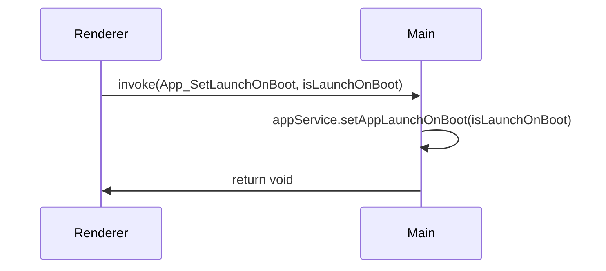

**Diagram sources**
- [ipc.ts](file://frontend/src/main/ipc.ts#L103-L105)
- [AppService.ts](file://frontend/src/main/services/AppService.ts#L27-L81)

### App_LogToMain
This channel enables the renderer process to log messages to the main process, which is crucial for centralized logging and debugging.

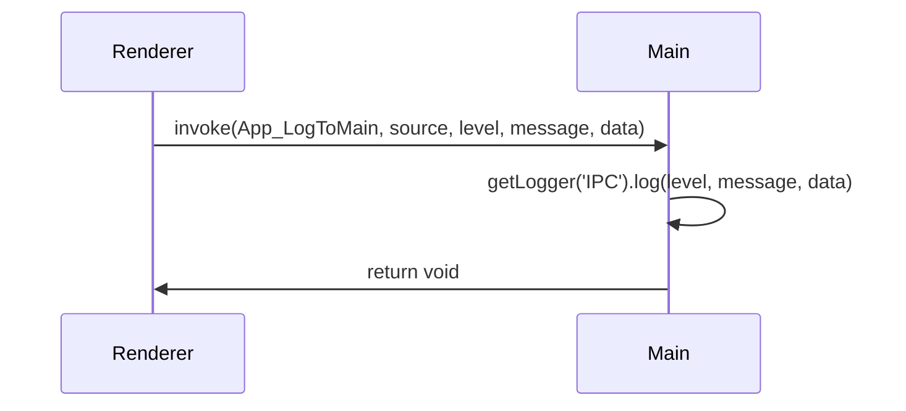

**Diagram sources**
- [ipc.ts](file://frontend/src/main/ipc.ts#L18-L19)
- [index.ts](file://frontend/src/preload/index.ts#L18-L19)

## Application Update Management

The application update management system in MineContext is designed to provide a seamless experience for users, allowing them to check for updates, download them, and install them with minimal disruption.

### App_CheckForUpdate
This channel initiates a check for available updates. It returns information about the current version and any available updates.

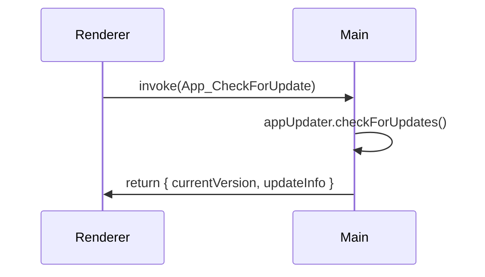

**Diagram sources**
- [ipc.ts](file://frontend/src/main/ipc.ts#L94-L96)
- [AppUpdater.ts](file://frontend/src/main/services/AppUpdater.ts#L49-L71)

### App_DownloadUpdate
This channel triggers the download of an available update. It does not wait for the download to complete but starts the process.

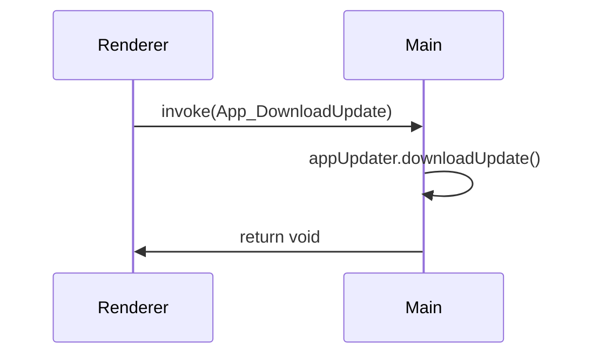

**Diagram sources**
- [ipc.ts](file://frontend/src/main/ipc.ts#L97-L98)
- [AppUpdater.ts](file://frontend/src/main/services/AppUpdater.ts#L73-L75)

### App_QuitAndInstall
This channel is used to quit the application and install the downloaded update. It ensures that the update is applied the next time the application starts.

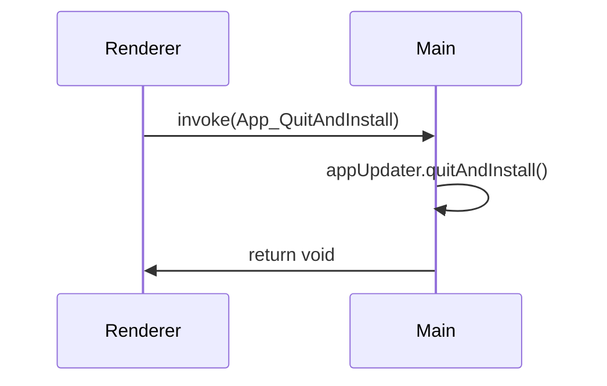

**Diagram sources**
- [ipc.ts](file://frontend/src/main/ipc.ts#L99-L100)
- [AppUpdater.ts](file://frontend/src/main/services/AppUpdater.ts#L77-L79)

### App_CancelDownload
This channel allows the user to cancel an ongoing update download, providing control over the update process.

**Diagram sources**
- [ipc.ts](file://frontend/src/main/ipc.ts#L100-L101)
- [AppUpdater.ts](file://frontend/src/main/services/AppUpdater.ts#L81-L87)

## Cache Management

Effective cache management is critical for maintaining application performance and ensuring that users have access to the latest data.

### App_GetCacheSize
This channel retrieves the size of the application's cache, which can be useful for monitoring storage usage.

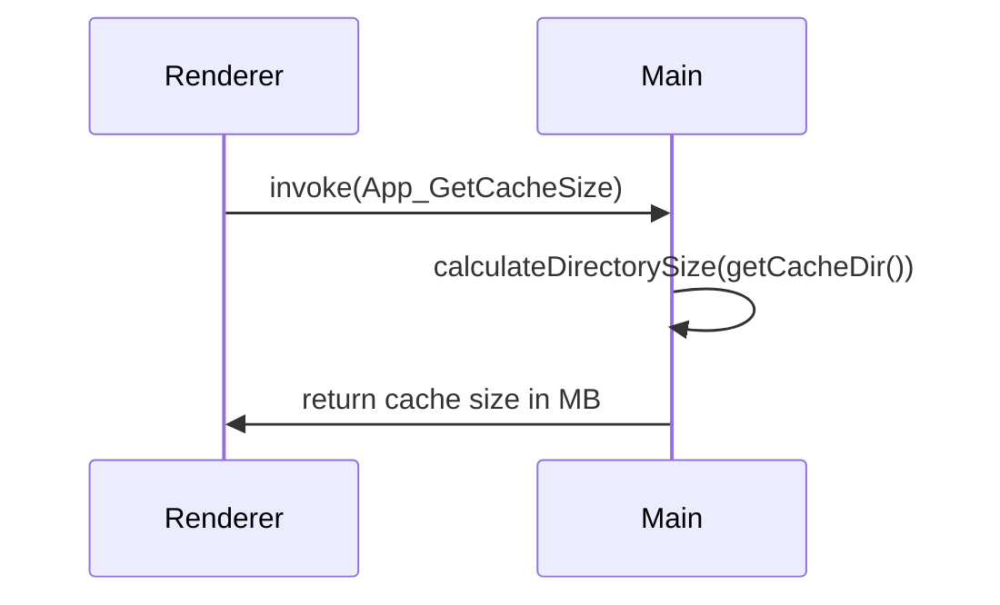

**Diagram sources**
- [ipc.ts](file://frontend/src/main/ipc.ts#L144-L156)
- [ipc.ts](file://frontend/src/main/ipc.ts#L144-L156)

### App_ClearCache
This channel clears the application's cache, including session data and temporary files, which can help resolve issues related to stale data.

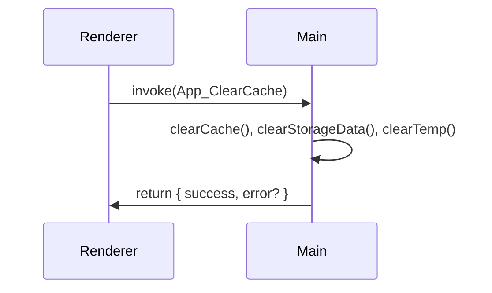

**Diagram sources**
- [ipc.ts](file://frontend/src/main/ipc.ts#L120-L141)
- [ipc.ts](file://frontend/src/main/ipc.ts#L120-L141)

## Application Information and Relaunch

These channels provide information about the application and allow for its relaunch, which can be necessary after certain operations.

### App_Info
This channel returns detailed information about the application, including its version, installation path, and system configuration.

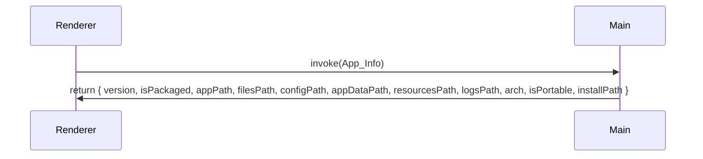

**Diagram sources**
- [ipc.ts](file://frontend/src/main/ipc.ts#L62-L74)
- [ipc.ts](file://frontend/src/main/ipc.ts#L62-L74)

### App_Reload
This channel reloads the application window, which can be useful for refreshing the UI after configuration changes.

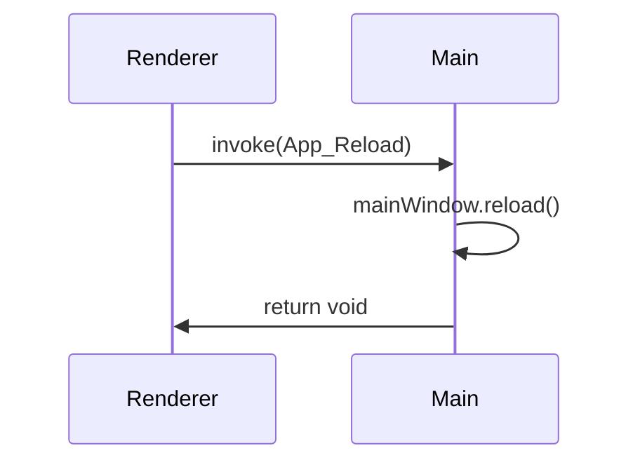

**Diagram sources**
- [ipc.ts](file://frontend/src/main/ipc.ts#L91-L92)
- [ipc.ts](file://frontend/src/main/ipc.ts#L91-L92)

### App_RelaunchApp
This channel relaunches the application, which is necessary after certain operations like changing the data path or applying updates.

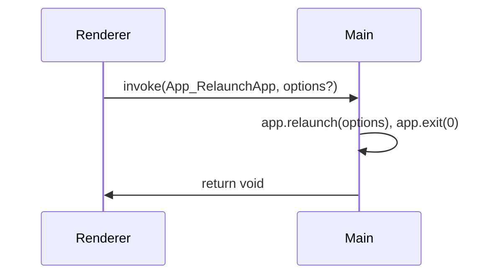

**Diagram sources**
- [ipc.ts](file://frontend/src/main/ipc.ts#L259-L279)
- [ipc.ts](file://frontend/src/main/ipc.ts#L259-L279)

## Event Flow for Update Notifications

The update notification system in MineContext uses a series of events to inform the user about the status of updates. These events are integrated with the UI to provide a seamless experience.

### UpdateAvailable
This event is triggered when an update is available. It sends the update information to the renderer process, which can then display a notification to the user.

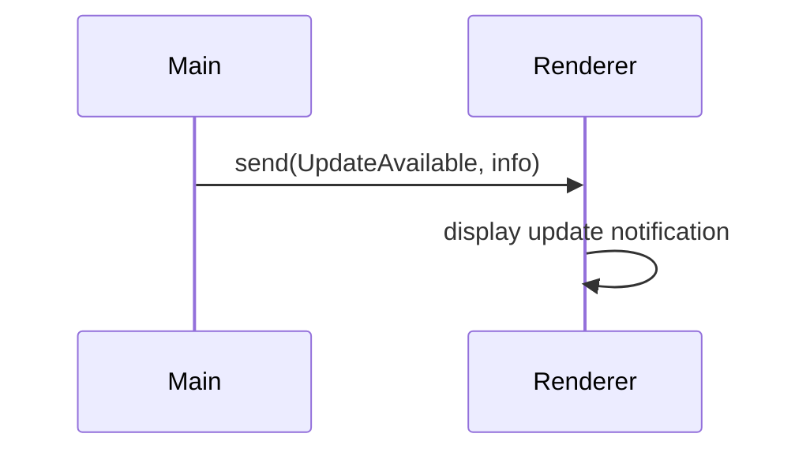

**Diagram sources**
- [AppUpdater.ts](file://frontend/src/main/services/AppUpdater.ts#L32-L34)
- [UpdateAvailableButton.tsx](file://frontend/src/renderer/src/components/UpdateAvailableButton/index.tsx#L24-L27)

### UpdateDownloaded
This event is triggered when an update has been successfully downloaded. It informs the user that they can now restart the application to apply the update.

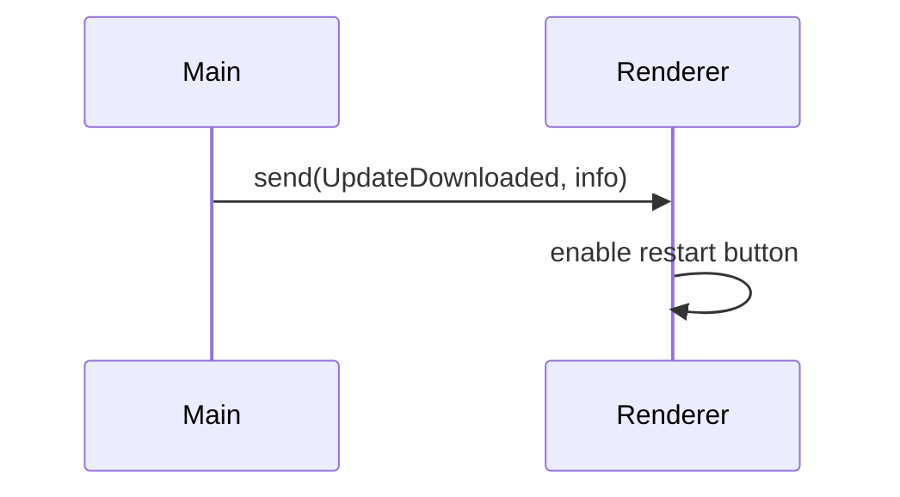

**Diagram sources**
- [AppUpdater.ts](file://frontend/src/main/services/AppUpdater.ts#L44-L47)
- [UpdateAvailableButton.tsx](file://frontend/src/renderer/src/components/UpdateAvailableButton/index.tsx#L24-L27)

### UpdateError
This event is triggered when an error occurs during the update process. It provides error information to the renderer process, which can then display an appropriate error message to the user.

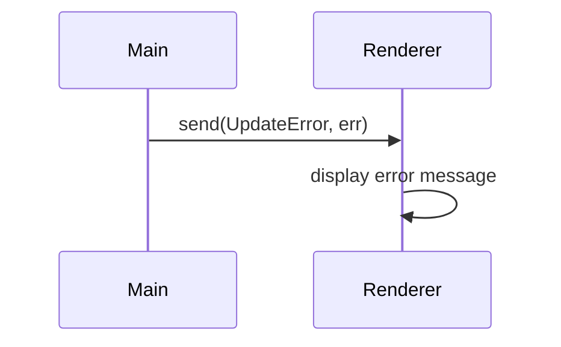

**Diagram sources**
- [AppUpdater.ts](file://frontend/src/main/services/AppUpdater.ts#L40-L43)
- [UpdateAvailableButton.tsx](file://frontend/src/renderer/src/components/UpdateAvailableButton/index.tsx#L29-L31)

## Best Practices for Application Restarts and Cache Management

### Application Restarts
When restarting the application, it is important to ensure that all data is saved and that the user is informed of the restart. The `App_RelaunchApp` channel should be used to relaunch the application, and the `App_QuitAndInstall` channel should be used to apply updates.

### Cache Management
Regularly clearing the cache can help maintain application performance and prevent issues related to stale data. However, it is important to balance this with the need to retain useful data. The `App_ClearCache` channel should be used judiciously, and users should be informed of the potential impact on their experience.

## Security and Performance Considerations

### Security
When exposing system-level operations through IPC, it is crucial to ensure that these operations are secure. This includes validating input, using secure communication channels, and limiting access to sensitive operations.

### Performance
Frequent cache operations can have a significant impact on application performance. It is important to optimize these operations and minimize their frequency. Additionally, the application should be designed to handle large amounts of data efficiently, using techniques such as lazy loading and data compression.

**Section sources**
- [ipc.ts](file://frontend/src/main/ipc.ts#L62-L279)
- [AppService.ts](file://frontend/src/main/services/AppService.ts#L27-L81)
- [AppUpdater.ts](file://frontend/src/main/services/AppUpdater.ts#L29-L87)
- [UpdateAvailableButton.tsx](file://frontend/src/renderer/src/components/UpdateAvailableButton/index.tsx#L1-L72)