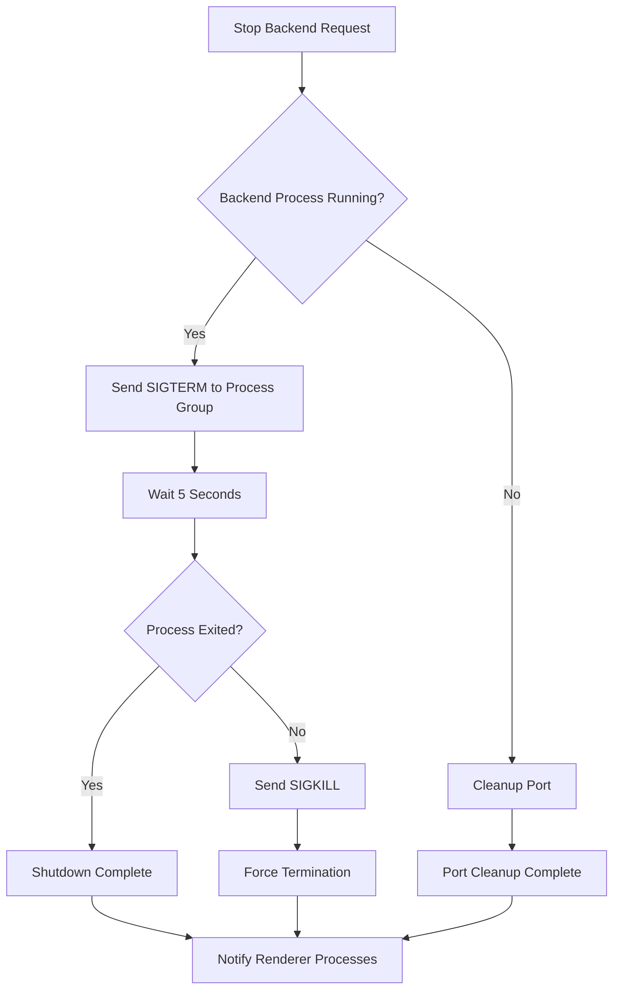
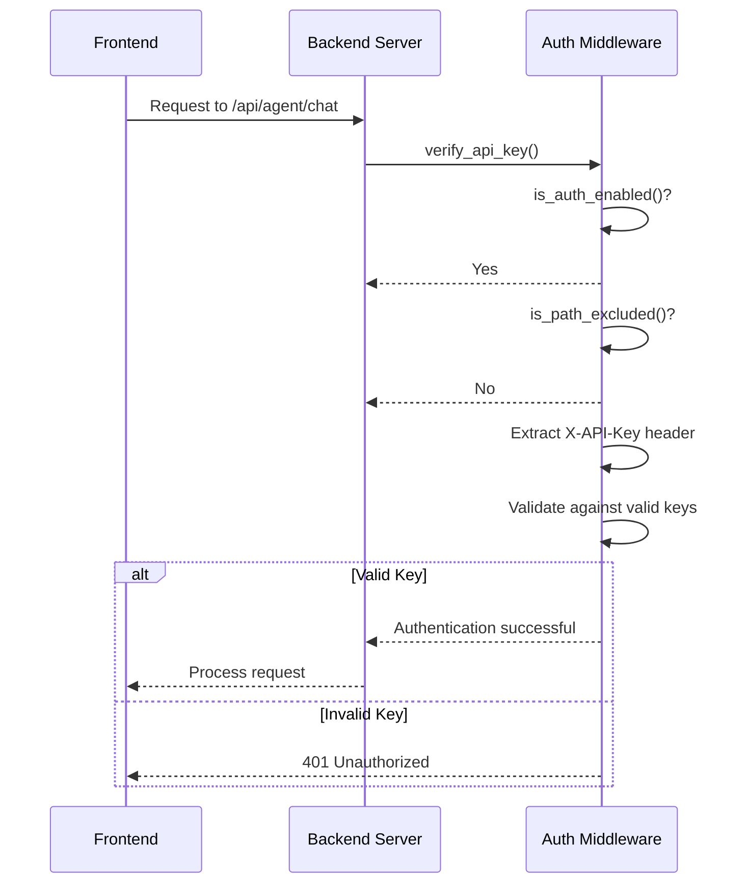
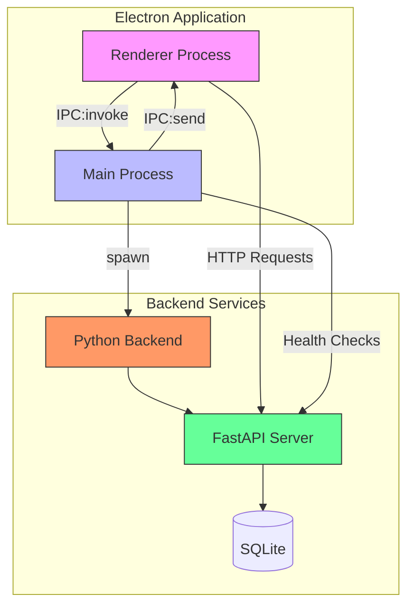

# Backend Management IPC Channels

<cite>
**Referenced Files in This Document**   
- [backend.ts](file://frontend/src/main/backend.ts)
- [IpcChannel.ts](file://frontend/packages/shared/IpcChannel.ts)
- [ipc.ts](file://frontend/src/main/ipc.ts)
- [index.ts](file://frontend/src/preload/index.ts)
- [App.tsx](file://frontend/src/renderer/src/App.tsx)
- [health.py](file://opencontext/server/routes/health.py)
- [auth.py](file://opencontext/server/middleware/auth.py)
</cite>

## Table of Contents
1. [Introduction](#introduction)
2. [Core IPC Channels](#core-ipc-channels)
3. [Backend Process Lifecycle](#backend-process-lifecycle)
4. [Port Allocation and Discovery](#port-allocation-and-discovery)
5. [Security Considerations](#security-considerations)
6. [Troubleshooting Guide](#troubleshooting-guide)
7. [Architecture Overview](#architecture-overview)

## Introduction
This document provides comprehensive documentation for the backend process management IPC (Inter-Process Communication) channels in the MineContext application. The system enables communication between the Electron frontend renderer process and the Python backend server through a well-defined set of IPC channels. These channels facilitate backend status monitoring, process lifecycle management, and secure communication between components.

The backend management system follows a client-server architecture where the Electron application acts as the client that manages the lifecycle of a local Python server process. Communication occurs through Electron's IPC mechanism, with specific channels dedicated to status queries, process control, and event notifications.

**Section sources**
- [backend.ts](file://frontend/src/main/backend.ts#L1-L740)
- [IpcChannel.ts](file://frontend/packages/shared/IpcChannel.ts#L1-L349)

## Core IPC Channels

### Backend_GetPort
Retrieves the current port number on which the Python backend server is running.

- **Direction**: Renderer → Main (via `ipcRenderer.invoke`)
- **Payload**: None
- **Return Value**: `number` representing the port number
- **State Transition Semantics**: Returns the currently assigned port, which is dynamically allocated during backend startup. The port remains stable during the backend's lifetime and only changes when the backend is restarted.

**Section sources**
- [backend.ts](file://frontend/src/main/backend.ts#L711-L714)
- [ipc.ts](file://frontend/src/main/ipc.ts#L534-L537)

### Backend_GetStatus
Retrieves the current status of the backend service along with port information and timestamp.

- **Direction**: Renderer → Main (via `ipcRenderer.invoke`)
- **Payload**: None
- **Return Value**: Object with the following structure:
  ```typescript
  {
    status: 'starting' | 'running' | 'stopped' | 'error',
    port: number,
    timestamp: string
  }
  ```
- **State Transition Semantics**: Provides a snapshot of the backend's current state. The status transitions through `stopped` → `starting` → `running` during successful startup, or to `error` if startup fails.

**Section sources**
- [backend.ts](file://frontend/src/main/backend.ts#L716-L719)
- [ipc.ts](file://frontend/src/main/ipc.ts#L538-L545)

### Backend_StatusChanged
Event channel that pushes backend status updates from the main process to all renderer processes.

- **Direction**: Main → Renderer (via `webContents.send`)
- **Payload**: Object with the same structure as `Backend_GetStatus`
- **Return Value**: None (event-based communication)
- **State Transition Semantics**: Emitted whenever the backend status changes. This enables real-time monitoring of the backend lifecycle across all application windows.

**Section sources**
- [backend.ts](file://frontend/src/main/backend.ts#L721-L738)
- [ipc.ts](file://frontend/src/main/ipc.ts#L546-L548)

### Python_Execute
Channel for executing Python code or commands through the backend server.

- **Direction**: Renderer → Main
- **Payload**: Not fully documented in available code, but expected to contain Python code or command specification
- **Return Value**: Execution result or response from the Python backend
- **State Transition Semantics**: Triggers execution in the Python backend process. The channel serves as a general-purpose interface for Python code execution.

**Section sources**
- [IpcChannel.ts](file://frontend/packages/shared/IpcChannel.ts#L95)

## Backend Process Lifecycle

### Startup Process
The backend startup process follows a well-defined sequence:

1. **Port Allocation**: The system finds an available port starting from 1733
2. **Process Initialization**: The Python backend executable is located and launched as a child process
3. **Health Checking**: After startup, the system performs health checks by polling the `/api/health` endpoint
4. **Status Notification**: The backend status is updated and broadcast to all renderer processes

```mermaid
sequenceDiagram
participant Renderer as Renderer Process
participant Main as Main Process
participant Backend as Python Backend
Renderer->>Main : invoke Backend_GetStatus
Main->>Main : check if backend is running
alt Backend not running
Main->>Main : findAvailablePort()
Main->>Main : spawn backend process
Main->>Backend : Start on assigned port
loop Health Check
Main->>Backend : GET /api/health
alt Healthy
Backend-->>Main : 200 OK
Main->>Main : setStatus('running')
Main->>Renderer : Backend_StatusChanged
break Success
else Unhealthy
Backend-->>Main : Error
Main->>Main : retry or fail
end
end
else Backend already running
Main->>Renderer : Return current status
end
```

**Diagram sources**
- [backend.ts](file://frontend/src/main/backend.ts#L347-L574)
- [health.py](file://opencontext/server/routes/health.py#L19-L47)

### Graceful Shutdown
The system implements a two-stage shutdown process:

1. **Graceful Termination**: SIGTERM signal is sent to the backend process group
2. **Forced Termination**: If the process doesn't exit within 5 seconds, SIGKILL is sent
3. **Port Cleanup**: Any remaining processes on the backend port are terminated



**Diagram sources**
- [backend.ts](file://frontend/src/main/backend.ts#L203-L238)

### Error Recovery
The system includes robust error recovery mechanisms:

- **Automatic Restart**: If the backend process crashes, it is automatically restarted
- **Health Monitoring**: Continuous health checks ensure the backend remains responsive
- **Error Logging**: Comprehensive logging to debug.log files for troubleshooting
- **User Notification**: Dialog boxes inform users of startup failures with log file references

**Section sources**
- [backend.ts](file://frontend/src/main/backend.ts#L585-L614)

## Port Allocation and Discovery

### Port Allocation Strategy
The system uses a dynamic port allocation strategy:

1. **Base Port**: Starts with port 1733 as the initial candidate
2. **Availability Check**: Tests each port using a TCP connection attempt
3. **Fallback Mechanism**: Tries up to 100 consecutive ports if the initial port is occupied
4. **Error Handling**: Throws an error if no available port is found after 100 attempts

The port allocation occurs in the `findAvailablePort` function, which systematically checks port availability before assigning it to the backend server.

### Frontend Discovery Mechanism
The frontend discovers the backend endpoint through the following process:

1. **Direct Query**: Uses `Backend_GetPort` IPC channel to retrieve the current port
2. **Base URL Construction**: Combines `http://127.0.0.1` with the retrieved port number
3. **API Communication**: Uses the constructed URL for all API requests to the backend

In the renderer process, services like `ChatStreamService` use the backend port to construct API endpoints:

```typescript
const baseUrl = axiosInstance.defaults.baseURL || 'http://127.0.0.1:1733'
const response = await fetch(`${baseUrl}/api/agent/chat/stream`, { /* ... */ })
```

**Section sources**
- [backend.ts](file://frontend/src/main/backend.ts#L67-L79)
- [ChatStreamService.ts](file://frontend/src/renderer/src/services/ChatStreamService.ts#L108-L110)

## Security Considerations

### Local Server Exposure
The backend server is bound to `127.0.0.1` (localhost), ensuring it is only accessible from the local machine. This prevents external access to the service while allowing communication between the Electron frontend and Python backend.

### Authentication Mechanisms
The system implements API key-based authentication:

- **Authentication Enabled**: Configurable via `api_auth.enabled` setting
- **API Key Header**: Uses `X-API-Key` header for authentication
- **Query Parameter**: Supports `api_key` query parameter as alternative
- **Valid Keys**: Configured in `api_auth.api_keys` array
- **Excluded Paths**: Health check endpoints are excluded from authentication



**Diagram sources**
- [auth.py](file://opencontext/server/middleware/auth.py#L1-L113)

### Configuration
Authentication is configured through the `config.yaml` file with the following structure:

```yaml
api_auth:
  enabled: true
  api_keys:
    - minecontext_frontend_token
  excluded_paths:
    - /health
    - /api/health
    - /
    - /static/*
```

**Section sources**
- [auth.py](file://opencontext/server/middleware/auth.py#L36-L53)

## Troubleshooting Guide

### Common Backend Connectivity Issues

#### Port Already in Use
**Symptoms**: 
- "Backend server failed to start - port already in use" error
- Application fails to start with backend initialization error

**Solutions**:
1. Check for existing MineContext processes and terminate them
2. Wait for the application to automatically find an available port
3. Manually kill processes on port 1733 and above using system tools

#### Connection Refused
**Symptoms**:
- "Backend server failed to start - connection refused" error
- Health checks fail repeatedly

**Solutions**:
1. Verify the backend executable exists in the expected location
2. Check file permissions to ensure the executable is runnable
3. Review backend logs in the debug directory for specific errors

#### Backend Crashes During Startup
**Symptoms**:
- "Backend server crashed during startup" error
- Application shows loading screen indefinitely

**Solutions**:
1. Check the backend log file referenced in the error message
2. Verify Python dependencies are properly installed
3. Ensure configuration files exist and are properly formatted

### Checking Backend Status from Renderer
To check backend status from the renderer process:

```typescript
try {
  const statusInfo = await window.electron.ipcRenderer.invoke('backend:get-status')
  console.log('Backend status:', statusInfo)
  // Handle different status states
  if (statusInfo.status === 'running') {
    // Backend is ready for requests
  } else if (statusInfo.status === 'error') {
    // Handle error state
  }
} catch (error) {
  console.error('Failed to get backend status:', error)
}
```

The application also listens for status change events:

```typescript
window.electron.ipcRenderer.on('backend:status-changed', (event, statusInfo) => {
  console.log('Backend status changed:', statusInfo)
  // Update UI based on new status
})
```

### Handling Backend Startup Failures
When backend startup fails, the system:

1. Creates a detailed log file in the debug directory
2. Displays an error dialog with the specific error message
3. Includes the log file path in the error message for debugging
4. Preserves the error stack trace for advanced troubleshooting

The error handling includes specific message mapping for common issues:
- `ECONNREFUSED`: "Backend server failed to start - connection refused"
- `EADDRINUSE`: "Backend server failed to start - port already in use" 
- Process exit errors: "Backend server crashed during startup"

**Section sources**
- [backend.ts](file://frontend/src/main/backend.ts#L596-L608)
- [App.tsx](file://frontend/src/renderer/src/App.tsx#L37-L76)

## Architecture Overview



**Diagram sources**
- [backend.ts](file://frontend/src/main/backend.ts#L1-L740)
- [ipc.ts](file://frontend/src/main/ipc.ts#L1-L610)