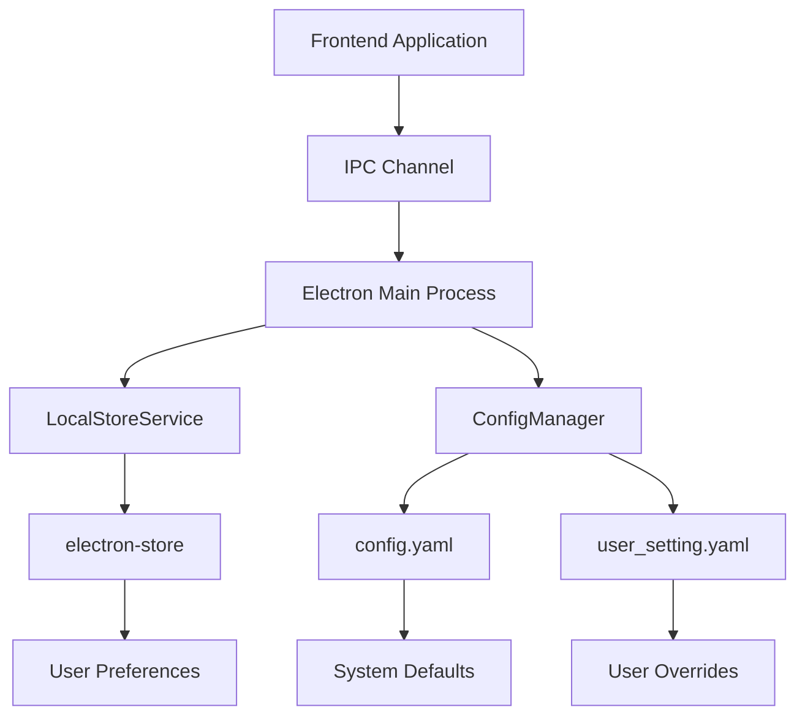
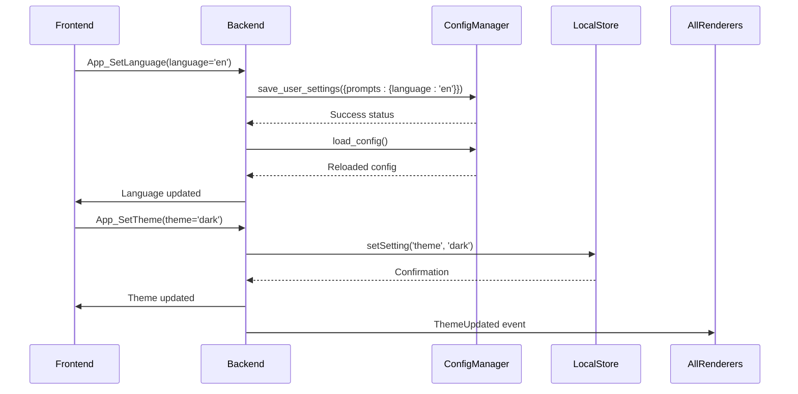
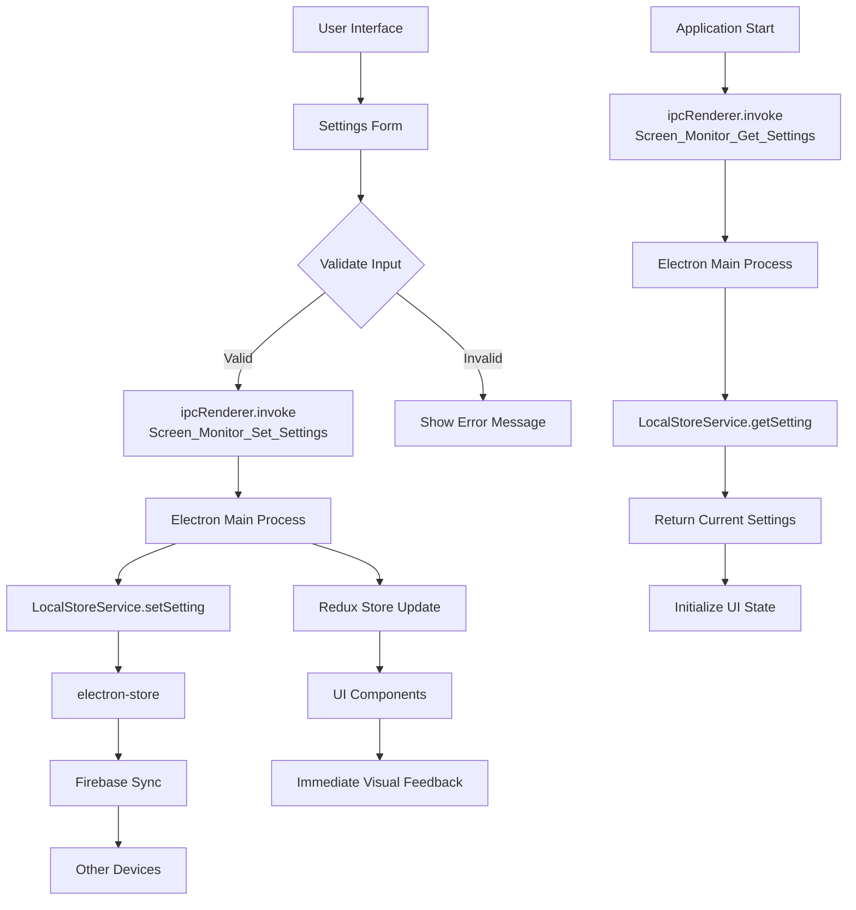
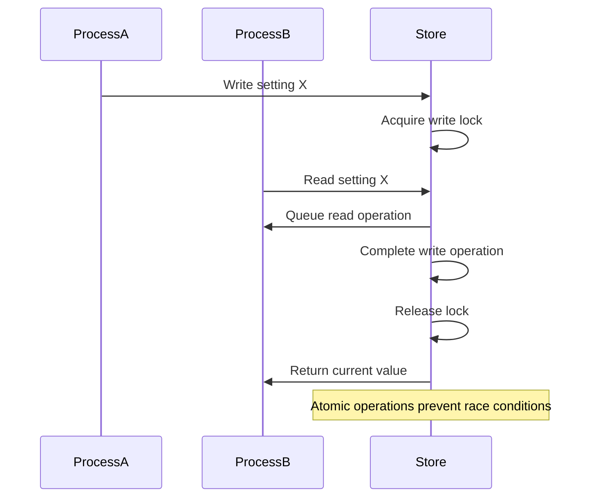

# Configuration Management IPC Channels

<cite>
**Referenced Files in This Document**   
- [IpcChannel.ts](file://frontend/packages/shared/IpcChannel.ts)
- [ipc.ts](file://frontend/src/main/ipc.ts)
- [config_manager.py](file://opencontext/config/config_manager.py)
- [global_config.py](file://opencontext/config/global_config.py)
- [config.yaml](file://config/config.yaml)
- [LocalStoreService.ts](file://frontend/src/main/services/LocalStoreService.ts)
- [languages.ts](file://frontend/packages/shared/config/languages.ts)
- [setting.ts](file://frontend/src/renderer/src/store/setting.ts)
</cite>

## Table of Contents
1. [Introduction](#introduction)
2. [Configuration Hierarchy and Persistence](#configuration-hierarchy-and-persistence)
3. [Core Configuration IPC Channels](#core-configuration-ipc-channels)
4. [User Preference IPC Channels](#user-preference-ipc-channels)
5. [Screen Monitor Settings Channels](#screen-monitor-settings-channels)
6. [Configuration Schema and Validation](#configuration-schema-and-validation)
7. [Practical Examples](#practical-examples)
8. [Security and Concurrency Considerations](#security-and-concurrency-considerations)
9. [Extending Configuration System](#extending-configuration-system)
10. [Conclusion](#conclusion)

## Introduction

This document provides comprehensive documentation for the configuration management Inter-Process Communication (IPC) channels in the MineContext application. The system enables seamless communication between the frontend (Electron renderer process) and backend (main process) for managing application settings, user preferences, and system configurations. The IPC channels facilitate operations such as setting application theme, changing language, configuring auto-update behavior, and managing screen monitoring settings.

The configuration system follows a hierarchical approach with multiple persistence mechanisms, including YAML configuration files, in-memory storage, and Electron's electron-store for user-specific settings. The IPC architecture ensures secure, validated, and race-condition-free access to configuration data across different components of the application.

## Configuration Hierarchy and Persistence

The MineContext application implements a multi-layered configuration hierarchy that combines system-wide defaults, user-specific settings, and runtime configurations. This hierarchical approach ensures flexibility while maintaining consistency across different deployment scenarios.

The configuration system follows a cascading model where more specific configurations override general ones:

1. **Default Configuration**: Stored in `config/config.yaml`, this file contains the base configuration with default values for all settings
2. **User Configuration**: Stored in `config/user_setting.yaml`, this file contains user-specific overrides that persist across application restarts
3. **Runtime Configuration**: Stored in memory using Electron's `electron-store`, this layer contains temporary settings that can be modified during application execution

The persistence mechanism is implemented through the `ConfigManager` class in Python and the `LocalStoreService` in TypeScript. The system uses YAML files for persistent storage and in-memory objects for runtime configuration, with automatic synchronization between layers.



**Diagram sources**
- [config_manager.py](file://opencontext/config/config_manager.py#L24-L253)
- [LocalStoreService.ts](file://frontend/src/main/services/LocalStoreService.ts#L4-L27)
- [config.yaml](file://config/config.yaml#L1-L253)

**Section sources**
- [config_manager.py](file://opencontext/config/config_manager.py#L24-L253)
- [global_config.py](file://opencontext/config/global_config.py#L23-L331)
- [config.yaml](file://config/config.yaml#L1-L253)

## Core Configuration IPC Channels

The core configuration IPC channels provide fundamental operations for managing application settings. These channels implement a key-value storage pattern with type safety and validation.

### Config_Set and Config_Get Channels

The `Config_Set` and `Config_Get` channels form the foundation of the configuration management system, enabling bidirectional communication between frontend and backend processes.

**Channel Specifications:**

| Property | Config_Set | Config_Get |
|---------|----------|----------|
| **Direction** | Frontend → Backend | Frontend ← Backend |
| **Channel Name** | 'config:set' | 'config:get' |
| **Payload Structure** | { key: string, value: unknown } | { key: string } |
| **Return Value** | boolean (success status) | any (configuration value) |
| **Persistence** | In-memory (electron-store) | In-memory (electron-store) |
| **Validation** | Type checking, schema validation | None (retrieval only) |

The `Config_Set` channel accepts a key-value pair where the key is a string identifier and the value can be any JSON-serializable type (string, number, boolean, object, array). The backend validates the input type and applies any applicable business rules before storing the value.

The `Config_Get` channel retrieves the current value associated with a given key. If the key does not exist, it returns undefined. This channel does not perform validation as it is a read-only operation.

These channels are implemented using Electron's `ipcMain.handle()` method in the main process, which registers asynchronous handlers for incoming IPC requests. The frontend invokes these channels using `ipcRenderer.invoke()` to ensure proper async/await semantics.

**Section sources**
- [IpcChannel.ts](file://frontend/packages/shared/IpcChannel.ts#L66-L67)
- [ipc.ts](file://frontend/src/main/ipc.ts#L550-L553)

## User Preference IPC Channels

The user preference IPC channels manage application-level settings that affect the user experience, including language, theme, and update behavior.

### App_SetLanguage and App_SetTheme Channels

The `App_SetLanguage` and `App_SetTheme` channels control the application's localization and visual appearance.

**App_SetLanguage Channel:**
- **Direction**: Frontend → Backend
- **Channel Name**: 'app:set-language'
- **Payload Structure**: { language: 'zh' \| 'en' }
- **Return Value**: boolean (success status)
- **Persistence**: YAML file (user_setting.yaml) and in-memory
- **Validation**: Must be 'zh' or 'en'

When the language is changed, the system updates the `prompts.language` setting in the user configuration and reloads the appropriate prompt file (`prompts_zh.yaml` or `prompts_en.yaml`). The change triggers a configuration reload to ensure all components reflect the new language setting.

**App_SetTheme Channel:**
- **Direction**: Frontend → Backend
- **Channel Name**: 'app:set-theme'
- **Payload Structure**: { theme: 'light' \| 'dark' \| 'system' }
- **Return Value**: void
- **Persistence**: In-memory (electron-store)
- **Validation**: Must be valid theme option

The theme setting is stored in the electron-store and broadcasts a `ThemeUpdated` event to notify all renderer processes of the change. This allows for immediate UI updates without requiring a full application restart.

### App_SetAutoUpdate Channel

The `App_SetAutoUpdate` channel controls the application's update behavior.

- **Direction**: Frontend → Backend
- **Channel Name**: 'app:set-auto-update'
- **Payload Structure**: { enabled: boolean }
- **Return Value**: void
- **Persistence**: In-memory (electron-store)
- **Validation**: Boolean value only

This setting determines whether the application automatically checks for updates on startup. When disabled, users must manually check for updates through the application menu.



**Diagram sources**
- [IpcChannel.ts](file://frontend/packages/shared/IpcChannel.ts#L8-L9)
- [IpcChannel.ts](file://frontend/packages/shared/IpcChannel.ts#L25-L26)
- [global_config.py](file://opencontext/config/global_config.py#L187-L235)
- [LocalStoreService.ts](file://frontend/src/main/services/LocalStoreService.ts#L18-L20)

**Section sources**
- [IpcChannel.ts](file://frontend/packages/shared/IpcChannel.ts#L8-L9)
- [IpcChannel.ts](file://frontend/packages/shared/IpcChannel.ts#L25-L26)
- [global_config.py](file://opencontext/config/global_config.py#L187-L235)
- [ipc.ts](file://frontend/src/main/ipc.ts#L550-L553)

## Screen Monitor Settings Channels

The screen monitor settings channels manage the configuration for screen capture functionality, including recording intervals, scheduling, and storage settings.

### Screen_Monitor_Set_Settings and Screen_Monitor_Get_Settings Channels

These channels provide CRUD operations for screen monitoring configuration.

**Channel Specifications:**

| Property | Screen_Monitor_Set_Settings | Screen_Monitor_Get_Settings |
|---------|---------------------------|---------------------------|
| **Direction** | Frontend → Backend | Frontend ← Backend |
| **Channel Name** | 'screen-monitor:set-settings' | 'screen-monitor:get-settings' |
| **Payload Structure** | { key: string, value: unknown } | { key: string } |
| **Return Value** | void | any (setting value) |
| **Persistence** | In-memory (electron-store) | In-memory (electron-store) |
| **Validation** | Schema validation based on setting key | None |

The settings are organized in a hierarchical structure with the following key categories:
- `recordInterval`: Number of seconds between screenshots (default: 15)
- `enableRecordingHours`: Boolean to enable time-based recording schedule
- `recordingHours`: Array of start and end times in HH:MM:SS format
- `applyToDays`: 'weekday' or 'everyday' to specify which days the schedule applies

The default screen settings are defined in the frontend store with the following structure:

```typescript
const defaultScreenSettings = {
  recordInterval: 15,
  enableRecordingHours: false,
  recordingHours: ['08:00:00', '20:00:00'] as [string, string],
  applyToDays: 'weekday' as ApplyToDays
};
```

When settings are updated, they are stored in the electron-store instance managed by `LocalStoreService`. The changes are immediately available to all components through the Redux store, which subscribes to configuration changes.



**Diagram sources**
- [IpcChannel.ts](file://frontend/packages/shared/IpcChannel.ts#L331-L332)
- [ipc.ts](file://frontend/src/main/ipc.ts#L546-L553)
- [setting.ts](file://frontend/src/renderer/src/store/setting.ts#L8-L13)
- [LocalStoreService.ts](file://frontend/src/main/services/LocalStoreService.ts#L14-L20)

**Section sources**
- [IpcChannel.ts](file://frontend/packages/shared/IpcChannel.ts#L331-L332)
- [ipc.ts](file://frontend/src/main/ipc.ts#L546-L553)
- [setting.ts](file://frontend/src/renderer/src/store/setting.ts#L8-L13)

## Configuration Schema and Validation

The configuration system implements a comprehensive schema and validation framework to ensure data integrity and prevent invalid settings.

### Configuration Schema Structure

The main configuration schema is defined in `config.yaml` with the following top-level sections:

- **enabled**: Global switch for the application
- **logging**: Logging configuration (level, log_path)
- **user_setting_path**: Path to user-specific settings file
- **document_processing**: Document processing configuration
- **vlm_model**: Vision language model configuration
- **embedding_model**: Embedding model configuration
- **capture**: Context capture module configuration
- **processing**: Context processing module configuration
- **storage**: Context storage module configuration
- **consumption**: Context consumption module configuration
- **web**: Web server configuration
- **api_auth**: API authentication configuration
- **prompts**: Prompts configuration (language)
- **content_generation**: Content generation service configuration
- **tools**: Tools configuration
- **completion**: Intelligent completion service configuration

Each section contains specific configuration options with appropriate default values and constraints.

### Validation Rules

The system implements multiple layers of validation:

1. **Type Validation**: Ensures values match expected types (string, number, boolean, object)
2. **Range Validation**: For numeric values, ensures they fall within acceptable ranges
3. **Enum Validation**: For discrete options, ensures values match allowed options
4. **Path Validation**: For file paths, ensures they are valid and accessible
5. **Dependency Validation**: Ensures related settings are consistent

The `ConfigManager` class in Python implements the server-side validation logic, while the frontend provides client-side validation to improve user experience. The validation rules are enforced through the `save_user_settings` method, which selectively updates only allowed configuration options.

### Default Fallback Behavior

The system implements a robust fallback mechanism for missing or invalid configuration values:

1. **User Settings Layer**: If a setting is not found in user settings, it falls back to the default configuration
2. **Default Configuration Layer**: If a setting is not found in the default configuration, it uses hardcoded defaults
3. **Runtime Defaults**: For transient settings, reasonable defaults are provided if no configuration exists

The fallback chain ensures that the application remains functional even with incomplete or corrupted configuration files. When user settings are reset, the system deletes the `user_setting.yaml` file and reloads the default configuration from `config.yaml`.

**Section sources**
- [config.yaml](file://config/config.yaml#L1-L253)
- [config_manager.py](file://opencontext/config/config_manager.py#L168-L223)
- [global_config.py](file://opencontext/config/global_config.py#L143-L164)

## Practical Examples

This section provides practical examples of common configuration operations using the IPC channels.

### Changing Application Theme

To change the application theme from light to dark mode:

```typescript
import { ipcRenderer } from 'electron';
import { IpcChannel } from '@shared/IpcChannel';

// Change theme to dark mode
await ipcRenderer.invoke(IpcChannel.App_SetTheme, 'dark');

// The system will:
// 1. Store 'dark' theme setting in electron-store
// 2. Apply CSS classes to update UI appearance
// 3. Persist the setting for future sessions
```

The theme change is immediately reflected in the user interface, with all components responding to the `ThemeUpdated` event to refresh their appearance.

### Retrieving User Settings

To retrieve the current screen monitoring settings:

```typescript
import { ipcRenderer } from 'electron';
import { IpcChannel } from '@shared/IpcChannel';

// Get current recording interval
const recordInterval = await ipcRenderer.invoke(
  IpcChannel.Screen_Monitor_Get_Settings, 
  'recordInterval'
);

// Get all screen settings
const enableRecordingHours = await ipcRenderer.invoke(
  IpcChannel.Screen_Monitor_Get_Settings, 
  'enableRecordingHours'
);

const recordingHours = await ipcRenderer.invoke(
  IpcChannel.Screen_Monitor_Get_Settings, 
  'recordingHours'
);

console.log(`Recording every ${recordInterval} seconds`);
console.log(`Recording hours enabled: ${enableRecordingHours}`);
console.log(`Recording from ${recordingHours[0]} to ${recordingHours[1]}`);
```

### Updating Screen Monitoring Configuration

To update the screen monitoring schedule:

```typescript
import { ipcRenderer } from 'electron';
import { IpcChannel } from '@shared/IpcChannel';

// Update recording interval to 30 seconds
await ipcRenderer.invoke(
  IpcChannel.Screen_Monitor_Set_Settings, 
  'recordInterval', 
  30
);

// Enable time-based recording
await ipcRenderer.invoke(
  IpcChannel.Screen_Monitor_Set_Settings, 
  'enableRecordingHours', 
  true
);

// Set recording hours from 9 AM to 6 PM
await ipcRenderer.invoke(
  IpcChannel.Screen_Monitor_Set_Settings, 
  'recordingHours', 
  ['09:00:00', '18:00:00']
);

// Apply to all days
await ipcRenderer.invoke(
  IpcChannel.Screen_Monitor_Set_Settings, 
  'applyToDays', 
  'everyday'
);
```

These operations update the settings in the electron-store and trigger UI updates through the Redux store.

**Section sources**
- [IpcChannel.ts](file://frontend/packages/shared/IpcChannel.ts#L25-L26)
- [IpcChannel.ts](file://frontend/packages/shared/IpcChannel.ts#L331-L332)
- [ipc.ts](file://frontend/src/main/ipc.ts#L546-L553)
- [setting.ts](file://frontend/src/renderer/src/store/setting.ts#L8-L13)

## Security and Concurrency Considerations

The configuration management system implements several security and concurrency mechanisms to ensure data integrity and protect user information.

### Security Considerations

**Configuration Storage Security:**
- User settings are stored in YAML format with sensitive information excluded
- The `user_setting.yaml` file is stored in the application's configuration directory with appropriate file permissions
- Environment variables are used for sensitive credentials (LLM_API_KEY, etc.) rather than storing them in configuration files
- The system supports environment variable substitution in configuration files using the `${VAR}` syntax

**Access Control:**
- IPC channels are registered with specific handlers that validate input parameters
- File system operations include permission checks using `hasWritePermission`
- Path validation ensures operations are confined to allowed directories using `isPathInside`

### Race Condition Prevention

The system addresses potential race conditions in concurrent access through several mechanisms:

1. **Synchronized Configuration Loading**: The `ensureDbInitialized()` function ensures the database is initialized before any configuration operations
2. **Atomic File Operations**: Configuration file updates use atomic write operations to prevent corruption
3. **In-Memory Caching**: Frequently accessed settings are cached in memory to reduce file I/O
4. **Event-Driven Updates**: Configuration changes broadcast events to synchronize state across components

The `LocalStoreService` uses Electron's `electron-store` which provides built-in serialization and atomic writes, preventing race conditions when multiple processes access the same store.



**Diagram sources**
- [config_manager.py](file://opencontext/config/config_manager.py#L176-L185)
- [ipc.ts](file://frontend/src/main/ipc.ts#L26-L28)
- [LocalStoreService.ts](file://frontend/src/main/services/LocalStoreService.ts#L18-L20)

**Section sources**
- [config_manager.py](file://opencontext/config/config_manager.py#L176-L185)
- [ipc.ts](file://frontend/src/main/ipc.ts#L26-L28)
- [LocalStoreService.ts](file://frontend/src/main/services/LocalStoreService.ts#L18-L20)

## Extending Configuration System

The configuration system is designed to be extensible, allowing for the addition of new configuration options while maintaining backward compatibility.

### Adding New Configuration Options

To add a new configuration option:

1. **Define the IPC Channel**: Add a new enum value to `IpcChannel` in `IpcChannel.ts`
2. **Implement Backend Handler**: Register the IPC handler in `ipc.ts` using `ipcMain.handle()`
3. **Update Configuration Schema**: Add the new option to `config.yaml` with appropriate defaults
4. **Implement Validation**: Add validation rules in `config_manager.py`
5. **Create Frontend API**: Expose the functionality through a service or hook

Example of adding a new `App_SetFontSize` channel:

```typescript
// 1. Add to IpcChannel enum
export enum IpcChannel {
  // ... existing channels
  App_SetFontSize = 'app:set-font-size',
}

// 2. Implement backend handler
ipcMain.handle(IpcChannel.App_SetFontSize, (_, fontSize: number) => {
  if (fontSize < 8 || fontSize > 24) {
    throw new Error('Font size must be between 8 and 24');
  }
  localStoreService.setSetting('fontSize', fontSize);
});

// 3. Add to config.yaml
app:
  fontSize: 14  # Default font size in points
```

### Backward Compatibility

The system maintains backward compatibility through:

1. **Default Values**: New options include sensible defaults that work with existing configurations
2. **Graceful Degradation**: Missing configuration options use fallback values
3. **Versioning**: Configuration files can include version information to handle schema changes
4. **Migration Scripts**: Automated scripts can update old configurations to new formats

The deep merge strategy in `ConfigManager.deep_merge()` ensures that new configuration options do not overwrite existing user settings, preserving customizations while incorporating new defaults.

**Section sources**
- [IpcChannel.ts](file://frontend/packages/shared/IpcChannel.ts#L4-L349)
- [ipc.ts](file://frontend/src/main/ipc.ts#L45-L610)
- [config_manager.py](file://opencontext/config/config_manager.py#L120-L141)

## Conclusion

The configuration management IPC channels in MineContext provide a robust, secure, and extensible system for managing application settings and user preferences. The hierarchical configuration model combines YAML-based persistent storage with in-memory runtime configuration, offering flexibility and performance.

Key features of the system include:
- Comprehensive IPC channels for managing core settings and user preferences
- Multi-layered configuration hierarchy with proper fallback behavior
- Robust validation and type safety
- Secure storage of configuration data
- Protection against race conditions in concurrent access
- Extensible architecture for adding new configuration options

The implementation leverages Electron's IPC mechanism with proper async/await patterns, ensuring reliable communication between frontend and backend processes. The use of electron-store for in-memory settings provides fast access with automatic persistence, while the YAML-based configuration files offer human-readable and version-controllable settings storage.

By following the documented patterns and best practices, developers can extend the configuration system with new options while maintaining backward compatibility and system integrity.