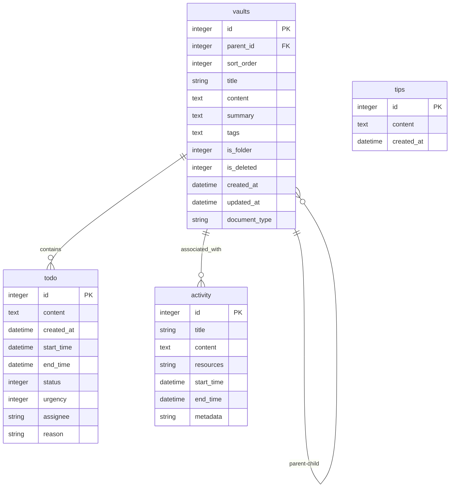
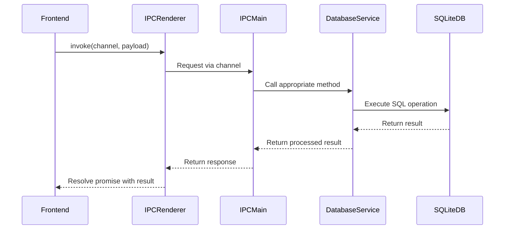
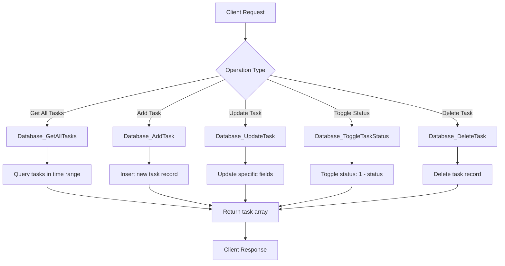

# Database Operations IPC Channels

<cite>
**Referenced Files in This Document**   
- [IpcChannel.ts](file://frontend/packages/shared/IpcChannel.ts)
- [DatabaseService.ts](file://frontend/src/main/services/DatabaseService.ts)
- [VaultDatabaseService.ts](file://frontend/src/main/services/VaultDatabaseService.ts)
- [ToDoService.ts](file://frontend/src/main/services/ToDoService.ts)
- [ActivityService.ts](file://frontend/src/main/services/ActivityService.ts)
- [Database.ts](file://frontend/src/main/services/Database.ts)
- [schema.sql](file://frontend/src/main/db/schema.sql)
- [ipc.ts](file://frontend/src/main/ipc.ts)
- [activity.ts](file://frontend/src/interface/db/activity.ts)
- [todo.ts](file://frontend/src/interface/db/todo.ts)
- [vault.ts](file://frontend/src/renderer/src/types/vault.ts)
</cite>

## Table of Contents
1. [Introduction](#introduction)
2. [Database Schema and Entity Models](#database-schema-and-entity-models)
3. [IPC Channel Architecture](#ipc-channel-architecture)
4. [Vault Management Channels](#vault-management-channels)
5. [Activity Tracking Channels](#activity-tracking-channels)
6. [Task Management Channels](#task-management-channels)
7. [Tips Channels](#tips-channels)
8. [Practical Examples](#practical-examples)
9. [Error Handling](#error-handling)
10. [Performance Considerations](#performance-considerations)
11. [Conclusion](#conclusion)

## Introduction

This document provides comprehensive documentation for the database access IPC (Inter-Process Communication) channels in the MineContext application. These channels enable CRUD (Create, Read, Update, Delete) operations for application data across various domains including vault management, activity tracking, task management, and tips retrieval. The IPC system facilitates communication between the Electron renderer process (frontend) and main process (backend), allowing the application to persist and retrieve data from a SQLite database.

The documented channels follow a consistent pattern where each operation is exposed through a named channel that the frontend can invoke. The backend processes these requests, performs the appropriate database operations, and returns results to the frontend. This architecture ensures data integrity, provides a clear separation of concerns, and enables efficient data management across the application.

**Section sources**
- [IpcChannel.ts](file://frontend/packages/shared/IpcChannel.ts)
- [ipc.ts](file://frontend/src/main/ipc.ts)

## Database Schema and Entity Models

The application utilizes a SQLite database with multiple tables to store different types of data. The primary tables include `vaults`, `todo`, `activity`, and `tips`, each serving a specific purpose in the application's data model.

The `vaults` table stores hierarchical data entries that can represent documents, folders, or other content types. Each vault entry contains metadata such as title, content, creation and update timestamps, parent-child relationships for hierarchical organization, and deletion status for soft deletion functionality.

The `todo` table manages task data with fields for content, creation time, start and end times, status (completed or pending), urgency level, and optional assignment information. This table supports the application's task management features.

The `activity` table records user activities with fields for title, content, associated resources, and time ranges. This enables the application to track and display user activity history.

The `tips` table stores helpful tips or suggestions that can be retrieved and displayed to users.



**Diagram sources**
- [schema.sql](file://frontend/src/main/db/schema.sql)
- [vault.ts](file://frontend/src/renderer/src/types/vault.ts)
- [todo.ts](file://frontend/src/interface/db/todo.ts)
- [activity.ts](file://frontend/src/interface/db/activity.ts)

## IPC Channel Architecture

The IPC channel architecture follows a request-response pattern where the frontend initiates requests through named channels, and the backend processes these requests and returns responses. This architecture is implemented using Electron's `ipcMain.handle()` method, which allows asynchronous handling of IPC requests.

Each IPC channel is defined as a constant in the `IpcChannel` enum, providing a centralized registry of all available channels. This approach ensures type safety and prevents naming conflicts. When a frontend component needs to perform a database operation, it uses the `ipcRenderer.invoke()` method with the appropriate channel name and payload.

The backend IPC handlers are registered in the `registerIpc()` function in `ipc.ts`. Before processing most database requests, the handlers ensure the database is initialized by calling `ensureDbInitialized()`, which guarantees the database connection is ready before any operations are performed.

The architecture incorporates several best practices:
- Database operations are performed synchronously within the main process to prevent race conditions
- Error handling is implemented at both the IPC handler level and database service level
- Logging is integrated throughout the process for debugging and monitoring
- The database connection is managed as a singleton to ensure consistent access



**Diagram sources**
- [ipc.ts](file://frontend/src/main/ipc.ts)
- [DatabaseService.ts](file://frontend/src/main/services/DatabaseService.ts)
- [Database.ts](file://frontend/src/main/services/Database.ts)

## Vault Management Channels

The vault management channels provide comprehensive CRUD operations for managing hierarchical data entries in the application. These channels enable the creation, retrieval, updating, and deletion of vault entries, which can represent documents, folders, or other content types.

### Database_GetAllVaults
- **Direction**: Request-Response
- **Payload**: None
- **Return Value**: Array of Vault objects
- **Transactional Behavior**: Read-only operation
- **Description**: Retrieves all non-deleted vault entries from the database, ordered by update time in descending order.

### Database_InsertVault
- **Direction**: Request-Response
- **Payload**: Vault object (without ID)
- **Return Value**: Object containing the new ID: `{ id: number }`
- **Transactional Behavior**: Single INSERT operation with auto-commit
- **Description**: Creates a new vault entry in the database. The system automatically assigns an ID and sets creation/update timestamps.

### Database_UpdateVaultById
- **Direction**: Request-Response
- **Payload**: `id: number`, `vault: Partial<Vault>`
- **Return Value**: Boolean indicating success
- **Transactional Behavior**: Single UPDATE operation with auto-commit
- **Description**: Updates specific fields of an existing vault entry. Only provided fields are updated, leaving others unchanged.

### Database_DeleteVaultById
- **Direction**: Request-Response
- **Payload**: `id: number`
- **Return Value**: Boolean indicating success
- **Transactional Behavior**: Single DELETE operation with auto-commit
- **Description**: Permanently removes a vault entry from the database.

### Additional Vault Operations
The system also supports several specialized vault operations:
- **Database_GetVaultsByParentId**: Retrieves vaults within a specific parent folder
- **Database_GetVaultByTitle**: Finds vaults matching a specific title
- **Database_CreateFolder**: Creates a new folder vault entry
- **Database_SoftDeleteVaultById**: Marks a vault as deleted without removing it from the database
- **Database_RestoreVaultById**: Restores a previously soft-deleted vault
- **Database_GetVaultsByDocumentType**: Retrieves vaults filtered by document type

These channels collectively provide a complete set of operations for managing the hierarchical vault structure, supporting both file-like and folder-like entries with proper parent-child relationships and soft deletion capabilities.

**Section sources**
- [IpcChannel.ts](file://frontend/packages/shared/IpcChannel.ts)
- [VaultDatabaseService.ts](file://frontend/src/main/services/VaultDatabaseService.ts)
- [ipc.ts](file://frontend/src/main/ipc.ts)

## Activity Tracking Channels

The activity tracking channels provide functionality for retrieving user activity data from the database. These channels support both comprehensive and targeted queries for activity records.

### Database_GetAllActivities
- **Direction**: Request-Response
- **Payload**: None
- **Return Value**: Array of Activity objects
- **Transactional Behavior**: Read-only operation
- **Description**: Retrieves all activity records from the database without any filtering.

### Database_GetLatestActivity
- **Direction**: Request-Response
- **Payload**: None
- **Return Value**: Single Activity object or undefined if no activities exist
- **Transactional Behavior**: Read-only operation
- **Description**: Retrieves the most recent activity record based on the ID in descending order.

### Database_GetNewActivities
- **Direction**: Request-Response
- **Payload**: `startTime: string`, `endTime: string` (optional, defaults to distant future)
- **Return Value**: Array of Activity objects
- **Transactional Behavior**: Read-only operation
- **Description**: Retrieves activities that started after the specified start time and before the end time, ordered by start time in ascending order.

The activity data model includes fields for title, content, associated resources (stored as JSON), and time ranges. The `getLatestActivity` method uses a simple `ORDER BY id DESC LIMIT 1` query to efficiently retrieve the most recent activity, while `getNewActivities` uses time-based filtering to return activities within a specified time window.

These channels enable the application to display activity history, show recent activities, and analyze user behavior patterns over time. The time-based filtering in `getNewActivities` is particularly useful for synchronizing activity data between different application instances or after periods of offline use.

**Section sources**
- [IpcChannel.ts](file://frontend/packages/shared/IpcChannel.ts)
- [ActivityService.ts](file://frontend/src/main/services/ActivityService.ts)
- [DatabaseService.ts](file://frontend/src/main/services/DatabaseService.ts)
- [ipc.ts](file://frontend/src/main/ipc.ts)

## Task Management Channels

The task management channels provide comprehensive operations for managing TODO items in the application. These channels support creating, retrieving, updating, and deleting tasks, as well as toggling task status.

### Database_GetAllTasks
- **Direction**: Request-Response
- **Payload**: `startTime: string`, `endTime: string` (optional, defaults to distant future)
- **Return Value**: Array of TODOActivity objects
- **Transactional Behavior**: Read-only operation
- **Description**: Retrieves tasks that start within the specified time range, ordered by start time in ascending order.

### Database_AddTask
- **Direction**: Request-Response
- **Payload**: Partial task data including optional fields: `content`, `status`, `start_time`, `end_time`, `urgency`
- **Return Value**: RunResult from better-sqlite3 containing `lastInsertRowid` and `changes`
- **Transactional Behavior**: Single INSERT operation with auto-commit
- **Description**: Creates a new task with the provided data. Unspecified fields use default values.

### Database_UpdateTask
- **Direction**: Request-Response
- **Payload**: `taskId: number`, `taskData: Partial<TaskUpdateData>`
- **Return Value**: RunResult from better-sqlite3 containing `changes`
- **Transactional Behavior**: Single UPDATE operation with auto-commit
- **Description**: Updates specific fields of an existing task. The operation builds a dynamic UPDATE statement based on provided fields.

### Database_ToggleTaskStatus
- **Direction**: Request-Response
- **Payload**: `taskId: number`
- **Return Value**: RunResult from better-sqlite3 containing `changes`
- **Transactional Behavior**: Single UPDATE operation with auto-commit
- **Description**: Toggles the status of a task between 0 (pending) and 1 (completed) using the SQL expression `status = 1 - status`.

### Database_DeleteTask
- **Direction**: Request-Response
- **Payload**: `taskId: number`
- **Return Value**: RunResult from better-sqlite3 containing `changes`
- **Transactional Behavior**: Single DELETE operation with auto-commit
- **Description**: Removes a task from the database after verifying its existence.

The task data model includes fields for content, creation time, start and end times, status, urgency level, and optional assignment information. The `toggleTaskStatus` operation provides a convenient way to mark tasks as complete or pending without requiring the caller to know the current status.



**Diagram sources**
- [IpcChannel.ts](file://frontend/packages/shared/IpcChannel.ts)
- [ToDoService.ts](file://frontend/src/main/services/ToDoService.ts)
- [DatabaseService.ts](file://frontend/src/main/services/DatabaseService.ts)
- [ipc.ts](file://frontend/src/main/ipc.ts)

## Tips Channels

The tips channels provide functionality for retrieving helpful suggestions or guidance from the database.

### Database_GetAllTips
- **Direction**: Request-Response
- **Payload**: None
- **Return Value**: Array of tip objects with `id`, `content`, and `created_at` fields
- **Transactional Behavior**: Read-only operation
- **Description**: Retrieves all tips from the database without any filtering.

The tips functionality is relatively simple compared to other data types, providing only a single retrieval operation. Each tip contains content and a creation timestamp, allowing the application to display relevant suggestions to users. The system does not currently expose channels for creating, updating, or deleting tips, suggesting that tip management may be handled through other mechanisms or is not user-modifiable.

This channel enables the application to provide contextual help, onboarding guidance, or feature discovery prompts to users by retrieving pre-defined tips from the database.

**Section sources**
- [IpcChannel.ts](file://frontend/packages/shared/IpcChannel.ts)
- [DatabaseService.ts](file://frontend/src/main/services/DatabaseService.ts)
- [ipc.ts](file://frontend/src/main/ipc.ts)

## Practical Examples

This section provides practical examples of common database operations using the IPC channels.

### Creating a New Vault Entry

To create a new vault entry, the client would invoke the `Database_InsertVault` channel with a vault object containing the desired properties:

```javascript
// Example payload for creating a new document vault
const newVault = {
  title: "Project Proposal",
  content: "Detailed description of the project...",
  summary: "Initial proposal for Q4 project",
  tags: "project,proposal,q4",
  parent_id: 15,
  is_folder: 0,
  document_type: "document"
};

// Invoke the IPC channel
const result = await ipcRenderer.invoke('database:insert-vault', newVault);
console.log(`New vault created with ID: ${result.id}`);
```

The system would insert the new vault entry into the database, automatically setting creation and update timestamps, and return an object containing the assigned ID. The operation uses parameterized queries to prevent SQL injection and includes proper error handling to manage constraint violations or database connection issues.

### Updating Task Status

To update a task's status, there are two approaches: using the dedicated toggle channel or the general update channel.

Using the toggle channel (simple status flip):
```javascript
// Toggle the status of task with ID 42
const result = await ipcRenderer.invoke('database:toggle-task-status', 42);
if (result.changes > 0) {
  console.log("Task status updated successfully");
}
```

Using the update channel (specific status assignment):
```javascript
// Update task with ID 42 to completed status
const updateResult = await ipcRenderer.invoke('database:update-task', 42, {
  status: 1,
  end_time: new Date().toISOString()
});
if (updateResult.changes > 0) {
  console.log("Task completed successfully");
}
```

The toggle operation is optimized for the common case of switching between pending and completed states, while the update operation provides more flexibility for setting specific field values.

**Section sources**
- [VaultDatabaseService.ts](file://frontend/src/main/services/VaultDatabaseService.ts)
- [ToDoService.ts](file://frontend/src/main/services/ToDoService.ts)
- [ipc.ts](file://frontend/src/main/ipc.ts)

## Error Handling

The database IPC channels implement comprehensive error handling to manage various failure scenarios and ensure data integrity.

### Database Constraint Errors
When database constraints are violated (e.g., foreign key violations, unique constraint violations), the underlying SQLite operations throw errors that are caught and logged by the service layer. For example, attempting to delete a vault that is referenced by other records would trigger a foreign key constraint violation, which is propagated to the caller as a handled exception.

### Connection Issues
The system handles database connection issues through several mechanisms:
- The `ensureDbInitialized()` function verifies the database connection before processing requests
- Connection attempts are retried with exponential backoff when the database directory is not immediately available
- Proper error propagation ensures callers are informed of connection failures

### Input Validation
Input validation is implemented at multiple levels:
- Type checking ensures correct data types are provided
- Required field validation prevents incomplete records
- Format validation (e.g., for datetime strings) ensures data integrity

### Error Propagation
Errors are consistently handled throughout the stack:
1. Database operations catch and log errors with context-specific messages
2. Service layer methods re-throw errors with additional context
3. IPC handlers catch errors and return appropriate responses to the frontend
4. Frontend code can handle both success and error cases appropriately

The logging system captures detailed error information including stack traces, which aids in debugging and monitoring. Each error message includes contextual information about the operation being performed, making it easier to diagnose issues.

**Section sources**
- [DatabaseService.ts](file://frontend/src/main/services/DatabaseService.ts)
- [VaultDatabaseService.ts](file://frontend/src/main/services/VaultDatabaseService.ts)
- [ToDoService.ts](file://frontend/src/main/services/ToDoService.ts)
- [Database.ts](file://frontend/src/main/services/Database.ts)

## Performance Considerations

The database operations system incorporates several performance optimizations to ensure responsive user experiences, especially for frequent queries.

### Database Configuration
The system configures SQLite with performance-enhancing settings:
- WAL (Write-Ahead Logging) mode for improved concurrency
- Appropriate cache size (64MB) to reduce disk I/O
- Busy timeout setting to handle contention gracefully
- Foreign key constraints enabled for data integrity

### Query Optimization
Several strategies are employed to optimize query performance:
- Indexes are created on frequently queried columns such as `is_deleted`, `parent_id`, and timestamps
- Parameterized queries with statement caching reduce parsing overhead
- Batch operations are used where appropriate to minimize round trips

### Caching Strategies
While the current implementation doesn't include application-level caching, the architecture supports potential caching layers:
- The statement cache in the DB class reduces SQL compilation overhead
- Future enhancements could add result caching for frequently accessed data
- Client-side caching could be implemented in the renderer process for recently accessed records

### Connection Management
The database connection is managed as a singleton with proper lifecycle management:
- Connection is established once and reused across operations
- Proper cleanup ensures resources are released when the application closes
- Transaction support allows for atomic operations when needed

For high-frequency queries, additional optimizations could include:
- Implementing pagination for large result sets
- Adding client-side caching for frequently accessed data
- Using more specific queries to retrieve only needed fields
- Implementing background synchronization to reduce UI blocking

**Section sources**
- [Database.ts](file://frontend/src/main/services/Database.ts)
- [DatabaseService.ts](file://frontend/src/main/services/DatabaseService.ts)
- [schema.sql](file://frontend/src/main/db/schema.sql)

## Conclusion

The database access IPC channels in the MineContext application provide a robust and comprehensive system for managing application data across multiple domains. The architecture effectively separates concerns between the frontend and backend processes while maintaining data integrity and providing a consistent API for data operations.

Key strengths of the system include:
- Comprehensive CRUD operations for all major data types
- Well-defined channel interfaces with clear directionality and payload structures
- Robust error handling and logging
- Performance optimizations at the database configuration level
- Support for hierarchical data structures through parent-child relationships

The system could be enhanced with additional features such as:
- Support for transactions across multiple operations
- More sophisticated filtering and sorting options
- Real-time updates through event-driven architecture
- Enhanced caching mechanisms for frequently accessed data
- Improved pagination for large datasets

Overall, the IPC channel system provides a solid foundation for data management in the application, enabling reliable and efficient access to persistent storage while maintaining a clean separation between the user interface and data layers.