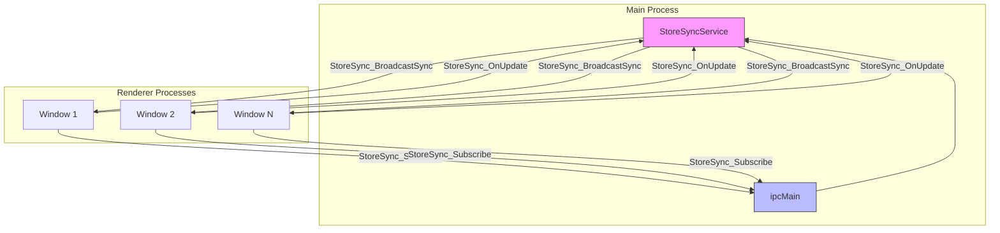
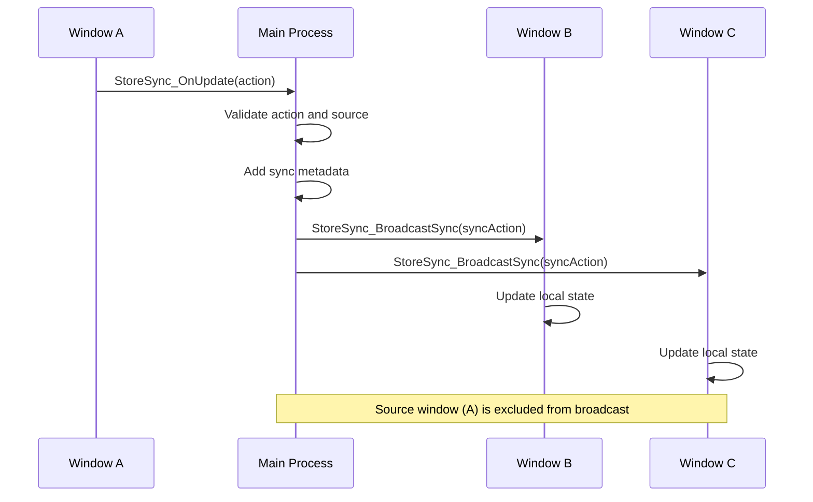
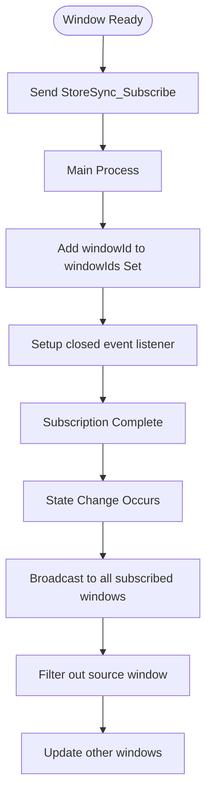
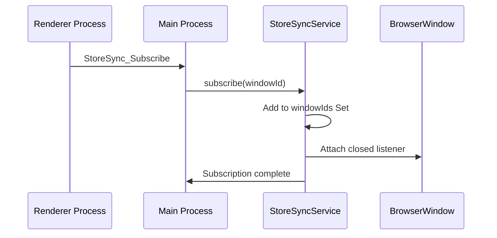
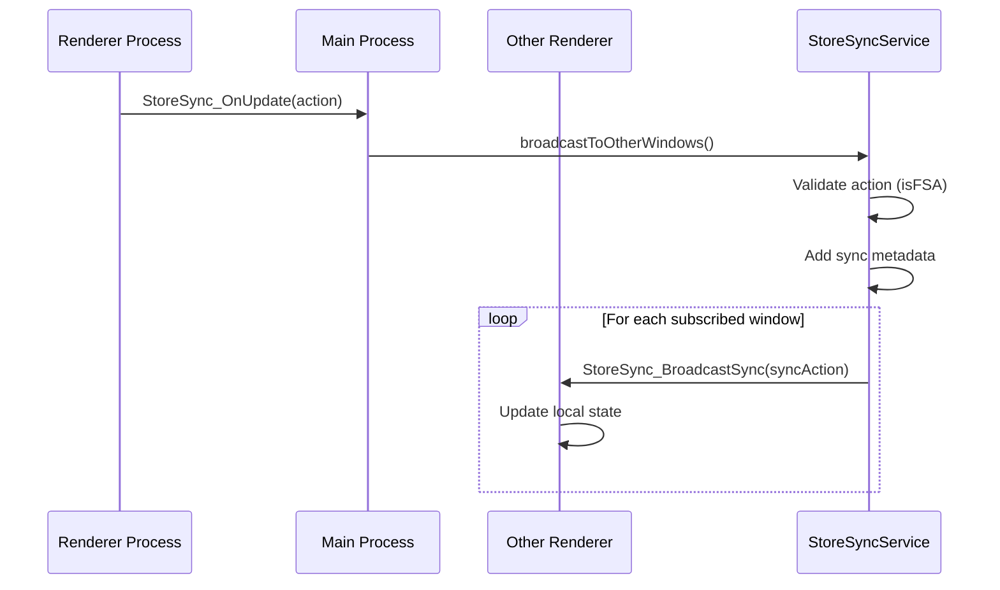
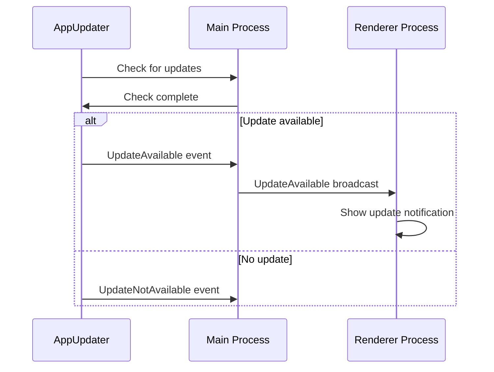

# Event Bus and State Synchronization IPC Channels

<cite>
**Referenced Files in This Document**   
- [IpcChannel.ts](file://frontend/packages/shared/IpcChannel.ts)
- [StoreSyncService.ts](file://frontend/src/main/services/StoreSyncService.ts)
- [ipc.ts](file://frontend/src/main/ipc.ts)
- [server-push-api.tsx](file://frontend/src/preload/server-push-api.tsx)
- [AppUpdater.ts](file://frontend/src/main/services/AppUpdater.ts)
- [LocalStoreService.ts](file://frontend/src/main/services/LocalStoreService.ts)
</cite>

## Table of Contents
1. [Introduction](#introduction)
2. [Core IPC Channels](#core-ipc-channels)
3. [State Synchronization Architecture](#state-synchronization-architecture)
4. [Event Broadcasting Mechanism](#event-broadcasting-mechanism)
5. [Subscription Management](#subscription-management)
6. [Payload Structure and Serialization](#payload-structure-and-serialization)
7. [Event Flow Examples](#event-flow-examples)
8. [Performance Considerations](#performance-considerations)
9. [Best Practices](#best-practices)
10. [Conclusion](#conclusion)

## Introduction
This document provides comprehensive documentation for the event broadcasting and state synchronization Inter-Process Communication (IPC) channels in the MineContext application. The system enables real-time state updates across multiple renderer processes (windows) through a centralized event bus architecture implemented in Electron. The documentation covers the core channels including ReduxStateChange, ReduxStoreReady, StoreSync_Subscribe, StoreSync_Unsubscribe, StoreSync_OnUpdate, StoreSync_BroadcastSync, and other event-type channels like UpdateAvailable, DownloadProgress, and BackupProgress.

**Section sources**
- [IpcChannel.ts](file://frontend/packages/shared/IpcChannel.ts)

## Core IPC Channels

The application implements a comprehensive set of IPC channels for event broadcasting and state synchronization. These channels are defined in the IpcChannel enum and serve different purposes in the event-driven architecture.

### State Synchronization Channels
- **StoreSync_Subscribe**: Allows renderer processes to subscribe to state synchronization events
- **StoreSync_Unsubscribe**: Enables cleanup of subscriptions when windows are closed
- **StoreSync_OnUpdate**: Used by subscribed windows to broadcast state changes
- **StoreSync_BroadcastSync**: Main process broadcasts state updates to all subscribed windows
- **ReduxStateChange**: Notifies about Redux store state changes
- **ReduxStoreReady**: Indicates when the Redux store is initialized and ready

### Application Event Channels
- **UpdateAvailable**: Broadcasts when a new application update is available
- **DownloadProgress**: Reports progress of application update downloads
- **BackupProgress**: Tracks progress of backup operations
- **ThemeUpdated**: Notifies about theme changes across the application

**Section sources**
- [IpcChannel.ts](file://frontend/packages/shared/IpcChannel.ts)

## State Synchronization Architecture

The state synchronization system follows a centralized event bus pattern where the main process acts as the coordinator for state changes across multiple renderer processes.



**Diagram sources**
- [StoreSyncService.ts](file://frontend/src/main/services/StoreSyncService.ts)
- [ipc.ts](file://frontend/src/main/ipc.ts)

**Section sources**
- [StoreSyncService.ts](file://frontend/src/main/services/StoreSyncService.ts)
- [ipc.ts](file://frontend/src/main/ipc.ts)

## Event Broadcasting Mechanism

The event broadcasting mechanism is implemented through the StoreSyncService class, which manages the lifecycle of state synchronization across windows.

### Broadcast Flow
When a state change occurs in one window, the following sequence takes place:
1. The window sends a StoreSync_OnUpdate event with the state change action
2. The main process validates the action and source window
3. The StoreSyncService broadcasts the change to all other subscribed windows via StoreSync_BroadcastSync
4. Each receiving window updates its local state accordingly

The service ensures that the source window does not receive its own broadcast, preventing infinite loops.

### Source Identification
Each broadcast includes source identification metadata:
- `fromSync: true` flag to distinguish synchronized actions
- `source: windowId:${sourceWindowId}` to identify the origin window

This allows applications to implement custom logic based on the event source.



**Diagram sources**
- [StoreSyncService.ts](file://frontend/src/main/services/StoreSyncService.ts)

**Section sources**
- [StoreSyncService.ts](file://frontend/src/main/services/StoreSyncService.ts)

## Subscription Management

The subscription management system handles the lifecycle of window subscriptions to the state synchronization bus.

### Subscription Process
Windows must explicitly subscribe to receive state updates:



### Automatic Cleanup
The system implements automatic subscription cleanup:
- When a window subscribes, a one-time 'closed' event listener is attached
- When the window closes, it is automatically removed from the subscription set
- During broadcast, destroyed windows are detected and cleaned up
- Invalid window IDs are removed from the subscription set

This prevents memory leaks and ensures the subscription set remains accurate.

**Section sources**
- [StoreSyncService.ts](file://frontend/src/main/services/StoreSyncService.ts)

## Payload Structure and Serialization

The event system follows the Flux Standard Action (FSA) format for payload structure, ensuring consistency across state changes.

### Action Structure
All state change actions conform to the following structure:
```typescript
interface StoreSyncAction {
  type: string;
  payload?: any;
  meta?: {
    fromSync: boolean;
    source: string;
    [key: string]: any;
  };
  error?: boolean;
}
```

### Serialization Format
The system uses JSON serialization for state objects with the following considerations:
- Circular references are handled by the underlying JSON.stringify implementation
- Complex objects are serialized to plain JSON
- Functions and undefined values are omitted from serialization
- Date objects are converted to ISO string format

The StoreSyncService performs minimal validation to prevent crashes from malformed actions while maintaining performance.

**Section sources**
- [StoreSyncService.ts](file://frontend/src/main/services/StoreSyncService.ts)

## Event Flow Examples

### Subscribing to Store Updates
To subscribe to store updates, a renderer process sends the StoreSync_Subscribe channel:



### Broadcasting State Changes
When a state change occurs, the broadcast flow follows this pattern:



### Handling Application Updates
The update availability flow demonstrates event broadcasting:



**Diagram sources**
- [StoreSyncService.ts](file://frontend/src/main/services/StoreSyncService.ts)
- [AppUpdater.ts](file://frontend/src/main/services/AppUpdater.ts)

**Section sources**
- [StoreSyncService.ts](file://frontend/src/main/services/StoreSyncService.ts)
- [AppUpdater.ts](file://frontend/src/main/services/AppUpdater.ts)

## Performance Considerations

The event bus architecture includes several performance optimizations to handle high-frequency events efficiently.

### High-Frequency Event Handling
- **Batching**: Multiple rapid state changes are naturally batched by the event loop
- **Minimal Validation**: Only essential validation (isFSA check) is performed on incoming actions
- **Direct Window References**: BrowserWindow instances are used directly for message sending
- **Set Data Structure**: windowIds uses a Set for O(1) lookup and insertion operations

### Memory Leak Prevention
The system implements multiple safeguards against memory leaks:

```mermaid
flowchart TD
A[Window Subscribes] --> B[Add to windowIds Set]
B --> C[Attach closed listener]
C --> D[Window Closes]
D --> E[Remove from windowIds Set]
F[Broadcast Time] --> G[Check isDestroyed()]
G --> H{Window valid?}
H --> |Yes| I[Send message]
H --> |No| J[Remove from windowIds Set]
```

### Optimization Strategies
- **Deduplication**: The service prevents duplicate subscriptions for the same window
- **Efficient Iteration**: Array.from() creates a snapshot of window IDs to avoid Set modification during iteration
- **Selective Broadcasting**: Source windows are excluded from broadcasts to prevent echo effects
- **Error Resilience**: Invalid actions are silently ignored rather than throwing exceptions

**Section sources**
- [StoreSyncService.ts](file://frontend/src/main/services/StoreSyncService.ts)

## Best Practices

### Implementing New Event Types
When creating new event types, follow these guidelines:

1. **Channel Naming**: Use descriptive, consistent naming with colon separation
2. **Scope Prefixing**: Group related channels with common prefixes (e.g., "store-sync:", "update-")
3. **Documentation**: Add comments explaining the channel's purpose and usage
4. **Type Safety**: Define TypeScript interfaces for complex payloads

Example implementation:
```typescript
// In IpcChannel.ts
MyFeature_Event = 'my-feature:event'

// In main process
ipcMain.handle(IpcChannel.MyFeature_Event, (event, payload) => {
  // Handle event
})
```

### Avoiding Event Storms
Prevent cascading events with these strategies:
- **Debounce High-Frequency Events**: Use throttling for events that occur rapidly
- **Consolidate State Updates**: Batch related changes into single actions
- **Check for Redundant Updates**: Compare new state with current state before broadcasting
- **Use Appropriate Event Granularity**: Avoid creating events for minor state changes

### Subscription Management
Follow these subscription best practices:
- **Clean Up Subscriptions**: Always unsubscribe when components are destroyed
- **Avoid Multiple Subscriptions**: Ensure windows don't subscribe multiple times
- **Handle Reconnection**: Implement logic for re-subscribing after disconnection
- **Monitor Active Subscriptions**: Provide debugging tools to inspect current subscriptions

**Section sources**
- [IpcChannel.ts](file://frontend/packages/shared/IpcChannel.ts)
- [StoreSyncService.ts](file://frontend/src/main/services/StoreSyncService.ts)

## Conclusion
The event broadcasting and state synchronization system in MineContext provides a robust foundation for maintaining consistent state across multiple windows. By leveraging Electron's IPC mechanism with a centralized StoreSyncService, the application achieves real-time updates while preventing common issues like memory leaks and event storms. The architecture balances performance with reliability through careful subscription management, efficient broadcasting, and proper cleanup mechanisms. Developers extending this system should adhere to the established patterns for channel naming, payload structure, and subscription lifecycle management to maintain system integrity.