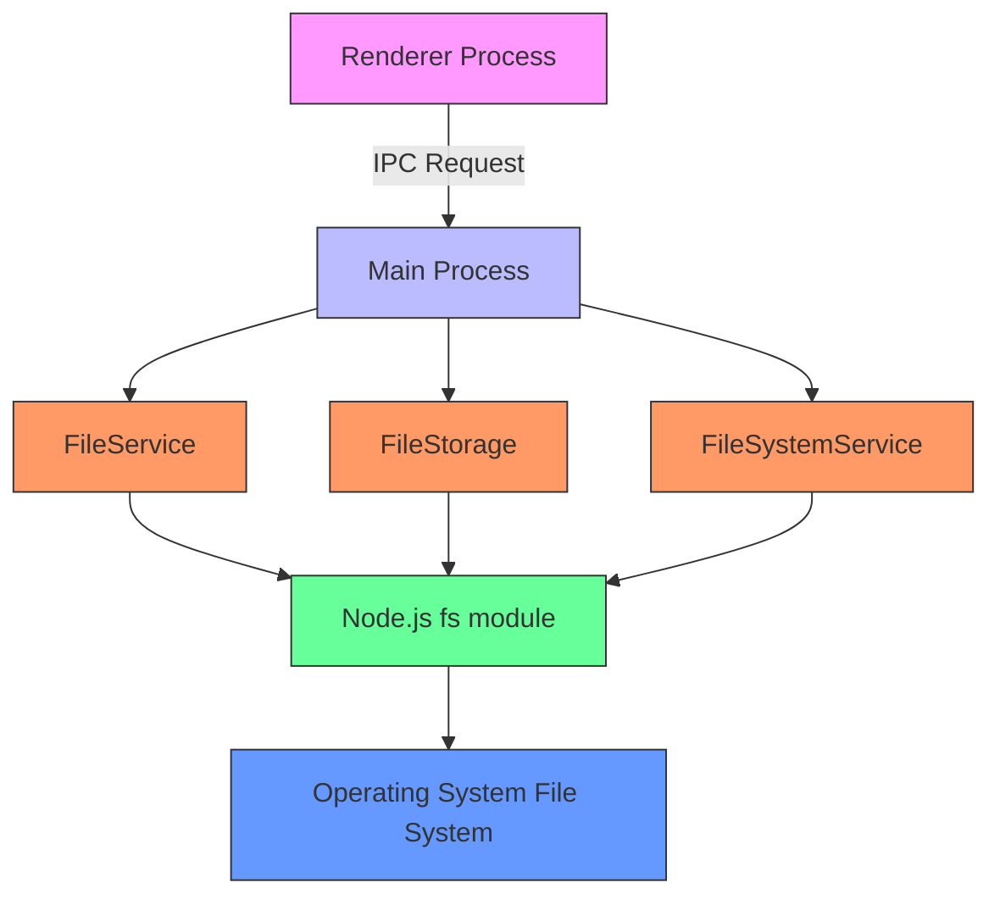
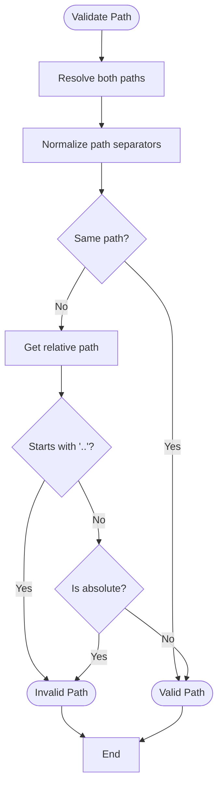
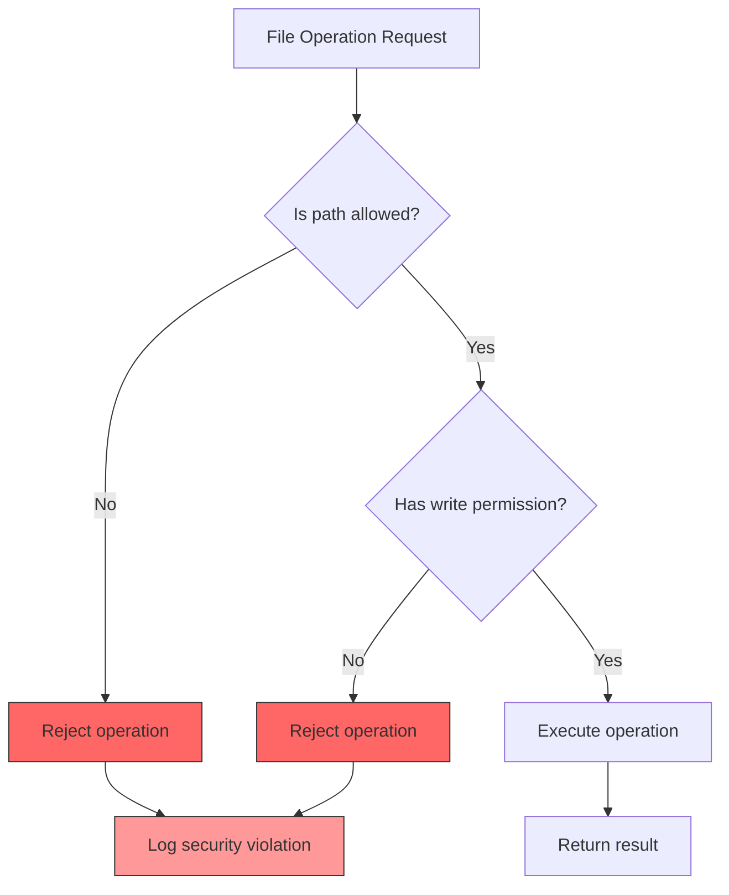
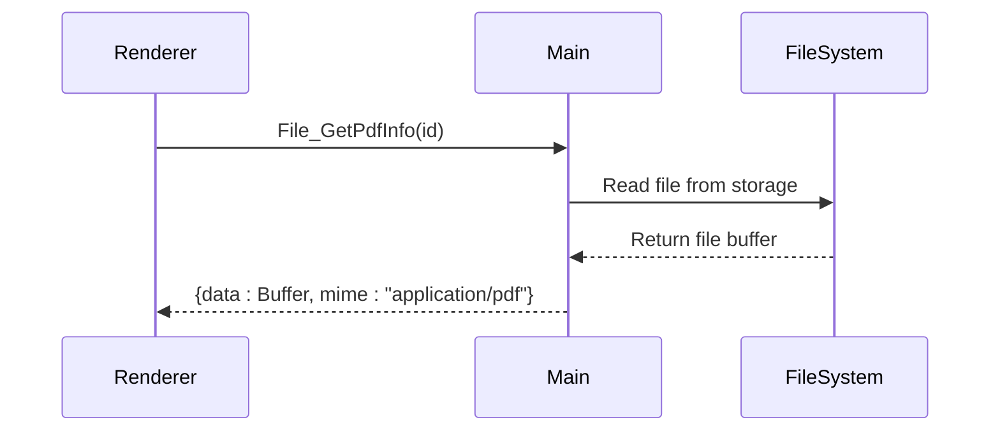
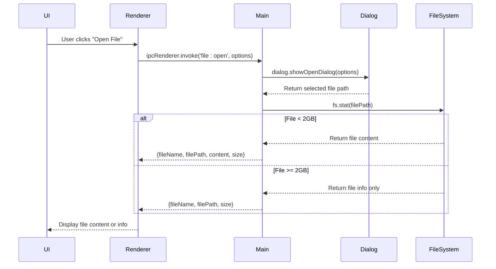
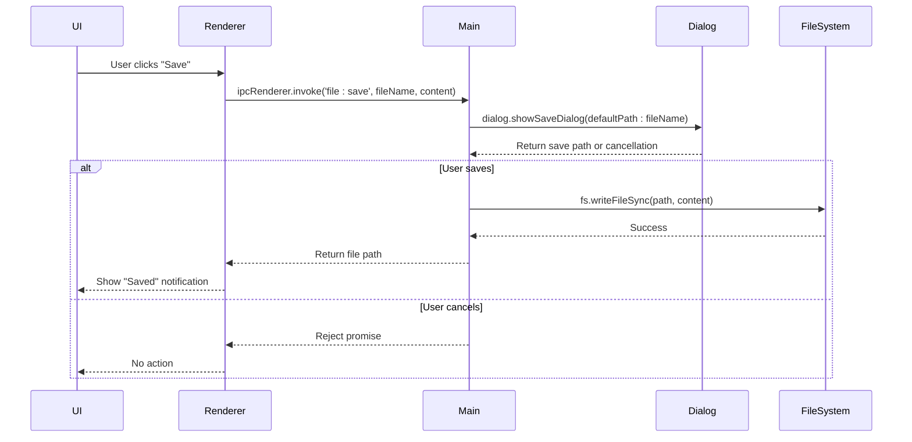

# File System IPC Channels

<cite>
**Referenced Files in This Document**   
- [IpcChannel.ts](file://frontend/packages/shared/IpcChannel.ts)
- [FileService.ts](file://frontend/src/main/services/FileService.ts)
- [FileStorage.ts](file://frontend/src/main/services/FileStorage.ts)
- [FileSystemService.ts](file://frontend/src/main/services/FileSystemService.ts)
- [ipc.ts](file://frontend/src/main/ipc.ts)
- [file.ts](file://frontend/src/main/utils/file.ts)
</cite>

## Table of Contents
1. [Introduction](#introduction)
2. [File System IPC Channels Overview](#file-system-ipc-channels-overview)
3. [File Operation Channels](#file-operation-channels)
4. [Directory Operation Channels](#directory-operation-channels)
5. [Security Model and Path Validation](#security-model-and-path-validation)
6. [Temporary File Management](#temporary-file-management)
7. [PDF Metadata Extraction](#pdf-metadata-extraction)
8. [Performance Considerations](#performance-considerations)
9. [Best Practices for File Dialogs](#best-practices-for-file-dialogs)
10. [Practical Examples](#practical-examples)
11. [Error Handling](#error-handling)

## Introduction

This document provides comprehensive documentation for the file system operations IPC (Inter-Process Communication) channels in the MineContext application. The IPC channels enable secure and efficient communication between the Electron renderer process (frontend) and the main process for various file system operations. These channels follow Electron's recommended security practices by using `ipcMain.handle()` for asynchronous operations, preventing remote code execution vulnerabilities.

The file system operations are organized into several categories including file operations (open, save, read, write), directory operations, temporary file management, and specialized operations like PDF metadata extraction. The implementation includes robust security measures such as path validation, sandboxing considerations, and proper error handling to ensure application stability and user data protection.

**Section sources**
- [IpcChannel.ts](file://frontend/packages/shared/IpcChannel.ts#L139-L165)
- [ipc.ts](file://frontend/src/main/ipc.ts#L311-L335)

## File System IPC Channels Overview

The file system IPC channels are defined in the `IpcChannel` enum and implemented in the main process through the `ipc.ts` file. These channels follow a consistent naming convention with the `file:` prefix for user-facing operations and `fs:` prefix for lower-level file system operations. The architecture separates concerns between different service classes:

- `FileService`: Handles basic file operations like save and read
- `FileStorage`: Manages file storage, uploads, and metadata
- `FileSystemService`: Provides direct file system access

The IPC channels are registered in the `registerIpc` function in `ipc.ts`, which binds each channel to its corresponding handler function. The implementation follows Electron's security best practices by avoiding the use of `remote` module and instead using explicit `ipcMain.handle()` calls for all operations that require main process privileges.



**Diagram sources**
- [IpcChannel.ts](file://frontend/packages/shared/IpcChannel.ts#L139-L165)
- [ipc.ts](file://frontend/src/main/ipc.ts#L45-L610)
- [FileService.ts](file://frontend/src/main/services/FileService.ts#L1-L81)

## File Operation Channels

### File_Open
**Direction**: Main process handler (ipcMain.handle)  
**Payload Structure**: 
- `options`: Electron.OpenDialogOptions object with properties like title, filters, and properties
- Default properties: ['openFile']
- Default filters: { name: 'All files', extensions: ['*'] }

**Return Values**: 
- Success: { fileName: string, filePath: string, content?: Buffer, size: number } | null
- For files < 2GB: Returns file information with content
- For files ≥ 2GB: Returns file information without content to prevent memory issues

**Error Conditions**:
- User cancels the dialog (returns null)
- File system errors (logged but returns null)
- File does not exist or is inaccessible

**Section sources**
- [FileStorage.ts](file://frontend/src/main/services/FileStorage.ts#L393-L425)
- [ipc.ts](file://frontend/src/main/ipc.ts#L312)

### File_Save
**Direction**: Main process handler (ipcMain.handle)  
**Payload Structure**:
- `fileName`: string - Suggested filename for the save dialog
- `content`: string - Content to be saved
- `options`: SaveDialogOptions - Optional dialog configuration

**Return Values**:
- Success: string (file path where the file was saved)
- Error: Promise.reject with error message

**Error Conditions**:
- User cancels the save dialog
- File system write errors
- Insufficient permissions

**Section sources**
- [FileStorage.ts](file://frontend/src/main/services/FileStorage.ts#L444-L470)
- [ipc.ts](file://frontend/src/main/ipc.ts#L316)

### File_Select
**Direction**: Main process handler (ipcMain.handle)  
**Payload Structure**:
- `options`: OpenDialogOptions - Optional dialog configuration

**Return Values**:
- Success: FileMetadata[] | null - Array of selected file metadata or null if canceled
- FileMetadata structure includes: id, origin_name, name, path, created_at, size, ext, type, count

**Error Conditions**:
- User cancels the dialog (returns null)
- File system errors (returns null)

**Section sources**
- [FileStorage.ts](file://frontend/src/main/services/FileStorage.ts#L97-L132)
- [ipc.ts](file://frontend/src/main/ipc.ts#L314)

### File_Read
**Direction**: Main process handler (ipcMain.handle)  
**Payload Structure**:
- `filePath`: string - Absolute path to the file

**Return Values**:
- Success: { success: boolean, data?: string, error?: string }
- Data is read as UTF-8 encoded string

**Error Conditions**:
- File does not exist
- Read permission denied
- File is locked or in use

**Section sources**
- [FileService.ts](file://frontend/src/main/services/FileService.ts#L34-L42)
- [ipc.ts](file://frontend/src/main/ipc.ts#L527)

### File_Delete
**Direction**: Main process handler (ipcMain.handle)  
**Payload Structure**:
- `id`: string - File identifier (UUID)

**Return Values**:
- Success: void (file is deleted from storage directory)
- No explicit return value

**Error Conditions**:
- File does not exist (operation silently succeeds)
- Permission denied
- File is in use

**Section sources**
- [FileStorage.ts](file://frontend/src/main/services/FileStorage.ts#L226-L231)
- [ipc.ts](file://frontend/src/main/ipc.ts#L317)

### File_Write
**Direction**: Main process handler (ipcMain.handle)  
**Payload Structure**:
- `filePath`: string - Absolute path where the file should be written
- `data`: Uint8Array | string - Data to write to the file

**Return Values**:
- Success: void
- No explicit return value

**Error Conditions**:
- Directory does not exist (attempted to be created recursively)
- Write permission denied
- Disk is full

**Section sources**
- [FileStorage.ts](file://frontend/src/main/services/FileStorage.ts#L291-L297)
- [ipc.ts](file://frontend/src/main/ipc.ts#L322)

### File_CreateTempFile
**Direction**: Main process handler (ipcMain.handle)  
**Payload Structure**:
- `fileName`: string - Suggested filename

**Return Values**:
- Success: string - Full path to the created temporary file
- Format: {tempDir}/temp_file_{uuid}_{fileName}

**Error Conditions**:
- Temporary directory cannot be created
- Permission denied

**Section sources**
- [FileStorage.ts](file://frontend/src/main/services/FileStorage.ts#L283-L289)
- [ipc.ts](file://frontend/src/main/ipc.ts#L321)

### File_GetPdfInfo
**Direction**: Main process handler (ipcMain.handle)  
**Payload Structure**:
- `id`: string - File identifier (UUID)

**Return Values**:
- Success: { data: Buffer, mime: string } - PDF file content and MIME type
- MIME type: application/pdf

**Error Conditions**:
- File does not exist
- File is not accessible
- File is not a valid PDF

**Section sources**
- [FileStorage.ts](file://frontend/src/main/services/FileStorage.ts#L360-L366)
- [IpcChannel.ts](file://frontend/packages/shared/IpcChannel.ts#L161)

### Fs_Read
**Direction**: Main process handler (ipcMain.handle)  
**Payload Structure**:
- `pathOrUrl`: string - File path or file:// URL
- `encoding`: BufferEncoding - Optional text encoding

**Return Values**:
- Success: Buffer | string - File content as Buffer or encoded string
- Handles file:// URLs by converting to proper path

**Error Conditions**:
- File does not exist
- Read permission denied
- Invalid URL format

**Section sources**
- [FileSystemService.ts](file://frontend/src/main/services/FileSystemService.ts#L9-L13)
- [ipc.ts](file://frontend/src/main/ipc.ts#L337)

## Directory Operation Channels

### File_SelectFolder
**Direction**: Main process handler (ipcMain.handle)  
**Payload Structure**:
- `options`: OpenDialogOptions - Optional dialog configuration

**Return Values**:
- Success: string | null - Selected folder path or null if canceled

**Error Conditions**:
- User cancels the dialog (returns null)
- File system errors (returns null)

**Section sources**
- [FileStorage.ts](file://frontend/src/main/services/FileStorage.ts#L488-L505)
- [ipc.ts](file://frontend/src/main/ipc.ts#L320)

### File_DeleteDir
**Direction**: Main process handler (ipcMain.handle)  
**Payload Structure**:
- `id`: string - Directory identifier (UUID)

**Return Values**:
- Success: void (directory is recursively deleted)
- No explicit return value

**Error Conditions**:
- Directory does not exist (operation silently succeeds)
- Permission denied
- Directory is not empty and cannot be removed

**Section sources**
- [FileStorage.ts](file://frontend/src/main/services/FileStorage.ts#L233-L238)
- [ipc.ts](file://frontend/src/main/ipc.ts#L318)

## Security Model and Path Validation

The application implements a comprehensive security model for file access with multiple layers of protection:

### Path Validation
The `isPathInside` function in `file.ts` provides robust path validation to prevent directory traversal attacks:



**Key Security Features**:
- Uses `path.resolve()` and `path.relative()` to handle different path formats
- Prevents directory traversal attacks (e.g., "../../../etc/passwd")
- Handles edge cases like "/root/test" vs "/root/test aaa"
- Returns false for invalid path relationships

**Section sources**
- [file.ts](file://frontend/src/main/utils/file.ts#L61-L85)

### Sandboxing Considerations
The application follows Electron security best practices:

1. **No Remote Module**: Avoids using the deprecated `remote` module which could lead to remote code execution
2. **Explicit IPC Channels**: All file operations go through explicitly defined IPC channels
3. **Limited File Access**: File operations are restricted to specific directories:
   - User data directory: `app.getPath('userData')`
   - Temporary directory: `app.getPath('temp')`
   - Configuration directory: `~/.minecontext/config`

4. **Write Permission Validation**: The `hasWritePermission` function checks if the application can write to a directory before performing operations



**Section sources**
- [file.ts](file://frontend/src/main/utils/file.ts#L42-L49)
- [ipc.ts](file://frontend/src/main/ipc.ts#L195-L198)

## Temporary File Management

The application implements a dedicated temporary file management system:

### Temporary Directory
- Location: `path.join(app.getPath('temp'), 'MineContext')`
- Created automatically if it doesn't exist
- Used for temporary files, downloads, and processing

### Temporary File Creation
The `createTempFile` method generates temporary files with:
- Unique UUID-based filenames
- Original filename preserved in the name
- Format: `temp_file_{uuid}_{originalName}`

### Temporary File Cleanup
The `clearTemp` method provides explicit cleanup:
- Recursively removes the temporary directory
- Recreates the directory structure
- Called during application maintenance operations

**Best Practices**:
- Temporary files should be cleaned up after use
- Large temporary files should be processed in chunks
- Temporary directory space should be monitored

**Section sources**
- [file.ts](file://frontend/src/main/utils/file.ts#L146-L148)
- [FileStorage.ts](file://frontend/src/main/services/FileStorage.ts#L283-L289)
- [FileStorage.ts](file://frontend/src/main/services/FileStorage.ts#L388-L391)

## PDF Metadata Extraction

The application provides PDF metadata extraction capabilities through the `File_GetPdfInfo` channel:

### Implementation
- Returns PDF file content as a Buffer
- Sets appropriate MIME type (application/pdf)
- Uses the file storage system to locate and read PDF files

### Current Limitations
The current implementation provides basic file access but does not extract detailed PDF metadata such as:
- Page count
- Document properties (title, author, subject)
- Creation and modification dates
- Embedded fonts and images

### Future Enhancements
To implement full PDF metadata extraction, the application could:
1. Integrate a PDF parsing library like `pdf-lib` or `pdfjs-dist`
2. Add methods to extract specific metadata fields
3. Implement page counting functionality
4. Support PDF form data extraction



**Section sources**
- [FileStorage.ts](file://frontend/src/main/services/FileStorage.ts#L360-L366)
- [IpcChannel.ts](file://frontend/packages/shared/IpcChannel.ts#L161)

## Performance Considerations

### Large File Operations
The application implements specific performance considerations for large files:

1. **File_Open Limitation**: Files larger than 2GB are opened without reading content to prevent memory issues
2. **Streaming Operations**: Where possible, operations should use streaming rather than loading entire files into memory
3. **Progress Indicators**: Long-running operations should provide progress feedback to users

### Optimization Recommendations
1. **Chunked Processing**: Process large files in chunks rather than loading them entirely into memory
2. **Background Processing**: Move intensive file operations to background threads or worker processes
3. **Caching**: Implement caching for frequently accessed file metadata
4. **Lazy Loading**: Load file content only when needed rather than pre-loading

### Memory Management
- Monitor application memory usage during file operations
- Implement proper cleanup of temporary files and buffers
- Use Node.js streams for large file operations when possible

**Section sources**
- [FileStorage.ts](file://frontend/src/main/services/FileStorage.ts#L410-L417)

## Best Practices for Handling File Dialogs in Electron

### Security Best Practices
1. **Always Use showOpenDialog/showSaveDialog**: Never use synchronous versions that can block the main thread
2. **Set Appropriate Filters**: Use file type filters to guide users to select appropriate files
3. **Validate User Input**: Always validate the returned file paths before use
4. **Handle Cancellation Gracefully**: Check for canceled dialogs before processing results

### User Experience Considerations
1. **Provide Clear Titles**: Use descriptive titles for file dialogs
2. **Set Default Paths**: Use relevant default paths based on context
3. **Remember Recent Locations**: Consider implementing recent locations history
4. **Provide Feedback**: Show confirmation messages after file operations

### Code Example - Secure File Dialog Implementation
```typescript
// Always use async/await with proper error handling
const result = await dialog.showOpenDialog({
  title: 'Select Document',
  properties: ['openFile'],
  filters: [
    { name: 'Documents', extensions: ['pdf', 'doc', 'docx', 'txt'] },
    { name: 'All Files', extensions: ['*'] }
  ]
});

if (!result.canceled && result.filePaths.length > 0) {
  // Always validate the path
  const filePath = result.filePaths[0];
  // Process the file
}
```

**Section sources**
- [FileStorage.ts](file://frontend/src/main/services/FileStorage.ts#L397-L403)
- [FileStorage.ts](file://frontend/src/main/services/FileStorage.ts#L489-L493)

## Practical Examples

### Opening User-Selected Files


**Implementation**:
```typescript
// In renderer process
const file = await ipcRenderer.invoke(IpcChannel.File_Open, {
  title: 'Open Document',
  filters: [{ name: 'Documents', extensions: ['pdf', 'doc', 'txt'] }]
});

if (file) {
  if (file.content) {
    // Display file content
    displayContent(file.content.toString());
  } else {
    // Handle large file (show info only)
    showFileInfo(file);
  }
}
```

**Section sources**
- [FileStorage.ts](file://frontend/src/main/services/FileStorage.ts#L393-L425)

### Saving Application Data


**Implementation**:
```typescript
// In renderer process
try {
  const savedPath = await ipcRenderer.invoke(
    IpcChannel.File_Save, 
    'document.txt', 
    'File content to save'
  );
  showNotification(`Document saved to ${savedPath}`);
} catch (error) {
  if (error.message !== 'User canceled the save dialog') {
    showError('Failed to save document');
  }
  // User cancellation is expected, no error shown
}
```

**Section sources**
- [FileStorage.ts](file://frontend/src/main/services/FileStorage.ts#L444-L470)

## Error Handling

The file system IPC channels implement comprehensive error handling:

### Error Types
1. **User Cancellation**: Dialogs return null or reject with "User canceled" message
2. **File System Errors**: Caught and logged, with user-friendly error messages returned
3. **Permission Errors**: Checked before operations when possible
4. **Validation Errors**: Path validation failures are handled gracefully

### Error Response Patterns
- **File operations**: Return objects with `success: boolean` and optional `error: string`
- **Dialog operations**: Return null for cancellation, throw for system errors
- **Void operations**: Throw errors that should be caught by callers

### Logging Strategy
- All errors are logged using the application logger
- Sensitive information is redacted from error logs
- Error context is preserved for debugging

**Section sources**
- [FileService.ts](file://frontend/src/main/services/FileService.ts#L28-L31)
- [FileService.ts](file://frontend/src/main/services/FileService.ts#L38-L41)
- [FileStorage.ts](file://frontend/src/main/services/FileStorage.ts#L422-L424)