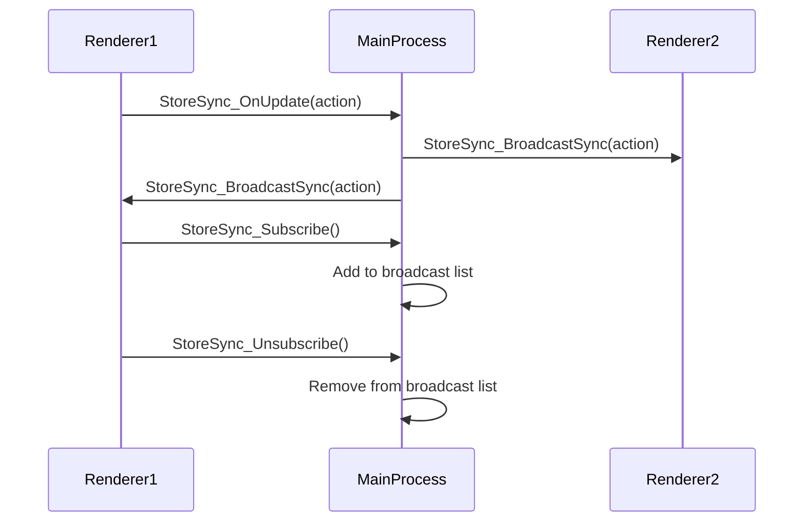

# IPC Communication Reference

<cite>
**Referenced Files in This Document**   
- [IpcChannel.ts](file://frontend/packages/shared/IpcChannel.ts)
- [ipc.ts](file://frontend/src/main/ipc.ts)
- [index.ts](file://frontend/src/preload/index.ts)
- [ipc-server-push-channel.ts](file://frontend/packages/shared/ipc-server-push-channel.ts)
- [server-push-api.tsx](file://frontend/src/preload/server-push-api.tsx)
- [StoreSyncService.ts](file://frontend/src/main/services/StoreSyncService.ts)
- [index.html](file://frontend/src/renderer/index.html)
</cite>

## Table of Contents
1. [Introduction](#introduction)
2. [IPC Architecture Overview](#ipc-architecture-overview)
3. [Channel Categories and Usage](#channel-categories-and-usage)
4. [Application Control Channels](#application-control-channels)
5. [Notification Channels](#notification-channels)
6. [Configuration Channels](#configuration-channels)
7. [File Operations Channels](#file-operations-channels)
8. [System Integration Channels](#system-integration-channels)
9. [Database Operations Channels](#database-operations-channels)
10. [Backend Management Channels](#backend-management-channels)
11. [Screen Monitor Channels](#screen-monitor-channels)
12. [Event-Type Channels](#event-type-channels)
13. [Store Synchronization](#store-synchronization)
14. [Asynchronous Communication and Error Handling](#asynchronous-communication-and-error-handling)
15. [Security Considerations](#security-considerations)
16. [Performance Implications](#performance-implications)
17. [Adding New IPC Channels](#adding-new-ipc-channels)

## Introduction

The IPC (Inter-Process Communication) system in MineContext facilitates secure and efficient communication between Electron's main process and renderer processes. This documentation provides a comprehensive reference for all IPC channels defined in the application, categorized by functionality and detailing their usage patterns, payload structures, and implementation examples.

The IPC system follows Electron's recommended security practices, using `ipcRenderer.invoke` and `ipcMain.handle` for request-response communication, and `ipcRenderer.on` with `webContents.send` for event broadcasting. The architecture includes both request-response channels for direct communication and event-type channels for state change notifications.

**Section sources**
- [IpcChannel.ts](file://frontend/packages/shared/IpcChannel.ts)
- [ipc.ts](file://frontend/src/main/ipc.ts)
- [index.ts](file://frontend/src/preload/index.ts)

## IPC Architecture Overview

The IPC architecture in MineContext follows a structured pattern with clear separation between the main process (Node.js environment) and renderer process (browser environment). Communication is facilitated through predefined channels that ensure type safety and maintainability.

```mermaid
graph TB
subgraph "Main Process"
A[ipcMain.handle] --> B[Service Layer]
B --> C[Database]
B --> D[File System]
B --> E[External Services]
end
subgraph "Renderer Process"
F[ipcRenderer.invoke] --> G[Preload API]
G --> H[React Components]
end
F < --> |IPC Channel| A
I[webContents.send] --> J[ipcRenderer.on]
J --> K[State Updates]
style A fill:#4CAF50,stroke:#388E3C
style F fill:#2196F3,stroke:#1976D2
style I fill:#FF9800,stroke:#F57C00
style J fill:#FF9800,stroke:#F57C00
```

**Diagram sources**
- [ipc.ts](file://frontend/src/main/ipc.ts)
- [index.ts](file://frontend/src/preload/index.ts)

**Section sources**
- [ipc.ts](file://frontend/src/main/ipc.ts)
- [index.ts](file://frontend/src/preload/index.ts)

## Channel Categories and Usage

The IPC channels in MineContext are organized into logical categories based on their functionality. Each channel follows a consistent naming convention: `category:action`, where category represents the functional domain and action describes the specific operation.

The system implements two primary communication patterns:
1. **Request-Response**: Using `ipcRenderer.invoke` and `ipcMain.handle` for synchronous-like communication
2. **Event Broadcasting**: Using `webContents.send` and `ipcRenderer.on` for one-way notifications

All channels are defined in the `IpcChannel` enum in `IpcChannel.ts`, providing type safety and centralized management of channel names.

**Section sources**
- [IpcChannel.ts](file://frontend/packages/shared/IpcChannel.ts)

## Application Control Channels

Application control channels manage core application functionality, lifecycle events, and global settings.

### App Information and Control
```typescript
// Channel: App_Info
// Direction: main ← renderer
// Purpose: Retrieve application metadata and system information

// Usage in renderer:
const appInfo = await window.api.getAppInfo();

// Handler in main process:
ipcMain.handle(IpcChannel.App_Info, () => ({
  version: app.getVersion(),
  isPackaged: app.isPackaged,
  appPath: app.getAppPath(),
  filesPath: getFilesDir(),
  configPath: getConfigDir(),
  appDataPath: app.getPath('userData'),
  logsPath: path.dirname(Logger.transports.file.getFile().path),
  arch: arch(),
  isPortable: isWin && 'PORTABLE_EXECUTABLE_DIR' in process.env,
  installPath: path.dirname(app.getPath('exe'))
}))
```

### Application Lifecycle
```typescript
// Channel: App_Reload
// Direction: main ← renderer
// Purpose: Reload the application window

// Usage in renderer:
await window.api.reload();

// Handler in main process:
ipcMain.handle(IpcChannel.App_Reload, () => mainWindow.reload());
```

### Update Management
```typescript
// Channel: App_CheckForUpdate
// Direction: main ← renderer
// Purpose: Check for application updates

// Usage in renderer:
const updateInfo = await window.api.checkForUpdate();

// Handler in main process:
ipcMain.handle(IpcChannel.App_CheckForUpdate, async () => {
  return await appUpdater.checkForUpdates();
});
```

**Section sources**
- [IpcChannel.ts](file://frontend/packages/shared/IpcChannel.ts#L1-L47)
- [ipc.ts](file://frontend/src/main/ipc.ts#L62-L101)

## Notification Channels

Notification channels handle user notifications and interaction events.

### Send Notification
```typescript
// Channel: Notification_Send
// Direction: main ← renderer
// Payload: Notification object
// Return: void
// Usage context: Display user notifications

// Usage in renderer:
await window.api.notification.send({
  title: 'Update Available',
  message: 'A new version is ready to install',
  type: 'info'
});
```

### Notification Click Handler
```typescript
// Channel: Notification_OnClick
// Direction: main ← renderer
// Payload: Notification object
// Return: void
// Usage context: Handle user interaction with notifications

// Handler in main process:
ipcMain.handle(IpcChannel.Notification_OnClick, (_, notification: Notification) => {
  mainWindow.webContents.send(IpcServerPushChannel.NotificationClick, notification);
});
```

**Section sources**
- [IpcChannel.ts](file://frontend/packages/shared/IpcChannel.ts#L54-L56)
- [ipc.ts](file://frontend/src/main/ipc.ts#L282-L287)
- [index.ts](file://frontend/src/preload/index.ts#L20-L22)

## Configuration Channels

Configuration channels manage application settings and preferences.

### Set Configuration
```typescript
// Channel: Config_Set
// Direction: main ← renderer
// Payload: key-value pair
// Return: boolean
// Usage context: Persist user preferences

// Usage in renderer:
await window.dbAPI.setSetting('theme', 'dark');
```

### Get Configuration
```typescript
// Channel: Config_Get
// Direction: main ← renderer
// Payload: key
// Return: configuration value
// Usage context: Retrieve user preferences

// Usage in renderer:
const theme = await window.dbAPI.getSetting('theme');
```

**Section sources**
- [IpcChannel.ts](file://frontend/packages/shared/IpcChannel.ts#L66-L68)

## File Operations Channels

File operations channels handle file system interactions and data persistence.

### File Reading and Writing
```typescript
// Channel: File_Read
// Direction: main ← renderer
// Payload: filePath
// Return: file content
// Usage context: Read files from the file system

// Usage in renderer:
const content = await window.fileService.readFile('/path/to/file.txt');
```

### File Management
```typescript
// Channel: File_Save
// Direction: main ← renderer
// Payload: fileName, fileData
// Return: success status
// Usage context: Save files to the file system

// Usage in renderer:
await window.fileService.saveFile('document.txt', data);
```

**Section sources**
- [IpcChannel.ts](file://frontend/packages/shared/IpcChannel.ts#L140-L165)
- [ipc.ts](file://frontend/src/main/ipc.ts#L523-L532)
- [index.ts](file://frontend/src/preload/index.ts#L110-L115)

## System Integration Channels

System integration channels provide access to operating system features and hardware capabilities.

### System Information
```typescript
// Channel: System_GetDeviceType
// Direction: main ← renderer
// Return: device type string
// Usage context: Determine the current operating system

// Handler in main process:
ipcMain.handle(IpcChannel.System_GetDeviceType, () => 
  isMac ? 'mac' : isWin ? 'windows' : 'linux'
);
```

### Developer Tools
```typescript
// Channel: System_ToggleDevTools
// Direction: main ← renderer
// Purpose: Toggle developer tools visibility

// Usage in renderer:
await window.api.toggleDevTools();
```

**Section sources**
- [IpcChannel.ts](file://frontend/packages/shared/IpcChannel.ts#L196-L201)
- [ipc.ts](file://frontend/src/main/ipc.ts#L290-L295)

## Database Operations Channels

Database operations channels provide access to the application's persistent data storage.

### Vault Management
```typescript
// Channel: Database_GetAllVaults
// Direction: main ← renderer
// Return: array of vault objects
// Usage context: Retrieve all vaults from the database

// Usage in renderer:
const vaults = await window.dbAPI.getAllVaults();
```

### Task Management
```typescript
// Channel: Database_AddTask
// Direction: main ← renderer
// Payload: task data
// Return: inserted task ID
// Usage context: Create new tasks

// Usage in renderer:
const newTask = await window.dbAPI.addTask({
  content: 'Complete documentation',
  status: 0,
  start_time: '2025-01-01 09:00:00'
});
```

### Activity Tracking
```typescript
// Channel: Database_GetLatestActivity
// Direction: main ← renderer
// Return: latest activity record
// Usage context: Display recent user activity

// Usage in renderer:
const latestActivity = await window.dbAPI.getLatestActivity();
```

**Section sources**
- [IpcChannel.ts](file://frontend/packages/shared/IpcChannel.ts#L295-L324)
- [ipc.ts](file://frontend/src/main/ipc.ts#L367-L488)
- [index.ts](file://frontend/src/preload/index.ts#L47-L84)

## Backend Management Channels

Backend management channels interface with the application's backend services.

### Backend Status
```typescript
// Channel: Backend_GetStatus
// Direction: main ← renderer
// Return: backend status object
// Usage context: Monitor backend service health

// Handler in main process:
ipcMain.handle(IpcChannel.Backend_GetStatus, () => ({
  status: getBackendStatus(),
  port: getBackendPort(),
  timestamp: new Date().toISOString()
}));
```

### Backend Port
```typescript
// Channel: Backend_GetPort
// Direction: main ← renderer
// Return: backend port number
// Usage context: Connect to backend services

// Usage in renderer:
const port = await window.api.getBackendPort();
```

**Section sources**
- [IpcChannel.ts](file://frontend/packages/shared/IpcChannel.ts#L326-L328)
- [ipc.ts](file://frontend/src/main/ipc.ts#L534-L544)

## Screen Monitor Channels

Screen monitor channels handle screenshot capture and screen monitoring functionality.

### Screenshot Operations
```typescript
// Channel: Screen_Monitor_Take_Screenshot
// Direction: main ← renderer
// Payload: sourceId, batchTime
// Return: screenshot result
// Usage context: Capture screenshots of specific sources

// Usage in renderer:
const screenshot = await window.screenMonitorAPI.takeScreenshot(sourceId, batchTime);
```

### Permissions and Settings
```typescript
// Channel: Screen_Monitor_Check_Permissions
// Direction: main ← renderer
// Return: boolean indicating permission status
// Usage context: Verify screen capture permissions

// Usage in renderer:
const hasPermission = await window.screenMonitorAPI.checkPermissions();
```

**Section sources**
- [IpcChannel.ts](file://frontend/packages/shared/IpcChannel.ts#L284-L294)
- [ipc.ts](file://frontend/src/main/ipc.ts#L490-L522)
- [index.ts](file://frontend/src/preload/index.ts#L87-L101)

## Event-Type Channels

Event-type channels broadcast state changes and system events to subscribed components.

### State Change Notifications
```typescript
// Channel: ReduxStateChange
// Direction: main → renderer
// Purpose: Broadcast Redux store state changes

// Usage in renderer:
mainWindow.webContents.send(IpcChannel.ReduxStateChange, state);
```

### Update Availability
```typescript
// Channel: UpdateAvailable
// Direction: main → renderer
// Purpose: Notify renderer when updates are available

// Handler in main process:
appUpdater.on('update-available', () => {
  mainWindow.webContents.send(IpcChannel.UpdateAvailable);
});
```

### Theme Updates
```typescript
// Channel: ThemeUpdated
// Direction: main → renderer
// Purpose: Notify renderer of theme changes

// Usage:
mainWindow.webContents.send(IpcChannel.ThemeUpdated, { theme: 'dark' });
```

**Section sources**
- [IpcChannel.ts](file://frontend/packages/shared/IpcChannel.ts#L221-L223)
- [ipc-server-push-channel.ts](file://frontend/packages/shared/ipc-server-push-channel.ts)

## Store Synchronization

The store synchronization system enables state sharing between multiple windows and processes.

### StoreSync Service Architecture


**Diagram sources**
- [StoreSyncService.ts](file://frontend/src/main/services/StoreSyncService.ts)
- [StoreSyncService.ts](file://frontend/src/renderer/src/services/StoreSyncService.ts)

### Synchronization Flow
1. Renderer calls `window.api.storeSync.subscribe()` to join the synchronization group
2. Main process adds the window to its broadcast list
3. When any renderer dispatches a synced action, it sends `StoreSync_OnUpdate` to the main process
4. Main process validates the action and broadcasts it to all other subscribed renderers via `StoreSync_BroadcastSync`
5. Renderers receive the broadcast and dispatch the action with a `fromSync` flag to prevent infinite loops

**Section sources**
- [StoreSyncService.ts](file://frontend/src/main/services/StoreSyncService.ts)
- [StoreSyncService.ts](file://frontend/src/renderer/src/services/StoreSyncService.ts)

## Asynchronous Communication and Error Handling

The IPC system in MineContext follows asynchronous communication patterns with comprehensive error handling.

### Request-Response Pattern
```typescript
// Always use async/await for IPC calls
try {
  const result = await window.dbAPI.getAllVaults();
  console.log('Vaults:', result);
} catch (error) {
  console.error('Failed to fetch vaults:', error);
}
```

### Error Handling Best Practices
1. Wrap all IPC calls in try-catch blocks
2. Provide meaningful error messages to users
3. Implement retry logic for transient failures
4. Log errors for debugging purposes
5. Gracefully handle cases where the main process is not responsive

```typescript
// Example with retry logic
async function getVaultsWithRetry(id: number, maxRetries = 3) {
  let lastError;
  
  for (let i = 0; i < maxRetries; i++) {
    try {
      return await window.dbAPI.getVaultById(id);
    } catch (error) {
      lastError = error;
      if (i < maxRetries - 1) {
        await new Promise(resolve => setTimeout(resolve, 1000 * (i + 1)));
      }
    }
  }
  
  throw lastError;
}
```

**Section sources**
- [ipc.ts](file://frontend/src/main/ipc.ts)
- [index.ts](file://frontend/src/preload/index.ts)

## Security Considerations

The IPC system implements several security measures to protect against common vulnerabilities.

### Input Validation
All IPC handlers validate input parameters to prevent injection attacks and ensure data integrity.

```typescript
// Example of input validation
ipcMain.handle(IpcChannel.File_Read, async (_, filePath: string) => {
  // Validate file path
  if (!filePath || typeof filePath !== 'string') {
    throw new Error('Invalid file path');
  }
  
  // Ensure path is within allowed directories
  if (!isPathInside(filePath, allowedDirectory)) {
    throw new Error('Access denied');
  }
  
  return FileService.readFile(filePath);
});
```

### Context Isolation
The application uses Electron's context isolation feature to prevent prototype pollution and other security issues.

```typescript
// Preload script uses contextBridge for secure API exposure
if (process.contextIsolated) {
  contextBridge.exposeInMainWorld('api', api);
  contextBridge.exposeInMainWorld('dbAPI', dbAPI);
}
```

### Secure Communication
All IPC channels follow the principle of least privilege, exposing only necessary functionality to the renderer process.

**Section sources**
- [index.ts](file://frontend/src/preload/index.ts)
- [ipc.ts](file://frontend/src/main/ipc.ts)

## Performance Implications

Frequent IPC calls can impact application performance and should be optimized.

### Batch Operations
When possible, batch multiple operations into a single IPC call rather than making multiple individual calls.

```typescript
// Instead of multiple calls
await window.dbAPI.addTask(task1);
await window.dbAPI.addTask(task2);
await window.dbAPI.addTask(task3);

// Use a batch operation
await window.dbAPI.addTasks([task1, task2, task3]);
```

### Debouncing and Throttling
For high-frequency events, implement debouncing or throttling to reduce IPC traffic.

```typescript
// Example of debounced state updates
let pendingUpdate = null;
let debounceTimer = null;

function scheduleStateUpdate(state) {
  if (debounceTimer) {
    clearTimeout(debounceTimer);
  }
  
  pendingUpdate = state;
  
  debounceTimer = setTimeout(() => {
    mainWindow.webContents.send(IpcChannel.ReduxStateChange, pendingUpdate);
    pendingUpdate = null;
    debounceTimer = null;
  }, 100);
}
```

### Caching
Cache frequently accessed data to minimize IPC calls.

**Section sources**
- [ipc.ts](file://frontend/src/main/ipc.ts)
- [index.ts](file://frontend/src/preload/index.ts)

## Adding New IPC Channels

When adding new IPC channels, follow the established patterns and conventions.

### Step 1: Define the Channel
Add the new channel to the `IpcChannel` enum with a descriptive name following the `category:action` pattern.

```typescript
// In IpcChannel.ts
export enum IpcChannel {
  // ... existing channels
  NewCategory_DoSomething = 'new-category:do-something'
}
```

### Step 2: Implement the Main Process Handler
Create the handler in the main process using `ipcMain.handle`.

```typescript
// In ipc.ts
ipcMain.handle(IpcChannel.NewCategory_DoSomething, async (_, param1: string, param2: number) => {
  // Implement the functionality
  return { success: true, result: 'operation completed' };
});
```

### Step 3: Expose in Preload API
Add the new method to the appropriate API object in the preload script.

```typescript
// In preload/index.ts
const newCategoryAPI = {
  doSomething: (param1: string, param2: number) => 
    ipcRenderer.invoke(IpcChannel.NewCategory_DoSomething, param1, param2)
};

contextBridge.exposeInMainWorld('newCategoryAPI', newCategoryAPI);
```

### Step 4: Document the Channel
Update this documentation with the new channel's details, including:
- Channel name
- Direction
- Payload structure
- Return values
- Usage context
- Example code

**Section sources**
- [IpcChannel.ts](file://frontend/packages/shared/IpcChannel.ts)
- [ipc.ts](file://frontend/src/main/ipc.ts)
- [index.ts](file://frontend/src/preload/index.ts)