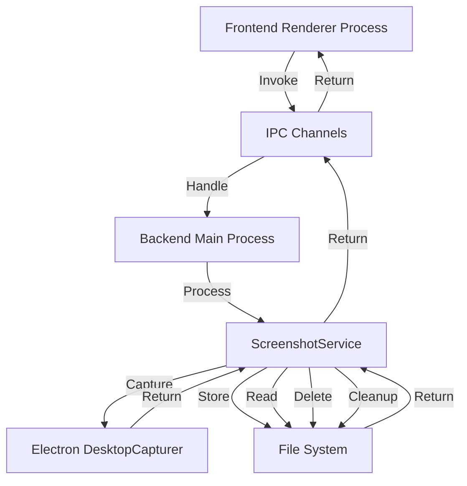
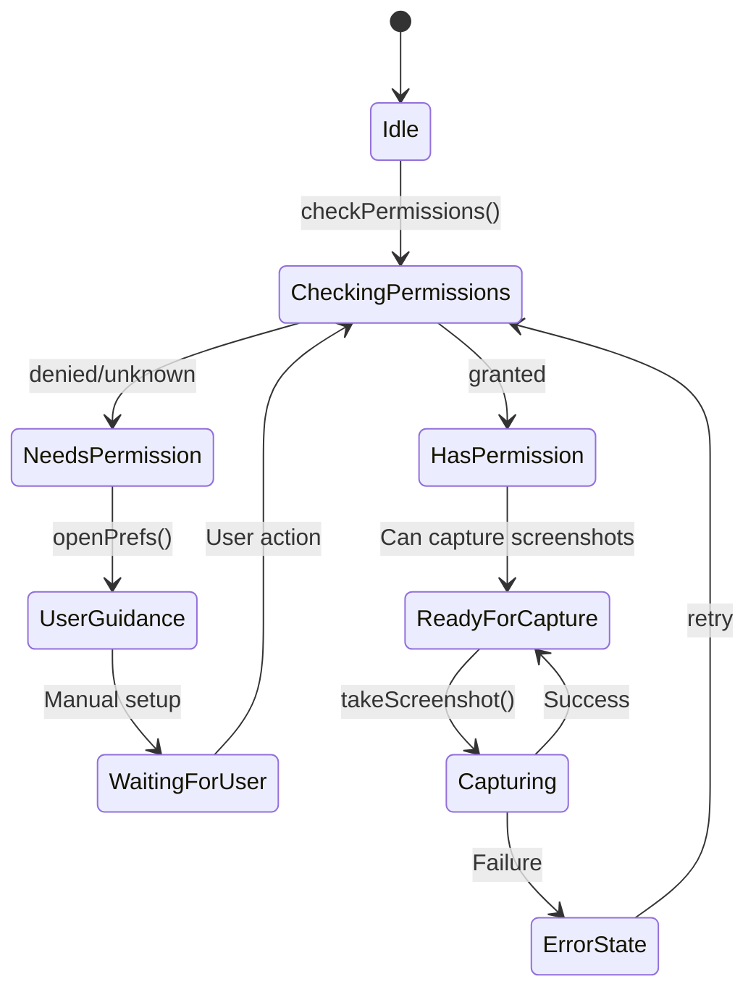
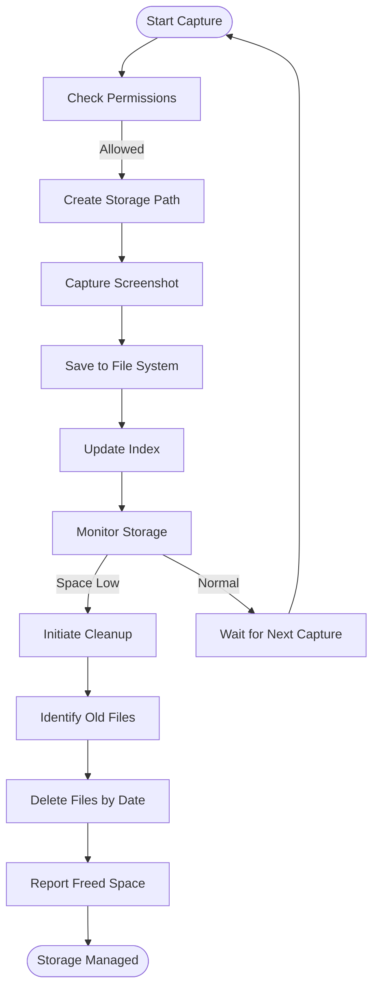

# Screen Monitoring IPC Channels

<cite>
**Referenced Files in This Document**   
- [IpcChannel.ts](file://frontend/packages/shared/IpcChannel.ts)
- [ScreenshotService.ts](file://frontend/src/main/services/ScreenshotService.ts)
- [ipc.ts](file://frontend/src/main/ipc.ts)
- [preload/index.ts](file://frontend/src/preload/index.ts)
- [screenshot.py](file://opencontext/context_capture/screenshot.py)
- [example_screenshot_processor.py](file://examples/example_screenshot_processor.py)
- [example_screenshot_to_insights.py](file://examples/example_screenshot_to_insights.py)
</cite>

## Table of Contents
1. [Introduction](#introduction)
2. [IPC Channel Overview](#ipc-channel-overview)
3. [Channel Specifications](#channel-specifications)
4. [Permission Model](#permission-model)
5. [Image Storage Lifecycle](#image-storage-lifecycle)
6. [Performance Considerations](#performance-considerations)
7. [Error Handling](#error-handling)
8. [Practical Examples](#practical-examples)
9. [Conclusion](#conclusion)

## Introduction
This document provides comprehensive documentation for the screen monitoring and screenshot capture IPC (Inter-Process Communication) channels in the MineContext application. The system enables secure and efficient communication between the frontend and backend components for screen monitoring operations, including permission checking, screenshot capture, retrieval, and management.

The IPC channels are designed to facilitate screen monitoring functionality while maintaining platform-specific security requirements and performance optimization. This documentation covers all aspects of the IPC channels, including their direction, payload structure, return values, platform-specific behaviors, and practical usage examples.

The system architecture leverages Electron's IPC mechanism to bridge the gap between the renderer process (frontend) and main process (backend), ensuring secure and efficient communication for screen monitoring operations.

**Section sources**
- [IpcChannel.ts](file://frontend/packages/shared/IpcChannel.ts)
- [ScreenshotService.ts](file://frontend/src/main/services/ScreenshotService.ts)

## IPC Channel Overview
The screen monitoring system implements a comprehensive set of IPC channels that enable various screenshot capture and management operations. These channels follow a consistent pattern where the frontend initiates requests and the backend processes them, returning appropriate responses.

The primary IPC channels for screen monitoring include:
- **Screen_Monitor_Check_Permissions**: Checks if the application has the necessary permissions to capture screenshots
- **Screen_Monitor_Take_Screenshot**: Captures a screenshot of the specified source
- **Screen_Monitor_Get_Visible_Sources**: Retrieves a list of currently visible capture sources
- **Screen_Monitor_Delete_Screenshot**: Deletes a specific screenshot file
- **Screen_Monitor_Get_Screenshots_By_Date**: Retrieves screenshots for a specific date
- **Screen_Monitor_Cleanup_Old_Screenshots**: Cleans up old screenshot files based on retention policy

These channels are implemented using Electron's `ipcMain.handle` and `ipcRenderer.invoke` methods, establishing a request-response pattern between the frontend and backend processes. The system also includes additional channels for reading image data as Base64, getting capture sources, and managing settings.



**Diagram sources**
- [ipc.ts](file://frontend/src/main/ipc.ts#L489-L521)
- [ScreenshotService.ts](file://frontend/src/main/services/ScreenshotService.ts#L22-L112)

## Channel Specifications
This section details the specifications for each screen monitoring IPC channel, including direction, payload structure, return values, and platform-specific behaviors.

### Screen_Monitor_Check_Permissions
This channel checks whether the application has the necessary permissions to capture screenshots.

**Direction**: Frontend → Backend (Request-Response)

**Payload**: None

**Return Value**:
```typescript
Promise<boolean>
```
Returns `true` if permission is granted, otherwise `false`.

**Platform-Specific Behaviors**:
- **macOS**: Uses `systemPreferences.getMediaAccessStatus('screen')` to check screen recording permissions
- **Windows/Linux**: Always returns `true` as there is no standard API for permission checking

**Implementation**:
```typescript
async checkPermissions(): Promise<boolean> {
  if (isMac) {
    const status = systemPreferences.getMediaAccessStatus('screen')
    return status === 'granted'
  }
  return true
}
```

**Section sources**
- [ScreenshotService.ts](file://frontend/src/main/services/ScreenshotService.ts#L28-L34)
- [IpcChannel.ts](file://frontend/packages/shared/IpcChannel.ts#L284)

### Screen_Monitor_Take_Screenshot
This channel captures a screenshot of the specified source.

**Direction**: Frontend → Backend (Request-Response)

**Payload**:
```typescript
(sourceId: string, batchTime: Dayjs)
```
- **sourceId**: The ID of the screen or window to capture (e.g., "screen:0", "window:123")
- **batchTime**: The time object used to construct the save path

**Return Value**:
```typescript
Promise<{ 
  success: boolean; 
  screenshotInfo?: { url: string }; 
  error?: string 
}>
```

**Payload Structure**:
- **success**: Boolean indicating if the operation was successful
- **screenshotInfo**: Object containing the URL of the saved screenshot
- **error**: Error message if the operation failed

**Implementation**:
The screenshot is saved to a directory structure based on the date and time. The file path follows this pattern:
```
userDataPath/Data/screenshot/activity/YYYY-MM-DD/HH-mm-ss/appName-sourceId.png
```

**Platform-Specific Behaviors**:
- **macOS**: Supports capturing windows across different spaces using native capture helpers
- **Windows/Linux**: Uses Electron's desktopCapturer for screenshot capture

**Section sources**
- [ScreenshotService.ts](file://frontend/src/main/services/ScreenshotService.ts#L52-L112)
- [IpcChannel.ts](file://frontend/packages/shared/IpcChannel.ts#L285)

### Screen_Monitor_Get_Visible_Sources
This channel retrieves a list of currently visible capture sources.

**Direction**: Frontend → Backend (Request-Response)

**Payload**: None

**Return Value**:
```typescript
Promise<{ 
  success: boolean; 
  sources?: CaptureSource[]; 
  error?: string 
}>
```

**Payload Structure**:
- **success**: Boolean indicating if the operation was successful
- **sources**: Array of `CaptureSource` objects with the following properties:
  - **id**: Unique identifier for the source
  - **name**: Display name of the source
  - **type**: Type of source ('screen' or 'window')
  - **thumbnail**: Data URL of the source thumbnail
  - **appIcon**: Data URL of the application icon (for windows)
  - **isVisible**: Boolean indicating if the source is currently visible
- **error**: Error message if the operation failed

**Implementation**:
The system uses Electron's `desktopCapturer.getSources()` method with minimal thumbnail size to efficiently retrieve visible sources. On macOS, it also uses AppleScript to detect applications with windows on any space, not just the current one.

**Section sources**
- [ScreenshotService.ts](file://frontend/src/main/services/ScreenshotService.ts#L212-L229)
- [get-capture-sources.ts](file://frontend/src/main/utils/get-capture-sources.ts#L630-L776)

### Screen_Monitor_Delete_Screenshot
This channel deletes a specific screenshot file.

**Direction**: Frontend → Backend (Request-Response)

**Payload**:
```typescript
(filePath: string)
```
- **filePath**: The full path of the screenshot file to delete

**Return Value**:
```typescript
Promise<{ 
  success: boolean; 
  error?: string 
}>
```

**Payload Structure**:
- **success**: Boolean indicating if the operation was successful
- **error**: Error message if the operation failed

**Implementation**:
The system uses Node.js `fs.promises.unlink()` to delete the specified file. The operation is atomic and will fail if the file does not exist or cannot be deleted due to permissions.

**Section sources**
- [ScreenshotService.ts](file://frontend/src/main/services/ScreenshotService.ts#L236-L244)
- [IpcChannel.ts](file://frontend/packages/shared/IpcChannel.ts#L288)

### Screen_Monitor_Get_Screenshots_By_Date
This channel retrieves all screenshots for a specified date.

**Direction**: Frontend → Backend (Request-Response)

**Payload**:
```typescript
(date?: string)
```
- **date**: Optional date string in YYYYMMDD format. If not provided, uses the current date.

**Return Value**:
```typescript
Promise<{ 
  success: boolean; 
  screenshots?: Array<{
    id: string;
    date: string;
    timestamp: number;
    image_url: string;
    description: string;
    created_at: string;
    group_id: string;
  }>; 
  error?: string 
}>
```

**Payload Structure**:
- **success**: Boolean indicating if the operation was successful
- **screenshots**: Array of screenshot objects with metadata
- **error**: Error message if the operation failed

**Implementation**:
The system recursively traverses the directory structure to find all screenshots for the specified date. Screenshots are organized by date and group interval time, with each screenshot file containing timestamp information in its filename.

**Section sources**
- [ScreenshotService.ts](file://frontend/src/main/services/ScreenshotService.ts#L119-L184)
- [IpcChannel.ts](file://frontend/packages/shared/IpcChannel.ts#L291)

### Screen_Monitor_Cleanup_Old_Screenshots
This channel cleans up old screenshot files based on a retention policy.

**Direction**: Frontend → Backend (Request-Response)

**Payload**:
```typescript
(retentionDays?: number)
```
- **retentionDays**: Optional number of days to retain screenshots. Defaults to 15 days.

**Return Value**:
```typescript
Promise<{ 
  success: boolean; 
  deletedCount?: number; 
  deletedSize?: number; 
  error?: string 
}>
```

**Payload Structure**:
- **success**: Boolean indicating if the operation was successful
- **deletedCount**: Number of directories deleted
- **deletedSize**: Total size of deleted files in bytes
- **error**: Error message if the operation failed

**Implementation**:
The system calculates a cutoff date based on the retention period and deletes all screenshot directories with dates earlier than this cutoff. The cleanup process is performed at the directory level for efficiency, removing entire date directories at once.

**Section sources**
- [ScreenshotService.ts](file://frontend/src/main/services/ScreenshotService.ts#L277-L338)
- [IpcChannel.ts](file://frontend/packages/shared/IpcChannel.ts#L292)

## Permission Model
The screen monitoring system implements a platform-specific permission model to ensure compliance with operating system security requirements.

### macOS Permission Model
On macOS, the application must be granted explicit screen recording permissions through the system's privacy settings. The permission model works as follows:

1. **Permission Check**: The `checkPermissions` method uses `systemPreferences.getMediaAccessStatus('screen')` to determine if the application has been granted screen recording permissions.

2. **Permission Request**: If permissions are not granted, the application can guide the user to the appropriate system preferences page using the `openPrefs` method, which opens:
   ```
   x-apple.systempreferences:com.apple.preference.security?Privacy_ScreenCapture
   ```

3. **Permission States**: The system recognizes three states:
   - **granted**: The application has screen recording permissions
   - **denied**: The user has explicitly denied permissions
   - **unknown**: The permission status is not yet determined

4. **User Experience**: When permissions are denied, the application displays a clear message instructing the user to grant permissions in System Preferences > Security & Privacy > Screen Recording.

### Windows Permission Model
Windows does not have a standardized API for checking screen capture permissions. The system assumes that if the application is running, it has the necessary permissions to capture screenshots. However, certain security software or group policies may interfere with screenshot capture.

### Linux Permission Model
Similar to Windows, Linux does not have a standardized permission system for screen capture. The application assumes it has the necessary permissions, but display server security policies (such as those in Wayland) may restrict screenshot capabilities.

### Cross-Platform Considerations
The permission model is designed to be consistent across platforms while respecting platform-specific security requirements:

- **Graceful Degradation**: If permissions are not granted, the application continues to function but disables screenshot capture features.
- **Clear Error Messages**: Users receive specific instructions on how to grant permissions on their platform.
- **Automatic Retry**: The system periodically checks for permission changes and re-enables features when permissions are granted.



**Diagram sources**
- [ScreenshotService.ts](file://frontend/src/main/services/ScreenshotService.ts#L28-L34)
- [IpcChannel.ts](file://frontend/packages/shared/IpcChannel.ts#L284)

## Image Storage Lifecycle
The screen monitoring system implements a comprehensive image storage lifecycle management system that handles the creation, organization, retrieval, and cleanup of screenshot files.

### Storage Structure
Screenshots are stored in a hierarchical directory structure that organizes files by date and time:

```
userDataPath/
└── Data/
    └── screenshot/
        └── activity/
            └── YYYY-MM-DD/
                └── HH-mm-ss/
                    └── appName-sourceId.png
```

- **userDataPath**: The Electron app.getPath('userData') directory
- **YYYY-MM-DD**: Date directory (e.g., 2025-01-15)
- **HH-mm-ss**: Group interval time directory (e.g., 14-30-45)
- **appName-sourceId.png**: Screenshot file with application name and source ID

### File Naming Convention
Screenshot files follow a consistent naming convention:
```
{appName}-{sourceId}.png
```

For example:
- `Chrome-screen:0.png`
- `Visual Studio Code-window:12345.png`
- `Finder-screen:1.png`

This naming convention ensures that files are easily identifiable and sortable by timestamp.

### Storage Locations
The system uses different storage locations based on the environment:

- **Production**: Screenshots are stored in the user data directory:
  ```
  {userDataPath}/Data/screenshot/activity/
  ```

- **Development**: Screenshots are stored in the backend directory for easier access:
  ```
  {projectRoot}/backend/screenshot/activity/
  ```

### Cleanup Policy
The system implements an automated cleanup policy to manage disk space usage:

1. **Retention Period**: Screenshots are retained for 15 days by default, but this can be configured.

2. **Daily Cleanup**: A scheduled task runs daily to clean up old screenshots:
   ```typescript
   async function performCleanup() {
     const result = await screenshotService.cleanupOldScreenshots(15)
   }
   ```

3. **Cleanup Process**: The cleanup process:
   - Calculates the cutoff date (current date - retention days)
   - Identifies all date directories earlier than the cutoff
   - Deletes entire date directories at once for efficiency
   - Calculates and reports the amount of disk space freed

4. **Size Calculation**: Before deletion, the system calculates the size of each directory to provide accurate reporting of freed space.

### Storage Optimization
The system includes several optimization features:

- **Directory-Level Deletion**: Deleting entire date directories rather than individual files improves performance.
- **Size Tracking**: The system tracks the size of deleted files to provide meaningful feedback.
- **Error Resilience**: If a directory cannot be deleted, the system logs the error and continues with other directories.



**Diagram sources**
- [ScreenshotService.ts](file://frontend/src/main/services/ScreenshotService.ts#L277-L338)
- [index.ts](file://frontend/src/main/index.ts#L97-L110)

## Performance Considerations
The screen monitoring system is designed with performance optimization as a key consideration, addressing the challenges of frequent screenshot operations and memory management.

### Frequent Screenshot Operations
Capturing screenshots frequently can be resource-intensive. The system implements several strategies to optimize performance:

1. **Batch Processing**: Screenshots are grouped by time intervals to reduce the number of individual file operations.

2. **Efficient Thumbnail Generation**: When retrieving visible sources, the system uses minimal thumbnail sizes (1x1 pixels) to quickly determine source visibility without the overhead of generating full-size thumbnails.

3. **Asynchronous Operations**: All screenshot operations are performed asynchronously to prevent blocking the main thread and ensure UI responsiveness.

4. **Caching**: The system implements caching for frequently accessed data, such as capture sources and recent screenshots.

### Memory Management
The system employs several memory management techniques:

1. **Stream Processing**: Screenshots are processed as streams rather than loading entire images into memory.

2. **Buffer Management**: Image data is handled using Node.js Buffer objects with proper cleanup to prevent memory leaks.

3. **Garbage Collection**: The system relies on Node.js garbage collection but also implements explicit cleanup of temporary objects.

4. **Memory Monitoring**: The application includes performance monitoring to detect and address memory issues.

### Platform-Specific Optimizations
The system implements platform-specific optimizations:

- **macOS**: Uses native capture helpers (node-screenshots) for improved performance and reduced dependency on Python.
- **Windows/Linux**: Leverages Electron's built-in desktopCapturer with optimized settings.

### Resource Usage
The system monitors and manages resource usage:

1. **CPU Usage**: Screenshot capture is designed to minimize CPU usage by using efficient libraries and algorithms.

2. **Disk I/O**: The system batches file operations and uses efficient directory structures to minimize disk I/O.

3. **Network Usage**: No network usage is involved in the core screenshot capture process.

### Performance Monitoring
The application includes comprehensive performance monitoring:

```typescript
class PerformanceMonitor {
  private thresholds = {
    cpu: 70,
    memory: 500 * 1024 * 1024,
    cpuSpike: 30,
    eventLoopLag: 100,
    longOperation: 1000
  }
}
```

This monitoring system can detect performance issues and trigger appropriate responses, such as reducing capture frequency or alerting the user.

### Optimization Recommendations
Based on the system design, the following optimization recommendations are suggested:

1. **Adjust Capture Frequency**: Users can configure the capture interval based on their performance requirements.

2. **Limit Capture Sources**: Selecting fewer capture sources reduces resource usage.

3. **Monitor System Resources**: The application should monitor system resources and adjust behavior accordingly.

4. **Use Efficient Image Formats**: The system uses PNG format for lossless compression while maintaining good performance.

**Section sources**
- [ScreenshotService.ts](file://frontend/src/main/services/ScreenshotService.ts)
- [performance.ts](file://frontend/packages/shared/logger/performance.ts#L128-L253)

## Error Handling
The screen monitoring system implements comprehensive error handling to ensure reliability and provide meaningful feedback to users.

### Capture Failure Handling
When a screenshot capture fails, the system follows a structured error handling process:

1. **Error Detection**: The system detects failures through try-catch blocks and error callbacks.

2. **Error Classification**: Errors are classified into categories such as:
   - Permission errors
   - File system errors
   - Capture errors
   - Network errors (for remote operations)

3. **Error Logging**: All errors are logged with detailed information using the application's logging system.

4. **User Feedback**: Users receive clear, actionable messages about the error and potential solutions.

### Disk Space Limitations
The system handles disk space limitations through several mechanisms:

1. **Proactive Monitoring**: The cleanup system runs daily to prevent disk space issues.

2. **Graceful Degradation**: When disk space is low, the system can:
   - Reduce capture frequency
   - Delete older screenshots more aggressively
   - Notify the user to free up space

3. **Error Recovery**: If a capture fails due to disk space, the system:
   - Attempts cleanup of old files
   - Retries the capture operation
   - Notifies the user if the issue persists

### Error Response Structure
All IPC channels return a consistent error response structure:

```typescript
{
  success: boolean,
  error?: string
}
```

This structure allows the frontend to handle errors consistently across all channels.

### Specific Error Scenarios
The system handles several specific error scenarios:

1. **Permission Denied**: On macOS, if screen recording permission is denied, the system guides the user to enable permissions in System Preferences.

2. **Source Not Found**: If a capture source is not found, the system returns an appropriate error message.

3. **File Access Errors**: If a screenshot cannot be saved or deleted due to file system permissions, the system logs the error and notifies the user.

4. **Corrupted Files**: If a screenshot file is corrupted or empty, the system handles it gracefully and logs the issue.

### Error Logging
The system implements comprehensive error logging:

```typescript
logger.error(`Failed to take screenshot: ${error.message}`)
```

Logs include:
- Timestamp
- Error level
- Source component
- Error message
- Stack trace (when available)

### Recovery Strategies
The system implements several recovery strategies:

1. **Retry Mechanism**: For transient errors, the system may automatically retry the operation.

2. **Fallback Methods**: If one capture method fails, the system attempts alternative methods.

3. **State Preservation**: The system preserves state information to allow recovery from failures.

4. **User Intervention**: When automatic recovery is not possible, the system provides clear instructions for user intervention.

**Section sources**
- [ScreenshotService.ts](file://frontend/src/main/services/ScreenshotService.ts)
- [ipc.ts](file://frontend/src/main/ipc.ts)

## Practical Examples
This section provides practical examples of using the screen monitoring IPC channels for common operations.

### Capturing the Current Screen
To capture the current screen, follow these steps:

1. **Check Permissions**:
```typescript
const hasPermission = await window.screenMonitorAPI.checkPermissions()
if (!hasPermission) {
  // Handle permission request
  await window.screenMonitorAPI.openPrefs()
}
```

2. **Get Visible Sources**:
```typescript
const sources = await window.screenMonitorAPI.getVisibleSources()
// Select the desired source (e.g., main screen)
const mainScreen = sources.find(s => s.type === 'screen')
```

3. **Take Screenshot**:
```typescript
const result = await window.screenMonitorAPI.takeScreenshot(
  mainScreen.id, 
  dayjs()
)
if (result.success) {
  console.log('Screenshot saved at:', result.screenshotInfo.url)
} else {
  console.error('Screenshot failed:', result.error)
}
```

4. **Display the Screenshot**:
```typescript
const imageData = await window.screenMonitorAPI.readImageAsBase64(
  result.screenshotInfo.url
)
if (imageData.success) {
  // Display in UI
  document.getElementById('screenshot').src = 
    `data:image/png;base64,${imageData.data}`
}
```

### Retrieving Screenshots by Date
To retrieve screenshots for a specific date:

1. **Get Screenshots**:
```typescript
// Get screenshots for today
const result = await window.screenMonitorAPI.getScreenshotsByDate()
// Or for a specific date
// const result = await window.screenMonitorAPI.getScreenshotsByDate('20250115')

if (result.success) {
  console.log(`Found ${result.screenshots.length} screenshots`)
  // Process each screenshot
  result.screenshots.forEach(screenshot => {
    console.log(`Date: ${screenshot.date}`)
    console.log(`Timestamp: ${screenshot.timestamp}`)
    console.log(`File: ${screenshot.image_url}`)
  })
} else {
  console.error('Failed to retrieve screenshots:', result.error)
}
```

2. **Display in UI**:
```typescript
function displayScreenshots(screenshots) {
  const container = document.getElementById('screenshot-container')
  container.innerHTML = ''
  
  screenshots.forEach(screenshot => {
    const img = document.createElement('img')
    img.src = screenshot.image_url
    img.alt = `Screenshot from ${screenshot.date}`
    img.style.maxWidth = '300px'
    img.style.margin = '5px'
    container.appendChild(img)
  })
}
```

### Complete Workflow Example
Here's a complete example that demonstrates a typical workflow:

```typescript
async function captureAndProcessScreenshot() {
  try {
    // 1. Check permissions
    const hasPermission = await window.screenMonitorAPI.checkPermissions()
    if (!hasPermission) {
      alert('Please grant screen recording permissions in System Preferences')
      return
    }
    
    // 2. Get capture sources
    const sources = await window.screenMonitorAPI.getVisibleSources()
    if (!sources || sources.length === 0) {
      throw new Error('No capture sources available')
    }
    
    // 3. Select main screen
    const mainScreen = sources.find(s => s.type === 'screen')
    if (!mainScreen) {
      throw new Error('Main screen not found')
    }
    
    // 4. Take screenshot
    const captureTime = dayjs()
    const result = await window.screenMonitorAPI.takeScreenshot(
      mainScreen.id, 
      captureTime
    )
    
    if (!result.success) {
      throw new Error(result.error)
    }
    
    // 5. Read image data
    const imageData = await window.screenMonitorAPI.readImageAsBase64(
      result.screenshotInfo.url
    )
    
    if (!imageData.success) {
      throw new Error(imageData.error)
    }
    
    // 6. Display success message
    console.log('Screenshot captured successfully!')
    console.log('File:', result.screenshotInfo.url)
    
    // 7. Optionally, retrieve and display today's screenshots
    const todayScreenshots = await window.screenMonitorAPI.getScreenshotsByDate()
    console.log(`Today's screenshots: ${todayScreenshots.screenshots.length}`)
    
  } catch (error) {
    console.error('Screenshot workflow failed:', error)
    alert(`Screenshot failed: ${error.message}`)
  }
}
```

### Python Integration Example
The system also supports Python-based screenshot processing:

```python
from opencontext.context_processing.processor.screenshot_processor import ScreenshotProcessor
from opencontext.models.context import RawContextProperties

# Initialize processor
processor = ScreenshotProcessor()

# Create context for existing screenshot
raw_context = RawContextProperties(
    source="SCREENSHOT",
    content_path="/path/to/screenshot.png",
    content_format="IMAGE",
    create_time=datetime.now()
)

# Process screenshot
processed_contexts = await processor.batch_process([raw_context])

# Extract insights
for context in processed_contexts:
    print(f"Title: {context.extracted_data.title}")
    print(f"Summary: {context.extracted_data.summary}")
```

**Section sources**
- [preload/index.ts](file://frontend/src/preload/index.ts#L86-L101)
- [example_screenshot_processor.py](file://examples/example_screenshot_processor.py)
- [example_screenshot_to_insights.py](file://examples/example_screenshot_to_insights.py)

## Conclusion
The screen monitoring IPC channels provide a robust and secure framework for screenshot capture and management in the MineContext application. The system is designed with careful consideration of platform-specific requirements, performance optimization, and user experience.

Key features of the system include:
- **Comprehensive IPC Channels**: A complete set of channels for all screen monitoring operations
- **Platform-Specific Permissions**: Proper handling of screen recording permissions on different operating systems
- **Efficient Storage Management**: Hierarchical storage structure with automated cleanup
- **Performance Optimization**: Techniques to minimize resource usage during frequent screenshot operations
- **Robust Error Handling**: Comprehensive error handling and user feedback mechanisms

The system successfully balances functionality with performance, providing users with reliable screen monitoring capabilities while maintaining system stability and responsiveness. The modular design allows for easy extension and customization, making it adaptable to various use cases and requirements.

Future enhancements could include:
- **Enhanced Compression**: Implementing more advanced image compression techniques
- **Cloud Integration**: Adding support for cloud storage of screenshots
- **Advanced Analytics**: Providing more detailed analytics on screenshot usage and patterns
- **Machine Learning**: Using ML to automatically categorize and tag screenshots

The documentation provided in this document serves as a comprehensive reference for developers and users, enabling effective implementation and utilization of the screen monitoring features.

**Section sources**
- [IpcChannel.ts](file://frontend/packages/shared/IpcChannel.ts)
- [ScreenshotService.ts](file://frontend/src/main/services/ScreenshotService.ts)
- [ipc.ts](file://frontend/src/main/ipc.ts)