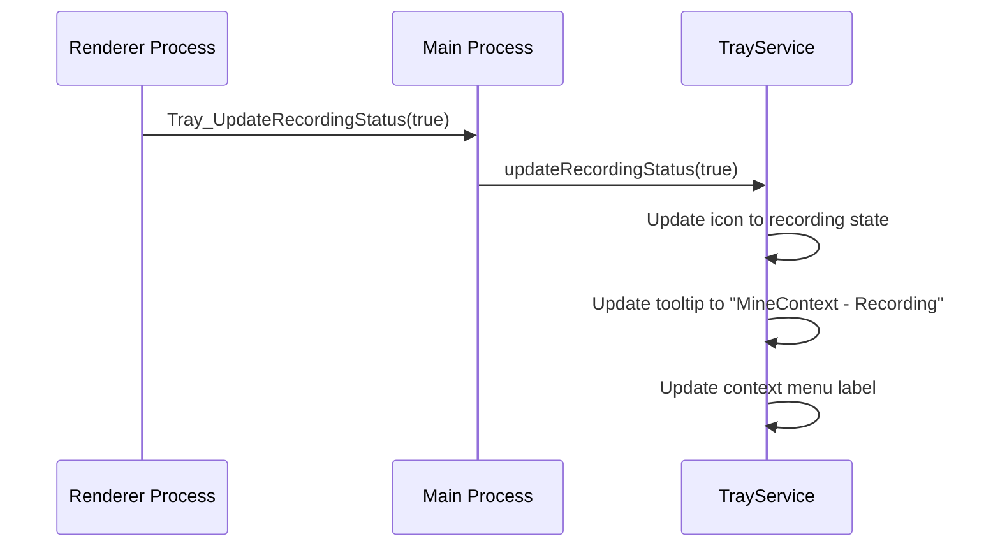
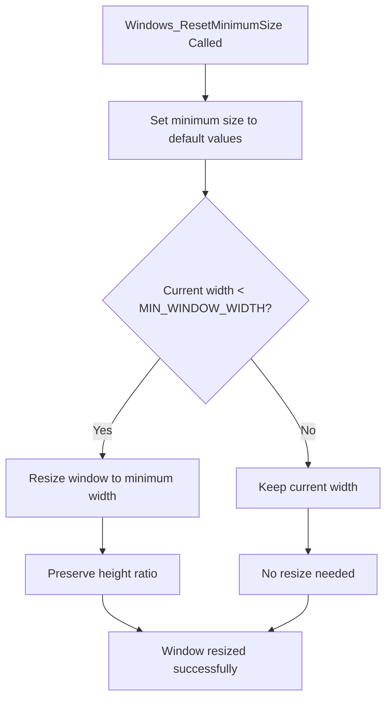
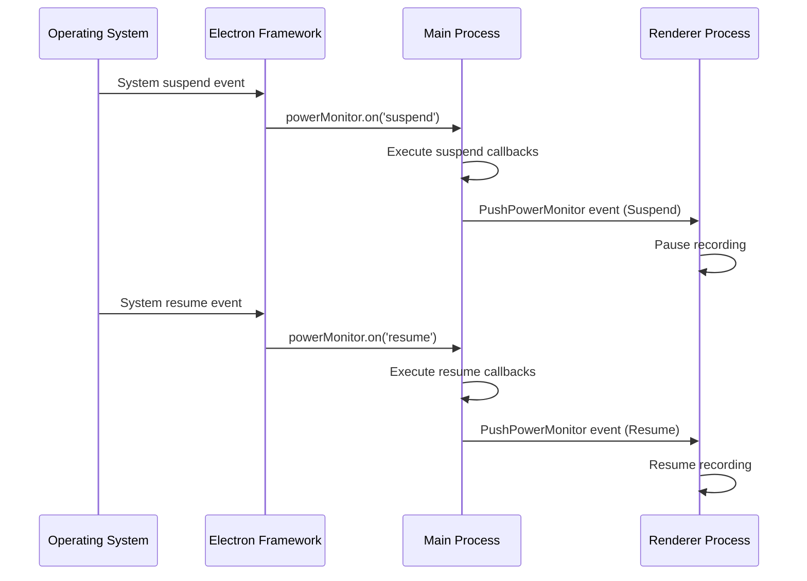
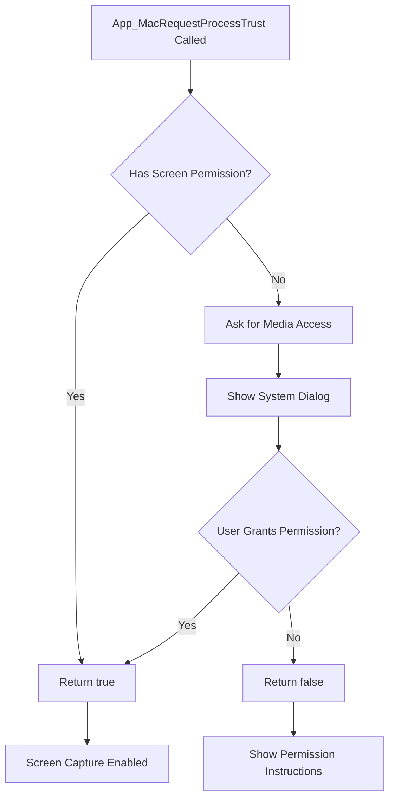

# System Integration IPC Channels

<cite>
**Referenced Files in This Document**   
- [ipc.ts](file://frontend/src/main/ipc.ts)
- [IpcChannel.ts](file://frontend/packages/shared/IpcChannel.ts)
- [TrayService.ts](file://frontend/src/main/services/TrayService.ts)
- [Power.ts](file://frontend/src/main/background/os/Power.ts)
- [mac-window-manager.ts](file://frontend/src/main/utils/mac-window-manager.ts)
- [power-monitor.ts](file://frontend/packages/shared/constant/power-monitor.ts)
</cite>

## Table of Contents
1. [Introduction](#introduction)
2. [Tray Management Channels](#tray-management-channels)
3. [Window Management Channels](#window-management-channels)
4. [Power Monitoring Integration](#power-monitoring-integration)
5. [macOS Process Trust Requirements](#macos-process-trust-requirements)
6. [Cross-Platform Compatibility and Security](#cross-platform-compatibility-and-security)

## Introduction
This document provides comprehensive documentation for the system integration IPC (Inter-Process Communication) channels that interface with OS-level features in the MineContext application. These channels enable deep integration with operating system functionalities including tray icon management, window size constraints, power monitoring, and macOS accessibility permissions. The IPC system follows a structured pattern where renderer processes (frontend) communicate with the main Electron process to access native OS capabilities that are not available in the browser context. This architecture ensures secure and efficient access to system-level features while maintaining application stability and user privacy.

## Tray Management Channels

### Tray_UpdateRecordingStatus
This channel updates the tray icon status based on the current recording state of the application.

**Direction**: Main process handler (renderer → main)  
**Payload Structure**: `boolean` indicating recording status (true = recording, false = paused)  
**Return Values**: None  
**Platform-Specific Considerations**: 
- **macOS**: Uses template images for automatic color adjustment on dark/light menu bars
- **Windows**: Left-click shows main window, right-click shows context menu
- **Linux**: Click shows context menu

The tray icon changes between default and recording states, with corresponding context menu updates. When recording, the icon displays a red dot indicator and the menu shows "Pause Recording". The implementation uses high-resolution PNG assets (54x54) that are resized appropriately for each platform's display requirements.



**Diagram sources**
- [ipc.ts](file://frontend/src/main/ipc.ts#L555-L564)
- [TrayService.ts](file://frontend/src/main/services/TrayService.ts#L254-L274)

**Section sources**
- [ipc.ts](file://frontend/src/main/ipc.ts#L555-L564)
- [TrayService.ts](file://frontend/src/main/services/TrayService.ts#L254-L274)

### Tray_Show
This channel creates and displays the system tray icon.

**Direction**: Main process handler (renderer → main)  
**Payload Structure**: None  
**Return Values**: None  
**Platform-Specific Considerations**:
- Checks if tray already exists before creation
- Loads appropriate icons based on platform (macOS, Windows, Linux)
- Sets platform-specific click behaviors
- Applies template image properties on macOS for proper appearance

The tray icon is created with proper sizing for each platform: 18x18 pixels for macOS (with @2x/@3x assets), 32x32 pixels for Windows, and 16x16 pixels for Linux. The implementation includes error handling for missing icon files and proper logging of creation status.

**Section sources**
- [ipc.ts](file://frontend/src/main/ipc.ts#L565-L572)
- [TrayService.ts](file://frontend/src/main/services/TrayService.ts#L103-L157)

### Tray_Hide
This channel destroys and removes the system tray icon from the OS.

**Direction**: Main process handler (renderer → main)  
**Payload Structure**: None  
**Return Values**: None  
**Platform-Specific Considerations**:
- Properly destroys the tray object to prevent memory leaks
- Nullifies reference to allow garbage collection
- Logs destruction event for debugging purposes

This operation completely removes the tray icon from the system tray area and cleans up associated resources.

**Section sources**
- [ipc.ts](file://frontend/src/main/ipc.ts#L573-L580)
- [TrayService.ts](file://frontend/src/main/services/TrayService.ts#L279-L284)

### App_SetTray
This channel configures the application's tray behavior preferences.

**Direction**: Main process handler (renderer → main)  
**Payload Structure**: `boolean` indicating whether tray should be enabled  
**Return Values**: None  
**Platform-Specific Considerations**:
- Controls whether the application maintains a tray presence
- Works in conjunction with App_SetTrayOnClose for complete tray behavior configuration
- Affects application startup and shutdown behavior

This setting is typically persisted in the application's configuration system and applied during application initialization.

**Section sources**
- [IpcChannel.ts](file://frontend/packages/shared/IpcChannel.ts#L20)

### App_SetTrayOnClose
This channel determines the application's behavior when the main window is closed.

**Direction**: Main process handler (renderer → main)  
**Payload Structure**: `boolean` indicating whether to minimize to tray on close  
**Return Values**: None  
**Platform-Specific Considerations**:
- **Windows**: Common pattern to minimize to system tray
- **macOS**: Less common, as macOS typically expects applications to remain in dock
- **Linux**: Behavior varies by desktop environment

When enabled, closing the main window will hide it rather than quit the application, allowing quick access via the tray icon.

**Section sources**
- [IpcChannel.ts](file://frontend/packages/shared/IpcChannel.ts#L21)

## Window Management Channels

### Windows_ResetMinimumSize
This channel resets the application window to its default minimum size constraints.

**Direction**: Main process handler (renderer → main)  
**Payload Structure**: None  
**Return Values**: None  
**Platform-Specific Considerations**:
- Uses predefined constants MIN_WINDOW_WIDTH and MIN_WINDOW_HEIGHT
- Ensures window size never falls below usable dimensions
- Adjusts window size if current dimensions are smaller than minimum

The implementation also resizes the window if its current size is smaller than the minimum dimensions, ensuring the window remains fully visible and usable.



**Diagram sources**
- [ipc.ts](file://frontend/src/main/ipc.ts#L349-L355)

**Section sources**
- [ipc.ts](file://frontend/src/main/ipc.ts#L349-L355)
- [config/constant.ts](file://frontend/packages/shared/config/constant.ts)

### Windows_SetMinimumSize
This channel sets custom minimum dimensions for the application window.

**Direction**: Main process handler (renderer → main)  
**Payload Structure**: `width: number, height: number` in pixels  
**Return Values**: None  
**Platform-Specific Considerations**:
- Applies system-level window constraints
- Prevents user from resizing window below specified dimensions
- Works with the OS window manager to enforce constraints

This allows dynamic adjustment of window size constraints based on application state or user preferences.

**Section sources**
- [ipc.ts](file://frontend/src/main/ipc.ts#L345-L347)

### Windows_Resize
This channel adjusts the application window to specific dimensions.

**Direction**: Main process handler (renderer → main)  
**Payload Structure**: `width: number, height: number` in pixels  
**Return Values**: None  
**Platform-Specific Considerations**:
- Directly interfaces with the OS window management system
- Respects minimum size constraints set by Windows_SetMinimumSize
- May be subject to OS-level window management policies

Note: This specific channel is defined in the IpcChannel enum but not implemented in the ipc.ts file, suggesting it may be reserved for future implementation or handled through other mechanisms.

**Section sources**
- [IpcChannel.ts](file://frontend/packages/shared/IpcChannel.ts#L127)

### Windows_GetSize
This channel retrieves the current dimensions of the application window.

**Direction**: Main process handler (renderer → main)  
**Payload Structure**: None  
**Return Values**: `[width: number, height: number]` array with current window dimensions  
**Platform-Specific Considerations**:
- Returns actual pixel dimensions as reported by the OS
- Accounts for window decorations (borders, title bar) in the measurement
- Provides real-time current state of the window

This information can be used for state persistence, responsive UI adjustments, or analytics.

**Section sources**
- [ipc.ts](file://frontend/src/main/ipc.ts#L357-L360)

## Power Monitoring Integration

### Power Monitoring Event Flow
The application integrates with system power events to manage recording sessions appropriately during system sleep, wake, lock, and unlock events.

**Direction**: Main process event emitter (system → main → renderer)  
**Event Types**:
- Suspend: System is entering sleep/hibernation
- Resume: System is waking from sleep
- LockScreen: User has locked the screen
- UnlockScreen: User has unlocked the screen



**Diagram sources**
- [Power.ts](file://frontend/src/main/background/os/Power.ts#L38-L52)
- [power-monitor.ts](file://frontend/packages/shared/constant/power-monitor.ts#L1-L5)

**Section sources**
- [Power.ts](file://frontend/src/main/background/os/Power.ts#L38-L52)
- [power-monitor.ts](file://frontend/packages/shared/constant/power-monitor.ts#L1-L5)

### Implementation Details
The power monitoring system uses Electron's `powerMonitor` API to subscribe to system events. When the system is about to sleep (suspend), the application automatically pauses recording to prevent capturing invalid or incomplete data. Upon system wake (resume), recording automatically resumes if it was active before the system slept.

Additionally, the application responds to screen lock/unlock events to enhance security and privacy. When the screen is locked, recording pauses to prevent capturing sensitive information while the user is away. When the screen is unlocked, recording resumes if appropriate.

The system also employs a `powerSaveBlocker` to prevent the application from being suspended during active recording sessions, ensuring continuous capture of user activity.

**Section sources**
- [Power.ts](file://frontend/src/main/background/os/Power.ts#L10-L87)
- [event-loop.atom.tsx](file://frontend/src/renderer/src/atom/event-loop.atom.tsx#L31-L65)

## macOS Process Trust Requirements

### App_MacIsProcessTrusted
This channel checks whether the application has been granted accessibility permissions on macOS.

**Direction**: Main process handler (renderer → main)  
**Payload Structure**: `requestPermission: boolean` (optional)  
**Return Values**: `boolean` indicating trust status  
**Platform-Specific Considerations**:
- Only available on macOS
- Uses `systemPreferences.isTrustedAccessibilityClient()`
- Requires "Screen Recording" permission in System Preferences

The method returns true only if the application has been explicitly granted accessibility permissions in System Preferences > Security & Privacy > Privacy > Accessibility.

**Section sources**
- [ipc.ts](file://frontend/src/main/ipc.ts#L109-L111)

### App_MacRequestProcessTrust
This channel requests accessibility permissions from the user on macOS.

**Direction**: Main process handler (renderer → main)  
**Payload Structure**: None  
**Return Values**: `boolean` indicating whether permission was granted  
**Platform-Specific Considerations**:
- Triggers the macOS system permission dialog
- Requires proper entitlements in the application bundle
- Must be called from the main process (not renderer)

When called, this method prompts the user with the standard macOS permission dialog, directing them to grant screen recording permissions in System Preferences. This is required for the application to capture screen content on macOS.



**Diagram sources**
- [ipc.ts](file://frontend/src/main/ipc.ts#L114-L116)
- [ScreenshotService.ts](file://frontend/src/main/services/ScreenshotService.ts#L28-L34)

**Section sources**
- [ipc.ts](file://frontend/src/main/ipc.ts#L114-L116)
- [ScreenshotService.ts](file://frontend/src/main/services/ScreenshotService.ts#L28-L34)

### Security Implications
The application requires macOS accessibility permissions to capture screen content, which is a sensitive permission that grants broad system access. The implementation follows security best practices:

1. **Least Privilege**: Only requests the specific permissions needed for screen capture
2. **User Consent**: Always prompts the user before requesting permissions
3. **Clear Justification**: Provides context for why permissions are needed
4. **Graceful Degradation**: Functions appropriately when permissions are denied

The application cannot capture screen content without these permissions, making them a critical security boundary.

## Cross-Platform Compatibility and Security

### Platform-Specific Implementation Strategies
The IPC system employs different strategies across platforms to ensure compatibility and optimal user experience:

**macOS**:
- Uses template images for tray icons that automatically adapt to dark/light mode
- Implements accessibility permission checks and requests
- Uses Quartz framework for detailed window information
- Follows macOS human interface guidelines for menu behavior

**Windows**:
- Uses high-DPI aware PNG icons for crisp display
- Implements left-click to show window, right-click for menu pattern
- Handles portable installation detection
- Supports AppImage format on Linux

**Linux**:
- Uses standard icon sizes and behaviors
- Adapts to various desktop environments
- Implements fallback mechanisms for different window managers

### Security Considerations
The system-level access provided by these IPC channels introduces several security considerations:

1. **Principle of Least Privilege**: Each channel provides only the minimum necessary access to perform its function
2. **Input Validation**: All IPC handlers validate input parameters to prevent injection attacks
3. **Error Handling**: Comprehensive error handling prevents crashes and information disclosure
4. **Logging**: Sensitive information is redacted from logs
5. **Permission Management**: Sensitive operations require explicit user permission

The architecture follows Electron's security recommendations by performing sensitive operations in the main process rather than the renderer process, reducing the attack surface.

### Practical Examples

#### Updating Tray Icon Based on Recording State
```typescript
// In renderer process
const updateTrayStatus = async (isRecording: boolean) => {
  await ipcRenderer.invoke(IpcChannel.Tray_UpdateRecordingStatus, isRecording);
};

// This triggers the main process to:
// 1. Change the tray icon appearance
// 2. Update the tooltip text
// 3. Modify the context menu options
// 4. Log the state change
```

#### Managing Window Size Constraints
```typescript
// Set minimum window size when entering full-screen mode
const enterFullscreen = () => {
  ipcRenderer.invoke(IpcChannel.Windows_SetMinimumSize, 800, 600);
  // Additional full-screen logic
};

// Reset to default minimum size when exiting
const exitFullscreen = () => {
  ipcRenderer.invoke(IpcChannel.Windows_ResetMinimumSize);
  // Additional exit logic
};

// Get current window size for state persistence
const saveWindowSize = async () => {
  const [width, height] = await ipcRenderer.invoke(IpcChannel.Windows_GetSize);
  // Save to user preferences
};
```

#### Power-Aware Recording Management
The power monitoring integration automatically handles system events:

1. When the system suspends, recording pauses to prevent capturing incomplete data
2. When the system resumes, recording automatically continues if it was active
3. When the screen locks, recording pauses for privacy
4. When the screen unlocks, recording resumes if appropriate

This ensures that recording sessions are maintained across system sleep cycles while respecting user privacy and system resource constraints.

**Section sources**
- [Power.ts](file://frontend/src/main/background/os/Power.ts#L38-L68)
- [TrayService.ts](file://frontend/src/main/services/TrayService.ts#L212-L235)