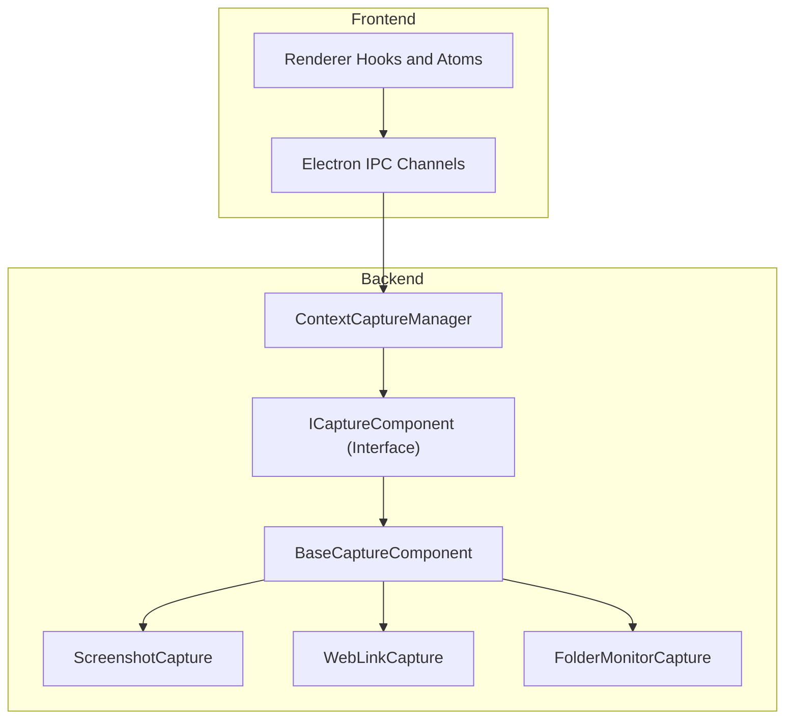
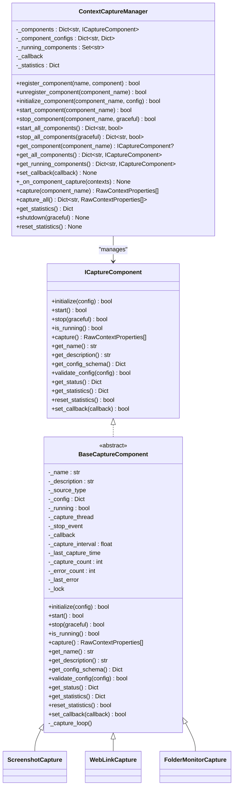
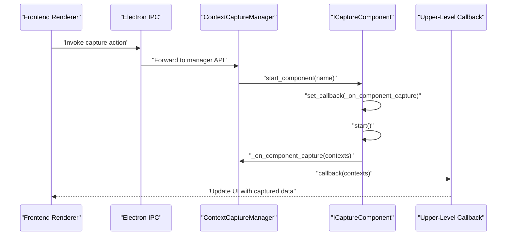
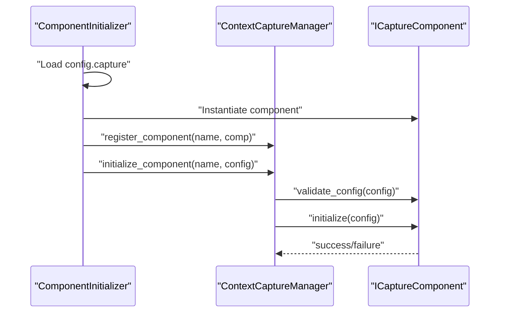
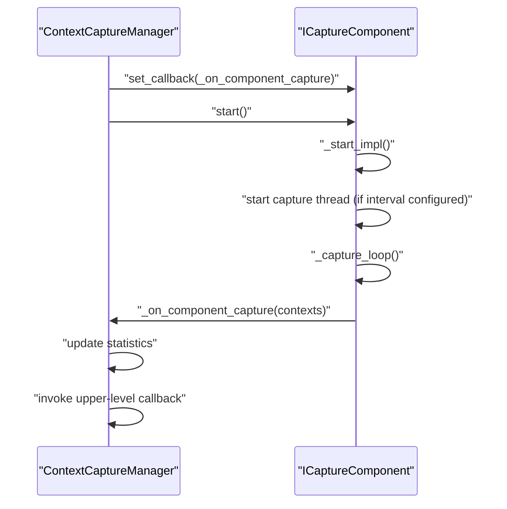
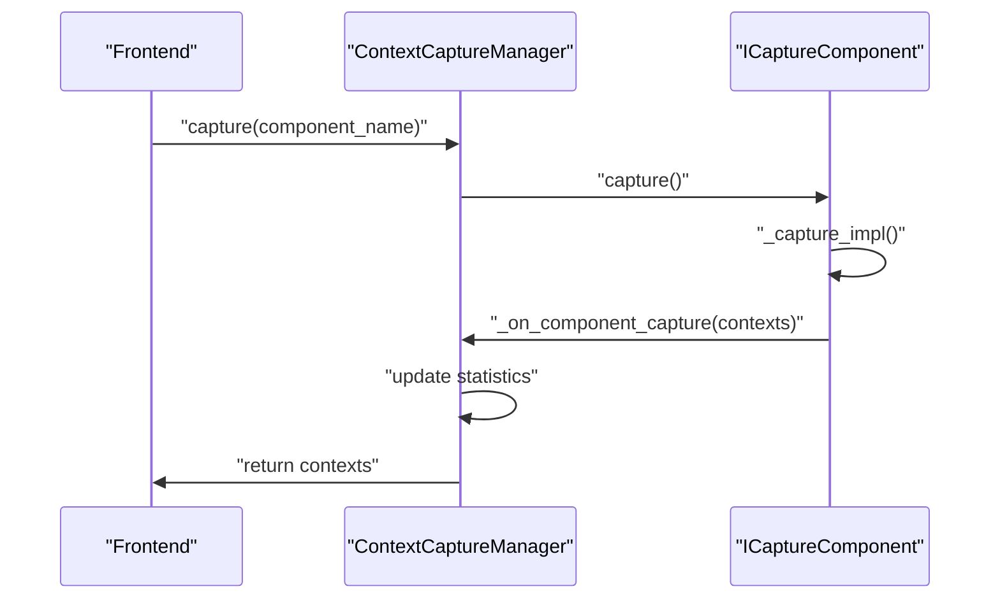
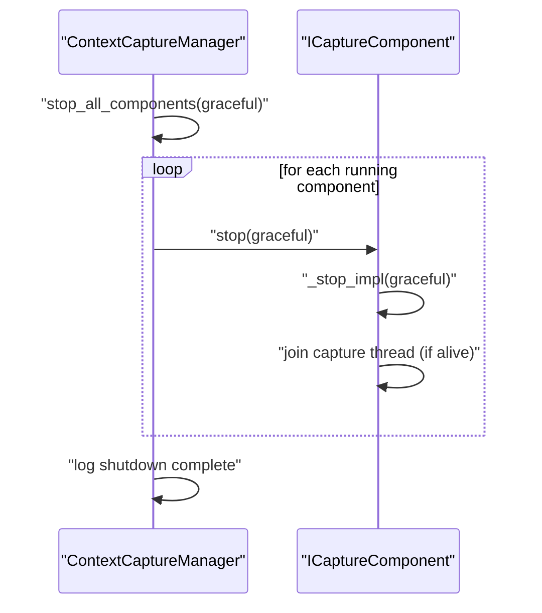
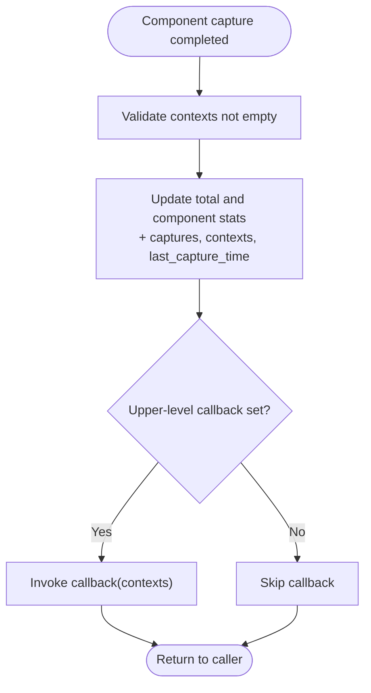
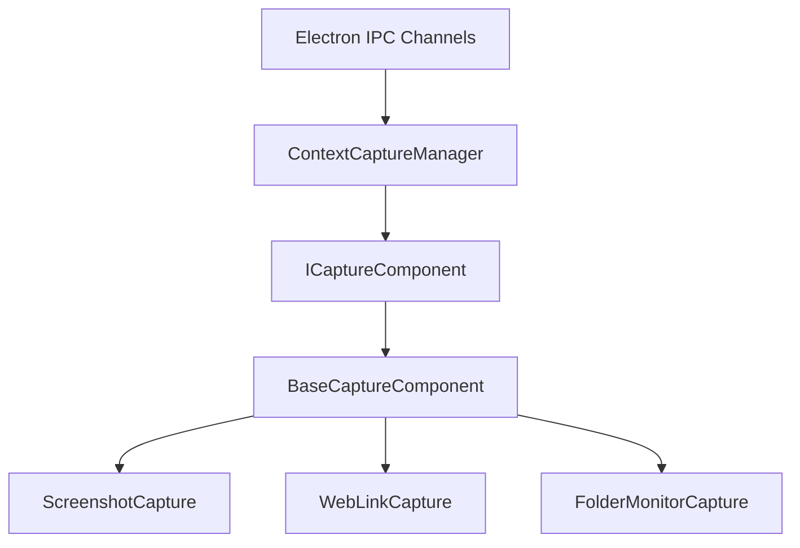

# Capture Manager API

<cite>
**Referenced Files in This Document**
- [capture_manager.py](file://opencontext/managers/capture_manager.py)
- [base.py](file://opencontext/context_capture/base.py)
- [screenshot.py](file://opencontext/context_capture/screenshot.py)
- [web_link_capture.py](file://opencontext/context_capture/web_link_capture.py)
- [folder_monitor.py](file://opencontext/context_capture/folder_monitor.py)
- [capture_interface.py](file://opencontext/interfaces/capture_interface.py)
- [component_initializer.py](file://opencontext/server/component_initializer.py)
- [IpcChannel.ts](file://frontend/packages/shared/IpcChannel.ts)
- [ipc.ts](file://frontend/src/main/ipc.ts)
- [use-screen.tsx](file://frontend/src/renderer/src/hooks/use-screen.tsx)
- [capture.atom.tsx](file://frontend/src/renderer/src/atom/capture.atom.tsx)
</cite>

## Table of Contents
1. [Introduction](#introduction)
2. [Project Structure](#project-structure)
3. [Core Components](#core-components)
4. [Architecture Overview](#architecture-overview)
5. [Detailed Component Analysis](#detailed-component-analysis)
6. [Dependency Analysis](#dependency-analysis)
7. [Performance Considerations](#performance-considerations)
8. [Troubleshooting Guide](#troubleshooting-guide)
9. [Conclusion](#conclusion)
10. [Appendices](#appendices)

## Introduction
This document provides comprehensive documentation for the ContextCaptureManager class and its internal APIs. It explains how capture components (screenshot, document, and web link capture) are registered, initialized, started, stopped, and manually triggered. It details the set_callback and _on_component_capture mechanisms for data flow from capture components to the processing pipeline. It also covers statistics tracking, thread safety considerations, and provides sequence diagrams for startup, capture, and shutdown flows.

## Project Structure
The capture subsystem is organized around a manager that orchestrates multiple loosely coupled capture components. Each component implements a shared interface and inherits from a base class that encapsulates common lifecycle and thread-safety concerns. The manager exposes a unified API for registration, initialization, and control of these components. Frontend integration occurs via Electron IPC channels for screen capture and related operations.

**Diagram sources**
- [capture_manager.py](file://opencontext/managers/capture_manager.py#L1-L391)
- [base.py](file://opencontext/context_capture/base.py#L1-L515)
- [screenshot.py](file://opencontext/context_capture/screenshot.py#L1-L508)
- [web_link_capture.py](file://opencontext/context_capture/web_link_capture.py#L1-L351)
- [folder_monitor.py](file://opencontext/context_capture/folder_monitor.py#L1-L472)
- [IpcChannel.ts](file://frontend/packages/shared/IpcChannel.ts#L283-L349)
- [ipc.ts](file://frontend/src/main/ipc.ts#L507-L548)

**Section sources**
- [capture_manager.py](file://opencontext/managers/capture_manager.py#L1-L391)
- [base.py](file://opencontext/context_capture/base.py#L1-L515)
- [screenshot.py](file://opencontext/context_capture/screenshot.py#L1-L508)
- [web_link_capture.py](file://opencontext/context_capture/web_link_capture.py#L1-L351)
- [folder_monitor.py](file://opencontext/context_capture/folder_monitor.py#L1-L472)
- [IpcChannel.ts](file://frontend/packages/shared/IpcChannel.ts#L283-L349)
- [ipc.ts](file://frontend/src/main/ipc.ts#L507-L548)

## Core Components
- ContextCaptureManager: Central coordinator for capture components. Provides registration, initialization, lifecycle control, manual capture, statistics, and shutdown.
- BaseCaptureComponent: Shared base class for all capture components. Implements common lifecycle, thread-safety, configuration validation, and periodic capture loops.
- ScreenshotCapture: Periodic screen capture with deduplication, optional saving, and metadata enrichment.
- WebLinkCapture: URL capture pipeline converting web links to Markdown or PDF, with concurrency control.
- FolderMonitorCapture: Watches local folders for file changes and emits context events for processing.

**Section sources**
- [capture_manager.py](file://opencontext/managers/capture_manager.py#L23-L391)
- [base.py](file://opencontext/context_capture/base.py#L26-L515)
- [screenshot.py](file://opencontext/context_capture/screenshot.py#L28-L508)
- [web_link_capture.py](file://opencontext/context_capture/web_link_capture.py#L24-L351)
- [folder_monitor.py](file://opencontext/context_capture/folder_monitor.py#L29-L472)

## Architecture Overview
The manager maintains a registry of components keyed by name. Each component implements ICaptureComponent and inherits from BaseCaptureComponent. Components are initialized with configuration dictionaries, started to run periodic capture loops (when configured), and stopped gracefully. The manager’s callback mechanism forwards captured data to the upper-level pipeline.

**Diagram sources**
- [capture_interface.py](file://opencontext/interfaces/capture_interface.py#L1-L153)
- [base.py](file://opencontext/context_capture/base.py#L26-L515)
- [capture_manager.py](file://opencontext/managers/capture_manager.py#L23-L391)
- [screenshot.py](file://opencontext/context_capture/screenshot.py#L28-L508)
- [web_link_capture.py](file://opencontext/context_capture/web_link_capture.py#L24-L351)
- [folder_monitor.py](file://opencontext/context_capture/folder_monitor.py#L29-L472)

## Detailed Component Analysis

### ContextCaptureManager API
- Registration and Unregistration
  - register_component(name, component): Registers a component by name; overwrites if already present and logs a warning. Initializes per-component statistics.
  - unregister_component(component_name): Removes a component; stops it if running; removes statistics.
- Initialization
  - initialize_component(component_name, config): Validates and initializes a registered component via its validate_config and initialize methods.
- Lifecycle Control
  - start_component(component_name): Sets the component’s callback to the manager’s internal _on_component_capture, starts the component, and tracks it as running.
  - stop_component(component_name, graceful): Stops a component gracefully; removes it from running set.
  - start_all_components(): Starts all registered components.
  - stop_all_components(graceful): Stops all running components.
  - get_component(component_name), get_all_components(), get_running_components(): Accessors for component instances.
- Manual Capture
  - capture(component_name): Calls the component’s capture method and returns captured contexts. Errors increment manager-level statistics.
  - capture_all(): Iterates running components and collects captured contexts.
- Callback and Data Flow
  - set_callback(callback): Sets the upper-level callback invoked by _on_component_capture.
  - _on_component_capture(contexts): Updates total and per-component statistics, records last capture time, and invokes the upper-level callback.
- Statistics and Shutdown
  - get_statistics(): Returns a copy of aggregated statistics.
  - reset_statistics(): Resets per-component and global counters.
  - shutdown(graceful): Stops all components and logs shutdown.

Thread Safety
- The manager uses a simple dictionary and set for component tracking and a lock for statistics updates. The internal callback updates are guarded by the component’s own lock in BaseCaptureComponent.

Error Handling
- Methods log warnings for missing/unregistered components and exceptions during lifecycle operations. Errors increment the manager’s error counters.

**Section sources**
- [capture_manager.py](file://opencontext/managers/capture_manager.py#L51-L391)

### BaseCaptureComponent (Shared Behavior)
- Lifecycle
  - initialize(config): Validates config, copies config, sets capture_interval, delegates to _initialize_impl.
  - start(): Ensures not already running, delegates to _start_impl, sets running flag, clears stop event, and starts a periodic capture thread if capture_interval is configured.
  - stop(graceful): Signals stop event, joins capture thread with timeout, delegates to _stop_impl, resets running flag.
  - is_running(): Thread-safe check via lock.
- Capture Execution
  - capture(): Records start time, delegates to _capture_impl, increments capture_count, and calls set callback if provided and data exists.
- Configuration and Validation
  - get_config_schema(): Returns a base schema with auto_capture and capture_interval, merged with subclass schema.
  - validate_config(config): Validates auto_capture and capture_interval types and values, then delegates to _validate_config_impl.
- Status and Statistics
  - get_status(): Returns component status including running state, last capture time, interval, and auto_capture flag, plus subclass-provided fields.
  - get_statistics(): Returns capture_count, error_count, last_error, uptime, and subclass statistics.
  - reset_statistics(): Resets counters and calls _reset_statistics_impl.
- Callback and Loop
  - set_callback(callback): Thread-safe assignment.
  - _capture_loop(): Runs until stop event, calls capture() and waits for next interval, with exception handling and backoff.

Thread Safety
- Uses an RLock for all mutable state and callback assignment to protect concurrent access.

**Section sources**
- [base.py](file://opencontext/context_capture/base.py#L57-L515)

### ScreenshotCapture
- Purpose: Periodic screen capture across monitors with optional saving, deduplication, and metadata.
- Configuration Schema and Validation: Supports screenshot_format, screenshot_quality, screenshot_region, storage_path, dedup_enabled, similarity_threshold, and max_image_size.
- Lifecycle
  - _initialize_impl(): Loads screenshot library, validates and applies configuration, prepares storage directory.
  - _start_impl(): Verifies library availability.
  - _stop_impl(graceful): Optionally flushes pending contexts via callback before clearing state.
- Capture
  - _capture_impl(): Captures screenshots per monitor or region, creates RawContextProperties with metadata, and returns list of contexts.
- Status and Statistics: Tracks screenshot_count, active_screenshots, and last screenshot info.

Thread Safety
- Uses an RLock for internal state.

**Section sources**
- [screenshot.py](file://opencontext/context_capture/screenshot.py#L28-L508)

### WebLinkCapture
- Purpose: Converts URLs to Markdown or PDF using external libraries, with configurable concurrency and output directory.
- Configuration Schema and Validation: Supports output_dir, mode, max_workers, timeout, wait_until, and PDF options.
- Lifecycle
  - _initialize_impl(): Applies configuration and ensures output directory exists.
  - _start_impl(), _stop_impl(): No-op or cleanup depending on component design.
- Capture Override
  - capture(urls): Stores URLs to process and delegates to base capture, which calls _capture_impl.
  - _capture_impl(): Processes URLs in parallel using ThreadPoolExecutor, converts to target format, and returns RawContextProperties with file paths.
- Status and Statistics: Tracks total_converted and last activity time.

Thread Safety
- Uses a Lock for statistics updates.

**Section sources**
- [web_link_capture.py](file://opencontext/context_capture/web_link_capture.py#L24-L351)

### FolderMonitorCapture
- Purpose: Monitors local folders for file changes and emits context events for processing.
- Lifecycle
  - _initialize_impl(): Initializes storage, intervals, watch paths, recursion, max file size, and supported formats.
  - _start_impl(): Optionally performs initial scan, then starts monitor thread.
  - _stop_impl(): Signals stop event and joins monitor thread.
- Capture
  - _capture_impl(): Processes queued events, creates RawContextProperties for new/updated/deleted files, and updates statistics.
- Monitoring Loop
  - _monitor_loop(): Scans for changes at configured intervals, detects new/updated/deleted files, and generates events.
- Cleanup
  - _cleanup_file_context(): Removes processed contexts associated with deleted files.

Thread Safety
- Uses an RLock for event queue and internal state.

**Section sources**
- [folder_monitor.py](file://opencontext/context_capture/folder_monitor.py#L29-L472)

### Frontend Integration for Manual Captures
While the manager’s capture methods are primarily intended for backend orchestration, the frontend integrates with screen capture capabilities via IPC channels. The frontend can trigger manual screenshots and related operations through dedicated channels and services.

- IPC Channels for Screen Capture
  - Screen_Monitor_Take_Screenshot
  - Screen_Monitor_Take_Source_Screenshot
  - Screen_Monitor_Get_Visible_Sources
  - Screen_Monitor_Delete_Screenshot
  - Screen_Monitor_Read_Image_Base64
  - Screen_Monitor_Get_Screenshots_By_Date
  - Screen_Monitor_Cleanup_Old_Screenshots
  - Screen_Monitor_Get_Capture_All_Sources

- Frontend Hooks and Atoms
  - use-screen.tsx: Demonstrates capturing visible sources and posting results to a server.
  - capture.atom.tsx: Loads capture sources and formatted lists for UI.

These channels and hooks enable the frontend to initiate manual captures and manage screenshots independently of the manager’s capture methods.

**Section sources**
- [IpcChannel.ts](file://frontend/packages/shared/IpcChannel.ts#L283-L349)
- [ipc.ts](file://frontend/src/main/ipc.ts#L507-L548)
- [use-screen.tsx](file://frontend/src/renderer/src/hooks/use-screen.tsx#L65-L100)
- [capture.atom.tsx](file://frontend/src/renderer/src/atom/capture.atom.tsx#L1-L66)

## Architecture Overview

**Diagram sources**
- [capture_manager.py](file://opencontext/managers/capture_manager.py#L135-L171)
- [base.py](file://opencontext/context_capture/base.py#L388-L407)
- [IpcChannel.ts](file://frontend/packages/shared/IpcChannel.ts#L283-L349)

## Detailed Component Analysis

### Registration and Initialization Flow

**Diagram sources**
- [component_initializer.py](file://opencontext/server/component_initializer.py#L71-L97)
- [capture_manager.py](file://opencontext/managers/capture_manager.py#L100-L134)
- [capture_interface.py](file://opencontext/interfaces/capture_interface.py#L25-L68)

**Section sources**
- [component_initializer.py](file://opencontext/server/component_initializer.py#L71-L97)
- [capture_manager.py](file://opencontext/managers/capture_manager.py#L100-L134)

### Startup Sequence

**Diagram sources**
- [capture_manager.py](file://opencontext/managers/capture_manager.py#L153-L171)
- [base.py](file://opencontext/context_capture/base.py#L94-L165)
- [base.py](file://opencontext/context_capture/base.py#L408-L430)

**Section sources**
- [capture_manager.py](file://opencontext/managers/capture_manager.py#L153-L171)
- [base.py](file://opencontext/context_capture/base.py#L94-L165)
- [base.py](file://opencontext/context_capture/base.py#L408-L430)

### Manual Capture Flow

**Diagram sources**
- [capture_manager.py](file://opencontext/managers/capture_manager.py#L312-L339)
- [base.py](file://opencontext/context_capture/base.py#L176-L220)
- [base.py](file://opencontext/context_capture/base.py#L206-L214)

**Section sources**
- [capture_manager.py](file://opencontext/managers/capture_manager.py#L312-L339)
- [base.py](file://opencontext/context_capture/base.py#L176-L220)
- [base.py](file://opencontext/context_capture/base.py#L206-L214)

### Shutdown Sequence

**Diagram sources**
- [capture_manager.py](file://opencontext/managers/capture_manager.py#L221-L232)
- [base.py](file://opencontext/context_capture/base.py#L130-L165)

**Section sources**
- [capture_manager.py](file://opencontext/managers/capture_manager.py#L221-L232)
- [base.py](file://opencontext/context_capture/base.py#L130-L165)

### Data Flow Between Components and Manager

**Diagram sources**
- [capture_manager.py](file://opencontext/managers/capture_manager.py#L273-L312)

**Section sources**
- [capture_manager.py](file://opencontext/managers/capture_manager.py#L273-L312)

## Dependency Analysis
- Manager depends on ICaptureComponent interface and RawContextProperties for data exchange.
- BaseCaptureComponent provides shared lifecycle and thread-safety for concrete components.
- Concrete components depend on platform libraries (e.g., screenshot libraries) and external tools (e.g., Playwright, crawl4ai).
- Frontend IPC channels integrate with backend services for screen capture operations.

**Diagram sources**
- [capture_manager.py](file://opencontext/managers/capture_manager.py#L23-L391)
- [base.py](file://opencontext/context_capture/base.py#L26-L515)
- [screenshot.py](file://opencontext/context_capture/screenshot.py#L28-L508)
- [web_link_capture.py](file://opencontext/context_capture/web_link_capture.py#L24-L351)
- [folder_monitor.py](file://opencontext/context_capture/folder_monitor.py#L29-L472)
- [IpcChannel.ts](file://frontend/packages/shared/IpcChannel.ts#L283-L349)

**Section sources**
- [capture_manager.py](file://opencontext/managers/capture_manager.py#L23-L391)
- [base.py](file://opencontext/context_capture/base.py#L26-L515)
- [screenshot.py](file://opencontext/context_capture/screenshot.py#L28-L508)
- [web_link_capture.py](file://opencontext/context_capture/web_link_capture.py#L24-L351)
- [folder_monitor.py](file://opencontext/context_capture/folder_monitor.py#L29-L472)
- [IpcChannel.ts](file://frontend/packages/shared/IpcChannel.ts#L283-L349)

## Performance Considerations
- Periodic capture intervals: Configure capture_interval thoughtfully to balance responsiveness and resource usage.
- Concurrency: WebLinkCapture uses ThreadPoolExecutor; tune max_workers according to CPU and I/O capacity.
- Deduplication: ScreenshotCapture includes deduplication to reduce redundant processing.
- Thread safety: BaseCaptureComponent uses locks to protect state; avoid blocking operations inside callbacks.
- Storage: ScreenshotCapture can write files; ensure storage paths are writable and monitored for growth.

[No sources needed since this section provides general guidance]

## Troubleshooting Guide
- Component not registered: Methods log errors and return early when attempting operations on unregistered components.
- Initialization failures: validate_config and initialize log detailed errors; inspect component-specific configuration.
- Startup/Stop exceptions: Exceptions are logged and counted as errors; review component logs for underlying causes.
- Manual capture exceptions: Errors increment manager statistics and return empty lists; check component logs for details.
- Frontend capture issues: Verify IPC channels and ensure the frontend has appropriate permissions and dependencies.

**Section sources**
- [capture_manager.py](file://opencontext/managers/capture_manager.py#L100-L134)
- [capture_manager.py](file://opencontext/managers/capture_manager.py#L135-L207)
- [capture_manager.py](file://opencontext/managers/capture_manager.py#L312-L339)
- [base.py](file://opencontext/context_capture/base.py#L58-L93)
- [base.py](file://opencontext/context_capture/base.py#L94-L165)
- [base.py](file://opencontext/context_capture/base.py#L176-L220)

## Conclusion
The ContextCaptureManager provides a robust, extensible framework for managing multiple capture components. Its unified API simplifies registration, initialization, lifecycle control, and manual capture operations. The BaseCaptureComponent ensures consistent behavior, thread safety, and configuration validation across components. The manager’s callback mechanism enables seamless integration with the broader processing pipeline. Frontend integration via IPC channels complements backend orchestration for manual capture scenarios.

[No sources needed since this section summarizes without analyzing specific files]

## Appendices

### API Reference Summary

- ContextCaptureManager
  - register_component(name, component) -> bool
  - unregister_component(component_name) -> bool
  - initialize_component(component_name, config) -> bool
  - start_component(component_name) -> bool
  - stop_component(component_name, graceful=True) -> bool
  - start_all_components() -> Dict[str, bool]
  - stop_all_components(graceful=True) -> Dict[str, bool]
  - get_component(component_name) -> ICaptureComponent?
  - get_all_components() -> Dict[str, ICaptureComponent]
  - get_running_components() -> Dict[str, ICaptureComponent]
  - set_callback(callback) -> None
  - _on_component_capture(contexts) -> None
  - capture(component_name) -> List[RawContextProperties]
  - capture_all() -> Dict[str, List[RawContextProperties]]
  - get_statistics() -> Dict
  - shutdown(graceful=True) -> None
  - reset_statistics() -> None

- BaseCaptureComponent
  - initialize(config) -> bool
  - start() -> bool
  - stop(graceful=True) -> bool
  - is_running() -> bool
  - capture() -> List[RawContextProperties]
  - get_name() -> str
  - get_description() -> str
  - get_config_schema() -> Dict
  - validate_config(config) -> bool
  - get_status() -> Dict
  - get_statistics() -> Dict
  - reset_statistics() -> bool
  - set_callback(callback) -> bool
  - _capture_loop()

- ScreenshotCapture
  - _initialize_impl(config) -> bool
  - _start_impl() -> bool
  - _stop_impl(graceful=True) -> bool
  - _capture_impl() -> List[RawContextProperties]
  - _get_config_schema_impl() -> Dict
  - _validate_config_impl(config) -> bool
  - _get_status_impl() -> Dict
  - _get_statistics_impl() -> Dict
  - _reset_statistics_impl() -> None

- WebLinkCapture
  - submit_url(url) -> List[RawContextProperties]
  - convert_url_to_markdown(url, filename_hint=None) -> Optional[Dict[str, str]]
  - convert_url_to_pdf(url, filename_hint=None) -> Optional[Dict[str, str]]
  - _initialize_impl(config) -> bool
  - _start_impl() -> bool
  - _stop_impl(graceful=True) -> bool
  - capture(urls=None) -> List[RawContextProperties]
  - _capture_impl() -> List[RawContextProperties]
  - _get_config_schema_impl() -> Dict
  - _validate_config_impl(config) -> bool
  - _get_status_impl() -> Dict
  - _get_statistics_impl() -> Dict
  - _reset_statistics_impl() -> None
  - _make_safe_filename(url, filename_hint) -> str

- FolderMonitorCapture
  - _initialize_impl(config) -> bool
  - _start_impl() -> bool
  - _stop_impl(graceful=True) -> bool
  - _capture_impl() -> List[RawContextProperties]
  - _monitor_loop()
  - _scan_existing_folders()
  - _scan_folder_file_changes()
  - _detect_new_and_updated_files(current_files) -> Tuple[List[str], List[str]]
  - _detect_deleted_files(current_files) -> List[str]
  - _generate_events(file_paths, event_type, timestamp)
  - _process_file_event(event)
  - _cleanup_file_context(file_path) -> int
  - _create_context_from_event(event) -> Optional[RawContextProperties]
  - _get_content_format(file_ext) -> Optional[ContentFormat]
  - _scan_folder_files(folder_path, recursive) -> List[str]
  - _is_supported_file_type(file_path) -> bool
  - _get_file_hash(file_path) -> str
  - _get_config_schema_impl() -> Dict
  - _validate_config_impl(config) -> bool
  - _get_status_impl() -> Dict
  - _get_statistics_impl() -> Dict
  - _reset_statistics_impl() -> None

**Section sources**
- [capture_manager.py](file://opencontext/managers/capture_manager.py#L51-L391)
- [base.py](file://opencontext/context_capture/base.py#L57-L515)
- [screenshot.py](file://opencontext/context_capture/screenshot.py#L60-L508)
- [web_link_capture.py](file://opencontext/context_capture/web_link_capture.py#L51-L351)
- [folder_monitor.py](file://opencontext/context_capture/folder_monitor.py#L59-L472)