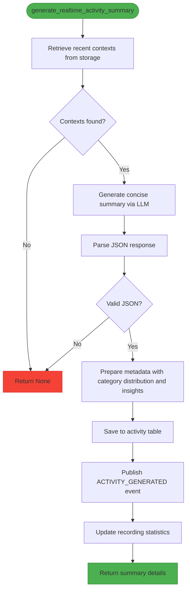
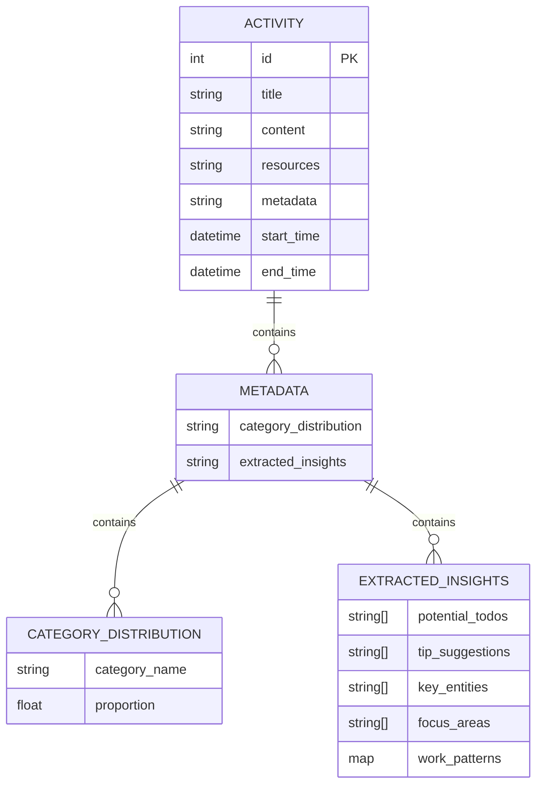
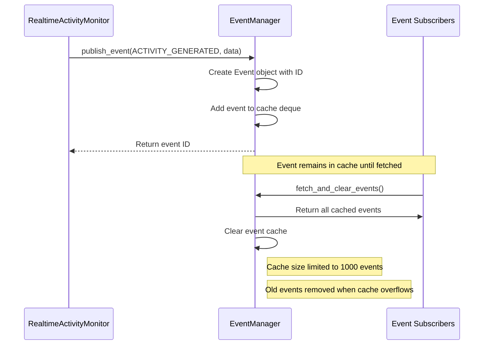
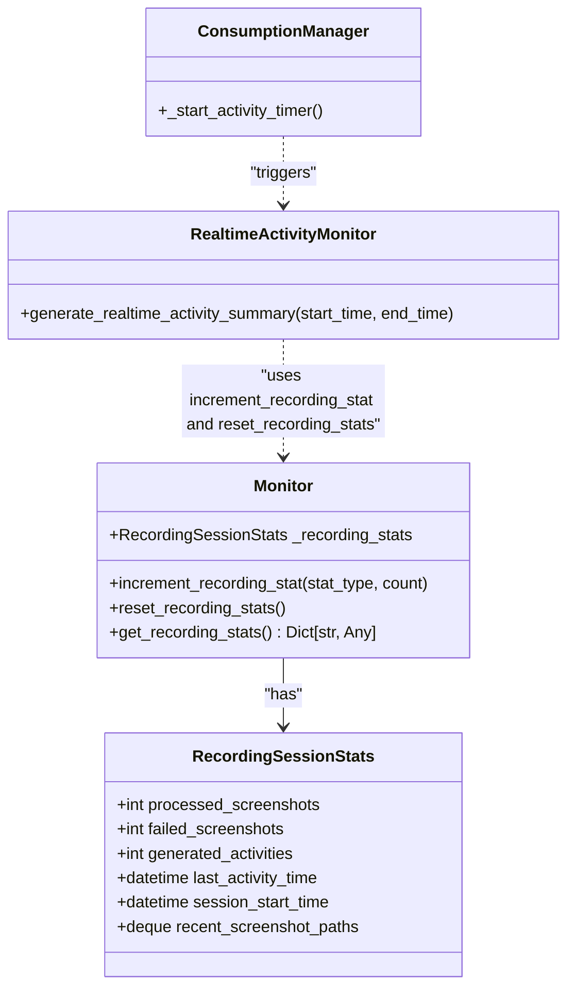
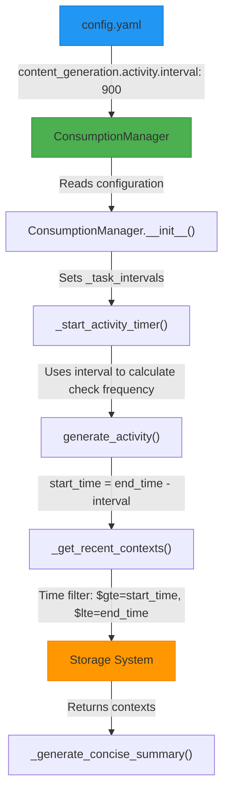
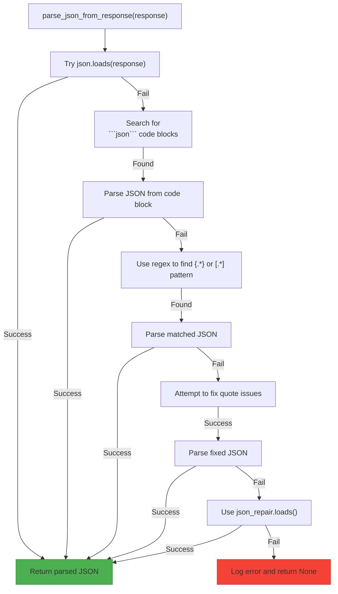
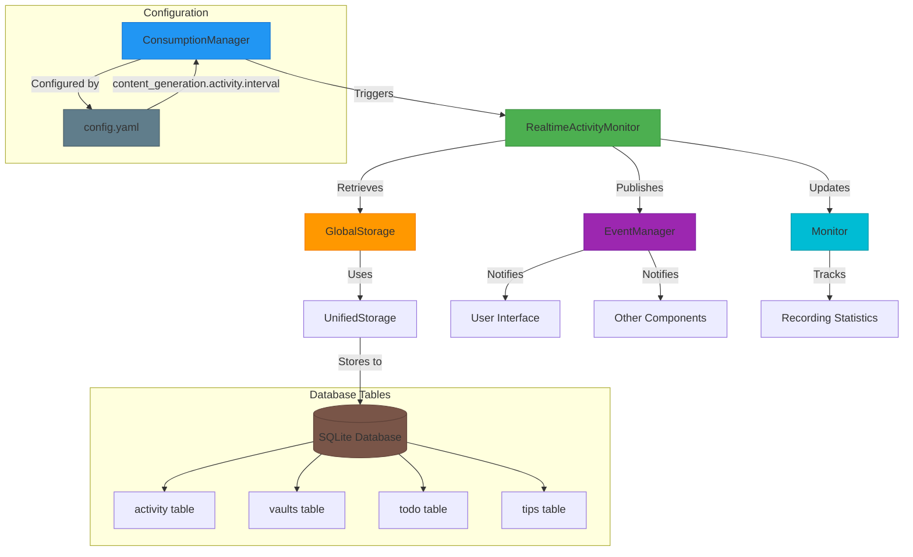

# Activity Monitor API

<cite>
**Referenced Files in This Document**   
- [realtime_activity_monitor.py](file://opencontext/context_consumption/generation/realtime_activity_monitor.py)
- [consumption_manager.py](file://opencontext/managers/consumption_manager.py)
- [config.yaml](file://config/config.yaml)
- [context.py](file://opencontext/models/context.py)
- [global_storage.py](file://opencontext/storage/global_storage.py)
- [unified_storage.py](file://opencontext/storage/unified_storage.py)
- [sqlite_backend.py](file://opencontext/storage/backends/sqlite_backend.py)
- [event_manager.py](file://opencontext/managers/event_manager.py)
- [json_parser.py](file://opencontext/utils/json_parser.py)
- [debug_helper.py](file://opencontext/context_consumption/generation/debug_helper.py)
- [monitor.py](file://opencontext/monitoring/monitor.py)
</cite>

## Table of Contents
1. [Introduction](#introduction)
2. [Core Components](#core-components)
3. [Activity Summary Generation Workflow](#activity-summary-generation-workflow)
4. [Metadata Structure](#metadata-structure)
5. [Event Publishing Mechanism](#event-publishing-mechanism)
6. [Recording Statistics Tracking](#recording-statistics-tracking)
7. [Configuration and Time Intervals](#configuration-and-time-intervals)
8. [Error Handling and Fallback Mechanisms](#error-handling-and-fallback-mechanisms)
9. [System Architecture](#system-architecture)

## Introduction
The RealtimeActivityMonitor class is a core component of the MineContext system responsible for generating summaries of recent user activities. It works in conjunction with the ConsumptionManager to analyze processed context data within a specified time range and produce structured activity summaries. These summaries include titles, descriptions, category distributions, and extracted insights that capture the essence of user interactions. The system is designed to operate on a regular interval, with a default 15-minute cycle, to provide timely insights into user behavior patterns. This documentation details the implementation, integration, and operational characteristics of the RealtimeActivityMonitor and its relationship with the ConsumptionManager.

## Core Components

The RealtimeActivityMonitor class and ConsumptionManager work together to provide real-time activity monitoring capabilities. The RealtimeActivityMonitor is responsible for generating activity summaries from processed context data, while the ConsumptionManager orchestrates the timing and execution of this process along with other content generation tasks.

The RealtimeActivityMonitor analyzes context data to identify patterns and generate meaningful summaries that capture the user's recent activities. It retrieves processed contexts from the storage system, processes them through a large language model (LLM) to extract insights, and stores the resulting summary in the activity table. The ConsumptionManager manages the scheduling of this activity monitoring process, ensuring it runs at the configured interval.

The integration between these components is designed to be seamless, with the ConsumptionManager triggering the RealtimeActivityMonitor at regular intervals based on the configuration settings. This architecture allows for independent configuration of different content generation tasks while maintaining a coordinated execution framework.

**Section sources**
- [realtime_activity_monitor.py](file://opencontext/context_consumption/generation/realtime_activity_monitor.py#L54-L343)
- [consumption_manager.py](file://opencontext/managers/consumption_manager.py#L31-L524)

## Activity Summary Generation Workflow

The activity summary generation process begins with the `generate_realtime_activity_summary` method of the RealtimeActivityMonitor class. This method takes a time range defined by start_time and end_time parameters and orchestrates the entire summary generation workflow.

The process starts by retrieving recent context data through the `_get_recent_contexts` method, which queries the storage system for processed contexts within the specified time range. The contexts are filtered to include only specific types such as ACTIVITY_CONTEXT and INTENT_CONTEXT. If no contexts are found, the method returns None, indicating no activity to summarize.

When contexts are available, the method proceeds to generate a concise summary using the `_generate_concise_summary` workflow. This involves formatting the context data into a structured JSON format and combining it with prompt templates retrieved from the configuration system. The formatted data is then sent to a large language model (LLM) through the `generate_with_messages` function, which processes the input and returns a response containing the generated summary.

The LLM response is expected to be in JSON format, containing fields such as title, description, representative_context_ids, category_distribution, and extracted_insights. The system uses the `parse_json_from_response` function to extract and validate this JSON data. If parsing fails, a fallback mechanism returns None, allowing the system to gracefully handle errors.

Once a valid summary is obtained, the system prepares metadata containing the category distribution and extracted insights, then saves the activity summary to the database using the `insert_activity` method. The method also publishes an event to notify other system components of the new activity summary and updates recording statistics.

**Diagram sources **
- [realtime_activity_monitor.py](file://opencontext/context_consumption/generation/realtime_activity_monitor.py#L60-L128)

**Section sources**
- [realtime_activity_monitor.py](file://opencontext/context_consumption/generation/realtime_activity_monitor.py#L60-L128)

## Metadata Structure

The activity summary metadata is stored in the activity table as JSON strings in two columns: category_distribution and extracted_insights. The category_distribution field contains a dictionary that maps category names to their relative proportions within the analyzed time period. These proportions are normalized to sum to 1.0, providing a clear picture of how the user's time was distributed across different activity categories.

The extracted_insights field contains a rich structure of information extracted from the context data, including potential todos, tip suggestions, key entities, focus areas, and work patterns. The ActivityInsight dataclass defines this structure, with fields for potential_todos (a list of suggested tasks), tip_suggestions (a list of helpful tips), key_entities (important people, projects, or concepts), focus_areas (primary areas of attention), and work_patterns (observed behavioral patterns).

When saving the metadata to the database, both structures are serialized to JSON strings using Python's json.dumps function with ensure_ascii=False to preserve Unicode characters. The category distribution is normalized by dividing each category count by the total count, ensuring the values represent percentages of the total activity.

The metadata structure is designed to be extensible, allowing for the addition of new insight types without requiring database schema changes. This flexibility supports the evolution of the activity monitoring system as new analysis capabilities are developed.

**Diagram sources **
- [realtime_activity_monitor.py](file://opencontext/context_consumption/generation/realtime_activity_monitor.py#L33-L52)
- [sqlite_backend.py](file://opencontext/storage/backends/sqlite_backend.py#L127-L137)

**Section sources**
- [realtime_activity_monitor.py](file://opencontext/context_consumption/generation/realtime_activity_monitor.py#L33-L52)
- [sqlite_backend.py](file://opencontext/storage/backends/sqlite_backend.py#L739-L785)

## Event Publishing Mechanism

The system implements an event-driven architecture through the event publishing mechanism, which notifies other components when a new activity summary is generated. When the RealtimeActivityMonitor successfully creates an activity summary, it publishes an event of type EventType.ACTIVITY_GENERATED using the publish_event function from the event_manager module.

The event data includes the document ID (doc_id), document type (doc_type), title, and content of the generated activity summary. This event serves as a notification to other system components that new activity data is available, enabling features such as real-time updates in the user interface, notifications, or further processing by other services.

The event manager uses a cached mechanism with a deque to store published events, limiting the cache size to 1000 events to prevent memory overflow. Events can be fetched and cleared by consumers, allowing for efficient event processing. The event system supports multiple event types, including TIP_GENERATED, TODO_GENERATED, ACTIVITY_GENERATED, and various summary types, providing a comprehensive notification framework for the application.

This event-driven approach decouples the activity monitoring functionality from other system components, promoting modularity and allowing for flexible integration of new features that can respond to activity generation events.

**Diagram sources **
- [realtime_activity_monitor.py](file://opencontext/context_consumption/generation/realtime_activity_monitor.py#L101-L111)
- [event_manager.py](file://opencontext/managers/event_manager.py#L25-L117)

**Section sources**
- [realtime_activity_monitor.py](file://opencontext/context_consumption/generation/realtime_activity_monitor.py#L101-L111)
- [event_manager.py](file://opencontext/managers/event_manager.py#L25-L117)

## Recording Statistics Tracking

The system tracks recording statistics through the monitoring module, which maintains counters for various activity metrics. When an activity summary is successfully generated, the system increments the activity recording statistic using the increment_recording_stat function and then resets all recording statistics with reset_recording_stats.

The monitoring system maintains counters for processed screenshots, failed screenshots, and generated activities. These statistics are stored in the RecordingSessionStats dataclass and can be accessed through the get_recording_stats method. The statistics provide insights into the system's recording performance and help identify potential issues with data collection.

The recording statistics are reset after each activity generation cycle to provide a clean slate for the next interval. This reset ensures that the statistics reflect activity within the current recording period rather than accumulating indefinitely. The system also tracks the last activity time, which is used to calculate the estimated time until the next activity generation.

These statistics are valuable for both system monitoring and user feedback, as they can be displayed in the user interface to show recording status and performance metrics.

**Diagram sources **
- [realtime_activity_monitor.py](file://opencontext/context_consumption/generation/realtime_activity_monitor.py#L114-L117)
- [monitor.py](file://opencontext/monitoring/monitor.py#L77-L87)
- [monitor.py](file://opencontext/monitoring/monitor.py#L625-L704)

**Section sources**
- [realtime_activity_monitor.py](file://opencontext/context_consumption/generation/realtime_activity_monitor.py#L114-L117)
- [monitor.py](file://opencontext/monitoring/monitor.py#L77-L87)
- [monitor.py](file://opencontext/monitoring/monitor.py#L625-L704)

## Configuration and Time Intervals

The activity monitoring interval is configured through the content_generation.activity.interval setting in the config.yaml file, with a default value of 900 seconds (15 minutes). This configuration is loaded by the ConsumptionManager during initialization and used to determine how frequently activity summaries should be generated.

The ConsumptionManager reads the configuration from the GlobalConfig instance, specifically from the content_generation.activity.interval path. If no configuration is provided, the system uses the default value of 900 seconds. The configuration can be dynamically updated at runtime through the update_task_config method, which allows for changing the interval without restarting the application.

The system retrieves recent contexts for analysis by querying the storage system with a time filter based on the current time and the configured interval. When generating an activity summary, the end_time is set to the current timestamp, while the start_time is calculated as the end_time minus the interval duration. This ensures that each summary covers a consistent time window corresponding to the configured interval.

The configuration system supports environment variable expansion, allowing paths and other settings to be dynamically determined based on the runtime environment. This flexibility enables the system to adapt to different deployment scenarios while maintaining consistent activity monitoring behavior.

**Diagram sources **
- [config.yaml](file://config/config.yaml#L224-L227)
- [consumption_manager.py](file://opencontext/managers/consumption_manager.py#L63-L66)
- [consumption_manager.py](file://opencontext/managers/consumption_manager.py#L249-L269)
- [realtime_activity_monitor.py](file://opencontext/context_consumption/generation/realtime_activity_monitor.py#L134-L148)

**Section sources**
- [config.yaml](file://config/config.yaml#L224-L227)
- [consumption_manager.py](file://opencontext/managers/consumption_manager.py#L63-L66)
- [consumption_manager.py](file://opencontext/managers/consumption_manager.py#L249-L269)
- [realtime_activity_monitor.py](file://opencontext/context_consumption/generation/realtime_activity_monitor.py#L134-L148)

## Error Handling and Fallback Mechanisms

The system implements comprehensive error handling throughout the activity summary generation process. When JSON parsing fails during the processing of the LLM response, the system employs a fallback mechanism that returns None, allowing the calling code to handle the absence of a summary gracefully.

The JSON parsing is performed by the `parse_json_from_response` function in the json_parser.py module, which attempts multiple strategies to extract valid JSON from the LLM response. These strategies include direct parsing, extracting JSON from code blocks, regex matching of JSON structures, fixing common quote issues, and using the json_repair library to fix malformed JSON. If all strategies fail, the function returns None.

The _generate_concise_summary method wraps the JSON parsing in a try-except block, catching any exceptions that occur during parsing. When an exception is caught, the system logs an error message and returns None, preventing the failure from propagating up the call stack and causing a complete failure of the activity monitoring process.

Additional error handling is implemented at various levels of the system. The _get_recent_contexts method catches exceptions when retrieving contexts from storage, returning an empty dictionary if an error occurs. The generate_realtime_activity_summary method wraps the entire process in a try-except block, logging any unhandled exceptions and returning None to ensure the system remains operational even when individual components fail.

The debug_helper.py module provides optional debug logging that can be enabled to save the LLM messages and responses when JSON parsing fails, aiding in the diagnosis and resolution of prompt engineering issues.

**Diagram sources **
- [json_parser.py](file://opencontext/utils/json_parser.py#L20-L76)
- [realtime_activity_monitor.py](file://opencontext/context_consumption/generation/realtime_activity_monitor.py#L206-L241)
- [debug_helper.py](file://opencontext/context_consumption/generation/debug_helper.py#L87-L156)

**Section sources**
- [json_parser.py](file://opencontext/utils/json_parser.py#L20-L76)
- [realtime_activity_monitor.py](file://opencontext/context_consumption/generation/realtime_activity_monitor.py#L206-L241)
- [debug_helper.py](file://opencontext/context_consumption/generation/debug_helper.py#L87-L156)

## System Architecture

The RealtimeActivityMonitor and ConsumptionManager are integrated into a larger system architecture that includes storage, event management, and monitoring components. The ConsumptionManager acts as the central coordinator, managing the scheduling of activity monitoring and other content generation tasks.

The RealtimeActivityMonitor retrieves processed contexts from the storage system, which is accessed through the global_storage.py module. The storage system provides a unified interface to both vector and document databases, with the activity summaries being stored in the SQLite document database. The generated summaries are saved to the activity table, which includes fields for title, content, resources, metadata, and time range.

When an activity summary is generated, the system publishes an event through the event manager, which other components can subscribe to. The monitoring system tracks statistics about the recording process, including the number of activities generated, which are reset after each generation cycle.

The architecture follows a modular design with clear separation of concerns, where each component has a specific responsibility. The ConsumptionManager handles scheduling, the RealtimeActivityMonitor handles summary generation, the storage system handles data persistence, and the event manager handles inter-component communication.

**Diagram sources **
- [consumption_manager.py](file://opencontext/managers/consumption_manager.py#L31-L524)
- [realtime_activity_monitor.py](file://opencontext/context_consumption/generation/realtime_activity_monitor.py#L54-L343)
- [global_storage.py](file://opencontext/storage/global_storage.py#L23-L196)
- [unified_storage.py](file://opencontext/storage/unified_storage.py#L90-L800)
- [sqlite_backend.py](file://opencontext/storage/backends/sqlite_backend.py#L29-L800)

**Section sources**
- [consumption_manager.py](file://opencontext/managers/consumption_manager.py#L31-L524)
- [realtime_activity_monitor.py](file://opencontext/context_consumption/generation/realtime_activity_monitor.py#L54-L343)
- [global_storage.py](file://opencontext/storage/global_storage.py#L23-L196)
- [unified_storage.py](file://opencontext/storage/unified_storage.py#L90-L800)
- [sqlite_backend.py](file://opencontext/storage/backends/sqlite_backend.py#L29-L800)