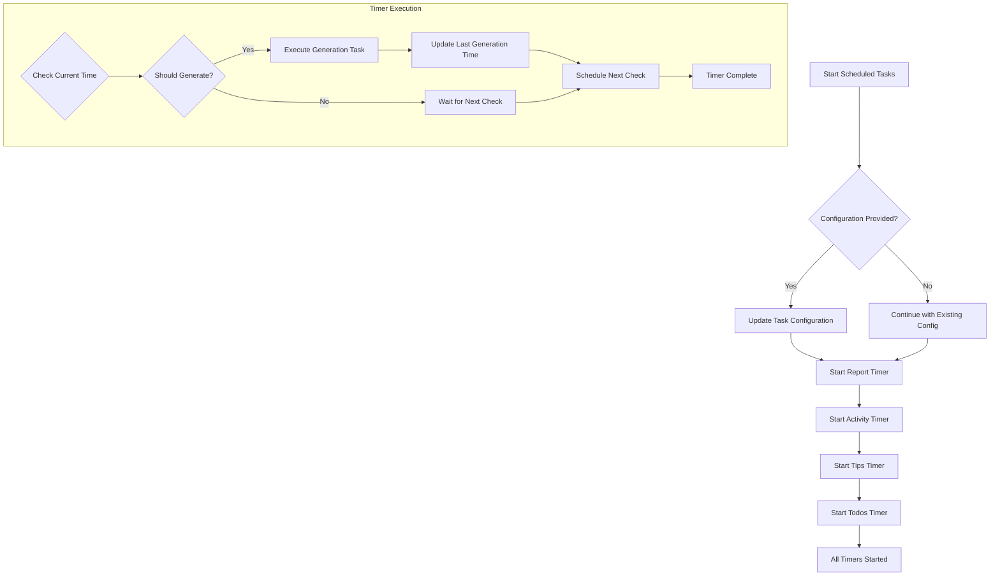
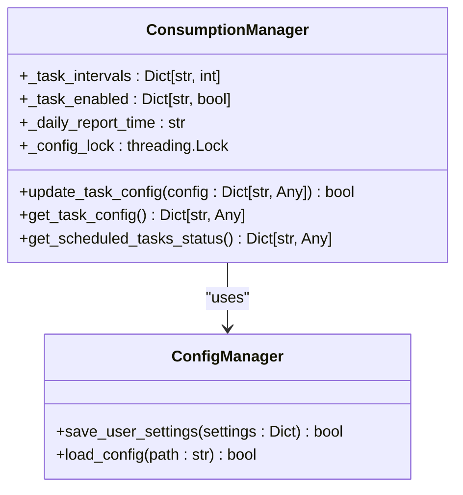
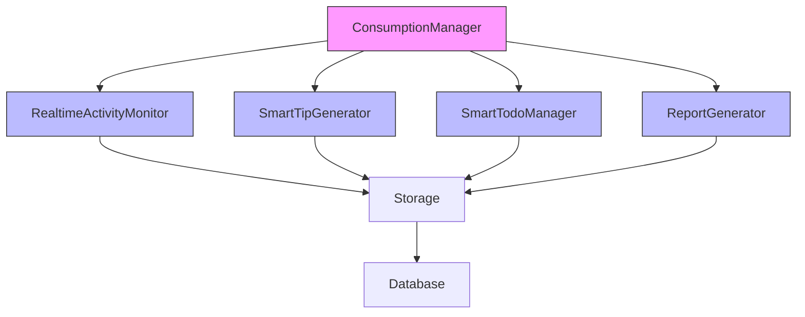
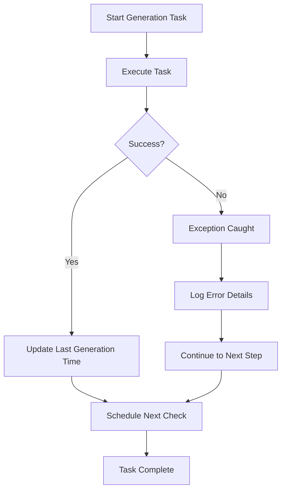
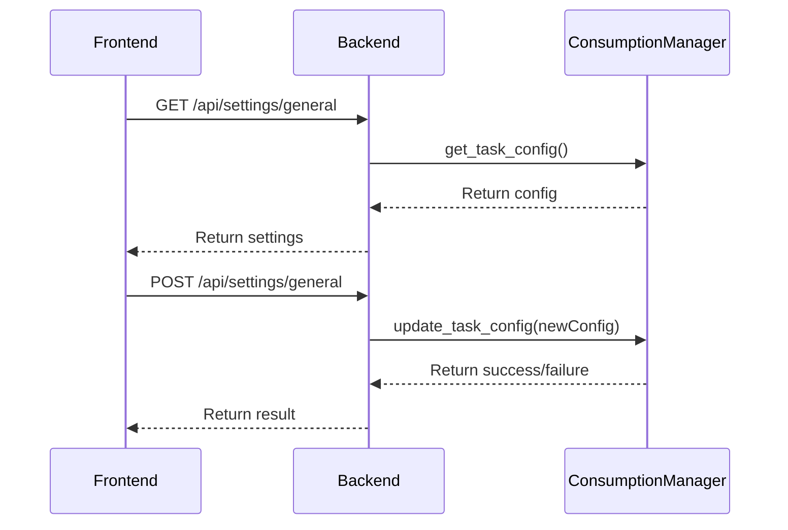
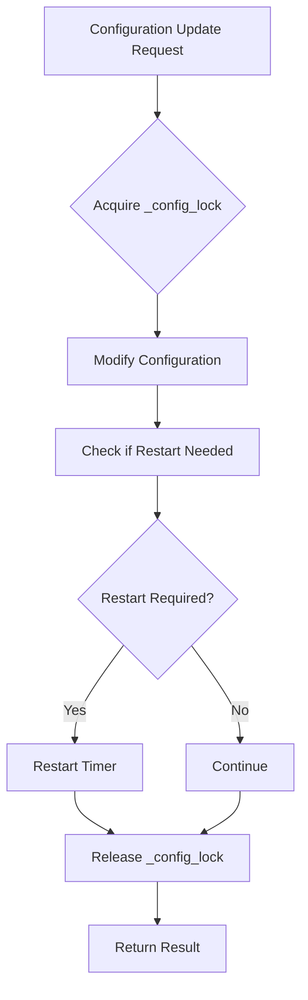

# Consumption Manager API

<cite>
**Referenced Files in This Document**   
- [consumption_manager.py](file://opencontext/managers/consumption_manager.py)
- [realtime_activity_monitor.py](file://opencontext/context_consumption/generation/realtime_activity_monitor.py)
- [smart_tip_generator.py](file://opencontext/context_consumption/generation/smart_tip_generator.py)
- [smart_todo_manager.py](file://opencontext/context_consumption/generation/smart_todo_manager.py)
- [settings.py](file://opencontext/server/routes/settings.py)
- [settings.html](file://opencontext/web/templates/settings.html)
- [settings.js](file://opencontext/web/static/js/settings.js)
- [global_config.py](file://opencontext/config/global_config.py)
</cite>

## Table of Contents
1. [Introduction](#introduction)
2. [Core Components](#core-components)
3. [Scheduled Task System](#scheduled-task-system)
4. [Configuration Management](#configuration-management)
5. [Service Integration](#service-integration)
6. [Error Handling and Retry Mechanisms](#error-handling-and-retry-mechanisms)
7. [Frontend Integration](#frontend-integration)
8. [Thread Safety and Shutdown](#thread-safety-and-shutdown)
9. [Conclusion](#conclusion)

## Introduction
The ConsumptionManager class serves as the central coordinator for context consumption components in the system. It manages scheduled tasks for activity monitoring, smart tip generation, and todo creation, providing a unified interface for content generation operations. The manager integrates with various service components to analyze user activity and generate valuable insights at configurable intervals. This documentation provides a comprehensive overview of the ConsumptionManager's architecture, functionality, and integration points.

## Core Components

The ConsumptionManager class is responsible for managing and coordinating context consumption components. It initializes and maintains references to key service components including ReportGenerator, RealtimeActivityMonitor, SmartTipGenerator, and SmartTodoManager. The manager handles the lifecycle of scheduled tasks, configuration updates, and system shutdown procedures. It also maintains statistics about content generation operations and provides methods for retrieving task status and configuration information.

**Section sources**
- [consumption_manager.py](file://opencontext/managers/consumption_manager.py#L31-L524)

## Scheduled Task System

The ConsumptionManager implements a comprehensive scheduled task system for automated content generation. The system manages four primary types of tasks: activity monitoring, smart tips, todo generation, and daily reports. Each task type has its own timer mechanism that periodically checks whether generation should occur based on configurable intervals.

**Diagram sources **
- [consumption_manager.py](file://opencontext/managers/consumption_manager.py#L132-L154)
- [consumption_manager.py](file://opencontext/managers/consumption_manager.py#L243-L356)

### Activity Monitoring Timer
The `_start_activity_timer` method initiates periodic generation of activity summaries by the RealtimeActivityMonitor service. The timer checks at regular intervals (calculated as 1/4 of the generation interval, up to a maximum) whether a new activity summary should be generated based on the elapsed time since the last generation. When the interval threshold is met, it calls the `generate_realtime_activity_summary` method with appropriate time boundaries.

**Section sources**
- [consumption_manager.py](file://opencontext/managers/consumption_manager.py#L243-L281)

### Smart Tips Timer
The `_start_tips_timer` method manages the periodic generation of intelligent reminders and suggestions through the SmartTipGenerator service. Similar to the activity timer, it operates on a check interval that is a fraction of the configured generation interval. When the time threshold is reached, it invokes the `generate_smart_tip` method, providing the necessary time range parameters for context analysis.

**Section sources**
- [consumption_manager.py](file://opencontext/managers/consumption_manager.py#L282-L317)

### Todo Generation Timer
The `_start_todos_timer` method controls the periodic identification and creation of todo items via the SmartTodoManager service. It follows the same timing pattern as other timers, checking at regular intervals whether a new todo generation cycle should be initiated. When appropriate, it calls the `generate_todo_tasks` method with start and end time parameters to define the analysis window.

**Section sources**
- [consumption_manager.py](file://opencontext/managers/consumption_manager.py#L319-L356)

## Configuration Management

The ConsumptionManager provides a flexible configuration system that allows dynamic updates to task intervals and scheduling parameters. The `update_task_config` method serves as the primary interface for modifying task configurations at runtime, supporting both interval-based tasks (activity, tips, todos) and the daily report task.

**Diagram sources **
- [consumption_manager.py](file://opencontext/managers/consumption_manager.py#L402-L482)
- [global_config.py](file://opencontext/config/global_config.py#L90-L112)

### Task Configuration Update Process
When a configuration update is requested, the system follows a thread-safe process to modify task parameters. The update operation is protected by the `_config_lock` to prevent race conditions. For each task type, the system evaluates whether the enabled status or interval has changed, and if so, determines whether the task timer needs to be restarted. This ensures that configuration changes take effect immediately without requiring a system restart.

**Section sources**
- [consumption_manager.py](file://opencontext/managers/consumption_manager.py#L402-L482)

### Daily Report Configuration
The daily report task has specific configuration parameters including the generation time (in HH:MM format) and enabled status. Updates to these parameters trigger a restart of the report timer to ensure the new schedule takes effect. The system calculates the appropriate delay until the next scheduled generation time, accounting for cases where the target time has already passed for the current day.

**Section sources**
- [consumption_manager.py](file://opencontext/managers/consumption_manager.py#L171-L185)
- [consumption_manager.py](file://opencontext/managers/consumption_manager.py#L450-L482)

## Service Integration

The ConsumptionManager integrates with several specialized service components to provide comprehensive context consumption capabilities. These services work together to analyze user activity and generate valuable insights in different formats.

**Diagram sources **
- [consumption_manager.py](file://opencontext/managers/consumption_manager.py#L17-L22)
- [consumption_manager.py](file://opencontext/managers/consumption_manager.py#L48-L86)

### RealtimeActivityMonitor Integration
The RealtimeActivityMonitor service analyzes recent user activity to generate concise summaries of work patterns and key insights. It retrieves context data from storage, processes it through a large language model with a specialized prompt, and stores the resulting activity summary in the database. The service also extracts relevant resources such as screenshots to provide visual context.

**Section sources**
- [realtime_activity_monitor.py](file://opencontext/context_consumption/generation/realtime_activity_monitor.py#L54-L129)

### SmartTipGenerator Integration
The SmartTipGenerator service creates personalized reminders and suggestions based on user activity patterns. It combines real-time context analysis with historical pattern recognition to generate intelligent tips that help users stay focused and productive. The service analyzes work time distribution, category trends, and key entities to identify opportunities for helpful suggestions.

**Section sources**
- [smart_tip_generator.py](file://opencontext/context_consumption/generation/smart_tip_generator.py#L40-L83)

### SmartTodoManager Integration
The SmartTodoManager service automatically identifies and creates todo items from user activity. It analyzes activity insights and relevant context data to extract potential tasks, then processes them to ensure completeness and consistency. The service includes sophisticated deduplication logic using vector similarity search to prevent redundant task creation.

**Section sources**
- [smart_todo_manager.py](file://opencontext/context_consumption/generation/smart_todo_manager.py#L46-L128)

## Error Handling and Retry Mechanisms

The ConsumptionManager and its integrated services implement comprehensive error handling to ensure reliable operation. Each generation task is wrapped in exception handling that logs failures without disrupting the overall system operation. This fault-tolerant design allows individual tasks to fail while others continue to function normally.

**Diagram sources **
- [consumption_manager.py](file://opencontext/managers/consumption_manager.py#L257-L273)
- [consumption_manager.py](file://opencontext/managers/consumption_manager.py#L289-L310)
- [consumption_manager.py](file://opencontext/managers/consumption_manager.py#L326-L349)

The system also includes retry mechanisms for content generation tasks. When a generation attempt fails, the system logs the error and continues with the normal scheduling cycle, effectively implementing an automatic retry on the next interval. This approach ensures that transient failures do not permanently prevent content generation.

**Section sources**
- [consumption_manager.py](file://opencontext/managers/consumption_manager.py#L271-L272)
- [consumption_manager.py](file://opencontext/managers/consumption_manager.py#L308-L309)
- [consumption_manager.py](file://opencontext/managers/consumption_manager.py#L347-L348)

## Frontend Integration

The ConsumptionManager's configuration system is accessible through the frontend settings interface, allowing users to modify generation intervals and scheduling parameters. The settings are exposed through API endpoints that handle both retrieval and update operations for content generation configuration.

**Diagram sources **
- [settings.py](file://opencontext/server/routes/settings.py#L330-L367)
- [settings.js](file://opencontext/web/static/js/settings.js#L173-L214)

The frontend settings page provides controls for enabling/disabling each content generation type and configuring their intervals. When users modify these settings and save them, the changes are sent to the backend where they are validated and applied to the ConsumptionManager instance.

**Section sources**
- [settings.html](file://opencontext/web/templates/settings.html#L228-L302)
- [settings.js](file://opencontext/web/static/js/settings.js#L147-L214)

## Thread Safety and Shutdown

The ConsumptionManager implements thread-safe operations through the use of the `_config_lock` threading lock. This lock protects critical sections of code that modify configuration state, ensuring that concurrent updates do not result in inconsistent or corrupted settings. The lock is used in the `update_task_config` method and related configuration update operations.

**Diagram sources **
- [consumption_manager.py](file://opencontext/managers/consumption_manager.py#L407-L417)
- [consumption_manager.py](file://opencontext/managers/consumption_manager.py#L382-L400)

The shutdown method provides a clean shutdown procedure that stops all scheduled tasks before the manager is terminated. This ensures that no orphaned timers continue to execute after the manager has been shut down. The method cancels all active timers and clears the timer collection to prevent memory leaks.

**Section sources**
- [consumption_manager.py](file://opencontext/managers/consumption_manager.py#L101-L111)
- [consumption_manager.py](file://opencontext/managers/consumption_manager.py#L156-L170)

## Conclusion
The ConsumptionManager class provides a robust and flexible system for automated content generation based on user activity. Its modular design allows for independent operation of different content types while providing a unified interface for configuration and control. The integration with specialized service components enables sophisticated analysis and insight generation, while the thread-safe configuration system allows for dynamic adjustments without service interruption. The comprehensive error handling and clean shutdown procedures ensure reliable operation in production environments.