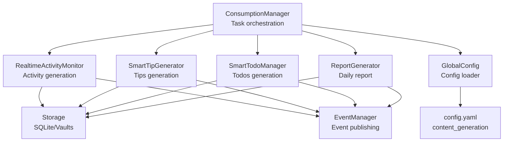
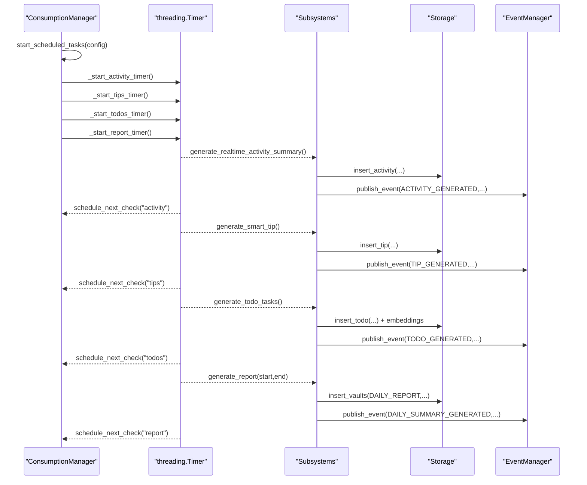
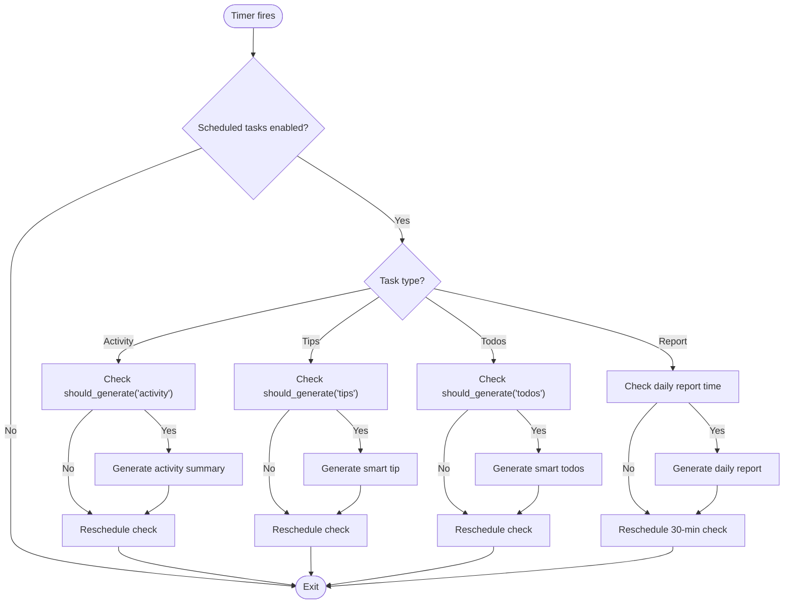
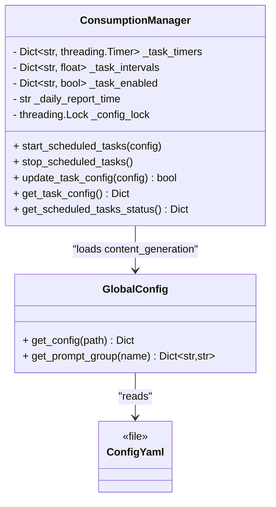
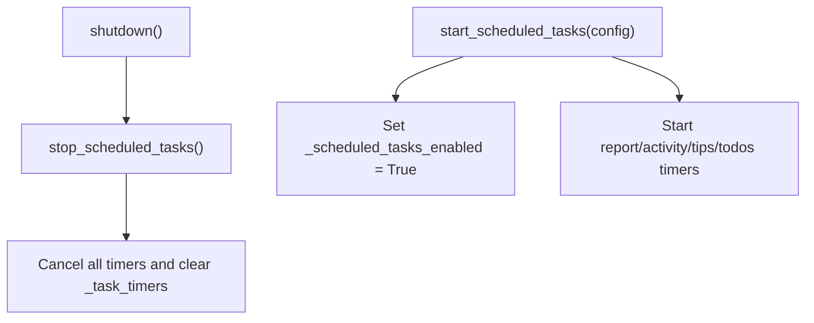
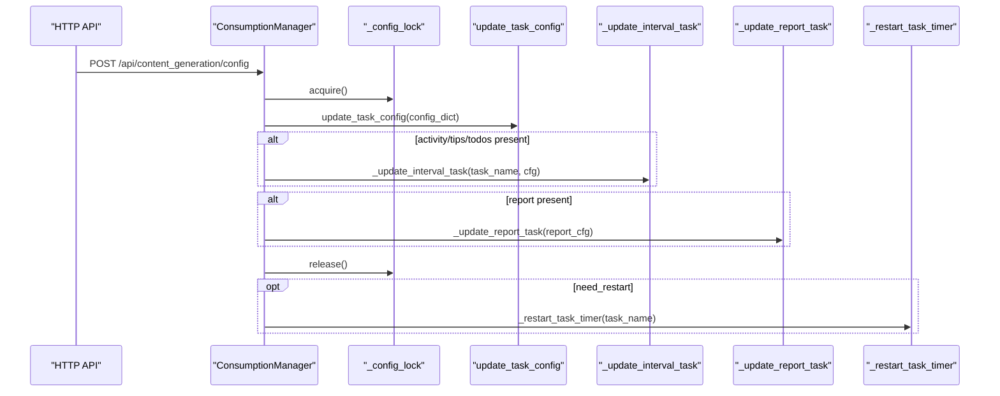
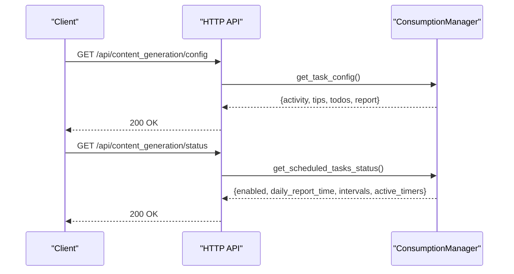
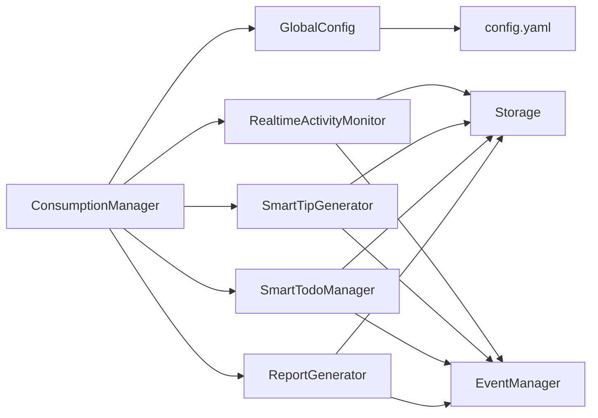

# Consumption Manager Core

<cite>
**Referenced Files in This Document**
- [consumption_manager.py](file://opencontext/managers/consumption_manager.py)
- [generation_report.py](file://opencontext/context_consumption/generation/generation_report.py)
- [realtime_activity_monitor.py](file://opencontext/context_consumption/generation/realtime_activity_monitor.py)
- [smart_tip_generator.py](file://opencontext/context_consumption/generation/smart_tip_generator.py)
- [smart_todo_manager.py](file://opencontext/context_consumption/generation/smart_todo_manager.py)
- [global_config.py](file://opencontext/config/global_config.py)
- [config.yaml](file://config/config.yaml)
- [content_generation.py](file://opencontext/server/routes/content_generation.py)
- [component_initializer.py](file://opencontext/server/component_initializer.py)
- [event_manager.py](file://opencontext/managers/event_manager.py)
- [sqlite_backend.py](file://opencontext/storage/backends/sqlite_backend.py)
</cite>

## Table of Contents
1. [Introduction](#introduction)
2. [Project Structure](#project-structure)
3. [Core Components](#core-components)
4. [Architecture Overview](#architecture-overview)
5. [Detailed Component Analysis](#detailed-component-analysis)
6. [Dependency Analysis](#dependency-analysis)
7. [Performance Considerations](#performance-considerations)
8. [Troubleshooting Guide](#troubleshooting-guide)
9. [Conclusion](#conclusion)

## Introduction
This document provides comprehensive documentation for the ConsumptionManager class, focusing on its core functionality beyond the specific content generation subsystems. It covers the task scheduling infrastructure, configuration management, statistics tracking, lifecycle management, dynamic configuration updates, and monitoring capabilities. The goal is to make the internal workings accessible to both developers and operators who need to understand, configure, and troubleshoot the consumption pipeline.

## Project Structure
The ConsumptionManager orchestrates three primary generation subsystems:
- Real-time activity monitoring
- Smart tips generation
- Smart todos generation
- Daily report generation

These subsystems are backed by configuration loaded from the global configuration and persisted to the database via storage abstractions. The manager coordinates periodic execution using threading.Timer and exposes runtime controls and monitoring endpoints.

**Diagram sources**
- [consumption_manager.py](file://opencontext/managers/consumption_manager.py#L31-L110)
- [realtime_activity_monitor.py](file://opencontext/context_consumption/generation/realtime_activity_monitor.py#L60-L129)
- [smart_tip_generator.py](file://opencontext/context_consumption/generation/smart_tip_generator.py#L46-L87)
- [smart_todo_manager.py](file://opencontext/context_consumption/generation/smart_todo_manager.py#L52-L132)
- [generation_report.py](file://opencontext/context_consumption/generation/generation_report.py#L34-L74)
- [global_config.py](file://opencontext/config/global_config.py#L236-L282)
- [config.yaml](file://config/config.yaml#L216-L239)
- [sqlite_backend.py](file://opencontext/storage/backends/sqlite_backend.py#L256-L275)
- [event_manager.py](file://opencontext/managers/event_manager.py#L63-L116)

**Section sources**
- [consumption_manager.py](file://opencontext/managers/consumption_manager.py#L31-L110)
- [global_config.py](file://opencontext/config/global_config.py#L236-L282)
- [config.yaml](file://config/config.yaml#L216-L239)

## Core Components
- ConsumptionManager: Central coordinator for scheduled tasks, configuration, and lifecycle.
- Generation subsystems: RealtimeActivityMonitor, SmartTipGenerator, SmartTodoManager, ReportGenerator.
- GlobalConfig and config.yaml: Provide content_generation configuration.
- Storage and EventManager: Persist outputs and publish events.

Key responsibilities:
- Manage _task_timers dictionary keyed by task names and driven by threading.Timer.
- Maintain _task_intervals and _task_enabled for interval-based tasks and report task.
- Enforce thread-safe updates via _config_lock.
- Track statistics for total_queries, total_contexts_consumed, and errors across consumers.
- Provide lifecycle methods: start_scheduled_tasks, stop_scheduled_tasks, shutdown.
- Expose monitoring: get_scheduled_tasks_status, get_task_config, update_task_config.

**Section sources**
- [consumption_manager.py](file://opencontext/managers/consumption_manager.py#L31-L110)
- [consumption_manager.py](file://opencontext/managers/consumption_manager.py#L132-L170)
- [consumption_manager.py](file://opencontext/managers/consumption_manager.py#L372-L401)
- [consumption_manager.py](file://opencontext/managers/consumption_manager.py#L402-L512)
- [consumption_manager.py](file://opencontext/managers/consumption_manager.py#L513-L524)

## Architecture Overview
The ConsumptionManager initializes from GlobalConfig, loads content_generation settings, and starts four scheduled tasks:
- Activity generation
- Tips generation
- Todos generation
- Daily report generation

Each task uses a separate threading.Timer and checks whether it should generate based on elapsed time versus configured interval. Interval-based tasks also schedule recurring checks at 1/4 of their generation interval (with limits). The report task schedules checks every 30 minutes and generates only once per day at the configured time.

**Diagram sources**
- [consumption_manager.py](file://opencontext/managers/consumption_manager.py#L243-L371)
- [realtime_activity_monitor.py](file://opencontext/context_consumption/generation/realtime_activity_monitor.py#L60-L129)
- [smart_tip_generator.py](file://opencontext/context_consumption/generation/smart_tip_generator.py#L46-L87)
- [smart_todo_manager.py](file://opencontext/context_consumption/generation/smart_todo_manager.py#L52-L132)
- [generation_report.py](file://opencontext/context_consumption/generation/generation_report.py#L34-L74)
- [event_manager.py](file://opencontext/managers/event_manager.py#L63-L116)

## Detailed Component Analysis

### Task Scheduling Infrastructure
- _task_timers: Dictionary mapping task names ("activity", "tips", "todos", "report") to threading.Timer instances.
- Threading.Timer usage: Each task defines a callback that checks conditions and either executes generation or reschedules itself.
- Check intervals: For interval-based tasks, the manager calculates a check interval as min(interval/4, max_check) with per-task limits.
- Recurrence: After execution, tasks schedule the next check only if the manager is still enabled and the task is enabled.

**Diagram sources**
- [consumption_manager.py](file://opencontext/managers/consumption_manager.py#L112-L127)
- [consumption_manager.py](file://opencontext/managers/consumption_manager.py#L358-L371)
- [consumption_manager.py](file://opencontext/managers/consumption_manager.py#L243-L371)

**Section sources**
- [consumption_manager.py](file://opencontext/managers/consumption_manager.py#L112-L127)
- [consumption_manager.py](file://opencontext/managers/consumption_manager.py#L358-L371)
- [consumption_manager.py](file://opencontext/managers/consumption_manager.py#L243-L371)

### Configuration Management System
- Initialization loads content_generation from GlobalConfig and sets:
  - _task_intervals: default intervals for activity, tips, todos
  - _task_enabled: enable/disable flags for each task plus report
  - _daily_report_time: default time for daily report
- Thread-safe updates:
  - _config_lock protects concurrent updates to intervals and enable flags.
  - update_task_config applies partial updates and triggers restarts when needed.
- Dynamic updates:
  - _update_interval_task handles activity/tips/todos updates (enabled flag and interval).
  - _update_report_task handles report enabled flag and time updates.
  - _restart_task_timer cancels and restarts the appropriate timer.

**Diagram sources**
- [consumption_manager.py](file://opencontext/managers/consumption_manager.py#L53-L87)
- [consumption_manager.py](file://opencontext/managers/consumption_manager.py#L402-L512)
- [global_config.py](file://opencontext/config/global_config.py#L236-L282)
- [config.yaml](file://config/config.yaml#L216-L239)

**Section sources**
- [consumption_manager.py](file://opencontext/managers/consumption_manager.py#L53-L87)
- [consumption_manager.py](file://opencontext/managers/consumption_manager.py#L402-L512)
- [global_config.py](file://opencontext/config/global_config.py#L236-L282)
- [config.yaml](file://config/config.yaml#L216-L239)

### Statistics Tracking System
- Internal statistics structure:
  - total_queries
  - total_contexts_consumed
  - errors
  - consumers: per-consumer counters (queries, contexts_consumed, errors)
- Reset capability via reset_statistics to zero counters.
- Consumers are tracked by name; the structure is initialized empty and populated on demand.

Note: The ConsumptionManager maintains these counters locally. The generation subsystems do not directly update these counters in the shown code paths.

**Section sources**
- [consumption_manager.py](file://opencontext/managers/consumption_manager.py#L41-L46)
- [consumption_manager.py](file://opencontext/managers/consumption_manager.py#L513-L524)

### Lifecycle Management Methods
- start_scheduled_tasks:
  - Optionally updates daily_report_time and intervals from provided config.
  - Sets _scheduled_tasks_enabled = True.
  - Starts timers for report, activity, tips, and todos.
- stop_scheduled_tasks:
  - Cancels all timers and clears _task_timers.
  - Logs that scheduled tasks were stopped.
- shutdown:
  - Calls stop_scheduled_tasks and logs completion.

**Diagram sources**
- [consumption_manager.py](file://opencontext/managers/consumption_manager.py#L101-L111)
- [consumption_manager.py](file://opencontext/managers/consumption_manager.py#L132-L170)

**Section sources**
- [consumption_manager.py](file://opencontext/managers/consumption_manager.py#L101-L111)
- [consumption_manager.py](file://opencontext/managers/consumption_manager.py#L132-L170)

### Update Task Configuration
- update_task_config:
  - Uses _config_lock to apply partial updates.
  - Iterates over activity, tips, todos and calls _update_interval_task.
  - If report is present, calls _update_report_task.
- _update_interval_task:
  - Updates enabled flag and/or interval for interval-based tasks.
  - Triggers restart if enabled changed or interval changed and task is enabled.
- _update_report_task:
  - Updates enabled flag and/or time for report task.
  - Triggers restart if enabled changed or time changed and task is enabled.
- _restart_task_timer:
  - Stops existing timer and starts the appropriate timer based on task type.

**Diagram sources**
- [consumption_manager.py](file://opencontext/managers/consumption_manager.py#L402-L512)
- [content_generation.py](file://opencontext/server/routes/content_generation.py#L88-L143)

**Section sources**
- [consumption_manager.py](file://opencontext/managers/consumption_manager.py#L402-L512)
- [content_generation.py](file://opencontext/server/routes/content_generation.py#L88-L143)

### Monitoring and Configuration Retrieval
- get_scheduled_tasks_status:
  - Returns enabled flag, daily_report_time, intervals, and active_timers.
- get_task_config:
  - Returns detailed configuration under content_generation: activity, tips, todos, report.

**Diagram sources**
- [consumption_manager.py](file://opencontext/managers/consumption_manager.py#L372-L401)
- [content_generation.py](file://opencontext/server/routes/content_generation.py#L69-L87)

**Section sources**
- [consumption_manager.py](file://opencontext/managers/consumption_manager.py#L372-L401)
- [content_generation.py](file://opencontext/server/routes/content_generation.py#L69-L87)

## Dependency Analysis
- ConsumptionManager depends on:
  - GlobalConfig for content_generation configuration
  - Generation subsystems for actual work
  - Storage for persistence
  - EventManager for publishing events
- Generation subsystems depend on:
  - GlobalConfig for prompts
  - Storage for reads/writes
  - ToolsExecutor for tool calls (in some subsystems)
- Configuration comes from config.yaml under content_generation section.

**Diagram sources**
- [consumption_manager.py](file://opencontext/managers/consumption_manager.py#L53-L87)
- [global_config.py](file://opencontext/config/global_config.py#L236-L282)
- [config.yaml](file://config/config.yaml#L216-L239)
- [realtime_activity_monitor.py](file://opencontext/context_consumption/generation/realtime_activity_monitor.py#L60-L129)
- [smart_tip_generator.py](file://opencontext/context_consumption/generation/smart_tip_generator.py#L46-L87)
- [smart_todo_manager.py](file://opencontext/context_consumption/generation/smart_todo_manager.py#L52-L132)
- [generation_report.py](file://opencontext/context_consumption/generation/generation_report.py#L34-L74)

**Section sources**
- [consumption_manager.py](file://opencontext/managers/consumption_manager.py#L53-L87)
- [global_config.py](file://opencontext/config/global_config.py#L236-L282)
- [config.yaml](file://config/config.yaml#L216-L239)

## Performance Considerations
- Timer granularity: Check intervals are limited to 1/4 of the generation interval with per-task caps to avoid excessive polling.
- Async vs sync: Report generation uses asyncio.run to call async methods from a synchronous timer callback; ensure the event loop is available and not blocked by long-running tasks.
- Concurrency in report generation: ReportGenerator processes hourly chunks concurrently with a semaphore to bound concurrency.
- Storage indexing: SQLite backend creates indexes for activity, tips, and vaults to support efficient queries during generation.

[No sources needed since this section provides general guidance]

## Troubleshooting Guide
Common issues and remedies:
- Timers not firing:
  - Verify start_scheduled_tasks was called and _scheduled_tasks_enabled is True.
  - Check that tasks are enabled in content_generation config.
- Tasks not restarting after config change:
  - Ensure update_task_config is invoked and _config_lock is not held indefinitely.
  - Confirm _restart_task_timer is reached when enabled flag or interval/time changes.
- Report generation not occurring daily:
  - Verify _daily_report_time format and that the daily check runs at least once per day.
  - Confirm the last report date is updated to prevent duplicate generation on the same day.
- Exceptions during generation:
  - Generation subsystems log exceptions; review logs around the time of failure.
  - For report generation, exceptions are caught and logged; the timer continues scheduling checks.

Operational endpoints:
- GET /api/content_generation/config: Retrieve current configuration.
- POST /api/content_generation/config: Update configuration (partial updates supported).
- GET /api/content_generation/status: Inspect enabled state, intervals, and active timers.

**Section sources**
- [consumption_manager.py](file://opencontext/managers/consumption_manager.py#L101-L111)
- [consumption_manager.py](file://opencontext/managers/consumption_manager.py#L132-L170)
- [consumption_manager.py](file://opencontext/managers/consumption_manager.py#L243-L371)
- [consumption_manager.py](file://opencontext/managers/consumption_manager.py#L402-L512)
- [content_generation.py](file://opencontext/server/routes/content_generation.py#L69-L143)

## Conclusion
The ConsumptionManager provides a robust, thread-safe, and configurable orchestration layer for content generation tasks. Its scheduling uses lightweight threading.Timer with sensible check intervals, while configuration updates are applied atomically with locks. The manager integrates tightly with storage and event systems to persist outputs and notify downstream components. Operators can monitor and tune behavior via runtime endpoints and configuration files, ensuring predictable and maintainable operation.