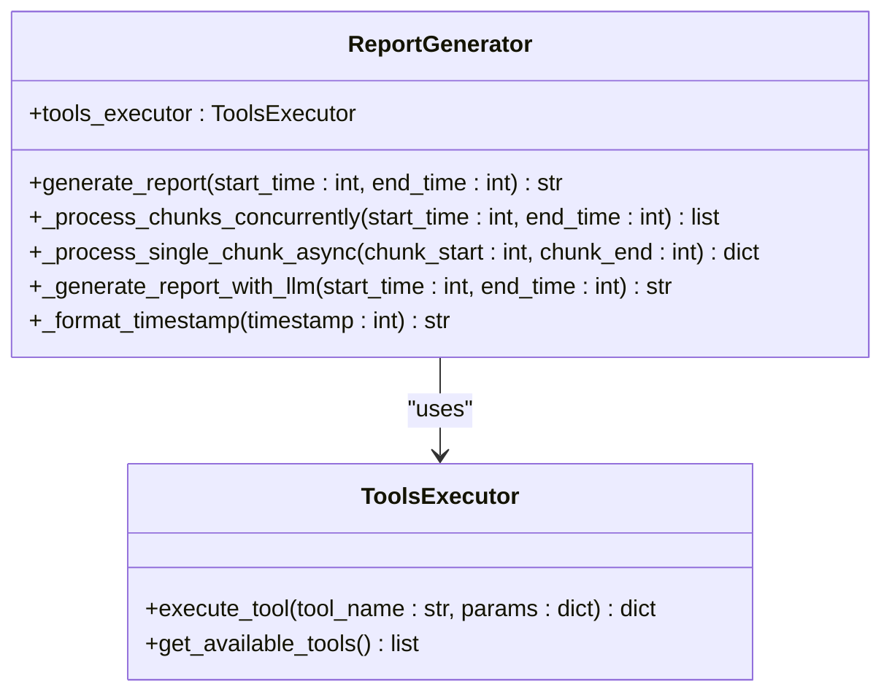
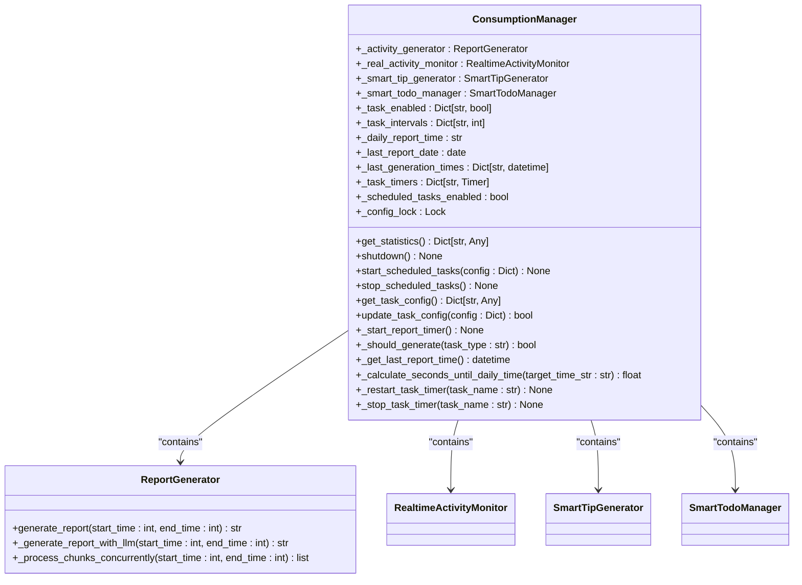
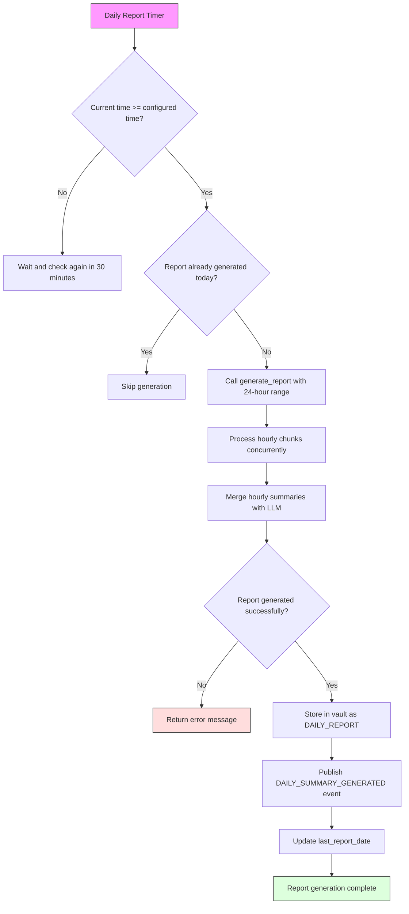
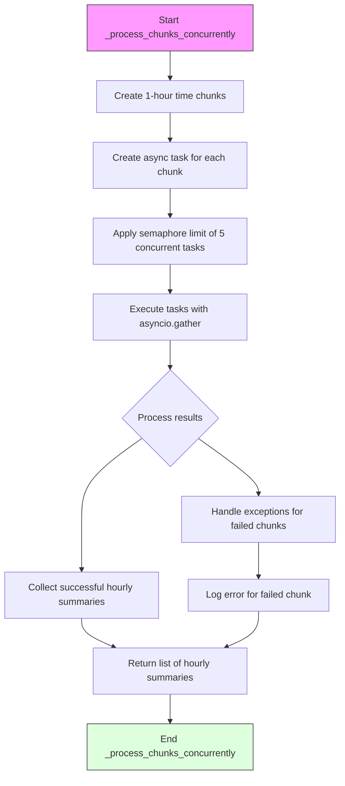
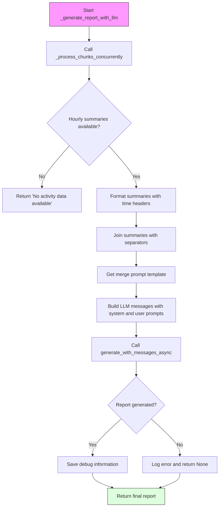
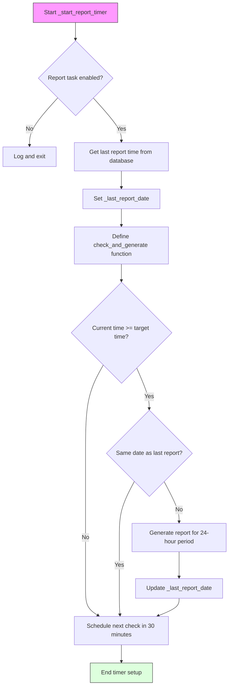
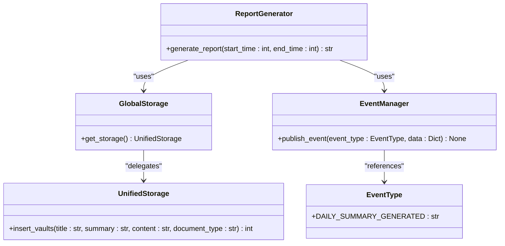
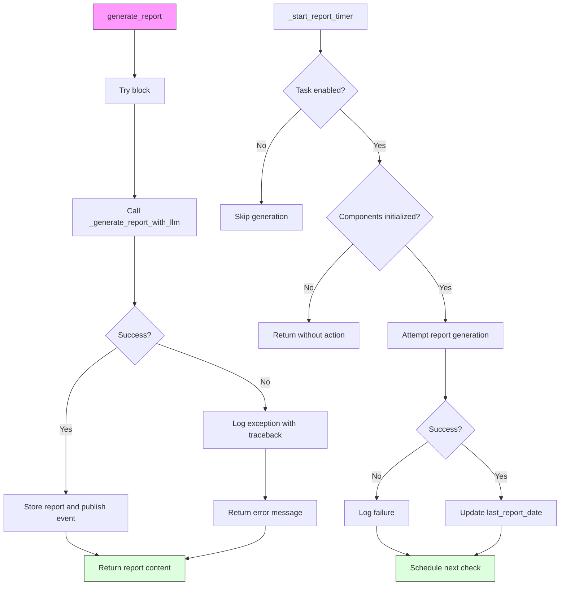
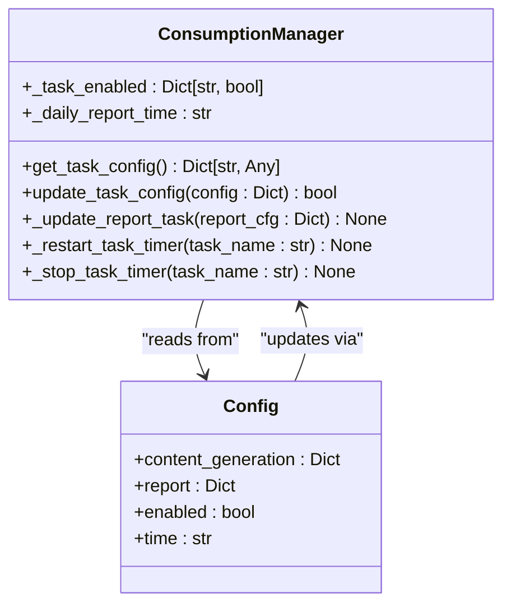
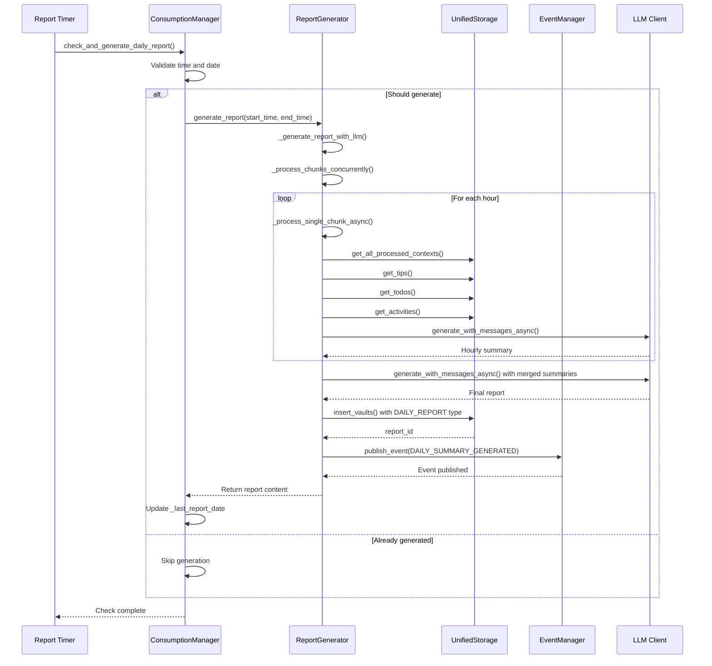

# Daily Report API

<cite>
**Referenced Files in This Document**   
- [generation_report.py](file://opencontext/context_consumption/generation/generation_report.py)
- [consumption_manager.py](file://opencontext/managers/consumption_manager.py)
- [config.yaml](file://config/config.yaml)
- [enums.py](file://opencontext/models/enums.py)
- [global_storage.py](file://opencontext/storage/global_storage.py)
- [unified_storage.py](file://opencontext/storage/unified_storage.py)
- [event_manager.py](file://opencontext/managers/event_manager.py)
</cite>

## Table of Contents
1. [Introduction](#introduction)
2. [ReportGenerator Class Overview](#reportgenerator-class-overview)
3. [Integration with ConsumptionManager](#integration-with-consumptionmanager)
4. [Daily Report Generation Workflow](#daily-report-generation-workflow)
5. [Concurrent Chunk Processing](#concurrent-chunk-processing)
6. [Report Merging with LLM](#report-merging-with-llm)
7. [Report Generation Schedule](#report-generation-schedule)
8. [Storage and Event Publishing](#storage-and-event-publishing)
9. [Error Handling and Retry Mechanisms](#error-handling-and-retry-mechanisms)
10. [Configuration Options](#configuration-options)
11. [Sequence Diagram](#sequence-diagram)

## Introduction
The Daily Report API provides automated generation of comprehensive daily activity reports in Markdown format. This system integrates the ReportGenerator class with the ConsumptionManager to create structured summaries of user activities, tips, todos, and other contextual information. The reports are generated on a scheduled basis, stored in the vault system, and published as events for downstream consumption. This documentation details the architecture, workflow, configuration, and integration points of the daily report generation system.

## ReportGenerator Class Overview
The ReportGenerator class is responsible for creating daily activity reports by aggregating contextual data from various sources and processing it through a large language model (LLM). The class orchestrates the entire report generation process, from data collection to final output creation.

The primary entry point is the `generate_report` method, which takes a time range (start_time and end_time as Unix timestamps) and returns a Markdown-formatted report. This method coordinates the processing of hourly chunks of data, merges the results, and handles storage and event publishing.

**Diagram sources**
- [generation_report.py](file://opencontext/context_consumption/generation/generation_report.py#L26-L277)

**Section sources**
- [generation_report.py](file://opencontext/context_consumption/generation/generation_report.py#L26-L277)

## Integration with ConsumptionManager
The ReportGenerator is integrated into the system through the ConsumptionManager, which acts as a central coordinator for all context consumption components. The ConsumptionManager initializes the ReportGenerator during startup and manages its lifecycle, configuration, and scheduling.

The ConsumptionManager maintains a reference to the ReportGenerator instance as `_activity_generator` and uses it to generate reports according to the configured schedule. This integration allows for centralized configuration management, statistics collection, and error handling across all consumption components.

**Diagram sources**
- [consumption_manager.py](file://opencontext/managers/consumption_manager.py#L31-L524)

**Section sources**
- [consumption_manager.py](file://opencontext/managers/consumption_manager.py#L31-L524)

## Daily Report Generation Workflow
The daily report generation process follows a structured workflow that begins with the ConsumptionManager's scheduled timer and ends with a stored report and published event. The workflow is triggered daily at the configured time, provided that no report has already been generated for the current day.

The process starts when the `_start_report_timer` method in ConsumptionManager checks if the current time has passed the configured daily report time (default 08:00) and if no report has been generated for the current date. If both conditions are met, the system initiates the report generation process by calling the ReportGenerator's `generate_report` method with a 24-hour time range (from 24 hours ago to the current time).

The `generate_report` method first calls `_generate_report_with_llm` to create the report content. Upon successful generation, it stores the report in the vault system using `insert_vaults` with the document type DAILY_REPORT and publishes a DAILY_SUMMARY_GENERATED event. If any error occurs during the process, it is logged and a descriptive error message is returned.

**Diagram sources**
- [consumption_manager.py](file://opencontext/managers/consumption_manager.py#L200-L241)
- [generation_report.py](file://opencontext/context_consumption/generation/generation_report.py#L34-L73)

**Section sources**
- [consumption_manager.py](file://opencontext/managers/consumption_manager.py#L200-L241)
- [generation_report.py](file://opencontext/context_consumption/generation/generation_report.py#L34-L73)

## Concurrent Chunk Processing
The `_process_chunks_concurrently` method implements a parallel processing strategy to efficiently handle large volumes of contextual data. This method divides the reporting period into hourly segments and processes each segment concurrently using asyncio, significantly improving performance compared to sequential processing.

The method first creates 1-hour time chunks covering the entire reporting period. It then creates an asynchronous task for each chunk, using `_process_single_chunk_async` to process the data within that time window. To prevent overwhelming system resources, a semaphore limits the number of concurrent tasks to 5.

Each chunk processing task retrieves relevant contextual data from multiple sources including activity contexts, semantic contexts, entity contexts, intent contexts, procedural contexts, tips, todos, and activities. This data is formatted and sent to the LLM to generate a summary for that specific hour. The results from all chunks are collected, with any failed chunks logged as errors while successful summaries are preserved.

**Diagram sources**
- [generation_report.py](file://opencontext/context_consumption/generation/generation_report.py#L76-L109)

**Section sources**
- [generation_report.py](file://opencontext/context_consumption/generation/generation_report.py#L76-L109)

## Report Merging with LLM
The `_generate_report_with_llm` method is responsible for creating a comprehensive daily report by merging the hourly summaries generated by the concurrent processing step. This method orchestrates the final stage of report generation, combining fragmented hourly insights into a cohesive narrative.

After collecting all hourly summaries, the method formats them with clear time headers and separates them with horizontal rules. This structured input is then combined with a system prompt and user prompt template to create a message sequence for the LLM. The prompt includes the formatted hourly summaries and requests the LLM to synthesize them into a comprehensive daily report.

The method uses the `generate_with_messages_async` function to call the LLM with the prepared messages. Upon receiving the response, it saves debug information using `DebugHelper.save_generation_debug` for troubleshooting and auditing purposes. The method includes error handling to return appropriate messages if the LLM fails to generate content or if no data is available for the specified time range.

**Diagram sources**
- [generation_report.py](file://opencontext/context_consumption/generation/generation_report.py#L206-L264)

**Section sources**
- [generation_report.py](file://opencontext/context_consumption/generation/generation_report.py#L206-L264)

## Report Generation Schedule
The report generation schedule is managed by the ConsumptionManager's timer system, which ensures reports are generated at the configured time while preventing duplicates. The default generation time is set to 08:00, but this can be customized through configuration.

The scheduling mechanism uses a combination of time-based triggers and state tracking to determine when to generate a new report. The `_start_report_timer` method sets up a recurring check that runs every 30 minutes. During each check, the system compares the current time with the configured daily report time and verifies whether a report has already been generated for the current date.

The system retrieves the last report generation time from the database by querying for the most recent vault entry of type DAILY_REPORT. This timestamp is used to set the `_last_report_date` attribute, which prevents duplicate generation on the same day. The scheduling logic also respects the enabled/disabled state of the report task, allowing for dynamic control over report generation.

**Diagram sources**
- [consumption_manager.py](file://opencontext/managers/consumption_manager.py#L200-L241)

**Section sources**
- [consumption_manager.py](file://opencontext/managers/consumption_manager.py#L200-L241)

## Storage and Event Publishing
The system implements a robust storage and event publishing mechanism to persist generated reports and notify downstream components. After successful report generation, the content is stored in the vault system and an event is published to the event bus.

The storage mechanism uses the `insert_vaults` method to create a new vault entry with the document type DAILY_REPORT. The entry includes the report title (formatted with the current date), empty summary, the full Markdown content, and the appropriate document type. This storage operation is performed through the UnifiedStorage system, which routes the request to the appropriate backend (typically SQLite for document storage).

Simultaneously, the system publishes a DAILY_SUMMARY_GENERATED event through the event manager. This event includes metadata such as the document ID, document type, title, and content, enabling other system components to react to the new report. The event publishing mechanism supports various notification channels and is used by the frontend to display proactive feed notifications.

**Diagram sources**
- [generation_report.py](file://opencontext/context_consumption/generation/generation_report.py#L54-L69)
- [unified_storage.py](file://opencontext/storage/unified_storage.py#L475-L494)
- [event_manager.py](file://opencontext/managers/event_manager.py#L25-L34)

**Section sources**
- [generation_report.py](file://opencontext/context_consumption/generation/generation_report.py#L54-L69)
- [unified_storage.py](file://opencontext/storage/unified_storage.py#L475-L494)
- [event_manager.py](file://opencontext/managers/event_manager.py#L25-L34)

## Error Handling and Retry Mechanisms
The system implements comprehensive error handling and retry mechanisms to ensure reliable report generation. Both the ReportGenerator and ConsumptionManager include multiple layers of exception handling to gracefully manage failures and prevent system crashes.

In the ReportGenerator, the `generate_report` method wraps the entire process in a try-catch block, ensuring that any exceptions are logged with full traceback information and converted to user-friendly error messages. Similarly, the `_process_single_chunk_async` method handles exceptions for individual time chunks, allowing the system to continue processing other chunks even if one fails.

The ConsumptionManager implements additional safeguards, including validation of component initialization before attempting report generation and periodic retry logic through the timer system. If report generation fails, the error is logged, but the timer continues to check for the next generation opportunity every 30 minutes.

The system also includes configuration-based enable/disable controls that prevent report generation when disabled, avoiding unnecessary error conditions. The `_should_generate` method in ConsumptionManager provides an additional safety check by verifying task intervals and enabled states before initiating any generation process.

**Section sources**
- [generation_report.py](file://opencontext/context_consumption/generation/generation_report.py#L45-L73)
- [consumption_manager.py](file://opencontext/managers/consumption_manager.py#L212-L233)

## Configuration Options
The report generation system provides flexible configuration options that allow users to enable/disable reports and modify the generation time. These settings are managed through the ConsumptionManager and can be dynamically updated at runtime.

Configuration is primarily controlled through the `content_generation.report` section in the system configuration. The two key parameters are `enabled` (boolean) and `time` (string in HH:MM format). The default configuration enables reports and sets the generation time to 08:00.

The ConsumptionManager exposes methods to retrieve and update these settings. The `get_task_config` method returns the current configuration for all tasks, including reports, while `update_task_config` allows dynamic updates. When the report configuration is modified, the system automatically restarts the report timer to apply the changes, ensuring that the new settings take effect immediately.

The configuration system also includes validation and error handling to ensure that only valid time formats are accepted and that configuration updates are applied safely. The system logs configuration changes for auditing purposes and handles exceptions during update operations to maintain system stability.

**Diagram sources**
- [consumption_manager.py](file://opencontext/managers/consumption_manager.py#L380-L482)
- [config.yaml](file://config/config.yaml#L236-L238)

**Section sources**
- [consumption_manager.py](file://opencontext/managers/consumption_manager.py#L380-L482)
- [config.yaml](file://config/config.yaml#L236-L238)

## Sequence Diagram
The following sequence diagram illustrates the complete workflow of daily report generation, from the initial timer trigger to the final storage and event publishing.

**Diagram sources**
- [consumption_manager.py](file://opencontext/managers/consumption_manager.py#L200-L241)
- [generation_report.py](file://opencontext/context_consumption/generation/generation_report.py#L34-L73)
- [unified_storage.py](file://opencontext/storage/unified_storage.py#L475-L494)
- [event_manager.py](file://opencontext/managers/event_manager.py#L55-L61)