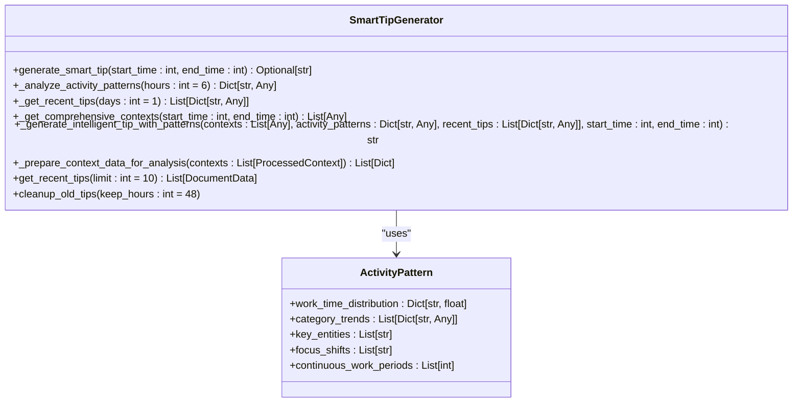
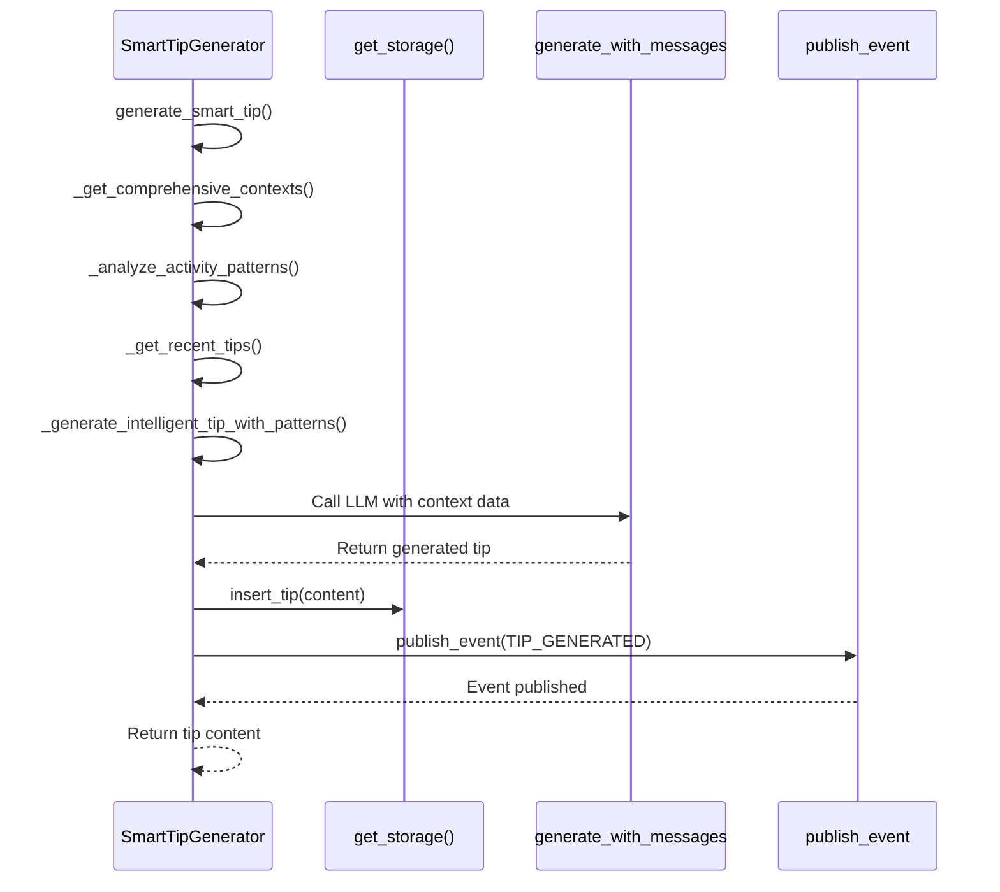
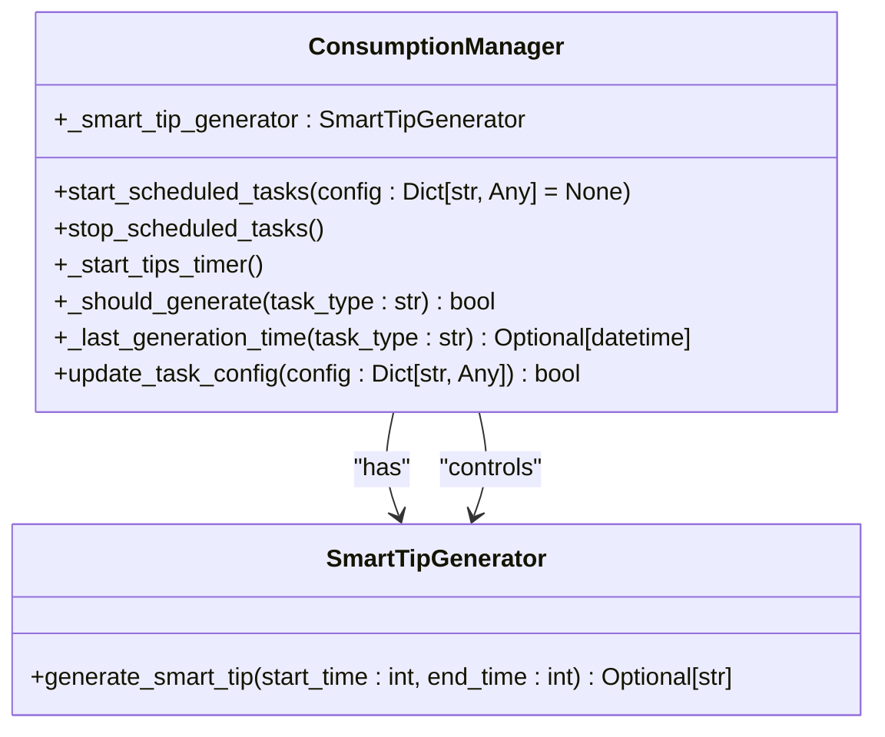
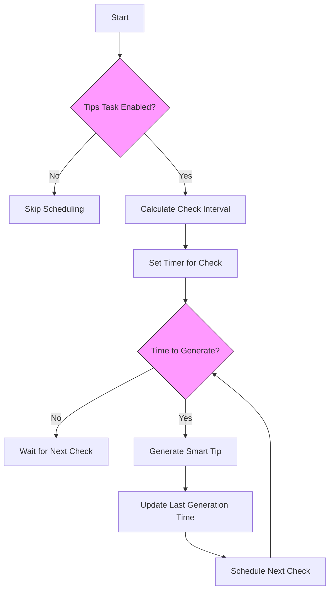
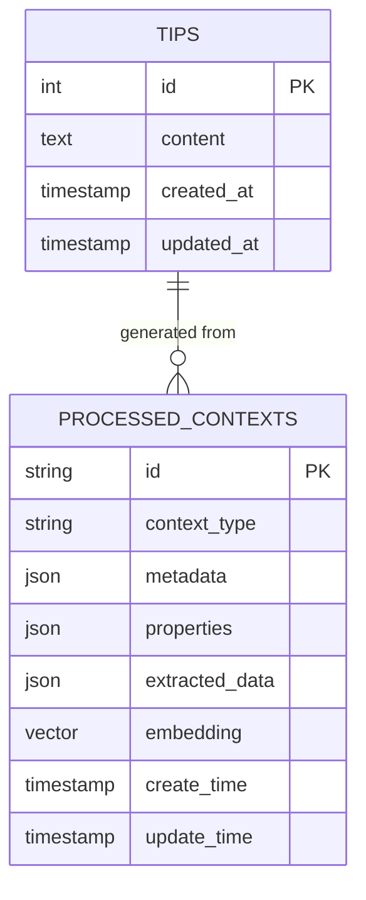
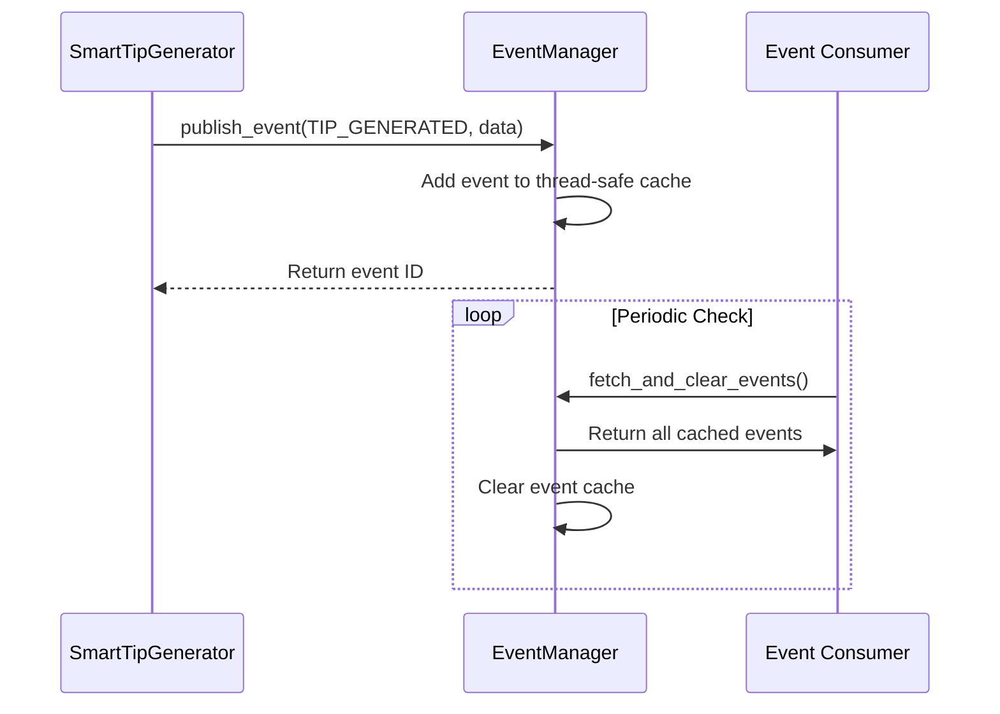
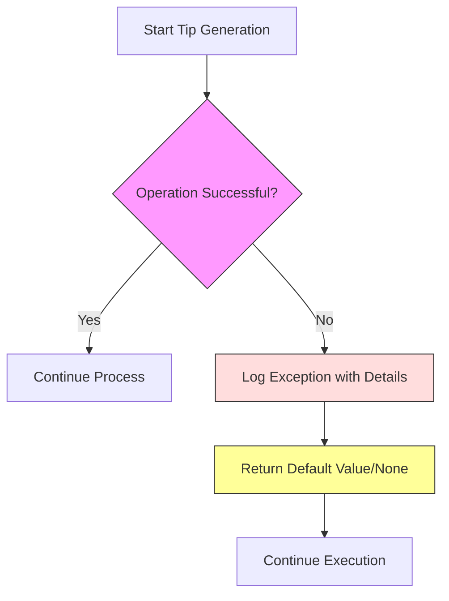
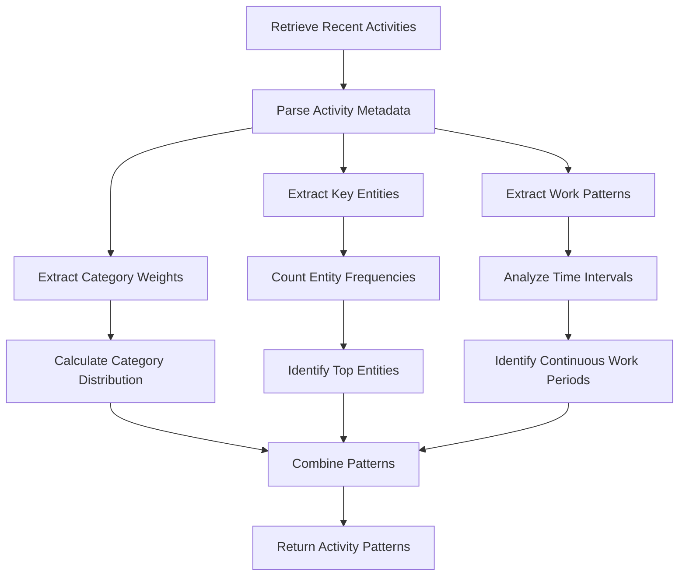
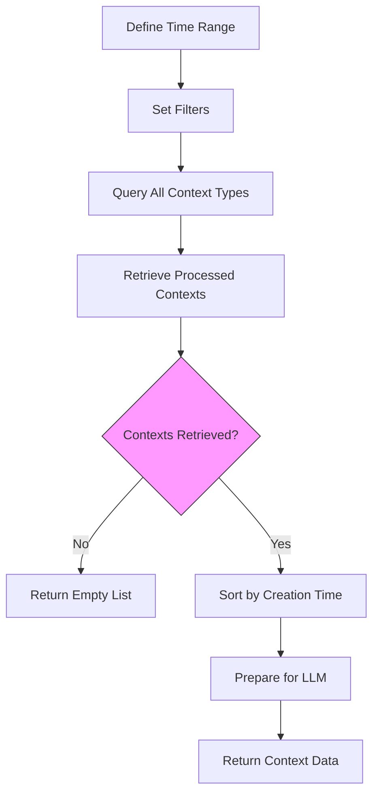

# Smart Tips API

<cite>
**Referenced Files in This Document**   
- [smart_tip_generator.py](file://opencontext/context_consumption/generation/smart_tip_generator.py)
- [consumption_manager.py](file://opencontext/managers/consumption_manager.py)
- [config.yaml](file://config/config.yaml)
- [global_config.py](file://opencontext/config/global_config.py)
- [base_storage.py](file://opencontext/storage/base_storage.py)
- [unified_storage.py](file://opencontext/storage/unified_storage.py)
- [event_manager.py](file://opencontext/managers/event_manager.py)
- [prompts_en.yaml](file://config/prompts_en.yaml)
</cite>

## Table of Contents
1. [Introduction](#introduction)
2. [SmartTipGenerator Class Overview](#smarttipgenerator-class-overview)
3. [Tip Generation Workflow](#tip-generation-workflow)
4. [Integration with ConsumptionManager](#integration-with-consumptionmanager)
5. [Configuration and Scheduling](#configuration-and-scheduling)
6. [Data Storage and Retrieval](#data-storage-and-retrieval)
7. [Event Publishing System](#event-publishing-system)
8. [Error Handling and Retry Mechanisms](#error-handling-and-retry-mechanisms)
9. [Analysis of Activity Patterns](#analysis-of-activity-patterns)
10. [Context Processing and Insight Extraction](#context-processing-and-insight-extraction)
11. [Conclusion](#conclusion)

## Introduction
The Smart Tips API is a core component of the OpenContext system that generates contextual recommendations based on user activity patterns and behavioral insights. This documentation provides a comprehensive analysis of the SmartTipGenerator class and its integration with the ConsumptionManager, detailing the end-to-end process of generating intelligent tips from user context data. The system analyzes recent activities across multiple dimensions including work patterns, category distribution, key entities, and focus shifts to identify opportunities for productivity improvements, workflow optimizations, and knowledge management suggestions. The generated tips are stored in a vault system and published through an event-driven architecture, enabling downstream components to react to new recommendations.

**Section sources**
- [smart_tip_generator.py](file://opencontext/context_consumption/generation/smart_tip_generator.py#L1-L373)

## SmartTipGenerator Class Overview
The SmartTipGenerator class is responsible for creating personalized reminders and suggestions based on the user's recent activity patterns. It implements a comprehensive analysis workflow that combines real-time context data with historical patterns to generate actionable recommendations. The class provides methods for generating smart tips, analyzing activity patterns, retrieving recent tips to avoid repetition, and cleaning up old tips. The core functionality is centered around the `generate_smart_tip` method, which orchestrates the entire tip generation process from context retrieval to final storage and event publishing.

**Diagram sources**
- [smart_tip_generator.py](file://opencontext/context_consumption/generation/smart_tip_generator.py#L29-L38)
- [smart_tip_generator.py](file://opencontext/context_consumption/generation/smart_tip_generator.py#L40-L87)

## Tip Generation Workflow
The tip generation process follows a structured workflow that begins with retrieving comprehensive context data and ends with storing the generated tip and publishing an event. The `generate_smart_tip` method serves as the entry point, coordinating multiple analysis steps to produce contextual recommendations. First, the system retrieves real-time context data from the past six hours, encompassing various context types such as activity, semantic, intent, entity, procedural, and state contexts. Then, it analyzes activity patterns to identify work patterns, category distribution, key entities, and continuous work periods. The system also retrieves recent tips to avoid generating duplicate or redundant suggestions.

The final step involves generating the intelligent tip by combining all analyzed information through a large language model. The system uses prompt templates configured in the global configuration to format the input for the language model, which then generates a Markdown-formatted tip. If the generated content is valid (non-empty and at least 10 characters), it is stored in the SQLite tips table and an event is published to notify other system components.

**Diagram sources**
- [smart_tip_generator.py](file://opencontext/context_consumption/generation/smart_tip_generator.py#L46-L87)
- [smart_tip_generator.py](file://opencontext/context_consumption/generation/smart_tip_generator.py#L227-L303)

## Integration with ConsumptionManager
The SmartTipGenerator is tightly integrated with the ConsumptionManager, which acts as a central coordinator for all context consumption components. The ConsumptionManager initializes and manages the SmartTipGenerator instance along with other components like the ReportGenerator, RealtimeActivityMonitor, and SmartTodoManager. This integration enables centralized control over the scheduling and execution of tip generation tasks.

The ConsumptionManager implements a sophisticated scheduling system that uses threading timers to periodically check whether new tips should be generated based on the configured interval. When the time threshold is reached, the manager invokes the SmartTipGenerator's `generate_smart_tip` method with appropriate time parameters. The manager also maintains the last generation time for each task type to prevent duplicate processing and ensure consistent intervals between generations.

**Diagram sources**
- [consumption_manager.py](file://opencontext/managers/consumption_manager.py#L31-L524)
- [smart_tip_generator.py](file://opencontext/context_consumption/generation/smart_tip_generator.py#L40-L87)

## Configuration and Scheduling
The tip generation system is highly configurable through the `config.yaml` file, which defines the interval, enabled status, and other parameters for the tips generation task. By default, the system is configured to generate tips every 3,600 seconds (60 minutes), which serves as the default interval mentioned in the documentation objective. This configuration can be dynamically updated at runtime through the ConsumptionManager's `update_task_config` method.

The scheduling mechanism uses a two-tier approach: a check interval that determines how frequently the system verifies whether generation should occur, and the actual generation interval that defines the minimum time between successive tip generations. The check interval is calculated as one-quarter of the generation interval, with maximum limits to prevent excessive polling. This design ensures that tip generation occurs reliably while minimizing unnecessary system checks.

**Diagram sources**
- [consumption_manager.py](file://opencontext/managers/consumption_manager.py#L63-L72)
- [consumption_manager.py](file://opencontext/managers/consumption_manager.py#L282-L317)
- [config.yaml](file://config/config.yaml#L228-L230)

## Data Storage and Retrieval
The system uses a unified storage architecture that combines vector and document databases to store and retrieve context data. The SmartTipGenerator interacts with this storage system through the `get_storage()` function, which provides a unified interface to both storage backends. Tips are stored in a SQLite database (document store) using the `insert_tip` method, while processed contexts are stored in a vector database (ChromaDB or Qdrant) for efficient similarity search and retrieval.

The storage configuration is defined in `config.yaml`, where the system specifies both a vector database backend for processed contexts and a document database backend for structured data like tips, todos, and activities. This dual-storage approach enables the system to efficiently handle both unstructured context data (for analysis) and structured recommendation data (for retrieval and display).

**Diagram sources**
- [base_storage.py](file://opencontext/storage/base_storage.py#L23-L304)
- [unified_storage.py](file://opencontext/storage/unified_storage.py#L90-L800)
- [config.yaml](file://config/config.yaml#L146-L182)

## Event Publishing System
The system implements an event-driven architecture through the EventManager class, which publishes events when significant actions occur. When a smart tip is successfully generated, the system publishes a `TIP_GENERATED` event with details about the new tip. This event-driven approach enables loose coupling between components, allowing other parts of the system to react to new tips without direct dependencies on the SmartTipGenerator.

The EventManager uses a thread-safe deque to cache events, ensuring that events are not lost even if consumers are temporarily unavailable. Events contain structured data including the document ID, document type, title, and content of the generated tip. This information can be used by frontend components to display notifications or update user interfaces in real-time.

**Diagram sources**
- [event_manager.py](file://opencontext/managers/event_manager.py#L25-L117)
- [smart_tip_generator.py](file://opencontext/context_consumption/generation/smart_tip_generator.py#L72-L82)

## Error Handling and Retry Mechanisms
The system implements comprehensive error handling throughout the tip generation process to ensure reliability and resilience. Each major operation in the SmartTipGenerator is wrapped in try-except blocks that catch exceptions and log detailed error information without crashing the application. When an error occurs during tip generation, the system logs the exception with full traceback information and returns None, allowing the calling component to handle the failure gracefully.

The ConsumptionManager provides an additional layer of error handling by catching exceptions during scheduled task execution. If tip generation fails, the system logs the error but continues with the scheduling loop, ensuring that subsequent generation attempts are not affected. This retry mechanism, combined with the interval-based scheduling, ensures that transient failures do not permanently disrupt the tip generation process.

**Section sources**
- [smart_tip_generator.py](file://opencontext/context_consumption/generation/smart_tip_generator.py#L85-L87)
- [smart_tip_generator.py](file://opencontext/context_consumption/generation/smart_tip_generator.py#L175-L177)
- [consumption_manager.py](file://opencontext/managers/consumption_manager.py#L307-L308)

## Analysis of Activity Patterns
The SmartTipGenerator performs sophisticated analysis of user activity patterns to identify opportunities for recommendations. The `_analyze_activity_patterns` method examines recent activities (by default, the past 6 hours) to extract meaningful insights about work patterns, category distribution, key entities, and continuous work periods. This analysis involves querying the storage system for recent activity records and processing their metadata to extract category weights, extracted insights, and key entities.

The system calculates category distribution percentages by aggregating weights from activity metadata and normalizing them against the total weight. It identifies key entities by counting occurrences across all activities and selecting the most frequent ones. The analysis also detects continuous work periods by examining time intervals between consecutive activities, considering intervals of less than 30 minutes as continuous work. This pattern analysis provides valuable context for generating relevant and timely tips.

**Section sources**
- [smart_tip_generator.py](file://opencontext/context_consumption/generation/smart_tip_generator.py#L89-L177)

## Context Processing and Insight Extraction
The system retrieves and processes comprehensive context data from multiple sources to inform the tip generation process. The `_get_comprehensive_contexts` method queries the storage system for processed contexts across various types including activity, semantic, intent, entity, procedural, and state contexts. These contexts are filtered by the specified time range and sorted by creation time in descending order to prioritize recent information.

Before generating tips, the system prepares context data for analysis by converting processed contexts into string representations using the `get_llm_context_string` method. This preparation ensures that the context information is in a suitable format for input to the large language model. The system also retrieves recent tips to avoid repetition, preventing the generation of redundant or duplicate suggestions that might diminish user experience.

**Section sources**
- [smart_tip_generator.py](file://opencontext/context_consumption/generation/smart_tip_generator.py#L195-L225)
- [smart_tip_generator.py](file://opencontext/context_consumption/generation/smart_tip_generator.py#L305-L315)

## Conclusion
The Smart Tips API represents a sophisticated system for generating contextual recommendations based on user activity patterns and behavioral insights. Through the SmartTipGenerator class and its integration with the ConsumptionManager, the system provides a robust framework for identifying opportunities for productivity improvements, workflow optimizations, and knowledge management suggestions. The architecture combines real-time context analysis with historical pattern recognition to generate actionable recommendations that are stored in a vault system and published through an event-driven architecture.

Key features of the system include configurable scheduling with a default 60-minute interval, comprehensive error handling and retry mechanisms, and a unified storage architecture that leverages both vector and document databases. The system maintains the last generation time to prevent duplicate processing and ensures consistent intervals between tip generations. By analyzing multiple dimensions of user activity including work patterns, category distribution, key entities, and focus shifts, the system generates relevant and timely tips that enhance user productivity and workflow efficiency.

**Section sources**
- [smart_tip_generator.py](file://opencontext/context_consumption/generation/smart_tip_generator.py#L1-L373)
- [consumption_manager.py](file://opencontext/managers/consumption_manager.py#L1-L524)