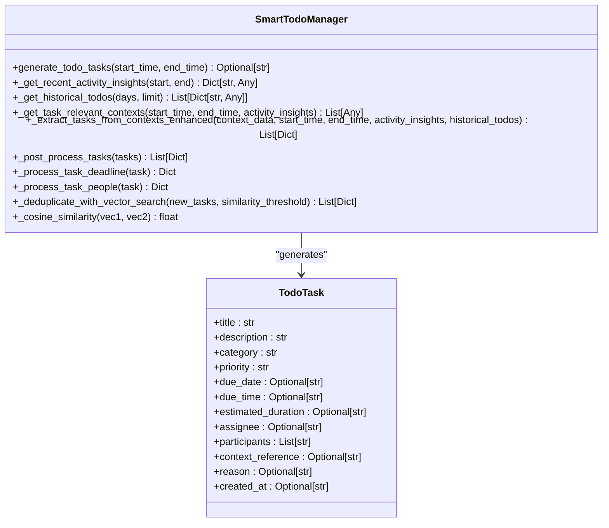
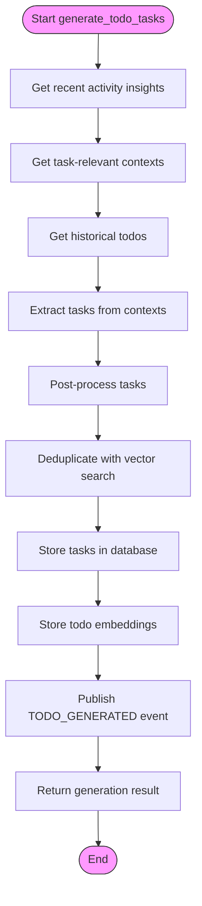
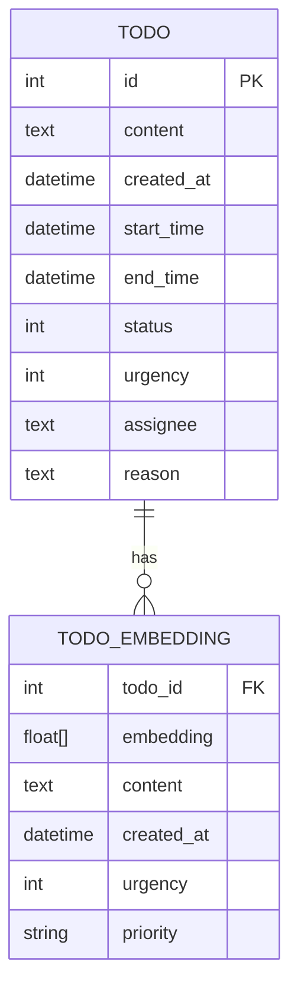
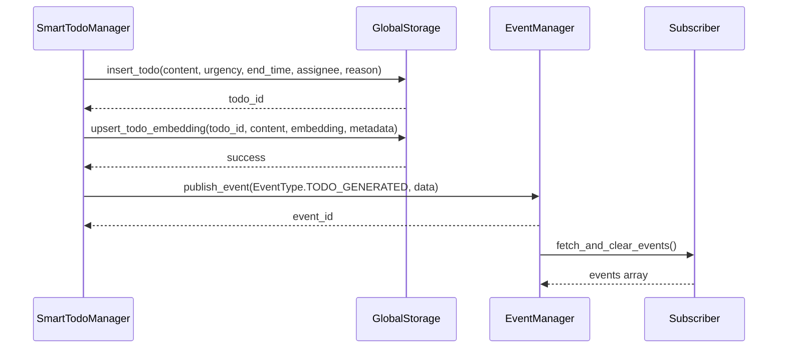
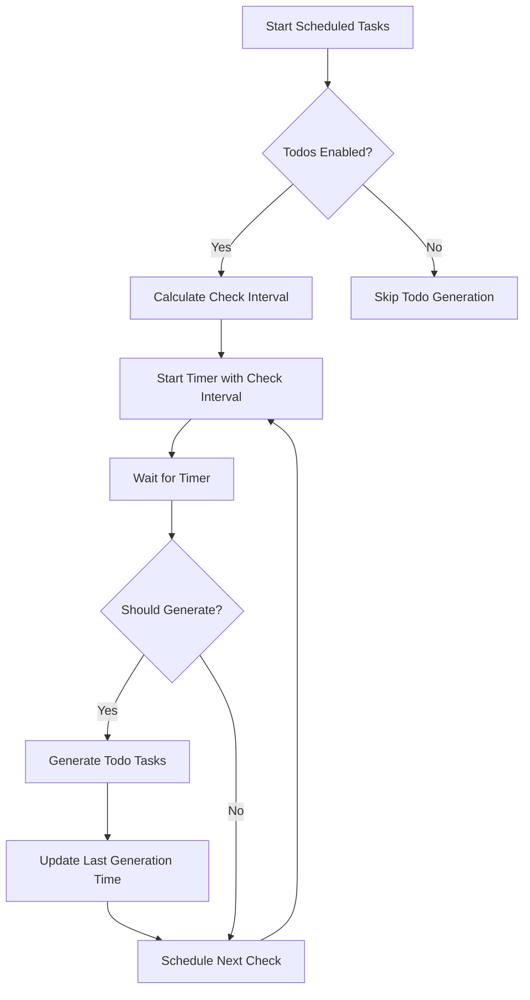
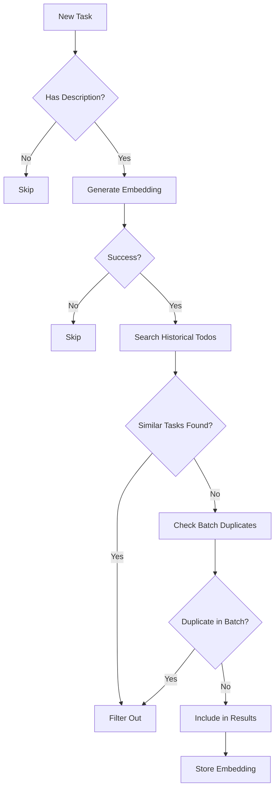
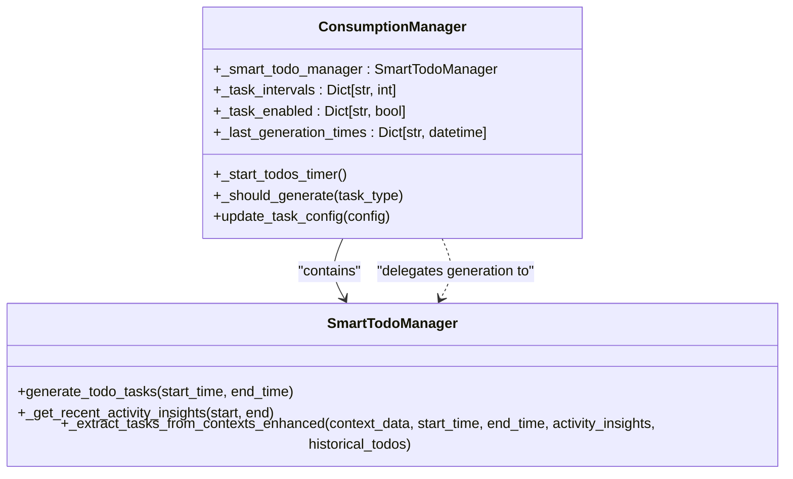

# Smart Todos API

<cite>
**Referenced Files in This Document**   
- [smart_todo_manager.py](file://opencontext/context_consumption/generation/smart_todo_manager.py)
- [consumption_manager.py](file://opencontext/managers/consumption_manager.py)
- [config.yaml](file://config/config.yaml)
- [sqlite_backend.py](file://opencontext/storage/backends/sqlite_backend.py)
- [event_manager.py](file://opencontext/managers/event_manager.py)
- [global_storage.py](file://opencontext/storage/global_storage.py)
</cite>

## Table of Contents
1. [Introduction](#introduction)
2. [SmartTodoManager Class Overview](#smarttodomanager-class-overview)
3. [Todo Generation Workflow](#todo-generation-workflow)
4. [Task Structure and Fields](#task-structure-and-fields)
5. [Storage Mechanism](#storage-mechanism)
6. [Event Publishing](#event-publishing)
7. [Configuration and Scheduling](#configuration-and-scheduling)
8. [Error Handling and Retry Mechanisms](#error-handling-and-retry-mechanisms)
9. [Deduplication System](#deduplication-system)
10. [Integration with ConsumptionManager](#integration-with-consumptionmanager)

## Introduction

The Smart Todos API is a sophisticated system designed to intelligently identify and generate actionable todo items based on user activity patterns and context data. This documentation provides comprehensive details about the SmartTodoManager class and its integration with the ConsumptionManager, focusing on the todo generation process, configuration options, and system architecture.

The system analyzes user behavior, extracts insights from activity patterns, and generates structured todo items with relevant metadata. It employs advanced techniques including vector-based deduplication, configurable generation intervals, and robust error handling to ensure reliable operation.

**Section sources**
- [smart_todo_manager.py](file://opencontext/context_consumption/generation/smart_todo_manager.py#L1-L505)
- [consumption_manager.py](file://opencontext/managers/consumption_manager.py#L1-L524)

## SmartTodoManager Class Overview

The SmartTodoManager class is responsible for intelligently identifying and generating todo items based on user activity context. It serves as the core component for automated task creation, analyzing various data sources to produce actionable items.

The class implements a comprehensive workflow that begins with gathering recent activity insights, retrieving relevant context data, and synthesizing this information to generate high-quality todo tasks. The process involves multiple stages of data processing, including post-processing to ensure task completeness and deduplication to prevent redundant task creation.

Key methods within the SmartTodoManager include:
- `generate_todo_tasks`: The primary method that orchestrates the entire todo generation process
- `_get_recent_activity_insights`: Extracts insights from recent user activities
- `_get_task_relevant_contexts`: Retrieves context data relevant to task identification
- `_extract_tasks_from_contexts_enhanced`: Combines multiple information sources to extract tasks
- `_post_process_tasks`: Ensures tasks have complete and consistent information
- `_deduplicate_with_vector_search`: Prevents creation of duplicate tasks using vector similarity

The TodoTask dataclass defines the structure of todo items with fields for title, description, category, priority, due dates, participants, and other metadata essential for task management.

**Diagram sources **
- [smart_todo_manager.py](file://opencontext/context_consumption/generation/smart_todo_manager.py#L28-L505)

**Section sources**
- [smart_todo_manager.py](file://opencontext/context_consumption/generation/smart_todo_manager.py#L28-L505)

## Todo Generation Workflow

The todo generation process follows a systematic workflow that analyzes user context data to identify potential tasks. The workflow begins when the `generate_todo_tasks` method is invoked with a time range specified by start_time and end_time parameters.

The analysis workflow consists of several sequential steps:

1. **Activity Insights Extraction**: The system first retrieves insights from recent activities by querying the database for activity records within the specified time range. It parses metadata from these activities to extract potential todos, key entities, and focus areas.

2. **Context Data Retrieval**: The system gathers task-relevant context data from multiple sources including activity context, semantic context, intent context, and entity context. This data is retrieved from the storage system with appropriate filters applied.

3. **Task Extraction**: Using a large language model, the system analyzes the combined context data, historical todos, and potential todos to extract actionable tasks. The extraction process uses a predefined prompt template configured in the system.

4. **Post-processing**: Extracted tasks undergo post-processing to ensure all necessary fields are present and properly formatted. This includes setting default values for missing fields and processing deadline information.

5. **Deduplication**: The system applies vector-based deduplication to prevent creation of duplicate tasks, both against historical tasks and within the current batch of generated tasks.

6. **Storage and Publishing**: Validated tasks are stored in the database and their embeddings are saved for future deduplication. The system then publishes an event indicating successful task generation.

**Diagram sources **
- [smart_todo_manager.py](file://opencontext/context_consumption/generation/smart_todo_manager.py#L57-L132)

**Section sources**
- [smart_todo_manager.py](file://opencontext/context_consumption/generation/smart_todo_manager.py#L57-L132)

## Task Structure and Fields

Todo tasks are structured with a comprehensive set of fields that capture essential information for task management and context preservation. The task structure includes both basic information and metadata that provides context for the task's origin and purpose.

The key fields in a todo task include:

- **Content**: The main description of the task, typically combining the title and description fields
- **Urgency**: A numerical value (0-3) representing the task's priority level, mapped from priority strings (low, medium, high, urgent)
- **Deadline**: The due date and time for task completion, stored as a datetime object
- **Assignee**: The person or system responsible for completing the task, stored as a comma-separated string of participants
- **Reason**: The justification for creating the task, explaining why it was identified as necessary

Additional metadata fields include:
- **Category**: The type of task (e.g., general, work, personal)
- **Priority**: Textual representation of task importance
- **Estimated duration**: Expected time required to complete the task
- **Context reference**: Link to the source context that generated the task
- **Created at**: Timestamp when the task was generated

The system ensures task completeness by applying default values when certain fields are missing. For example, if a due date is not specified, the system sets a default deadline based on the task's priority level. High-priority tasks receive a deadline of tomorrow by default, while medium-priority tasks are given a three-day window, and low-priority tasks receive a one-week deadline.

**Section sources**
- [smart_todo_manager.py](file://opencontext/context_consumption/generation/smart_todo_manager.py#L29-L44)
- [smart_todo_manager.py](file://opencontext/context_consumption/generation/smart_todo_manager.py#L335-L368)

## Storage Mechanism

The system employs a dual-storage mechanism for todo items, utilizing both a relational database for structured storage and a vector database for semantic deduplication and retrieval.

Todo items are primarily stored in a SQLite database table named "todo" with the following schema:
- id: INTEGER PRIMARY KEY AUTOINCREMENT
- content: TEXT - The main task description
- created_at: DATETIME DEFAULT CURRENT_TIMESTAMP - Creation timestamp
- start_time: DATETIME DEFAULT CURRENT_TIMESTAMP - Task start time
- end_time: DATETIME - Deadline or completion time
- status: INTEGER DEFAULT 0 - Task status (0=pending, 1=completed)
- urgency: INTEGER DEFAULT 0 - Priority level (0-3)
- assignee: TEXT - Comma-separated list of responsible parties
- reason: TEXT - Justification for task creation

When a todo is created, it is inserted into the SQLite database using the `insert_todo` method. Additionally, the system stores a vector embedding of the task description in a vector database (either ChromaDB or Qdrant) to enable semantic deduplication. The embedding is generated using the system's configured embedding model and stored with metadata including the todo ID, content, urgency, and priority.

The vector database storage allows for efficient similarity searches to identify potential duplicate tasks before they are created. Each todo embedding is stored with a unique identifier that corresponds to the primary key in the SQLite database, maintaining referential integrity between the two storage systems.

**Diagram sources **
- [sqlite_backend.py](file://opencontext/storage/backends/sqlite_backend.py#L93-L104)
- [qdrant_backend.py](file://opencontext/storage/backends/qdrant_backend.py#L580-L620)
- [chromadb_backend.py](file://opencontext/storage/backends/chromadb_backend.py#L819-L858)

**Section sources**
- [sqlite_backend.py](file://opencontext/storage/backends/sqlite_backend.py#L93-L104)
- [smart_todo_manager.py](file://opencontext/context_consumption/generation/smart_todo_manager.py#L98-L104)

## Event Publishing

The system implements an event-driven architecture for notifying other components about todo generation activities. When new todo items are successfully created, the system publishes a `TODO_GENERATED` event through the global event manager.

The event publishing process follows these steps:
1. After successfully storing todo items in the database and their embeddings in the vector database, the system prepares an event payload containing information about the generated tasks
2. The payload includes the number of tasks generated, their IDs, and details about the tasks themselves
3. The system calls the `publish_event` function with the `EventType.TODO_GENERATED` type and the prepared data
4. The event manager stores the event in its cache for subsequent retrieval by interested components

The event payload structure includes:
- content: A summary message indicating how many tasks were generated
- todo_ids: An array of the database IDs for the newly created todo items
- tasks: An array of task objects containing the full details of each generated task

Other system components can subscribe to these events to perform additional processing, such as updating user interfaces, sending notifications, or triggering dependent workflows. The event system uses a cached mechanism with a maximum cache size of 1,000 events to prevent memory overflow, automatically removing the oldest events when the limit is reached.

**Diagram sources **
- [smart_todo_manager.py](file://opencontext/context_consumption/generation/smart_todo_manager.py#L124-L128)
- [event_manager.py](file://opencontext/managers/event_manager.py#L63-L77)

**Section sources**
- [smart_todo_manager.py](file://opencontext/context_consumption/generation/smart_todo_manager.py#L124-L128)
- [event_manager.py](file://opencontext/managers/event_manager.py#L25-L34)

## Configuration and Scheduling

The todo generation system is highly configurable, with settings controlled through the central configuration file (config.yaml) and dynamic runtime configuration. The default configuration sets a 30-minute interval for todo generation, which can be customized based on user preferences and system requirements.

Configuration options are organized under the `content_generation.todos` section in config.yaml:
- enabled: Boolean flag to enable or disable todo generation
- interval: Generation frequency in seconds (minimum 1800/30 minutes)

The ConsumptionManager class manages the scheduling of todo generation tasks using Python's threading.Timer. The scheduling system implements several key features:

1. **Interval Configuration**: The generation interval is configurable and defaults to 1800 seconds (30 minutes). The system calculates a check interval as one-quarter of the generation interval (with maximum limits) to balance responsiveness and resource usage.

2. **Generation Prevention**: The system maintains a record of the last generation time for each task type (activity, tips, todos) to prevent duplicate processing. Before generating new todos, it checks whether sufficient time has elapsed since the last generation.

3. **Dynamic Configuration**: The system supports runtime configuration updates through the `update_task_config` method, allowing configuration changes without restarting the application.

4. **Task Enable/Disable**: Individual task types can be enabled or disabled independently, providing fine-grained control over system behavior.

The scheduling workflow begins when the ConsumptionManager starts its scheduled tasks. It initializes timers for each enabled task type, including todos, and periodically checks whether generation should occur based on the configured interval and last generation time.

**Diagram sources **
- [consumption_manager.py](file://opencontext/managers/consumption_manager.py#L319-L357)
- [config.yaml](file://config/config.yaml#L232-L235)

**Section sources**
- [consumption_manager.py](file://opencontext/managers/consumption_manager.py#L65-L66)
- [consumption_manager.py](file://opencontext/managers/consumption_manager.py#L319-L357)

## Error Handling and Retry Mechanisms

The system implements comprehensive error handling to ensure reliability and resilience in the face of failures. Both the SmartTodoManager and ConsumptionManager classes include robust exception handling mechanisms at multiple levels of the processing pipeline.

Key error handling features include:

1. **Try-Except Blocks**: The `generate_todo_tasks` method is wrapped in a comprehensive try-except block that catches all exceptions, logs detailed error information, and returns None to indicate failure without crashing the system.

2. **Granular Exception Handling**: Individual operations within the todo generation process have their own exception handling. For example, embedding generation failures are handled locally, allowing the system to continue processing other tasks even if vectorization fails for a specific item.

3. **Logging**: The system uses structured logging to record errors at appropriate levels (exception, error, warning, debug). This provides detailed diagnostic information while maintaining performance.

4. **Retry Logic**: While the system doesn't implement automatic retries for failed todo generations, the scheduled nature of task execution provides a natural retry mechanism. Failed generations will be attempted again during the next scheduled interval.

5. **Graceful Degradation**: When non-critical operations fail (such as storing embeddings), the system continues processing and only logs a warning, ensuring that core functionality remains available.

The ConsumptionManager also includes error tracking in its statistics, incrementing an error counter when exceptions occur during task generation. This allows for monitoring of system reliability over time.

**Section sources**
- [smart_todo_manager.py](file://opencontext/context_consumption/generation/smart_todo_manager.py#L130-L132)
- [consumption_manager.py](file://opencontext/managers/consumption_manager.py#L271-L272)

## Deduplication System

The system employs a sophisticated vector-based deduplication mechanism to prevent the creation of duplicate todo items. This system operates at two levels: against historical tasks stored in the database and within the current batch of newly generated tasks.

The deduplication process works as follows:

1. **Embedding Generation**: For each potential new task, the system generates a vector embedding of the task description using the configured embedding model.

2. **Historical Comparison**: The system searches the vector database for existing todo embeddings that are similar to the new task's embedding. This search uses cosine similarity with a configurable threshold (default 0.85).

3. **Batch Comparison**: The system also compares new tasks against other tasks in the current generation batch to prevent duplicates from being created in the same processing cycle.

4. **Filtering**: Tasks that exceed the similarity threshold with existing tasks are filtered out and not created.

The deduplication system uses the same vector database that stores todo embeddings, leveraging the `search_similar_todos` method to find potential duplicates. When a new todo is successfully created, its embedding is immediately stored in the vector database to prevent future duplicates.

This approach provides semantic deduplication rather than exact text matching, allowing the system to identify tasks with similar meaning even if they are worded differently.

**Diagram sources **
- [smart_todo_manager.py](file://opencontext/context_consumption/generation/smart_todo_manager.py#L370-L449)
- [qdrant_backend.py](file://opencontext/storage/backends/qdrant_backend.py#L622-L666)
- [unified_storage.py](file://opencontext/storage/unified_storage.py#L325-L338)

**Section sources**
- [smart_todo_manager.py](file://opencontext/context_consumption/generation/smart_todo_manager.py#L370-L449)

## Integration with ConsumptionManager

The SmartTodoManager is tightly integrated with the ConsumptionManager, which serves as the central coordinator for all context consumption activities. This integration enables scheduled execution, configuration management, and unified error handling across different content generation services.

Key integration points include:

1. **Initialization**: The ConsumptionManager instantiates the SmartTodoManager during its initialization process and maintains a reference to it as the `_smart_todo_manager` attribute.

2. **Scheduling**: The ConsumptionManager manages the periodic execution of todo generation through its `_start_todos_timer` method, which creates a repeating timer that calls the SmartTodoManager's `generate_todo_tasks` method.

3. **Configuration**: The ConsumptionManager loads todo generation configuration (enabled state and interval) from the global configuration and passes this information to the SmartTodoManager through the scheduling mechanism.

4. **State Management**: The ConsumptionManager maintains the last generation time for todos in its `_last_generation_times` dictionary, which is used to prevent duplicate processing.

5. **Lifecycle Management**: The ConsumptionManager handles the startup and shutdown of the todo generation system, including starting and stopping timers as needed.

The integration follows a clear separation of concerns: the SmartTodoManager focuses on the business logic of identifying and creating todo items, while the ConsumptionManager handles the operational aspects of scheduling, configuration, and system coordination.

**Diagram sources **
- [consumption_manager.py](file://opencontext/managers/consumption_manager.py#L51-L52)
- [consumption_manager.py](file://opencontext/managers/consumption_manager.py#L319-L357)
- [consumption_manager.py](file://opencontext/managers/consumption_manager.py#L112-L127)

**Section sources**
- [consumption_manager.py](file://opencontext/managers/consumption_manager.py#L51-L52)
- [consumption_manager.py](file://opencontext/managers/consumption_manager.py#L319-L357)