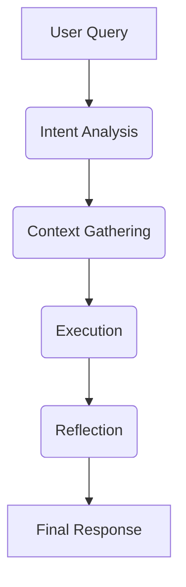
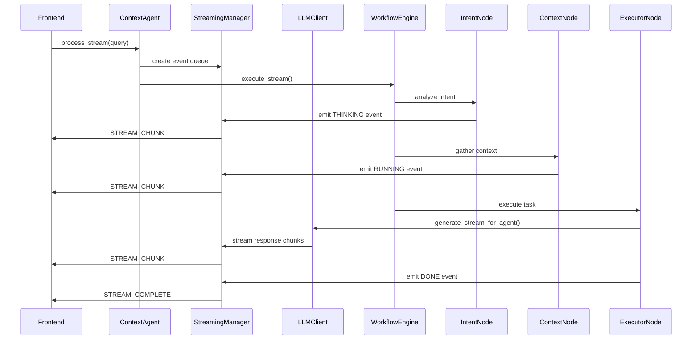
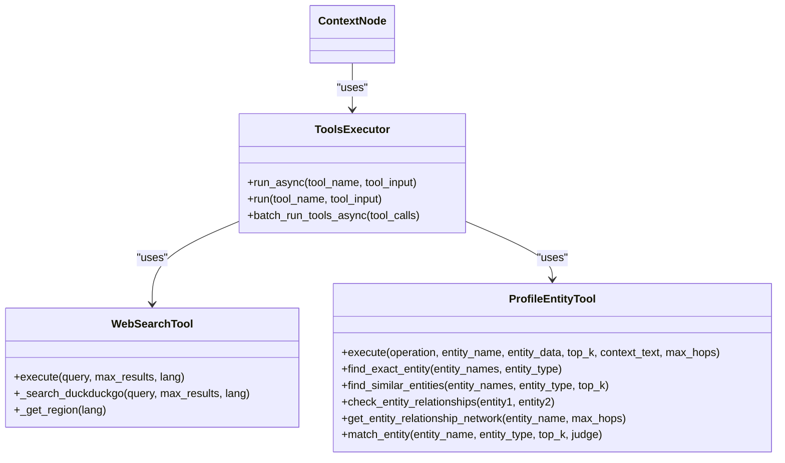
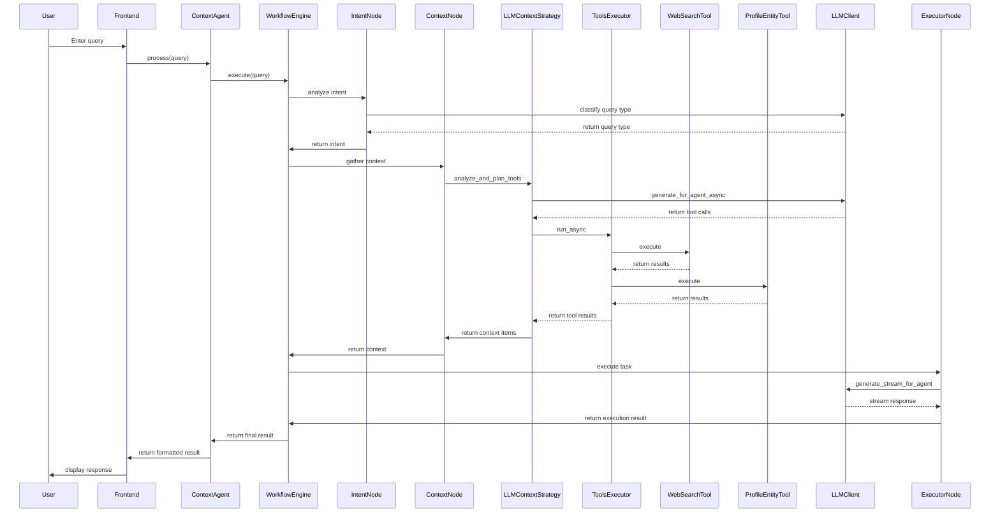

# Context Agent API

<cite>
**Referenced Files in This Document**   
- [agent.py](file://opencontext/context_consumption/context_agent/agent.py)
- [workflow.py](file://opencontext/context_consumption/context_agent/core/workflow.py)
- [state.py](file://opencontext/context_consumption/context_agent/core/state.py)
- [streaming.py](file://opencontext/context_consumption/context_agent/core/streaming.py)
- [llm_context_strategy.py](file://opencontext/context_consumption/context_agent/core/llm_context_strategy.py)
- [context.py](file://opencontext/context_consumption/context_agent/nodes/context.py)
- [executor.py](file://opencontext/context_consumption/context_agent/nodes/executor.py)
- [intent.py](file://opencontext/context_consumption/context_agent/nodes/intent.py)
- [reflection.py](file://opencontext/context_consumption/context_agent/nodes/reflection.py)
- [profile_entity_tool.py](file://opencontext/tools/profile_tools/profile_entity_tool.py)
- [web_search_tool.py](file://opencontext/tools/operation_tools/web_search_tool.py)
- [tools_executor.py](file://opencontext/tools/tools_executor.py)
- [global_vlm_client.py](file://opencontext/llm/global_vlm_client.py)
- [schemas.py](file://opencontext/context_consumption/context_agent/models/schemas.py)
- [enums.py](file://opencontext/context_consumption/context_agent/models/enums.py)
- [prompts_en.yaml](file://config/prompts_en.yaml)
</cite>

## Table of Contents
1. [Introduction](#introduction)
2. [Core Components](#core-components)
3. [Workflow Execution Process](#workflow-execution-process)
4. [Streaming Response Capabilities](#streaming-response-capabilities)
5. [Error Recovery Mechanisms](#error-recovery-mechanisms)
6. [Tool Integration](#tool-integration)
7. [Frontend Integration](#frontend-integration)
8. [Sequence Diagrams](#sequence-diagrams)
9. [Conclusion](#conclusion)

## Introduction
The ContextAgent class is the central component of the OpenContext intelligent context management system, responsible for processing user queries and generating insights through LLM integration. It orchestrates a multi-stage workflow that includes intent analysis, context retrieval, execution, and reflection. The agent is designed to handle complex queries by intelligently gathering relevant context from various sources, including local knowledge bases and external web searches, before generating responses. It supports both synchronous and streaming response modes, allowing for real-time interaction with users. The system is built with extensibility in mind, enabling integration with various tools and services to enhance its capabilities.

**Section sources**
- [agent.py](file://opencontext/context_consumption/context_agent/agent.py#L1-L165)

## Core Components
The ContextAgent system is composed of several core components that work together to process user queries and generate responses. The main components include the ContextAgent class itself, which serves as the entry point for all operations, the WorkflowEngine that manages the execution flow, the StateManager that maintains the state of ongoing workflows, and the StreamingManager that handles real-time event streaming. The system also includes specialized nodes for intent analysis, context gathering, execution, and reflection, each responsible for a specific stage in the processing pipeline. These components are designed to work together seamlessly, with clear interfaces and well-defined responsibilities, enabling the system to handle complex queries and generate high-quality responses.

**Section sources**
- [agent.py](file://opencontext/context_consumption/context_agent/agent.py#L1-L165)
- [workflow.py](file://opencontext/context_consumption/context_agent/core/workflow.py#L1-L208)
- [state.py](file://opencontext/context_consumption/context_agent/core/state.py#L1-L278)
- [streaming.py](file://opencontext/context_consumption/context_agent/core/streaming.py#L1-L46)

## Workflow Execution Process
The ContextAgent processes user queries through a well-defined workflow that consists of four main stages: intent analysis, context gathering, execution, and reflection. The process begins with the ContextAgent receiving a user query, which is then passed to the WorkflowEngine for processing. The WorkflowEngine initializes the necessary nodes and creates a WorkflowState object to track the progress of the workflow. The first stage, intent analysis, involves classifying the query type and enhancing the query expression to make it more suitable for subsequent processing. This is followed by the context gathering stage, where the system intelligently collects relevant context information from various sources based on the analyzed intent. The execution stage then uses the collected context to generate a response, which is finally evaluated in the reflection stage to ensure quality and identify areas for improvement.

**Diagram sources **
- [workflow.py](file://opencontext/context_consumption/context_agent/core/workflow.py#L58-L162)
- [agent.py](file://opencontext/context_consumption/context_agent/agent.py#L38-L44)

**Section sources**
- [workflow.py](file://opencontext/context_consumption/context_agent/core/workflow.py#L58-L162)
- [agent.py](file://opencontext/context_consumption/context_agent/agent.py#L38-L44)

## Streaming Response Capabilities
The ContextAgent supports streaming responses through the StreamingManager component, which enables real-time communication between the agent and the user interface. When a streaming request is made, the agent creates a streaming event queue and begins emitting events as they become available. These events include various types such as THINKING, RUNNING, DONE, and STREAM_CHUNK, which provide feedback on the progress of the workflow. The streaming capability is particularly useful for long-running operations, as it allows the user to see intermediate results and progress updates in real-time. The system uses asynchronous generators to produce a stream of events, which can be consumed by the frontend to provide a responsive and interactive user experience.

**Diagram sources **
- [streaming.py](file://opencontext/context_consumption/context_agent/core/streaming.py#L16-L46)
- [agent.py](file://opencontext/context_consumption/context_agent/agent.py#L46-L48)
- [executor.py](file://opencontext/context_consumption/context_agent/nodes/executor.py#L142-L161)

**Section sources**
- [streaming.py](file://opencontext/context_consumption/context_agent/core/streaming.py#L16-L46)
- [agent.py](file://opencontext/context_consumption/context_agent/agent.py#L46-L48)

## Error Recovery Mechanisms
The ContextAgent includes robust error recovery mechanisms to handle various failure scenarios and ensure reliable operation. When an error occurs during workflow execution, the system captures the exception, updates the workflow state to FAILED, and emits a FAIL event through the streaming interface. The error information is stored in the WorkflowState object, making it available for debugging and analysis. The system also supports resuming workflows that have been paused due to insufficient information, allowing users to provide additional input and continue the processing. Additionally, the reflection stage evaluates the success rate of the execution and can recommend retries if necessary, providing a mechanism for automatic error recovery in certain scenarios.

**Section sources**
- [workflow.py](file://opencontext/context_consumption/context_agent/core/workflow.py#L100-L111)
- [state.py](file://opencontext/context_consumption/context_agent/core/state.py#L116-L120)
- [reflection.py](file://opencontext/context_consumption/context_agent/nodes/reflection.py#L75-L86)

## Tool Integration
The ContextAgent integrates with various tools to enhance its capabilities and provide a richer user experience. Two key tools are the web_search_tool and profile_entity_tool, which are managed by the ToolsExecutor. The web_search_tool allows the agent to retrieve real-time information from the web, making it possible to answer questions that require up-to-date data. The profile_entity_tool provides entity resolution and relationship analysis, enabling the system to understand and process queries involving people, projects, and organizations. These tools are called by the LLMContextStrategy during the context gathering stage, based on an analysis of the information gaps in the existing context. The system supports concurrent execution of multiple tool calls, allowing for efficient collection of information from different sources.

**Diagram sources **
- [tools_executor.py](file://opencontext/tools/tools_executor.py#L15-L136)
- [web_search_tool.py](file://opencontext/tools/operation_tools/web_search_tool.py#L21-L194)
- [profile_entity_tool.py](file://opencontext/tools/profile_tools/profile_entity_tool.py#L25-L622)
- [context.py](file://opencontext/context_consumption/context_agent/nodes/context.py#L27-L165)

**Section sources**
- [tools_executor.py](file://opencontext/tools/tools_executor.py#L15-L136)
- [web_search_tool.py](file://opencontext/tools/operation_tools/web_search_tool.py#L21-L194)
- [profile_entity_tool.py](file://opencontext/tools/profile_tools/profile_entity_tool.py#L25-L622)

## Frontend Integration
The ContextAgent is designed to work seamlessly with the frontend application, providing a smooth and responsive user experience. The frontend interacts with the agent through a simple API interface, sending user queries and receiving responses in a structured format. For streaming responses, the frontend consumes events from the agent's event stream, updating the user interface in real-time as new information becomes available. The agent's output includes various metadata fields that can be used by the frontend to provide additional context and feedback to the user. The integration is designed to be flexible and extensible, allowing for easy addition of new features and capabilities in the future.

**Section sources**
- [agent.py](file://opencontext/context_consumption/context_agent/agent.py#L129-L164)
- [schemas.py](file://opencontext/context_consumption/context_agent/models/schemas.py#L17-L263)

## Sequence Diagrams
The following sequence diagrams illustrate the complete flow from user query to AI response, highlighting the interaction between the agent, LLM client, and tool executor components.

**Diagram sources **
- [agent.py](file://opencontext/context_consumption/context_agent/agent.py#L38-L44)
- [workflow.py](file://opencontext/context_consumption/context_agent/core/workflow.py#L58-L162)
- [intent.py](file://opencontext/context_consumption/context_agent/nodes/intent.py#L32-L70)
- [context.py](file://opencontext/context_consumption/context_agent/nodes/context.py#L27-L165)
- [llm_context_strategy.py](file://opencontext/context_consumption/context_agent/core/llm_context_strategy.py#L43-L97)
- [tools_executor.py](file://opencontext/tools/tools_executor.py#L35-L55)
- [web_search_tool.py](file://opencontext/tools/operation_tools/web_search_tool.py#L103-L134)
- [profile_entity_tool.py](file://opencontext/tools/profile_tools/profile_entity_tool.py#L141-L170)
- [global_vlm_client.py](file://opencontext/llm/global_vlm_client.py#L234-L259)
- [executor.py](file://opencontext/context_consumption/context_agent/nodes/executor.py#L142-L161)

## Conclusion
The ContextAgent class provides a powerful and flexible framework for AI-driven context processing, enabling the system to understand user queries, gather relevant context, and generate high-quality responses. Its modular architecture, with clearly defined components and interfaces, makes it easy to extend and customize for specific use cases. The integration with various tools, such as web search and entity resolution, enhances its capabilities and allows it to handle a wide range of queries. The support for streaming responses and robust error recovery mechanisms ensure a responsive and reliable user experience. Overall, the ContextAgent is a key component of the OpenContext system, providing the intelligence and processing power needed to deliver valuable insights and assistance to users.