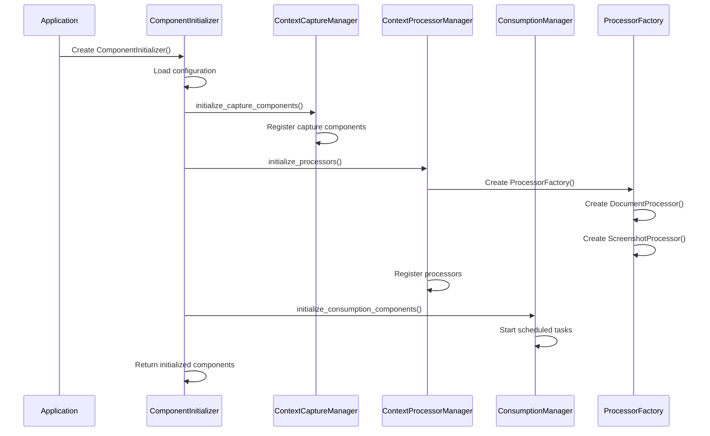
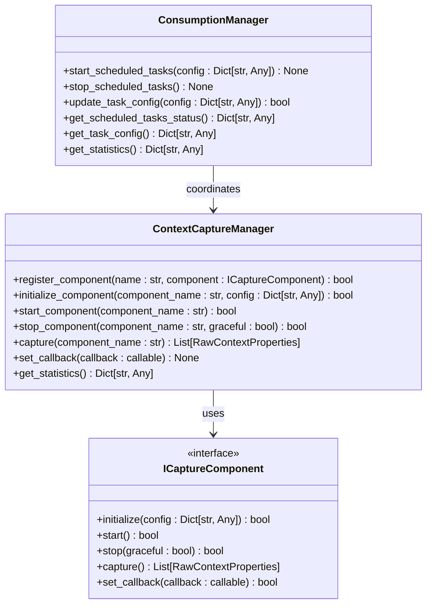
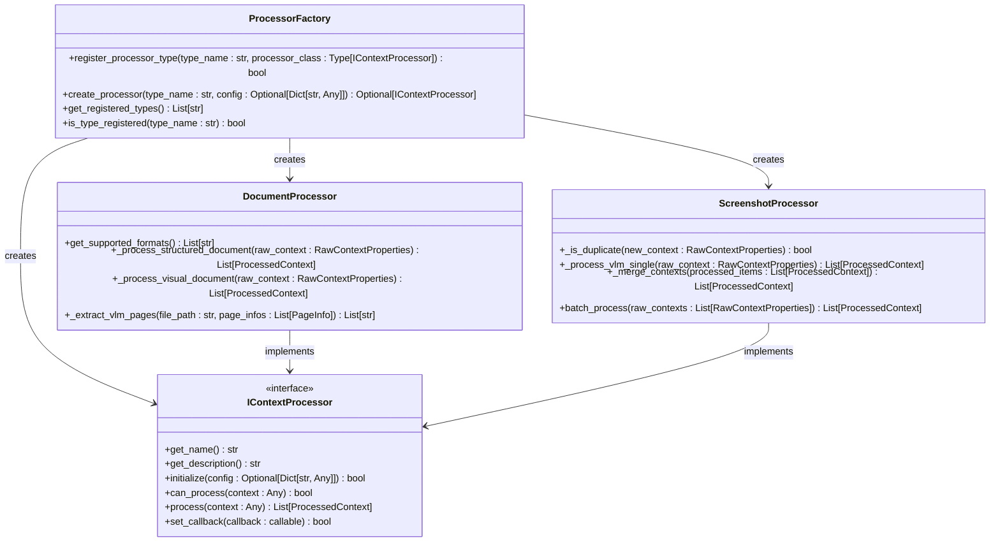
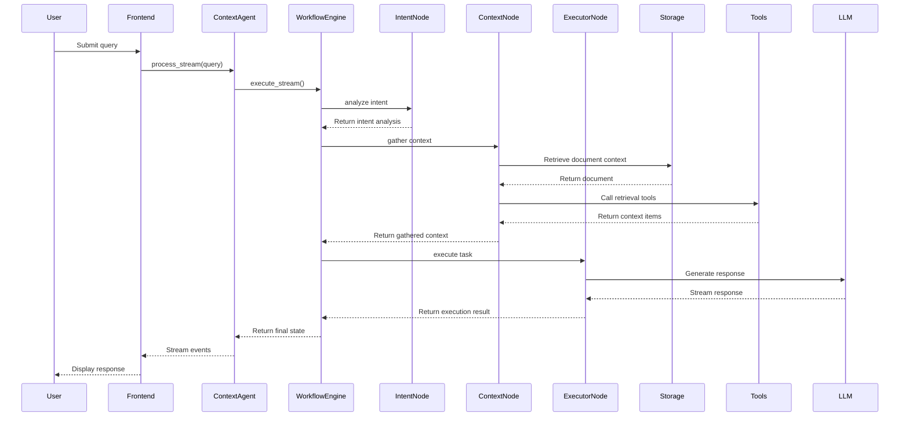
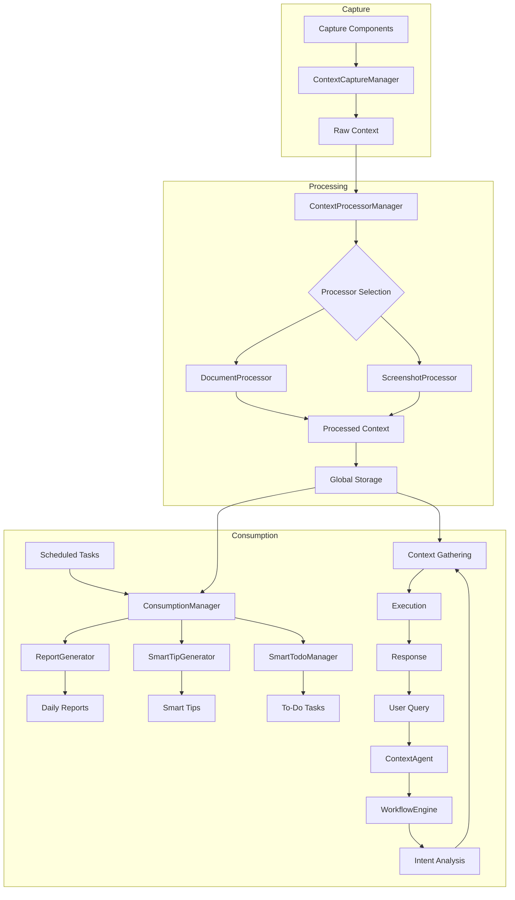
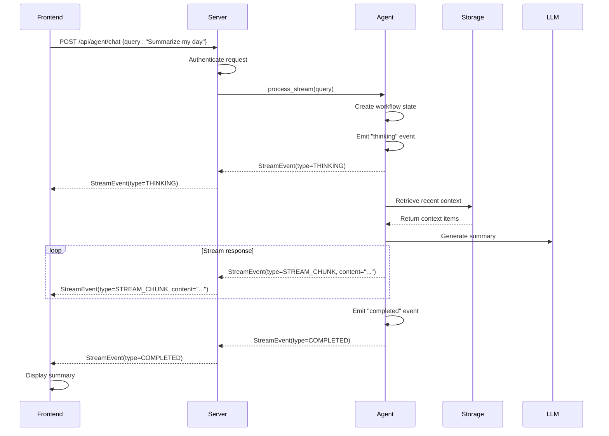

# Internal Service APIs

<cite>
**Referenced Files in This Document**   
- [component_initializer.py](file://opencontext/server/component_initializer.py)
- [capture_manager.py](file://opencontext/managers/capture_manager.py)
- [consumption_manager.py](file://opencontext/managers/consumption_manager.py)
- [agent.py](file://opencontext/context_consumption/context_agent/agent.py)
- [processor_factory.py](file://opencontext/context_processing/processor/processor_factory.py)
- [document_processor.py](file://opencontext/context_processing/processor/document_processor.py)
- [screenshot_processor.py](file://opencontext/context_processing/processor/screenshot_processor.py)
- [workflow.py](file://opencontext/context_consumption/context_agent/core/workflow.py)
- [context.py](file://opencontext/context_consumption/context_agent/nodes/context.py)
- [intent.py](file://opencontext/context_consumption/context_agent/nodes/intent.py)
- [executor.py](file://opencontext/context_consumption/context_agent/nodes/executor.py)
- [capture_interface.py](file://opencontext/interfaces/capture_interface.py)
- [processor_interface.py](file://opencontext/interfaces/processor_interface.py)
</cite>

## Table of Contents
1. [Introduction](#introduction)
2. [Service Initialization Process](#service-initialization-process)
3. [Manager Components and Internal APIs](#manager-components-and-internal-apis)
4. [Processor Factory and Processing Pipeline](#processor-factory-and-processing-pipeline)
5. [Context Agent Architecture](#context-agent-architecture)
6. [Data Flow and Internal Service Interactions](#data-flow-and-internal-service-interactions)
7. [Frontend to Backend Request Flow](#frontend-to-backend-request-flow)
8. [Thread Safety and Error Handling](#thread-safety-and-error-handling)
9. [Performance Characteristics](#performance-characteristics)
10. [Conclusion](#conclusion)

## Introduction
The MineContext backend implements a modular architecture with distinct service components for context capture, processing, and consumption. This documentation details the internal service APIs and component interfaces that enable the system's functionality. The architecture follows a clear separation of concerns, with specialized managers handling different aspects of the context lifecycle. The system uses a factory pattern for processor instantiation, a sophisticated agent architecture for intelligent content generation, and well-defined interfaces for component interaction. This document provides comprehensive details on the internal APIs, component interactions, and data flow patterns that power the MineContext application.

## Service Initialization Process

The service initialization process in MineContext is orchestrated through the `ComponentInitializer` class in `component_initializer.py`. This class handles the setup and configuration of various system components based on the application's configuration. The initialization follows a structured sequence that ensures proper dependency management and component readiness.

The initialization process begins with the creation of a `ComponentInitializer` instance, which loads configuration from the global configuration system. The initializer then proceeds to set up the major component categories in a specific order:

1. **Capture Components**: The initializer scans the configuration for capture modules and dynamically creates instances of capture components such as `ScreenshotCapture`, `VaultDocumentMonitor`, and `WebLinkCapture`. These components are registered with the `ContextCaptureManager`.

2. **Processors**: Context processors are initialized through the `ProcessorFactory`, which creates instances of `DocumentProcessor` and `ScreenshotProcessor` based on configuration settings. The factory pattern ensures consistent creation and dependency injection.

3. **Consumption Components**: The initializer sets up consumption components like `SmartTipGenerator`, `RealtimeActivityMonitor`, and `SmartTodoManager`, which are responsible for generating insights from captured context.

4. **Completion Service**: The completion service for smart content completion is initialized as a singleton instance to prevent duplicate initialization.

The initialization process is designed to be resilient, with comprehensive error handling that logs failures but allows the system to continue initializing other components. Each component type has its own initialization method within the `ComponentInitializer`, allowing for specialized setup logic while maintaining a consistent interface.

**Diagram sources**
- [component_initializer.py](file://opencontext/server/component_initializer.py#L52-L229)
- [capture_manager.py](file://opencontext/managers/capture_manager.py#L23-L391)
- [consumption_manager.py](file://opencontext/managers/consumption_manager.py#L31-L524)

**Section sources**
- [component_initializer.py](file://opencontext/server/component_initializer.py#L52-L229)

## Manager Components and Internal APIs

MineContext employs specialized manager classes to coordinate different aspects of the system. These managers provide well-defined internal APIs that expose functionality to other components while maintaining loose coupling and separation of concerns.

### Capture Manager

The `ContextCaptureManager` in `capture_manager.py` serves as the central coordinator for all context capture operations. It implements the following key methods:

- `register_component(name: str, component: ICaptureComponent) -> bool`: Registers a capture component with the manager, making it available for use.
- `initialize_component(component_name: str, config: Dict[str, Any]) -> bool`: Initializes a registered component with specific configuration.
- `start_component(component_name: str) -> bool`: Starts a capture component, enabling it to begin capturing context.
- `stop_component(component_name: str, graceful: bool = True) -> bool`: Stops a running capture component.
- `capture(component_name: str) -> List[RawContextProperties]`: Manually triggers a capture operation on a specific component.
- `set_callback(callback: callable) -> None`: Sets a callback function that will be invoked when new context is captured.

The capture manager maintains statistics on capture operations and provides methods to retrieve component status and statistics. It uses the `ICaptureComponent` interface to ensure consistent interaction with different capture components, allowing for extensibility and easy addition of new capture types.

### Consumption Manager

The `ConsumptionManager` in `consumption_manager.py` manages components that generate insights and content from captured context. Its primary responsibilities include:

- Coordinating scheduled tasks for content generation
- Managing the lifecycle of consumption components
- Providing access to statistics and status information

Key methods include:

- `start_scheduled_tasks(config: Dict[str, Any])`: Starts scheduled tasks for generating reports, tips, and todos.
- `stop_scheduled_tasks()`: Stops all scheduled tasks gracefully.
- `update_task_config(config: Dict[str, Any]) -> bool`: Dynamically updates task configuration without restarting.
- `get_scheduled_tasks_status() -> Dict[str, Any]`: Returns the current status of scheduled tasks.
- `get_task_config() -> Dict[str, Any]`: Retrieves the current task configuration.

The consumption manager uses threading timers to schedule periodic tasks and provides thread-safe methods for configuration updates, allowing for dynamic adjustment of task intervals and schedules.

**Diagram sources**
- [capture_manager.py](file://opencontext/managers/capture_manager.py#L23-L391)
- [consumption_manager.py](file://opencontext/managers/consumption_manager.py#L31-L524)
- [capture_interface.py](file://opencontext/interfaces/capture_interface.py#L18-L153)

**Section sources**
- [capture_manager.py](file://opencontext/managers/capture_manager.py#L23-L391)
- [consumption_manager.py](file://opencontext/managers/consumption_manager.py#L31-L524)

## Processor Factory and Processing Pipeline

The processor system in MineContext implements a factory pattern for creating and managing context processors. This design provides flexibility, extensibility, and consistent component creation across the application.

### Processor Factory Pattern

The `ProcessorFactory` class in `processor_factory.py` serves as the central mechanism for creating processor instances. It implements the factory design pattern with the following key features:

- **Centralized Creation**: All processor instances are created through the factory, ensuring consistent initialization and configuration.
- **Type Registration**: The factory maintains a registry of available processor types, allowing for dynamic discovery and creation.
- **Dependency Management**: The factory handles dependency injection for processors, though the current implementation shows processors using parameterless constructors and obtaining dependencies from global configuration.
- **Extensibility**: New processor types can be registered at runtime, enabling plugin-like functionality.

Key methods of the `ProcessorFactory` include:

- `register_processor_type(type_name: str, processor_class: Type[IContextProcessor]) -> bool`: Registers a new processor type with the factory.
- `create_processor(type_name: str, config: Optional[Dict[str, Any]] = None, **dependencies) -> Optional[IContextProcessor]`: Creates a processor instance of the specified type.
- `get_registered_types() -> List[str]`: Returns a list of all registered processor types.
- `is_type_registered(type_name: str) -> bool`: Checks if a processor type is registered.

The factory is initialized with built-in processor types such as `DocumentProcessor` and `ScreenshotProcessor`, and provides a global instance for backward compatibility.

### Processing Pipeline

The processing pipeline in MineContext handles the transformation of raw captured context into processed, structured data that can be used for consumption. The pipeline is implemented through processor classes that adhere to the `IContextProcessor` interface.

#### Document Processor

The `DocumentProcessor` in `document_processor.py` handles the processing of various document types including PDF, DOCX, images, and structured files like CSV and XLSX. Key features include:

- **Background Processing**: Uses a dedicated thread for processing to avoid blocking the main application.
- **Batch Processing**: Processes documents in batches to optimize resource usage.
- **Intelligent Detection**: Analyzes documents page by page, using Vision Language Models (VLM) for pages with visual elements and direct text extraction for text-only pages.
- **Format Support**: Supports a wide range of formats including PDF, DOCX, PPTX, XLSX, CSV, JSONL, MD, and TXT.

The document processor implements a sophisticated strategy for handling different document types:
- For structured documents (CSV/XLSX), it uses specialized chunkers to extract tabular data.
- For text content, it applies text chunking with configurable parameters.
- For visual documents, it employs VLM analysis to extract text from images and charts.

#### Screenshot Processor

The `ScreenshotProcessor` in `screenshot_processor.py` specializes in processing screenshot streams. Its key features include:

- **Real-time Deduplication**: Uses perceptual hashing (pHash) to identify and filter duplicate screenshots in real-time.
- **Concurrent Processing**: Processes multiple screenshots concurrently using asyncio for improved performance.
- **Context Extraction**: Uses VLM to analyze screenshots and extract meaningful context information.
- **Memory Management**: Implements periodic memory compression to manage the volume of captured context.

The processor maintains a cache of recently processed screenshots to enable deduplication and uses configurable similarity thresholds to determine when images are considered duplicates.

**Diagram sources**
- [processor_factory.py](file://opencontext/context_processing/processor/processor_factory.py#L31-L175)
- [document_processor.py](file://opencontext/context_processing/processor/document_processor.py#L41-L653)
- [screenshot_processor.py](file://opencontext/context_processing/processor/screenshot_processor.py#L47-L590)
- [processor_interface.py](file://opencontext/interfaces/processor_interface.py#L16-L136)

**Section sources**
- [processor_factory.py](file://opencontext/context_processing/processor/processor_factory.py#L31-L175)
- [document_processor.py](file://opencontext/context_processing/processor/document_processor.py#L41-L653)
- [screenshot_processor.py](file://opencontext/context_processing/processor/screenshot_processor.py#L47-L590)

## Context Agent Architecture

The context agent in MineContext implements a sophisticated workflow engine for intelligent content generation and interaction. The architecture is defined in `context_agent/agent.py` and related modules, providing a flexible framework for handling user queries and generating appropriate responses.

### Agent Core Components

The agent architecture consists of several key components that work together to process user input and generate responses:

- **ContextAgent**: The main entry point that provides a simple API interface for processing queries.
- **WorkflowEngine**: The core workflow control logic that orchestrates the processing pipeline.
- **State Management**: Tracks the state of ongoing workflows, including query context and processing progress.
- **Streaming Support**: Enables real-time response streaming for improved user experience.

The `ContextAgent` class provides the primary interface with methods for:
- `process(**kwargs) -> Dict[str, Any]`: Processes a user query and returns a formatted result.
- `process_stream(**kwargs) -> AsyncIterator[StreamEvent]`: Processes a query with streaming output.
- `resume(workflow_id: str, user_input: Optional[str] = None) -> Dict[str, Any]`: Resumes a paused workflow with additional user input.
- `cancel(workflow_id: str)`: Cancels a running workflow.

### Workflow Execution

The workflow engine implements a multi-stage processing pipeline that handles user queries through a series of coordinated steps:

1. **Intent Analysis**: Determines the user's intent and query type (e.g., simple chat, document edit, QA analysis, content generation).
2. **Context Gathering**: Collects relevant context from various sources to inform the response.
3. **Execution**: Performs the requested action based on the intent and gathered context.
4. **Reflection**: (Planned) Evaluates the quality of the response and determines if additional processing is needed.

The workflow engine uses a node-based architecture where each stage is implemented as a separate node class:

- **IntentNode**: Analyzes user queries to determine intent and query type using LLM classification.
- **ContextNode**: Intelligently gathers relevant context through an iterative process that may involve tool calls.
- **ExecutorNode**: Executes the requested action, generating content or performing operations.
- **ReflectionNode**: (Planned) Evaluates the response quality and determines if retry is needed.

Each node follows a consistent interface with a `process` method that takes a `WorkflowState` object and returns an updated state. The workflow engine coordinates the execution of nodes in sequence, passing state between them.

### State Management

The agent maintains comprehensive state information throughout the workflow execution. The `WorkflowState` class tracks:
- Query information (text, user ID, session ID)
- Intent analysis results
- Gathered context items
- Execution results
- Error information
- Workflow metadata (ID, stage, retry count)

This state is used to coordinate the workflow, provide progress updates, and enable resumption of interrupted workflows. The state manager also supports streaming events that provide real-time feedback to the user interface.

**Diagram sources**
- [agent.py](file://opencontext/context_consumption/context_agent/agent.py#L21-L165)
- [workflow.py](file://opencontext/context_consumption/context_agent/core/workflow.py#L22-L208)
- [intent.py](file://opencontext/context_consumption/context_agent/nodes/intent.py#L26-L264)
- [context.py](file://opencontext/context_consumption/context_agent/nodes/context.py#L19-L171)
- [executor.py](file://opencontext/context_consumption/context_agent/nodes/executor.py#L22-L276)

**Section sources**
- [agent.py](file://opencontext/context_consumption/context_agent/agent.py#L21-L165)
- [workflow.py](file://opencontext/context_consumption/context_agent/core/workflow.py#L22-L208)

## Data Flow and Internal Service Interactions

The MineContext backend implements a sophisticated data flow architecture that coordinates the capture, processing, and consumption of context information. This section details the interactions between internal services and the flow of data through the system.

### Context Capture Flow

The context capture process begins with specialized capture components that monitor various sources for new context. These components implement the `ICaptureComponent` interface and are managed by the `ContextCaptureManager`. When new context is captured, it follows this flow:

1. The capture component detects new context (e.g., a screenshot is taken, a document is modified).
2. The component processes the raw context and creates a `RawContextProperties` object.
3. The component invokes its registered callback function, passing the captured context.
4. The callback is handled by the `ContextCaptureManager`'s `_on_component_capture` method.
5. The manager updates its statistics and forwards the context to its own callback, which is typically set to the processing pipeline.

This callback chain enables loose coupling between components, allowing the capture system to operate independently while ensuring captured context is properly routed to downstream processing.

### Processing Pipeline Flow

Once raw context is captured, it enters the processing pipeline where it is transformed into structured, usable data. The flow through the processing system is as follows:

1. The `ContextProcessorManager` receives the raw context via its callback.
2. The manager determines which processor(s) can handle the context by calling their `can_process` method.
3. The appropriate processor (e.g., `DocumentProcessor` or `ScreenshotProcessor`) is selected.
4. The processor adds the context to its internal queue for processing.
5. A background thread processes the context, applying the appropriate transformation logic.
6. The processed context is stored in the global storage system.
7. The processor invokes its callback to notify interested components of the processed context.

For document processing, the flow includes additional steps:
- Document format detection
- Content extraction (text from PDF, images from DOCX, etc.)
- Chunking of content into manageable pieces
- Metadata extraction and enrichment
- Vectorization for semantic search

For screenshot processing, the flow includes:
- Duplicate detection using perceptual hashing
- Visual analysis using Vision Language Models
- Context extraction and categorization
- Entity recognition and linking
- Context merging and deduplication

### Consumption Flow

The consumption system generates insights and content from the processed context. This flow operates on a schedule or in response to user queries:

1. Scheduled tasks (e.g., daily report generation) are triggered by the `ConsumptionManager`.
2. The appropriate consumption component (e.g., `ReportGenerator`) retrieves relevant processed context.
3. The component applies its logic to generate insights or content.
4. The results are stored in the appropriate vault or storage location.
5. Notifications may be sent to update the user interface.

For user-initiated consumption (e.g., asking a question), the flow follows the context agent workflow described earlier, with additional steps for real-time interaction and streaming responses.

**Diagram sources**
- [capture_manager.py](file://opencontext/managers/capture_manager.py#L23-L391)
- [document_processor.py](file://opencontext/context_processing/processor/document_processor.py#L41-L653)
- [screenshot_processor.py](file://opencontext/context_processing/processor/screenshot_processor.py#L47-L590)
- [consumption_manager.py](file://opencontext/managers/consumption_manager.py#L31-L524)
- [agent.py](file://opencontext/context_consumption/context_agent/agent.py#L21-L165)

**Section sources**
- [capture_manager.py](file://opencontext/managers/capture_manager.py#L23-L391)
- [document_processor.py](file://opencontext/context_processing/processor/document_processor.py#L41-L653)
- [screenshot_processor.py](file://opencontext/context_processing/processor/screenshot_processor.py#L47-L590)
- [consumption_manager.py](file://opencontext/managers/consumption_manager.py#L31-L524)

## Frontend to Backend Request Flow

The interaction between the frontend and backend in MineContext follows a well-defined request-response pattern. This section details how frontend requests are translated into internal service calls and how responses are generated and returned.

### API Request Handling

Frontend requests are received by the backend server through REST API endpoints defined in the `routes` directory. The server uses a middleware-based architecture to handle incoming requests:

1. **Request Reception**: The server receives an HTTP request from the frontend.
2. **Authentication**: The request passes through authentication middleware to verify user credentials.
3. **Routing**: The request is routed to the appropriate handler based on the URL path.
4. **Parameter Validation**: Request parameters are validated and parsed.
5. **Service Invocation**: The handler invokes the appropriate internal service or component.
6. **Response Generation**: The service result is formatted into a response.
7. **Response Transmission**: The response is sent back to the frontend.

For example, when the frontend requests context capture, the flow is:
- Frontend sends POST request to `/api/capture`
- Server routes to `context_operations.py` handler
- Handler invokes `ContextCaptureManager.start_all_components()`
- Manager starts all registered capture components
- Response with success status is returned

### Context Agent Interaction

The most complex frontend-backend interaction occurs with the context agent, which supports both standard and streaming responses:

1. **Query Submission**: The frontend sends a user query to the `/api/agent/chat` endpoint.
2. **Agent Initialization**: The server creates or retrieves a `ContextAgent` instance.
3. **Stream Initiation**: For streaming requests, the server establishes a streaming response.
4. **Workflow Execution**: The agent's `process_stream` method is called, initiating the workflow engine.
5. **Event Streaming**: As the workflow progresses, stream events are sent to the frontend.
6. **Response Completion**: When processing is complete, a final event is sent and the stream is closed.

The streaming architecture allows the frontend to display partial results as they become available, improving perceived performance and user experience.

### Data Synchronization

The frontend and backend maintain synchronization through several mechanisms:

- **Polling**: The frontend periodically polls for updates (e.g., new screenshots, processed context).
- **WebSocket-like Communication**: The backend can push updates to the frontend through server-sent events or similar mechanisms.
- **State Management**: Both frontend and backend maintain consistent state representations to ensure data integrity.

For example, when new context is captured:
- Backend processes the context and stores it
- Backend triggers notifications or updates
- Frontend receives the update and refreshes the UI
- User sees the new context in the interface

**Diagram sources**
- [agent.py](file://opencontext/context_consumption/context_agent/agent.py#L21-L165)
- [workflow.py](file://opencontext/context_consumption/context_agent/core/workflow.py#L22-L208)
- [server/api.py](file://opencontext/server/api.py)

**Section sources**
- [agent.py](file://opencontext/context_consumption/context_agent/agent.py#L21-L165)

## Thread Safety and Error Handling

The MineContext backend implements comprehensive thread safety and error handling mechanisms to ensure reliable operation in a multi-threaded environment.

### Thread Safety Considerations

Several components in the system operate in multi-threaded contexts, requiring careful synchronization:

- **Capture Manager**: Manages multiple capture components that may run in separate threads. Uses thread-safe data structures and synchronization primitives to protect shared state.
- **Processor Components**: Both `DocumentProcessor` and `ScreenshotProcessor` use background threads for processing. They employ thread-safe queues to communicate between the main thread and processing threads.
- **Consumption Manager**: Uses threading timers for scheduled tasks, requiring synchronization when updating task configurations from different threads.

Key thread safety mechanisms include:
- **Thread-Safe Queues**: Used for inter-thread communication, ensuring data integrity when passing context between components.
- **Locks and Semaphores**: Protect critical sections of code that modify shared state.
- **Atomic Operations**: Used for simple state updates to avoid race conditions.
- **Thread-Local Storage**: Used when components need to maintain state specific to a particular thread.

For example, the `ConsumptionManager` uses a lock (`_config_lock`) to protect configuration updates, ensuring that concurrent updates do not interfere with each other. The processor components use thread-safe queues to buffer incoming context for processing, preventing data loss during high-load periods.

### Error Propagation Patterns

The system implements a consistent error handling strategy that balances robustness with informative feedback:

- **Local Error Handling**: Components handle recoverable errors internally, logging issues but continuing operation.
- **Error Propagation**: Unrecoverable errors are propagated up the call stack with appropriate context.
- **Graceful Degradation**: When a component fails, the system attempts to continue with reduced functionality rather than failing completely.
- **Comprehensive Logging**: All errors are logged with sufficient context for debugging, including component name, error type, and relevant data.

Error handling follows these patterns:
- **Initialization Errors**: If a component fails to initialize, the error is logged and the system continues, potentially with reduced functionality.
- **Runtime Errors**: During operation, components catch exceptions, log them, and attempt to continue processing.
- **Data Validation Errors**: Invalid data is typically rejected with a clear error message, preventing corruption of the context store.
- **External Service Errors**: Failures in external services (e.g., LLM APIs) are handled with retries and fallback strategies.

The system uses a hierarchical error reporting approach:
1. Components log errors locally with detailed context.
2. Critical errors are propagated to managers for centralized handling.
3. Managers may trigger alerts or notifications for severe issues.
4. Error information is made available through monitoring endpoints.

This approach ensures that errors are properly recorded and addressed while maintaining system stability.

**Section sources**
- [capture_manager.py](file://opencontext/managers/capture_manager.py#L23-L391)
- [consumption_manager.py](file://opencontext/managers/consumption_manager.py#L31-L524)
- [document_processor.py](file://opencontext/context_processing/processor/document_processor.py#L41-L653)
- [screenshot_processor.py](file://opencontext/context_processing/processor/screenshot_processor.py#L47-L590)

## Performance Characteristics

The MineContext backend is designed with performance as a key consideration, implementing various optimizations to handle the processing of large volumes of context data efficiently.

### Processing Performance

The system employs several strategies to optimize processing performance:

- **Background Processing**: Both document and screenshot processing occur in background threads, preventing UI blocking and allowing for continuous capture.
- **Batch Processing**: Context is processed in batches to amortize overhead and improve throughput.
- **Concurrent Execution**: Where possible, operations are executed concurrently using asyncio, particularly for LLM calls and external service interactions.
- **Caching**: Frequently accessed data is cached to reduce redundant processing and database queries.
- **Incremental Processing**: Changes are processed incrementally rather than reprocessing entire datasets.

The `DocumentProcessor` and `ScreenshotProcessor` are optimized for their specific workloads:
- **DocumentProcessor**: Uses efficient document parsing libraries and intelligent page analysis to minimize VLM usage (which is typically rate-limited and costly).
- **ScreenshotProcessor**: Implements real-time deduplication to avoid processing identical screenshots, significantly reducing processing load.

### Memory Management

The system includes several memory management features:
- **Periodic Compression**: The processor manager can start periodic memory compression to manage the volume of processed context.
- **Configurable Caching**: Cache sizes and retention policies are configurable to balance performance and memory usage.
- **Resource Cleanup**: Components properly clean up resources when stopped or shut down.

### Scalability Considerations

The architecture supports scalability through:
- **Modular Design**: Components can be scaled independently based on workload.
- **Asynchronous Processing**: Non-blocking operations allow the system to handle multiple requests concurrently.
- **Configurable Parameters**: Processing batch sizes, timeouts, and other parameters can be adjusted based on system resources and performance requirements.

Performance metrics are collected and can be accessed through monitoring endpoints, allowing for ongoing optimization and capacity planning.

**Section sources**
- [document_processor.py](file://opencontext/context_processing/processor/document_processor.py#L41-L653)
- [screenshot_processor.py](file://opencontext/context_processing/processor/screenshot_processor.py#L47-L590)
- [consumption_manager.py](file://opencontext/managers/consumption_manager.py#L31-L524)

## Conclusion

The MineContext backend implements a sophisticated architecture for context capture, processing, and consumption. The system's modular design, with specialized managers and components, enables flexible and extensible functionality. The service initialization process in `component_initializer.py` provides a robust framework for setting up the various system components, while the manager classes expose well-defined internal APIs for coordinating capture and consumption operations.

The processor factory pattern enables consistent creation and management of processors, with the `DocumentProcessor` and `ScreenshotProcessor` implementing specialized logic for their respective domains. The context agent architecture provides an intelligent workflow engine for handling user queries, with support for streaming responses and complex multi-stage processing.

The system demonstrates careful attention to thread safety, error handling, and performance optimization, ensuring reliable operation in a production environment. The clear separation of concerns and well-defined interfaces make the system maintainable and extensible, providing a solid foundation for future enhancements.

Understanding these internal service APIs and component interactions is essential for developers working on the MineContext backend, enabling effective troubleshooting, optimization, and feature development.