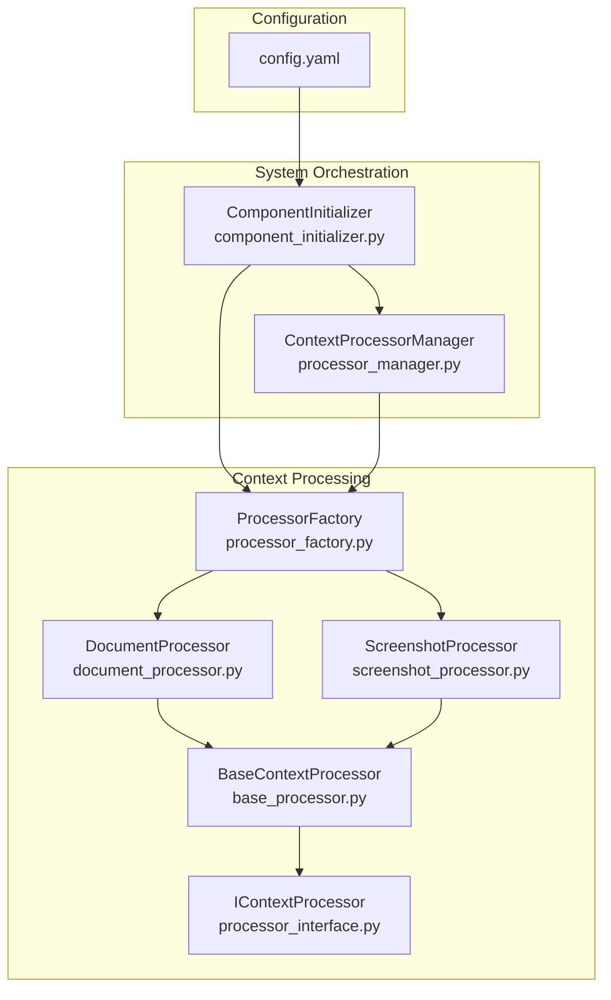
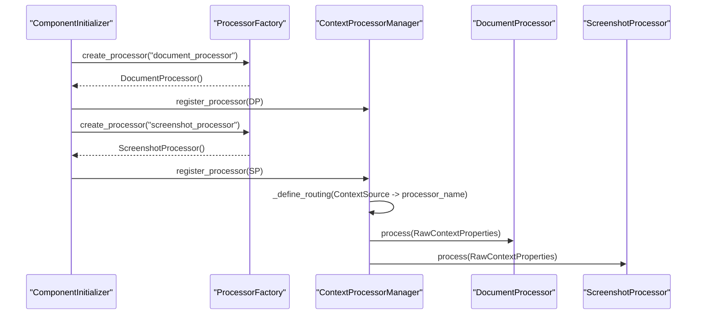
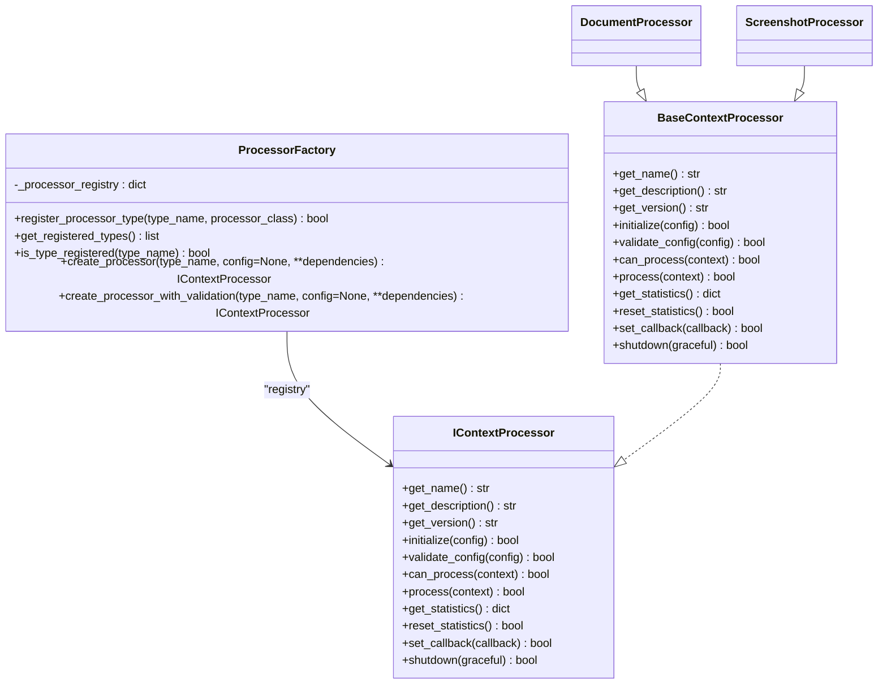
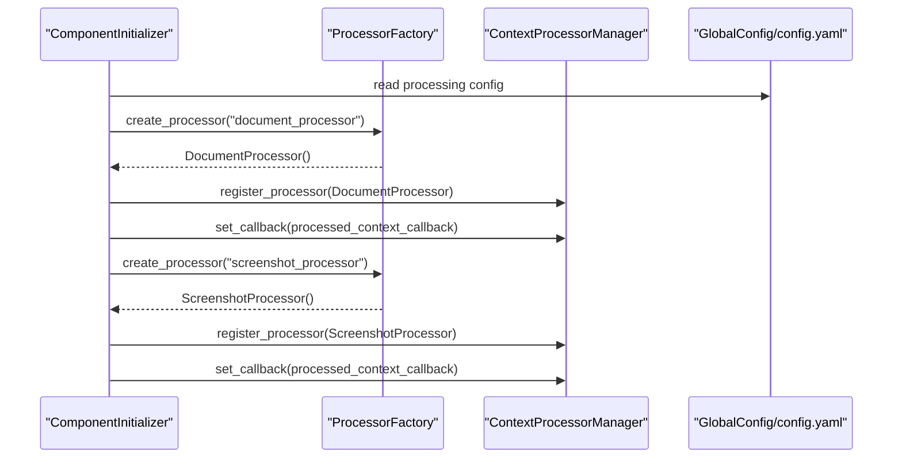
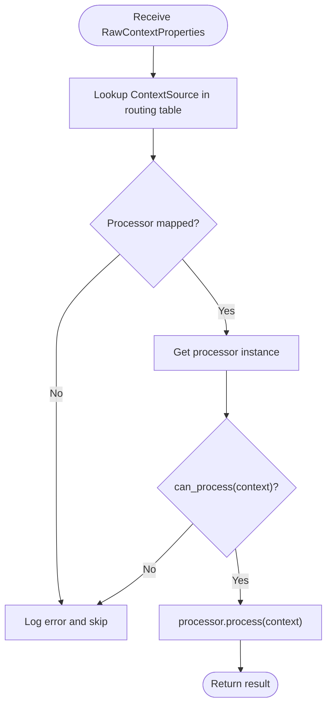
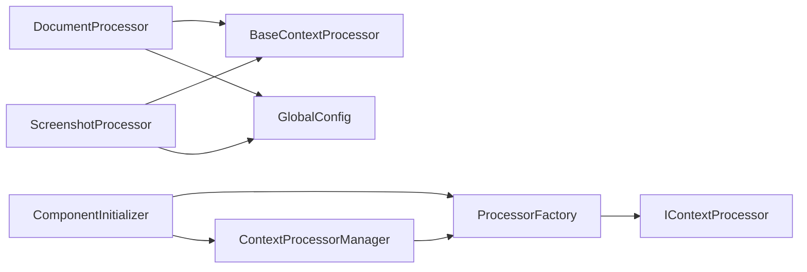

# Processor Factory API

<cite>
**Referenced Files in This Document**
- [processor_factory.py](file://opencontext/context_processing/processor/processor_factory.py)
- [base_processor.py](file://opencontext/context_processing/processor/base_processor.py)
- [document_processor.py](file://opencontext/context_processing/processor/document_processor.py)
- [screenshot_processor.py](file://opencontext/context_processing/processor/screenshot_processor.py)
- [processor_interface.py](file://opencontext/interfaces/processor_interface.py)
- [component_initializer.py](file://opencontext/server/component_initializer.py)
- [processor_manager.py](file://opencontext/managers/processor_manager.py)
- [config.yaml](file://config/config.yaml)
</cite>

## Table of Contents
1. [Introduction](#introduction)
2. [Project Structure](#project-structure)
3. [Core Components](#core-components)
4. [Architecture Overview](#architecture-overview)
5. [Detailed Component Analysis](#detailed-component-analysis)
6. [Dependency Analysis](#dependency-analysis)
7. [Performance Considerations](#performance-considerations)
8. [Troubleshooting Guide](#troubleshooting-guide)
9. [Conclusion](#conclusion)

## Introduction
This document explains the ProcessorFactory class and its role in instantiating context processors for different data types. It covers the factory pattern implementation, the register_processor_type and create_processor methods, initialization during application startup, and how captured data is routed to the appropriate processor. It also includes class and sequence diagrams to illustrate relationships and flows.

## Project Structure
The ProcessorFactory resides in the context processing subsystem and integrates with the broader system via the component initializer and processor manager. The configuration file defines processor enablement and runtime parameters.

**Diagram sources**
- [processor_factory.py](file://opencontext/context_processing/processor/processor_factory.py#L31-L175)
- [base_processor.py](file://opencontext/context_processing/processor/base_processor.py#L23-L261)
- [document_processor.py](file://opencontext/context_processing/processor/document_processor.py#L41-L120)
- [screenshot_processor.py](file://opencontext/context_processing/processor/screenshot_processor.py#L47-L120)
- [processor_interface.py](file://opencontext/interfaces/processor_interface.py#L16-L136)
- [component_initializer.py](file://opencontext/server/component_initializer.py#L119-L174)
- [processor_manager.py](file://opencontext/managers/processor_manager.py#L87-L115)
- [config.yaml](file://config/config.yaml#L76-L94)

**Section sources**
- [processor_factory.py](file://opencontext/context_processing/processor/processor_factory.py#L31-L175)
- [component_initializer.py](file://opencontext/server/component_initializer.py#L119-L174)
- [processor_manager.py](file://opencontext/managers/processor_manager.py#L87-L115)
- [config.yaml](file://config/config.yaml#L76-L94)

## Core Components
- ProcessorFactory: Centralized factory that registers and instantiates processors implementing IContextProcessor. It maintains an internal registry and supports creation with validation.
- BaseContextProcessor: Abstract base class defining the IContextProcessor contract and common behaviors (initialization, validation, batch processing, statistics, callbacks).
- DocumentProcessor: Processes documents (structured, text, visual) with background queues and VLM integration.
- ScreenshotProcessor: Processes screenshots with deduplication, background processing, and merging.
- ComponentInitializer: Initializes processors at startup by creating instances via the factory and registering them with the processor manager.
- ContextProcessorManager: Routes raw contexts to the correct processor based on source and manages lifecycle and statistics.

**Section sources**
- [processor_factory.py](file://opencontext/context_processing/processor/processor_factory.py#L31-L175)
- [base_processor.py](file://opencontext/context_processing/processor/base_processor.py#L23-L261)
- [document_processor.py](file://opencontext/context_processing/processor/document_processor.py#L41-L120)
- [screenshot_processor.py](file://opencontext/context_processing/processor/screenshot_processor.py#L47-L120)
- [component_initializer.py](file://opencontext/server/component_initializer.py#L119-L174)
- [processor_manager.py](file://opencontext/managers/processor_manager.py#L87-L115)

## Architecture Overview
The factory pattern centralizes processor creation and enables extensibility. During startup, ComponentInitializer reads configuration, creates a ProcessorFactory, and instantiates processors (document_processor, screenshot_processor). ContextProcessorManager routes raw contexts to the appropriate processor based on source and invokes process.

**Diagram sources**
- [component_initializer.py](file://opencontext/server/component_initializer.py#L119-L174)
- [processor_manager.py](file://opencontext/managers/processor_manager.py#L87-L115)
- [processor_factory.py](file://opencontext/context_processing/processor/processor_factory.py#L109-L142)
- [document_processor.py](file://opencontext/context_processing/processor/document_processor.py#L172-L196)
- [screenshot_processor.py](file://opencontext/context_processing/processor/screenshot_processor.py#L105-L171)

## Detailed Component Analysis

### ProcessorFactory
- Responsibilities:
  - Maintain a registry of processor types keyed by name.
  - Register new processor types with validation.
  - Create processor instances with parameterless constructors.
  - Optionally validate processor configuration using GlobalConfig.
- Key methods:
  - register_processor_type(type_name, processor_class): Validates subclass of IContextProcessor and registers it. Overwrites existing entries with a warning.
  - create_processor(type_name, config=None, **dependencies): Looks up type in registry and instantiates the class. Logs errors and returns None if not found or instantiation fails.
  - create_processor_with_validation(type_name, config=None, **dependencies): Delegates to create_processor and validates processor config if supported.
  - get_registered_types(): Returns list of registered processor names.
  - is_type_registered(type_name): Checks registration presence.
- Initialization:
  - Built-in types are registered in _register_built_in_processors using DocumentProcessor and ScreenshotProcessor.

**Diagram sources**
- [processor_interface.py](file://opencontext/interfaces/processor_interface.py#L16-L136)
- [processor_factory.py](file://opencontext/context_processing/processor/processor_factory.py#L31-L175)
- [base_processor.py](file://opencontext/context_processing/processor/base_processor.py#L23-L261)
- [document_processor.py](file://opencontext/context_processing/processor/document_processor.py#L41-L120)
- [screenshot_processor.py](file://opencontext/context_processing/processor/screenshot_processor.py#L47-L120)

**Section sources**
- [processor_factory.py](file://opencontext/context_processing/processor/processor_factory.py#L31-L175)

### register_processor_type
- Purpose: Register a new processor type with the factory.
- Parameters:
  - type_name: Unique string identifier for the processor type.
  - processor_class: Class implementing IContextProcessor.
- Behavior:
  - Validates that processor_class is a subclass of IContextProcessor.
  - Overwrites existing registrations with a warning.
  - Logs registration success.
- Error conditions:
  - Returns False if processor_class does not implement IContextProcessor.
  - Returns False if type_name already exists (overwritten).

**Section sources**
- [processor_factory.py](file://opencontext/context_processing/processor/processor_factory.py#L62-L87)
- [processor_interface.py](file://opencontext/interfaces/processor_interface.py#L16-L136)

### create_processor
- Purpose: Instantiate a processor by type name.
- Parameters:
  - type_name: Registered processor type name.
  - config: Deprecated; ignored.
  - **dependencies: Deprecated; auto-filled from global config.
- Behavior:
  - Retrieves processor class from registry.
  - Instantiates with a parameterless constructor.
  - Logs success or failure.
- Error conditions:
  - Returns None if type_name is not registered.
  - Returns None if instantiation raises an exception.

**Section sources**
- [processor_factory.py](file://opencontext/context_processing/processor/processor_factory.py#L109-L142)

### create_processor_with_validation
- Purpose: Create a processor and validate its configuration.
- Behavior:
  - Calls create_processor.
  - If processor supports validate_config, retrieves processor-specific config from GlobalConfig and validates.
- Error conditions:
  - Returns None if validation fails.

**Section sources**
- [processor_factory.py](file://opencontext/context_processing/processor/processor_factory.py#L143-L171)

### Factory Pattern and Extensibility
- Extensibility:
  - New processor types can be registered at runtime via register_processor_type.
  - The factory’s registry enables adding new types without changing orchestration code.
- Decoupling:
  - Processors implement IContextProcessor, ensuring consistent interfaces.
  - BaseContextProcessor centralizes common behaviors.

**Section sources**
- [processor_factory.py](file://opencontext/context_processing/processor/processor_factory.py#L31-L175)
- [processor_interface.py](file://opencontext/interfaces/processor_interface.py#L16-L136)
- [base_processor.py](file://opencontext/context_processing/processor/base_processor.py#L23-L261)

### Initialization and Startup
- ComponentInitializer.initialize_processors:
  - Reads processing configuration from config.yaml.
  - Creates ProcessorFactory.
  - Iterates over processor types ["document_processor", "screenshot_processor"].
  - For each enabled type, calls factory.create_processor and registers with ContextProcessorManager.
  - Sets a callback on processors to receive processed contexts.
- Routing:
  - ContextProcessorManager._define_routing maps ContextSource to processor names.

**Diagram sources**
- [component_initializer.py](file://opencontext/server/component_initializer.py#L119-L174)
- [config.yaml](file://config/config.yaml#L76-L94)
- [processor_manager.py](file://opencontext/managers/processor_manager.py#L87-L115)
- [processor_factory.py](file://opencontext/context_processing/processor/processor_factory.py#L109-L142)

**Section sources**
- [component_initializer.py](file://opencontext/server/component_initializer.py#L119-L174)
- [config.yaml](file://config/config.yaml#L76-L94)
- [processor_manager.py](file://opencontext/managers/processor_manager.py#L87-L115)

### Data Routing Through the Factory
- ContextProcessorManager routes raw contexts to processors based on ContextSource:
  - SCREENSHOT -> screenshot_processor
  - LOCAL_FILE/Vault/WEB_LINK -> document_processor
- The manager checks processor availability and capability before invoking process.

**Diagram sources**
- [processor_manager.py](file://opencontext/managers/processor_manager.py#L132-L159)

**Section sources**
- [processor_manager.py](file://opencontext/managers/processor_manager.py#L87-L115)
- [processor_manager.py](file://opencontext/managers/processor_manager.py#L132-L159)

### Concrete Processors

#### DocumentProcessor
- Capabilities:
  - Detects structured, text, and visual document types.
  - Uses background threads and queues for batch processing.
  - Integrates with VLM for visual content and chunking for text.
- Key behaviors:
  - can_process: Validates source and content path/format.
  - process: Enqueues contexts for background processing.
  - real_process: Performs the actual processing pipeline.
  - shutdown: Gracefully stops background tasks.

**Section sources**
- [document_processor.py](file://opencontext/context_processing/processor/document_processor.py#L172-L196)
- [document_processor.py](file://opencontext/context_processing/processor/document_processor.py#L223-L246)
- [document_processor.py](file://opencontext/context_processing/processor/document_processor.py#L88-L96)

#### ScreenshotProcessor
- Capabilities:
  - Deduplicates screenshots using perceptual hashing.
  - Asynchronously processes images via Vision LLM.
  - Merges results with caching and semantic merging.
- Key behaviors:
  - can_process: Only accepts SCREENSHOT source.
  - process: Resizes, deduplicates, and enqueues contexts.
  - batch_process: Concurrently processes multiple screenshots and merges results.
  - shutdown: Stops background processing.

**Section sources**
- [screenshot_processor.py](file://opencontext/context_processing/processor/screenshot_processor.py#L105-L171)
- [screenshot_processor.py](file://opencontext/context_processing/processor/screenshot_processor.py#L498-L531)
- [screenshot_processor.py](file://opencontext/context_processing/processor/screenshot_processor.py#L86-L96)

## Dependency Analysis
- Internal dependencies:
  - ProcessorFactory depends on IContextProcessor and concrete processors.
  - Concrete processors depend on BaseContextProcessor and share common interfaces.
- External dependencies:
  - GlobalConfig for configuration retrieval.
  - Storage and monitoring utilities for persistence and metrics.
- Orchestration:
  - ComponentInitializer orchestrates factory creation and processor registration.
  - ContextProcessorManager orchestrates routing and invocation.

**Diagram sources**
- [processor_factory.py](file://opencontext/context_processing/processor/processor_factory.py#L31-L175)
- [processor_interface.py](file://opencontext/interfaces/processor_interface.py#L16-L136)
- [base_processor.py](file://opencontext/context_processing/processor/base_processor.py#L23-L261)
- [document_processor.py](file://opencontext/context_processing/processor/document_processor.py#L41-L120)
- [screenshot_processor.py](file://opencontext/context_processing/processor/screenshot_processor.py#L47-L120)
- [component_initializer.py](file://opencontext/server/component_initializer.py#L119-L174)
- [processor_manager.py](file://opencontext/managers/processor_manager.py#L87-L115)

**Section sources**
- [processor_factory.py](file://opencontext/context_processing/processor/processor_factory.py#L31-L175)
- [component_initializer.py](file://opencontext/server/component_initializer.py#L119-L174)
- [processor_manager.py](file://opencontext/managers/processor_manager.py#L87-L115)

## Performance Considerations
- Background processing:
  - Both DocumentProcessor and ScreenshotProcessor use background threads and queues to avoid blocking.
- Concurrency:
  - ScreenshotProcessor performs concurrent VLM calls and merging.
- Configuration tuning:
  - Adjust batch_size and batch_timeout in config.yaml to balance throughput and latency.
- Metrics:
  - Processors record processing metrics and errors for observability.

[No sources needed since this section provides general guidance]

## Troubleshooting Guide
- Processor type not registered:
  - Ensure the type is registered via register_processor_type or included in built-in registration.
- Processor class not implementing IContextProcessor:
  - The factory rejects classes that do not implement the interface.
- Validation failures:
  - create_processor_with_validation returns None if validate_config fails.
- Routing issues:
  - Verify ContextSource mapping in ContextProcessorManager._define_routing.
- Configuration problems:
  - Check processing.enable flags and processor-specific configs in config.yaml.

**Section sources**
- [processor_factory.py](file://opencontext/context_processing/processor/processor_factory.py#L62-L87)
- [processor_factory.py](file://opencontext/context_processing/processor/processor_factory.py#L143-L171)
- [processor_manager.py](file://opencontext/managers/processor_manager.py#L87-L115)
- [config.yaml](file://config/config.yaml#L76-L94)

## Conclusion
The ProcessorFactory implements a clean factory pattern that centralizes processor instantiation and enables easy extensibility. Combined with ComponentInitializer and ContextProcessorManager, it provides a robust pipeline for routing captured data to the appropriate processor. The design leverages shared interfaces and base classes to ensure consistent behavior across processors while allowing specialized implementations for documents and screenshots.