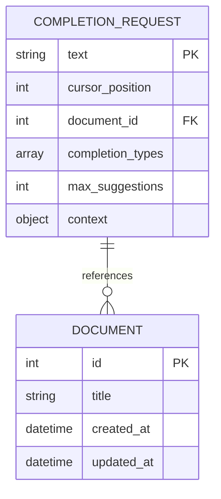
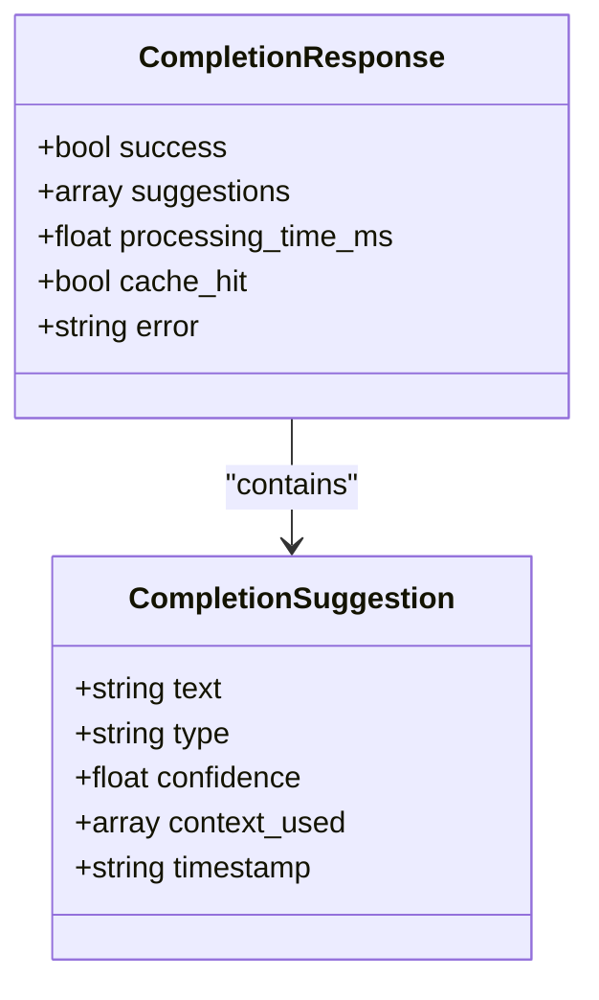
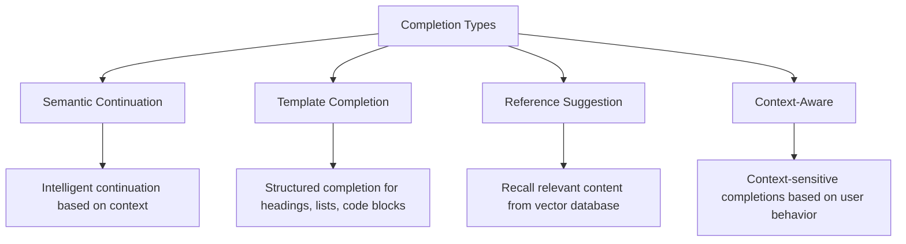
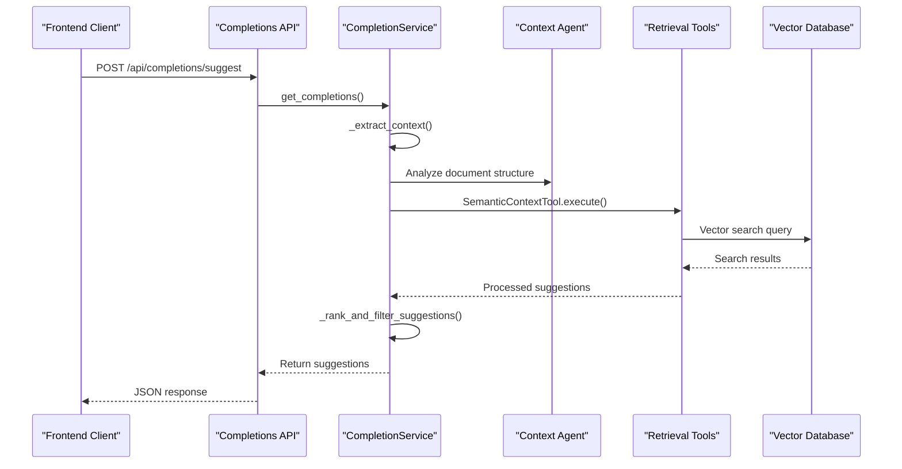
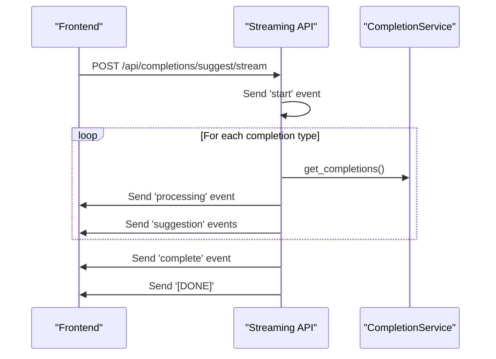
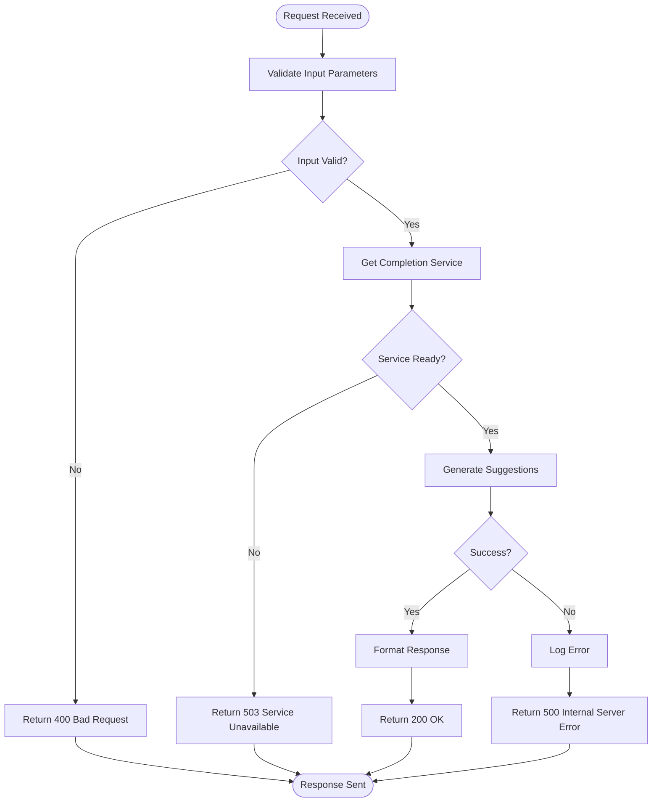
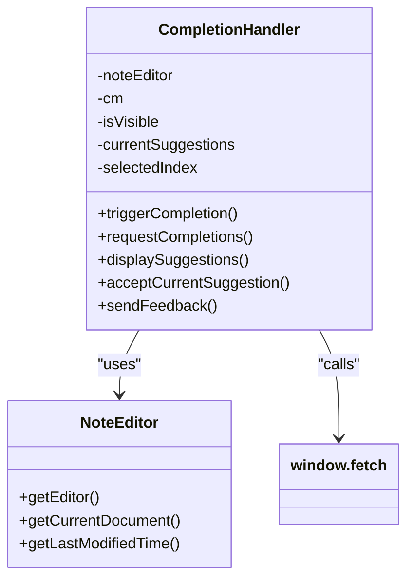
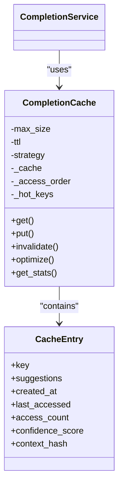

# Completions API

<cite>
**Referenced Files in This Document**   
- [completions.py](file://opencontext/server/routes/completions.py)
- [completion_service.py](file://opencontext/context_consumption/completion/completion_service.py)
- [completion_cache.py](file://opencontext/context_consumption/completion/completion_cache.py)
- [enums.py](file://opencontext/models/enums.py)
- [semantic_context_tool.py](file://opencontext/tools/retrieval_tools/semantic_context_tool.py)
- [completion_handler.js](file://opencontext/web/static/js/completion_handler.js)
</cite>

## Table of Contents
1. [Introduction](#introduction)
2. [Core Endpoints](#core-endpoints)
3. [Request Parameters](#request-parameters)
4. [Response Format](#response-format)
5. [Completion Types](#completion-types)
6. [Context Integration](#context-integration)
7. [Streaming Capabilities](#streaming-capabilities)
8. [Error Handling](#error-handling)
9. [Frontend Integration](#frontend-integration)
10. [Relationship with Other AI Features](#relationship-with-other-ai-features)
11. [Performance and Caching](#performance-and-caching)
12. [Implementation Guidance](#implementation-guidance)

## Introduction
The Completions API provides AI-powered content completion functionality similar to GitHub Copilot, enabling intelligent suggestions for note content, code, and text documents. The API analyzes the current document context, cursor position, and user intent to generate relevant completion suggestions in real-time. This documentation details the POST /api/completions endpoint for generating AI-powered content completions, including request parameters, response format, streaming capabilities, and integration with the context agent and retrieval tools.

The completion system combines multiple strategies including semantic continuation, template completion, and reference suggestions to provide context-aware recommendations. It integrates with the context agent and various retrieval tools to leverage user history, document knowledge, and behavioral patterns for more accurate and relevant suggestions.

**Section sources**
- [completions.py](file://opencontext/server/routes/completions.py#L1-L329)
- [completion_service.py](file://opencontext/context_consumption/completion/completion_service.py#L1-L492)

## Core Endpoints
The Completions API provides several endpoints for different use cases:

```mermaid
graph TD
A[Completions API Endpoints] --> B[/api/completions/suggest]
A --> C[/api/completions/suggest/stream]
A --> D[/api/completions/feedback]
A --> E[/api/completions/stats]
A --> F[/api/completions/cache/stats]
A --> G[/api/completions/cache/optimize]
A --> H[/api/completions/precompute/{document_id}]
A --> I[/api/completions/cache/clear]
B --> J[Get completion suggestions]
C --> K[Stream completion suggestions]
D --> L[Submit feedback]
E --> M[Get service statistics]
F --> N[Get cache statistics]
G --> O[Optimize cache]
H --> P[Precompute document context]
I --> Q[Clear cache]
```

**Diagram sources**
- [completions.py](file://opencontext/server/routes/completions.py#L57-L329)

**Section sources**
- [completions.py](file://opencontext/server/routes/completions.py#L57-L329)

## Request Parameters
The POST /api/completions/suggest endpoint accepts a JSON request body with the following parameters:



### Parameter Details
- **text**: Current document content as a string. This is the primary input for generating completions.
- **cursor_position**: Integer representing the cursor position within the text (0-based index).
- **document_id**: Optional integer identifier for the document being edited.
- **completion_types**: Optional array specifying which types of completions to return (e.g., ['semantic_continuation', 'template_completion']).
- **max_suggestions**: Optional integer to limit the maximum number of suggestions returned (default: 3).
- **context**: Optional object containing additional context information such as current line, line number, and character position.

The API performs validation on these parameters, returning appropriate error responses for invalid inputs such as empty text content or out-of-range cursor positions.

**Section sources**
- [completions.py](file://opencontext/server/routes/completions.py#L31-L45)
- [completion_service.py](file://opencontext/context_consumption/completion/completion_service.py#L92-L109)

## Response Format
The API returns completion suggestions in a standardized JSON format:



### Response Fields
- **success**: Boolean indicating whether the request was successful.
- **suggestions**: Array of completion suggestion objects, each containing:
  - **text**: The suggested completion text
  - **type**: The completion type (semantic_continuation, template_completion, reference_suggestion, or context_aware)
  - **confidence**: Confidence score between 0.0 and 1.0
  - **context_used**: Array of source descriptions used for the suggestion
  - **timestamp**: ISO format timestamp of suggestion generation
- **processing_time_ms**: Processing time in milliseconds
- **cache_hit**: Boolean indicating if the result was served from cache
- **error**: Error message if the request failed

The response also includes metadata such as timestamp and processing statistics for monitoring and debugging purposes.

**Diagram sources**
- [completions.py](file://opencontext/server/routes/completions.py#L47-L55)
- [completion_service.py](file://opencontext/context_consumption/completion/completion_service.py#L45-L53)

**Section sources**
- [completions.py](file://opencontext/server/routes/completions.py#L109-L117)
- [completion_service.py](file://opencontext/context_consumption/completion/completion_service.py#L45-L53)

## Completion Types
The system supports multiple completion strategies, each designed for different use cases:



### Semantic Continuation
Generates intelligent text continuations based on the surrounding context. The system analyzes the preceding text and current line to predict logical continuations, using LLM generation with prompts from the prompt manager.

### Template Completion
Provides structured completions for common document patterns:
- Heading completion (suggesting subheadings)
- List continuation (maintaining list formatting)
- Code block templates (suggesting language-specific templates)

### Reference Suggestion
Retrieves relevant content from the vector database using semantic search. This leverages the SemanticContextTool to find similar knowledge concepts, technical principles, and previously documented information that could be relevant to the current context.

### Context-Aware Completion
Combines multiple signals including user behavior patterns, recent activities, and personal knowledge to provide personalized suggestions that align with the user's typical writing style and content patterns.

**Section sources**
- [enums.py](file://opencontext/models/enums.py#L360-L367)
- [completion_service.py](file://opencontext/context_consumption/completion/completion_service.py#L131-L140)
- [semantic_context_tool.py](file://opencontext/tools/retrieval_tools/semantic_context_tool.py#L15-L85)

## Context Integration
The completion service integrates with the context agent and retrieval tools to provide context-aware suggestions:



The context integration process involves:
1. Extracting contextual information from the current document state
2. Analyzing document structure (headings, lists, code blocks)
3. Querying relevant knowledge through retrieval tools
4. Combining multiple suggestion types
5. Ranking and filtering suggestions by confidence and relevance

The system uses the SemanticContextTool to retrieve knowledge concepts and technical principles from ChromaDB, enabling suggestions that reference the user's personal knowledge base.

**Diagram sources**
- [completion_service.py](file://opencontext/context_consumption/completion/completion_service.py#L117-L145)
- [semantic_context_tool.py](file://opencontext/tools/retrieval_tools/semantic_context_tool.py#L15-L85)

**Section sources**
- [completion_service.py](file://opencontext/context_consumption/completion/completion_service.py#L117-L145)
- [semantic_context_tool.py](file://opencontext/tools/retrieval_tools/semantic_context_tool.py#L15-L85)

## Streaming Capabilities
The API supports streaming responses for real-time completion feedback:



The streaming endpoint (/api/completions/suggest/stream) returns Server-Sent Events (SSE) with the following event types:
- **start**: Indicates the beginning of the streaming response
- **processing**: Indicates which completion type is currently being processed
- **suggestion**: Contains an individual completion suggestion
- **complete**: Indicates all suggestions have been sent
- **error**: Indicates an error occurred during processing
- **[DONE]**: Marks the end of the stream

This allows frontend clients to display suggestions incrementally as they become available, providing immediate feedback to users.

**Section sources**
- [completions.py](file://opencontext/server/routes/completions.py#L134-L202)
- [completion_handler.js](file://opencontext/web/static/js/completion_handler.js#L127-L180)

## Error Handling
The API implements comprehensive error handling for various failure scenarios:



Common error scenarios and responses:
- **Empty text content**: Returns 400 Bad Request with "Text content cannot be empty"
- **Invalid cursor position**: Returns 400 Bad Request with "Invalid cursor position"
- **Service initialization failure**: Returns 500 Internal Server Error
- **LLM generation failure**: Returns 500 Internal Server Error
- **Vector database connection issues**: Returns 500 Internal Server Error

The system also handles streaming errors by sending error events through the SSE connection, allowing clients to display appropriate error messages without terminating the entire session.

**Section sources**
- [completions.py](file://opencontext/server/routes/completions.py#L69-L131)
- [completion_service.py](file://opencontext/context_consumption/completion/completion_service.py#L155-L157)

## Frontend Integration
Frontend clients integrate with the Completions API through the CompletionHandler class:



Key integration points:
- **Triggering completions**: The handler listens for user input and triggers completion requests based on heuristics (minimum trigger length, whitespace patterns)
- **Request formatting**: Constructs the completion request with document content, cursor position, and context
- **Response handling**: Processes the API response and displays suggestions in a UI overlay
- **User interaction**: Handles keyboard navigation (arrow keys, Tab, Esc) and suggestion acceptance
- **Feedback loop**: Sends feedback about accepted/rejected suggestions to improve future recommendations

The frontend implements debouncing (300ms) to avoid excessive API calls during rapid typing and uses document timestamps to prevent applying stale suggestions to modified content.

**Section sources**
- [completion_handler.js](file://opencontext/web/static/js/completion_handler.js#L1-L605)
- [completions.py](file://opencontext/server/routes/completions.py#L205-L239)

## Relationship with Other AI Features
The Completions API is part of a broader AI feature ecosystem:

```mermaid
graph TD
A[AI Features] --> B[Completions API]
A --> C[Smart Tips]
A --> D[Task Generation]
A --> E[Context Agent]
A --> F[Retrieval Tools]
B --> E: Uses context analysis
B --> F: Uses semantic search
C --> E: Uses activity patterns
D --> E: Uses intent context
E --> F: Uses retrieval tools
F --> G[(Vector Database)]
```

### Smart Tips
While completions provide real-time text suggestions, smart tips offer proactive insights based on activity patterns and behavioral analysis. Both features use similar context analysis but differ in timing and purpose:
- Completions: Reactive, immediate suggestions during editing
- Smart Tips: Proactive, periodic insights about productivity patterns

### Task Generation
Task generation creates actionable to-do items from captured content, while completions assist with content creation. They share the same underlying context understanding but serve different workflow stages:
- Completions: Assist with content creation and expansion
- Task Generation: Extract actionable items from existing content

Both features leverage the context agent and retrieval tools, ensuring consistency in how user context is interpreted across different AI capabilities.

**Section sources**
- [completion_service.py](file://opencontext/context_consumption/completion/completion_service.py#L1-L492)
- [smart_tip_generator.py](file://opencontext/context_consumption/generation/smart_tip_generator.py#L1-L259)
- [smart_todo_manager.py](file://opencontext/context_consumption/generation/smart_todo_manager.py#L1-L200)

## Performance and Caching
The system implements a sophisticated caching strategy to optimize performance:



The CompletionCache uses a hybrid strategy combining LRU (Least Recently Used) and TTL (Time To Live) eviction policies. Key features include:
- **Hot key detection**: Frequently accessed keys are protected from eviction
- **Context hashing**: Ensures suggestions are invalidated when underlying content changes
- **Precomputed contexts**: Optimizes performance for frequently accessed documents
- **Memory usage estimation**: Monitors cache memory footprint

Cache statistics are available through the /api/completions/cache/stats endpoint, providing insights into hit rate, evictions, and memory usage. The system also supports cache optimization and clearing operations for maintenance purposes.

**Diagram sources**
- [completion_cache.py](file://opencontext/context_consumption/completion/completion_cache.py#L45-L163)
- [completion_service.py](file://opencontext/context_consumption/completion/completion_service.py#L63-L65)

**Section sources**
- [completion_cache.py](file://opencontext/context_consumption/completion/completion_cache.py#L1-L443)
- [completions.py](file://opencontext/server/routes/completions.py#L266-L279)

## Implementation Guidance
For frontend clients implementing the Completions API:

### Best Practices
- **Debounce requests**: Implement client-side debouncing (300ms recommended) to reduce server load
- **Handle streaming**: For real-time feedback, use the streaming endpoint with proper event handling
- **Timestamp validation**: Compare document timestamps to avoid applying stale suggestions
- **Error handling**: Gracefully handle API errors and timeouts without disrupting the user experience
- **Feedback collection**: Send feedback on accepted/rejected suggestions to help improve the system

### Example Requests
**Code Completion:**
```json
{
  "text": "def calculate_fibonacci(n):\n    if n <= 1:\n        return n\n    ",
  "cursor_position": 58,
  "document_id": 123,
  "completion_types": ["semantic_continuation", "template_completion"]
}
```

**Text Expansion:**
```json
{
  "text": "The benefits of regular exercise include improved cardiovascular health, ",
  "cursor_position": 78,
  "document_id": 456,
  "max_suggestions": 5
}
```

**Smart Reply Generation:**
```json
{
  "text": "Thank you for your email. Regarding your question about the project timeline, ",
  "cursor_position": 82,
  "document_id": 789,
  "context": {
    "current_line": "Thank you for your email. Regarding your question about the project timeline, ",
    "line_number": 15,
    "char_position": 82
  }
}
```

The API is designed to be flexible and adaptable to various content creation scenarios, from code editing to document writing and email composition.

**Section sources**
- [completion_handler.js](file://opencontext/web/static/js/completion_handler.js#L1-L605)
- [completions.py](file://opencontext/server/routes/completions.py#L31-L45)
- [completion_service.py](file://opencontext/context_consumption/completion/completion_service.py#L92-L109)