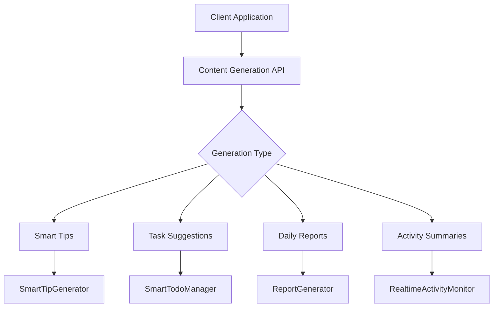
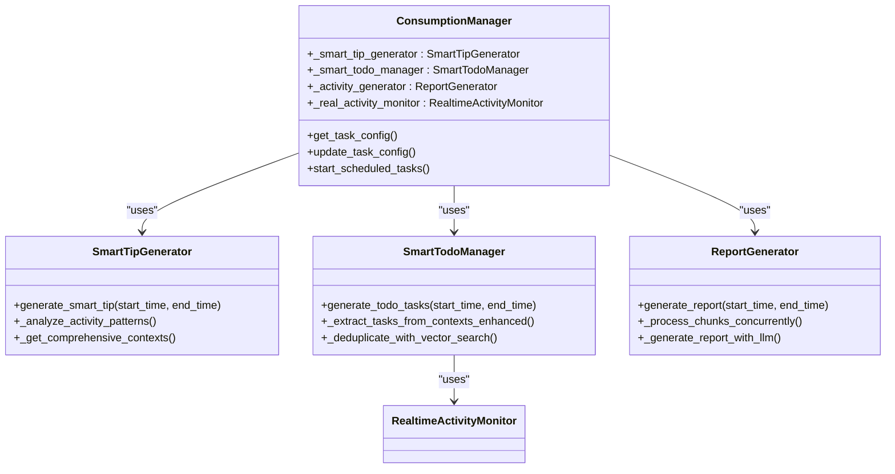

# Content Generation API

<cite>
**Referenced Files in This Document**   
- [content_generation.py](file://opencontext/server/routes/content_generation.py)
- [smart_tip_generator.py](file://opencontext/context_consumption/generation/smart_tip_generator.py)
- [smart_todo_manager.py](file://opencontext/context_consumption/generation/smart_todo_manager.py)
- [generation_report.py](file://opencontext/context_consumption/generation/generation_report.py)
- [consumption_manager.py](file://opencontext/managers/consumption_manager.py)
- [debug.py](file://opencontext/server/routes/debug.py)
</cite>

## Table of Contents
1. [Introduction](#introduction)
2. [Content Generation Endpoints](#content-generation-endpoints)
3. [Request Schema](#request-schema)
4. [Response Format](#response-format)
5. [Generation Examples](#generation-examples)
6. [Component Integration](#component-integration)
7. [Batch Operations and Asynchronous Processing](#batch-operations-and-asynchronous-processing)
8. [Rate Limiting and Error Handling](#rate-limiting-and-error-handling)
9. [Configuration Management](#configuration-management)

## Introduction
The Content Generation API provides AI-powered content creation capabilities that transform user activity data into actionable insights. The system automatically generates smart tips, task suggestions, and comprehensive summaries by analyzing patterns in user behavior and context. These endpoints enable applications to retrieve AI-generated content that helps users improve productivity, stay organized, and gain insights from their digital activities. The API integrates with various components including the smart todo manager and smart tip generator to provide contextually relevant recommendations.

**Section sources**
- [content_generation.py](file://opencontext/server/routes/content_generation.py#L1-L144)

## Content Generation Endpoints
The Content Generation API provides endpoints for retrieving and updating content generation configuration. While direct POST /api/generate endpoints are not explicitly defined in the main content_generation.py file, generation functionality is accessible through the debug endpoints and scheduled tasks managed by the ConsumptionManager. The system supports generating various content types including smart tips, task suggestions, and daily reports based on user activity patterns.

The configuration endpoints allow clients to retrieve the current generation settings and update them according to user preferences. These settings control the frequency and timing of automated content generation across different categories. The actual content generation is triggered either through scheduled tasks or via the debug endpoints with specific parameters.

**Diagram sources**
- [content_generation.py](file://opencontext/server/routes/content_generation.py#L1-L144)
- [smart_tip_generator.py](file://opencontext/context_consumption/generation/smart_tip_generator.py#L1-L373)
- [smart_todo_manager.py](file://opencontext/context_consumption/generation/smart_todo_manager.py#L1-L505)
- [generation_report.py](file://opencontext/context_consumption/generation/generation_report.py#L1-L277)

**Section sources**
- [content_generation.py](file://opencontext/server/routes/content_generation.py#L1-L144)
- [debug.py](file://opencontext/server/routes/debug.py#L503-L691)

## Request Schema
The Content Generation API uses structured request schemas to configure generation parameters and specify context for AI-powered content creation. The main configuration model, ContentGenerationConfig, contains nested configurations for different generation types including activity monitoring, smart tips, task suggestions, and daily reports.

For generation requests, the system accepts parameters that define the time range (start_time and end_time as Unix timestamps), generation type (category), and optional lookback period in minutes. The configuration schema includes specific parameters for each generation type:

- **ActivityConfig**: Controls activity monitoring with enabled flag and interval (minimum 600 seconds)
- **TipsConfig**: Manages smart tip generation with enabled flag and interval (minimum 1800 seconds)
- **TodosConfig**: Configures task suggestion generation with enabled flag and interval (minimum 1800 seconds)
- **ReportConfig**: Sets up daily report generation with enabled flag and scheduled time in HH:MM format

The API supports partial updates to the configuration, allowing clients to modify specific generation types without affecting others. When making generation requests, clients can specify custom prompts for debugging purposes, which temporarily override the default prompts during the generation process.

**Section sources**
- [content_generation.py](file://opencontext/server/routes/content_generation.py#L26-L67)
- [debug.py](file://opencontext/server/routes/debug.py#L505-L508)

## Response Format
The Content Generation API returns structured responses that include generated content, metadata, and status information. For configuration requests, the API returns the current generation settings including enabled states and intervals for each generation type. The response follows a standard format with status codes, messages, and data payloads.

When content is successfully generated, the response includes the generated content along with identifiers and additional metadata. For example, smart tip generation returns a document ID, title, and the tip content itself. Task suggestion generation returns a batch ID and details about the created tasks. Daily reports return the full report content in Markdown format along with a summary.

Error responses follow a consistent pattern with appropriate HTTP status codes and descriptive messages. Common error conditions include:
- 400 Bad Request: Invalid parameters or request format
- 404 Not Found: No content available for generation
- 500 Internal Server Error: System errors during generation
- 503 Service Unavailable: Required components not initialized

The API also includes confidence indicators through the success status of generation operations and detailed error messages that help diagnose issues with content generation.

**Section sources**
- [content_generation.py](file://opencontext/server/routes/content_generation.py#L70-L143)
- [debug.py](file://opencontext/server/routes/debug.py#L544-L547)

## Generation Examples
The Content Generation API supports various use cases for creating AI-powered content from user activity data. Below are examples demonstrating how to generate different types of content:

**Daily Report Generation**
To generate a daily report, use the debug endpoint with category "report". The system automatically determines the appropriate time range (previous 24 hours) if start_time and end_time are not specified. The report combines activity data, smart tips, and task information into a comprehensive summary.

**Smart Tips from Activity Patterns**
Smart tips are generated by analyzing recent activity patterns, including work time distribution, category trends, and key entities. To generate tips, call the endpoint with category "tips" and specify a lookback period (default 15 minutes). The system analyzes activity metadata to identify potential improvement areas and generates personalized suggestions.

**Task Recommendations**
Task suggestions are created by identifying potential todos from activity insights and combining them with semantic context. Use the category "todo" to generate task recommendations. The system extracts tasks from recent activities, applies deduplication using vector similarity, and stores them in the todo database with appropriate metadata.

These examples demonstrate the API's ability to transform raw activity data into valuable, actionable content that helps users optimize their workflow and stay organized.

**Section sources**
- [debug.py](file://opencontext/server/routes/debug.py#L594-L640)
- [smart_tip_generator.py](file://opencontext/context_consumption/generation/smart_tip_generator.py#L45-L83)
- [smart_todo_manager.py](file://opencontext/context_consumption/generation/smart_todo_manager.py#L56-L128)

## Component Integration
The Content Generation API integrates with several key components to deliver AI-powered content creation capabilities. The SmartTipGenerator analyzes user activity patterns to generate personalized reminders and suggestions. It processes multiple context types including activity, semantic, intent, and entity contexts to identify areas where users might benefit from intelligent prompts.

The SmartTodoManager works in conjunction with the generation system to identify and create task suggestions based on user activities. It extracts potential tasks from activity metadata, combines them with historical context, and applies vector-based deduplication to ensure recommendations are unique and valuable. The component also processes task details such as priority, due dates, and participants to create well-structured todo items.

The ReportGenerator component creates comprehensive daily reports by aggregating data from various sources. It processes hourly activity summaries, combines them with smart tips and completed tasks, and generates a cohesive report in Markdown format. The generation_report.py module handles the asynchronous processing of time chunks and merging of results into a final report.

These components are orchestrated by the ConsumptionManager, which manages their lifecycle, configuration, and scheduled execution. The manager ensures that generation tasks are executed at appropriate intervals and that resources are properly coordinated.

**Diagram sources**
- [consumption_manager.py](file://opencontext/managers/consumption_manager.py#L31-L524)
- [smart_tip_generator.py](file://opencontext/context_consumption/generation/smart_tip_generator.py#L40-L373)
- [smart_todo_manager.py](file://opencontext/context_consumption/generation/smart_todo_manager.py#L46-L505)
- [generation_report.py](file://opencontext/context_consumption/generation/generation_report.py#L26-L277)

**Section sources**
- [consumption_manager.py](file://opencontext/managers/consumption_manager.py#L31-L524)
- [smart_tip_generator.py](file://opencontext/context_consumption/generation/smart_tip_generator.py#L40-L373)
- [smart_todo_manager.py](file://opencontext/context_consumption/generation/smart_todo_manager.py#L46-L505)

## Batch Operations and Asynchronous Processing
The Content Generation API handles batch operations and asynchronous processing through its underlying architecture and component design. The ReportGenerator implements concurrent processing by dividing the generation task into hourly chunks and processing them asynchronously using asyncio.gather(). This approach allows the system to efficiently handle large time ranges by processing multiple time periods in parallel.

The ConsumptionManager schedules generation tasks at configurable intervals, effectively creating a batch processing system for content generation. Each generation type (tips, todos, reports) runs on its own schedule, with the manager ensuring that tasks are executed at the appropriate frequency. The system uses threading.Timer for scheduling, with check intervals calculated as a fraction of the generation interval to ensure timely execution.

For asynchronous operations, the API endpoints return immediately after initiating the generation process, allowing clients to continue without waiting for completion. The generated content is stored in the database and events are published through the event manager, enabling other components to react to new content without blocking the generation process.

The debug endpoints provide a way to trigger immediate generation operations, which can be useful for testing and development. These endpoints support custom prompts and allow developers to experiment with different generation parameters without affecting the scheduled tasks.

**Section sources**
- [generation_report.py](file://opencontext/context_consumption/generation/generation_report.py#L76-L109)
- [consumption_manager.py](file://opencontext/managers/consumption_manager.py#L242-L371)

## Rate Limiting and Error Handling
The Content Generation API implements rate limiting and error handling through configuration constraints and robust exception management. Each generation type has minimum interval requirements enforced by Pydantic model validators: activity generation requires at least 600 seconds (10 minutes), while tips and task suggestions require at least 1800 seconds (30 minutes). These constraints prevent excessive generation requests that could impact system performance.

The API includes comprehensive error handling for various failure scenarios. When insufficient context is available for generation, the system returns appropriate 404 responses indicating that no content could be generated. This occurs when there is not enough activity data within the specified time range to produce meaningful insights.

For system errors, the API returns 500 status codes with descriptive messages that help diagnose issues. The error handling is implemented consistently across all endpoints, with try-catch blocks wrapping critical operations and detailed logging of exceptions. The ConsumptionManager validates component initialization before attempting generation, returning clear error messages if required components are not available.

The system also handles configuration errors by validating input parameters and rejecting requests with invalid values. Partial updates are supported, allowing clients to modify specific configuration options without affecting others, which reduces the risk of configuration-related errors.

**Section sources**
- [content_generation.py](file://opencontext/server/routes/content_generation.py#L29-L57)
- [content_generation.py](file://opencontext/server/routes/content_generation.py#L83-L85)
- [content_generation.py](file://opencontext/server/routes/content_generation.py#L141-L143)

## Configuration Management
The Content Generation API provides comprehensive configuration management through dedicated endpoints and the ConsumptionManager class. The GET /api/content_generation/config endpoint retrieves the current generation settings, including enabled states and intervals for each generation type. The POST /api/content_generation/config endpoint allows updating these settings with partial updates, meaning clients can modify specific configuration options without affecting others.

The ConsumptionManager maintains configuration state in memory and persists it to user settings files. It supports dynamic configuration updates through the update_task_config method, which can modify intervals, enable/disable generation types, and change report generation times. When configuration changes require restarting scheduled tasks, the manager handles this transparently by stopping and restarting the appropriate timers.

Configuration is loaded from the GlobalConfig system at initialization and can be overridden through the API. The system validates all configuration changes and ensures that minimum interval requirements are met. Configuration changes are applied immediately in memory and saved to the user settings file, ensuring persistence across application restarts.

The configuration model includes specific parameters for each generation type, allowing fine-grained control over the content generation process. This flexibility enables users to customize the system to their workflow preferences while maintaining system stability through validated constraints.

**Section sources**
- [content_generation.py](file://opencontext/server/routes/content_generation.py#L69-L143)
- [consumption_manager.py](file://opencontext/managers/consumption_manager.py#L380-L417)