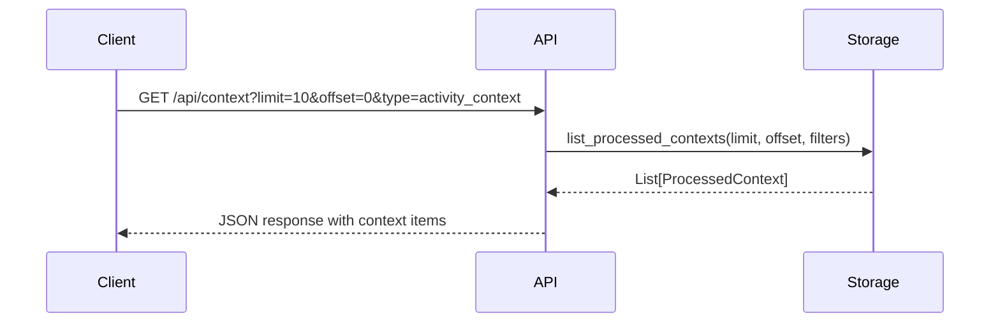
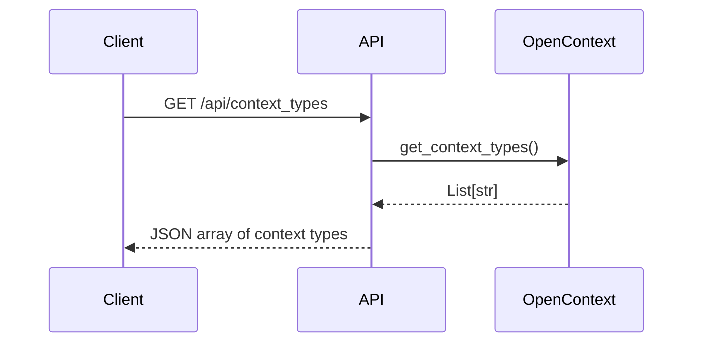
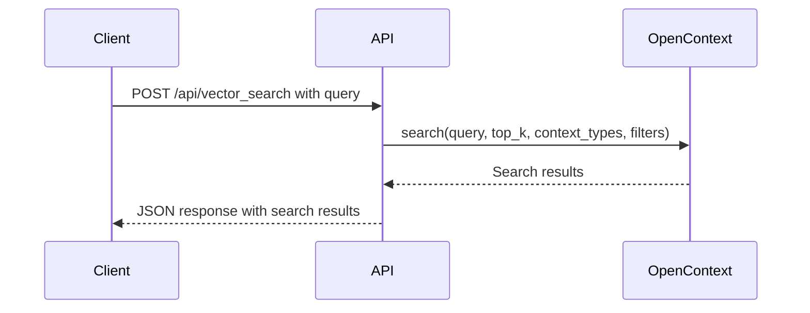
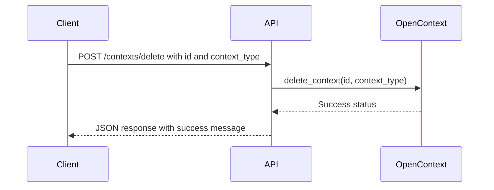
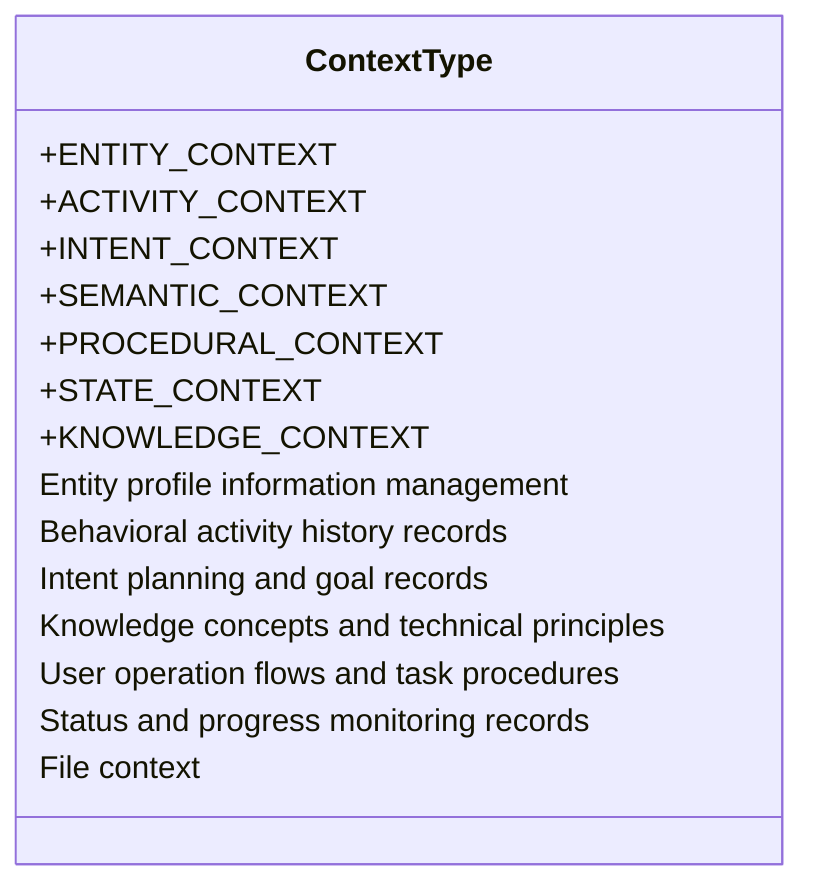
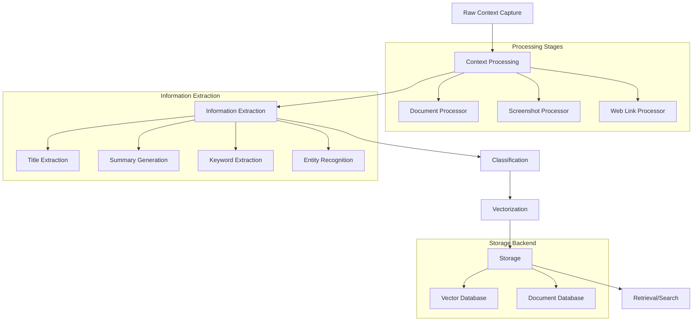
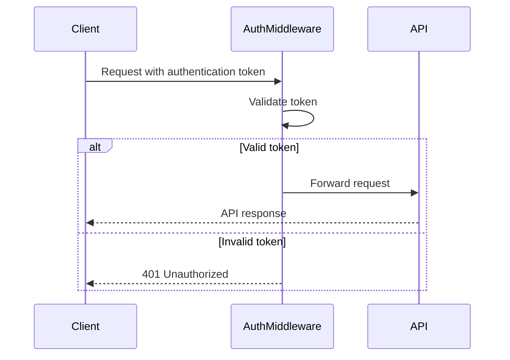

# Context Management API

<cite>
**Referenced Files in This Document**   
- [context.py](file://opencontext/server/routes/context.py)
- [context.py](file://opencontext/models/context.py)
- [enums.py](file://opencontext/models/enums.py)
- [opencontext.py](file://opencontext/server/opencontext.py)
- [global_storage.py](file://opencontext/storage/global_storage.py)
- [unified_storage.py](file://opencontext/storage/unified_storage.py)
- [document_processor.py](file://opencontext/context_processing/processor/document_processor.py)
- [screenshot_processor.py](file://opencontext/context_processing/processor/screenshot_processor.py)
</cite>

## Table of Contents
1. [Introduction](#introduction)
2. [API Endpoints](#api-endpoints)
3. [Response Schema](#response-schema)
4. [Query Parameters](#query-parameters)
5. [Context Types](#context-types)
6. [Context Processing Pipeline](#context-processing-pipeline)
7. [Usage Examples](#usage-examples)
8. [Authentication](#authentication)
9. [Performance Considerations](#performance-considerations)
10. [Troubleshooting](#troubleshooting)

## Introduction
The Context Management API provides a comprehensive interface for retrieving, filtering, and managing captured context data within the OpenContext system. This API enables clients to access structured context information that has been processed from various sources including screenshots, documents, web links, and user inputs. The API supports pagination, filtering, and search capabilities to efficiently retrieve relevant context data.

The context data model is designed to capture rich metadata about each context item, including source information, timestamps, and semantic classification. The system automatically processes raw context data through a sophisticated pipeline that extracts meaningful information, classifies context types, and generates vector embeddings for semantic search.

**Section sources**
- [context.py](file://opencontext/server/routes/context.py#L1-L146)
- [context.py](file://opencontext/models/context.py#L1-L343)

## API Endpoints

### GET /api/context
Retrieves a paginated list of processed context items with optional filtering parameters.



**Diagram sources**
- [context.py](file://opencontext/server/routes/context.py#L147-L146)
- [unified_storage.py](file://opencontext/storage/unified_storage.py#L213-L243)

### GET /api/context_types
Retrieves all available context types in the system.



**Diagram sources**
- [context.py](file://opencontext/server/routes/context.py#L104-L115)
- [opencontext.py](file://opencontext/server/opencontext.py#L254-L258)

### POST /api/vector_search
Performs a direct vector search on the context database without using LLM processing.



**Diagram sources**
- [context.py](file://opencontext/server/routes/context.py#L117-L145)
- [opencontext.py](file://opencontext/server/opencontext.py#L242-L252)

### POST /contexts/delete
Deletes a processed context item by its ID and context type.



**Diagram sources**
- [context.py](file://opencontext/server/routes/context.py#L69-L79)
- [opencontext.py](file://opencontext/server/opencontext.py#L219-L224)

## Response Schema

The API returns context data in a standardized JSON format with comprehensive metadata. The response schema is defined by the `ProcessedContextModel` class which includes the following fields:

| Field | Type | Description |
|-------|------|-------------|
| id | string | Unique identifier for the context item |
| title | string | Extracted title of the context |
| summary | string | Summarized content of the context |
| keywords | array | Extracted keywords from the context |
| entities | array | Extracted named entities from the context |
| context_type | string | Classification of the context type |
| confidence | integer | Confidence level of the context extraction (0-100) |
| importance | integer | Importance score of the context (0-100) |
| is_processed | boolean | Whether the context has been processed |
| call_count | integer | Number of times the context has been accessed |
| merge_count | integer | Number of times the context has been merged |
| last_call_time | string | Timestamp of the last access |
| create_time | string | Timestamp when the context was created |
| update_time | string | Timestamp when the context was last updated |
| event_time | string | Timestamp of the event described in the context |
| embedding | array | Vector embedding of the context |
| raw_contexts | array | Array of raw context sources |
| duration_count | integer | Duration count of the context |
| is_happend | boolean | Whether the event has occurred |
| metadata | object | Additional structured metadata |

The `raw_contexts` field contains an array of `RawContextModel` objects with the following schema:

| Field | Type | Description |
|-------|------|-------------|
| object_id | string | Object ID of the raw context |
| content_format | string | Format of the content (text, image, file) |
| source | string | Source of the context (screenshot, vault, web_link, etc.) |
| create_time | string | Timestamp when the raw context was created |
| content_path | string | Path to the content file (if applicable) |
| content_text | string | Text content (if applicable) |
| additional_info | object | Additional information about the raw context |

**Section sources**
- [context.py](file://opencontext/models/context.py#L243-L310)
- [context.py](file://opencontext/models/context.py#L204-L241)

## Query Parameters

The GET /api/context endpoint supports several query parameters for filtering and pagination:

### Pagination Parameters
| Parameter | Type | Required | Default | Description |
|-----------|------|----------|---------|-------------|
| limit | integer | No | 10 | Maximum number of items to return |
| offset | integer | No | 0 | Number of items to skip for pagination |

### Filtering Parameters
| Parameter | Type | Required | Description |
|-----------|------|----------|-------------|
| type | string | No | Filter results by context type |
| start_time | string | No | ISO format timestamp to filter contexts created after this time |
| end_time | string | No | ISO format timestamp to filter contexts created before this time |
| source | string | No | Filter by source type (screenshot, vault, web_link, etc.) |
| keywords | string | No | Comma-separated keywords to search for in context keywords |
| query | string | No | Full-text search query to match against context content |

### Example Usage
```http
GET /api/context?limit=20&offset=0&type=activity_context&start_time=2025-01-01T00:00:00Z
```

This request retrieves the first 20 activity contexts created after January 1, 2025.

**Section sources**
- [web.py](file://opencontext/server/routes/web.py#L36-L68)
- [unified_storage.py](file://opencontext/storage/unified_storage.py#L213-L243)

## Context Types

The system classifies context into several distinct types based on their semantic meaning and purpose:



**Diagram sources**
- [enums.py](file://opencontext/models/enums.py#L84-L101)

### Context Type Descriptions

**ENTITY_CONTEXT**: Manages profile information of various entities such as people, projects, teams, and organizations. This type answers the question "who/what is this entity" and is used to build an entity knowledge graph.

**ACTIVITY_CONTEXT**: Records historical trajectories of specific behaviors, completed tasks, and participated activities. This type answers the question "what have I done" and is used to build behavioral patterns and accumulate experience.

**INTENT_CONTEXT**: Records future plans, goal settings, action intentions, and other forward-looking information. This type answers the question "what am I going to do" and is used for action planning and goal management.

**SEMANTIC_CONTEXT**: Records core knowledge points, concept definitions, technical architectures, and theoretical understanding. This type answers "what is this" and "why it works" questions.

**PROCEDURAL_CONTEXT**: Records user operation flows and task procedures based on temporal sequences. This type captures reusable operation patterns and workflows that can guide future task execution.

**STATE_CONTEXT**: Records status information such as current status, progress tracking, and performance indicators. This type answers the question "how is the progress" and is used to monitor execution and evaluate effectiveness.

**KNOWLEDGE_CONTEXT**: Represents file-based context from documents, spreadsheets, and other structured files. This type preserves the original file context and metadata.

**Section sources**
- [enums.py](file://opencontext/models/enums.py#L111-L247)

## Context Processing Pipeline

The context processing pipeline transforms raw context data into structured, searchable information through a multi-stage process:



**Diagram sources**
- [opencontext.py](file://opencontext/server/opencontext.py#L31-L300)
- [document_processor.py](file://opencontext/context_processing/processor/document_processor.py#L41-L653)
- [screenshot_processor.py](file://opencontext/context_processing/processor/screenshot_processor.py#L47-L590)

### Document Processing
When a document is captured, the DocumentProcessor handles its processing:

1. **Format Detection**: Determines the document type (PDF, DOCX, XLSX, etc.)
2. **Content Extraction**: Extracts text and images from the document
3. **Chunking**: Splits the content into manageable chunks based on type:
   - Structured files (XLSX, CSV): Processed as structured data
   - Text-heavy documents: Chunked by semantic boundaries
   - Image-heavy documents: Analyzed with Vision LLM
4. **Information Extraction**: Uses LLM to extract titles, summaries, keywords, and entities
5. **Classification**: Determines the appropriate context type
6. **Storage**: Saves the processed context to the vector database

### Screenshot Processing
When a screenshot is captured, the ScreenshotProcessor handles its processing:

1. **Deduplication**: Uses perceptual hashing (pHash) to identify and filter duplicate screenshots
2. **Visual Analysis**: Uses Vision LLM to analyze the screenshot content
3. **Information Extraction**: Extracts text, identifies UI elements, and understands the context
4. **Classification**: Determines the appropriate context type based on content
5. **Merging**: Combines related screenshots into cohesive context items
6. **Storage**: Saves the processed context to the vector database

**Section sources**
- [document_processor.py](file://opencontext/context_processing/processor/document_processor.py#L41-L653)
- [screenshot_processor.py](file://opencontext/context_processing/processor/screenshot_processor.py#L47-L590)

## Usage Examples

### Retrieving Screenshot Context
```http
GET /api/context?type=screenshot&limit=5
```

This request retrieves the 5 most recent screenshot contexts. The response includes the extracted information from the visual analysis, including detected text, UI elements, and the interpreted context.

### Retrieving Document Context
```http
GET /api/context?type=knowledge_context&start_time=2025-01-01T00:00:00Z
```

This request retrieves all document contexts created after January 1, 2025. The response includes the extracted text, metadata about the original document, and any structured data that was processed from the file.

### Retrieving Web Link Context
```http
GET /api/context?type=web_link&keywords=api,documentation
```

This request retrieves web link contexts that contain the keywords "api" and "documentation" in their extracted keywords. This is useful for finding previously visited web pages about specific topics.

### Time Range Filtering
```http
GET /api/context?start_time=2025-01-15T00:00:00Z&end_time=2025-01-16T00:00:00Z
```

This request retrieves all context items created during a specific 24-hour period, useful for reviewing activities from a particular day.

### Content Search
```http
GET /api/context?query=project%20timeline
```

This request performs a full-text search across all context items for the phrase "project timeline", returning relevant results based on semantic similarity.

**Section sources**
- [context.py](file://opencontext/server/routes/context.py#L147-L146)
- [unified_storage.py](file://opencontext/storage/unified_storage.py#L213-L243)

## Authentication

The Context Management API requires authentication for all endpoints. The system uses a middleware-based authentication mechanism that validates requests before they reach the API handlers.



**Diagram sources**
- [context.py](file://opencontext/server/routes/context.py#L14-L23)
- [auth.py](file://opencontext/server/middleware/auth.py)

Authentication is implemented through the `auth_dependency` function which is applied as a dependency to all protected routes. Clients must include a valid authentication token in their requests, typically as a Bearer token in the Authorization header.

```http
Authorization: Bearer <token>
```

The authentication system supports both API keys and session-based authentication, with configurable expiration times and refresh mechanisms.

**Section sources**
- [context.py](file://opencontext/server/routes/context.py#L14-L23)
- [auth.py](file://opencontext/server/middleware/auth.py)

## Performance Considerations

### Efficient Querying Patterns
To ensure optimal performance when retrieving context data, follow these best practices:

1. **Use Specific Filters**: Always include context type filters when possible to reduce the search space
2. **Implement Pagination**: Use limit and offset parameters to retrieve data in manageable chunks
3. **Narrow Time Ranges**: When searching for recent contexts, specify appropriate start_time and end_time parameters
4. **Use Vector Search for Semantic Queries**: For complex semantic searches, use the vector search endpoint rather than full-text search

### Pagination Strategies
The API supports cursor-based and offset-based pagination:

**Offset-based pagination** (recommended for small datasets):
```http
GET /api/context?limit=20&offset=40
```

**Cursor-based pagination** (recommended for large datasets):
```http
GET /api/context?limit=20&cursor=abc123
```

For large datasets, cursor-based pagination is more efficient as it avoids the performance degradation associated with high offset values.

### Caching Recommendations
Implement client-side caching for frequently accessed context items:

1. Cache context items by their ID with appropriate TTL
2. Use ETag headers for conditional requests
3. Implement local caching of context type lists
4. Cache search results for common queries

### Rate Limiting
The API implements rate limiting to prevent abuse and ensure system stability:

- 100 requests per minute per client
- 10 requests per second burst limit
- Higher limits available for authenticated enterprise clients

**Section sources**
- [context.py](file://opencontext/server/routes/context.py#L147-L146)
- [unified_storage.py](file://opencontext/storage/unified_storage.py#L213-L243)

## Troubleshooting

### Common Issues and Solutions

**Issue**: Empty response from /api/context endpoint
- **Cause**: No context items match the filter criteria
- **Solution**: Remove filters or expand time range parameters

**Issue**: 401 Unauthorized errors
- **Cause**: Missing or invalid authentication token
- **Solution**: Verify the Authorization header and token validity

**Issue**: Slow response times
- **Cause**: Large result sets or complex queries
- **Solution**: Implement pagination and narrow filter criteria

**Issue**: Incomplete context data
- **Cause**: Processing pipeline not fully completed
- **Solution**: Wait for processing to complete or check system health

### Monitoring and Health Checks
The system provides health check endpoints to monitor the status of components:

```http
GET /health
```

This endpoint returns the health status of all system components including configuration, storage, LLM services, capture, and consumption modules.

### Error Handling
The API follows standard HTTP error codes:

- 400 Bad Request: Invalid request parameters
- 401 Unauthorized: Authentication required or failed
- 404 Not Found: Requested resource not found
- 429 Too Many Requests: Rate limit exceeded
- 500 Internal Server Error: Server-side processing error

Error responses include a descriptive message to aid in troubleshooting.

**Section sources**
- [context.py](file://opencontext/server/routes/context.py#L69-L79)
- [opencontext.py](file://opencontext/server/opencontext.py#L260-L269)