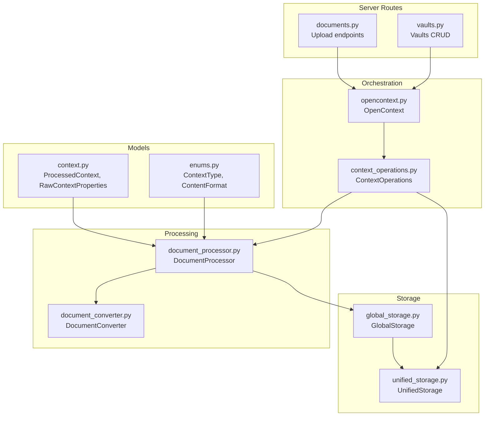
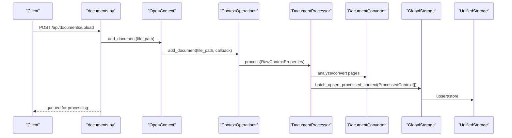
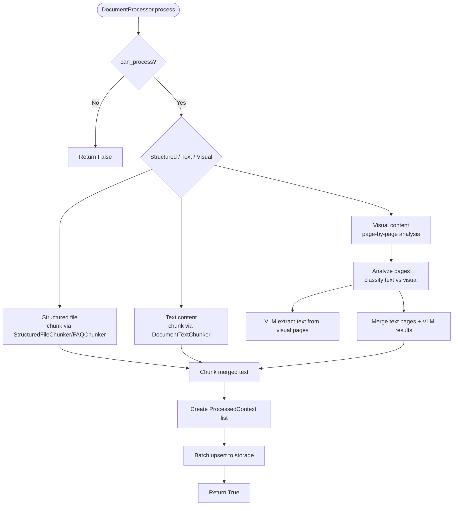
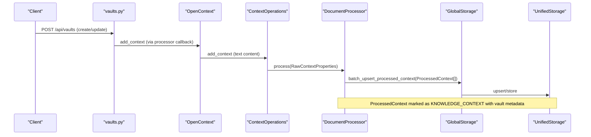
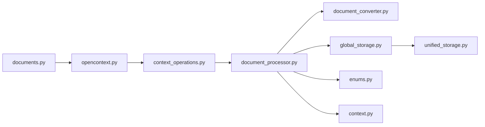

# Documents API

<cite>
**Referenced Files in This Document**
- [documents.py](file://opencontext/server/routes/documents.py)
- [opencontext.py](file://opencontext/server/opencontext.py)
- [context_operations.py](file://opencontext/server/context_operations.py)
- [document_processor.py](file://opencontext/context_processing/processor/document_processor.py)
- [document_converter.py](file://opencontext/context_processing/processor/document_converter.py)
- [global_storage.py](file://opencontext/storage/global_storage.py)
- [unified_storage.py](file://opencontext/storage/unified_storage.py)
- [enums.py](file://opencontext/models/enums.py)
- [context.py](file://opencontext/models/context.py)
- [vaults.py](file://opencontext/server/routes/vaults.py)
- [vault_document_monitor.py](file://opencontext/context_capture/vault_document_monitor.py)
- [api.py](file://opencontext/server/api.py)
</cite>

## Table of Contents
1. [Introduction](#introduction)
2. [Project Structure](#project-structure)
3. [Core Components](#core-components)
4. [Architecture Overview](#architecture-overview)
5. [Detailed Component Analysis](#detailed-component-analysis)
6. [Dependency Analysis](#dependency-analysis)
7. [Performance Considerations](#performance-considerations)
8. [Troubleshooting Guide](#troubleshooting-guide)
9. [Conclusion](#conclusion)
10. [Appendices](#appendices)

## Introduction
This document describes the Documents API and the end-to-end document processing pipeline. It focuses on:
- How to upload documents and web links
- How processed documents are stored and searched
- How the system integrates with the document processor and storage
- How vaults relate to knowledge contexts
- Guidance for building document management interfaces and handling large document collections

Important note: The repository exposes a document upload endpoint and a web link upload endpoint, but does not expose explicit GET /api/documents, POST /api/documents, or DELETE /api/documents/{id} endpoints. Instead, the system provides:
- Upload endpoints for local documents and web links
- A unified OpenContext API for listing/searching processed contexts
- A vaults API for managing knowledge documents and associating them with knowledge contexts

This document therefore documents the available upload and retrieval/search capabilities and explains how to manage processed documents effectively.

## Project Structure
The Documents API is part of the FastAPI server routes and integrates with the OpenContext orchestration layer, the document processor, and the unified storage system.

**Diagram sources**
- [documents.py](file://opencontext/server/routes/documents.py#L1-L101)
- [opencontext.py](file://opencontext/server/opencontext.py#L1-L300)
- [context_operations.py](file://opencontext/server/context_operations.py#L1-L224)
- [document_processor.py](file://opencontext/context_processing/processor/document_processor.py#L1-L653)
- [document_converter.py](file://opencontext/context_processing/processor/document_converter.py#L1-L429)
- [global_storage.py](file://opencontext/storage/global_storage.py#L1-L196)
- [unified_storage.py](file://opencontext/storage/unified_storage.py#L1-L925)
- [context.py](file://opencontext/models/context.py#L1-L200)
- [enums.py](file://opencontext/models/enums.py#L77-L108)
- [vaults.py](file://opencontext/server/routes/vaults.py#L242-L423)

**Section sources**
- [api.py](file://opencontext/server/api.py#L1-L57)
- [documents.py](file://opencontext/server/routes/documents.py#L1-L101)
- [opencontext.py](file://opencontext/server/opencontext.py#L1-L300)
- [context_operations.py](file://opencontext/server/context_operations.py#L1-L224)
- [document_processor.py](file://opencontext/context_processing/processor/document_processor.py#L1-L653)
- [document_converter.py](file://opencontext/context_processing/processor/document_converter.py#L1-L429)
- [global_storage.py](file://opencontext/storage/global_storage.py#L1-L196)
- [unified_storage.py](file://opencontext/storage/unified_storage.py#L1-L925)
- [context.py](file://opencontext/models/context.py#L1-L200)
- [enums.py](file://opencontext/models/enums.py#L77-L108)
- [vaults.py](file://opencontext/server/routes/vaults.py#L242-L423)

## Core Components
- Upload endpoints:
  - POST /api/documents/upload (local file path)
  - POST /api/weblinks/upload (URL + optional filename hint)
- Unified retrieval/search:
  - OpenContext.get_all_contexts, OpenContext.get_context, OpenContext.search
- Storage:
  - GlobalStorage and UnifiedStorage for vectorized contexts and document metadata
- Processing:
  - DocumentProcessor orchestrates structured, text, and visual document processing
  - DocumentConverter handles page analysis and image conversion
- Models:
  - ProcessedContext, RawContextProperties, ExtractedData, ContextProperties, Vectorize
  - ContextType and ContentFormat enums

**Section sources**
- [documents.py](file://opencontext/server/routes/documents.py#L1-L101)
- [opencontext.py](file://opencontext/server/opencontext.py#L190-L260)
- [context_operations.py](file://opencontext/server/context_operations.py#L1-L224)
- [document_processor.py](file://opencontext/context_processing/processor/document_processor.py#L1-L653)
- [document_converter.py](file://opencontext/context_processing/processor/document_converter.py#L1-L429)
- [global_storage.py](file://opencontext/storage/global_storage.py#L120-L196)
- [unified_storage.py](file://opencontext/storage/unified_storage.py#L160-L320)
- [context.py](file://opencontext/models/context.py#L131-L200)
- [enums.py](file://opencontext/models/enums.py#L77-L108)

## Architecture Overview
The upload flow queues documents into the processing pipeline. The processor converts, chunks, and creates ProcessedContext entries, which are batch-upserted into the vector storage. Retrieval/search uses vector similarity with optional filters.

**Diagram sources**
- [documents.py](file://opencontext/server/routes/documents.py#L40-L61)
- [opencontext.py](file://opencontext/server/opencontext.py#L235-L241)
- [context_operations.py](file://opencontext/server/context_operations.py#L110-L150)
- [document_processor.py](file://opencontext/context_processing/processor/document_processor.py#L186-L219)
- [document_converter.py](file://opencontext/context_processing/processor/document_converter.py#L52-L141)
- [global_storage.py](file://opencontext/storage/global_storage.py#L120-L160)
- [unified_storage.py](file://opencontext/storage/unified_storage.py#L167-L206)

## Detailed Component Analysis

### Upload Endpoints
- POST /api/documents/upload
  - Purpose: Enqueue a local document file for processing
  - Request body: file_path (string)
  - Behavior: Validates path, constructs RawContextProperties, delegates to OpenContext.add_document, which calls ContextOperations.add_document and then DocumentProcessor.process
  - Response: Success message or error code/message
- POST /api/weblinks/upload
  - Purpose: Enqueue a web URL to be captured and converted to PDF, then processed
  - Request body: url (string), filename_hint (optional)
  - Behavior: Lazily initializes web capture component if needed, submits URL, optionally triggers immediate capture
  - Response: Success message or error code/message

Notes:
- There is no explicit GET /api/documents or DELETE /api/documents/{id} endpoint in the repository. Retrieval and deletion are performed via the unified OpenContext API and UnifiedStorage.

**Section sources**
- [documents.py](file://opencontext/server/routes/documents.py#L40-L101)
- [opencontext.py](file://opencontext/server/opencontext.py#L235-L241)
- [context_operations.py](file://opencontext/server/context_operations.py#L110-L150)
- [document_processor.py](file://opencontext/context_processing/processor/document_processor.py#L186-L219)

### Retrieval and Search
- Listing processed contexts:
  - OpenContext.get_all_contexts(limit, offset, filter_criteria)
  - Returns paginated lists of ProcessedContext grouped by context type
- Getting a single processed context:
  - OpenContext.get_context(doc_id, context_type)
- Deleting a processed context:
  - OpenContext.delete_context(doc_id, context_type)
- Searching:
  - OpenContext.search(query, top_k, context_types, filters)
  - Returns a list of results with context and score

These operations delegate to UnifiedStorage and GlobalStorage.

**Section sources**
- [opencontext.py](file://opencontext/server/opencontext.py#L194-L225)
- [context_operations.py](file://opencontext/server/context_operations.py#L30-L66)
- [context_operations.py](file://opencontext/server/context_operations.py#L152-L207)
- [global_storage.py](file://opencontext/storage/global_storage.py#L120-L196)
- [unified_storage.py](file://opencontext/storage/unified_storage.py#L213-L243)
- [unified_storage.py](file://opencontext/storage/unified_storage.py#L283-L309)

### Document Processing Pipeline
- DocumentProcessor
  - Determines file type and content type
  - Supports structured files (CSV/XLSX/JSONL), text content, and visual content (PDF/DOCX/images)
  - Page-by-page analysis for PDF/DOCX/MD/TXT
  - Uses DocumentConverter to analyze pages and convert to images when needed
  - Uses VLM (Vision-Language Model) for pages with visual elements
  - Chunks text and creates ProcessedContext entries with ExtractedData and metadata
  - Batch-upserts results to storage
- DocumentConverter
  - Converts PDF/DOCX/PPTX/images to PIL images
  - Analyzes PDF/DOCX/Markdown pages to detect visual elements and extract text
  - Extracts embedded images from DOCX for VLM processing

**Diagram sources**
- [document_processor.py](file://opencontext/context_processing/processor/document_processor.py#L172-L246)
- [document_processor.py](file://opencontext/context_processing/processor/document_processor.py#L312-L402)
- [document_processor.py](file://opencontext/context_processing/processor/document_processor.py#L404-L545)
- [document_processor.py](file://opencontext/context_processing/processor/document_processor.py#L546-L608)
- [document_converter.py](file://opencontext/context_processing/processor/document_converter.py#L142-L213)
- [document_converter.py](file://opencontext/context_processing/processor/document_converter.py#L214-L429)

**Section sources**
- [document_processor.py](file://opencontext/context_processing/processor/document_processor.py#L111-L171)
- [document_processor.py](file://opencontext/context_processing/processor/document_processor.py#L223-L402)
- [document_processor.py](file://opencontext/context_processing/processor/document_processor.py#L404-L608)
- [document_converter.py](file://opencontext/context_processing/processor/document_converter.py#L52-L141)
- [document_converter.py](file://opencontext/context_processing/processor/document_converter.py#L142-L213)
- [document_converter.py](file://opencontext/context_processing/processor/document_converter.py#L214-L429)

### Storage and Models
- ProcessedContext stores:
  - properties: raw_properties, timestamps, durations, flags
  - extracted_data: title, summary, keywords, entities, context_type
  - vectorize: content_format, text/image path
  - metadata: structured metadata (e.g., knowledge source, file path, raw_id)
- UnifiedStorage:
  - Vector database backend for ProcessedContext
  - Document database backend for vaults and other document metadata
- GlobalStorage:
  - Singleton wrapper around UnifiedStorage with convenience methods

**Section sources**
- [context.py](file://opencontext/models/context.py#L131-L200)
- [context.py](file://opencontext/models/context.py#L1-L78)
- [unified_storage.py](file://opencontext/storage/unified_storage.py#L167-L243)
- [global_storage.py](file://opencontext/storage/global_storage.py#L120-L196)
- [enums.py](file://opencontext/models/enums.py#L77-L108)

### Relationship with Vaults and Knowledge Contexts
- Vault documents are ingested via the vaults API and then processed as text content, creating ProcessedContext with context_type KNOWLEDGE_CONTEXT and metadata indicating vault origin.
- The vault document monitor can create RawContextProperties from vault events, including title, summary, tags, and document_type, enabling downstream processing and search.

**Diagram sources**
- [vaults.py](file://opencontext/server/routes/vaults.py#L242-L350)
- [opencontext.py](file://opencontext/server/opencontext.py#L183-L218)
- [context_operations.py](file://opencontext/server/context_operations.py#L130-L150)
- [document_processor.py](file://opencontext/context_processing/processor/document_processor.py#L303-L311)
- [global_storage.py](file://opencontext/storage/global_storage.py#L120-L160)
- [unified_storage.py](file://opencontext/storage/unified_storage.py#L167-L206)

**Section sources**
- [vaults.py](file://opencontext/server/routes/vaults.py#L242-L423)
- [vault_document_monitor.py](file://opencontext/context_capture/vault_document_monitor.py#L248-L281)
- [document_processor.py](file://opencontext/context_processing/processor/document_processor.py#L303-L311)
- [enums.py](file://opencontext/models/enums.py#L84-L101)

### Endpoints and Response Schema
- Available endpoints:
  - POST /api/documents/upload
  - POST /api/weblinks/upload
  - GET /api/context/all (via OpenContext.get_all_contexts)
  - GET /api/context/{id}/{type} (via OpenContext.get_context)
  - DELETE /api/context/{id}/{type} (via OpenContext.delete_context)
  - POST /api/context/search (via OpenContext.search)
- Response schema for search results:
  - context.id
  - context.extracted_data.title, summary, context_type, keywords
  - context.properties.create_time
  - score (float)

Note: There is no explicit GET /api/documents or DELETE /api/documents/{id} endpoint. Use the unified context endpoints above.

**Section sources**
- [documents.py](file://opencontext/server/routes/documents.py#L40-L101)
- [opencontext.py](file://opencontext/server/opencontext.py#L194-L225)
- [context_operations.py](file://opencontext/server/context_operations.py#L30-L66)
- [context_operations.py](file://opencontext/server/context_operations.py#L152-L207)

### Thumbnail Retrieval and File Formats
- The repository does not expose a dedicated thumbnail endpoint for documents.
- Thumbnails are handled for screenshots in the screenshots route and rendered in the frontend.
- Supported document formats for processing include PDF, DOCX, DOC, PPTX, PPT, images, Markdown, TXT, CSV, XLSX, JSONL, and text.

**Section sources**
- [screenshots.py](file://opencontext/server/routes/screenshots.py#L1-L51)
- [document_processor.py](file://opencontext/context_processing/processor/document_processor.py#L111-L131)
- [document_converter.py](file://opencontext/context_processing/processor/document_converter.py#L52-L104)

### Implementing Document Management Interfaces
- Upload:
  - Use POST /api/documents/upload with a valid local file path
  - For web content, use POST /api/weblinks/upload
- Retrieve:
  - Use GET /api/context/all with pagination and filters
  - Use GET /api/context/{id}/{type} to fetch a specific processed context
- Search:
  - Use POST /api/context/search with query, top_k, context_types, and filters
- Delete:
  - Use DELETE /api/context/{id}/{type} to remove a processed context
- Large collections:
  - Use pagination (limit/offset) and filters to constrain results
  - Consider context_type filtering to reduce search scope

**Section sources**
- [documents.py](file://opencontext/server/routes/documents.py#L40-L101)
- [opencontext.py](file://opencontext/server/opencontext.py#L194-L225)
- [context_operations.py](file://opencontext/server/context_operations.py#L30-L66)
- [context_operations.py](file://opencontext/server/context_operations.py#L152-L207)

## Dependency Analysis
- Coupling:
  - routes.documents depends on OpenContext and ContextOperations
  - OpenContext depends on ContextOperations and GlobalStorage
  - DocumentProcessor depends on DocumentConverter and UnifiedStorage
  - UnifiedStorage depends on configured backends (vector/document)
- Cohesion:
  - Each component has a clear responsibility: routes, orchestration, processing, storage
- External dependencies:
  - VLM client for image/text extraction
  - pypdf/pypdfium2 for PDF processing
  - LibreOffice for PPTX conversion

**Diagram sources**
- [documents.py](file://opencontext/server/routes/documents.py#L1-L101)
- [opencontext.py](file://opencontext/server/opencontext.py#L1-L300)
- [context_operations.py](file://opencontext/server/context_operations.py#L1-L224)
- [document_processor.py](file://opencontext/context_processing/processor/document_processor.py#L1-L653)
- [document_converter.py](file://opencontext/context_processing/processor/document_converter.py#L1-L429)
- [global_storage.py](file://opencontext/storage/global_storage.py#L1-L196)
- [unified_storage.py](file://opencontext/storage/unified_storage.py#L1-L925)
- [enums.py](file://opencontext/models/enums.py#L77-L108)
- [context.py](file://opencontext/models/context.py#L1-L200)

**Section sources**
- [opencontext.py](file://opencontext/server/opencontext.py#L1-L300)
- [document_processor.py](file://opencontext/context_processing/processor/document_processor.py#L1-L653)
- [unified_storage.py](file://opencontext/storage/unified_storage.py#L1-L925)

## Performance Considerations
- Batch processing:
  - DocumentProcessor uses a background thread and queues with configurable batch size and timeout
- VLM batching:
  - VLM operations are batched to reduce overhead
- Page analysis thresholds:
  - Thresholds for determining visual vs text pages help optimize processing
- Pagination:
  - Use limit/offset and filters to control memory usage when listing contexts

**Section sources**
- [document_processor.py](file://opencontext/context_processing/processor/document_processor.py#L41-L87)
- [document_processor.py](file://opencontext/context_processing/processor/document_processor.py#L404-L469)
- [context_operations.py](file://opencontext/server/context_operations.py#L30-L44)

## Troubleshooting Guide
- Upload fails:
  - Verify file path exists and is a file
  - Check processor availability and storage initialization
- Processing errors:
  - Inspect logs for exceptions raised during queueing or processing
  - Review VLM batch sizes and thresholds
- Retrieval/search issues:
  - Ensure storage backends are initialized
  - Confirm context_types and filters are valid
- Vault-related issues:
  - Confirm vault metadata is present in ProcessedContext metadata for knowledge contexts

**Section sources**
- [context_operations.py](file://opencontext/server/context_operations.py#L110-L150)
- [document_processor.py](file://opencontext/context_processing/processor/document_processor.py#L186-L219)
- [global_storage.py](file://opencontext/storage/global_storage.py#L120-L196)
- [unified_storage.py](file://opencontext/storage/unified_storage.py#L167-L243)

## Conclusion
The Documents API in this repository focuses on uploading documents and web links, which are then processed into structured knowledge contexts and stored in a vector database. While explicit GET/DELETE endpoints for documents are not exposed, the unified OpenContext API provides robust listing, retrieval, search, and deletion capabilities for processed contexts. The system integrates vaults with knowledge contexts, enabling seamless association of vault content with searchable knowledge.

## Appendices

### API Definitions
- POST /api/documents/upload
  - Body: file_path (string)
  - Response: success message or error code/message
- POST /api/weblinks/upload
  - Body: url (string), filename_hint (optional)
  - Response: success message or error code/message
- GET /api/context/all
  - Query: limit, offset, filters
  - Response: paginated list of ProcessedContext
- GET /api/context/{id}/{type}
  - Path: id, type
  - Response: ProcessedContext
- DELETE /api/context/{id}/{type}
  - Path: id, type
  - Response: success/failure
- POST /api/context/search
  - Body: query (string), top_k (int), context_types (list), filters (dict)
  - Response: list of {context, score}

**Section sources**
- [documents.py](file://opencontext/server/routes/documents.py#L40-L101)
- [opencontext.py](file://opencontext/server/opencontext.py#L194-L225)
- [context_operations.py](file://opencontext/server/context_operations.py#L30-L66)
- [context_operations.py](file://opencontext/server/context_operations.py#L152-L207)