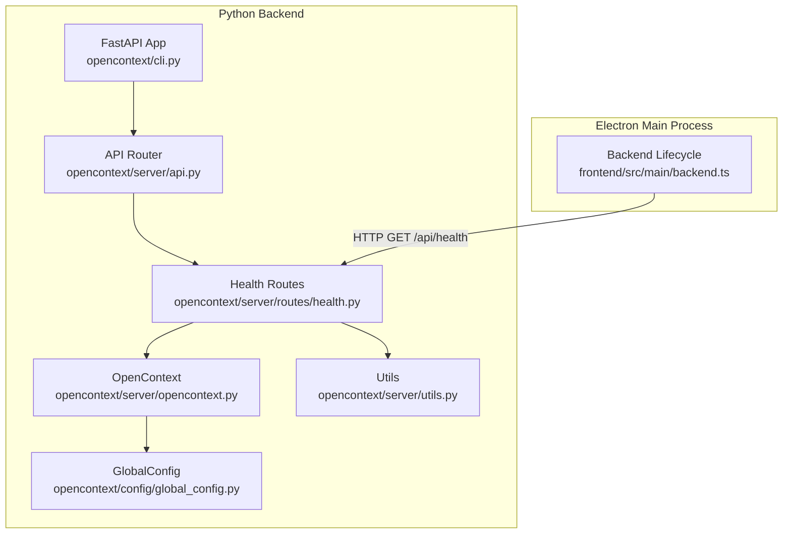
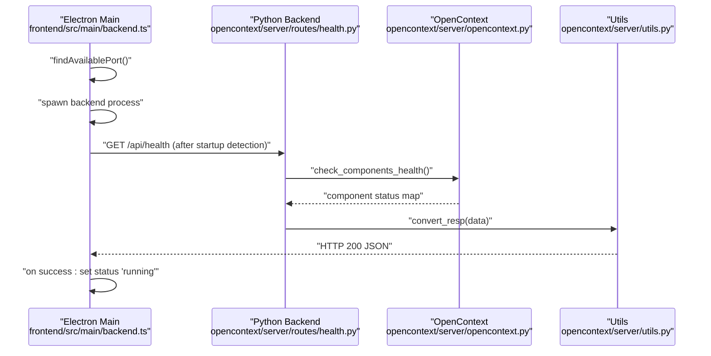
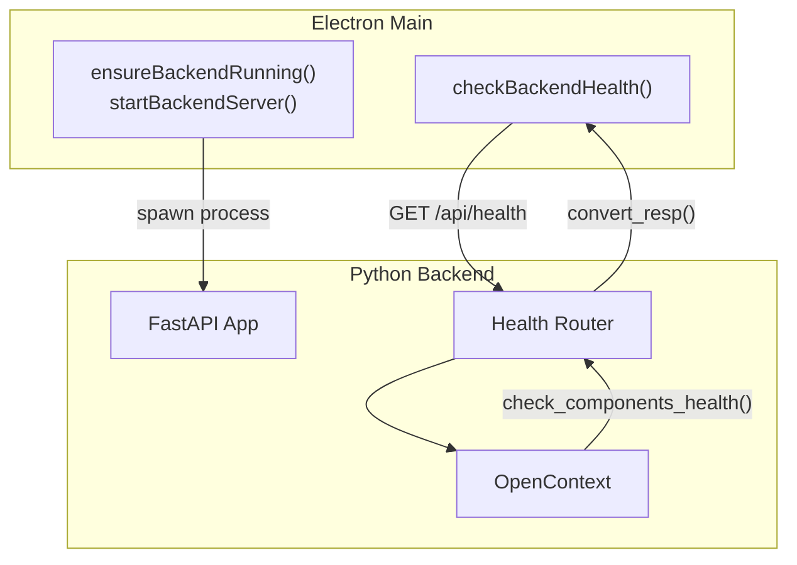
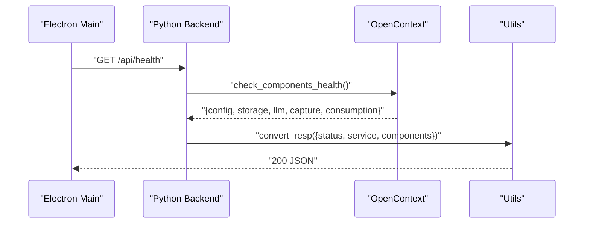
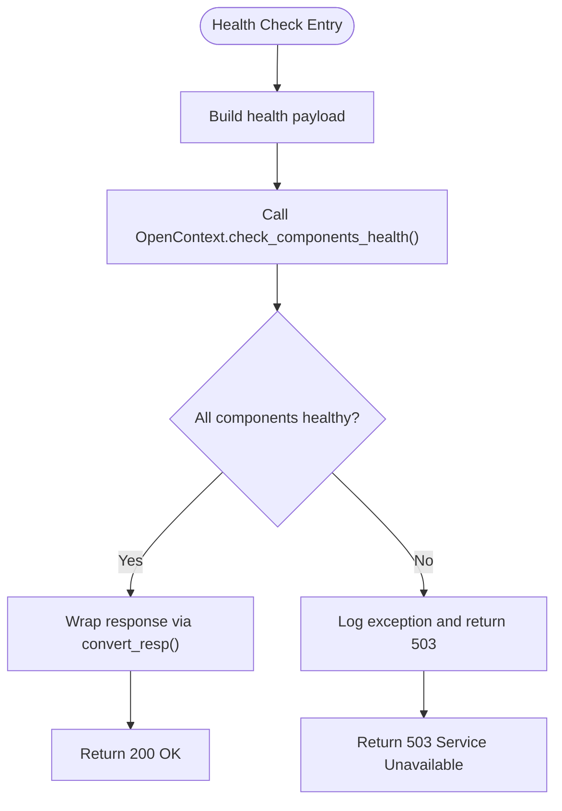
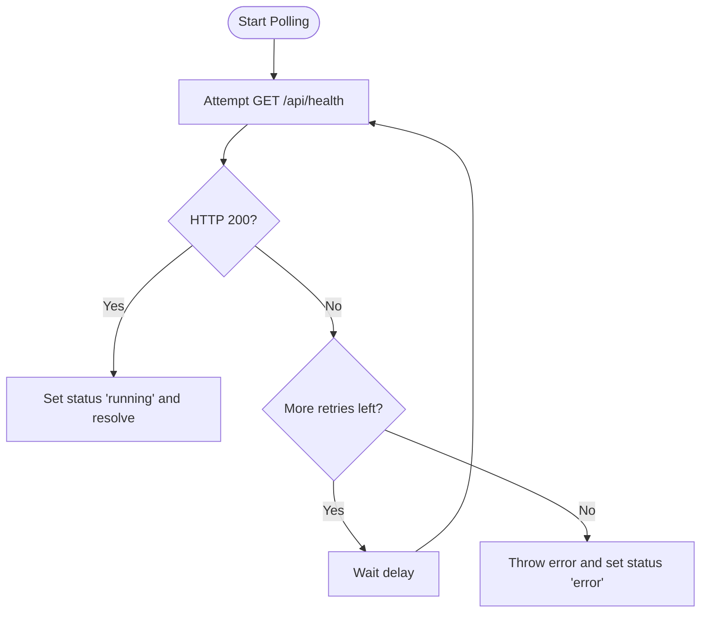
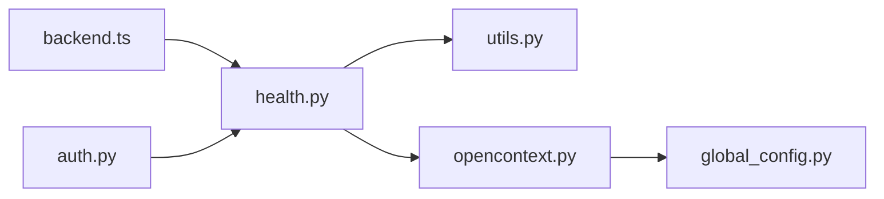

# Health Check API

<cite>
**Referenced Files in This Document**
- [health.py](file://opencontext/server/routes/health.py)
- [opencontext.py](file://opencontext/server/opencontext.py)
- [utils.py](file://opencontext/server/utils.py)
- [api.py](file://opencontext/server/api.py)
- [cli.py](file://opencontext/cli.py)
- [backend.ts](file://frontend/src/main/backend.ts)
- [auth.py](file://opencontext/server/middleware/auth.py)
- [global_config.py](file://opencontext/config/global_config.py)
</cite>

## Table of Contents
1. [Introduction](#introduction)
2. [Project Structure](#project-structure)
3. [Core Components](#core-components)
4. [Architecture Overview](#architecture-overview)
5. [Detailed Component Analysis](#detailed-component-analysis)
6. [Dependency Analysis](#dependency-analysis)
7. [Performance Considerations](#performance-considerations)
8. [Troubleshooting Guide](#troubleshooting-guide)
9. [Conclusion](#conclusion)

## Introduction
This document describes the Health Check API implemented in the Python backend and its integration with the Electron main process. It covers:
- The GET /health and GET /api/health endpoints
- Response schema and status codes
- How the backend verifies its own health and component dependencies
- How the Electron main process monitors the backend lifecycle using health checks
- Guidance for startup verification and system monitoring

## Project Structure
The health endpoints are defined in the Python FastAPI routes and wired into the main application via the API router. The Electron main process starts and monitors the backend process and performs health checks against the backend.

**Diagram sources**
- [cli.py](file://opencontext/cli.py#L55-L108)
- [api.py](file://opencontext/server/api.py#L37-L58)
- [health.py](file://opencontext/server/routes/health.py#L19-L41)
- [opencontext.py](file://opencontext/server/opencontext.py#L260-L270)
- [utils.py](file://opencontext/server/utils.py#L20-L41)
- [global_config.py](file://opencontext/config/global_config.py#L292-L331)
- [backend.ts](file://frontend/src/main/backend.ts#L87-L137)

**Section sources**
- [cli.py](file://opencontext/cli.py#L55-L108)
- [api.py](file://opencontext/server/api.py#L37-L58)
- [health.py](file://opencontext/server/routes/health.py#L19-L41)

## Core Components
- Health routes module defines two endpoints:
  - GET /health: lightweight health status
  - GET /api/health: detailed health including component status
- OpenContext exposes a component health checker that inspects core subsystems.
- Utilities provide standardized response formatting and dependency injection for OpenContext instances.
- Electron main process orchestrates backend lifecycle and performs periodic health checks.

Key responsibilities:
- Python backend: expose health endpoints, compute component health, and return structured responses.
- Electron main process: start backend, detect startup completion, and poll /api/health until healthy.

**Section sources**
- [health.py](file://opencontext/server/routes/health.py#L19-L41)
- [opencontext.py](file://opencontext/server/opencontext.py#L260-L270)
- [utils.py](file://opencontext/server/utils.py#L20-L41)
- [backend.ts](file://frontend/src/main/backend.ts#L87-L137)

## Architecture Overview
The health check flow spans the Electron main process and the Python backend:

**Diagram sources**
- [backend.ts](file://frontend/src/main/backend.ts#L347-L583)
- [backend.ts](file://frontend/src/main/backend.ts#L87-L137)
- [health.py](file://opencontext/server/routes/health.py#L25-L41)
- [opencontext.py](file://opencontext/server/opencontext.py#L260-L270)
- [utils.py](file://opencontext/server/utils.py#L28-L41)

## Detailed Component Analysis

### Health Endpoint: GET /health
Purpose:
- Lightweight system health indicator returning a simple status payload.

Behavior:
- Returns a standardized response with a success status and minimal metadata.
- Does not depend on OpenContext initialization.

Response schema:
- code: integer
- status: integer (HTTP-like)
- message: string
- data: object
  - status: string ("healthy")
  - service: string ("opencontext")

Status codes:
- 200 OK on success

Typical response shape:
- data.status equals "healthy"
- data.service equals "opencontext"

Integration:
- Exposed via the health routes module and included into the main API router.

**Section sources**
- [health.py](file://opencontext/server/routes/health.py#L19-L23)
- [api.py](file://opencontext/server/api.py#L42-L44)
- [utils.py](file://opencontext/server/utils.py#L28-L41)

### Health Endpoint: GET /api/health
Purpose:
- Comprehensive health check including service status and component health.

Behavior:
- Uses dependency injection to obtain the OpenContext instance from the FastAPI app state.
- Calls OpenContext.check_components_health() to gather component status.
- Wraps the result in a standardized response format.
- On exceptions, logs the error and returns a 503 Service Unavailable response.

Response schema:
- code: integer
- status: integer (HTTP-like)
- message: string
- data: object
  - status: string ("healthy")
  - service: string ("opencontext")
  - components: object
    - config: boolean
    - storage: boolean
    - llm: boolean
    - capture: boolean
    - consumption: boolean

Status codes:
- 200 OK on success
- 503 Service Unavailable on failure

Typical response shape:
- data.status equals "healthy"
- data.service equals "opencontext"
- data.components contains booleans for each subsystem

Error handling:
- Exceptions during health computation are logged and mapped to a 503 response.

**Section sources**
- [health.py](file://opencontext/server/routes/health.py#L25-L41)
- [opencontext.py](file://opencontext/server/opencontext.py#L260-L270)
- [utils.py](file://opencontext/server/utils.py#L20-L41)

### Component Health Checker: OpenContext.check_components_health()
Responsibilities:
- Inspects core subsystems and returns a boolean map indicating their health.
- Checks:
  - config: whether GlobalConfig is initialized
  - storage: whether GlobalStorage has a valid backend
  - llm: whether embedding and vision-language clients are initialized
  - capture: whether capture manager exists
  - consumption: whether consumption manager exists

This method is invoked by the detailed health endpoint to populate the components field.

**Section sources**
- [opencontext.py](file://opencontext/server/opencontext.py#L260-L270)
- [global_config.py](file://opencontext/config/global_config.py#L292-L331)

### Response Formatting Utility: convert_resp
Responsibility:
- Standardizes API responses with code, status, message, and optional data.
- Uses a custom JSON encoder to handle special types.

Used by:
- Health endpoints to return consistent response envelopes.

**Section sources**
- [utils.py](file://opencontext/server/utils.py#L28-L41)

### Authentication and Exclusions
Observation:
- Authentication middleware excludes health endpoints from API key enforcement.
- This allows the Electron main process to probe /api/health without providing credentials.

**Section sources**
- [auth.py](file://opencontext/server/middleware/auth.py#L50-L66)

### Electron Main Process Integration
Lifecycle orchestration:
- The Electron main process spawns the backend executable, detects startup completion, and polls /api/health until healthy.
- It retries health checks with a fixed interval and timeout.
- On success, it updates UI status and resolves startup.

Key behaviors:
- Port selection and availability checks
- Process spawning with environment and working directory
- Health polling loop with retries and timeouts
- Status transitions and IPC notifications

**Section sources**
- [backend.ts](file://frontend/src/main/backend.ts#L87-L137)
- [backend.ts](file://frontend/src/main/backend.ts#L347-L583)

## Architecture Overview

**Diagram sources**
- [backend.ts](file://frontend/src/main/backend.ts#L347-L583)
- [backend.ts](file://frontend/src/main/backend.ts#L87-L137)
- [health.py](file://opencontext/server/routes/health.py#L25-L41)
- [opencontext.py](file://opencontext/server/opencontext.py#L260-L270)
- [utils.py](file://opencontext/server/utils.py#L28-L41)

## Detailed Component Analysis

### GET /api/health Processing Flow

**Diagram sources**
- [backend.ts](file://frontend/src/main/backend.ts#L87-L137)
- [health.py](file://opencontext/server/routes/health.py#L25-L41)
- [opencontext.py](file://opencontext/server/opencontext.py#L260-L270)
- [utils.py](file://opencontext/server/utils.py#L28-L41)

### Health Check Algorithm Flow

**Diagram sources**
- [health.py](file://opencontext/server/routes/health.py#L25-L41)
- [opencontext.py](file://opencontext/server/opencontext.py#L260-L270)
- [utils.py](file://opencontext/server/utils.py#L28-L41)

### Electron Health Polling Flow

**Diagram sources**
- [backend.ts](file://frontend/src/main/backend.ts#L87-L137)

## Dependency Analysis
- Health routes depend on:
  - OpenContext for detailed health
  - Utils for response formatting
  - Auth middleware for exclusion rules
- OpenContext health depends on:
  - GlobalConfig initialization state
  - Storage and LLM client initialization
  - Capture and consumption managers existence
- Electron main process depends on:
  - Backend executable discovery and spawning
  - Port availability and process lifecycle management
  - Health polling and status transitions

**Diagram sources**
- [health.py](file://opencontext/server/routes/health.py#L19-L41)
- [utils.py](file://opencontext/server/utils.py#L20-L41)
- [opencontext.py](file://opencontext/server/opencontext.py#L260-L270)
- [global_config.py](file://opencontext/config/global_config.py#L292-L331)
- [backend.ts](file://frontend/src/main/backend.ts#L87-L137)
- [auth.py](file://opencontext/server/middleware/auth.py#L50-L66)

**Section sources**
- [health.py](file://opencontext/server/routes/health.py#L19-L41)
- [opencontext.py](file://opencontext/server/opencontext.py#L260-L270)
- [utils.py](file://opencontext/server/utils.py#L20-L41)
- [global_config.py](file://opencontext/config/global_config.py#L292-L331)
- [backend.ts](file://frontend/src/main/backend.ts#L87-L137)
- [auth.py](file://opencontext/server/middleware/auth.py#L50-L66)

## Performance Considerations
- Health checks are lightweight and synchronous; they should complete quickly.
- The Electron main process uses a bounded retry loop with a fixed delay and timeout to avoid excessive load.
- Standardized response formatting avoids unnecessary serialization overhead.

## Troubleshooting Guide
Common scenarios and remedies:
- Backend not reachable:
  - Verify the backend process is running and bound to the expected port.
  - Confirm the Electron main process selected an available port and spawned the correct executable.
- Health endpoint returns 503:
  - Inspect backend logs for exceptions raised during health computation.
  - Check component initialization (configuration loading, storage backend, LLM clients).
- Authentication interference:
  - Health endpoints are excluded from API key enforcement; ensure the path is not blocked by custom middleware.

Operational tips:
- Use the detailed health endpoint for diagnosing component failures.
- Monitor Electron main process logs for startup and health polling outcomes.

**Section sources**
- [backend.ts](file://frontend/src/main/backend.ts#L87-L137)
- [health.py](file://opencontext/server/routes/health.py#L35-L41)
- [auth.py](file://opencontext/server/middleware/auth.py#L50-L66)

## Conclusion
The Health Check API provides both a simple and a detailed health view of the system. The Electron main process uses the detailed endpoint to verify backend readiness and manage lifecycle events. The response schema and status codes are standardized, enabling straightforward integration with monitoring and alerting systems. The component health checker offers visibility into core subsystems, aiding rapid diagnosis of backend issues.