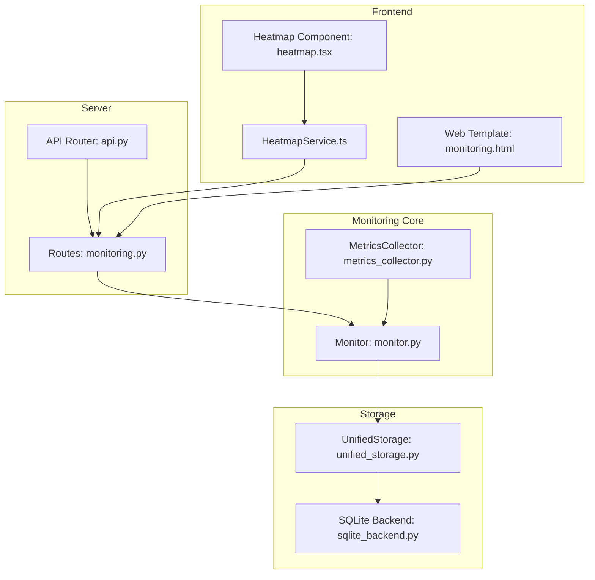
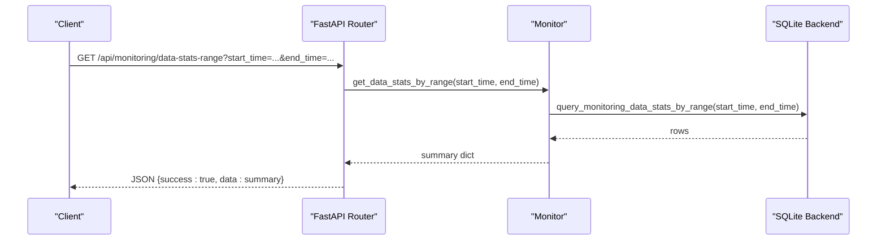
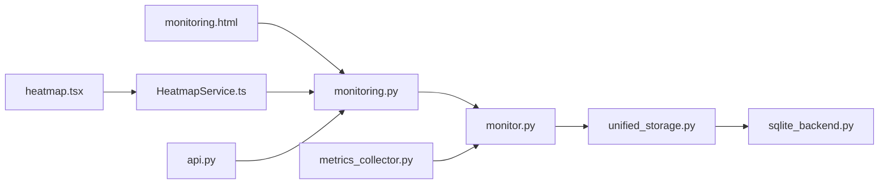
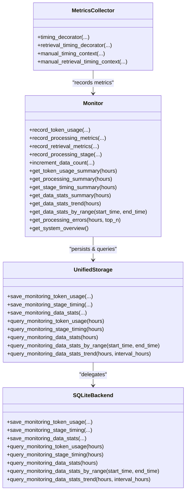

# Monitoring API

<cite>
**Referenced Files in This Document**
- [monitoring.py](file://opencontext/server/routes/monitoring.py)
- [monitor.py](file://opencontext/monitoring/monitor.py)
- [metrics_collector.py](file://opencontext/monitoring/metrics_collector.py)
- [sqlite_backend.py](file://opencontext/storage/backends/sqlite_backend.py)
- [unified_storage.py](file://opencontext/storage/unified_storage.py)
- [api.py](file://opencontext/server/api.py)
- [monitoring.html](file://opencontext/web/templates/monitoring.html)
- [HeatmapService.ts](file://frontend/src/main/services/HeatmapService.ts)
- [heatmap.tsx](file://frontend/src/renderer/src/pages/home/components/heatmap/heatmap.tsx)
</cite>

## Table of Contents
1. [Introduction](#introduction)
2. [Project Structure](#project-structure)
3. [Core Components](#core-components)
4. [Architecture Overview](#architecture-overview)
5. [Detailed Component Analysis](#detailed-component-analysis)
6. [Dependency Analysis](#dependency-analysis)
7. [Performance Considerations](#performance-considerations)
8. [Troubleshooting Guide](#troubleshooting-guide)
9. [Conclusion](#conclusion)
10. [Appendices](#appendices)

## Introduction
This document provides comprehensive documentation for the Monitoring API, focusing on the backend endpoints that expose system metrics and performance data, and how the frontend integrates with these endpoints to visualize monitoring insights. It covers:
- Endpoints for retrieving system metrics and performance data
- Response schemas for token usage, processing metrics, stage timing, and data statistics
- Integration with the frontend monitoring page and heatmap visualizations
- Guidance for troubleshooting performance issues and optimizing system configuration
- Relationship with the monitoring/monitor.py component that collects and persists metrics

## Project Structure
The Monitoring API is implemented as FastAPI routes under the server module and backed by a monitoring subsystem that records metrics and stores them in a SQLite database. The frontend integrates via HTML templates and React services.

**Diagram sources**
- [monitoring.py](file://opencontext/server/routes/monitoring.py#L1-L245)
- [monitor.py](file://opencontext/monitoring/monitor.py#L1-L823)
- [metrics_collector.py](file://opencontext/monitoring/metrics_collector.py#L1-L208)
- [unified_storage.py](file://opencontext/storage/unified_storage.py#L702-L741)
- [sqlite_backend.py](file://opencontext/storage/backends/sqlite_backend.py#L166-L217)
- [api.py](file://opencontext/server/api.py#L1-L58)
- [monitoring.html](file://opencontext/web/templates/monitoring.html#L1-L607)
- [HeatmapService.ts](file://frontend/src/main/services/HeatmapService.ts#L1-L476)
- [heatmap.tsx](file://frontend/src/renderer/src/pages/home/components/heatmap/heatmap.tsx#L1-L277)

**Section sources**
- [monitoring.py](file://opencontext/server/routes/monitoring.py#L1-L245)
- [monitor.py](file://opencontext/monitoring/monitor.py#L1-L823)
- [metrics_collector.py](file://opencontext/monitoring/metrics_collector.py#L1-L208)
- [sqlite_backend.py](file://opencontext/storage/backends/sqlite_backend.py#L166-L217)
- [unified_storage.py](file://opencontext/storage/unified_storage.py#L702-L741)
- [api.py](file://opencontext/server/api.py#L1-L58)
- [monitoring.html](file://opencontext/web/templates/monitoring.html#L1-L607)
- [HeatmapService.ts](file://frontend/src/main/services/HeatmapService.ts#L1-L476)
- [heatmap.tsx](file://frontend/src/renderer/src/pages/home/components/heatmap/heatmap.tsx#L1-L277)

## Core Components
- Monitoring Routes: Expose endpoints for system overview, token usage, processing metrics, stage timing, data statistics, and health checks.
- Monitor: Central collector and summarizer that records metrics, maintains caches, and queries storage.
- MetricsCollector: Decorators and context managers to automatically measure processing and retrieval durations.
- Storage Layer: Unified storage delegates monitoring persistence to SQLite backend with dedicated tables for token usage, stage timing, and data stats.
- Frontend Integration: Web template and React services consume the Monitoring API to render charts and heatmaps.

**Section sources**
- [monitoring.py](file://opencontext/server/routes/monitoring.py#L23-L245)
- [monitor.py](file://opencontext/monitoring/monitor.py#L90-L741)
- [metrics_collector.py](file://opencontext/monitoring/metrics_collector.py#L21-L208)
- [sqlite_backend.py](file://opencontext/storage/backends/sqlite_backend.py#L166-L217)
- [unified_storage.py](file://opencontext/storage/unified_storage.py#L702-L741)
- [monitoring.html](file://opencontext/web/templates/monitoring.html#L216-L607)
- [HeatmapService.ts](file://frontend/src/main/services/HeatmapService.ts#L1-L476)

## Architecture Overview
The Monitoring API follows a layered architecture:
- API Layer: FastAPI routes under /api/monitoring
- Service Layer: Monitor class orchestrates metrics collection, caching, and aggregation
- Persistence Layer: SQLite tables for monitoring data with indexes for efficient querying
- Presentation Layer: Web template and React services visualize metrics and trends

**Diagram sources**
- [monitoring.py](file://opencontext/server/routes/monitoring.py#L144-L168)
- [monitor.py](file://opencontext/monitoring/monitor.py#L449-L486)
- [sqlite_backend.py](file://opencontext/storage/backends/sqlite_backend.py#L1197-L1231)

## Detailed Component Analysis

### Monitoring Routes
Key endpoints exposed by the Monitoring API:
- GET /api/monitoring/overview
  - Returns system overview including uptime, context type counts, token usage summaries, processing metrics, stage timing, and data stats.
- GET /api/monitoring/token-usage?hours=N
  - Returns token usage summary aggregated by model.
- GET /api/monitoring/processing?hours=N
  - Returns processing performance summary by processor and context type.
- GET /api/monitoring/stage-timing?hours=N
  - Returns stage timing summary for LLM API calls and processing stages.
- GET /api/monitoring/data-stats?hours=N
  - Returns aggregated data statistics by data_type and context_type.
- GET /api/monitoring/data-stats-trend?hours=N
  - Returns time-series data for screenshots, documents, and contexts.
- GET /api/monitoring/data-stats-range?start_time=…&end_time=…
  - Returns aggregated statistics for a custom time range.
- GET /api/monitoring/health
  - Returns monitor health and uptime.
- GET /api/monitoring/processing-errors?hours=N&top=M
  - Returns top N processing errors within the time window.
- GET /api/monitoring/recording-stats
  - Returns current recording session statistics.
- POST /api/monitoring/recording-stats/reset
  - Resets recording session statistics.
- POST /api/monitoring/refresh-context-stats
  - Forces refresh of context type statistics cache.

Response schema patterns:
- Success envelope: { "success": true, "data": {...} }
- Error envelope: { "success": false, "error": "..." } or raises HTTPException

Notes:
- Authentication is enforced via auth_dependency.
- Some endpoints accept hours and top query parameters with bounds validation.

**Section sources**
- [monitoring.py](file://opencontext/server/routes/monitoring.py#L23-L245)

### Monitor: Data Collection and Aggregation
Responsibilities:
- Maintain in-memory histories for token usage, processing metrics, retrieval metrics, and processing errors.
- Cache context type statistics with TTL.
- Persist monitoring data to storage via UnifiedStorage.
- Provide summary and trend functions for API consumers.

Key methods:
- record_token_usage(model, prompt_tokens, completion_tokens, total_tokens)
- record_processing_metrics(processor_name, operation, duration_ms, context_type, context_count)
- record_retrieval_metrics(operation, duration_ms, snippets_count, query)
- record_processing_stage(stage_name, duration_ms, status, metadata)
- increment_data_count(data_type, count, context_type, metadata)
- get_token_usage_summary(hours)
- get_processing_summary(hours)
- get_stage_timing_summary(hours)
- get_data_stats_summary(hours)
- get_data_stats_trend(hours)
- get_data_stats_by_range(start_time, end_time)
- get_processing_errors(hours, top_n)
- get_system_overview()

Thread safety:
- Uses an RLock to protect shared mutable state.

Persistence:
- Delegates to get_storage().save_* and query_* methods.

**Section sources**
- [monitor.py](file://opencontext/monitoring/monitor.py#L90-L741)
- [unified_storage.py](file://opencontext/storage/unified_storage.py#L702-L741)

### MetricsCollector: Automatic Timing Decorators
Provides:
- timing_decorator(processor_name, operation, context_type)
  - Measures execution time of decorated functions and records processing metrics.
- retrieval_timing_decorator(operation)
  - Measures retrieval operations and records retrieval metrics.
- Manual timing contexts:
  - TimingContext and RetrievalTimingContext for explicit timing blocks.

Behavior:
- Calculates duration_ms and context_count/snippets_count heuristically.
- Records metrics via get_monitor().

**Section sources**
- [metrics_collector.py](file://opencontext/monitoring/metrics_collector.py#L21-L208)

### Storage: SQLite Backend for Monitoring Tables
Tables:
- monitoring_token_usage: time_bucket, model, prompt_tokens, completion_tokens, total_tokens
- monitoring_stage_timing: time_bucket, stage_name, count, total_duration_ms, min_duration_ms, max_duration_ms, avg_duration_ms, success_count, error_count, metadata
- monitoring_data_stats: time_bucket, data_type, count, context_type, metadata

Indexes:
- Created on created_at, model, stage_name, data_type for efficient queries.

Query methods:
- query_monitoring_token_usage(hours)
- query_monitoring_stage_timing(hours)
- query_monitoring_data_stats(hours)
- query_monitoring_data_stats_by_range(start_time, end_time)
- query_monitoring_data_stats_trend(hours, interval_hours)

**Section sources**
- [sqlite_backend.py](file://opencontext/storage/backends/sqlite_backend.py#L166-L217)
- [sqlite_backend.py](file://opencontext/storage/backends/sqlite_backend.py#L1166-L1279)

### Frontend Integration: monitoring.html
The monitoring.html template consumes the Monitoring API to render:
- System overview (uptime, last updated)
- Token usage statistics and distribution
- Stage timing bar chart
- Context type distribution (24h vs all-time)
- Data processing trend (time series)
- Processing errors table

It uses Chart.js to visualize data and fetches from:
- /api/monitoring/overview
- /api/monitoring/token-usage?hours=24|168
- /api/monitoring/stage-timing?hours=24
- /api/monitoring/data-stats?hours=24
- /api/monitoring/data-stats-trend?hours=24
- /api/monitoring/processing-errors?hours=24&top=20

**Section sources**
- [monitoring.html](file://opencontext/web/templates/monitoring.html#L216-L607)

### Frontend Integration: Heatmap Visualizations
The HeatmapService aggregates multiple data sources including monitoring data:
- Retrieves aggregated monitoring stats for a date range via /api/monitoring/data-stats-range
- Distributes aggregated counts evenly across days to produce daily time series for the heatmap
- Combines with todos, conversations, and vaults data to compute totals

The React heatmap component renders a calendar-style heatmap and allows navigation between years/months/days.

**Section sources**
- [HeatmapService.ts](file://frontend/src/main/services/HeatmapService.ts#L1-L476)
- [heatmap.tsx](file://frontend/src/renderer/src/pages/home/components/heatmap/heatmap.tsx#L1-L277)

## Dependency Analysis

**Diagram sources**
- [monitoring.py](file://opencontext/server/routes/monitoring.py#L1-L245)
- [monitor.py](file://opencontext/monitoring/monitor.py#L1-L823)
- [metrics_collector.py](file://opencontext/monitoring/metrics_collector.py#L1-L208)
- [unified_storage.py](file://opencontext/storage/unified_storage.py#L702-L741)
- [sqlite_backend.py](file://opencontext/storage/backends/sqlite_backend.py#L166-L217)
- [monitoring.html](file://opencontext/web/templates/monitoring.html#L1-L607)
- [HeatmapService.ts](file://frontend/src/main/services/HeatmapService.ts#L1-L476)
- [heatmap.tsx](file://frontend/src/renderer/src/pages/home/components/heatmap/heatmap.tsx#L1-L277)
- [api.py](file://opencontext/server/api.py#L1-L58)

**Section sources**
- [monitoring.py](file://opencontext/server/routes/monitoring.py#L1-L245)
- [monitor.py](file://opencontext/monitoring/monitor.py#L1-L823)
- [metrics_collector.py](file://opencontext/monitoring/metrics_collector.py#L1-L208)
- [sqlite_backend.py](file://opencontext/storage/backends/sqlite_backend.py#L166-L217)
- [unified_storage.py](file://opencontext/storage/unified_storage.py#L702-L741)
- [api.py](file://opencontext/server/api.py#L1-L58)
- [monitoring.html](file://opencontext/web/templates/monitoring.html#L1-L607)
- [HeatmapService.ts](file://frontend/src/main/services/HeatmapService.ts#L1-L476)
- [heatmap.tsx](file://frontend/src/renderer/src/pages/home/components/heatmap/heatmap.tsx#L1-L277)

## Performance Considerations
- Caching: Context type statistics are cached with a TTL to reduce database load.
- History limits: In-memory histories are bounded (e.g., deques with maxlen) to control memory usage.
- Indexes: SQLite indexes on monitoring tables improve query performance for time-based filters.
- Time bucketing: Data is stored in hourly buckets to enable efficient trend queries.
- Concurrency: Monitor uses an RLock to guard shared state during concurrent metric recording.

[No sources needed since this section provides general guidance]

## Troubleshooting Guide
Common issues and resolutions:
- API returns error envelopes
  - Check authentication and ensure auth_dependency passes.
  - Inspect HTTPException details returned by endpoints.
- Empty or stale metrics
  - Verify that MetricsCollector decorators are applied around critical processing and retrieval functions.
  - Confirm that recording functions are invoked (e.g., record_processing_metrics, record_retrieval_metrics).
- Time range validation failures
  - Ensure start_time precedes end_time for /api/monitoring/data-stats-range.
- Storage initialization failures
  - Confirm SQLite backend initialization succeeds and tables are created.
  - Check database path configuration and permissions.

**Section sources**
- [monitoring.py](file://opencontext/server/routes/monitoring.py#L144-L168)
- [monitor.py](file://opencontext/monitoring/monitor.py#L120-L132)
- [sqlite_backend.py](file://opencontext/storage/backends/sqlite_backend.py#L40-L65)

## Conclusion
The Monitoring API provides a robust foundation for collecting, aggregating, and exposing system metrics and performance data. The Monitor component centralizes metric recording and caching, while the SQLite backend ensures reliable persistence and efficient querying. The frontend integrates seamlessly via both the monitoring.html template and the HeatmapService, enabling rich visualizations of system behavior over time.

[No sources needed since this section summarizes without analyzing specific files]

## Appendices

### Endpoints Reference
- GET /api/monitoring/overview
  - Purpose: System overview including uptime, context types, token usage, processing, stage timing, and data stats.
  - Response: { "success": true, "data": {...} }
- GET /api/monitoring/token-usage?hours=N
  - Purpose: Token usage summary by model.
  - Response: { "success": true, "data": {...} }
- GET /api/monitoring/processing?hours=N
  - Purpose: Processing performance summary by processor and context type.
  - Response: { "success": true, "data": {...} }
- GET /api/monitoring/stage-timing?hours=N
  - Purpose: Stage timing summary for LLM API calls and processing stages.
  - Response: { "success": true, "data": {...} }
- GET /api/monitoring/data-stats?hours=N
  - Purpose: Aggregated data statistics by data_type and context_type.
  - Response: { "success": true, "data": {...} }
- GET /api/monitoring/data-stats-trend?hours=N
  - Purpose: Time-series data for screenshots, documents, and contexts.
  - Response: { "success": true, "data": {...} }
- GET /api/monitoring/data-stats-range?start_time=…&end_time=…
  - Purpose: Aggregated statistics for a custom time range.
  - Response: { "success": true, "data": {...} }
- GET /api/monitoring/health
  - Purpose: Monitor health and uptime.
  - Response: { "success": true, "data": {"monitor_active": true, "uptime_seconds": N} }
- GET /api/monitoring/processing-errors?hours=N&top=M
  - Purpose: Top N processing errors within the time window.
  - Response: { "success": true, "data": {...} }
- GET /api/monitoring/recording-stats
  - Purpose: Current recording session statistics.
  - Response: { "success": true, "data": {...} }
- POST /api/monitoring/recording-stats/reset
  - Purpose: Reset recording session statistics.
  - Response: { "success": true, "message": "..." }
- POST /api/monitoring/refresh-context-stats
  - Purpose: Force refresh of context type statistics cache.
  - Response: { "success": true, "data": {...}, "message": "..." }

**Section sources**
- [monitoring.py](file://opencontext/server/routes/monitoring.py#L23-L245)

### Response Schema Details
- Token usage summary
  - Fields: total_records, by_model (map of model to counts and totals), total_tokens, total_prompt_tokens, total_completion_tokens
- Processing summary
  - Fields: total_operations, by_processor (processor:operation -> count, total_duration, avg_duration, contexts), by_context_type (context_type -> count, total_duration, avg_duration), avg_duration_ms, total_contexts_processed
- Stage timing summary
  - Fields: total_operations, by_stage (stage_name -> count, total_duration, avg_duration, success_count, error_count), avg_duration_ms
- Data statistics summary
  - Fields: by_data_type (data_type -> total), total_data_processed, by_context_type (context_type -> total)
- Data statistics trend
  - Fields: trend (screenshot, document, context -> list of {timestamp, count}), timestamps (sorted)
- Data statistics by range
  - Fields: by_data_type, total_data_processed, by_context_type, time_range (start_time, end_time)
- Processing errors
  - Fields: errors (list of {error_message, processor_name, context_count, timestamp}), total_errors, time_range_hours

**Section sources**
- [monitor.py](file://opencontext/monitoring/monitor.py#L236-L486)

### Using Monitoring Data for Troubleshooting and Optimization
- Performance bottlenecks
  - Review stage-timing and processing summaries to identify slow stages and processors.
  - Use data-stats-trend to detect spikes in data volume that correlate with performance drops.
- Cost control
  - Monitor token-usage summaries to track model usage and optimize prompts or chunk sizes.
- Reliability
  - Track processing-errors to identify recurring issues and address root causes.
- Capacity planning
  - Use data-stats-range to understand growth trends and adjust infrastructure accordingly.

**Section sources**
- [monitoring.py](file://opencontext/server/routes/monitoring.py#L57-L168)
- [monitor.py](file://opencontext/monitoring/monitor.py#L236-L486)

### Relationship with monitoring/monitor.py
- The monitoring routes depend on get_monitor() to access the singleton Monitor instance.
- MetricsCollector decorators and manual timing contexts record metrics that Monitor aggregates and persists.
- Monitor delegates persistence to UnifiedStorage, which routes to SQLite backend tables.

**Diagram sources**
- [monitor.py](file://opencontext/monitoring/monitor.py#L90-L741)
- [metrics_collector.py](file://opencontext/monitoring/metrics_collector.py#L21-L208)
- [unified_storage.py](file://opencontext/storage/unified_storage.py#L702-L741)
- [sqlite_backend.py](file://opencontext/storage/backends/sqlite_backend.py#L166-L217)